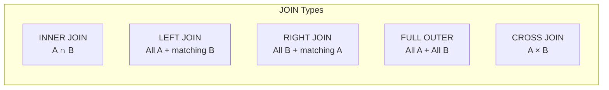
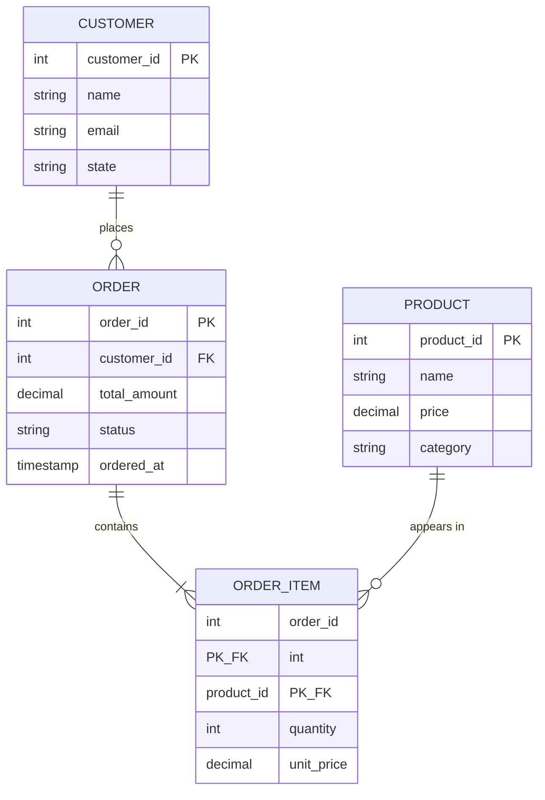
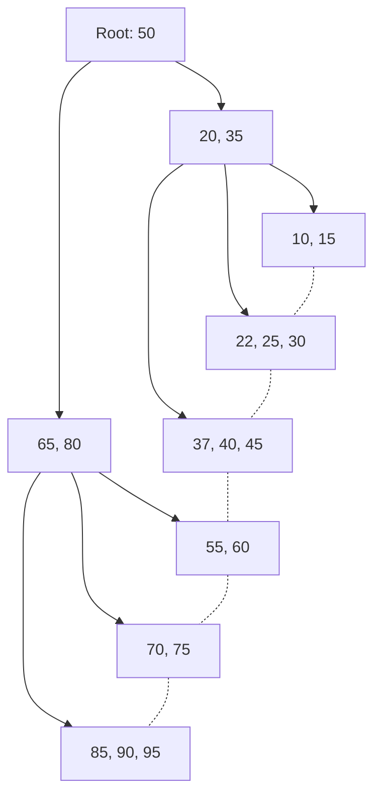
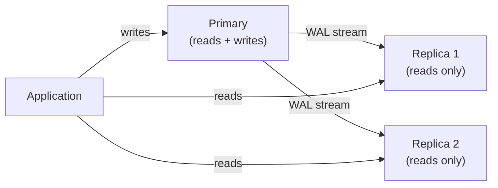
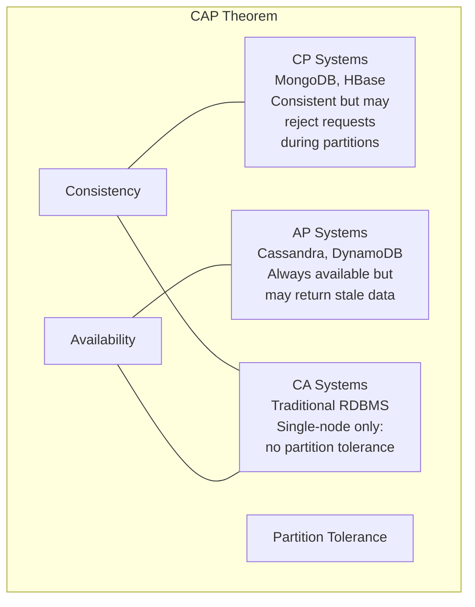

# Data Management

Every application you will build or operate stores data. User accounts, financial transactions, product catalogs, log entries, configuration state -- all of it must be written, read, updated, and deleted reliably, often by hundreds of concurrent users simultaneously. The difference between an application that works and one that corrupts data, loses transactions, or grinds to a halt under load is the data management layer.

This domain teaches you the theory and practice of managing data at every level: the mathematical foundations of the relational model, the SQL language that implements it, the normalization principles that prevent data anomalies, the transaction mechanisms that guarantee consistency, the index structures that make queries fast, and the operational practices that keep databases running in production. You will also learn when relational databases are not the right tool and how NoSQL systems make different tradeoffs.

## Why It Matters

A single corrupted transaction in a banking system can cascade into millions of dollars in errors. A missing index on a table with ten million rows can turn a 2-millisecond query into a 45-second full table scan that brings down your application. A schema migration executed without a rollback plan can take your production database offline. These are not hypothetical scenarios. They happen every day at companies of every size.

Understanding data management means you can design schemas that prevent anomalies before they occur, write queries that perform well at scale, reason about what happens when two transactions conflict, diagnose slow queries by reading execution plans, and operate databases with confidence in production. Without this knowledge, you are guessing -- and databases punish guesses.

## What You'll Learn

- How the relational model represents data mathematically and why SQL exists as its implementation
- How to write SQL queries from simple selects through joins, subqueries, window functions, and CTEs
- How normalization eliminates data anomalies and when denormalization is justified
- How ACID transactions work, what isolation levels mean, and how databases handle concurrency
- How B-tree indexes accelerate queries and how to read execution plans
- How to operate databases in production: backups, replication, migrations, connection pooling, monitoring
- When to use relational databases and when NoSQL systems are a better fit

---

## A. The Relational Model

### Theory

The relational model was introduced by Edgar F. Codd in 1970. It represents data as mathematical relations -- sets of tuples with named attributes. In practice, these map to tables, rows, and columns, but the mathematical foundation matters because it is what makes relational databases predictable and provably correct.

**Tables, Rows, and Columns**

A **relation** (table) is a set of tuples (rows). Each tuple contains values for a fixed set of attributes (columns). Every attribute has a domain -- the set of allowed values (integer, text, date, etc.). The order of rows in a relation is undefined. The order of columns is defined by the schema but irrelevant to the model.

**Keys**

Keys enforce uniqueness and establish relationships between tables:

| Key Type | Definition | Example |
|----------|-----------|---------|
| Primary Key | Uniquely identifies each row. Cannot be NULL. One per table. | `user_id` in a `users` table |
| Foreign Key | References a primary key in another table. Enforces referential integrity. | `user_id` in an `orders` table referencing `users(user_id)` |
| Candidate Key | Any column or combination that could serve as primary key. | `email` in `users` (unique, not null) |
| Composite Key | A key made of two or more columns together. | `(student_id, course_id)` in an `enrollments` table |
| Surrogate Key | An artificial key with no business meaning (auto-increment, UUID). | `id SERIAL PRIMARY KEY` |
| Natural Key | A key derived from real-world data. | `isbn` for books, `ssn` for people |

**Relational Algebra**

Relational algebra defines the operations you can perform on relations. Every SQL query the database executes is ultimately translated into these operations by the query optimizer.

| Operation | Symbol | Description | SQL Equivalent |
|-----------|--------|-------------|---------------|
| Selection | σ (sigma) | Filter rows by condition | `WHERE` |
| Projection | π (pi) | Select specific columns | `SELECT col1, col2` |
| Join | ⋈ (bowtie) | Combine rows from two relations on a condition | `JOIN ... ON` |
| Union | ∪ | All rows from both relations (no duplicates) | `UNION` |
| Difference | − | Rows in first relation but not second | `EXCEPT` |
| Intersection | ∩ | Rows in both relations | `INTERSECT` |
| Cartesian Product | × | Every row from first paired with every row from second | `CROSS JOIN` |
| Rename | ρ (rho) | Rename a relation or attribute | `AS` |

Example: "Find names of customers in New York" translates to:

```
π_name(σ_state='NY'(customers))
```

This reads: select rows where state is NY (selection), then extract only the name column (projection).

**Relational Calculus**

Where relational algebra says *how* to get the data (procedural), relational calculus says *what* data you want (declarative). SQL is actually closer to relational calculus in spirit -- you describe the result set, and the optimizer decides how to compute it.

Tuple relational calculus: `{ t.name | t ∈ customers ∧ t.state = 'NY' }`

This reads: "the set of name values from tuples t in customers where t.state equals NY."

The fundamental theorem of relational databases proves that relational algebra and relational calculus are equivalent in expressive power. Any query expressible in one can be expressed in the other.

### Practice

Install PostgreSQL and create your first tables:

```bash
# Ubuntu/Debian
sudo apt update && sudo apt install postgresql postgresql-client -y

# Start the service
sudo systemctl start postgresql
sudo systemctl enable postgresql

# Connect as the postgres superuser
sudo -u postgres psql
```

Create a database and tables:

```sql
-- Create a database
CREATE DATABASE learn_db;

-- Connect to it
\c learn_db

-- Create tables with keys
CREATE TABLE customers (
    customer_id SERIAL PRIMARY KEY,
    name VARCHAR(100) NOT NULL,
    email VARCHAR(255) UNIQUE NOT NULL,
    state CHAR(2) NOT NULL,
    created_at TIMESTAMP DEFAULT CURRENT_TIMESTAMP
);

CREATE TABLE orders (
    order_id SERIAL PRIMARY KEY,
    customer_id INTEGER NOT NULL REFERENCES customers(customer_id),
    total_amount DECIMAL(10, 2) NOT NULL,
    status VARCHAR(20) DEFAULT 'pending',
    ordered_at TIMESTAMP DEFAULT CURRENT_TIMESTAMP
);

CREATE TABLE order_items (
    order_id INTEGER REFERENCES orders(order_id),
    product_id INTEGER NOT NULL,
    quantity INTEGER NOT NULL CHECK (quantity > 0),
    unit_price DECIMAL(10, 2) NOT NULL,
    PRIMARY KEY (order_id, product_id)  -- Composite key
);
```

Insert data and write queries that map to relational algebra:

```sql
-- Insert sample data
INSERT INTO customers (name, email, state) VALUES
    ('Alice Chen', 'alice@example.com', 'NY'),
    ('Bob Martinez', 'bob@example.com', 'CA'),
    ('Carol Johnson', 'carol@example.com', 'NY'),
    ('Dave Wilson', 'dave@example.com', 'TX');

INSERT INTO orders (customer_id, total_amount, status) VALUES
    (1, 150.00, 'completed'),
    (1, 75.50, 'pending'),
    (2, 200.00, 'completed'),
    (3, 50.00, 'shipped');

-- Selection (σ): Filter rows
SELECT * FROM customers WHERE state = 'NY';

-- Projection (π): Select specific columns
SELECT name, email FROM customers;

-- Combined: π_name(σ_state='NY'(customers))
SELECT name FROM customers WHERE state = 'NY';

-- Join (⋈): Combine tables
SELECT c.name, o.total_amount, o.status
FROM customers c
JOIN orders o ON c.customer_id = o.customer_id;

-- Cartesian Product (×): Every combination
SELECT c.name, o.order_id
FROM customers c
CROSS JOIN orders o;
```

> **Try It**: Create a `products` table with columns `product_id`, `name`, `price`, and `category`. Insert at least five products. Write queries for: all products under $50 (selection), just product names and prices (projection), and all order items joined with their product names (join).

### Connection

Relational algebra is not academic decoration. It is literally what the query optimizer translates your SQL into. When you write `SELECT name FROM customers WHERE state = 'NY'`, PostgreSQL's planner converts this into a selection followed by a projection, then determines the most efficient physical operations (sequential scan, index scan, etc.) to execute them. Understanding relational algebra means you can reason about what the optimizer is doing and why a query plan looks the way it does. This connects directly to the indexing and query plan analysis you will do in Section D.

---

## B. SQL

### Theory

SQL (Structured Query Language) is the standard language for interacting with relational databases. It is divided into sublanguages:

| Sublanguage | Purpose | Key Statements |
|-------------|---------|---------------|
| DDL (Data Definition Language) | Define schema structure | `CREATE`, `ALTER`, `DROP`, `TRUNCATE` |
| DML (Data Manipulation Language) | Read and modify data | `SELECT`, `INSERT`, `UPDATE`, `DELETE` |
| DCL (Data Control Language) | Manage permissions | `GRANT`, `REVOKE` |
| TCL (Transaction Control Language) | Manage transactions | `BEGIN`, `COMMIT`, `ROLLBACK`, `SAVEPOINT` |

SQL is declarative. You state what result you want, not how to compute it. The database engine decides the execution strategy. This is the relational calculus influence -- you describe the desired set, and the optimizer finds the path.

### Practice

**DDL: Defining Structure**

```sql
-- CREATE: Build a new table
CREATE TABLE products (
    product_id SERIAL PRIMARY KEY,
    name VARCHAR(200) NOT NULL,
    price DECIMAL(10, 2) NOT NULL CHECK (price >= 0),
    category VARCHAR(50),
    in_stock BOOLEAN DEFAULT true,
    created_at TIMESTAMP DEFAULT CURRENT_TIMESTAMP
);

-- ALTER: Modify existing structure
ALTER TABLE products ADD COLUMN weight_kg DECIMAL(5, 2);
ALTER TABLE products ALTER COLUMN category SET NOT NULL;
ALTER TABLE products DROP COLUMN weight_kg;
ALTER TABLE products RENAME COLUMN in_stock TO is_available;

-- DROP: Remove a table entirely (destructive!)
DROP TABLE IF EXISTS products;

-- TRUNCATE: Remove all rows but keep the table structure
TRUNCATE TABLE order_items;
```

**DML: Manipulating Data**

```sql
-- INSERT: Add rows
INSERT INTO products (name, price, category) VALUES
    ('Mechanical Keyboard', 89.99, 'Electronics'),
    ('Standing Desk', 449.00, 'Furniture'),
    ('Monitor Arm', 34.99, 'Accessories'),
    ('USB-C Hub', 29.99, 'Electronics'),
    ('Desk Lamp', 42.00, 'Accessories');

-- SELECT: Read data
SELECT name, price FROM products WHERE category = 'Electronics';

-- UPDATE: Modify existing rows
UPDATE products SET price = price * 1.10 WHERE category = 'Electronics';

-- DELETE: Remove specific rows
DELETE FROM products WHERE is_available = false;
```

**DCL: Managing Permissions**

```sql
-- Create a role
CREATE ROLE app_user WITH LOGIN PASSWORD 'secure_password';

-- Grant specific privileges
GRANT SELECT, INSERT ON products TO app_user;
GRANT SELECT ON customers TO app_user;

-- Revoke privileges
REVOKE INSERT ON products FROM app_user;

-- Grant all on a schema
GRANT USAGE ON SCHEMA public TO app_user;
```

**TCL: Transaction Control**

```sql
-- Basic transaction
BEGIN;
UPDATE accounts SET balance = balance - 100 WHERE account_id = 1;
UPDATE accounts SET balance = balance + 100 WHERE account_id = 2;
COMMIT;

-- Transaction with savepoint
BEGIN;
INSERT INTO orders (customer_id, total_amount) VALUES (1, 500.00);
SAVEPOINT after_order;
INSERT INTO order_items (order_id, product_id, quantity, unit_price)
    VALUES (currval('orders_order_id_seq'), 1, 2, 250.00);
-- Something went wrong with items, roll back just that part
ROLLBACK TO after_order;
-- Fix and retry
INSERT INTO order_items (order_id, product_id, quantity, unit_price)
    VALUES (currval('orders_order_id_seq'), 2, 1, 500.00);
COMMIT;
```

**JOINs**

Joins combine rows from two or more tables based on a related column:

```sql
-- INNER JOIN: Only matching rows from both tables
SELECT c.name, o.order_id, o.total_amount
FROM customers c
INNER JOIN orders o ON c.customer_id = o.customer_id;

-- LEFT JOIN: All rows from left table, matching from right (NULL if no match)
SELECT c.name, o.order_id, o.total_amount
FROM customers c
LEFT JOIN orders o ON c.customer_id = o.customer_id;
-- Dave Wilson appears with NULL order_id (no orders)

-- RIGHT JOIN: All rows from right table, matching from left
SELECT c.name, o.order_id, o.total_amount
FROM customers c
RIGHT JOIN orders o ON c.customer_id = o.customer_id;

-- FULL OUTER JOIN: All rows from both tables
SELECT c.name, o.order_id
FROM customers c
FULL OUTER JOIN orders o ON c.customer_id = o.customer_id;

-- CROSS JOIN: Cartesian product (every combination)
SELECT c.name, p.name AS product
FROM customers c
CROSS JOIN products p;

-- Self JOIN: Table joined to itself
-- Example: Find customers in the same state
SELECT a.name AS customer1, b.name AS customer2, a.state
FROM customers a
JOIN customers b ON a.state = b.state AND a.customer_id < b.customer_id;
```



**Subqueries**

```sql
-- Scalar subquery: Returns a single value
SELECT name, price,
    price - (SELECT AVG(price) FROM products) AS diff_from_avg
FROM products;

-- Table subquery: Returns a set of rows
SELECT name, total_amount
FROM orders
WHERE customer_id IN (
    SELECT customer_id FROM customers WHERE state = 'NY'
);

-- Correlated subquery: References outer query (runs once per outer row)
SELECT c.name,
    (SELECT COUNT(*) FROM orders o WHERE o.customer_id = c.customer_id) AS order_count
FROM customers c;

-- EXISTS: Check if subquery returns any rows
SELECT c.name
FROM customers c
WHERE EXISTS (
    SELECT 1 FROM orders o
    WHERE o.customer_id = c.customer_id AND o.status = 'completed'
);
```

**Aggregation**

```sql
-- GROUP BY with aggregate functions
SELECT category, COUNT(*) AS product_count, AVG(price) AS avg_price
FROM products
GROUP BY category;

-- HAVING: Filter groups (WHERE filters rows, HAVING filters groups)
SELECT category, COUNT(*) AS product_count
FROM products
GROUP BY category
HAVING COUNT(*) >= 2;

-- Multiple aggregates
SELECT
    c.state,
    COUNT(DISTINCT c.customer_id) AS customer_count,
    COUNT(o.order_id) AS order_count,
    SUM(o.total_amount) AS total_revenue,
    AVG(o.total_amount) AS avg_order_value
FROM customers c
LEFT JOIN orders o ON c.customer_id = o.customer_id
GROUP BY c.state
ORDER BY total_revenue DESC NULLS LAST;
```

**Window Functions**

Window functions perform calculations across a set of rows related to the current row without collapsing them into a single output row (unlike `GROUP BY`):

```sql
-- ROW_NUMBER: Assign sequential numbers
SELECT
    name, category, price,
    ROW_NUMBER() OVER (ORDER BY price DESC) AS price_rank
FROM products;

-- ROW_NUMBER with PARTITION BY: Number within groups
SELECT
    name, category, price,
    ROW_NUMBER() OVER (PARTITION BY category ORDER BY price DESC) AS rank_in_category
FROM products;

-- RANK and DENSE_RANK: Handle ties
SELECT
    name, price,
    RANK() OVER (ORDER BY price DESC) AS rank,        -- Gaps after ties
    DENSE_RANK() OVER (ORDER BY price DESC) AS dense   -- No gaps
FROM products;

-- LAG and LEAD: Access previous/next rows
SELECT
    order_id, customer_id, ordered_at, total_amount,
    LAG(total_amount) OVER (PARTITION BY customer_id ORDER BY ordered_at) AS prev_order,
    LEAD(total_amount) OVER (PARTITION BY customer_id ORDER BY ordered_at) AS next_order,
    total_amount - LAG(total_amount) OVER (
        PARTITION BY customer_id ORDER BY ordered_at
    ) AS change_from_prev
FROM orders;

-- Running total
SELECT
    order_id, customer_id, total_amount,
    SUM(total_amount) OVER (
        PARTITION BY customer_id ORDER BY ordered_at
        ROWS BETWEEN UNBOUNDED PRECEDING AND CURRENT ROW
    ) AS running_total
FROM orders;
```

**Common Table Expressions (CTEs)**

```sql
-- Basic CTE: Named temporary result set
WITH ny_customers AS (
    SELECT customer_id, name
    FROM customers
    WHERE state = 'NY'
)
SELECT nc.name, o.order_id, o.total_amount
FROM ny_customers nc
JOIN orders o ON nc.customer_id = o.customer_id;

-- Multiple CTEs
WITH customer_orders AS (
    SELECT customer_id, COUNT(*) AS order_count, SUM(total_amount) AS total_spent
    FROM orders
    GROUP BY customer_id
),
high_value AS (
    SELECT customer_id, total_spent
    FROM customer_orders
    WHERE total_spent > 100
)
SELECT c.name, hv.total_spent
FROM high_value hv
JOIN customers c ON hv.customer_id = c.customer_id;

-- Recursive CTE: Self-referencing for hierarchical data
CREATE TABLE employees (
    employee_id SERIAL PRIMARY KEY,
    name VARCHAR(100) NOT NULL,
    manager_id INTEGER REFERENCES employees(employee_id)
);

INSERT INTO employees (name, manager_id) VALUES
    ('CEO', NULL),
    ('VP Engineering', 1),
    ('VP Sales', 1),
    ('Engineering Manager', 2),
    ('Senior Developer', 4),
    ('Junior Developer', 4),
    ('Sales Manager', 3);

-- Find the full management chain
WITH RECURSIVE org_chart AS (
    -- Base case: top-level (no manager)
    SELECT employee_id, name, manager_id, 0 AS depth,
           name::TEXT AS path
    FROM employees
    WHERE manager_id IS NULL

    UNION ALL

    -- Recursive case: employees with a manager already in the result
    SELECT e.employee_id, e.name, e.manager_id, oc.depth + 1,
           oc.path || ' > ' || e.name
    FROM employees e
    JOIN org_chart oc ON e.manager_id = oc.employee_id
)
SELECT depth, name, path FROM org_chart ORDER BY path;
```

**Set Operations**

```sql
-- UNION: Combine results, remove duplicates
SELECT name FROM customers WHERE state = 'NY'
UNION
SELECT name FROM customers WHERE state = 'CA';

-- UNION ALL: Combine results, keep duplicates (faster)
SELECT name, 'customer' AS type FROM customers
UNION ALL
SELECT name, 'product' AS type FROM products;

-- INTERSECT: Rows in both result sets
SELECT customer_id FROM orders WHERE status = 'completed'
INTERSECT
SELECT customer_id FROM orders WHERE total_amount > 100;

-- EXCEPT: Rows in first but not second
SELECT customer_id FROM customers
EXCEPT
SELECT customer_id FROM orders;
-- Customers who have never placed an order
```

> **Try It**: Write a query using a CTE and window function that ranks each customer's orders by total amount within each customer, and shows the running total of their spending over time. Then write a recursive CTE that generates the numbers 1 through 20.

### Connection

SQL is the interface between your application and the relational model. Every query you write is parsed, planned, and optimized by the database engine. Understanding the full range of SQL -- joins, subqueries, window functions, CTEs -- means you can express complex data requirements in a single query rather than pulling data into application code and processing it there. This matters for performance: the database engine has access to indexes, statistics, and parallel execution that your application code does not. A well-written SQL query will almost always outperform the equivalent logic in Python or JavaScript.

---

## C. Data Modeling and Normalization

### Theory

**Entity-Relationship (ER) Diagrams**

ER diagrams model the structure of data before you write any SQL. They capture:

- **Entities**: Things that exist independently (Customer, Order, Product)
- **Attributes**: Properties of entities (name, email, price)
- **Relationships**: How entities relate (a customer *places* orders)
- **Cardinality**: How many of one entity relate to another (one-to-many, many-to-many)



Cardinality notation:

| Symbol | Meaning |
|--------|---------|
| `\|\|` | Exactly one |
| `o\|` | Zero or one |
| `\|{` | One or more |
| `o{` | Zero or more |

**Normalization**

Normalization is the process of organizing data to eliminate redundancy and prevent anomalies. Each normal form builds on the previous one:

**First Normal Form (1NF): Atomic Values**

A table is in 1NF if every column contains only atomic (indivisible) values. No repeating groups or arrays.

Violation:

| order_id | customer | products |
|----------|----------|----------|
| 1 | Alice | Keyboard, Mouse, Monitor |

The `products` column contains multiple values. This makes querying, updating, and deleting individual products impossible without string manipulation.

Fix: Create a separate row for each product, or better yet, a separate table.

**Second Normal Form (2NF): No Partial Dependencies**

A table is in 2NF if it is in 1NF and every non-key column depends on the *entire* primary key, not just part of it. This only applies to composite keys.

Violation (composite key: `order_id, product_id`):

| order_id | product_id | quantity | product_name | product_price |
|----------|-----------|----------|--------------|--------------|
| 1 | 101 | 2 | Keyboard | 89.99 |

`product_name` and `product_price` depend only on `product_id`, not on `(order_id, product_id)`. This is a partial dependency.

Fix: Move `product_name` and `product_price` to a separate `products` table keyed by `product_id`.

**Third Normal Form (3NF): No Transitive Dependencies**

A table is in 3NF if it is in 2NF and no non-key column depends on another non-key column.

Violation:

| employee_id | department_id | department_name | department_budget |
|-------------|--------------|-----------------|-------------------|
| 1 | 10 | Engineering | 500000 |

`department_name` and `department_budget` depend on `department_id`, not on `employee_id`. The dependency chain is: `employee_id` -> `department_id` -> `department_name`. This is a transitive dependency.

Fix: Move department details to a separate `departments` table.

**Boyce-Codd Normal Form (BCNF): Every Determinant Is a Candidate Key**

A table is in BCNF if for every functional dependency X -> Y, X is a superkey. BCNF is stricter than 3NF. Most 3NF tables are already in BCNF. The difference matters when a table has overlapping candidate keys.

Violation: A table tracking which professors teach which subjects in which semesters, where each subject is taught by only one professor but professors can teach multiple subjects:

| student | subject | professor |
|---------|---------|-----------|
| Alice | Math | Dr. Smith |
| Bob | Math | Dr. Smith |

Here `subject -> professor` but `subject` is not a candidate key (the key is `(student, subject)`). This violates BCNF.

Fix: Separate into `(student, subject)` and `(subject, professor)`.

**Summary of Normal Forms**

| Normal Form | Requirement | Eliminates |
|-------------|-------------|-----------|
| 1NF | Atomic values, no repeating groups | Multi-valued attributes |
| 2NF | 1NF + no partial dependencies | Redundancy from composite keys |
| 3NF | 2NF + no transitive dependencies | Redundancy from indirect dependencies |
| BCNF | Every determinant is a candidate key | All remaining functional dependency anomalies |

**Denormalization**

Normalization prevents anomalies but introduces joins. In read-heavy workloads, joins across five or six tables can become expensive. Denormalization intentionally reintroduces redundancy to improve read performance.

Common denormalization strategies:

| Strategy | When to Use | Tradeoff |
|----------|------------|----------|
| Precomputed columns | Frequently computed aggregates | Must keep in sync (triggers or application logic) |
| Materialized views | Complex queries run repeatedly | Stale data until refreshed |
| Embedding related data | Data always read together | Update anomalies return |
| Caching tables | Reporting/analytics workloads | Separate from source of truth |

The rule: normalize first, denormalize only when you have measured a performance problem that normalization causes.

### Practice

Design and normalize a schema step by step. Start with a denormalized table:

```sql
-- Unnormalized: a single flat table
CREATE TABLE raw_orders (
    order_id INTEGER,
    customer_name VARCHAR(100),
    customer_email VARCHAR(255),
    customer_state CHAR(2),
    product_name VARCHAR(200),
    product_price DECIMAL(10, 2),
    product_category VARCHAR(50),
    quantity INTEGER,
    order_date DATE
);
```

This table has problems. If a customer changes their email, you must update every row they appear in. If a product's price changes, you must update every order that contains it. If you delete the only order containing a product, you lose the product data entirely. These are update, modification, and deletion anomalies.

Normalize step by step:

```sql
-- 1NF: Already atomic (no arrays), but has redundancy

-- 2NF/3NF: Extract entities into their own tables
CREATE TABLE customers (
    customer_id SERIAL PRIMARY KEY,
    name VARCHAR(100) NOT NULL,
    email VARCHAR(255) UNIQUE NOT NULL,
    state CHAR(2) NOT NULL
);

CREATE TABLE products (
    product_id SERIAL PRIMARY KEY,
    name VARCHAR(200) NOT NULL,
    price DECIMAL(10, 2) NOT NULL,
    category VARCHAR(50) NOT NULL
);

CREATE TABLE orders (
    order_id SERIAL PRIMARY KEY,
    customer_id INTEGER NOT NULL REFERENCES customers(customer_id),
    order_date DATE NOT NULL DEFAULT CURRENT_DATE
);

CREATE TABLE order_items (
    order_item_id SERIAL PRIMARY KEY,
    order_id INTEGER NOT NULL REFERENCES orders(order_id),
    product_id INTEGER NOT NULL REFERENCES products(product_id),
    quantity INTEGER NOT NULL CHECK (quantity > 0),
    unit_price DECIMAL(10, 2) NOT NULL  -- Price at time of order
);
```

Now write a query that requires five joins -- the kind that makes people consider denormalization:

```sql
-- "Show each customer's name, state, order date, product name,
--  category, quantity, and line total"
SELECT
    c.name AS customer_name,
    c.state,
    o.order_date,
    p.name AS product_name,
    p.category,
    oi.quantity,
    oi.unit_price * oi.quantity AS line_total
FROM customers c
JOIN orders o ON c.customer_id = o.customer_id
JOIN order_items oi ON o.order_id = oi.order_id
JOIN products p ON oi.product_id = p.product_id
ORDER BY c.name, o.order_date;
```

If this query runs millions of times per day and benchmarks show the joins are the bottleneck, *then* you consider denormalization -- perhaps adding a materialized view:

```sql
CREATE MATERIALIZED VIEW order_summary AS
SELECT
    c.name AS customer_name,
    c.state,
    o.order_date,
    p.name AS product_name,
    p.category,
    oi.quantity,
    oi.unit_price * oi.quantity AS line_total
FROM customers c
JOIN orders o ON c.customer_id = o.customer_id
JOIN order_items oi ON o.order_id = oi.order_id
JOIN products p ON oi.product_id = p.product_id;

-- Refresh periodically
REFRESH MATERIALIZED VIEW order_summary;
```

> **Try It**: Design a schema for a university system with students, courses, instructors, departments, and enrollments. Start with one big denormalized table, then normalize it to 3NF. Identify all the anomalies that the denormalized version suffers from.

### Connection

Normalization is not about following rules for their own sake. Each normal form eliminates a specific category of data anomaly. When you encounter a production bug where updating a customer's email in one place does not update it everywhere, you are seeing the consequence of violating 3NF. When you see a reporting query that takes 30 seconds because it joins seven tables, you are seeing the performance cost of full normalization. The skill is knowing which anomalies you can tolerate and which you cannot -- and that requires understanding both the theory and the workload.

---

## D. Indexing

### Theory

An index is a data structure that allows the database to find rows without scanning the entire table. Without an index, every query requires a sequential scan -- reading every row in the table to check if it matches the condition. With millions of rows, this is the difference between milliseconds and minutes.

**B-Tree Indexes**

The default index type in PostgreSQL (and most relational databases) is the B-tree. If you implemented binary search trees and balanced trees in [Data Structures and Algorithms](/learn/first-principles/data-structures-and-algorithms/), you already understand the principle. A B-tree is a self-balancing tree where:

- Each node can have many children (not just two), keeping the tree shallow
- All leaf nodes are at the same depth, guaranteeing O(log n) lookups
- Leaf nodes are linked together for efficient range scans
- The tree stays balanced through splits and merges on insert/delete

PostgreSQL specifically uses B+ trees, where all data pointers live in leaf nodes and internal nodes contain only keys and child pointers. This maximizes the number of keys per internal node, reducing tree height.



The linked leaf nodes (shown with dotted lines) enable efficient range queries. To find all values between 25 and 60, the database navigates to leaf node containing 25 and then follows the links forward until it passes 60.

**Hash Indexes**

Hash indexes use a hash function to map keys to buckets. They are O(1) for equality lookups but cannot support range queries (`<`, `>`, `BETWEEN`, `ORDER BY`).

| Feature | B-Tree | Hash |
|---------|--------|------|
| Equality (`=`) | Yes | Yes |
| Range (`<`, `>`, `BETWEEN`) | Yes | No |
| Ordering (`ORDER BY`) | Yes | No |
| Pattern matching (`LIKE 'abc%'`) | Yes (prefix only) | No |
| Crash recovery (WAL-logged) | Yes | Yes (PostgreSQL 10+) |

Use hash indexes only when you exclusively query with equality and need the performance edge. In practice, B-trees are almost always the right choice.

**Composite Indexes and the Leftmost Prefix Rule**

A composite index covers multiple columns. The order of columns matters because of the leftmost prefix rule: the index can be used for queries that filter on a *prefix* of the indexed columns, starting from the left.

```sql
CREATE INDEX idx_orders_customer_status ON orders(customer_id, status);
```

This index can be used for:
- `WHERE customer_id = 1` (uses first column)
- `WHERE customer_id = 1 AND status = 'completed'` (uses both columns)

This index **cannot** be used for:
- `WHERE status = 'completed'` (skips the first column)

Think of it like a phone book sorted by last name, then first name. You can look up all people with last name "Smith" (first column). You can look up "Smith, John" (both columns). But you cannot efficiently look up all people named "John" (second column only) without scanning the entire book.

**Covering Indexes**

A covering index includes all columns needed by a query, so the database never needs to visit the actual table -- it can satisfy the query entirely from the index. This is called an "index-only scan."

```sql
-- If your query is always:
SELECT status, total_amount FROM orders WHERE customer_id = ?;

-- A covering index eliminates table access:
CREATE INDEX idx_orders_cover ON orders(customer_id, status, total_amount);
```

**Index Selectivity**

Selectivity measures what fraction of rows an index value matches. High selectivity (few rows per value) makes indexes useful. Low selectivity (many rows per value) makes indexes useless.

- `email` column: very high selectivity (each value is unique) -- excellent index candidate
- `state` column with 50 values across 1M rows: moderate selectivity (20K rows per value) -- useful for some queries
- `is_active` boolean with 95% true: very low selectivity -- nearly useless as an index

The optimizer will choose a sequential scan over an index scan when selectivity is too low, because randomly accessing 950,000 rows through an index is slower than just reading the whole table sequentially.

### Practice

Create indexes and observe their effect with `EXPLAIN ANALYZE`:

```sql
-- Create a table with enough data to see index effects
CREATE TABLE large_orders AS
SELECT
    generate_series(1, 1000000) AS order_id,
    (random() * 10000)::INTEGER AS customer_id,
    (random() * 1000)::DECIMAL(10, 2) AS total_amount,
    CASE (random() * 3)::INTEGER
        WHEN 0 THEN 'pending'
        WHEN 1 THEN 'completed'
        WHEN 2 THEN 'shipped'
        ELSE 'cancelled'
    END AS status,
    CURRENT_TIMESTAMP - (random() * 365)::INTEGER * INTERVAL '1 day' AS ordered_at;

-- Query without index: observe the sequential scan
EXPLAIN ANALYZE
SELECT * FROM large_orders WHERE customer_id = 42;
```

The output will show something like:

```
Seq Scan on large_orders  (cost=0.00..19346.00 rows=100 width=52)
  Filter: (customer_id = 42)
  Rows Removed by Filter: 999900
  Planning Time: 0.085 ms
  Execution Time: 45.231 ms
```

Now add an index:

```sql
-- Create a B-tree index
CREATE INDEX idx_large_orders_customer ON large_orders(customer_id);

-- Same query with index
EXPLAIN ANALYZE
SELECT * FROM large_orders WHERE customer_id = 42;
```

The output changes to:

```
Index Scan using idx_large_orders_customer on large_orders
  (cost=0.42..8.44 rows=100 width=52)
  Index Cond: (customer_id = 42)
  Planning Time: 0.120 ms
  Execution Time: 0.095 ms
```

Execution time dropped from ~45ms to ~0.1ms. The `Seq Scan` became an `Index Scan`.

**Reading EXPLAIN output**

Key fields in `EXPLAIN ANALYZE`:

| Field | Meaning |
|-------|---------|
| Seq Scan | Full table scan -- reading every row |
| Index Scan | Using an index to find specific rows, then fetching from table |
| Index Only Scan | All data comes from the index (covering index) |
| Bitmap Index Scan | Index identifies matching pages, then reads them |
| cost | Estimated cost (startup..total) in arbitrary units |
| rows | Estimated number of rows returned |
| actual time | Real execution time in milliseconds |
| Rows Removed by Filter | Rows read but discarded (wasted work) |

```sql
-- Demonstrate composite index and leftmost prefix rule
CREATE INDEX idx_large_orders_cust_status ON large_orders(customer_id, status);

-- Uses the composite index (leftmost prefix)
EXPLAIN ANALYZE
SELECT * FROM large_orders WHERE customer_id = 42 AND status = 'completed';

-- Also uses the composite index (leftmost column only)
EXPLAIN ANALYZE
SELECT * FROM large_orders WHERE customer_id = 42;

-- Does NOT use the composite index (skips leftmost column)
EXPLAIN ANALYZE
SELECT * FROM large_orders WHERE status = 'completed';
```

> **Try It**: Create a composite index on `(status, ordered_at)`. Predict which of these queries will use the index, then verify with `EXPLAIN ANALYZE`: (1) `WHERE status = 'pending'`, (2) `WHERE ordered_at > '2025-06-01'`, (3) `WHERE status = 'pending' AND ordered_at > '2025-06-01'`. Then create a covering index that enables an index-only scan for `SELECT status, total_amount FROM large_orders WHERE customer_id = ?`.

### Connection

B+ trees from [Data Structures and Algorithms](/learn/first-principles/data-structures-and-algorithms/) are literally what PostgreSQL uses for its default indexes. The O(log n) lookup guarantee you proved in theory is what makes a 0.1ms index scan possible on a million-row table. Understanding tree structure is not academic -- it is the reason you can predict that adding an index will help a specific query and that a low-selectivity column will not benefit from indexing. The `EXPLAIN` command is your window into the optimizer's decisions, and reading it fluently is one of the most valuable operational skills in data management.

---

## E. Transactions and Concurrency

### Theory

**ACID Properties**

ACID defines the guarantees that database transactions provide:

| Property | Guarantee | Mechanism |
|----------|-----------|-----------|
| **Atomicity** | All operations in a transaction succeed or all fail. No partial execution. | Write-ahead log (WAL), undo logs |
| **Consistency** | A transaction moves the database from one valid state to another. Constraints are never violated. | Constraint checks, triggers |
| **Isolation** | Concurrent transactions do not interfere with each other. Each appears to execute alone. | Locking, MVCC |
| **Durability** | Once committed, data survives crashes, power failures, and hardware faults. | WAL flushed to disk before commit acknowledged |

**Write-Ahead Logging (WAL)**

Before any change is applied to the actual data files, it is first written to a sequential log (the WAL). If the database crashes mid-transaction:
1. On recovery, replay committed transactions from the WAL (redo)
2. Roll back uncommitted transactions (undo)

This guarantees both atomicity (uncommitted changes are undone) and durability (committed changes survive crashes).

**Isolation Levels**

Isolation is the most complex ACID property. Full isolation (every transaction sees a consistent snapshot as if it were the only one running) is expensive. SQL defines four isolation levels that trade correctness for performance:

| Isolation Level | Dirty Read | Non-Repeatable Read | Phantom Read | Performance |
|----------------|------------|---------------------|--------------|------------|
| Read Uncommitted | Possible | Possible | Possible | Fastest |
| Read Committed | Prevented | Possible | Possible | Fast |
| Repeatable Read | Prevented | Prevented | Possible | Moderate |
| Serializable | Prevented | Prevented | Prevented | Slowest |

**Anomaly definitions:**

- **Dirty Read**: Transaction A reads data written by transaction B before B commits. If B rolls back, A has read data that never existed.
- **Non-Repeatable Read**: Transaction A reads a row, transaction B modifies it and commits, transaction A reads the same row again and gets different data.
- **Phantom Read**: Transaction A reads a set of rows matching a condition, transaction B inserts a new row matching that condition and commits, transaction A re-executes the query and sees the new row.

PostgreSQL's default is Read Committed. It does not implement Read Uncommitted (it silently upgrades to Read Committed). PostgreSQL's Repeatable Read actually prevents phantom reads too, using MVCC snapshots.

**Concurrency Control Mechanisms**

| Mechanism | How It Works | Used By |
|-----------|-------------|---------|
| **Two-Phase Locking (2PL)** | Growing phase: acquire locks. Shrinking phase: release locks. Never acquire after releasing. | Traditional databases, MySQL InnoDB (for some operations) |
| **Timestamp Ordering** | Each transaction gets a timestamp. Conflicts resolved by timestamp order. | Less common in practice |
| **MVCC (Multi-Version Concurrency Control)** | Each transaction sees a snapshot. Writes create new versions, old versions kept for active readers. Readers never block writers, writers never block readers. | PostgreSQL, Oracle, MySQL InnoDB |

PostgreSQL uses MVCC extensively. When you update a row, PostgreSQL does not overwrite it. It marks the old version as expired and creates a new version. Active transactions continue to see the old version if their snapshot predates the update. This is why PostgreSQL needs `VACUUM` -- to clean up old row versions that no active transaction needs anymore.

**Deadlocks**

A deadlock occurs when two or more transactions wait for each other to release locks, creating a cycle. The same four conditions from [Operating Systems and Linux](/learn/first-principles/operating-systems-and-linux/) apply:

1. **Mutual exclusion**: Locks are exclusive
2. **Hold and wait**: A transaction holds one lock while waiting for another
3. **No preemption**: Locks cannot be forcibly taken
4. **Circular wait**: Transaction A waits for B, B waits for A

PostgreSQL detects deadlocks using a wait-for graph and aborts one transaction (the victim) to break the cycle.

### Practice

**Demonstrating isolation levels**

Open two `psql` sessions to the same database:

```sql
-- Session 1: Set up
CREATE TABLE accounts (
    account_id SERIAL PRIMARY KEY,
    owner VARCHAR(50),
    balance DECIMAL(10, 2)
);
INSERT INTO accounts (owner, balance) VALUES ('Alice', 1000.00), ('Bob', 500.00);
```

**Demonstrate a dirty read scenario (PostgreSQL prevents this):**

```sql
-- Session 1:
BEGIN;
UPDATE accounts SET balance = balance - 200 WHERE owner = 'Alice';
-- Do NOT commit yet

-- Session 2 (Read Committed):
SELECT balance FROM accounts WHERE owner = 'Alice';
-- Returns 1000.00 (original value) -- dirty read prevented!

-- Session 1:
ROLLBACK;
```

**Demonstrate a non-repeatable read:**

```sql
-- Session 1 (Read Committed):
BEGIN;
SELECT balance FROM accounts WHERE owner = 'Alice';
-- Returns 1000.00

-- Session 2:
UPDATE accounts SET balance = 800.00 WHERE owner = 'Alice';
-- Commits immediately (auto-commit)

-- Session 1:
SELECT balance FROM accounts WHERE owner = 'Alice';
-- Returns 800.00 -- different! Non-repeatable read.
COMMIT;
```

**Prevent non-repeatable read with Repeatable Read:**

```sql
-- Session 1 (Repeatable Read):
BEGIN TRANSACTION ISOLATION LEVEL REPEATABLE READ;
SELECT balance FROM accounts WHERE owner = 'Alice';
-- Returns 800.00

-- Session 2:
UPDATE accounts SET balance = 600.00 WHERE owner = 'Alice';

-- Session 1:
SELECT balance FROM accounts WHERE owner = 'Alice';
-- Still returns 800.00! Snapshot isolation prevents non-repeatable read.
COMMIT;
```

**Demonstrate a deadlock:**

```sql
-- Session 1:
BEGIN;
UPDATE accounts SET balance = balance - 100 WHERE owner = 'Alice';

-- Session 2:
BEGIN;
UPDATE accounts SET balance = balance - 50 WHERE owner = 'Bob';

-- Session 1 (this will block, waiting for Session 2's lock on Bob):
UPDATE accounts SET balance = balance + 100 WHERE owner = 'Bob';

-- Session 2 (this creates a deadlock cycle):
UPDATE accounts SET balance = balance + 50 WHERE owner = 'Alice';
-- ERROR:  deadlock detected
-- DETAIL:  Process 1234 waits for ShareLock on transaction 5678;
--          blocked by process 9012.
--          Process 9012 waits for ShareLock on transaction 1234;
--          blocked by process 1234.
```

PostgreSQL detects the cycle and kills one session's transaction. The other proceeds.

**Check active transactions and locks:**

```sql
-- See active connections and their state
SELECT pid, state, query, wait_event_type, wait_event
FROM pg_stat_activity
WHERE datname = 'learn_db';

-- See locks held by transactions
SELECT l.pid, l.locktype, l.mode, l.granted, a.query
FROM pg_locks l
JOIN pg_stat_activity a ON l.pid = a.pid
WHERE a.datname = 'learn_db';
```

> **Try It**: Create a scenario where two sessions transfer money between accounts in opposite directions. Observe the deadlock detection. Then rewrite the transactions to always lock accounts in the same order (lower account_id first) and verify the deadlock no longer occurs.

### Connection

Database deadlocks are the same phenomenon you studied in [Operating Systems and Linux](/learn/first-principles/operating-systems-and-linux/) -- the same four Coffman conditions, the same detection strategy (cycle in wait-for graph), the same prevention approaches (ordering resource acquisition). The difference is that the OS deals with processes and system resources while the database deals with transactions and row locks. MVCC is the database world's answer to the readers-writers problem: by keeping multiple versions, readers and writers never block each other. Understanding these concurrency fundamentals at the OS level makes database concurrency intuitive rather than mysterious.

---

## F. Views, Stored Procedures, Triggers, and Functions

### Theory

Beyond tables and indexes, databases provide several programmable objects that encapsulate logic:

| Object | What It Is | When to Use |
|--------|-----------|-------------|
| View | A saved query that acts like a virtual table | Simplify complex joins, restrict column access |
| Materialized View | A view whose results are physically stored | Cache expensive queries, refresh periodically |
| Stored Procedure | A named block of procedural code stored in the database | Complex business logic that must run atomically |
| Trigger | Code that runs automatically on INSERT/UPDATE/DELETE | Audit logging, enforcing complex constraints |
| User-Defined Function (UDF) | A reusable function callable from SQL | Custom calculations, data transformations |

### Practice

**Views**

```sql
-- Virtual view: no data stored, re-evaluated on every query
CREATE VIEW customer_order_summary AS
SELECT
    c.customer_id,
    c.name,
    c.state,
    COUNT(o.order_id) AS order_count,
    COALESCE(SUM(o.total_amount), 0) AS total_spent
FROM customers c
LEFT JOIN orders o ON c.customer_id = o.customer_id
GROUP BY c.customer_id, c.name, c.state;

-- Use it like a table
SELECT * FROM customer_order_summary WHERE state = 'NY';

-- Materialized view: results are stored physically
CREATE MATERIALIZED VIEW monthly_revenue AS
SELECT
    DATE_TRUNC('month', o.ordered_at) AS month,
    COUNT(*) AS order_count,
    SUM(o.total_amount) AS revenue
FROM orders o
GROUP BY DATE_TRUNC('month', o.ordered_at)
ORDER BY month;

-- Must be refreshed manually (or via cron/pg_cron)
REFRESH MATERIALIZED VIEW monthly_revenue;

-- Add an index to the materialized view
CREATE UNIQUE INDEX idx_monthly_revenue ON monthly_revenue(month);

-- CONCURRENTLY: Refresh without locking reads (requires unique index)
REFRESH MATERIALIZED VIEW CONCURRENTLY monthly_revenue;
```

**Stored Procedures**

```sql
-- Stored procedure for transferring money between accounts
CREATE OR REPLACE PROCEDURE transfer_funds(
    sender_id INTEGER,
    receiver_id INTEGER,
    amount DECIMAL
)
LANGUAGE plpgsql
AS $$
DECLARE
    sender_balance DECIMAL;
BEGIN
    -- Check sender has sufficient funds
    SELECT balance INTO sender_balance
    FROM accounts
    WHERE account_id = sender_id
    FOR UPDATE;  -- Lock the row

    IF sender_balance < amount THEN
        RAISE EXCEPTION 'Insufficient funds: balance=%, requested=%',
            sender_balance, amount;
    END IF;

    -- Perform the transfer
    UPDATE accounts SET balance = balance - amount WHERE account_id = sender_id;
    UPDATE accounts SET balance = balance + amount WHERE account_id = receiver_id;

    COMMIT;
END;
$$;

-- Call the procedure
CALL transfer_funds(1, 2, 100.00);
```

**Triggers**

```sql
-- Audit table
CREATE TABLE audit_log (
    audit_id SERIAL PRIMARY KEY,
    table_name VARCHAR(50),
    operation VARCHAR(10),
    old_data JSONB,
    new_data JSONB,
    changed_at TIMESTAMP DEFAULT CURRENT_TIMESTAMP,
    changed_by VARCHAR(50) DEFAULT CURRENT_USER
);

-- Trigger function
CREATE OR REPLACE FUNCTION log_account_changes()
RETURNS TRIGGER
LANGUAGE plpgsql
AS $$
BEGIN
    INSERT INTO audit_log (table_name, operation, old_data, new_data)
    VALUES (
        TG_TABLE_NAME,
        TG_OP,
        CASE WHEN TG_OP = 'DELETE' OR TG_OP = 'UPDATE'
             THEN to_jsonb(OLD) ELSE NULL END,
        CASE WHEN TG_OP = 'INSERT' OR TG_OP = 'UPDATE'
             THEN to_jsonb(NEW) ELSE NULL END
    );
    RETURN COALESCE(NEW, OLD);
END;
$$;

-- Attach trigger to accounts table
CREATE TRIGGER accounts_audit
AFTER INSERT OR UPDATE OR DELETE ON accounts
FOR EACH ROW EXECUTE FUNCTION log_account_changes();

-- Now every change is logged automatically
UPDATE accounts SET balance = 900 WHERE owner = 'Alice';
SELECT * FROM audit_log;
```

**User-Defined Functions**

```sql
-- Scalar function: returns a single value
CREATE OR REPLACE FUNCTION calculate_tax(amount DECIMAL, rate DECIMAL DEFAULT 0.08)
RETURNS DECIMAL
LANGUAGE plpgsql
AS $$
BEGIN
    RETURN ROUND(amount * rate, 2);
END;
$$;

-- Use in queries
SELECT name, price, calculate_tax(price) AS tax,
       price + calculate_tax(price) AS total_with_tax
FROM products;

-- Table-returning function
CREATE OR REPLACE FUNCTION get_top_customers(min_orders INTEGER DEFAULT 2)
RETURNS TABLE(customer_name VARCHAR, order_count BIGINT, total_spent DECIMAL)
LANGUAGE plpgsql
AS $$
BEGIN
    RETURN QUERY
    SELECT c.name, COUNT(o.order_id), SUM(o.total_amount)
    FROM customers c
    JOIN orders o ON c.customer_id = o.customer_id
    GROUP BY c.name
    HAVING COUNT(o.order_id) >= min_orders
    ORDER BY SUM(o.total_amount) DESC;
END;
$$;

SELECT * FROM get_top_customers(1);
```

> **Try It**: Create a trigger that automatically updates an `updated_at` timestamp column on the `products` table whenever a row is modified. Then create a materialized view that shows product sales statistics (total quantity sold, total revenue per product) and set up a way to refresh it.

### Connection

Views, procedures, triggers, and functions move logic from the application layer into the database layer. This is a design tradeoff. Database-side logic executes closer to the data (no network round trips), runs atomically within transactions, and cannot be bypassed by applications that access the database directly. But it is harder to version control, harder to test, harder to debug, and ties your logic to a specific database engine. Most modern applications keep complex business logic in the application and use the database primarily for data storage, constraints, and indexing. However, audit triggers, materialized views for caching, and simple constraint functions remain common and valuable.

---

## G. Practical Database Operations

### Theory

Running databases in development is trivial. Running them in production -- where data loss means business loss, downtime means revenue loss, and performance degradation means user loss -- requires operational discipline. This section covers the operational practices that separate a dev setup from a production system.

### Practice

**PostgreSQL and MySQL/MariaDB**

PostgreSQL and MySQL are the two dominant open-source relational databases. Their differences matter for operational decisions:

| Feature | PostgreSQL | MySQL/MariaDB |
|---------|-----------|---------------|
| Standards compliance | Very high (closest to SQL standard) | Moderate (some non-standard behaviors) |
| MVCC implementation | Heap-based, needs VACUUM | InnoDB: clustered index, in-place updates |
| JSON support | jsonb (binary, indexable) | JSON (text-based, less capable) |
| Replication | Logical + physical | Binary log, Group Replication |
| Extensions | Rich ecosystem (PostGIS, pg_cron, etc.) | Fewer extension points |
| Default isolation | Read Committed | Repeatable Read |

**SQLite: Embedded Database**

SQLite is not a client-server database. It is a library that reads and writes directly to a single file. No server process, no configuration, no network.

```bash
# SQLite is often pre-installed. If not:
sudo apt install sqlite3

# Create/open a database file
sqlite3 myapp.db

# Same SQL, with some differences
CREATE TABLE notes (id INTEGER PRIMARY KEY, content TEXT, created_at TEXT);
INSERT INTO notes (content, created_at) VALUES ('First note', datetime('now'));
SELECT * FROM notes;
.quit
```

Use SQLite for: embedded applications, mobile apps, testing, single-user tools, configuration storage. Do not use SQLite for: concurrent write-heavy workloads, multi-user web applications, distributed systems.

**CLI Tools**

```bash
# psql: PostgreSQL interactive terminal
psql -U postgres -d learn_db

# Useful psql meta-commands
\l           # List databases
\dt          # List tables in current schema
\d tablename # Describe table structure
\di          # List indexes
\x           # Toggle expanded display
\timing      # Toggle query timing
\i file.sql  # Execute SQL from file
\copy        # Import/export CSV

# mysql: MySQL interactive terminal
mysql -u root -p learn_db

# MySQL equivalents
SHOW DATABASES;
SHOW TABLES;
DESCRIBE tablename;
SHOW INDEX FROM tablename;
SOURCE file.sql;
```

**Backups**

```bash
# Logical backup with pg_dump (SQL statements)
pg_dump -U postgres learn_db > learn_db_backup.sql

# Custom format (compressed, supports parallel restore)
pg_dump -U postgres -Fc learn_db > learn_db_backup.dump

# Restore from logical backup
psql -U postgres -d learn_db_restored < learn_db_backup.sql
pg_restore -U postgres -d learn_db_restored learn_db_backup.dump

# Dump all databases
pg_dumpall -U postgres > all_databases.sql

# Physical backup: copy the entire data directory
# (database must be in backup mode or stopped)
pg_basebackup -U postgres -D /backup/pg_base -Ft -z -P

# Point-in-Time Recovery (PITR)
# 1. Take a base backup
# 2. Archive WAL files continuously
# 3. To recover: restore base backup, replay WAL up to target time
```

| Backup Type | Speed | Size | Granularity | Use Case |
|------------|-------|------|-------------|----------|
| Logical (pg_dump) | Slower | Smaller | Per-database, per-table | Migration, selective restore |
| Physical (pg_basebackup) | Faster | Larger | Entire cluster | Disaster recovery, replication |
| PITR | N/A | Base + WAL | Any point in time | Recovery to exact moment before failure |

**Replication**

Replication creates copies of your database on multiple servers:



| Mode | How It Works | Tradeoff |
|------|-------------|----------|
| Synchronous | Primary waits for replica to confirm write | Stronger consistency, higher latency |
| Asynchronous | Primary does not wait for replica | Lower latency, possible data loss on primary failure |

```bash
# On primary: configure postgresql.conf
# wal_level = replica
# max_wal_senders = 3

# On replica: create from primary
pg_basebackup -h primary_host -U replicator -D /var/lib/postgresql/data -P

# Check replication status on primary
psql -U postgres -c "SELECT * FROM pg_stat_replication;"
```

**Connection Pooling**

Every database connection consumes memory (roughly 5-10 MB in PostgreSQL). If 500 application instances each open 10 connections, that is 5,000 connections consuming 25-50 GB of RAM. Connection pooling solves this by maintaining a pool of reusable connections:

```bash
# PgBouncer: lightweight connection pooler for PostgreSQL
sudo apt install pgbouncer

# Configure /etc/pgbouncer/pgbouncer.ini
# [databases]
# learn_db = host=127.0.0.1 port=5432 dbname=learn_db
#
# [pgbouncer]
# listen_addr = 127.0.0.1
# listen_port = 6432
# auth_type = md5
# pool_mode = transaction    # Release connection after each transaction
# max_client_conn = 1000     # Accept up to 1000 client connections
# default_pool_size = 20     # But only maintain 20 actual DB connections

# Applications connect to PgBouncer (port 6432) instead of PostgreSQL (port 5432)
psql -h 127.0.0.1 -p 6432 -U app_user -d learn_db
```

Pool modes:

| Mode | Connection released | Best for |
|------|-------------------|----------|
| Session | When client disconnects | Long-lived connections, prepared statements |
| Transaction | After each transaction commits/rolls back | Most web applications |
| Statement | After each statement | Simple queries, maximum sharing |

**Schema Migrations**

Schema changes in production must be versioned, reversible, and safe:

```sql
-- Migration 001_create_users.sql
CREATE TABLE users (
    user_id SERIAL PRIMARY KEY,
    email VARCHAR(255) UNIQUE NOT NULL,
    created_at TIMESTAMP DEFAULT CURRENT_TIMESTAMP
);

-- Migration 002_add_user_name.sql
ALTER TABLE users ADD COLUMN name VARCHAR(100);

-- Migration 003_add_user_name_not_null.sql (expand-contract pattern)
-- Step 1 (expand): Add column with default, allow NULL temporarily
-- Step 2: Backfill existing rows
UPDATE users SET name = split_part(email, '@', 1) WHERE name IS NULL;
-- Step 3 (contract): Add NOT NULL constraint
ALTER TABLE users ALTER COLUMN name SET NOT NULL;
```

Migration best practices:

| Practice | Why |
|----------|-----|
| Version each migration sequentially | Know exactly which changes have been applied |
| Make migrations forward-only in production | Rolling back DDL under load is dangerous |
| Use expand-contract for breaking changes | Add new structure, migrate data, remove old structure |
| Test migrations against production-size data | A migration that takes 1 second on dev might take 1 hour on prod |
| Never rename/drop columns directly | Add new column, migrate, drop old column in a later release |

**Monitoring**

```sql
-- Slow query log: enable in postgresql.conf
-- log_min_duration_statement = 1000   -- Log queries taking > 1 second

-- pg_stat_statements: track query performance statistics
CREATE EXTENSION pg_stat_statements;

-- Top 10 slowest queries by total time
SELECT
    calls,
    ROUND(total_exec_time::numeric, 2) AS total_ms,
    ROUND(mean_exec_time::numeric, 2) AS mean_ms,
    ROUND((100 * total_exec_time / SUM(total_exec_time) OVER ())::numeric, 2) AS pct,
    LEFT(query, 80) AS query
FROM pg_stat_statements
ORDER BY total_exec_time DESC
LIMIT 10;

-- Table and index usage statistics
SELECT
    relname AS table_name,
    seq_scan,
    seq_tup_read,
    idx_scan,
    idx_tup_fetch,
    n_tup_ins AS inserts,
    n_tup_upd AS updates,
    n_tup_del AS deletes
FROM pg_stat_user_tables
ORDER BY seq_scan DESC;

-- Find tables that need vacuuming
SELECT
    relname,
    n_dead_tup,
    last_vacuum,
    last_autovacuum
FROM pg_stat_user_tables
WHERE n_dead_tup > 1000
ORDER BY n_dead_tup DESC;

-- Check for unused indexes (candidates for removal)
SELECT
    indexrelname AS index_name,
    relname AS table_name,
    idx_scan AS times_used,
    pg_size_pretty(pg_relation_size(indexrelid)) AS index_size
FROM pg_stat_user_indexes
WHERE idx_scan = 0
ORDER BY pg_relation_size(indexrelid) DESC;
```

> **Try It**: Set up `pg_stat_statements` on your PostgreSQL instance. Run a variety of queries (some with indexes, some without), then query `pg_stat_statements` to identify which queries consumed the most total time. Find an unused index and drop it.

### Connection

Database operations are where theory meets the real world. ACID guarantees mean nothing if your backup is corrupted. Normalization is irrelevant if your schema migration takes the database offline for two hours. Index optimization does not matter if your connection pool is exhausted and new requests are queuing. Every concept in the earlier sections of this domain -- the relational model, SQL, normalization, indexing, transactions -- exists to serve production workloads. Operations is where you ensure those workloads actually run.

---

## H. NoSQL

### Theory

Relational databases are not always the right tool. Some workloads have characteristics that conflict with the relational model's assumptions: massive write throughput, unstructured data, distributed operation across data centers, or access patterns that always retrieve a single entity by key.

NoSQL ("Not Only SQL") databases make different tradeoffs. They sacrifice some relational guarantees to gain scalability, flexibility, or performance for specific access patterns.

**NoSQL Categories**

| Category | Data Model | Examples | Best For |
|----------|-----------|----------|----------|
| Key-Value | Simple key-to-value mapping | Redis, DynamoDB, etcd | Caching, session storage, configuration |
| Document | JSON/BSON documents with nested structure | MongoDB, Firestore, CouchDB | Content management, user profiles, catalogs |
| Column-Family | Rows with dynamic column families | Cassandra, HBase, ScyllaDB | Time-series data, IoT, write-heavy analytics |
| Graph | Nodes and edges with properties | Neo4j, Amazon Neptune, ArangoDB | Social networks, fraud detection, recommendations |

**Key-Value Stores**

The simplest model: every piece of data is stored and retrieved by a unique key. No queries on values, no joins, no schema.

```bash
# Redis: in-memory key-value store
redis-cli

SET user:1001:name "Alice Chen"
GET user:1001:name
# "Alice Chen"

# Data structures beyond simple strings
HSET user:1001 name "Alice" email "alice@example.com" state "NY"
HGETALL user:1001

# Lists, sets, sorted sets
LPUSH recent_orders "order:5001" "order:5002"
SADD active_sessions "sess:abc123" "sess:def456"
ZADD leaderboard 1500 "player1" 2200 "player2" 1800 "player3"

# Expiration (TTL)
SET session:abc123 "user_data" EX 3600  # Expires in 1 hour

# Atomic operations
INCR page_views:homepage
```

DynamoDB (AWS) is a managed key-value/document store with guaranteed single-digit millisecond latency at any scale. Its data model uses partition keys and optional sort keys.

**Document Stores**

Documents are self-contained data units (typically JSON). Unlike rows in a relational table, each document can have a different structure:

```javascript
// MongoDB document -- no fixed schema required
{
  "_id": ObjectId("507f1f77bcf86cd799439011"),
  "name": "Alice Chen",
  "email": "alice@example.com",
  "addresses": [
    { "type": "home", "city": "New York", "state": "NY" },
    { "type": "work", "city": "Newark", "state": "NJ" }
  ],
  "orders": [
    { "order_id": 1001, "total": 150.00, "items": ["keyboard", "mouse"] }
  ]
}
```

In a relational database, this would require customers, addresses, orders, order_items, and products tables with foreign keys. In a document store, everything related to Alice is in one document. Reads are fast (single document fetch), but updates to shared data (like product names) require updating every document that embeds them.

**Column-Family Stores**

Column-family stores organize data by columns rather than rows. Each row can have different columns. Data for a single column is stored contiguously on disk, making column-oriented queries (aggregations over one field across millions of rows) extremely fast.

Cassandra is designed for write-heavy, distributed workloads. It uses a ring-based architecture where data is distributed across nodes using consistent hashing. There is no single point of failure.

**Graph Databases**

Graph databases model data as nodes (entities) and edges (relationships). Traversing relationships is O(1) per hop, regardless of dataset size -- unlike relational databases where joins become more expensive as tables grow.

```
(Alice)-[:FRIENDS_WITH]->(Bob)-[:FRIENDS_WITH]->(Carol)
(Alice)-[:PURCHASED]->(Keyboard)
(Bob)-[:PURCHASED]->(Keyboard)
```

Query: "Find friends of Alice who bought the same products as Alice" -- a query that would require multiple self-joins in SQL but is a simple graph traversal.

**CAP Theorem**

The CAP theorem states that a distributed system can provide at most two of three guarantees simultaneously:

| Property | Definition |
|----------|-----------|
| **Consistency** | Every read returns the most recent write (all nodes see the same data at the same time) |
| **Availability** | Every request receives a response (the system is always operational) |
| **Partition Tolerance** | The system continues to operate despite network partitions between nodes |



In practice, network partitions happen. You must choose between consistency and availability during a partition. This is not a permanent choice -- systems can be tuned. DynamoDB lets you choose strong or eventual consistency per read.

**Eventual vs. Strong Consistency**

| Model | Behavior | Latency | Use Case |
|-------|----------|---------|----------|
| Strong consistency | Read always returns latest write | Higher (must wait for replication) | Financial transactions, inventory counts |
| Eventual consistency | Read may return stale data temporarily | Lower (respond immediately) | Social media feeds, analytics, caching |

**When Relational vs. NoSQL**

| Choose Relational When | Choose NoSQL When |
|----------------------|-------------------|
| Data has complex relationships | Data is accessed by a single key |
| You need ACID transactions across multiple entities | You need massive horizontal scalability |
| Schema is well-defined and stable | Schema is fluid or varies per record |
| You need complex queries (joins, aggregations, window functions) | Access patterns are simple (get/put by key) |
| Data integrity is critical (financial, medical) | Availability is more important than immediate consistency |
| Dataset fits on one machine or a small cluster | Dataset must be distributed across many nodes/regions |

The answer is often "both." Modern architectures commonly use PostgreSQL for transactional data and Redis for caching, or MongoDB for flexible content and PostgreSQL for financial records.

### Practice

```bash
# Install Redis
sudo apt install redis-server -y
sudo systemctl start redis

# Explore Redis data structures
redis-cli

# Simulate a caching layer
SET product:101:details '{"name":"Keyboard","price":89.99}' EX 300
GET product:101:details

# Rate limiting with atomic increment
INCR api:rate:192.168.1.1
EXPIRE api:rate:192.168.1.1 60
GET api:rate:192.168.1.1
```

Compare the same operation in PostgreSQL and Redis:

```sql
-- PostgreSQL: Get user session (requires network round trip to server,
-- query parsing, plan caching, disk or buffer pool access)
SELECT session_data FROM sessions WHERE session_id = 'abc123';
-- Typical: 1-5ms

-- Redis: Get same session (in-memory, key lookup, no parsing)
-- GET session:abc123
-- Typical: 0.1-0.5ms
```

> **Try It**: Design a system that uses both PostgreSQL and Redis. PostgreSQL stores user accounts, orders, and products (relational data with ACID guarantees). Redis caches frequently accessed data (product details, session tokens, rate limiting counters). Write the schema for PostgreSQL and the key naming convention for Redis. Identify which data needs strong consistency (PostgreSQL) and which can tolerate eventual consistency (Redis cache with TTL).

### Connection

CAP theorem is the distributed systems version of "there is no free lunch." Every database you choose is making tradeoffs, whether it advertises them or not. PostgreSQL on a single node gives you CA but no partition tolerance -- if the node goes down, you lose both consistency and availability. Cassandra gives you AP -- it stays available during partitions but different nodes may temporarily disagree on data. Understanding CAP means you can evaluate a database by asking "what does this system sacrifice, and can my application tolerate that sacrifice?" This connects directly to the distributed systems concepts in [Infrastructure at Scale](/learn/first-principles/infrastructure-at-scale/) and the consistency requirements in [Security and Cryptography](/learn/first-principles/security-and-cryptography/).

---

## Exercises

1. **Relational Algebra to SQL**: Write three relational algebra expressions and their SQL equivalents. Include at least one join and one set operation.

2. **Schema Design**: Design a normalized (3NF) schema for a library system with books, authors (many-to-many), members, and loans. Include all primary keys, foreign keys, and constraints.

3. **Complex Query**: Using your library schema, write a single query that finds members who have borrowed every book by a specific author (relational division). Use CTEs or subqueries.

4. **Window Functions**: Write a query that shows each order with its rank within its customer's orders (by amount), the running total, and the difference from the customer's average order amount.

5. **Index Analysis**: Create a table with 1 million rows. Write three queries: one that benefits from a single-column index, one that benefits from a composite index, and one where no index helps (full table scan is optimal). Prove each with `EXPLAIN ANALYZE`.

6. **Transaction Isolation**: Using two `psql` sessions, demonstrate the difference between Read Committed and Repeatable Read isolation levels. Show a scenario where the same query returns different results under Read Committed but identical results under Repeatable Read.

7. **Deadlock Prevention**: Design a multi-table transaction (transferring inventory between warehouses) that could deadlock if executed concurrently. Then modify it to prevent deadlocks using consistent lock ordering.

8. **Backup and Recovery**: Perform a `pg_dump`, drop a table, then restore it from the dump. Document each step.

9. **Monitoring**: Enable `pg_stat_statements`, run a workload of 10 different queries with varying complexity, then identify the top 3 queries by total execution time and propose optimizations for each.

10. **Polyglot Persistence**: Design the data architecture for an e-commerce platform. Specify which data goes in PostgreSQL (and why), which in Redis (and why), and describe one scenario where you would consider a document store.

---

## Assessment Dimensions

### Explain

You can describe the relational model -- relations, tuples, attributes, keys -- without conflating it with SQL. You can explain each normal form by stating the specific anomaly it prevents, not just reciting the rule. You can describe ACID properties and explain what MVCC is, why PostgreSQL needs VACUUM, and how isolation levels trade correctness for performance. You can articulate the CAP theorem and explain why "CA" does not exist in distributed systems. You can explain the leftmost prefix rule for composite indexes and why low-selectivity columns make poor index candidates.

### Build

You can design a normalized schema from requirements, write it as DDL, and populate it with data. You can write SQL queries using joins, subqueries, window functions, CTEs, and set operations. You can create indexes and verify their effect with `EXPLAIN ANALYZE`. You can set up PostgreSQL replication, configure connection pooling with PgBouncer, and write versioned schema migrations. You can implement a caching layer with Redis alongside a relational database.

### Debug

Given a slow query and its `EXPLAIN ANALYZE` output, you can identify whether the problem is a missing index, low selectivity, an inefficient join order, or a correlated subquery that should be a join. Given a deadlock error message, you can reconstruct the lock cycle and modify the transaction to prevent it. Given a data inconsistency, you can determine whether the cause is a normalization violation, a missing constraint, or an isolation level issue. Given a production database running out of connections, you can diagnose whether the problem is missing connection pooling, connection leaks, or long-running transactions.

---

## Key Takeaways

- The relational model is mathematical: relations, tuples, attributes, and relational algebra operations that the query optimizer uses to execute your SQL
- SQL is declarative -- you describe what you want, the optimizer decides how to get it -- and mastering its full range (joins, subqueries, window functions, CTEs) keeps logic in the database where it executes fastest
- Normalization (1NF through BCNF) eliminates specific categories of data anomalies; denormalize only after measuring a performance problem
- ACID transactions guarantee correctness; isolation levels trade correctness for performance; MVCC lets readers and writers coexist without blocking
- B-tree indexes provide O(log n) lookups; composite indexes follow the leftmost prefix rule; `EXPLAIN ANALYZE` is how you verify what the optimizer actually does
- Production database operations -- backups, replication, connection pooling, migrations, monitoring -- are where all the theory becomes real
- CAP theorem constrains distributed databases: during a partition, you choose consistency or availability; relational and NoSQL databases make different tradeoffs for different workloads

---

## Resources & Further Reading

- [PostgreSQL Official Documentation](https://www.postgresql.org/docs/)
- [PostgreSQL Tutorial](https://www.postgresqltutorial.com/)
- [Use The Index, Luke (SQL Indexing and Tuning)](https://use-the-index-luke.com/)
- [pgExercises - PostgreSQL Exercises](https://pgexercises.com/)
- [The Internals of PostgreSQL](https://www.interdb.jp/pg/)
- [Redis Documentation](https://redis.io/docs/)
- [MongoDB Manual](https://www.mongodb.com/docs/manual/)
- [Codd, E.F. - A Relational Model of Data for Large Shared Data Banks (1970)](https://dl.acm.org/doi/10.1145/362384.362685)
- [Designing Data-Intensive Applications by Martin Kleppmann](https://dataintensive.net/)
- [CAP Theorem - Brewer's Original Paper](https://users.ece.cmu.edu/~adrian/731-sp04/readings/CAP-brewer.pdf)
- [SQL Style Guide by Simon Holywell](https://www.sqlstyle.guide/)
