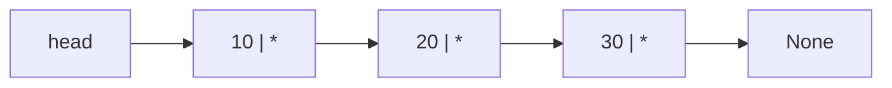
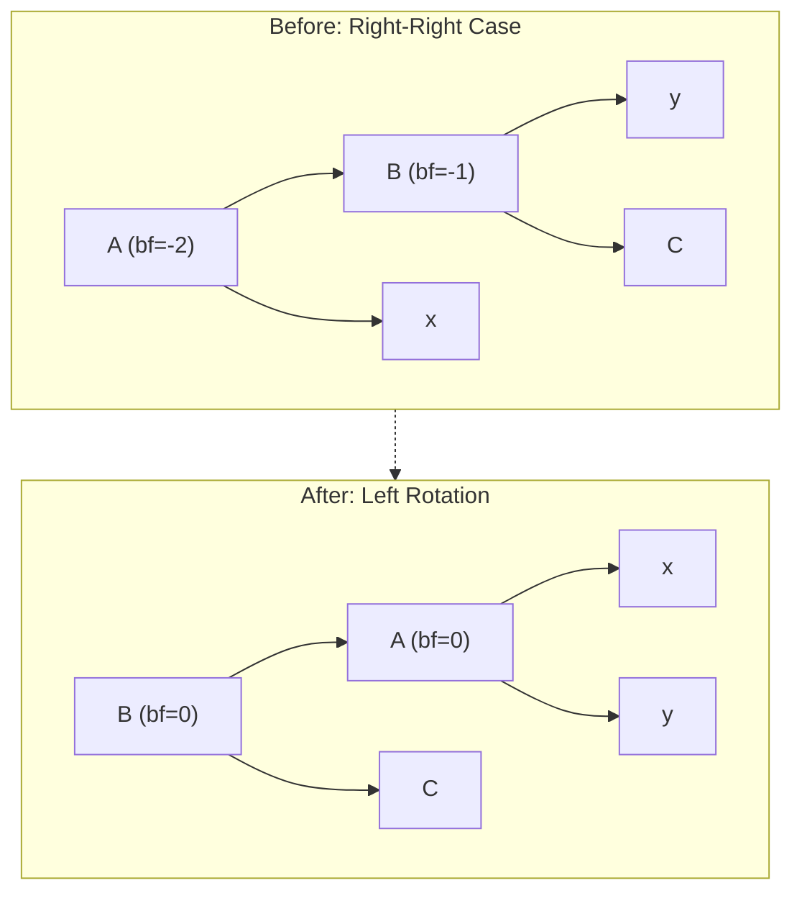
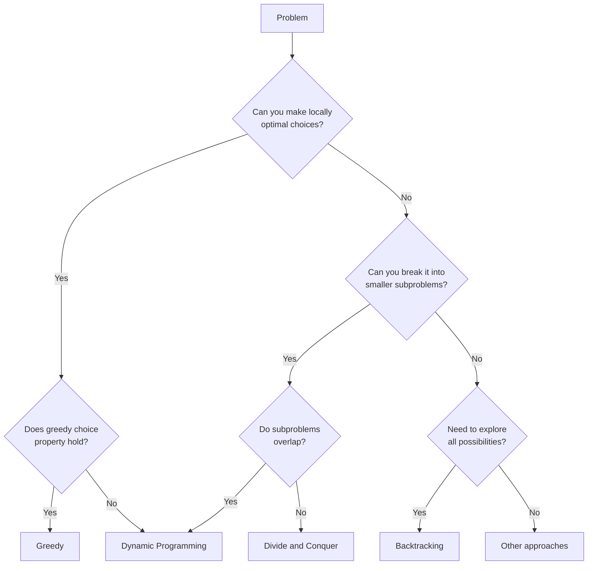

# Data Structures and Algorithms

You learned to write programs in [Programming Fundamentals](/learn/first-principles/programming-fundamentals/). Now you learn to write *efficient* programs. This domain answers two questions: how do you organize data so that operations on it are fast, and how do you design algorithms whose resource consumption you can predict and prove? Every system you will build in later domains — database indexes in [Data Management](/learn/first-principles/data-management/), routing tables in [Networking](/learn/first-principles/networking/), container scheduling in [Infrastructure at Scale](/learn/first-principles/infrastructure-at-scale/) — depends on the data structures and algorithms taught here. Theory is not optional. The difference between an O(n) and an O(n^2) algorithm is the difference between a system that handles a million users and one that collapses at ten thousand.

---

## A. Algorithm Analysis

### Theory

Algorithm analysis is the science of predicting how an algorithm's resource consumption grows as the input grows. The resource is usually time (number of operations) or space (amount of memory), but the method applies to any measurable quantity — disk reads, network round trips, cache misses.

#### Asymptotic Notation

Three notations describe the growth rate of a function:

| Notation | Meaning | Intuition |
|----------|---------|-----------|
| O(f(n)) | Upper bound | The algorithm takes *at most* this long |
| Omega(f(n)) | Lower bound | The algorithm takes *at least* this long |
| Theta(f(n)) | Tight bound | The algorithm takes *exactly* this long (up to constants) |

Formally, T(n) is in O(f(n)) if there exist constants c > 0 and n_0 such that for all n >= n_0, T(n) <= c * f(n). The Omega definition mirrors this with >=, and Theta requires both.

> **Math: Asymptotic Notation**
>
> O(f(n)) = { T(n) : there exist c > 0, n_0 > 0 such that T(n) <= c * f(n) for all n >= n_0 }
>
> Omega(f(n)) = { T(n) : there exist c > 0, n_0 > 0 such that T(n) >= c * f(n) for all n >= n_0 }
>
> Theta(f(n)) = O(f(n)) intersect Omega(f(n))

Common growth rates, from fastest to slowest:

| Complexity | Name | Example |
|-----------|------|---------|
| O(1) | Constant | Hash table lookup |
| O(log n) | Logarithmic | Binary search |
| O(n) | Linear | Linear search |
| O(n log n) | Linearithmic | Merge sort |
| O(n^2) | Quadratic | Nested loops (bubble sort) |
| O(2^n) | Exponential | Brute-force subset enumeration |
| O(n!) | Factorial | Brute-force permutations |

#### Proof by Induction

Many correctness and complexity proofs in algorithms use mathematical induction. The method has two steps:

1. **Base case**: Prove the statement holds for the smallest input (usually n = 0 or n = 1).
2. **Inductive step**: Assume the statement holds for n = k (the *inductive hypothesis*). Prove it holds for n = k + 1.

If both steps hold, the statement is true for all n >= the base case.

> **Math: Induction Example — Sum Formula**
>
> Claim: 1 + 2 + ... + n = n(n+1)/2
>
> Base case: n = 1. Left side = 1. Right side = 1(2)/2 = 1. Holds.
>
> Inductive step: Assume 1 + 2 + ... + k = k(k+1)/2. Then:
> 1 + 2 + ... + k + (k+1) = k(k+1)/2 + (k+1) = (k+1)(k+2)/2
>
> This is exactly the formula with n = k+1. The claim holds for all n >= 1.

#### Recurrence Relations and the Master Theorem

Recursive algorithms have running times described by recurrence relations. The most common form for divide-and-conquer algorithms is:

T(n) = a * T(n/b) + O(n^d)

where *a* is the number of subproblems, *n/b* is the size of each subproblem, and O(n^d) is the cost of dividing and combining.

> **Math: The Master Theorem**
>
> Given T(n) = a * T(n/b) + O(n^d), with a >= 1, b > 1, d >= 0:
>
> - If d > log_b(a): T(n) = O(n^d)
> - If d = log_b(a): T(n) = O(n^d * log n)
> - If d < log_b(a): T(n) = O(n^(log_b(a)))
>
> Merge sort: a = 2, b = 2, d = 1. Since d = log_2(2) = 1, T(n) = O(n log n).
> Binary search: a = 1, b = 2, d = 0. Since d = log_2(1) = 0, T(n) = O(log n).

#### Amortized Analysis

Some operations are expensive occasionally but cheap on average. Amortized analysis gives the *average cost per operation over a worst-case sequence*. The classic example is a dynamic array that doubles its capacity when full. A single append that triggers a resize costs O(n), but over n appends, the total cost is O(n), so the amortized cost per append is O(1).

The **accounting method** assigns a fixed "charge" to each operation. Cheap operations overpay, and the surplus covers the occasional expensive operation. For a dynamic array, charge 3 units per append: 1 for the insert itself, 1 saved for copying this element during the next resize, and 1 saved for copying an element that was already present.

### Practice

Profiling replaces guessing with measurement. Python's `time` module and `timeit` module let you measure actual execution time.

```python
import time

def linear_search(arr, target):
    for item in arr:
        if item == target:
            return True
    return False

def binary_search(arr, target):
    lo, hi = 0, len(arr) - 1
    while lo <= hi:
        mid = (lo + hi) // 2
        if arr[mid] == target:
            return True
        elif arr[mid] < target:
            lo = mid + 1
        else:
            hi = mid - 1
    return False

# Profile both searches on a sorted array
sizes = [1_000, 10_000, 100_000, 1_000_000]
for n in sizes:
    arr = list(range(n))
    target = n - 1  # worst case for linear search

    start = time.perf_counter()
    linear_search(arr, target)
    linear_time = time.perf_counter() - start

    start = time.perf_counter()
    binary_search(arr, target)
    binary_time = time.perf_counter() - start

    print(f"n={n:>10,}: linear={linear_time:.6f}s  binary={binary_time:.6f}s")
```

Run this and observe: linear search time grows proportionally with n, binary search time barely changes. That is the difference between O(n) and O(log n) made visible.

```python
# Demonstrate amortized analysis: dynamic array resizing
import sys

data = []
prev_size = sys.getsizeof(data)
print(f"{'Length':>8} {'Size (bytes)':>14} {'Resized':>8}")
for i in range(64):
    data.append(i)
    curr_size = sys.getsizeof(data)
    resized = "  <--" if curr_size != prev_size else ""
    print(f"{len(data):>8} {curr_size:>14}{resized}")
    prev_size = curr_size
```

### Connection

Analysis gives you a language for discussing efficiency before you write a single line of code. When you see a nested loop over n elements, you know it is O(n^2) and can ask whether a hash table would reduce it to O(n). When you see a recursive function, you can write its recurrence relation and apply the Master Theorem. When someone claims an operation is O(1), you know to ask whether that is worst-case or amortized. Profiling confirms the theory — or reveals that constant factors and cache behavior matter in practice. Both tools are essential.

> **Try It**: Write a function that computes the n-th Fibonacci number recursively, then iteratively. Profile both. The recursive version is O(2^n); the iterative version is O(n). At n = 40, the difference is dramatic.

---

## B. Fundamental Data Structures

### Theory

A data structure is a way of organizing data that determines which operations are fast and which are slow. Choosing the right data structure is choosing the right tradeoffs.

#### Arrays

An array stores elements in contiguous memory locations. Each element is accessed by its index in O(1) time because the memory address is computed by: `base_address + index * element_size`.

| Operation | Time Complexity |
|-----------|----------------|
| Access by index | O(1) |
| Search (unsorted) | O(n) |
| Insert at end | O(1) amortized |
| Insert at position i | O(n) |
| Delete at position i | O(n) |

Python's `list` is a dynamic array. It stores an array of pointers to objects, with an underlying C array that is resized when capacity is exceeded.

#### Linked Lists

A linked list stores elements in nodes, where each node contains a value and a pointer to the next node. There is no contiguous memory requirement, so insertion and deletion at a known position are O(1) — but finding that position requires O(n) traversal.



| Operation | Singly Linked | Doubly Linked |
|-----------|--------------|---------------|
| Access by index | O(n) | O(n) |
| Insert at head | O(1) | O(1) |
| Insert at tail | O(n) or O(1) with tail ptr | O(1) |
| Delete at head | O(1) | O(1) |
| Search | O(n) | O(n) |

```python
class Node:
    def __init__(self, val, next_node=None):
        self.val = val
        self.next = next_node

class LinkedList:
    def __init__(self):
        self.head = None

    def prepend(self, val):
        self.head = Node(val, self.head)

    def append(self, val):
        if not self.head:
            self.head = Node(val)
            return
        curr = self.head
        while curr.next:
            curr = curr.next
        curr.next = Node(val)

    def delete(self, val):
        if not self.head:
            return
        if self.head.val == val:
            self.head = self.head.next
            return
        curr = self.head
        while curr.next:
            if curr.next.val == val:
                curr.next = curr.next.next
                return
            curr = curr.next

    def __iter__(self):
        curr = self.head
        while curr:
            yield curr.val
            curr = curr.next

    def __repr__(self):
        return " -> ".join(str(v) for v in self) + " -> None"
```

#### Stacks and Queues

A **stack** is last-in, first-out (LIFO). Push and pop operate on the same end. Function call stacks, undo history, and depth-first search all use stacks.

A **queue** is first-in, first-out (FIFO). Enqueue adds to the back; dequeue removes from the front. Task scheduling, breadth-first search, and message buffers all use queues.

```python
# Stack using a Python list
class Stack:
    def __init__(self):
        self._data = []

    def push(self, val):
        self._data.append(val)

    def pop(self):
        if not self._data:
            raise IndexError("pop from empty stack")
        return self._data.pop()

    def peek(self):
        if not self._data:
            raise IndexError("peek at empty stack")
        return self._data[-1]

    def is_empty(self):
        return len(self._data) == 0

    def __len__(self):
        return len(self._data)


# Queue using collections.deque for O(1) operations at both ends
from collections import deque

class Queue:
    def __init__(self):
        self._data = deque()

    def enqueue(self, val):
        self._data.append(val)

    def dequeue(self):
        if not self._data:
            raise IndexError("dequeue from empty queue")
        return self._data.popleft()

    def peek(self):
        if not self._data:
            raise IndexError("peek at empty queue")
        return self._data[0]

    def is_empty(self):
        return len(self._data) == 0

    def __len__(self):
        return len(self._data)
```

#### Hash Tables

A hash table maps keys to values using a hash function that converts keys into array indices. The average-case complexity for insert, lookup, and delete is O(1). The worst case is O(n) when all keys hash to the same index (a collision chain).

**How hashing works**: A hash function takes a key and produces an integer. That integer is reduced to an array index using modulo: `index = hash(key) % table_size`. A good hash function distributes keys uniformly across the table.

**Collision resolution** uses one of two strategies:

- **Chaining**: Each table slot holds a linked list of entries that hashed to that index.
- **Open addressing**: On collision, probe other slots (linear probing, quadratic probing, or double hashing) until an empty one is found.

> **Math: The Birthday Problem and Hash Collisions**
>
> The birthday problem asks: in a group of n people, what is the probability that at least two share a birthday? With 365 possible birthdays, the probability exceeds 50% at just n = 23. This is directly relevant to hashing.
>
> P(no collision among n items in m slots) = product from i=0 to n-1 of (m - i) / m
>
> For n = 23 and m = 365:
> P(no collision) = (365/365) * (364/365) * ... * (343/365) ≈ 0.493
>
> So P(at least one collision) ≈ 0.507.
>
> This means that with a hash table of m slots, collisions start appearing much sooner than you might expect. The **load factor** alpha = n/m controls how dense the table is. Most implementations resize when alpha exceeds 0.7 to keep collision chains short.

```python
class HashTable:
    def __init__(self, capacity=8):
        self._capacity = capacity
        self._size = 0
        self._buckets = [[] for _ in range(capacity)]
        self._load_factor_threshold = 0.7

    def _hash(self, key):
        return hash(key) % self._capacity

    def _resize(self):
        old_buckets = self._buckets
        self._capacity *= 2
        self._buckets = [[] for _ in range(self._capacity)]
        self._size = 0
        for bucket in old_buckets:
            for key, val in bucket:
                self.put(key, val)

    def put(self, key, val):
        if self._size / self._capacity >= self._load_factor_threshold:
            self._resize()
        idx = self._hash(key)
        for i, (k, v) in enumerate(self._buckets[idx]):
            if k == key:
                self._buckets[idx][i] = (key, val)
                return
        self._buckets[idx].append((key, val))
        self._size += 1

    def get(self, key):
        idx = self._hash(key)
        for k, v in self._buckets[idx]:
            if k == key:
                return v
        raise KeyError(key)

    def delete(self, key):
        idx = self._hash(key)
        for i, (k, v) in enumerate(self._buckets[idx]):
            if k == key:
                self._buckets[idx].pop(i)
                self._size -= 1
                return
        raise KeyError(key)

    def __len__(self):
        return self._size
```

### Practice

Build each data structure from scratch and verify its behavior.

```python
# Verify linked list operations
ll = LinkedList()
for v in [10, 20, 30, 40]:
    ll.append(v)
print(ll)  # 10 -> 20 -> 30 -> 40 -> None

ll.delete(20)
print(ll)  # 10 -> 30 -> 40 -> None

ll.prepend(5)
print(ll)  # 5 -> 10 -> 30 -> 40 -> None

# Verify stack behavior
s = Stack()
for v in [1, 2, 3]:
    s.push(v)
print(s.pop())   # 3 (LIFO)
print(s.pop())   # 2
print(s.peek())  # 1

# Verify queue behavior
q = Queue()
for v in [1, 2, 3]:
    q.enqueue(v)
print(q.dequeue())  # 1 (FIFO)
print(q.dequeue())  # 2
print(q.peek())     # 3

# Verify hash table
ht = HashTable()
ht.put("name", "Alice")
ht.put("age", 30)
print(ht.get("name"))  # Alice
ht.put("name", "Bob")  # update
print(ht.get("name"))  # Bob
ht.delete("age")
print(len(ht))          # 1
```

### Connection

Every higher-level system you will encounter is built on these structures. Python's `dict` is a hash table. The Linux kernel's task scheduler uses linked lists and trees. Network packet buffers are queues. The function call stack in every programming language is a stack. When you understand these primitives, you can reason about the performance of any system built on top of them. The hash table in particular is the most important data structure in practical computing — it turns O(n) searches into O(1) lookups and appears everywhere from DNS caches to database indexes to Python's own object model.

> **Try It**: Implement a hash table with open addressing (linear probing) instead of chaining. Compare the performance of both implementations by inserting 10,000 random key-value pairs and measuring lookup time. Observe how performance degrades as the load factor approaches 1.0.

---

## C. Trees

### Theory

A tree is a hierarchical data structure consisting of nodes connected by edges. Each node has zero or more children, and exactly one node (the root) has no parent. Trees are everywhere: file systems, HTML documents, database indexes, compilers (abstract syntax trees), and decision processes.

#### Binary Trees

A binary tree restricts each node to at most two children: left and right. Traversal orders define how you visit every node:

- **In-order** (left, root, right): For BSTs, this produces sorted output.
- **Pre-order** (root, left, right): Useful for serialization and copying trees.
- **Post-order** (left, right, root): Useful for deletion and expression evaluation.
- **Level-order** (breadth-first): Visits nodes level by level using a queue.

```python
class TreeNode:
    def __init__(self, val, left=None, right=None):
        self.val = val
        self.left = left
        self.right = right

def inorder(node):
    if node:
        yield from inorder(node.left)
        yield node.val
        yield from inorder(node.right)

def preorder(node):
    if node:
        yield node.val
        yield from preorder(node.left)
        yield from preorder(node.right)

def postorder(node):
    if node:
        yield from postorder(node.left)
        yield from postorder(node.right)
        yield node.val

def levelorder(root):
    if not root:
        return
    from collections import deque
    q = deque([root])
    while q:
        node = q.popleft()
        yield node.val
        if node.left:
            q.append(node.left)
        if node.right:
            q.append(node.right)
```

#### Binary Search Trees (BSTs)

A BST enforces a property: for every node, all values in its left subtree are less, and all values in its right subtree are greater. This property enables O(log n) search, insert, and delete — if the tree is balanced.

The problem: if you insert sorted data into a BST, it degenerates into a linked list, and all operations become O(n).

```python
class BST:
    def __init__(self):
        self.root = None

    def insert(self, val):
        self.root = self._insert(self.root, val)

    def _insert(self, node, val):
        if not node:
            return TreeNode(val)
        if val < node.val:
            node.left = self._insert(node.left, val)
        elif val > node.val:
            node.right = self._insert(node.right, val)
        return node

    def search(self, val):
        return self._search(self.root, val)

    def _search(self, node, val):
        if not node:
            return False
        if val == node.val:
            return True
        elif val < node.val:
            return self._search(node.left, val)
        else:
            return self._search(node.right, val)

    def inorder(self):
        return list(inorder(self.root))
```

#### Self-Balancing Trees

Self-balancing trees automatically restructure themselves after insertions and deletions to maintain O(log n) height.

**AVL Trees** maintain a balance factor (height of left subtree minus height of right subtree) between -1 and +1 for every node. When an operation violates this, the tree performs rotations to restore balance.



There are four rotation cases:

| Case | Imbalance | Fix |
|------|-----------|-----|
| Left-Left (LL) | Left child is left-heavy | Single right rotation |
| Right-Right (RR) | Right child is right-heavy | Single left rotation |
| Left-Right (LR) | Left child is right-heavy | Left rotate child, then right rotate node |
| Right-Left (RL) | Right child is left-heavy | Right rotate child, then left rotate node |

**Red-Black Trees** use a coloring invariant instead of height tracking. Every node is either red or black, with five rules that guarantee the tree's height never exceeds 2 * log_2(n+1). Red-black trees are used in Linux's Completely Fair Scheduler, Java's `TreeMap`, and C++'s `std::map`.

Red-black rules:
1. Every node is red or black.
2. The root is black.
3. Every null leaf is black.
4. A red node cannot have a red child.
5. Every path from a node to its descendant null leaves contains the same number of black nodes.

**Comparison**:

| Property | AVL Tree | Red-Black Tree |
|----------|----------|---------------|
| Balancing | Stricter (height diff <= 1) | Looser (no double-red, black-height) |
| Search | Slightly faster (shorter height) | Slightly slower |
| Insert/Delete | More rotations | Fewer rotations |
| Use case | Read-heavy workloads | Write-heavy workloads |

#### B-Trees and B+ Trees

B-trees are designed for systems that read and write large blocks of data — particularly disk-based storage. A B-tree of order m allows each node to have up to m children and m-1 keys. All leaves are at the same depth, and nodes are kept at least half full.

B+ trees are a variant where all values are stored in leaf nodes, and leaf nodes are linked together for efficient range queries. This is the index structure used by virtually every relational database (PostgreSQL, MySQL, SQLite) and file system (NTFS, ext4, HFS+).

| Property | B-Tree | B+ Tree |
|----------|--------|---------|
| Values stored in | All nodes | Leaf nodes only |
| Leaf linking | No | Yes (linked list) |
| Range queries | Slower | Fast (follow leaf links) |
| Use case | General | Database indexes, file systems |

Why B-trees matter for databases: A B+ tree with branching factor 100 and height 4 can index 100 million rows. Finding any row requires at most 4 disk reads. This is why database indexes make queries fast — they replace a linear scan with a tree traversal that touches a tiny fraction of the data.

#### Heaps

A **heap** is a complete binary tree that satisfies the heap property. In a min-heap, every parent is less than or equal to its children. In a max-heap, every parent is greater than or equal to its children. Heaps are used for priority queues and heap sort.

The key insight: a heap can be stored in a flat array. For a node at index i, its left child is at 2i + 1, its right child is at 2i + 2, and its parent is at (i - 1) // 2. No pointers needed.

```python
class MinHeap:
    def __init__(self):
        self._data = []

    def _sift_up(self, i):
        while i > 0:
            parent = (i - 1) // 2
            if self._data[i] < self._data[parent]:
                self._data[i], self._data[parent] = self._data[parent], self._data[i]
                i = parent
            else:
                break

    def _sift_down(self, i):
        n = len(self._data)
        while True:
            smallest = i
            left = 2 * i + 1
            right = 2 * i + 2
            if left < n and self._data[left] < self._data[smallest]:
                smallest = left
            if right < n and self._data[right] < self._data[smallest]:
                smallest = right
            if smallest != i:
                self._data[i], self._data[smallest] = self._data[smallest], self._data[i]
                i = smallest
            else:
                break

    def push(self, val):
        self._data.append(val)
        self._sift_up(len(self._data) - 1)

    def pop(self):
        if not self._data:
            raise IndexError("pop from empty heap")
        val = self._data[0]
        last = self._data.pop()
        if self._data:
            self._data[0] = last
            self._sift_down(0)
        return val

    def peek(self):
        if not self._data:
            raise IndexError("peek at empty heap")
        return self._data[0]

    def __len__(self):
        return len(self._data)
```

| Heap Operation | Time Complexity |
|---------------|----------------|
| Insert (push) | O(log n) |
| Extract min/max (pop) | O(log n) |
| Peek | O(1) |
| Build heap from array | O(n) |

The O(n) build-heap time is not obvious. Each sift-down costs O(h) where h is the height of the subtree. Since most nodes are near the bottom (where h is small), the total work sums to O(n), not O(n log n).

### Practice

```python
# Build a BST and verify the sorted output
bst = BST()
import random
values = random.sample(range(100), 15)
for v in values:
    bst.insert(v)
print("Inserted:", values)
print("In-order:", bst.inorder())  # sorted

# Use Python's heapq module (min-heap) for a priority queue
import heapq

tasks = [(3, "low priority"), (1, "urgent"), (2, "medium")]
heapq.heapify(tasks)
while tasks:
    priority, name = heapq.heappop(tasks)
    print(f"Processing: {name} (priority {priority})")

# Build a min-heap from scratch and extract elements in sorted order
heap = MinHeap()
for v in [5, 3, 8, 1, 9, 2, 7]:
    heap.push(v)
sorted_output = []
while len(heap) > 0:
    sorted_output.append(heap.pop())
print("Heap sort:", sorted_output)  # [1, 2, 3, 5, 7, 8, 9]
```

### Connection

Trees are the bridge between linear data structures and the complex hierarchical systems you will encounter in every later domain. File systems are trees. DNS is a tree. HTML is a tree. When you study database indexing in [Data Management](/learn/first-principles/data-management/), you will understand why B+ trees make range queries fast — because you built a heap and a BST here. When you study the Linux kernel's process scheduler, you will know why it uses a red-black tree — because you learned the tradeoff between AVL and red-black balancing here. The heap is the foundation of every priority queue, which appears in network packet scheduling, job scheduling, and the shortest-path algorithms you will learn in the next section.

> **Try It**: Insert the values 1 through 10 in order into a plain BST and print its height. Then insert the same values in random order and print the height again. This demonstrates why self-balancing trees exist: sequential inserts create a degenerate tree with height n, while random inserts produce a tree with height approximately log n.

---

## D. Graphs

### Theory

A graph is a set of vertices (nodes) connected by edges. Graphs model networks, dependencies, relationships, and state transitions. Unlike trees, graphs can have cycles and multiple paths between vertices.

#### Graph Fundamentals

| Term | Definition |
|------|-----------|
| Directed graph (digraph) | Edges have direction: (u, v) is not the same as (v, u) |
| Undirected graph | Edges have no direction: {u, v} = {v, u} |
| Weighted graph | Each edge has a numeric weight (cost, distance, capacity) |
| Adjacent | Two vertices connected by an edge |
| Degree | Number of edges incident to a vertex |
| Path | A sequence of vertices where each consecutive pair is connected by an edge |
| Cycle | A path that starts and ends at the same vertex |
| Connected | Every vertex is reachable from every other vertex (undirected) |
| DAG | Directed Acyclic Graph — a directed graph with no cycles |

**Representation**: Two standard ways to store a graph:

| Representation | Space | Edge lookup | Iterate neighbors | Best for |
|---------------|-------|-------------|-------------------|----------|
| Adjacency matrix | O(V^2) | O(1) | O(V) | Dense graphs |
| Adjacency list | O(V + E) | O(degree) | O(degree) | Sparse graphs |

Most real-world graphs are sparse (E is much less than V^2), so adjacency lists are the default choice.

```python
from collections import defaultdict, deque

class Graph:
    def __init__(self, directed=False):
        self.adj = defaultdict(list)
        self.directed = directed

    def add_edge(self, u, v, weight=1):
        self.adj[u].append((v, weight))
        if not self.directed:
            self.adj[v].append((u, weight))

    def vertices(self):
        return set(self.adj.keys())
```

#### Breadth-First Search (BFS)

BFS explores all vertices at distance d before any vertex at distance d+1. It uses a queue and produces shortest paths in unweighted graphs.

```python
def bfs(graph, start):
    visited = {start}
    queue = deque([start])
    order = []
    while queue:
        vertex = queue.popleft()
        order.append(vertex)
        for neighbor, _ in graph.adj[vertex]:
            if neighbor not in visited:
                visited.add(neighbor)
                queue.append(neighbor)
    return order

def bfs_shortest_path(graph, start, end):
    visited = {start}
    queue = deque([(start, [start])])
    while queue:
        vertex, path = queue.popleft()
        if vertex == end:
            return path
        for neighbor, _ in graph.adj[vertex]:
            if neighbor not in visited:
                visited.add(neighbor)
                queue.append((neighbor, path + [neighbor]))
    return None  # no path exists
```

**Time complexity**: O(V + E). Every vertex and edge is visited exactly once.

#### Depth-First Search (DFS)

DFS explores as far as possible along a branch before backtracking. It uses a stack (or recursion, which uses the call stack) and is the basis for topological sorting, cycle detection, and finding connected components.

```python
def dfs(graph, start):
    visited = set()
    order = []
    def visit(v):
        visited.add(v)
        order.append(v)
        for neighbor, _ in graph.adj[v]:
            if neighbor not in visited:
                visit(neighbor)
    visit(start)
    return order

def dfs_iterative(graph, start):
    visited = set()
    stack = [start]
    order = []
    while stack:
        vertex = stack.pop()
        if vertex in visited:
            continue
        visited.add(vertex)
        order.append(vertex)
        for neighbor, _ in graph.adj[vertex]:
            if neighbor not in visited:
                stack.append(neighbor)
    return order
```

**Time complexity**: O(V + E), same as BFS.

#### Topological Sort

A topological ordering of a DAG is a linear ordering of vertices such that for every directed edge (u, v), u comes before v. This is essential for dependency resolution — build systems, package managers, course prerequisites, and task scheduling all use topological sort.

```python
def topological_sort(graph):
    visited = set()
    stack = []
    def visit(v):
        visited.add(v)
        for neighbor, _ in graph.adj[v]:
            if neighbor not in visited:
                visit(neighbor)
        stack.append(v)  # add after all descendants
    for v in graph.adj:
        if v not in visited:
            visit(v)
    return stack[::-1]  # reverse post-order
```

**Kahn's algorithm** (BFS-based) provides an alternative that also detects cycles:

```python
def topological_sort_kahn(graph):
    in_degree = defaultdict(int)
    for u in graph.adj:
        for v, _ in graph.adj[u]:
            in_degree[v] += 1

    queue = deque([v for v in graph.adj if in_degree[v] == 0])
    order = []

    while queue:
        vertex = queue.popleft()
        order.append(vertex)
        for neighbor, _ in graph.adj[vertex]:
            in_degree[neighbor] -= 1
            if in_degree[neighbor] == 0:
                queue.append(neighbor)

    if len(order) != len(graph.adj):
        raise ValueError("Graph has a cycle — no topological ordering exists")
    return order
```

#### Shortest Path Algorithms

**Dijkstra's Algorithm** finds the shortest path from a source to all other vertices in a graph with non-negative weights. It uses a priority queue (min-heap) to always process the closest unvisited vertex.

```python
import heapq

def dijkstra(graph, start):
    dist = {start: 0}
    prev = {}
    pq = [(0, start)]

    while pq:
        d, u = heapq.heappop(pq)
        if d > dist.get(u, float('inf')):
            continue
        for v, weight in graph.adj[u]:
            new_dist = d + weight
            if new_dist < dist.get(v, float('inf')):
                dist[v] = new_dist
                prev[v] = u
                heapq.heappush(pq, (new_dist, v))

    return dist, prev

def reconstruct_path(prev, start, end):
    path = []
    current = end
    while current != start:
        if current not in prev:
            return None  # no path
        path.append(current)
        current = prev[current]
    path.append(start)
    return path[::-1]
```

**Time complexity**: O((V + E) log V) with a binary heap.

**Bellman-Ford Algorithm** handles negative edge weights (which Dijkstra's cannot). It relaxes all edges V-1 times and can detect negative cycles.

```python
def bellman_ford(graph, start):
    dist = {v: float('inf') for v in graph.adj}
    dist[start] = 0
    prev = {}

    vertices = list(graph.adj.keys())
    edges = [(u, v, w) for u in graph.adj for v, w in graph.adj[u]]

    for _ in range(len(vertices) - 1):
        for u, v, w in edges:
            if dist[u] + w < dist[v]:
                dist[v] = dist[u] + w
                prev[v] = u

    # Check for negative cycles
    for u, v, w in edges:
        if dist[u] + w < dist[v]:
            raise ValueError("Graph contains a negative cycle")

    return dist, prev
```

**Time complexity**: O(V * E).

**Floyd-Warshall Algorithm** finds shortest paths between all pairs of vertices. It uses dynamic programming with a 2D distance matrix.

```python
def floyd_warshall(vertices, edges):
    dist = {v: {u: float('inf') for u in vertices} for v in vertices}
    next_hop = {v: {u: None for u in vertices} for v in vertices}

    for v in vertices:
        dist[v][v] = 0
    for u, v, w in edges:
        dist[u][v] = w
        next_hop[u][v] = v

    for k in vertices:
        for i in vertices:
            for j in vertices:
                if dist[i][k] + dist[k][j] < dist[i][j]:
                    dist[i][j] = dist[i][k] + dist[k][j]
                    next_hop[i][j] = next_hop[i][k]

    return dist, next_hop
```

**Time complexity**: O(V^3). Use it for dense graphs or when you need all-pairs shortest paths.

| Algorithm | Negative Weights | All Pairs | Time Complexity |
|-----------|-----------------|-----------|----------------|
| Dijkstra's | No | No | O((V+E) log V) |
| Bellman-Ford | Yes | No | O(V * E) |
| Floyd-Warshall | Yes | Yes | O(V^3) |

#### Minimum Spanning Trees

A minimum spanning tree (MST) of a connected, weighted, undirected graph is a tree that includes all vertices with the minimum total edge weight. MSTs are used in network design, clustering, and approximation algorithms.

**Prim's Algorithm** grows the MST from a starting vertex, always adding the cheapest edge that connects a new vertex:

```python
def prim(graph, start):
    mst_edges = []
    visited = {start}
    edges = [(w, start, v) for v, w in graph.adj[start]]
    heapq.heapify(edges)
    total_weight = 0

    while edges and len(visited) < len(graph.adj):
        w, u, v = heapq.heappop(edges)
        if v in visited:
            continue
        visited.add(v)
        mst_edges.append((u, v, w))
        total_weight += w
        for neighbor, weight in graph.adj[v]:
            if neighbor not in visited:
                heapq.heappush(edges, (weight, v, neighbor))

    return mst_edges, total_weight
```

**Kruskal's Algorithm** sorts all edges by weight and adds them one by one, skipping edges that would create a cycle. Cycle detection uses a **Union-Find** (disjoint set) data structure:

```python
class UnionFind:
    def __init__(self, n):
        self.parent = list(range(n))
        self.rank = [0] * n

    def find(self, x):
        if self.parent[x] != x:
            self.parent[x] = self.find(self.parent[x])  # path compression
        return self.parent[x]

    def union(self, x, y):
        rx, ry = self.find(x), self.find(y)
        if rx == ry:
            return False
        if self.rank[rx] < self.rank[ry]:
            rx, ry = ry, rx
        self.parent[ry] = rx
        if self.rank[rx] == self.rank[ry]:
            self.rank[rx] += 1
        return True

def kruskal(vertices, edges):
    """vertices: list of ints 0..n-1, edges: list of (u, v, weight)"""
    uf = UnionFind(len(vertices))
    edges_sorted = sorted(edges, key=lambda e: e[2])
    mst = []
    total = 0
    for u, v, w in edges_sorted:
        if uf.union(u, v):
            mst.append((u, v, w))
            total += w
    return mst, total
```

#### Graph Coloring

Graph coloring assigns colors to vertices such that no two adjacent vertices share the same color. The minimum number of colors needed is the **chromatic number**. Graph coloring is used in register allocation (compilers), scheduling (exams, frequencies), and map coloring.

Finding the chromatic number is NP-hard in general, but a greedy algorithm provides a reasonable heuristic:

```python
def greedy_coloring(graph):
    color = {}
    for vertex in graph.adj:
        neighbor_colors = {color[n] for n, _ in graph.adj[vertex] if n in color}
        c = 0
        while c in neighbor_colors:
            c += 1
        color[vertex] = c
    return color
```

### Practice

```python
# Build a weighted graph and run shortest path algorithms
g = Graph(directed=False)
edges = [
    ("A", "B", 4), ("A", "C", 2), ("B", "C", 1),
    ("B", "D", 5), ("C", "D", 8), ("C", "E", 10),
    ("D", "E", 2), ("D", "F", 6), ("E", "F", 3)
]
for u, v, w in edges:
    g.add_edge(u, v, w)

# BFS (unweighted traversal)
print("BFS from A:", bfs(g, "A"))

# Dijkstra's shortest path
dist, prev = dijkstra(g, "A")
print("Shortest distances from A:", dict(dist))
print("Shortest path A->F:", reconstruct_path(prev, "A", "F"))

# Topological sort on a DAG
dag = Graph(directed=True)
dag.add_edge("foundations", "linux")
dag.add_edge("linux", "networking")
dag.add_edge("linux", "scripting")
dag.add_edge("scripting", "python")
dag.add_edge("python", "algorithms")
dag.add_edge("networking", "security")
print("Topological order:", topological_sort(dag))
```

### Connection

Graphs are the most general data structure. Every network is a graph — the internet, social networks, road maps, circuit boards, dependency trees, and state machines. When you study networking in [Networking](/learn/first-principles/networking/), routing protocols use Dijkstra's algorithm (OSPF) and Bellman-Ford (RIP). When you study container orchestration in [Infrastructure at Scale](/learn/first-principles/infrastructure-at-scale/), Kubernetes scheduling is a graph problem. When you study CI/CD in [Software Engineering and Collaboration](/learn/first-principles/software-engineering-and-collaboration/), build pipelines are DAGs that require topological sorting. Understanding graph algorithms gives you the vocabulary and tools to reason about any system of interconnected components.

> **Try It**: Model a small network of 6 cities with distances between them. Use Dijkstra's algorithm to find the shortest route between the two farthest cities. Then use Prim's or Kruskal's algorithm to find the minimum spanning tree — the cheapest way to connect all cities. Compare the total MST weight to the shortest path. They solve different problems: MST minimizes total infrastructure cost, shortest path minimizes travel between two points.

---

## E. Sorting and Searching

### Theory

Sorting is the most studied problem in computer science. It appears everywhere — displaying results, preparing data for binary search, detecting duplicates, and enabling efficient merging. Understanding sorting algorithms teaches you about algorithmic design, tradeoffs, and lower bounds.

#### Comparison-Based Sorting

Comparison sorts determine the order of elements by comparing pairs. Every comparison sort must make at least O(n log n) comparisons in the worst case.

**Bubble Sort** repeatedly swaps adjacent elements that are out of order. Simple but slow.

```python
def bubble_sort(arr):
    n = len(arr)
    for i in range(n):
        swapped = False
        for j in range(n - 1 - i):
            if arr[j] > arr[j + 1]:
                arr[j], arr[j + 1] = arr[j + 1], arr[j]
                swapped = True
        if not swapped:
            break  # already sorted
    return arr
```

**Insertion Sort** builds a sorted portion one element at a time. Efficient for small or nearly sorted arrays. Used as the base case in hybrid sorts like Timsort.

```python
def insertion_sort(arr):
    for i in range(1, len(arr)):
        key = arr[i]
        j = i - 1
        while j >= 0 and arr[j] > key:
            arr[j + 1] = arr[j]
            j -= 1
        arr[j + 1] = key
    return arr
```

**Merge Sort** divides the array in half, recursively sorts each half, and merges the sorted halves. Guaranteed O(n log n) time but requires O(n) extra space.

```python
def merge_sort(arr):
    if len(arr) <= 1:
        return arr
    mid = len(arr) // 2
    left = merge_sort(arr[:mid])
    right = merge_sort(arr[mid:])
    return merge(left, right)

def merge(left, right):
    result = []
    i = j = 0
    while i < len(left) and j < len(right):
        if left[i] <= right[j]:
            result.append(left[i])
            i += 1
        else:
            result.append(right[j])
            j += 1
    result.extend(left[i:])
    result.extend(right[j:])
    return result
```

**Quick Sort** picks a pivot, partitions elements into those less than and greater than the pivot, and recursively sorts each partition. Average O(n log n), worst case O(n^2) with poor pivot selection. In practice, it is often the fastest comparison sort due to excellent cache behavior.

```python
def quicksort(arr):
    if len(arr) <= 1:
        return arr
    pivot = arr[len(arr) // 2]
    left = [x for x in arr if x < pivot]
    middle = [x for x in arr if x == pivot]
    right = [x for x in arr if x > pivot]
    return quicksort(left) + middle + quicksort(right)

# In-place partition (Lomuto scheme) for production use
def quicksort_inplace(arr, lo=0, hi=None):
    if hi is None:
        hi = len(arr) - 1
    if lo < hi:
        pivot_idx = partition(arr, lo, hi)
        quicksort_inplace(arr, lo, pivot_idx - 1)
        quicksort_inplace(arr, pivot_idx + 1, hi)
    return arr

def partition(arr, lo, hi):
    pivot = arr[hi]
    i = lo
    for j in range(lo, hi):
        if arr[j] < pivot:
            arr[i], arr[j] = arr[j], arr[i]
            i += 1
    arr[i], arr[hi] = arr[hi], arr[i]
    return i
```

**Heap Sort** builds a max-heap and repeatedly extracts the maximum. Guaranteed O(n log n) time and O(1) extra space, but poor cache performance compared to quicksort.

```python
def heapsort(arr):
    n = len(arr)

    def sift_down(start, end):
        root = start
        while True:
            child = 2 * root + 1
            if child > end:
                break
            if child + 1 <= end and arr[child] < arr[child + 1]:
                child += 1
            if arr[root] < arr[child]:
                arr[root], arr[child] = arr[child], arr[root]
                root = child
            else:
                break

    # Build max-heap
    for i in range(n // 2 - 1, -1, -1):
        sift_down(i, n - 1)

    # Extract elements
    for end in range(n - 1, 0, -1):
        arr[0], arr[end] = arr[end], arr[0]
        sift_down(0, end - 1)

    return arr
```

**Comparison of sorting algorithms**:

| Algorithm | Best | Average | Worst | Space | Stable |
|-----------|------|---------|-------|-------|--------|
| Bubble Sort | O(n) | O(n^2) | O(n^2) | O(1) | Yes |
| Insertion Sort | O(n) | O(n^2) | O(n^2) | O(1) | Yes |
| Merge Sort | O(n log n) | O(n log n) | O(n log n) | O(n) | Yes |
| Quick Sort | O(n log n) | O(n log n) | O(n^2) | O(log n) | No |
| Heap Sort | O(n log n) | O(n log n) | O(n log n) | O(1) | No |

A **stable** sort preserves the relative order of elements with equal keys. This matters when sorting by multiple criteria — sort by last name, then stable-sort by first name, and records with the same first name remain sorted by last name.

> **Math: The O(n log n) Lower Bound for Comparison Sorting**
>
> Any comparison-based sorting algorithm must make at least O(n log n) comparisons in the worst case. The proof uses a decision tree argument.
>
> A comparison sort can be modeled as a binary decision tree where each internal node is a comparison (is a_i < a_j?) and each leaf represents a possible output permutation. There are n! possible permutations of n elements, so the tree must have at least n! leaves. A binary tree with L leaves has height at least log_2(L).
>
> Height >= log_2(n!) = log_2(1) + log_2(2) + ... + log_2(n)
>
> By Stirling's approximation, log_2(n!) is in Theta(n log n). Therefore, no comparison sort can do better than O(n log n) in the worst case.

#### Non-Comparison Sorting

Non-comparison sorts bypass the O(n log n) lower bound by exploiting the structure of the keys.

**Counting Sort** works for integers in a known range [0, k). It counts occurrences of each value and uses the counts to place elements directly. Time: O(n + k). Space: O(k).

```python
def counting_sort(arr, max_val=None):
    if not arr:
        return arr
    if max_val is None:
        max_val = max(arr)
    count = [0] * (max_val + 1)
    for x in arr:
        count[x] += 1
    result = []
    for val, cnt in enumerate(count):
        result.extend([val] * cnt)
    return result
```

**Radix Sort** sorts integers digit by digit, from least significant to most significant, using a stable sort (typically counting sort) at each digit position. Time: O(d * (n + k)) where d is the number of digits and k is the base.

```python
def radix_sort(arr):
    if not arr:
        return arr
    max_val = max(arr)
    exp = 1
    while max_val // exp > 0:
        arr = counting_sort_by_digit(arr, exp)
        exp *= 10
    return arr

def counting_sort_by_digit(arr, exp):
    n = len(arr)
    output = [0] * n
    count = [0] * 10

    for x in arr:
        digit = (x // exp) % 10
        count[digit] += 1

    for i in range(1, 10):
        count[i] += count[i - 1]

    for x in reversed(arr):
        digit = (x // exp) % 10
        count[digit] -= 1
        output[count[digit]] = x

    return output
```

#### Binary Search

Binary search finds a target in a sorted array in O(log n) time by repeatedly halving the search space. It is the most important search algorithm and appears in countless variations.

```python
def binary_search(arr, target):
    lo, hi = 0, len(arr) - 1
    while lo <= hi:
        mid = (lo + hi) // 2
        if arr[mid] == target:
            return mid
        elif arr[mid] < target:
            lo = mid + 1
        else:
            hi = mid - 1
    return -1  # not found

def bisect_left(arr, target):
    """Find the leftmost position where target can be inserted to keep arr sorted."""
    lo, hi = 0, len(arr)
    while lo < hi:
        mid = (lo + hi) // 2
        if arr[mid] < target:
            lo = mid + 1
        else:
            hi = mid
    return lo

def bisect_right(arr, target):
    """Find the rightmost position where target can be inserted to keep arr sorted."""
    lo, hi = 0, len(arr)
    while lo < hi:
        mid = (lo + hi) // 2
        if arr[mid] <= target:
            lo = mid + 1
        else:
            hi = mid
    return lo
```

Binary search applies beyond arrays. Any monotonic function can be binary-searched. Need to find the smallest x where f(x) >= threshold? Binary search on x.

#### Quickselect

Quickselect finds the k-th smallest element without fully sorting the array. It uses the same partition function as quicksort but only recurses into the partition containing the target index. Average time: O(n). Worst case: O(n^2).

```python
def quickselect(arr, k):
    """Find the k-th smallest element (0-indexed)."""
    if len(arr) == 1:
        return arr[0]
    pivot = arr[len(arr) // 2]
    left = [x for x in arr if x < pivot]
    middle = [x for x in arr if x == pivot]
    right = [x for x in arr if x > pivot]
    if k < len(left):
        return quickselect(left, k)
    elif k < len(left) + len(middle):
        return pivot
    else:
        return quickselect(right, k - len(left) - len(middle))
```

Python's `statistics.median()` and `heapq.nsmallest()` use selection algorithms internally.

### Practice

```python
import random
import time

# Compare sorting algorithms on the same data
def benchmark_sort(sort_fn, data, name):
    arr = data.copy()
    start = time.perf_counter()
    sort_fn(arr)
    elapsed = time.perf_counter() - start
    return elapsed

sizes = [1_000, 5_000, 10_000]
for n in sizes:
    data = [random.randint(0, n) for _ in range(n)]
    print(f"\nn = {n}:")
    for name, fn in [
        ("Insertion Sort", insertion_sort),
        ("Merge Sort", merge_sort),
        ("Quick Sort", quicksort),
        ("Heap Sort", heapsort),
        ("Python sorted()", sorted),
    ]:
        t = benchmark_sort(fn, data, name)
        print(f"  {name:20s}: {t:.4f}s")

# Demonstrate stability
records = [("Alice", 85), ("Bob", 92), ("Charlie", 85), ("Dave", 92)]
# Stable sort by score preserves alphabetical order within same score
stable_sorted = sorted(records, key=lambda r: r[1])
print("\nStable sort by score:", stable_sorted)

# Binary search: find insertion point
import bisect
arr = [10, 20, 30, 40, 50]
print(f"\nInsert 35 at index: {bisect.bisect_left(arr, 35)}")  # 3
print(f"Insert 30 at index (left): {bisect.bisect_left(arr, 30)}")  # 2
print(f"Insert 30 at index (right): {bisect.bisect_right(arr, 30)}")  # 3
```

### Connection

Sorting and searching are not just algorithms — they are building blocks. Database query engines sort for ORDER BY, GROUP BY, and merge joins. Binary search powers database index lookups, debugging (git bisect), and any system that narrows down possibilities by halving. When you see Python's `sorted()` or `.sort()`, you are using Timsort — a hybrid of merge sort and insertion sort designed for real-world data with existing runs of sorted elements. Understanding these algorithms lets you predict when a system will be fast and when it will not. If you know a dataset is nearly sorted, you choose insertion sort. If you need guaranteed O(n log n) with stability, you choose merge sort. If memory is tight, you choose heapsort. Every choice is a tradeoff, and this section gives you the knowledge to make it.

> **Try It**: Implement a function that uses binary search to find the square root of a number to 6 decimal places. The idea: binary search for x in [0, n] where x * x is closest to n. This demonstrates that binary search works on any monotonic function, not just arrays.

---

## F. Algorithm Design Paradigms

### Theory

Algorithm design paradigms are general strategies for solving problems. Recognizing which paradigm fits a problem is often the hardest part of algorithm design. Once you identify the paradigm, the solution structure follows.

#### Greedy Algorithms

A greedy algorithm makes the locally optimal choice at each step, hoping to reach a globally optimal solution. Greedy algorithms are simple and fast, but they do not always produce optimal results. The key question is: does the greedy choice property hold? That is, can a globally optimal solution be reached by making locally optimal choices?

Classic greedy problems:

- **Activity selection**: Given activities with start and end times, select the maximum number of non-overlapping activities. Greedy strategy: always pick the activity that finishes earliest.
- **Huffman coding**: Build an optimal prefix-free encoding for a set of character frequencies. Greedy strategy: repeatedly merge the two lowest-frequency nodes.
- **Dijkstra's algorithm**: Already covered in section D — it is a greedy algorithm that always processes the nearest unvisited vertex.

```python
def activity_selection(activities):
    """Select maximum non-overlapping activities.
    activities: list of (start, end) tuples."""
    sorted_acts = sorted(activities, key=lambda a: a[1])  # sort by end time
    selected = [sorted_acts[0]]
    for start, end in sorted_acts[1:]:
        if start >= selected[-1][1]:
            selected.append((start, end))
    return selected

# Example
activities = [(1, 4), (3, 5), (0, 6), (5, 7), (3, 9), (5, 9), (6, 10), (8, 11), (8, 12), (2, 14), (12, 16)]
print("Selected activities:", activity_selection(activities))
```

**Huffman Coding** builds a variable-length encoding where frequent characters get shorter codes. It is used in gzip, JPEG, and MP3 compression.

```python
import heapq
from collections import Counter

def huffman_encoding(text):
    freq = Counter(text)
    heap = [(count, i, char, None, None) for i, (char, count) in enumerate(freq.items())]
    heapq.heapify(heap)
    counter = len(heap)

    while len(heap) > 1:
        lo = heapq.heappop(heap)
        hi = heapq.heappop(heap)
        merged = (lo[0] + hi[0], counter, None, lo, hi)
        counter += 1
        heapq.heappush(heap, merged)

    codes = {}
    def build_codes(node, prefix=""):
        if node is None:
            return
        _, _, char, left, right = node
        if char is not None:
            codes[char] = prefix or "0"
        build_codes(left, prefix + "0")
        build_codes(right, prefix + "1")

    build_codes(heap[0])
    return codes

text = "abracadabra"
codes = huffman_encoding(text)
for char, code in sorted(codes.items()):
    print(f"  '{char}': {code}")
encoded = "".join(codes[c] for c in text)
print(f"Original: {len(text) * 8} bits, Encoded: {len(encoded)} bits")
```

#### Divide and Conquer

Divide and conquer breaks a problem into smaller subproblems of the same type, solves them recursively, and combines the results. Merge sort and quicksort are the canonical examples. The Master Theorem (section A) analyzes the complexity of divide-and-conquer algorithms.

**Key characteristics**:
1. **Divide**: Split the problem into subproblems.
2. **Conquer**: Solve subproblems recursively. Base cases are solved directly.
3. **Combine**: Merge subproblem solutions into the overall solution.

**Counting inversions** is a classic divide-and-conquer problem. An inversion is a pair (i, j) where i < j but arr[i] > arr[j]. The count measures how far an array is from sorted. Modified merge sort counts inversions during the merge step.

```python
def count_inversions(arr):
    if len(arr) <= 1:
        return arr, 0
    mid = len(arr) // 2
    left, left_inv = count_inversions(arr[:mid])
    right, right_inv = count_inversions(arr[mid:])
    merged, split_inv = merge_and_count(left, right)
    return merged, left_inv + right_inv + split_inv

def merge_and_count(left, right):
    result = []
    inversions = 0
    i = j = 0
    while i < len(left) and j < len(right):
        if left[i] <= right[j]:
            result.append(left[i])
            i += 1
        else:
            result.append(right[j])
            inversions += len(left) - i  # all remaining left elements are inversions
            j += 1
    result.extend(left[i:])
    result.extend(right[j:])
    return result, inversions

arr = [5, 3, 8, 1, 2]
_, inv = count_inversions(arr)
print(f"Inversions in {arr}: {inv}")  # 7
```

#### Dynamic Programming

Dynamic programming (DP) solves problems by breaking them into overlapping subproblems and storing the results to avoid redundant computation. It applies when a problem has **optimal substructure** (optimal solution contains optimal solutions to subproblems) and **overlapping subproblems** (the same subproblems are solved repeatedly).

Two approaches:
- **Top-down (memoization)**: Recursive with a cache.
- **Bottom-up (tabulation)**: Iterative, filling a table from base cases up.

**Fibonacci** is the simplest DP example:

```python
# Naive recursion: O(2^n) — exponential, recomputes subproblems
def fib_naive(n):
    if n <= 1:
        return n
    return fib_naive(n - 1) + fib_naive(n - 2)

# Top-down with memoization: O(n)
from functools import lru_cache

@lru_cache(maxsize=None)
def fib_memo(n):
    if n <= 1:
        return n
    return fib_memo(n - 1) + fib_memo(n - 2)

# Bottom-up tabulation: O(n) time, O(1) space
def fib_tab(n):
    if n <= 1:
        return n
    a, b = 0, 1
    for _ in range(2, n + 1):
        a, b = b, a + b
    return b
```

**The 0/1 Knapsack Problem**: Given n items with weights and values, and a knapsack with capacity W, find the maximum value you can carry.

```python
def knapsack(weights, values, capacity):
    n = len(weights)
    # dp[i][w] = max value using first i items with capacity w
    dp = [[0] * (capacity + 1) for _ in range(n + 1)]

    for i in range(1, n + 1):
        for w in range(capacity + 1):
            dp[i][w] = dp[i - 1][w]  # skip item i
            if weights[i - 1] <= w:
                dp[i][w] = max(dp[i][w],
                               dp[i - 1][w - weights[i - 1]] + values[i - 1])

    # Backtrack to find which items were selected
    w = capacity
    selected = []
    for i in range(n, 0, -1):
        if dp[i][w] != dp[i - 1][w]:
            selected.append(i - 1)
            w -= weights[i - 1]

    return dp[n][capacity], selected

weights = [2, 3, 4, 5]
values  = [3, 4, 5, 6]
max_val, items = knapsack(weights, values, 8)
print(f"Max value: {max_val}, Items: {items}")
```

**Longest Common Subsequence (LCS)**: Given two strings, find the length of the longest subsequence common to both. This is the algorithm behind `diff` and version control.

```python
def lcs(s1, s2):
    m, n = len(s1), len(s2)
    dp = [[0] * (n + 1) for _ in range(m + 1)]

    for i in range(1, m + 1):
        for j in range(1, n + 1):
            if s1[i - 1] == s2[j - 1]:
                dp[i][j] = dp[i - 1][j - 1] + 1
            else:
                dp[i][j] = max(dp[i - 1][j], dp[i][j - 1])

    # Backtrack to reconstruct the LCS
    result = []
    i, j = m, n
    while i > 0 and j > 0:
        if s1[i - 1] == s2[j - 1]:
            result.append(s1[i - 1])
            i -= 1
            j -= 1
        elif dp[i - 1][j] > dp[i][j - 1]:
            i -= 1
        else:
            j -= 1

    return dp[m][n], "".join(reversed(result))

length, subseq = lcs("ABCBDAB", "BDCAB")
print(f"LCS length: {length}, LCS: {subseq}")
```

#### Backtracking

Backtracking explores all potential solutions by building candidates incrementally and abandoning a candidate as soon as it is determined to be invalid. It is a systematic way to search through a solution space.

**The pattern**: Make a choice, recurse, undo the choice (backtrack), try the next option.

```python
def permutations(arr):
    result = []
    def backtrack(start):
        if start == len(arr):
            result.append(arr[:])
            return
        for i in range(start, len(arr)):
            arr[start], arr[i] = arr[i], arr[start]
            backtrack(start + 1)
            arr[start], arr[i] = arr[i], arr[start]  # undo
    backtrack(0)
    return result

print("Permutations of [1,2,3]:", permutations([1, 2, 3]))
```

**N-Queens Problem**: Place n queens on an n x n chessboard so that no two queens attack each other.

```python
def solve_n_queens(n):
    solutions = []
    board = [-1] * n  # board[row] = column of queen in that row

    def is_safe(row, col):
        for prev_row in range(row):
            prev_col = board[prev_row]
            if prev_col == col:
                return False
            if abs(prev_col - col) == abs(prev_row - row):
                return False
        return True

    def backtrack(row):
        if row == n:
            solutions.append(board[:])
            return
        for col in range(n):
            if is_safe(row, col):
                board[row] = col
                backtrack(row + 1)
                board[row] = -1  # undo

    backtrack(0)
    return solutions

solutions = solve_n_queens(8)
print(f"8-Queens has {len(solutions)} solutions")

# Print one solution
def print_board(solution):
    n = len(solution)
    for row in range(n):
        line = ["Q" if col == solution[row] else "." for col in range(n)]
        print(" ".join(line))

print("\nOne solution:")
print_board(solutions[0])
```

> **Math: Combinatorics in Backtracking**
>
> Backtracking searches through combinatorial spaces. Understanding the size of these spaces tells you whether a backtracking solution is feasible.
>
> - **Permutations**: n! arrangements of n items. 10! = 3,628,800. 20! ≈ 2.4 * 10^18.
> - **Combinations**: C(n, k) = n! / (k! * (n-k)!). C(20, 10) = 184,756.
> - **Subsets**: 2^n subsets of n items. 2^20 ≈ 1,000,000. 2^30 ≈ 1,000,000,000.
>
> A brute-force search over all permutations of 20 items is infeasible. Backtracking with pruning eliminates large branches of the search tree, often making the problem tractable.

**Choosing the right paradigm**:



| Paradigm | Subproblem Overlap | Optimal Substructure | Explores All | Time |
|----------|-------------------|---------------------|-------------|------|
| Greedy | N/A | Yes (greedy choice) | No | Usually O(n log n) |
| Divide & Conquer | No | Yes | No | O(n log n) typical |
| Dynamic Programming | Yes | Yes | Yes (but caches) | Polynomial |
| Backtracking | N/A | Sometimes | Yes (with pruning) | Exponential worst |

### Practice

```python
# Dynamic programming: coin change problem
def coin_change(coins, amount):
    """Find minimum number of coins to make the given amount."""
    dp = [float('inf')] * (amount + 1)
    dp[0] = 0
    for coin in coins:
        for a in range(coin, amount + 1):
            dp[a] = min(dp[a], dp[a - coin] + 1)
    return dp[amount] if dp[amount] != float('inf') else -1

print("Min coins for 11 cents:", coin_change([1, 5, 10, 25], 11))  # 2 (1+10)
print("Min coins for 30 cents:", coin_change([1, 5, 10, 25], 30))  # 2 (5+25)

# Greedy vs DP: coin change where greedy fails
# With coins [1, 3, 4], greedy for amount 6 gives 4+1+1 (3 coins)
# DP gives 3+3 (2 coins)
print("Greedy-unfriendly coins for 6:", coin_change([1, 3, 4], 6))  # 2

# Backtracking: generate all subsets
def subsets(arr):
    result = []
    def backtrack(start, current):
        result.append(current[:])
        for i in range(start, len(arr)):
            current.append(arr[i])
            backtrack(i + 1, current)
            current.pop()
    backtrack(0, [])
    return result

print("Subsets of [1,2,3]:", subsets([1, 2, 3]))

# Divide and conquer: maximum subarray sum (Kadane's is O(n), but D&C illustrates the paradigm)
def max_subarray_dc(arr, lo=0, hi=None):
    if hi is None:
        hi = len(arr) - 1
    if lo == hi:
        return arr[lo]
    mid = (lo + hi) // 2
    left_max = max_subarray_dc(arr, lo, mid)
    right_max = max_subarray_dc(arr, mid + 1, hi)

    # Max crossing subarray
    left_sum = float('-inf')
    total = 0
    for i in range(mid, lo - 1, -1):
        total += arr[i]
        left_sum = max(left_sum, total)
    right_sum = float('-inf')
    total = 0
    for i in range(mid + 1, hi + 1):
        total += arr[i]
        right_sum = max(right_sum, total)

    return max(left_max, right_max, left_sum + right_sum)

arr = [-2, 1, -3, 4, -1, 2, 1, -5, 4]
print(f"Max subarray sum: {max_subarray_dc(arr)}")  # 6 ([4, -1, 2, 1])
```

### Connection

Design paradigms are not academic curiosities — they are the mental models that experienced engineers use to decompose real problems. When you encounter a scheduling problem in [Infrastructure at Scale](/learn/first-principles/infrastructure-at-scale/), you recognize it as a greedy or DP problem. When you need to compute a diff between two configuration files, you know it is LCS — dynamic programming. When a CI/CD pipeline needs to find the optimal deployment strategy, the dependency resolution is topological sorting (greedy on the DAG). The paradigm tells you the structure of the solution before you write any code. Mastering these four paradigms — greedy, divide and conquer, dynamic programming, and backtracking — gives you a toolkit that covers the vast majority of algorithmic problems you will encounter in practice.

> **Try It**: Implement the coin change problem using both a greedy approach and dynamic programming. Test with coins [1, 5, 10, 25] (where greedy works) and coins [1, 3, 4] with amount 6 (where greedy fails but DP succeeds). This demonstrates that greedy algorithms are faster but only correct when the greedy choice property holds.

---

## Exercises

1. **Complexity analysis**: Determine the Big-O complexity of the following code snippets without running them — a nested loop `for i in range(n): for j in range(i, n)`, a loop that doubles `i = 1; while i < n: i *= 2`, and a recursive function with `T(n) = 2T(n/2) + n`.

2. **Hash table from scratch**: Implement a hash table with open addressing (linear probing). Support insert, lookup, delete, and automatic resizing. Test it with 10,000 random key-value pairs and measure the average lookup time at different load factors (0.3, 0.5, 0.7, 0.9).

3. **BST operations**: Implement a complete BST with insert, search, delete (with all three cases: leaf, one child, two children), and an `in_order` traversal. Verify that the in-order traversal always produces sorted output.

4. **Graph traversal**: Build a graph representing a small social network (at least 10 people with friendship edges). Implement BFS to find the shortest path between any two people and DFS to find all connected components.

5. **Dijkstra's in practice**: Model a network of 8 routers with weighted links representing latency. Find the lowest-latency path from any source to any destination. Compare your result with what you would expect from running `traceroute` on a real network (which you will do in [Networking](/learn/first-principles/networking/)).

6. **Sorting benchmarks**: Implement merge sort, quicksort, and heapsort. Benchmark all three on arrays of size 1,000, 10,000, and 100,000 with random data, sorted data, and reverse-sorted data. Explain the results using Big-O analysis and cache behavior.

7. **Dynamic programming**: Solve the longest increasing subsequence problem. Given an array, find the length of the longest subsequence where each element is strictly greater than the previous. Implement both the O(n^2) DP solution and the O(n log n) solution using binary search.

8. **N-Queens visualization**: Solve the N-Queens problem for n = 4 through n = 12. Print the number of solutions for each n and display one solution for n = 8 as a formatted board.

9. **Huffman coding**: Implement complete Huffman encoding and decoding. Encode a paragraph of text, measure the compression ratio, and verify that decoding produces the original text.

10. **Integrated challenge**: Build a simple spell checker. Use a hash table to store a dictionary of valid words. For a misspelled word, use edit distance (dynamic programming) to find the closest valid words. This combines hash tables, dynamic programming, and string algorithms.

---

## Assessment Dimensions

### Explain

You can describe the difference between O(n log n) and O(n^2) sorting and explain why the difference matters at scale. You can state the Master Theorem and apply it to analyze a recursive algorithm. You can explain why hash tables have O(1) average-case lookup and what causes worst-case O(n) behavior. You can compare Dijkstra's and Bellman-Ford and explain when each is appropriate. You can articulate the difference between greedy, divide and conquer, dynamic programming, and backtracking, and identify which paradigm fits a given problem.

### Build

You can implement a hash table, binary search tree, min-heap, and graph from scratch. You can implement merge sort, quicksort, BFS, DFS, and Dijkstra's algorithm. You can solve the knapsack problem with dynamic programming and the N-Queens problem with backtracking. You can profile two algorithms and demonstrate empirically that one is faster.

### Debug

You can identify why a supposedly O(1) hash table operation is taking O(n) time (hash collisions, poor hash function, load factor too high). You can explain why a BST-based index is slow on sorted inserts (degeneration to a linked list). You can detect an infinite loop in a graph algorithm caused by missing cycle detection. You can find a bug in a DP solution where the base case is wrong or the recurrence does not capture all cases.

---

## Key Takeaways

- Algorithm analysis (Big-O, Omega, Theta) predicts performance before you write code — the Master Theorem handles recursive algorithms, amortized analysis handles occasional expensive operations
- Arrays give O(1) access, linked lists give O(1) insertion at known positions, hash tables give O(1) average-case everything — every choice is a tradeoff
- The birthday problem explains why hash collisions appear sooner than expected and why load factor management matters
- Self-balancing trees (AVL, red-black) guarantee O(log n) operations that plain BSTs cannot; B+ trees extend this guarantee to disk-based storage
- Graphs model any system of connected components; BFS finds shortest paths in unweighted graphs, Dijkstra's handles weighted graphs, Bellman-Ford handles negative weights
- No comparison sort can beat O(n log n) in the worst case — this is a proven mathematical lower bound, not a limitation of current algorithms
- Greedy algorithms are fast but only correct when the greedy choice property holds; dynamic programming is always correct but requires identifying subproblem structure
- Backtracking systematically searches exponential spaces; pruning makes it practical for constraint satisfaction problems
- Every data structure and algorithm in this domain appears in systems you will build in later domains — database indexes, network routing, container scheduling, and CI/CD pipelines

## Resources & Further Reading

- [Introduction to Algorithms (CLRS)](https://mitpress.mit.edu/books/introduction-algorithms-fourth-edition) — The definitive algorithms textbook
- [Algorithm Design Manual (Skiena)](https://www.algorist.com/) — Practical algorithm design with war stories
- [Python `collections` documentation](https://docs.python.org/3/library/collections.html) — `deque`, `defaultdict`, `Counter`, `OrderedDict`
- [Python `heapq` documentation](https://docs.python.org/3/library/heapq.html) — Heap operations and priority queue patterns
- [Python `bisect` documentation](https://docs.python.org/3/library/bisect.html) — Binary search utilities
- [VisuAlgo](https://visualgo.net/) — Interactive visualization of data structures and algorithms
- [Big-O Cheat Sheet](https://www.bigocheatsheet.com/) — Quick reference for algorithm complexities
- [MIT OpenCourseWare 6.006](https://ocw.mit.edu/courses/6-006-introduction-to-algorithms-spring-2020/) — Introduction to Algorithms lecture videos
- [Sorting Algorithm Animations](https://www.toptal.com/developers/sorting-algorithms) — Visual comparison of sorting algorithms
- [Graph Algorithm Visualizer](https://www.cs.usfca.edu/~galles/visualization/Algorithms.html) — Step-through visualizations for graph algorithms
