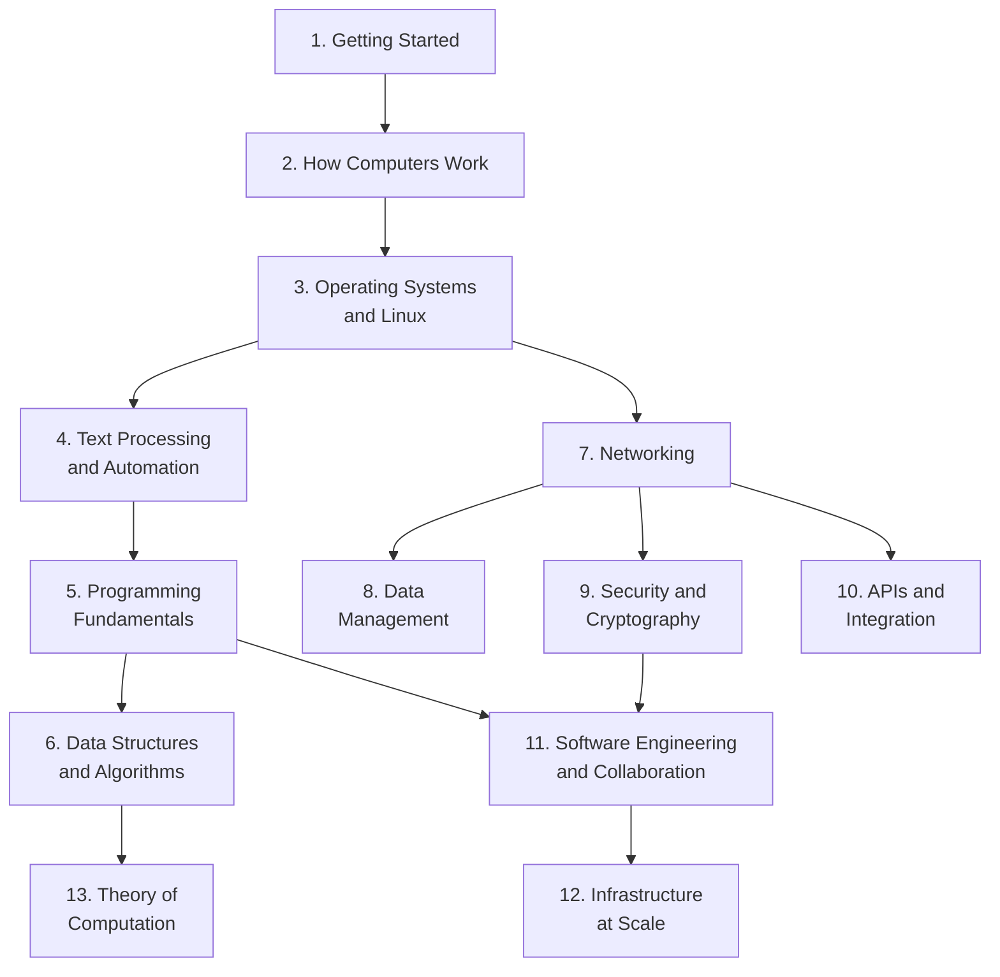

# Getting Started

Welcome to the **First Principles** path. This is not a collection of tutorials. It is a single, integrated curriculum that takes you from zero professional computing experience to deep expertise — the kind of expertise where you can explain *why* something works, not just *how* to use it. Every concept builds on the one before it. Theory and practice are never separated. Mathematics appears inside the domains that need it, at the moment it becomes necessary.

By the time you complete all 13 domains, you will be able to explain the internals of the systems you operate, troubleshoot problems others cannot by reasoning from first principles, make architectural decisions with informed tradeoffs, and teach these concepts to someone else.

## Why It Matters

The tech industry has two dominant educational models, and both have a critical gap.

**University programs** teach computer science theory — algorithms, operating systems, networking, formal computation — but often in isolation from real systems. Students learn page replacement algorithms without ever observing a page fault. They study TCP congestion control without capturing a single packet. The theory is rigorous, but without practice, it remains abstract.

**Bootcamps and certification programs** teach practical skills — Docker, Kubernetes, Terraform, CI/CD pipelines — but skip the theory underneath. Learners can deploy a container without understanding that it is namespaces and cgroups. They can write SQL queries without understanding B-tree indexes. The practice is real, but without theory, troubleshooting novel problems becomes guesswork.

This path integrates both. Every theoretical concept is immediately grounded in something you can observe on a running system. Every practical skill is explained by the theory underneath it. The result is professionals who can both *explain why* and *show how*.

## What You'll Learn

- What cloud computing, DevOps, SRE, and platform engineering roles do day-to-day and where they overlap
- How to set up a local learning environment: terminal emulator, Linux VM or cloud instance, SSH access
- How to navigate official documentation for any technology and extract what you need
- How this 13-domain path is structured and why theory and practice are integrated
- The three assessment dimensions — Explain, Build, Debug — and what they measure
- Learning strategies that produce lasting retention: active recall, spaced repetition, and the build-break-fix loop

---

## The Tech Career Landscape

### Theory

Cloud computing is the delivery of computing resources — servers, storage, networking, databases, software — over the internet on a pay-as-you-go basis. Instead of buying and maintaining physical hardware, organizations rent capacity from providers like Amazon Web Services (AWS), Microsoft Azure, and Google Cloud Platform (GCP). This shift has not eliminated the need for infrastructure expertise. It has amplified it. Cloud platforms offer hundreds of services, each with its own configuration, pricing, and failure modes.

Several distinct but overlapping career paths exist within this landscape:

| Role | Focus | Day-to-Day |
|------|-------|-----------|
| DevOps Engineer | Automating development and operations workflows | CI/CD pipelines, monitoring, incident response, infrastructure automation |
| Cloud Engineer | Designing and managing cloud infrastructure | AWS/Azure/GCP services, networking, cost optimization, architecture |
| Site Reliability Engineer (SRE) | Ensuring system reliability and performance | SLOs/SLAs, observability, chaos engineering, capacity planning |
| Platform Engineer | Building internal developer platforms | Developer toolchains, self-service infrastructure, abstractions |
| Infrastructure Engineer | Managing compute, storage, and networking | Hardware, virtualization, datacenter operations, hybrid cloud |

These roles share a common foundation: Linux, networking, security, automation, containers, and infrastructure as code. They diverge in emphasis — SREs focus on reliability metrics, cloud engineers on provider-specific services, platform engineers on developer experience — but the core knowledge is identical.

### Practice

Explore what these roles look like in practice. Open a job board (LinkedIn, Indeed, or a company's careers page) and search for three of the roles listed above. For each posting, identify:

1. Which technical skills appear most frequently (Linux, Python, Terraform, Kubernetes, AWS, etc.)
2. Whether the posting emphasizes theory (algorithms, system design) or practice (specific tools)
3. What experience level is expected

### Connection

Notice that the same foundational skills appear across every role. Linux is universal. Networking is everywhere. Git, containers, and infrastructure as code show up in every job description. This path teaches the concepts that do not change, using tools that are industry-standard today. The career you choose later is a specialization on top of this shared base.

> **Try It**: Find three job postings for different infrastructure roles. List the five most common technical requirements across all three. You will find significant overlap — that overlap is exactly what this path covers.

---

## How This Path Works

### The 13-Domain Structure

This path is organized into 13 domains. Each domain integrates theoretical depth with hands-on practice. The domains follow a dependency graph — not a simple linear sequence — because some concepts branch rather than stack.



| Domain | Title | What It Covers |
|--------|-------|---------------|
| 1 | [Getting Started](/learn/first-principles/getting-started/) | Career landscape, environment setup, learning strategy |
| 2 | [How Computers Work](/learn/first-principles/how-computers-work/) | Digital logic, processor architecture, memory hierarchy, data representation, boot process |
| 3 | [Operating Systems and Linux](/learn/first-principles/operating-systems-and-linux/) | Processes, scheduling, memory management, file systems, permissions, namespaces, cgroups |
| 4 | [Text Processing and Automation](/learn/first-principles/text-processing-and-automation/) | Vim, shell scripting, regular expressions, text processing pipelines |
| 5 | [Programming Fundamentals](/learn/first-principles/programming-fundamentals/) | Python, OOP, functional programming, testing, error handling |
| 6 | [Data Structures and Algorithms](/learn/first-principles/data-structures-and-algorithms/) | Formal data structures, complexity analysis, algorithm design paradigms |
| 7 | [Networking](/learn/first-principles/networking/) | Network models, protocols, routing, DNS, HTTP, TLS, SSH, firewalls |
| 8 | [Data Management](/learn/first-principles/data-management/) | Relational model, SQL, normalization, transactions, indexing, NoSQL |
| 9 | [Security and Cryptography](/learn/first-principles/security-and-cryptography/) | CIA triad, encryption, PKI, authentication, OWASP, hardening |
| 10 | [APIs and Integration](/learn/first-principles/apis-and-integration/) | REST, authentication, data formats, GraphQL, gRPC, webhooks |
| 11 | [Software Engineering and Collaboration](/learn/first-principles/software-engineering-and-collaboration/) | Git internals, design patterns, CI/CD, deployment strategies, GitOps |
| 12 | [Infrastructure at Scale](/learn/first-principles/infrastructure-at-scale/) | Containers at the kernel level, Kubernetes, Terraform |
| 13 | [Theory of Computation](/learn/first-principles/theory-of-computation/) | Automata, computability, complexity theory |

### Design Principles

Five principles shape every domain in this path:

1. **No purely theoretical domains.** Every domain includes hands-on practice. You do not learn about page replacement algorithms without observing page faults with `perf`.

2. **No purely practical domains.** Every domain includes conceptual depth. You do not learn Docker without understanding that containers are namespaces and cgroups — primitives you will build by hand in [Operating Systems and Linux](/learn/first-principles/operating-systems-and-linux/).

3. **Math is embedded, not front-loaded.** Boolean algebra appears inside digital logic. Modular arithmetic appears inside cryptography. Recurrence relations appear inside algorithm analysis. You learn the math when you need it, not in a standalone prerequisites course.

4. **Topic-level integration.** Theory and practice alternate within individual topics, not just between sections. Each topic contains a Theory subsection, a Practice subsection, and a Connection subsection that explains why both matter together.

5. **Zero assumptions.** The path assumes you have never touched a computer professionally. No prior programming experience. No prior Linux experience. No computer science background. You start here.

### What "Deep Expert" Means

A learner who completes all 13 domains can:

- **Explain internals** — not just use a tool, but describe how it works underneath. You do not just run `docker run`. You explain that Docker creates Linux namespaces and cgroups, which you set up by hand in Domain 3.
- **Troubleshoot from first principles** — diagnose problems others cannot by reasoning from foundational knowledge rather than pattern-matching error messages.
- **Make architectural decisions** — choose between approaches with informed tradeoffs, because you understand the underlying constraints.
- **Teach others** — explain concepts clearly enough to bring someone else up to speed, because you understand them deeply enough to simplify without distorting.

### Embedded Mathematics

No standalone math domains exist in this path. Every mathematical concept is taught inside the domain that needs it, at the moment it becomes necessary.

| Mathematical Topic | Taught In | Why It Is Needed There |
|--------------------|-----------|------------------------|
| Boolean algebra, De Morgan's laws | Domain 2: How Computers Work | Logic gate design, circuit simplification |
| Number systems (binary, hex, octal) | Domain 2: How Computers Work | Data representation, memory addresses |
| Two's complement, IEEE 754 | Domain 2: How Computers Work | Integer and floating-point representation |
| Proof by induction | Domain 6: Data Structures and Algorithms | Proving algorithm correctness |
| Recurrence relations, Master Theorem | Domain 6: Data Structures and Algorithms | Analyzing recursive algorithm complexity |
| Combinatorics | Domain 6: Data Structures and Algorithms | Counting states in backtracking |
| Probability | Domain 6: Data Structures and Algorithms | Hash collision analysis, average-case complexity |
| Graph theory | Domain 6: Data Structures and Algorithms | BFS, DFS, shortest path, spanning trees |
| Modular arithmetic | Domains 7 + 9: Networking, Security | IP subnetting, RSA, Diffie-Hellman |
| Number theory | Domain 9: Security and Cryptography | RSA key generation, cryptographic foundations |
| Bayes' theorem | Domain 9: Security and Cryptography | False positive reasoning in anomaly detection |
| Finite automata, regular languages | Domain 13: Theory of Computation | Formalizing regex, parsing, language recognition |

---

## The Assessment Model

Every domain is assessed across three dimensions. This is not a testing framework — it is a self-evaluation model that tells you whether you actually understand what you learned.

### Explain

Can you write or present a technical explanation demonstrating theoretical understanding? You cannot fake knowing how page replacement works or why RSA depends on the difficulty of factoring large primes. If you can explain it to someone who has never heard of it, you understand it.

### Build

Can you complete a project demonstrating practical skill? You cannot fake being able to deploy an application to Kubernetes or write a working CI/CD pipeline. Building requires real competence, not just conceptual familiarity.

### Debug

Can you troubleshoot a broken system where the fix requires first-principles reasoning, not just searching the error message? This is the most important dimension. It is what separates understanding from memorization. Given a misbehaving system, you use your theoretical knowledge to reason about what is wrong and your practical knowledge to find and fix it.

The Debug assessment is the bridge between theory and practice. A university graduate may be able to Explain but not Build. A bootcamp graduate may be able to Build but not Explain. Neither can Debug a novel problem without the other. This path produces professionals who can do all three.

---

## Setting Up Your Environment

Before you begin Domain 2, you need a working terminal environment with access to a Linux system. The specific setup depends on your operating system.

### Windows

Install **WSL (Windows Subsystem for Linux)** to get a full Ubuntu environment running inside Windows. Open PowerShell as Administrator and run:

```powershell
wsl --install
```

This installs WSL 2 with Ubuntu by default. After installation, restart your computer, and Ubuntu will finish setting up. You will create a username and password for your Linux environment. Install [Windows Terminal](https://aka.ms/terminal) for a modern terminal experience.

Once WSL is installed, all terminal commands in this path should be run inside your Ubuntu environment, not in PowerShell or Command Prompt.

### macOS

The built-in Terminal app works out of the box. macOS is Unix-based, so most Linux commands work directly. For a more feature-rich experience, consider [iTerm2](https://iterm2.com/).

Install [Homebrew](https://brew.sh/), the standard package manager for macOS:

```bash
/bin/bash -c "$(curl -fsSL https://raw.githubusercontent.com/Homebrew/install/HEAD/install.sh)"
```

### Linux

If you are already running Linux, you are set. Ensure you are running a recent Ubuntu version (22.04 LTS or later) for compatibility with all commands in this path.

### All Platforms

Regardless of operating system:

- **Create a [GitHub account](https://github.com/)** — You will need it starting from [Software Engineering and Collaboration](/learn/first-principles/software-engineering-and-collaboration/).
- **Install a code editor** — [VS Code](https://code.visualstudio.com/) is recommended. It integrates well with the terminal, Git, and Docker.
- **Set up a Linux VM** (optional but recommended) — Install [VirtualBox](https://www.virtualbox.org/) or use [UTM](https://mac.getutm.app/) (macOS) and create an Ubuntu VM. Having a VM gives you a disposable environment where you can break things without consequences — essential for the build-break-fix learning loop.

> **Try It**: Set up your terminal environment following the instructions above. Open a terminal and verify it works:
>
> ```bash
> # Check your shell
> echo $SHELL
>
> # Check the OS
> uname -a
>
> # Verify basic commands work
> whoami
> pwd
> ls
> ```
>
> If all four commands produce output, your environment is ready.

---

## Learning Strategy

### Theory

Cognitive science research consistently shows that certain study strategies produce dramatically better retention than others. Three strategies are particularly effective for technical learning:

**Active recall** means testing yourself on material rather than passively rereading it. After learning a concept, close the page and try to explain it from memory. The effort of retrieval strengthens the memory far more than rereading ever could.

**Spaced repetition** means reviewing material at increasing intervals. Instead of cramming all at once, revisit concepts after one day, then three days, then a week, then a month. Each review strengthens long-term retention. Tools like Anki formalize this, but even a simple habit of revisiting previous domains works.

**The build-break-fix loop** means learning by intentionally destroying things. Set up a system, break it on purpose, then figure out how to fix it. This is the most effective strategy for building troubleshooting skills, because it forces you to reason about what went wrong and why. Every domain in this path includes exercises that follow this pattern.

### Practice

Start applying these strategies immediately:

1. **Lab notebook** — Create a plain text file or markdown document where you record what you learn. Writing forces you to organize your thoughts. Use your own words, not copy-paste.

2. **Documentation-first habit** — When you encounter a new command or tool, your first stop should be official documentation: `man` pages, `--help` flags, official docs sites, and RFCs. Tutorials are useful, but documentation is authoritative.

3. **Build-break-fix from day one** — In Domain 2, you will inspect hardware. In Domain 3, you will create zombie processes and deadlocks intentionally. In Domain 7, you will deliberately break networking and diagnose it layer by layer. Embrace this pattern.

### Connection

The reason this path integrates theory and practice is not pedagogical preference — it is cognitive necessity. Understanding *why* something works creates durable knowledge that transfers to new situations. Knowing *how* to do something creates executable skill. Neither alone produces expertise. Together, they produce professionals who can handle problems they have never seen before.

> **Try It**: Create your lab notebook now. It can be a local file, a GitHub repo, or even a physical notebook. Write your first entry: what brought you to this path, what you hope to learn, and which career direction interests you most.

---

## Certifications and Credentials

### Theory

Certifications serve specific purposes in the tech industry:

**When certifications help:**
- Career switching — they signal baseline competence to employers who do not know you
- HR filters — many job postings require or prefer specific certifications
- Structured learning — studying for a certification provides a curriculum and deadline
- Compliance — some organizations require certifications for regulatory reasons

**When certifications do not help:**
- Credential stacking without depth — five entry-level certifications do not equal one year of real experience
- Substituting for understanding — passing a multiple-choice exam does not mean you can troubleshoot a production outage

### Practice

Major certification paths and how they map to this curriculum:

| Certification | Provider | Maps to Domains |
|--------------|----------|----------------|
| AWS Solutions Architect | Amazon | 7, 9, 10, 12 |
| Azure Administrator | Microsoft | 3, 7, 9, 12 |
| GCP Associate Cloud Engineer | Google | 7, 9, 10, 12 |
| CKA (Certified Kubernetes Administrator) | CNCF | 3, 7, 12 |
| Terraform Associate | HashiCorp | 11, 12 |
| CompTIA Linux+ | CompTIA | 2, 3, 4 |
| RHCSA | Red Hat | 3, 4, 9 |

### Connection

This path is not a certification prep course. It goes deeper than any certification requires, because certifications test breadth at the expense of depth. However, completing this path will leave you well-prepared for any of the certifications listed above, because you will understand the concepts underneath the exam topics rather than memorizing answers.

---

## What to Expect

This path represents a significant investment of effort. Some domains will click immediately. Others will require multiple passes. Both experiences are normal.

**Go in order within the dependency graph.** Each domain assumes you have completed its prerequisites. [Data Structures and Algorithms](/learn/first-principles/data-structures-and-algorithms/) assumes you can write Python from [Programming Fundamentals](/learn/first-principles/programming-fundamentals/). [Infrastructure at Scale](/learn/first-principles/infrastructure-at-scale/) assumes you understand namespaces from [Operating Systems and Linux](/learn/first-principles/operating-systems-and-linux/). Skipping domains creates gaps that will slow you down later.

**Do every Try It and exercise.** Reading about commands is not the same as running them. The hands-on components are where concepts move from abstract to concrete. Do them all, even the ones that seem simple.

**Revisit previous domains.** Earlier domains become richer after you see how concepts connect later. The networking concepts from Domain 7 take on new meaning when you are configuring Kubernetes network policies in Domain 12. Going back is not a sign of failure — it is part of the process.

**Use all three assessment dimensions.** After each domain, test yourself: Can you Explain the core concepts to someone who has never heard of them? Can you Build the systems described in the exercises? Can you Debug a broken version of those systems? If any dimension is weak, you know exactly where to focus.

---

## Exercises

- Search three job postings for different infrastructure roles and identify the five most common technical requirements across all three
- Set up a complete learning environment: terminal, Linux access (native, WSL, or VM), GitHub account, code editor
- Create a lab notebook and write your first entry
- Read the `man` page for a command you have never used (try `man less` or `man grep`) and summarize what it does in your own words
- Write a learning plan with concrete milestones for the first four domains

## Assessment Dimensions

### Explain

You can describe the tech career landscape without buzzwords. You can articulate why this path integrates theory and practice rather than separating them. You can explain the three assessment dimensions and why Debug is the most important.

### Build

You have a working Linux environment you built yourself. You have a lab notebook. You have a written learning plan with milestones.

### Debug

You can identify when a learning resource (tutorial, course, certification prep) is teaching you to pattern-match rather than understand. You can distinguish between "I can follow the steps" and "I can explain why the steps work."

---

## Key Takeaways

- The tech industry needs professionals who can both explain *why* and show *how* — this path produces both
- 13 domains follow a dependency graph from digital logic through infrastructure at scale and the formal limits of computation
- Theory and practice are integrated at the topic level, not separated into different courses
- Mathematics is embedded inside the domains that need it, at the moment it becomes necessary
- Three assessment dimensions — Explain, Build, Debug — measure understanding, not memorization
- Active recall, spaced repetition, and the build-break-fix loop are the most effective learning strategies
- Certifications are valuable for specific purposes but are not a substitute for deep understanding

## Resources & Further Reading

- [WSL Installation Guide](https://learn.microsoft.com/en-us/windows/wsl/install)
- [Homebrew](https://brew.sh/)
- [GitHub](https://github.com/)
- [VS Code](https://code.visualstudio.com/)
- [iTerm2](https://iterm2.com/)
- [Windows Terminal](https://aka.ms/terminal)
- [VirtualBox](https://www.virtualbox.org/)
- [UTM for macOS](https://mac.getutm.app/)
- [Roadmap.sh — DevOps Roadmap](https://roadmap.sh/devops)
- [Anki — Spaced Repetition Software](https://apps.ankiweb.net/)
