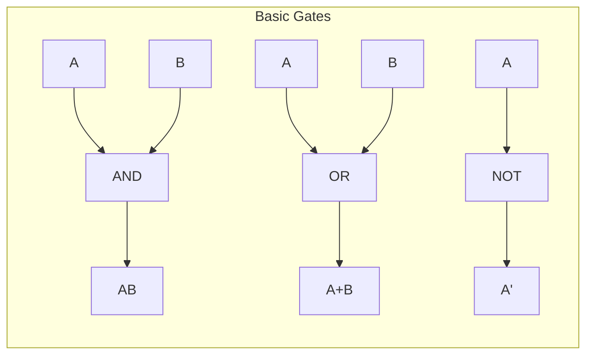
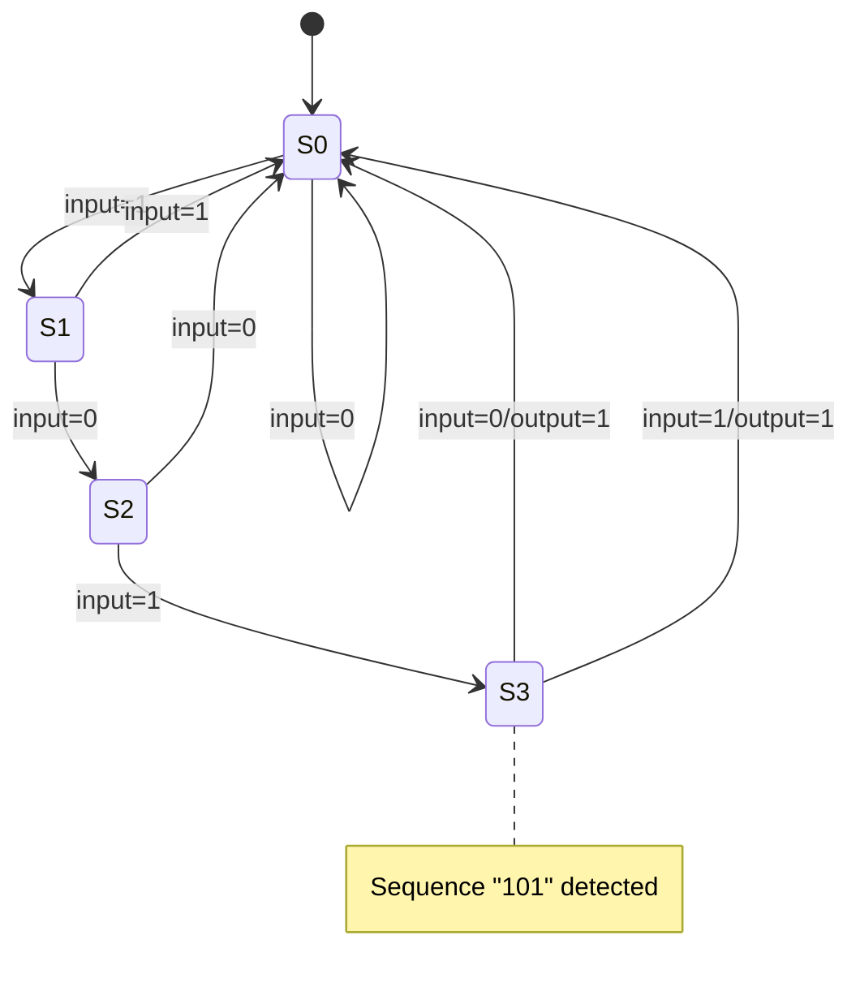
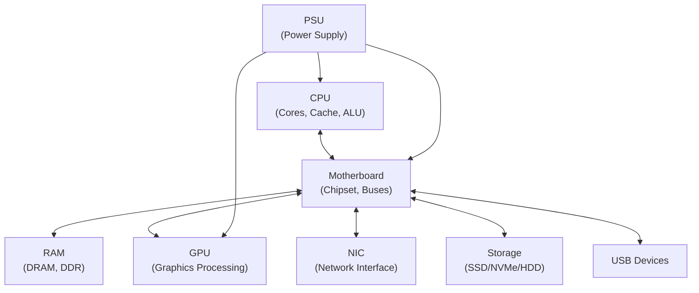
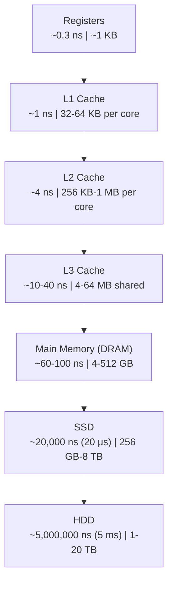
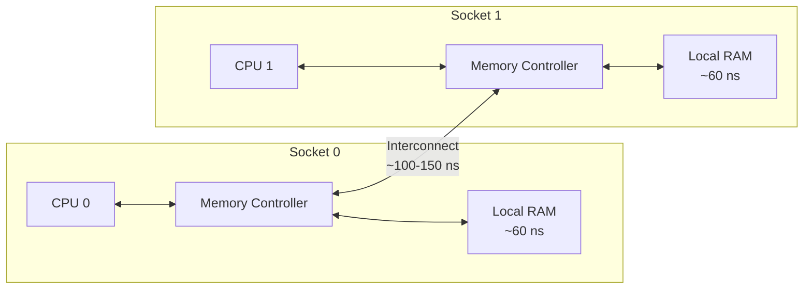
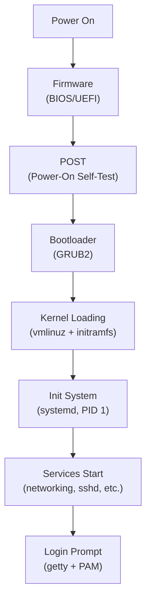
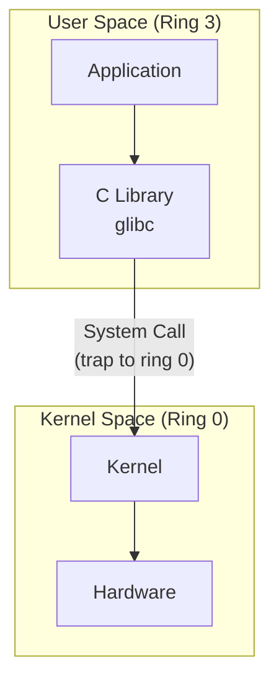
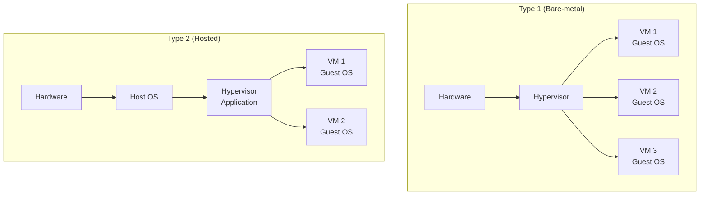

# How Computers Work

Every piece of software you will ever write, deploy, or debug runs on physical hardware. When a container crashes, a disk fills up, a CPU spikes to 100%, or a network packet disappears, the answer is always in the hardware and the layers just above it. This domain teaches you how computers actually work — from the transistors that implement logic gates through the boot sequence that hands control to an operating system. You will learn Boolean algebra because it is the mathematics of digital circuits. You will learn processor architecture because it determines how instructions execute. You will learn data representation because every byte in memory has a specific encoding. You will learn the memory hierarchy because it explains why some operations are fast and others are slow. You will learn the boot process because it connects power-on to login prompt. You will learn virtualization because modern infrastructure runs on it.

By the end of this domain, you will be able to read `lscpu` output and understand every field. You will know why your L1 cache is measured in kilobytes and your RAM in gigabytes. You will be able to convert between binary, decimal, and hexadecimal in your head. You will understand what happens in the two seconds between pressing the power button and seeing a GRUB menu. None of this is trivia. It is the foundation that makes [Operating Systems and Linux](/learn/first-principles/operating-systems-and-linux/) and every domain after it comprehensible.

This domain covers seven topic areas: Boolean algebra and digital logic (the mathematical and physical foundations), processor architecture (how instructions are executed), hardware components (what each physical part does), the memory hierarchy (why speed varies by orders of magnitude), data representation (how information is encoded in binary), the boot process (how a machine goes from powered-off to operational), and virtualization (how one machine becomes many). Each area builds on the previous ones, and together they give you a complete mental model of the machine.

---

## A. Boolean Algebra and Digital Logic

### Theory

Every digital computer is built from circuits that manipulate two voltage levels: high and low, which we represent as 1 and 0. The mathematics that governs these binary values is Boolean algebra, developed by George Boole in 1854 — over a century before the first programmable computer. Understanding Boolean algebra is not optional. It is the language in which all digital hardware is designed.

**Math (embedded):** Boolean algebra operates on a set {0, 1} with three fundamental operations:

| Operation | Symbol | Notation | Definition |
|-----------|--------|----------|------------|
| AND | . | A . B or AB | Output is 1 only when both inputs are 1 |
| OR | + | A + B | Output is 1 when at least one input is 1 |
| NOT | ' or bar | A' or ~A | Output is the complement of the input |

The truth tables for these operations are:

| A | B | A AND B | A OR B | NOT A |
|---|---|---------|--------|-------|
| 0 | 0 | 0 | 0 | 1 |
| 0 | 1 | 0 | 1 | 1 |
| 1 | 0 | 0 | 1 | 0 |
| 1 | 1 | 1 | 1 | 0 |

From these three, we derive additional operations:

| Operation | Expression | Description |
|-----------|-----------|-------------|
| NAND | (AB)' | NOT AND — universal gate |
| NOR | (A+B)' | NOT OR — universal gate |
| XOR | A'B + AB' | Exclusive OR — output 1 when inputs differ |
| XNOR | AB + A'B' | Exclusive NOR — output 1 when inputs match |

NAND and NOR are called **universal gates** because any Boolean function can be built using only NAND gates or only NOR gates. This matters in chip manufacturing: fabricating one gate type is cheaper than fabricating many.

#### Boolean Algebra Laws

**Math (embedded):** Boolean algebra obeys a set of laws that let you simplify expressions before building circuits. Fewer terms mean fewer gates, which means less silicon, less power, and less heat.

| Law | AND Form | OR Form |
|-----|----------|---------|
| Identity | A . 1 = A | A + 0 = A |
| Null | A . 0 = 0 | A + 1 = 1 |
| Idempotent | A . A = A | A + A = A |
| Complement | A . A' = 0 | A + A' = 1 |
| Commutative | AB = BA | A + B = B + A |
| Associative | (AB)C = A(BC) | (A+B)+C = A+(B+C) |
| Distributive | A(B+C) = AB + AC | A + BC = (A+B)(A+C) |
| Absorption | A(A+B) = A | A + AB = A |
| **De Morgan's** | **(AB)' = A' + B'** | **(A+B)' = A'B'** |

De Morgan's laws are the most important simplification tool you have. They tell you how to negate compound expressions: the complement of an AND is the OR of the complements, and vice versa. You will use De Morgan's laws every time you write a conditional in code, configure a firewall rule, or simplify a logic circuit.

**Example simplification:**

Simplify F = A'B + AB' + AB:

```
F = A'B + AB' + AB
F = A'B + A(B' + B)       [factor out A]
F = A'B + A(1)             [complement law: B' + B = 1]
F = A'B + A                [identity law]
F = A + A'B                [commutative]
F = A + B                  [absorption: A + A'B = A + B]
```

The expression reduced from three terms with six literals to two terms with two literals. In hardware, that is fewer gates and faster propagation.

#### Karnaugh Maps

**Math (embedded):** A Karnaugh map (K-map) is a graphical method for simplifying Boolean expressions. It arranges truth table values in a grid where adjacent cells differ by exactly one variable (Gray code ordering), making it visual to spot groups of 1s that can be combined.

For a 2-variable K-map:

```
        B=0   B=1
A=0  |  m0  |  m1  |
A=1  |  m2  |  m3  |
```

For a 3-variable K-map:

```
          BC=00  BC=01  BC=11  BC=10
A=0    |  m0   |  m1   |  m3   |  m2   |
A=1    |  m4   |  m5   |  m7   |  m6   |
```

Rules for grouping:
1. Group only 1s (for Sum of Products) or only 0s (for Product of Sums)
2. Groups must be rectangular and contain 2^n cells (1, 2, 4, 8, ...)
3. Groups can wrap around edges
4. Every 1 must be in at least one group
5. Make groups as large as possible
6. A variable that appears in both complemented and uncomplemented form within a group is eliminated

**Example:** Simplify F(A,B,C) = sum of minterms (0, 2, 4, 5, 6):

```
          BC=00  BC=01  BC=11  BC=10
A=0    |  1    |  0    |  0    |  1    |
A=1    |  1    |  1    |  0    |  1    |
```

Step 1: Identify all cells with value 1: m0(A=0,B=0,C=0), m2(A=0,B=1,C=0), m4(A=1,B=0,C=0), m5(A=1,B=0,C=1), m6(A=1,B=1,C=0).

Step 2: Look at columns. The BC=00 column has all 1s (m0, m4) — that group eliminates B and C, giving A' + A... wait. Let us group systematically. All cells in the B=0 columns (BC=00 and BC=01): m0, m5, m4, and... Note that BC=00 has B=0,C=0 and BC=01 has B=0,C=1. The cells with B=0 are: m0 (BC=00, A=0), m4 (BC=00, A=1), m5 (BC=01, A=1). That is only 3 cells — not a power of 2. But we can group m0 and m4 (BC=00 column): eliminates A, gives B'C'. And group m4 and m5 (A=1, BC=00 and BC=01): eliminates C, gives AB'.

Step 3: We still need to cover m2 (A=0, BC=10) and m6 (A=1, BC=10). Group m2 and m6 (BC=10 column): eliminates A, gives BC'. And m0 and m4 already covered by B'C'. But can we do better?

Step 4: Look for larger groups. The four cells m0, m2, m4, m6 all have C=0. Group them (2x2 rectangle wrapping around): eliminates A and B, gives C'. Then group m4 and m5 (adjacent): eliminates C, gives AB'.

Result: **F = C' + AB'**

Verify: C'=1 covers m0(C=0), m2(C=0), m4(C=0), m6(C=0). AB'=1 covers m4(A=1,B=0) and m5(A=1,B=0). All five minterms are covered. No minterm outside the set is covered. Correct.

**4-variable K-map example:** For functions with 4 variables (A, B, C, D), the K-map is a 4x4 grid:

```
            CD=00  CD=01  CD=11  CD=10
AB=00    |  m0   |  m1   |  m3   |  m2   |
AB=01    |  m4   |  m5   |  m7   |  m6   |
AB=11    |  m12  |  m13  |  m15  |  m14  |
AB=10    |  m8   |  m9   |  m11  |  m10  |
```

Remember: both row and column labels follow Gray code order (00, 01, 11, 10), and the grid wraps around — the top row is adjacent to the bottom row, and the left column is adjacent to the right column.

K-maps become unwieldy beyond 5-6 variables. For larger expressions, the **Quine-McCluskey algorithm** provides a systematic, tabular approach that is equivalent to K-map minimization but can be automated. It finds all prime implicants, then selects the minimum covering set.

#### Logic Gates and Circuit Design

A logic gate is the physical implementation of a Boolean operation. Gates are built from transistors — tiny switches etched into silicon. A modern CPU contains billions of transistors organized into gates, which are organized into functional units.

**From transistors to gates:** Modern chips use CMOS (Complementary Metal-Oxide-Semiconductor) technology. A CMOS inverter (NOT gate) uses two transistors — one PMOS (conducts when input is low) and one NMOS (conducts when input is high). A NAND gate uses four transistors. The fundamental building block of all digital logic is the transistor acting as a voltage-controlled switch.

**Propagation delay:** Every gate takes a small but non-zero time to produce its output after the inputs change. For modern CMOS at 7nm process: ~10-50 picoseconds per gate. The critical path — the longest chain of gates between any input and any output — determines the maximum clock speed of the circuit.

**Fan-in and fan-out:** Fan-in is the number of inputs to a gate. Fan-out is the number of gates driven by one output. Both are limited by electrical characteristics. High fan-out requires buffer gates to maintain signal quality.

Standard logic gate symbols and their transistor counts:

| Gate | Transistors (CMOS) | Inputs | Function |
|------|-------------------|--------|----------|
| NOT (Inverter) | 2 | 1 | Output = A' |
| NAND | 4 | 2 | Output = (AB)' |
| NOR | 4 | 2 | Output = (A+B)' |
| AND | 6 | 2 | NAND + NOT |
| OR | 6 | 2 | NOR + NOT |
| XOR | 8-12 | 2 | Output = A'B + AB' |



#### Combinational Circuits

Combinational circuits produce outputs that depend only on current inputs — no memory, no state. Key combinational circuits:

**Multiplexer (MUX):** Selects one of 2^n inputs based on n select lines. A 2:1 MUX implements: Y = S'A + SB. When S=0, output is A. When S=1, output is B. Multiplexers are how CPUs route data between functional units.

**Demultiplexer (DEMUX):** Routes one input to one of 2^n outputs based on select lines. The inverse of a MUX.

**Encoder:** Converts 2^n input lines to n output lines. A priority encoder outputs the binary code of the highest-priority active input. Used in interrupt controllers.

**Decoder:** Converts n input lines to 2^n output lines. Exactly one output is active for each input combination. Used in memory address decoding — the address bus feeds a decoder that activates the correct memory chip.

**Half Adder:** Adds two single bits. Sum = A XOR B. Carry = A AND B.

**Full Adder:** Adds two bits plus a carry-in. Sum = A XOR B XOR Cin. Carry = AB + Cin(A XOR B). Chain n full adders together and you get an n-bit ripple carry adder — the simplest way to add binary numbers.

**Adder architectures and speed tradeoffs:**

| Adder Type | Delay | Gate Count | Description |
|-----------|-------|------------|-------------|
| Ripple Carry | O(n) | O(n) | Carry propagates through all n stages serially |
| Carry-Lookahead | O(log n) | O(n log n) | Precomputes carries using generate/propagate signals |
| Carry-Select | O(sqrt(n)) | O(n) | Computes two results (carry=0 and carry=1) in parallel, selects when carry arrives |
| Carry-Save | O(1) per stage | O(n) | Used in multipliers — reduces three numbers to two without propagating carry |

A 64-bit ripple carry adder has 64 stages of carry propagation. At ~50 ps per gate, that is ~3.2 ns — too slow for a 4 GHz processor (0.25 ns clock period). Carry-lookahead reduces this to ~6-7 gate delays (~350 ps), which fits comfortably in one clock cycle. This is why understanding circuit design matters: the choice of adder architecture directly determines the maximum clock speed.

**Subtractor:** Subtraction is addition with two's complement. To compute A - B: invert all bits of B (using XOR gates with a control signal), set the carry-in to 1, and add. The same adder hardware does both addition and subtraction — this is why the ALU is not two separate circuits.

**Comparator:** Compares two n-bit numbers. Built from a subtractor — subtract and examine the sign bit and zero flag. A < B if the result is negative. A == B if the result is zero. A > B otherwise. The condition codes (flags) in the CPU's status register are set this way after every ALU operation.

#### Sequential Circuits

Sequential circuits have memory. Their outputs depend on current inputs AND previous state. This is what makes computation possible — without memory, a circuit cannot execute a sequence of instructions.

**SR Latch:** The simplest memory element. Two cross-coupled NOR (or NAND) gates. Set input stores a 1; Reset input stores a 0. Has an invalid state when both S and R are active simultaneously.

**D Flip-Flop:** Captures the input (D) value on the clock edge and holds it until the next clock edge. Eliminates the SR latch's invalid state. This is the building block of all registers in a CPU.

**JK Flip-Flop:** Like SR but with the invalid state replaced by a toggle behavior (when J=K=1, output toggles). More versatile than D but less common in modern designs.

**T Flip-Flop:** Toggles on each clock edge when T=1. Built from a JK flip-flop with J=K=T. Used in counters.

**Registers:** A group of D flip-flops sharing a clock signal. An n-bit register stores n bits. The program counter, instruction register, and general-purpose registers in a CPU are all built from D flip-flops.

**Counters:** Registers that cycle through a sequence of states. A 4-bit binary counter counts 0000 through 1111 and wraps around. Used for timing, address generation, and instruction sequencing.

- **Asynchronous (ripple) counter:** Each flip-flop is clocked by the output of the previous one. Simple but the count ripples through with cumulative delay. Unreliable at high speeds.
- **Synchronous counter:** All flip-flops share the same clock. Combinational logic determines the next state. Faster and more reliable. Used in practice.
- **Up/down counter:** Can count in either direction based on a control signal.
- **Ring counter:** A shift register with the output fed back to the input. Only one bit is set at a time, cycling through positions. Used for sequencing.
- **Johnson counter:** A twisted ring counter — the inverted output feeds back to the input. Produces 2n states from n flip-flops (vs. n states for a ring counter).

#### Finite State Machines

A finite state machine (FSM) is a sequential circuit that transitions between a finite set of states based on inputs and the current state.

**Moore Machine:** Outputs depend only on the current state. Output changes on clock edges. Simpler to design, more predictable timing.

**Mealy Machine:** Outputs depend on the current state AND current inputs. Can react faster (within a clock cycle) but has more complex timing analysis.

FSMs are everywhere in hardware: memory controllers, bus arbiters, network protocol handlers, and CPU control units are all FSMs.



#### PLDs and FPGAs

**Programmable Logic Devices (PLDs)** allow you to implement custom logic without fabricating a chip:

- **PAL (Programmable Array Logic):** Programmable AND array, fixed OR array. One-time programmable.
- **PLA (Programmable Logic Array):** Both AND and OR arrays are programmable. More flexible than PAL.
- **CPLD (Complex PLD):** Multiple PLD blocks connected by an interconnect. Programmable many times.
- **FPGA (Field-Programmable Gate Array):** A grid of configurable logic blocks (CLBs) connected by programmable routing. Each CLB contains lookup tables (LUTs), flip-flops, and multiplexers. FPGAs can implement any digital circuit and are reprogrammable.

FPGAs are used in networking equipment (custom packet processing), data centers (accelerating specific workloads like machine learning inference), and prototyping (testing chip designs before fabrication). AWS offers FPGA instances (F1) for custom hardware acceleration in the cloud.

### Practice

Boolean simplification with pen and paper is the practice for this section. Hardware inspection comes later in section C.

> **Try It**: Simplify the following expressions using Boolean algebra laws. Show each step and name the law used.
>
> 1. F = AB + AB' + A'B
> 2. F = (A + B)(A + B')
> 3. F = A'B'C + A'BC + AB'C + ABC
>
> Then draw the K-map for expression 3 and verify your algebraic result.

> **Try It**: Draw the gate-level circuit for a 2:1 multiplexer using only NAND gates. Hint: first express Y = S'A + SB, then apply De Morgan's laws to convert to NAND-only form.

> **Try It**: Design a 2-bit binary counter using T flip-flops. Draw the state diagram (four states: 00, 01, 10, 11) and then the circuit. Verify that the counter cycles through all four states.

### Connection

Boolean algebra is not just hardware theory. Every `if` statement you write, every firewall rule you configure, every search query you construct uses Boolean logic. De Morgan's laws explain why `!(a && b)` is the same as `(!a || !b)` in every programming language. Understanding gates and circuits explains why CPUs can only do simple operations fast — addition, comparison, bit shifting — and everything else is built from those primitives. When you reach [Programming Fundamentals](/learn/first-principles/programming-fundamentals/), bitwise operators will make immediate sense because you will know what the hardware is doing.

---

## B. Processor Architecture

### Theory

The processor (CPU) is the component that executes instructions. Everything a computer does — displaying text, sending packets, encrypting data — is ultimately a sequence of CPU instructions. Understanding processor architecture means understanding how those instructions are represented, decoded, and executed.

#### Instruction Set Architecture (ISA)

The ISA is the contract between hardware and software. It defines the instructions a processor can execute, the registers available, the addressing modes, and the encoding format. Software compiled for one ISA will not run on another without translation.

Two dominant ISA philosophies exist:

| Attribute | CISC | RISC |
|-----------|------|------|
| Full name | Complex Instruction Set Computer | Reduced Instruction Set Computer |
| Example | x86, x86-64 (Intel, AMD) | ARM, RISC-V, MIPS |
| Instruction count | Hundreds to thousands | Typically fewer than 200 |
| Instruction length | Variable (1-15 bytes for x86) | Fixed (4 bytes for ARM/RISC-V) |
| Instruction complexity | Single instruction can do memory load + computation | Each instruction does one thing |
| Execution | Most instructions take multiple cycles | Most instructions complete in one cycle |
| Memory access | Many instructions can access memory directly | Only load/store instructions access memory |
| Design philosophy | Hardware complexity for programmer convenience | Hardware simplicity for pipeline efficiency |

In practice, modern x86 processors translate complex CISC instructions into simpler micro-operations (uops) internally. The external interface is CISC; the internal execution engine is RISC-like. ARM has also grown more complex over time. The distinction matters historically and architecturally, but modern processors are hybrid.

**x86-64 (AMD64):** Dominates servers, desktops, and laptops. Every major cloud provider runs x86-64 instances. You will encounter it in `lscpu` output as `x86_64`.

**ARM (AArch64):** Dominates mobile devices and is rapidly expanding into servers. AWS Graviton processors, Apple Silicon (M-series), and Ampere Altra are all ARM. You will encounter it as `aarch64`.

#### Assembly Concepts

Assembly language is a human-readable representation of machine instructions. Each assembly instruction maps (nearly) one-to-one to a machine instruction.

Key concepts:

**Registers:** Small, fast storage locations inside the CPU. x86-64 has 16 general-purpose 64-bit registers (RAX, RBX, RCX, RDX, RSI, RDI, RBP, RSP, R8-R15) plus special-purpose registers (RIP for instruction pointer, RFLAGS for condition codes). ARM has 31 general-purpose 64-bit registers (X0-X30) plus SP and PC.

**Addressing modes:** How instructions specify operand locations:
- **Immediate:** Value is in the instruction itself (`MOV RAX, 42`)
- **Register:** Value is in a register (`ADD RAX, RBX`)
- **Direct:** Value is at a memory address (`MOV RAX, [0x1000]`)
- **Register indirect:** Address is in a register (`MOV RAX, [RBX]`)
- **Base + displacement:** Address = register + constant (`MOV RAX, [RBP-8]`)
- **Scaled index:** Address = base + index*scale + displacement (`MOV RAX, [RBX+RCX*4+8]`)

**Instruction encoding:** The binary representation of an instruction. In x86-64, instructions vary from 1 to 15 bytes. The encoding includes an opcode (what operation), operand specifiers (which registers/memory), and optional prefixes (operand size overrides, REX prefix for 64-bit operations). ARM uses a fixed 4-byte encoding, which simplifies the decode stage.

**A simple example in x86-64 assembly:**

```
; Compute sum = a + b where a=5, b=3
mov  rax, 5      ; load immediate value 5 into register RAX
mov  rbx, 3      ; load immediate value 3 into register RBX
add  rax, rbx    ; rax = rax + rbx = 8
; Result is now in RAX
```

```
; A function call: printf("Hello")
section .data
    msg db "Hello", 0       ; null-terminated string

section .text
    lea  rdi, [msg]          ; load address of msg into RDI (first argument)
    xor  eax, eax            ; zero RAX (no floating-point args for printf)
    call printf              ; call the C library function
```

You do not need to memorize assembly syntax. What matters is understanding that every high-level operation — assigning a variable, calling a function, evaluating an `if` statement — compiles down to a sequence of these primitive instructions. The compiler's job is to translate your Python or C code into an efficient sequence of assembly instructions for the target ISA.

**The stack:** x86-64 uses a region of memory called the stack for function calls. The RSP register points to the top of the stack. When a function is called, the return address is pushed onto the stack. Local variables are allocated by decrementing RSP. When the function returns, the stack is unwound. Stack overflows happen when recursion goes too deep or local arrays are too large — the stack grows beyond its allocated region.

#### The Fetch-Decode-Execute Cycle

Every instruction the CPU executes follows this cycle:


1. **Fetch:** The CPU reads the instruction from memory at the address in the program counter (PC/RIP). The instruction is loaded into the instruction register.
2. **Decode:** The control unit interprets the opcode and operands. For x86, this includes translating complex instructions into micro-operations.
3. **Execute:** The ALU (arithmetic logic unit) performs the operation — add, subtract, compare, shift, etc.
4. **Memory Access:** If the instruction reads from or writes to memory, the memory access happens here.
5. **Write Back:** The result is written to the destination register.

In the simplest (single-cycle) design, the entire cycle completes in one clock cycle. The clock speed must be slow enough for the longest instruction to complete. This wastes time on short instructions.

A **multi-cycle** design breaks each instruction into multiple clock cycles. Shorter instructions use fewer cycles. This improves clock speed but adds complexity.

#### Pipelining

Pipelining is the key optimization that makes modern processors fast. Instead of waiting for one instruction to complete before starting the next, the processor overlaps instruction execution — like an assembly line.

```
Clock cycle:  1    2    3    4    5    6    7    8
Instr 1:     [F]  [D]  [E]  [M]  [W]
Instr 2:          [F]  [D]  [E]  [M]  [W]
Instr 3:               [F]  [D]  [E]  [M]  [W]
Instr 4:                    [F]  [D]  [E]  [M]  [W]
```

Without pipelining, four instructions take 20 cycles (5 each). With a 5-stage pipeline, they complete in 8 cycles. In steady state, one instruction completes every cycle — a 5x throughput improvement. The latency for each individual instruction is still 5 cycles, but throughput (instructions per cycle) approaches 1.

#### Pipeline Hazards

Pipelining breaks when instructions depend on each other:

**Data Hazards (RAW — Read After Write):**
```
ADD R1, R2, R3    ; R1 = R2 + R3
SUB R4, R1, R5    ; R4 = R1 - R5  ← needs R1, which ADD hasn't written yet
```

Solutions:
- **Stalling:** Insert bubble (no-op) cycles until the data is available. Simple but wastes cycles.
- **Forwarding (bypassing):** Route the result directly from the execute stage of ADD to the execute stage of SUB, bypassing the write-back and register-read stages. Most modern processors do this.

**Control Hazards (branches):**
```
BEQ R1, R2, target    ; if R1 == R2, jump to target
ADD R3, R4, R5        ; ← should this instruction execute?
```

The pipeline has already fetched the ADD instruction, but the branch outcome is not known yet. If the branch is taken, the ADD must be discarded.

Solutions:
- **Branch prediction:** The processor guesses whether the branch will be taken and starts executing speculatively. Modern predictors achieve 95-99% accuracy using history tables and pattern matching.
  - **Static prediction:** Always predict not-taken, or predict backward branches taken (loops). Simple but limited.
  - **Dynamic prediction:** Use a Branch History Table (BHT) that records past outcomes. A 2-bit saturating counter per branch provides hysteresis — a branch must be mispredicted twice to change prediction.
  - **Branch Target Buffer (BTB):** Caches the target address of branches so the fetch stage can redirect immediately.
- **Misprediction penalty:** When prediction is wrong, the pipeline is flushed — all speculatively executed instructions are discarded. The penalty is proportional to pipeline depth (10-20 cycles on modern processors).

**Structural Hazards:** Two instructions need the same hardware unit simultaneously. Example: one instruction is in the memory-access stage (reading data memory) while another is in the fetch stage (reading instruction memory). Solution: use separate instruction and data caches (Harvard architecture internally). Another example: if the processor has only one multiply unit and two instructions both need it in the same cycle, one must stall. Modern processors mitigate this by duplicating frequently used functional units.

**WAW (Write After Write) and WAR (Write After Read) hazards:** These "name dependencies" occur when instructions reuse the same register without a true data dependency. Out-of-order processors solve them with **register renaming** — the processor maintains more physical registers than architectural registers and maps architectural names to physical registers dynamically. This eliminates false dependencies and allows more instructions to execute in parallel.

#### Superscalar and Out-of-Order Execution

Modern processors do not execute one instruction at a time. They execute multiple instructions per cycle.

**Superscalar:** The processor has multiple execution units (multiple ALUs, multiple load/store units) and dispatches multiple instructions per cycle. An 8-wide superscalar processor can potentially start 8 instructions per cycle.

**Out-of-order execution:** Instructions are dispatched to execution units not in program order, but as soon as their operands are ready. A scoreboard or reservation station tracks which instructions are ready. Results are committed in program order (via a reorder buffer) to maintain the illusion of sequential execution.

**Speculative execution:** The processor executes instructions past a branch before the branch outcome is known. If the prediction is correct, results are committed. If wrong, results are discarded. This keeps the pipeline full. The Spectre and Meltdown vulnerabilities (2018) exploited the side effects of speculative execution — even discarded results can leave traces in the cache.

#### Processor Performance

Key metrics:
- **Clock speed (GHz):** Cycles per second. A 4 GHz processor has 4 billion clock cycles per second. Higher is faster, but only meaningful within the same architecture.
- **IPC (Instructions Per Cycle):** How many instructions complete per cycle on average. Modern x86 processors achieve 4-6 IPC on typical workloads.
- **Performance = IPC x Clock Speed.** A 3 GHz processor with IPC of 5 is faster than a 5 GHz processor with IPC of 2.
- **TDP (Thermal Design Power):** The maximum heat the chip generates. Determines cooling requirements.

**Amdahl's Law:** If a fraction P of a program can be parallelized, the maximum speedup with N processors is:

```
Speedup = 1 / ((1 - P) + P/N)
```

If 90% of your program is parallelizable (P = 0.9), the maximum speedup with infinite cores is 1/(1-0.9) = 10x. The sequential 10% is the bottleneck. This is why adding more cores does not always help — the serial portion of your workload limits the benefit. Amdahl's Law explains why a 128-core server may not be 128x faster than a single core, and why optimizing the serial path often matters more than adding parallelism.

**Frequency scaling and power:** Power consumption is proportional to voltage squared times frequency: P ~ V^2 * f. To increase clock speed, you must increase voltage, which increases power quadratically. This is why clock speeds have plateaued around 4-5 GHz since ~2005 — going higher produces too much heat. The industry shifted to more cores at lower frequencies instead. This is called the "power wall" and it fundamentally changed processor design.

### Practice

```bash
# View CPU architecture details
lscpu

# Key fields to understand:
# Architecture:        x86_64 (ISA family)
# CPU op-mode(s):      32-bit, 64-bit
# Byte Order:          Little Endian
# CPU(s):              8 (total logical processors)
# On-line CPU(s) list: 0-7
# Thread(s) per core:  2 (hyperthreading/SMT enabled)
# Core(s) per socket:  4 (physical cores)
# Socket(s):           1 (physical CPU packages)
# Model name:          Intel(R) Core(TM) i7-10700 CPU @ 2.90GHz
# CPU MHz:             2900.000
# L1d cache:           256 KiB (data cache, 32 KiB per core)
# L1i cache:           256 KiB (instruction cache, 32 KiB per core)
# L2 cache:            2 MiB (256 KiB per core)
# L3 cache:            16 MiB (shared)
# Flags:               ... sse4_2 avx avx2 ... vmx ...
```

The `Flags` field lists CPU feature flags. Important ones:

| Flag | Meaning |
|------|---------|
| `lm` | Long mode — 64-bit support |
| `vmx` | Intel VT-x — hardware virtualization |
| `svm` | AMD-V — hardware virtualization |
| `sse4_2` | Streaming SIMD Extensions 4.2 |
| `avx` / `avx2` | Advanced Vector Extensions |
| `aes` | AES hardware acceleration |
| `hypervisor` | Running inside a virtual machine |

```bash
# On Linux, the raw CPU info from the kernel
cat /proc/cpuinfo | head -30

# Count physical cores
grep -c "^processor" /proc/cpuinfo

# Check for hardware virtualization support
grep -E "vmx|svm" /proc/cpuinfo
```

> **Try It**: Run `lscpu` on your system (Linux or WSL). Answer these questions from the output:
> 1. What ISA does your processor use?
> 2. How many physical cores and logical threads do you have?
> 3. Is hyperthreading/SMT enabled? How can you tell?
> 4. What are the L1, L2, and L3 cache sizes?
> 5. Does your CPU support hardware virtualization (vmx or svm)?
> 6. What is the byte order?

### Connection

Processor architecture determines what software can do efficiently. When a compiler produces a binary, it targets a specific ISA. When you choose an EC2 instance type (`c5` for Intel, `c6g` for Graviton ARM), you are choosing an ISA and the performance characteristics that come with it. Pipeline depth determines misprediction penalties, which is why branch-heavy code (deeply nested conditionals) is slower than branchless code. Out-of-order execution is why modern CPUs can execute your suboptimal code faster than you expect — but also why Spectre-class vulnerabilities exist. Understanding the processor is understanding the machine your software actually runs on.

---

## C. Hardware Components

### Theory

A computer is an assembly of specialized hardware components connected by buses. Each component has a specific role, specific performance characteristics, and specific failure modes. Knowing what each component does — and how they interact — is essential for troubleshooting, capacity planning, and architecture decisions.



#### CPU (Central Processing Unit)

The CPU executes instructions. Key attributes:

- **Cores:** Independent execution units. A 4-core CPU can execute 4 instruction streams simultaneously. More cores help with parallel workloads (web servers, build systems) but not single-threaded tasks.
- **Threads (SMT/Hyperthreading):** Each core can run two hardware threads simultaneously by sharing execution units. When one thread stalls (waiting for memory), the other can use the idle units. Typical improvement: 15-30% more throughput, not 100%.
- **Clock speed:** The rate at which the processor cycles. Base clock is the guaranteed sustained speed. Boost clock is the maximum speed under favorable thermal conditions.
- **VT-x / AMD-V:** Hardware virtualization extensions. Creates a new CPU privilege level (ring -1 / VMX root mode) for the hypervisor, allowing virtual machines to run at near-native speed. Without this, every privileged instruction in a VM must be trapped and emulated — orders of magnitude slower.

#### RAM (Random Access Memory)

RAM is the working memory where the CPU stores data it is actively using. It is volatile — contents are lost when power is removed.

**DRAM (Dynamic RAM):** Stores each bit as a charge in a tiny capacitor. The charge leaks, so DRAM must be refreshed thousands of times per second. Dense and cheap per bit. This is what "RAM" means in practice.

**SRAM (Static RAM):** Stores each bit in a flip-flop circuit (six transistors per bit). Does not need refreshing. Much faster than DRAM (sub-nanosecond access) but much more expensive. Used for CPU caches, not main memory.

| Attribute | DRAM | SRAM |
|-----------|------|------|
| Speed | ~60-100 ns | ~1-10 ns |
| Density | High (1 transistor + 1 capacitor per bit) | Low (6 transistors per bit) |
| Cost | Low | High |
| Refresh needed | Yes | No |
| Use | Main memory | CPU caches |

**DDR (Double Data Rate):** The interface standard for DRAM. DDR transfers data on both the rising and falling edges of the clock signal, doubling effective bandwidth.

| Generation | Transfer Rate | Typical Capacity | Release |
|-----------|---------------|-----------------|---------|
| DDR3 | 6.4-17 GB/s | 2-16 GB per module | 2007 |
| DDR4 | 17-25.6 GB/s | 4-64 GB per module | 2014 |
| DDR5 | 32-51.2 GB/s | 8-128 GB per module | 2020 |

**Channels and bandwidth:** Modern memory controllers support multiple channels — independent paths to separate sets of DIMM slots. Dual-channel doubles bandwidth by accessing two DIMMs simultaneously. DDR4-3200 in dual-channel: 3200 million transfers/second x 8 bytes/transfer x 2 channels = 51.2 GB/s theoretical peak. Server platforms often support quad-channel or even six-channel configurations for maximum bandwidth.

**ECC (Error-Correcting Code) RAM:** Adds an extra bit per byte for error detection and correction. Can detect 2-bit errors and correct 1-bit errors (SECDED — Single Error Correction, Double Error Detection). Standard in servers — a single bit flip in RAM can crash a process or corrupt data. Cosmic rays, electrical noise, and manufacturing defects cause bit flips. A Google study found roughly 25,000-75,000 correctable errors per billion device-hours per megabit — at scale (thousands of servers), bit flips happen regularly. ECC correction events are logged to `dmesg` and can be monitored with `edac-util` or `rasdaemon`.

#### Storage

Storage is non-volatile — data persists without power. Three main technologies:

**HDD (Hard Disk Drive):** Spinning magnetic platters with a read/write head on a mechanical arm. Sequential reads are fast (100-200 MB/s). Random reads are slow (0.5-10 ms seek time) because the arm must physically move. Capacity is high (up to 20+ TB). Cost per GB is the lowest. Still used for archival and bulk storage.

**SSD (Solid State Drive):** NAND flash memory with no moving parts. Random reads are 100-1000x faster than HDD (0.05-0.1 ms). Sequential reads reach 500-7000 MB/s. Lower capacity per dollar than HDD. NAND cells wear out after a limited number of writes (write endurance).

**NVMe (Non-Volatile Memory Express):** Not a storage technology — it is a protocol. NVMe connects SSDs directly to the CPU via PCIe, bypassing the SATA/AHCI protocol stack. NVMe SSDs support tens of thousands of I/O operations per second in parallel, compared to a few hundred for SATA.

| Attribute | HDD (7200 RPM) | SATA SSD | NVMe SSD |
|-----------|----------------|----------|----------|
| Sequential read | 150 MB/s | 550 MB/s | 3,500-7,000 MB/s |
| Random read latency | 5-10 ms | 0.1 ms | 0.02 ms |
| Random IOPS | 100-200 | 50,000-100,000 | 500,000-1,000,000 |
| Interface | SATA | SATA | PCIe (NVMe) |
| Cost per TB | $ | $$ | $$$ |

#### GPU (Graphics Processing Unit)

Originally designed for rendering graphics, GPUs are now used for any massively parallel workload: machine learning training, scientific simulation, video encoding, cryptocurrency mining. A GPU has thousands of simple cores (CUDA cores for NVIDIA, Stream Processors for AMD) that execute the same instruction on different data simultaneously (SIMD/SIMT). A CPU excels at complex sequential tasks with branching; a GPU excels at simple parallel tasks applied to large data sets.

| Attribute | CPU | GPU |
|-----------|-----|-----|
| Core count | 4-128 complex cores | 1,000-16,000+ simple cores |
| Clock speed | 3-5 GHz | 1-2 GHz |
| Cache per core | Large (MB) | Small (KB) |
| Branch prediction | Sophisticated | Minimal |
| Best for | Sequential logic, branching | Parallel math on large arrays |
| Memory | System RAM (DDR) | Dedicated VRAM (HBM/GDDR) |
| Memory bandwidth | 50-100 GB/s | 500-3,000 GB/s |

In cloud environments, GPU instances (AWS `p4d`, `g5`; Azure `NC`; GCP `a2`) attach one or more GPUs to a VM for machine learning training, inference, or rendering. The GPU communicates with the CPU over PCIe (or NVLink for NVIDIA). Data must be transferred from system RAM to GPU memory before processing, making the PCIe bus a potential bottleneck.

#### NIC (Network Interface Controller)

The NIC connects the computer to a network. Physical NICs handle Ethernet (1 Gbps, 10 Gbps, 25 Gbps, 100 Gbps). Virtual NICs (vNICs) are created by hypervisors for virtual machines. Modern NICs offload work from the CPU: TCP checksum calculation, segmentation (TSO/GSO), and even packet filtering.

**Smart NICs and offloading:**
- **TCP Segmentation Offload (TSO):** The NIC splits large buffers into TCP-sized segments, reducing CPU overhead on send.
- **Receive Side Scaling (RSS):** Distributes incoming packets across multiple CPU cores for parallel processing.
- **SR-IOV:** Allows a NIC to present itself as multiple virtual NICs (Virtual Functions) directly to VMs, bypassing the hypervisor for I/O. Each VF is a separate PCIe function that a VM can access directly.
- **Smart NICs (DPUs):** Programmable network processors that offload networking, security, and storage tasks entirely from the host CPU. Used in cloud data centers (AWS Nitro, Azure SmartNIC, NVIDIA BlueField).

#### Motherboard

The motherboard is the physical backbone connecting all components. It contains:
- **Chipset:** Manages communication between the CPU, RAM, storage, and peripherals. In modern Intel systems, much of the chipset functionality has moved into the CPU (the "uncore").
- **PCIe slots:** High-speed expansion slots for GPUs, NVMe SSDs, and NICs.
- **DIMM slots:** Where RAM modules are installed.
- **SATA ports:** For connecting SATA drives.
- **USB headers:** For USB devices.
- **Firmware chip:** Stores BIOS/UEFI firmware.
- **CMOS battery:** Maintains BIOS settings and the real-time clock when power is off.

#### PSU (Power Supply Unit)

The PSU converts AC power from the wall to the DC voltages the components need: +12V (CPU, GPU), +5V (USB, some logic), +3.3V (RAM, chipset). Rated in watts. A system that draws more power than the PSU can supply will crash or shut down.

**Server power considerations:**
- **Redundancy (1+1):** Two PSUs where either can carry the full load. If one fails, the other takes over without downtime. Hot-swappable — replaceable while the server is running.
- **Efficiency rating (80 PLUS):** A 500W PSU with 80% efficiency draws 625W from the wall and wastes 125W as heat. Higher efficiency (Bronze 82%, Gold 87%, Platinum 90%, Titanium 94%) reduces electricity costs and cooling requirements. At data center scale, a few percentage points of PSU efficiency translate to millions of dollars in power costs annually.
- **Power distribution:** Data centers measure power in kW per rack. A typical server rack has a power budget of 5-20 kW. Overprovisioning power in a rack can trip circuit breakers.

### Practice

```bash
# CPU information
lscpu

# Memory information: total, used, free, available
free -h

# Block device information: disks, partitions, mount points
lsblk

# PCI devices: GPU, NIC, storage controllers, USB controllers
lspci

# Detailed PCI info for a specific device
lspci -v -s 00:02.0

# USB devices
lsusb

# Detailed hardware info (requires root)
sudo dmidecode -t memory    # RAM details: type, speed, manufacturer
sudo dmidecode -t processor # CPU socket info
sudo dmidecode -t baseboard # Motherboard info

# Disk health (requires smartmontools)
sudo smartctl -a /dev/sda   # SMART data: temperature, error count, power-on hours
```

Example `free -h` output:

```
              total        used        free      shared  buff/cache   available
Mem:           15Gi       4.2Gi       2.1Gi       312Mi       9.1Gi        10Gi
Swap:         2.0Gi       0.0Gi       2.0Gi
```

Key insight: `available` is what matters, not `free`. Linux aggressively uses "free" RAM for disk caching (`buff/cache`). This cache is released when applications need memory. A system showing 200 MB "free" but 10 GB "available" is healthy.

Example `lsblk` output:

```
NAME   MAJ:MIN RM   SIZE RO TYPE MOUNTPOINT
sda      8:0    0   256G  0 disk
├─sda1   8:1    0   512M  0 part /boot/efi
├─sda2   8:2    0     1G  0 part /boot
└─sda3   8:3    0 254.5G  0 part /
nvme0n1 259:0    0   1T   0 disk
└─nvme0n1p1 259:1  0   1T  0 part /data
```

This shows two disks: a 256 GB SATA SSD (`sda`) with three partitions, and a 1 TB NVMe SSD (`nvme0n1`) with one partition. The naming convention tells you the interface: `sd*` for SATA/SCSI, `nvme*` for NVMe, `vd*` for virtio (virtual machines).

> **Try It**: Run the following commands on your Linux system or VM. For each command, write down what you learn about your hardware:
>
> ```bash
> lscpu
> free -h
> lsblk
> lspci
> lsusb
> ```
>
> If you have root access, also run:
> ```bash
> sudo dmidecode -t memory
> sudo dmidecode -t processor
> ```
>
> Create a hardware inventory document listing: CPU model, core count, thread count, total RAM, RAM type and speed, storage devices and sizes, GPU (if present), and network interfaces.

### Connection

Every cloud instance you provision maps to these physical components. An `m5.xlarge` EC2 instance gives you 4 vCPUs (hyperthreads on an Intel Xeon), 16 GB DDR4 RAM, and EBS-backed storage (remote SSD over the network). When you see `lsblk` show `xvd*` devices, those are Xen virtual block devices. When `lscpu` shows the `hypervisor` flag, you are running in a VM. Understanding hardware lets you interpret these abstractions and diagnose performance problems — is the bottleneck CPU, memory, storage I/O, or network?

---

## D. Memory Hierarchy

### Theory

Memory hierarchy exists because of a fundamental engineering tradeoff: fast memory is expensive and small; cheap memory is large and slow. No single technology provides both speed and capacity. The solution is a hierarchy of memories, each faster and smaller than the one below it.



These are approximate latency numbers every engineer should internalize:

| Level | Latency | Relative Speed | Typical Size |
|-------|---------|---------------|-------------|
| CPU Register | 0.3 ns | 1x (baseline) | ~1 KB (total register file) |
| L1 Cache | 1 ns | 3x slower | 32-64 KB per core |
| L2 Cache | 4 ns | 13x slower | 256 KB - 1 MB per core |
| L3 Cache | 10-40 ns | 33-130x slower | 4-64 MB shared |
| Main Memory (DRAM) | 60-100 ns | 200-330x slower | 4-512 GB |
| SSD (NVMe) | 20,000 ns | 66,000x slower | 256 GB - 8 TB |
| HDD | 5,000,000 ns | 16,000,000x slower | 1-20 TB |
| Network (same datacenter) | 500,000 ns | 1,600,000x slower | unlimited |
| Network (cross-region) | 50,000,000 ns | 166,000,000x slower | unlimited |

The jump from L3 cache to main memory is ~10x. The jump from main memory to SSD is ~200x. The jump from SSD to HDD is ~250x. These are not small differences. They are orders of magnitude. This is why caching is the most important optimization in computing.

#### Cache Organization

A cache stores recently accessed data in fast memory, betting that it will be accessed again soon. Two principles justify this bet:

- **Temporal locality:** If you accessed data recently, you will likely access it again soon (loop variables, frequently called functions).
- **Spatial locality:** If you accessed data at address X, you will likely access nearby addresses soon (array traversal, sequential instruction execution).

Caches are organized into **cache lines** (typically 64 bytes). When the CPU accesses a byte, the entire 64-byte line containing that byte is loaded into the cache. This exploits spatial locality.

**Cache mapping strategies** determine where a memory block can be placed in the cache:

**Direct-mapped:** Each memory address maps to exactly one cache line. Fast lookup (check one location) but high conflict rate — two frequently accessed addresses that map to the same line will evict each other repeatedly (thrashing).

**Fully associative:** Any memory block can go in any cache line. No conflicts, but checking every line for a hit is slow and expensive. Only practical for very small caches (like TLBs).

**Set-associative (n-way):** The cache is divided into sets. Each memory address maps to one set, but within that set, the block can go in any of n ways. A 4-way set-associative cache checks 4 lines per lookup. This balances the speed of direct-mapped with the flexibility of fully associative. Most L1 and L2 caches are 8-way or 16-way set-associative.

**Worked example: Addressing a 32 KB, 4-way set-associative cache with 64-byte lines**

```
Cache size:     32 KB = 32,768 bytes
Line size:      64 bytes
Associativity:  4-way
Number of lines: 32,768 / 64 = 512
Number of sets:  512 / 4 = 128

For a 48-bit physical address:
  Offset bits:  log2(64) = 6 bits   (selects byte within a line)
  Index bits:   log2(128) = 7 bits  (selects the set)
  Tag bits:     48 - 7 - 6 = 35 bits (identifies which memory block)

Address breakdown:
|<--- 35 bits tag --->|<- 7 bits index ->|<- 6 bits offset ->|
```

When the CPU accesses an address, the index bits select which set to examine. The tag bits are compared against all 4 tags in that set (in parallel). If a tag matches and the valid bit is set, it is a **cache hit** — the data is returned in ~1 ns. If no tag matches, it is a **cache miss** — the data must be fetched from the next level of the hierarchy, taking 4-100 ns depending on which level has it.

**Cache miss types:**
- **Compulsory (cold) miss:** The first access to a block. Unavoidable. Reduced by prefetching.
- **Capacity miss:** The working set is larger than the cache. Reduced by increasing cache size.
- **Conflict miss:** Two blocks map to the same set and evict each other. Reduced by increasing associativity.

#### Cache Policies

**Write-hit policy:**
- **Write-through:** Every write goes to both the cache and main memory. Simple but slow — every write incurs main memory latency.
- **Write-back:** Writes go only to the cache. Modified lines are marked "dirty." The dirty line is written to main memory only when it is evicted. Faster but more complex — if power is lost, dirty cache data is lost.

**Write-miss policy:**
- **Write-allocate:** On a write miss, load the block into the cache, then write to it. Pairs naturally with write-back.
- **No-write-allocate:** On a write miss, write directly to main memory without loading into cache. Pairs naturally with write-through.

#### Cache Replacement Policies

When a cache set is full and a new block must be loaded, which existing block is evicted?

- **LRU (Least Recently Used):** Evict the block that has not been accessed for the longest time. Good performance but expensive to implement in hardware for high associativity.
- **FIFO (First In, First Out):** Evict the oldest block. Simpler than LRU but can evict frequently used data.
- **Random:** Evict a random block. Surprisingly competitive with LRU in practice and trivial to implement.
- **Pseudo-LRU:** Approximates LRU with less hardware. Most real caches use some form of pseudo-LRU.

#### Cache Coherence: MESI Protocol

In a multi-core system, each core has its own L1 and L2 caches. If core 0 modifies a value in its cache, core 1's cache may hold a stale copy. The MESI protocol keeps caches consistent:

| State | Meaning |
|-------|---------|
| **M**odified | This cache has the only copy. It has been written to. Main memory is stale. |
| **E**xclusive | This cache has the only copy. It matches main memory. |
| **S**hared | Multiple caches hold copies. All match main memory. |
| **I**nvalid | This cache line is not valid (empty or invalidated). |

When core 0 writes to a shared line, it sends an invalidation message to all other cores, forcing them to mark their copies as Invalid. This is why false sharing is expensive — two cores writing to different variables that happen to be on the same cache line will ping-pong invalidation messages.

#### NUMA (Non-Uniform Memory Access)

In multi-socket systems (two or more physical CPUs), each socket has its own memory controller and local RAM. Accessing local memory is fast (~60 ns). Accessing memory attached to the other socket requires crossing the inter-socket interconnect (~100-150 ns). This is NUMA.



NUMA-aware applications allocate memory on the same socket where their threads run. The Linux kernel's NUMA balancing (`/proc/sys/kernel/numa_balancing`) tries to migrate memory pages to the local node, but it is not always optimal.

**NUMA implications for server workloads:**

- **Databases (PostgreSQL, MySQL):** Performance can degrade by 20-40% when memory is allocated on the remote NUMA node. Large database buffers should be pinned to the local node using `numactl --membind` or `numactl --localalloc`.
- **JVM applications:** The JVM's garbage collector can trigger NUMA-remote memory accesses. Use `-XX:+UseNUMA` to enable NUMA-aware memory allocation in the JVM.
- **Virtual machines:** A VM whose vCPUs span two NUMA nodes will have unpredictable memory latency. Best practice: size VMs to fit within a single NUMA node.

**How to detect NUMA problems:**

```bash
# Check NUMA memory allocation statistics
numastat
# Watch for "other_node" (remote) allocations — high numbers indicate NUMA-remote access

# Run a process on a specific NUMA node
numactl --cpunodebind=0 --membind=0 ./my_application
```

The `numastat` output shows how many memory allocations each node has satisfied locally vs. remotely. A high ratio of remote ("other_node") to local allocations signals a performance problem.

### Practice

```bash
# Detailed memory information
cat /proc/meminfo

# Key fields:
# MemTotal:     Total physical RAM
# MemFree:      Completely unused RAM
# MemAvailable: RAM available for new allocations (free + reclaimable cache)
# Buffers:      Kernel buffer cache (metadata)
# Cached:       Page cache (file contents)
# SwapTotal:    Total swap space
# SwapFree:     Unused swap

# NUMA topology (on multi-socket systems)
numactl --hardware
# node 0 cpus: 0 1 2 3 4 5 6 7
# node 0 size: 32768 MB
# node 1 cpus: 8 9 10 11 12 13 14 15
# node 1 size: 32768 MB
# node distances:
# node   0   1
#   0:  10  21
#   1:  21  10

# Memory hardware details
sudo dmidecode -t memory
# Shows: type (DDR4/DDR5), speed, manufacturer, ECC status, slot location

# Cache information
lscpu | grep -i cache
# L1d cache:   256 KiB
# L1i cache:   256 KiB
# L2 cache:    2 MiB
# L3 cache:    16 MiB

# Detailed cache topology
ls /sys/devices/system/cpu/cpu0/cache/
# index0/ index1/ index2/ index3/  (L1d, L1i, L2, L3)

cat /sys/devices/system/cpu/cpu0/cache/index0/size
cat /sys/devices/system/cpu/cpu0/cache/index0/type
cat /sys/devices/system/cpu/cpu0/cache/index0/ways_of_associativity
cat /sys/devices/system/cpu/cpu0/cache/index0/coherency_line_size
```

> **Try It**: Examine your system's memory hierarchy:
>
> ```bash
> # 1. How much total RAM do you have?
> free -h
>
> # 2. What are your cache sizes and associativity?
> lscpu | grep -i cache
>
> # 3. If on Linux, explore the cache topology
> ls /sys/devices/system/cpu/cpu0/cache/
> for i in /sys/devices/system/cpu/cpu0/cache/index*/; do
>   echo "$(cat $i/type) $(cat $i/level): $(cat $i/size), $(cat $i/ways_of_associativity)-way"
> done
>
> # 4. Check NUMA (may show single node on desktop)
> numactl --hardware 2>/dev/null || echo "numactl not installed or single-node system"
> ```
>
> Record the latency hierarchy for your specific system. Compare your cache sizes to the reference numbers in this section.

### Connection

The memory hierarchy explains most performance behavior you will observe in practice. Why does a database perform better with more RAM? Because more data stays cached instead of hitting disk. Why does Redis (in-memory key-value store) respond in microseconds while PostgreSQL (disk-backed) responds in milliseconds? Because RAM is 200x faster than SSD. Why does adding more RAM beyond a certain point stop helping? Because the working set already fits in memory. Why do NUMA-unaware applications perform poorly on multi-socket servers? Because half their memory accesses cross the interconnect. Every performance optimization in [Operating Systems and Linux](/learn/first-principles/operating-systems-and-linux/) and beyond connects back to this hierarchy.

---

## E. Data Representation

### Theory

Computers store everything as binary — sequences of 0s and 1s. Text, images, audio, executables, network packets — all of it is bits. Understanding how data is represented in binary is fundamental to everything from debugging memory corruption to writing parsers to understanding network protocols.

#### Number Systems

**Math (embedded):** A number system is defined by its base (radix). Each digit position represents a power of the base.

| Base | Name | Digits | Use |
|------|------|--------|-----|
| 2 | Binary | 0, 1 | How computers store data |
| 8 | Octal | 0-7 | Unix file permissions |
| 10 | Decimal | 0-9 | Human-readable numbers |
| 16 | Hexadecimal | 0-9, A-F | Memory addresses, colors, byte values |

**Decimal to Binary (repeated division):**

Convert 42 to binary:
```
42 / 2 = 21 remainder 0
21 / 2 = 10 remainder 1
10 / 2 = 5  remainder 0
5  / 2 = 2  remainder 1
2  / 2 = 1  remainder 0
1  / 2 = 0  remainder 1
Read remainders bottom-up: 101010
```

Verify: 1(32) + 0(16) + 1(8) + 0(4) + 1(2) + 0(1) = 32 + 8 + 2 = 42.

**Binary to Hexadecimal:** Group binary digits into 4-bit nibbles (from right) and convert each group.

```
Binary:  0010 1010
Hex:       2    A
Result:  0x2A
```

Verify: 2(16) + 10(1) = 32 + 10 = 42.

**Hexadecimal to Binary:** Expand each hex digit to 4 bits.

```
0xFF = 1111 1111 = 255
0xDEAD = 1101 1110 1010 1101
0x7F000001 = 127.0.0.1 (IPv4 loopback)
```

Hexadecimal is ubiquitous because one hex digit maps to exactly 4 bits, and two hex digits map to exactly one byte. Memory addresses, MAC addresses, color codes, and byte values are all conventionally written in hex.

#### Bits, Bytes, and Words

| Unit | Size | Range (unsigned) |
|------|------|-----------------|
| Bit | 1 bit | 0-1 |
| Nibble | 4 bits | 0-15 (0x0-0xF) |
| Byte | 8 bits | 0-255 (0x00-0xFF) |
| Word | Architecture-dependent | 32 bits (x86) or 64 bits (x86-64) |
| Double word (dword) | 32 bits | 0 - 4,294,967,295 |
| Quad word (qword) | 64 bits | 0 - 18,446,744,073,709,551,615 |

A 64-bit processor has 64-bit registers, a 64-bit address bus (theoretically addresses 2^64 bytes = 16 exabytes), and processes data in 64-bit chunks most efficiently.

#### Integer Representation: Two's Complement

Unsigned integers use all bits for magnitude. An 8-bit unsigned integer represents 0 to 255 (2^8 - 1).

Signed integers must represent negative numbers. The dominant encoding is **two's complement**:

**Math (embedded):** In two's complement, the most significant bit (MSB) has a negative weight. For an n-bit number:

Value = -b_{n-1} * 2^{n-1} + b_{n-2} * 2^{n-2} + ... + b_1 * 2^1 + b_0 * 2^0

For 8-bit two's complement:
- Range: -128 to 127
- Positive numbers: 0000 0000 (0) to 0111 1111 (127) — same as unsigned
- Negative numbers: 1000 0000 (-128) to 1111 1111 (-1)
- Zero has a single representation: 0000 0000

**To negate a number:** Invert all bits and add 1.

```
 42 = 0010 1010
~42 = 1101 0101
+1  = 1101 0110 = -42
```

Verify: -128 + 64 + 16 + 4 + 2 = -128 + 86 = -42.

**Why two's complement?** Addition works identically for signed and unsigned numbers. The CPU does not need separate signed and unsigned addition circuits. Subtraction is addition of the negated value. There is exactly one representation of zero.

| Bits | Unsigned Range | Signed Range (two's complement) |
|------|---------------|--------------------------------|
| 8 | 0 to 255 | -128 to 127 |
| 16 | 0 to 65,535 | -32,768 to 32,767 |
| 32 | 0 to 4,294,967,295 | -2,147,483,648 to 2,147,483,647 |
| 64 | 0 to ~1.8 x 10^19 | ~-9.2 x 10^18 to ~9.2 x 10^18 |

**Integer overflow:** When an arithmetic operation produces a result outside the representable range. In unsigned 8-bit: 255 + 1 = 0 (wraps around). In signed 8-bit: 127 + 1 = -128. This is not a bug in the hardware — it is how modular arithmetic works in fixed-width binary. It is a bug in software that does not account for it.

#### Floating-Point: IEEE 754

Integers cannot represent fractions or very large/small numbers efficiently. Floating-point numbers solve this using scientific notation in binary.

**Math (embedded):** An IEEE 754 single-precision (32-bit) float has three fields:

| Field | Bits | Purpose |
|-------|------|---------|
| Sign | 1 (bit 31) | 0 = positive, 1 = negative |
| Exponent | 8 (bits 30-23) | Biased exponent (bias = 127) |
| Mantissa (fraction) | 23 (bits 22-0) | Fractional part (implicit leading 1) |

Value = (-1)^sign * 1.mantissa * 2^(exponent - 127)

The "implicit leading 1" means the mantissa is actually 1.fraction, giving 24 bits of precision from 23 stored bits.

**Example:** Represent 6.75 in IEEE 754 single precision:

```
6.75 = 4 + 2 + 0.5 + 0.25 = 110.11 in binary
Normalize: 1.1011 x 2^2
Sign = 0 (positive)
Exponent = 2 + 127 = 129 = 10000001
Mantissa = 10110000000000000000000 (the 1.1011, drop the leading 1)
Result: 0 10000001 10110000000000000000000
Hex: 0x40D80000
```

**Double precision (64-bit):** 1 sign bit, 11 exponent bits (bias 1023), 52 mantissa bits. Provides ~15-17 significant decimal digits of precision versus ~7 for single precision.

**Special values:**

| Value | Representation |
|-------|---------------|
| +0 | Exponent = 0, Mantissa = 0, Sign = 0 |
| -0 | Exponent = 0, Mantissa = 0, Sign = 1 |
| +Infinity | Exponent = all 1s, Mantissa = 0, Sign = 0 |
| -Infinity | Exponent = all 1s, Mantissa = 0, Sign = 1 |
| NaN | Exponent = all 1s, Mantissa != 0 |

**Denormalized (subnormal) numbers:** When the exponent is all zeros but the mantissa is non-zero, the implicit leading 1 becomes a leading 0. This allows representation of numbers very close to zero, at reduced precision. The smallest positive single-precision denormalized number is ~1.4 x 10^-45.

**Floating-point pitfalls:**

1. **Representation error:** 0.1 + 0.2 != 0.3 in floating-point because 0.1 and 0.2 cannot be represented exactly in binary (just as 1/3 cannot be represented exactly in decimal). This is not a bug — it is a fundamental limitation of binary floating-point. Never compare floats with `==`. Use a tolerance: `abs(a - b) < epsilon`.

2. **Catastrophic cancellation:** Subtracting two nearly equal large numbers loses significant digits. If a = 1.000000001 and b = 1.000000000, then a - b should be 1e-9, but if both values have rounding errors, the result may be wildly inaccurate.

3. **Associativity violation:** (a + b) + c may not equal a + (b + c) in floating-point. The order of operations matters. Summation algorithms like Kahan summation compensate for this.

4. **Overflow and underflow:** Operations producing values larger than the maximum representable value give Infinity. Operations producing values smaller than the minimum give zero (underflow). Both are silent — no error is raised unless you check explicitly.

**Practical rule:** Use `double` (64-bit) not `float` (32-bit) unless you have a specific reason (GPU computation, memory constraints). Never use floating-point for financial calculations — use integer arithmetic in cents or a decimal type.

#### Character Encoding

Characters are stored as numbers. The encoding defines which number maps to which character.

**ASCII (American Standard Code for Information Interchange):** 7 bits, 128 characters (0-127). Covers English letters, digits, punctuation, and control characters. 'A' = 65 (0x41), 'a' = 97 (0x61), '0' = 48 (0x30). Notice: uppercase and lowercase differ by 32 (bit 5).

**Unicode:** Assigns a unique code point (U+0000 to U+10FFFF) to every character in every writing system — over 149,000 characters. Unicode is the character set; it defines WHAT number each character gets.

**UTF-8:** The encoding that defines HOW Unicode code points are stored as bytes. UTF-8 is variable-width:

| Code Point Range | Bytes | Bit Pattern |
|-----------------|-------|-------------|
| U+0000 - U+007F | 1 | 0xxxxxxx |
| U+0080 - U+07FF | 2 | 110xxxxx 10xxxxxx |
| U+0800 - U+FFFF | 3 | 1110xxxx 10xxxxxx 10xxxxxx |
| U+10000 - U+10FFFF | 4 | 11110xxx 10xxxxxx 10xxxxxx 10xxxxxx |

UTF-8 is backward-compatible with ASCII — any valid ASCII string is also a valid UTF-8 string. UTF-8 is the dominant encoding on the web and in Linux systems.

**UTF-16:** Used internally by Windows and Java. 2 or 4 bytes per character. Not backward-compatible with ASCII.

**UTF-32:** Fixed 4 bytes per character. Simple but wasteful. Rarely used for storage or transmission.

#### Endianness

Multi-byte values can be stored in memory in two orders:

**Little-endian:** Least significant byte at the lowest address. Used by x86, x86-64, and ARM (in default mode). The value 0x12345678 is stored as bytes `78 56 34 12`.

**Big-endian:** Most significant byte at the lowest address. The value 0x12345678 is stored as bytes `12 34 56 78`. Used in network protocols (hence "network byte order").

**Example:** The 32-bit integer 0x12345678 stored at memory address 0x1000:

```
Address:  0x1000  0x1001  0x1002  0x1003
Little:     78      56      34      12    (x86, ARM default)
Big:        12      34      56      78    (network byte order)
```

**Bi-endian architectures:** ARM can operate in either endian mode, configurable at boot. In practice, ARM almost always runs in little-endian mode (same as x86).

When you capture network traffic with `tcpdump` or read a hex dump with `xxd`, knowing the endianness tells you how to interpret multi-byte values. Network protocols use big-endian (network byte order). Your x86 machine uses little-endian. Functions like `htons()` (host-to-network-short) and `ntohl()` (network-to-host-long) convert between them. Getting endianness wrong produces subtly wrong values — a port number of 0x0050 (80) read as little-endian becomes 0x5000 (20480).

#### Error Detection and Correction

Data gets corrupted during transmission and storage. Detecting and correcting errors is essential.

**Parity bit:** Add one bit that makes the total number of 1s even (even parity) or odd (odd parity). Detects single-bit errors but cannot correct them and cannot detect two-bit errors.

**Checksums:** Sum all bytes (or words) in a block of data. The sum is appended and verified by the receiver. Simple but weak — it cannot detect reordering.

**CRC (Cyclic Redundancy Check):** Treats the data as a polynomial and divides by a generator polynomial using XOR-based long division. The remainder is the CRC value. Much stronger than checksums — CRC-32 can detect all single-bit errors, all double-bit errors, all odd-number-of-bit errors, and all burst errors shorter than 32 bits. Used in Ethernet frames (CRC-32), ZIP files, PNG images, and disk storage. Modern CPUs have hardware CRC instructions (`crc32` in x86 SSE4.2) for line-speed computation.

**Hamming code:** Adds multiple parity bits at power-of-2 positions (1, 2, 4, 8, ...). Each parity bit covers a specific set of data bits. Can detect 2-bit errors and correct 1-bit errors. ECC RAM uses a variant of Hamming codes (SECDED — Single Error Correction, Double Error Detection).

**Math (embedded):** Hamming(7,4) encodes 4 data bits into 7 bits (3 parity bits):

```
Position:  1   2   3   4   5   6   7
Type:      p1  p2  d1  p4  d2  d3  d4

Parity coverage (positions whose binary representation has that bit set):
  p1 (bit 0): positions 1, 3, 5, 7  → p1, d1, d2, d4
  p2 (bit 1): positions 2, 3, 6, 7  → p2, d1, d3, d4
  p4 (bit 2): positions 4, 5, 6, 7  → p4, d2, d3, d4
```

Example: Encode data 1011 (d1=1, d2=0, d3=1, d4=1):
```
p1 = d1 XOR d2 XOR d4 = 1 XOR 0 XOR 1 = 0
p2 = d1 XOR d3 XOR d4 = 1 XOR 1 XOR 1 = 1
p4 = d2 XOR d3 XOR d4 = 0 XOR 1 XOR 1 = 0

Encoded: 0 1 1 0 0 1 1
```

If bit 5 is flipped (0 becomes 1): received = 0 1 1 0 **1** 1 1. The receiver recalculates parity: syndrome = p1 check gives 1, p2 check gives 0, p4 check gives 1. Syndrome = 101 in binary = 5. The error is at position 5. Flip it back to correct.

This is exactly how ECC RAM works — every 64-bit word has 8 additional parity bits (Hamming + an overall parity bit), enabling single-bit correction and double-bit detection in hardware, transparently, on every memory access.

#### Units: Bits vs. Bytes

This distinction causes endless confusion:

| Context | Unit | Symbol |
|---------|------|--------|
| Network bandwidth | Bits per second | b, Kb, Mb, Gb |
| Storage capacity | Bytes | B, KB, MB, GB, TB |
| RAM capacity | Bytes | B, KB, MB, GB |

A "100 Mbps" network connection transfers 100 megabits per second = 12.5 megabytes per second. A "1 TB" SSD stores 1 terabyte = 8 terabits.

SI prefixes (powers of 10) vs. binary prefixes (powers of 2):

| SI Prefix | Value | Binary Prefix | Value |
|-----------|-------|---------------|-------|
| KB (kilobyte) | 10^3 = 1,000 | KiB (kibibyte) | 2^10 = 1,024 |
| MB (megabyte) | 10^6 = 1,000,000 | MiB (mebibyte) | 2^20 = 1,048,576 |
| GB (gigabyte) | 10^9 | GiB (gibibyte) | 2^30 |
| TB (terabyte) | 10^12 | TiB (tebibyte) | 2^40 |

Drive manufacturers use SI (base-10): a "1 TB" drive is 1,000,000,000,000 bytes. Operating systems often use binary (base-2): that same drive shows as ~931 GiB. The "missing" space is just unit conversion, not a defect.

### Practice

```bash
# Convert between number systems using printf
printf "Decimal 42 in hex: 0x%x\n" 42
printf "Decimal 42 in octal: 0%o\n" 42
printf "Hex 0x2A in decimal: %d\n" 0x2A
printf "Octal 052 in decimal: %d\n" 052

# Binary conversion using Python
python3 -c "print(bin(42))"       # 0b101010
python3 -c "print(int('101010', 2))"  # 42
python3 -c "print(hex(42))"      # 0x2a
python3 -c "print(int('2A', 16))" # 42

# Floating-point demonstration
python3 -c "print(0.1 + 0.2)"           # 0.30000000000000004
python3 -c "print(0.1 + 0.2 == 0.3)"    # False
python3 -c "import struct; print(struct.pack('>f', 6.75).hex())"  # 40d80000

# File encoding detection
file /etc/passwd                  # ASCII text
file /bin/ls                      # ELF 64-bit LSB executable

# Hex dump of a file
xxd /etc/hostname | head -5       # Shows hex bytes and ASCII representation

# Examine byte order
python3 -c "import sys; print(sys.byteorder)"  # little

# Character encoding
python3 -c "print(ord('A'))"     # 65
python3 -c "print(chr(65))"      # A
python3 -c "print('Hello'.encode('utf-8').hex())"  # 48656c6c6f
```

> **Try It**: Perform these conversions by hand, then verify with `python3`:
>
> 1. Convert 200 to binary and hexadecimal
> 2. Convert 0b11001100 to decimal and hexadecimal
> 3. Convert 0xBEEF to decimal and binary
> 4. What is -42 in 8-bit two's complement? (Hint: convert 42, invert, add 1)
> 5. Is 0xFF a valid signed 8-bit integer? If so, what is its value?
> 6. Open a text file with `xxd` and identify the ASCII codes of the first few characters

> **Try It**: Explore floating-point behavior:
>
> ```python
> # Run in python3
> import struct
>
> # Pack a float to see its binary representation
> packed = struct.pack('>f', 6.75)
> print(f"6.75 as hex bytes: {packed.hex()}")
>
> # Show the bits
> bits = bin(int.from_bytes(packed, 'big'))[2:].zfill(32)
> print(f"Sign: {bits[0]}")
> print(f"Exponent: {bits[1:9]} = {int(bits[1:9], 2)}")
> print(f"Mantissa: {bits[9:]}")
>
> # Demonstrate precision limits
> print(f"0.1 + 0.2 = {0.1 + 0.2}")
> print(f"1.0 == 1.0 + 1e-16: {1.0 == 1.0 + 1e-16}")
> print(f"1.0 == 1.0 + 1e-15: {1.0 == 1.0 + 1e-15}")
> ```

### Connection

Data representation is not academic. When you SSH into a server and see garbled text, the problem is character encoding — the terminal expects UTF-8 but the file is Latin-1. When a 32-bit counter wraps to zero after 4,294,967,295 and your monitoring system reports zero requests, that is integer overflow. When your financial application shows incorrect totals, that may be floating-point rounding error (use fixed-point or decimal types for money). When you read a network capture in Wireshark, byte order determines how you interpret multi-byte header fields. When ECC RAM corrects a bit flip and logs it to `dmesg`, that is Hamming codes in action. Representation is the bridge between abstract data and physical storage.

---

## F. Software Layers and the Boot Process

### Theory

When you press the power button, the computer goes from no software running to a login prompt in a few seconds. Understanding this process means understanding every software layer between hardware and user space. This section traces the journey step by step.



#### Firmware: BIOS and UEFI

Firmware is the first software that runs when the computer powers on. It is stored on a non-volatile chip on the motherboard.

**BIOS (Basic Input/Output System):** The legacy firmware standard, dating to the 1980s. Runs in 16-bit real mode. Limited to booting from the first 440 bytes of a disk (MBR). Cannot boot disks larger than 2 TB. Does not natively support secure boot. Being replaced by UEFI.

**UEFI (Unified Extensible Firmware Interface):** The modern firmware standard. Runs in 32-bit or 64-bit mode. Boots from a dedicated EFI System Partition (ESP) using FAT32. Supports disks up to 9.4 ZB (GPT). Provides a pre-boot environment with drivers, networking, and a shell. Supports Secure Boot.

**Secure Boot:** A UEFI feature that verifies the digital signature of each boot component (bootloader, kernel, drivers) against keys stored in firmware. Only software signed by trusted keys can execute. Prevents boot-level malware (rootkits, bootkits). The chain of trust: firmware trusts Microsoft's key (or the distro's key), which signed the bootloader, which verifies the kernel.

**TPM (Trusted Platform Module):** A dedicated cryptographic chip (or firmware module) that securely stores keys, measures boot integrity, and provides hardware-backed encryption. Used by BitLocker (Windows), LUKS (Linux), and attestation services.

**POST (Power-On Self-Test):** The firmware's first action. Tests critical hardware — CPU, RAM, video, keyboard controller. If POST fails, the system halts with beep codes or LED patterns that indicate which component failed. A system that does not POST has a hardware failure before any software runs.

#### Partition Tables: MBR and GPT

The partition table defines how a disk is divided into partitions.

**MBR (Master Boot Record):** Legacy. Stored in the first 512 bytes of the disk. Supports up to 4 primary partitions (or 3 primary + 1 extended with unlimited logical partitions). Maximum partition size: 2 TB. Contains boot code (446 bytes), partition table (64 bytes), and a magic number (2 bytes).

**GPT (GUID Partition Table):** Modern. Part of the UEFI specification. Supports up to 128 partitions by default. Maximum partition size: 9.4 ZB. Each partition has a unique GUID. Stores a backup copy of the partition table at the end of the disk. Includes CRC32 checksums for integrity.

| Feature | MBR | GPT |
|---------|-----|-----|
| Max partitions | 4 primary | 128 |
| Max disk size | 2 TB | 9.4 ZB |
| Redundancy | None | Backup table at end |
| Integrity check | None | CRC32 |
| Partition IDs | Byte code | 128-bit GUID |
| Required for | BIOS boot | UEFI boot |

#### Bootloader: GRUB2

The bootloader's job is to load the operating system kernel. GRUB2 (GRand Unified Bootloader version 2) is the standard bootloader for most Linux distributions.

GRUB2 operates in stages:
1. **Stage 1 (boot.img):** In MBR mode, this tiny program in the first 440 bytes of the disk loads Stage 1.5. In UEFI mode, the EFI application on the ESP is loaded directly by firmware.
2. **Stage 1.5 (core.img):** Contains file system drivers. Stored in the gap between MBR and the first partition (or on the ESP). Can read the `/boot` partition.
3. **Stage 2:** The full GRUB environment. Reads `/boot/grub/grub.cfg`, displays the boot menu, and loads the selected kernel and initramfs.

GRUB configuration (`/boot/grub/grub.cfg` or `/boot/grub2/grub.cfg`):
```
menuentry 'Ubuntu' {
    set root='hd0,gpt2'
    linux /vmlinuz-5.15.0-generic root=/dev/sda3 ro quiet splash
    initrd /initramfs-5.15.0-generic.img
}
```

The `linux` line specifies the kernel file and kernel command-line parameters. The `initrd` line specifies the initial RAM filesystem. The `root=` parameter tells the kernel which partition contains the root filesystem.

#### Kernel Loading

The bootloader loads two files into memory:

**vmlinuz:** The compressed Linux kernel. The "vm" stands for virtual memory, "lin" for Linux, "uz" for compressed. The kernel decompresses itself, initializes core subsystems (memory management, scheduler, device model), and looks for hardware.

**initramfs (initial RAM filesystem):** A compressed archive containing a minimal filesystem with essential drivers and tools. The kernel mounts this as a temporary root filesystem. initramfs exists because the kernel may not have the drivers needed to access the real root filesystem — it might be on LVM, RAID, an encrypted volume, or a network filesystem. initramfs contains the drivers and scripts to set up access to the real root.

The kernel boot sequence:
1. Kernel decompresses itself
2. Kernel initializes memory management
3. Kernel detects CPU features
4. Kernel initializes the scheduler
5. Kernel mounts initramfs as temporary root (/)
6. initramfs scripts detect hardware, load drivers, assemble RAID, decrypt volumes
7. initramfs pivots to the real root filesystem
8. Kernel starts PID 1 (`/sbin/init`, which is typically `systemd`)

#### Init System: systemd

systemd is PID 1 — the first user-space process. Every other process is a descendant of PID 1. systemd's job is to bring the system from kernel-initialized to fully operational.

systemd manages:
- **Services (units):** Starting, stopping, and supervising long-running processes (sshd, nginx, docker)
- **Targets:** Groups of units that represent system states (multi-user.target, graphical.target)
- **Dependencies:** Ensuring services start in the correct order
- **Socket activation:** Starting services on demand when a connection arrives
- **Logging:** `journald` captures all service output
- **Timers:** Replacement for cron

**Unit types:** systemd manages more than just services:

| Unit Type | Extension | Purpose |
|-----------|-----------|---------|
| Service | `.service` | Daemons and one-shot processes |
| Socket | `.socket` | IPC and network socket activation |
| Target | `.target` | Grouping unit for synchronization |
| Mount | `.mount` | Filesystem mount points |
| Timer | `.timer` | Scheduled execution (like cron) |
| Device | `.device` | Kernel device exposure |
| Path | `.path` | File-system path monitoring |
| Slice | `.slice` | cgroup resource management |

A typical service unit file (`/etc/systemd/system/myapp.service`):
```ini
[Unit]
Description=My Application
After=network.target
Requires=postgresql.service

[Service]
Type=simple
ExecStart=/usr/bin/myapp --config /etc/myapp.conf
Restart=on-failure
RestartSec=5
User=myapp
Group=myapp

[Install]
WantedBy=multi-user.target
```

The `After=` directive controls ordering (start after network is up). `Requires=` declares a hard dependency (if PostgreSQL fails, stop this too). `WantedBy=` determines which target pulls in this service. You will write your own unit files in [Operating Systems and Linux](/learn/first-principles/operating-systems-and-linux/).

The boot target sequence:
```
default.target
  └── multi-user.target
        ├── basic.target
        │     ├── sysinit.target
        │     │     ├── local-fs.target (mount filesystems)
        │     │     └── swap.target (activate swap)
        │     └── sockets.target
        ├── network.target
        ├── sshd.service
        └── ... other services
```

#### Login: getty and PAM

Once systemd reaches the login target:

1. **getty** (get teletype) is started on each virtual console (tty1-tty6). getty displays the login prompt and reads the username.
2. **login** is invoked with the username. It prompts for the password.
3. **PAM (Pluggable Authentication Modules)** handles authentication. PAM is a framework that lets administrators configure authentication policies — password files, LDAP, two-factor authentication, account lockout — without modifying the login program. PAM checks `/etc/pam.d/login` for the authentication stack.
4. Upon successful authentication, login starts the user's shell (from `/etc/passwd`).

For SSH connections, `sshd` handles both the network connection and authentication (also via PAM), then starts the user's shell.

#### Kernel Space vs. User Space

The CPU operates in (at least) two privilege levels:

- **Kernel space (ring 0):** Full access to hardware, memory, and all instructions. The kernel runs here. A bug in kernel space crashes the entire system.
- **User space (ring 3):** Restricted access. Application programs run here. They cannot directly access hardware or other processes' memory. A bug in user space crashes only that process.

**System calls** are the interface between user space and kernel space. When a program needs to read a file, send a network packet, or allocate memory, it makes a system call — a controlled transition from ring 3 to ring 0. The kernel performs the requested operation and returns the result. `open()`, `read()`, `write()`, `fork()`, `exec()`, `mmap()` — these are system calls. There are roughly 300-400 system calls in modern Linux.



### Practice

```bash
# View kernel boot messages (ring buffer)
dmesg | head -50
# Shows hardware detection, driver loading, filesystem mounting

# Check if system booted via UEFI or BIOS
ls /sys/firmware/efi 2>/dev/null && echo "UEFI" || echo "BIOS/Legacy"

# View partition table
sudo fdisk -l /dev/sda
# Or for a more modern tool:
lsblk -f   # Shows filesystem types

# View GRUB configuration
cat /boot/grub/grub.cfg 2>/dev/null || cat /boot/grub2/grub.cfg 2>/dev/null

# View kernel command line (parameters passed by bootloader)
cat /proc/cmdline
# Example: BOOT_IMAGE=/vmlinuz-5.15.0 root=/dev/sda3 ro quiet splash

# View loaded kernel modules
lsmod | head -20

# View systemd boot timeline
systemd-analyze
# Startup finished in 3.456s (firmware) + 1.234s (loader) + 2.345s (kernel) + 5.678s (userspace) = 12.713s

# View slowest services during boot
systemd-analyze blame | head -10

# View boot target chain
systemd-analyze critical-chain

# View current systemd target
systemctl get-default

# View running services
systemctl list-units --type=service --state=running

# View kernel vs user space boundary
cat /proc/version        # Kernel version
uname -r                 # Kernel release
```

> **Try It**: Trace your system's boot process:
>
> ```bash
> # 1. What firmware mode did your system boot in?
> ls /sys/firmware/efi 2>/dev/null && echo "UEFI" || echo "BIOS"
>
> # 2. What partition table type does your boot disk use?
> sudo fdisk -l /dev/sda 2>/dev/null | grep "Disklabel"
>
> # 3. What kernel version is running?
> uname -r
>
> # 4. What parameters were passed to the kernel?
> cat /proc/cmdline
>
> # 5. How long did each boot phase take?
> systemd-analyze
>
> # 6. What were the five slowest services to start?
> systemd-analyze blame | head -5
>
> # 7. Examine the first 50 lines of dmesg — what hardware was detected?
> dmesg | head -50
> ```
>
> Document the complete boot chain for your system: firmware type, partition table type, bootloader, kernel version, init system, default target.

### Connection

The boot process is the foundation for understanding system administration, troubleshooting, and security. When a server fails to boot, you need to know where in this chain the failure occurred — is it a firmware issue (POST fails), a bootloader issue (GRUB cannot find the kernel), a kernel issue (driver fails to load), or a systemd issue (service dependency cycle)? When you configure Secure Boot, you are establishing a chain of trust from firmware through kernel. When you write a systemd unit file to run your application as a service, you are plugging into this boot infrastructure. When you learn about containers in [Infrastructure at Scale](/learn/first-principles/infrastructure-at-scale/), you will understand that containers skip most of this — they share the host kernel and have no firmware, bootloader, or init system of their own.

---

## G. Virtualization and Emulation

### Theory

Virtualization is the creation of virtual versions of physical resources — processors, memory, storage, network interfaces. It allows multiple operating systems to run simultaneously on a single physical machine. Virtualization is the foundation of cloud computing: every cloud instance you have ever used is a virtual machine (or runs on infrastructure managed by virtualization).

#### Hypervisor Types

A hypervisor (Virtual Machine Monitor — VMM) is the software that creates and manages virtual machines.

**Type 1 (Bare-metal):** Runs directly on hardware. There is no host operating system — the hypervisor IS the operating system. Lower overhead, used in production data centers.

| Hypervisor | Vendor | Notes |
|-----------|--------|-------|
| ESXi | VMware | Industry standard for enterprise virtualization |
| Hyper-V | Microsoft | Built into Windows Server; also available standalone |
| Xen | Open source | Used by AWS (historically) for EC2 |
| KVM | Linux kernel | A kernel module that turns Linux into a Type 1 hypervisor |

KVM is technically a Type 1 hypervisor because it runs at the kernel level, even though the Linux kernel also serves as a general-purpose OS. The distinction is architectural: KVM's virtual machine management runs in kernel space (ring 0 / ring -1).

**Type 2 (Hosted):** Runs as an application on top of a host operating system. The host OS manages hardware; the hypervisor runs as a process. Higher overhead, used for development and testing.

| Hypervisor | Platform | Notes |
|-----------|----------|-------|
| VirtualBox | Cross-platform | Free, open source, good for learning |
| VMware Workstation/Fusion | Windows/macOS | Commercial, good performance |
| UTM | macOS | Uses Apple Hypervisor Framework; good for ARM Macs |
| Parallels | macOS | Commercial, optimized for macOS |



#### Hardware-Assisted Virtualization

Without hardware support, the hypervisor must trap and emulate every privileged instruction a guest OS executes. This is slow. Hardware-assisted virtualization (Intel VT-x, AMD-V) solves this by adding a new CPU privilege level:

- **Ring -1 (VMX root mode):** The hypervisor runs here with full hardware control.
- **Ring 0 (VMX non-root mode):** The guest OS runs here, thinking it has full hardware control. Certain privileged operations (I/O, page table modifications, interrupt handling) cause a **VM exit** — a trap to the hypervisor in ring -1.

**VMCS (Virtual Machine Control Structure):** A per-VM data structure that stores guest state (registers, control registers, segment registers) and host state. On a VM exit, the CPU saves guest state to the VMCS and loads host state. On a VM entry, the reverse happens. This makes context switching between the hypervisor and guest OS fast — microseconds, not milliseconds.

**EPT/NPT (Extended/Nested Page Tables):** Hardware support for virtualizing memory. Without EPT, every memory access in the guest requires the hypervisor to translate guest virtual addresses to guest physical addresses to host physical addresses (two levels of page table walks). With EPT, the hardware performs both translations in a single walk. This reduces the overhead of memory virtualization from ~30% to ~1-5%.

#### Paravirtualization

Instead of emulating real hardware, paravirtualization modifies the guest OS to use a special API (hypercalls) to communicate directly with the hypervisor. This eliminates the overhead of trapping and emulating privileged instructions.

**virtio:** The standard paravirtualized device framework for Linux guests. Instead of emulating an Intel e1000 network card (with all its complexity), virtio provides a simple, efficient virtual device interface.

| virtio Device | Purpose | Real Device Equivalent |
|--------------|---------|----------------------|
| virtio-net | Network | e1000, rtl8139 |
| virtio-blk | Block storage | IDE, SCSI disk |
| virtio-scsi | SCSI | LSI Logic controller |
| virtio-console | Serial console | 16550 UART |

In `lsblk`, virtio block devices appear as `vda`, `vdb`, etc. In cloud environments (KVM-based: GCP, OpenStack, many others), you will see virtio devices.

#### Emulation

Emulation translates instructions from one ISA to another entirely in software. The emulator reads each guest instruction, decodes it, and performs the equivalent operation on the host.

**QEMU (Quick Emulator):** Can emulate a complete machine — CPU, memory, devices — in software. Can emulate x86 on ARM, ARM on x86, MIPS, RISC-V, etc. Full emulation is slow (10-100x slower than native). When combined with KVM, QEMU handles device emulation while KVM handles CPU virtualization at near-native speed. The QEMU/KVM combination is the standard virtualization stack on Linux.

| Approach | Speed | Use Case |
|----------|-------|----------|
| Full emulation (QEMU alone) | 10-100x slower | Cross-ISA emulation |
| Hardware-assisted (KVM + QEMU) | 1-5% overhead | Production VMs |
| Paravirtualized (KVM + virtio) | <1-3% overhead | Optimized production VMs |

**Nested virtualization:** Running a hypervisor inside a virtual machine. Required when you want to run VMs inside a cloud instance (e.g., Kubernetes nodes running KVM). Intel VT-x supports this with VMCS shadowing. Performance is ~10-20% worse than single-level virtualization because VM exits must be handled by two levels of hypervisors. AWS bare-metal instances (`i3.metal`, `m5.metal`) avoid nested virtualization by giving you direct hardware access.

**SR-IOV (Single Root I/O Virtualization):** A PCIe specification that allows a single physical NIC (or other PCIe device) to present itself as multiple virtual functions (VFs), each directly assignable to a VM. The VM bypasses the hypervisor for network I/O, achieving near-native network performance. Used in high-performance cloud instances (AWS ENA, Azure Accelerated Networking).

**Device passthrough (VFIO):** Assigns an entire physical device to a single VM using the VFIO (Virtual Function I/O) driver. The VM has exclusive access to the hardware. Used for GPUs in machine learning workloads — the VM gets direct access to the GPU without any virtualization overhead.

#### Containers vs. VMs (Preview)

This is a preview — containers are covered in depth in [Infrastructure at Scale](/learn/first-principles/infrastructure-at-scale/).

| Attribute | Virtual Machine | Container |
|-----------|----------------|-----------|
| Isolation | Full hardware virtualization | Kernel namespaces + cgroups |
| Kernel | Each VM has its own kernel | Shares host kernel |
| Boot time | Seconds to minutes | Milliseconds |
| Overhead | ~1-5% CPU, GBs of RAM per VM | Near zero CPU, MBs of RAM |
| Security | Strong isolation (separate kernels) | Weaker isolation (shared kernel) |
| Use case | Different OS, strong isolation | Microservices, CI/CD, density |

VMs provide stronger isolation because each VM runs its own kernel — a vulnerability in the guest kernel does not affect the host. Containers share the host kernel — a kernel vulnerability can break out of the container. In practice, both are used: cloud providers use VMs to isolate tenants and containers within VMs for application density.

### Practice

```bash
# Check for hardware virtualization support
grep -E "vmx|svm" /proc/cpuinfo
# vmx = Intel VT-x
# svm = AMD-V
# If present, hardware-assisted virtualization is supported

# Check if KVM is available
ls /dev/kvm 2>/dev/null && echo "KVM available" || echo "KVM not available"

# Load KVM module (if not loaded)
sudo modprobe kvm
sudo modprobe kvm_intel   # Intel systems
# or
sudo modprobe kvm_amd     # AMD systems

# List KVM virtual machines (requires libvirt)
virsh list --all

# VM information
virsh dominfo <vm-name>

# VM CPU info
virsh vcpuinfo <vm-name>

# Check if running inside a VM
systemd-detect-virt
# Returns: kvm, vmware, oracle (VirtualBox), microsoft, xen, none

# Check CPU flags for virtualization features
lscpu | grep -i "Virtualization"
# Virtualization:        VT-x
# Virtualization type:   full (or para)

# If inside a VM, see what virtual hardware is presented
lspci | grep -i "virtio"
# 00:03.0 Ethernet controller: Red Hat, Inc. Virtio network device
# 00:04.0 SCSI storage controller: Red Hat, Inc. Virtio block device
```

> **Try It**: Investigate the virtualization capabilities of your system:
>
> ```bash
> # 1. Does your CPU support hardware virtualization?
> grep -cE "vmx|svm" /proc/cpuinfo
>
> # 2. Are you currently running inside a VM?
> systemd-detect-virt
>
> # 3. If in a VM, what virtual devices are presented?
> lspci
> lsblk   # Look for vd* (virtio) or xvd* (Xen) or sd* (emulated SCSI)
>
> # 4. Is KVM available?
> ls -la /dev/kvm 2>/dev/null
>
> # 5. What virtualization-related CPU flags are present?
> lscpu | grep -i virtual
> ```
>
> If you have VirtualBox or UTM installed, create a minimal Ubuntu VM and run these same commands inside it. Compare the output to your host system. Note what is different: the CPU model may say "QEMU Virtual CPU," `lspci` will show virtual devices, and `systemd-detect-virt` will report the hypervisor type.

### Connection

Virtualization is not just a data center technology — it is the technology that makes cloud computing possible. When you launch an EC2 instance on AWS, you are creating a KVM virtual machine (AWS moved from Xen to KVM with their Nitro system). When you select an instance type, you are choosing how many virtual CPUs, how much virtual RAM, and what virtual storage devices to attach. When you create a VPC, you are configuring virtual network interfaces. Understanding virtualization at the hardware level — VT-x, VMCS, EPT, virtio — means you understand what "the cloud" actually is: someone else's hypervisor managing your VMs on their hardware. This understanding is essential for performance tuning (why does nested virtualization slow things down?), security reasoning (what is the isolation boundary between tenants?), and architecture decisions (VM vs. container vs. bare metal for this workload?).

---

## Exercises

### Boolean Algebra and Digital Logic

1. Simplify F = A'BC + AB'C + ABC' + ABC using Boolean algebra. Show all steps.
2. Draw the 4-variable K-map for F(A,B,C,D) = sum of minterms (0, 1, 2, 5, 8, 9, 10). Find the minimal Sum of Products expression.
3. Implement a full adder using only NAND gates. Count the total number of gates required.
4. Design a 3-bit binary counter using JK flip-flops. Draw the state table and the circuit diagram.
5. Build a sequence detector (Moore machine) that outputs 1 when it detects the bit sequence "110". Draw the state diagram and state table.

### Processor Architecture

6. Explain why a 5-stage pipeline does not make a single instruction 5 times faster. What does it improve?
7. Given this instruction sequence, identify all data hazards and show where forwarding resolves them and where stalling is needed:
   ```
   ADD R1, R2, R3
   SUB R4, R1, R5
   AND R6, R1, R4
   OR  R7, R4, R8
   ```
8. A branch predictor has 97% accuracy on a 20-stage pipeline. Calculate the effective CPI (cycles per instruction) assuming branches occur 20% of the time and all other instructions have CPI of 1.
9. Run `lscpu` and write a complete interpretation of every field in the output.

### Hardware and Memory

10. Calculate the theoretical maximum memory bandwidth for DDR4-3200 in dual-channel mode. (Hint: DDR4-3200 transfers at 3200 MT/s, each transfer is 8 bytes per channel.)
11. A system has a 32 KB, 4-way set-associative L1 cache with 64-byte lines. How many sets does it have? How many bits are needed for the tag, index, and offset fields in a 48-bit physical address?
12. Explain why false sharing causes performance degradation in multi-threaded programs. Design an experiment to demonstrate it.
13. Your server shows 128 GB total RAM but only 200 MB "free" in `free -h`. The application team says the server is "out of memory." Is it? How do you determine the actual memory situation?

### Data Representation

14. Convert the IPv4 address 192.168.1.1 to its 32-bit binary representation, then to hexadecimal.
15. What is the IEEE 754 single-precision representation of -13.25? Express it in hexadecimal.
16. A file starts with bytes `7F 45 4C 46`. What file format is this? How did you determine it?
17. Explain why UTF-8 uses variable-width encoding instead of fixed 4 bytes per character like UTF-32. What is the tradeoff?

### Boot Process and Virtualization

18. Your Linux server hangs during boot. `dmesg` output stops after "Mounting root filesystem." What are the three most likely causes and how would you diagnose each?
19. Explain the difference between `systemd-analyze blame` and `systemd-analyze critical-chain`. When would you use each for troubleshooting a slow boot?
20. You run `lscpu` inside a cloud VM and see the `hypervisor` flag. The block devices show as `nvme0n1`. Is this a paravirtualized device or an emulated device? How can you tell?
21. Why does AWS use hardware-assisted virtualization (Nitro/KVM) rather than full software emulation for EC2 instances? Quantify the performance difference.

### Integrative Exercises

22. A web application stores prices as 32-bit floating-point numbers. A customer reports that a $19.99 item is being charged as $20.00. Explain the root cause, referencing IEEE 754, and propose a fix.
23. Your monitoring dashboard shows a server's CPU at 100% utilization, but `lscpu` shows the processor supports hyperthreading and all logical cores are busy. The application is single-threaded. Explain why the application only uses one core despite the CPU reporting 100% utilization on one logical processor. What would you expect to see from the other logical processor on the same core?
24. You are debugging a network protocol implementation. A packet capture shows the source port as `0050` in hex. On your little-endian x86 machine, your program reads this value as 20480 instead of 80. Explain what went wrong and how to fix it.
25. Design a complete 4-bit ALU that can perform AND, OR, ADD, and SUB operations, selected by a 2-bit operation code. Describe which combinational and sequential components you would use and how they connect.
26. Trace the complete path from a user typing `ls` in a terminal to seeing the directory listing, identifying which hardware components, software layers (user space, system call, kernel space), memory hierarchy levels, and storage components are involved at each step.

---

## Assessment Dimensions

### Explain

You can describe the fetch-decode-execute cycle and explain how pipelining improves throughput without improving latency. You can explain De Morgan's laws and apply them to simplify Boolean expressions. You can describe the memory hierarchy with latency numbers at each level and explain why caches use set-associative mapping. You can trace the boot process from power-on through login prompt, naming each component and its role. You can explain why two's complement is used for signed integers and what happens during integer overflow. You can differentiate Type 1 and Type 2 hypervisors and explain the purpose of VT-x.

### Build

You can simplify Boolean expressions and draw the corresponding gate-level circuits. You can design simple combinational and sequential circuits. You can convert between binary, decimal, and hexadecimal fluently. You can create a complete hardware inventory of a Linux system using command-line tools. You can inspect and interpret CPU, memory, storage, and PCI device information. You can identify virtualization capabilities and determine whether a system is running in a VM.

### Debug

Given a system that fails to boot, you can identify the failure point (firmware, bootloader, kernel, init) from available evidence. Given `lscpu` output from an unknown system, you can determine the architecture, core count, virtualization support, and cache hierarchy. Given a performance problem, you can reason about whether the bottleneck is CPU, memory, storage, or network by examining the memory hierarchy and hardware characteristics. Given a data corruption issue, you can reason about endianness, encoding, or integer overflow as potential causes.

---

## Key Takeaways

- Boolean algebra (AND, OR, NOT, De Morgan's laws) is the mathematical foundation of all digital circuits and all conditional logic in software
- Every CPU instruction passes through fetch, decode, execute, memory access, and write-back stages; pipelining overlaps these stages for throughput
- Pipeline hazards (data, control, structural) are solved by forwarding, stalling, and branch prediction; misprediction penalties scale with pipeline depth
- The memory hierarchy (registers to L1 to L2 to L3 to RAM to SSD to HDD) spans seven orders of magnitude in latency; caching exploits locality to keep frequently accessed data fast
- Two's complement is the universal encoding for signed integers because addition works identically for signed and unsigned values
- IEEE 754 floating-point has inherent precision limitations; never compare floats with equality
- UTF-8 is the dominant character encoding because it is backward-compatible with ASCII and space-efficient for Latin scripts
- The boot process follows a strict chain: firmware (POST) to bootloader (GRUB2) to kernel (vmlinuz + initramfs) to init (systemd PID 1) to login (getty + PAM)
- Hardware-assisted virtualization (VT-x/AMD-V) adds ring -1 for the hypervisor, reducing virtualization overhead from orders of magnitude to single-digit percentages
- Every cloud instance is a virtual machine; understanding the underlying hardware and virtualization technology is essential for performance tuning and security reasoning
- Commands like `lscpu`, `free -h`, `lsblk`, `lspci`, `dmidecode`, and `dmesg` give you direct visibility into the hardware and boot process of any Linux system

---

## Resources & Further Reading

- [Computer Organization and Design (Patterson & Hennessy)](https://www.elsevier.com/books/computer-organization-and-design/patterson/978-0-12-820109-1) — The standard textbook for processor architecture
- [Digital Design and Computer Architecture (Harris & Harris)](https://www.elsevier.com/books/digital-design-and-computer-architecture/harris/978-0-12-820064-3) — Covers digital logic through processor design
- [Nand2Tetris](https://www.nand2tetris.org/) — Build a computer from logic gates to a high-level language
- [The Linux Kernel documentation](https://www.kernel.org/doc/html/latest/) — Authoritative reference for kernel internals
- [IEEE 754 Standard](https://standards.ieee.org/ieee/754/6210/) — The floating-point specification
- [Unicode Standard](https://www.unicode.org/standard/standard.html) — The character encoding specification
- [UEFI Specification](https://uefi.org/specifications) — The firmware interface standard
- [KVM Documentation](https://www.linux-kvm.org/page/Main_Page) — Kernel-based Virtual Machine
- [What Every Programmer Should Know About Memory (Drepper)](https://people.freebsd.org/~lstewart/articles/cpumemory.pdf) — Deep dive into memory hierarchy
- [Latency Numbers Every Programmer Should Know](https://gist.github.com/jboner/2841832) — The reference latency table
- [Ben Eater's YouTube channel](https://www.youtube.com/c/BenEater) — Building a computer from breadboards
- [RISC-V International](https://riscv.org/) — The open ISA specification
