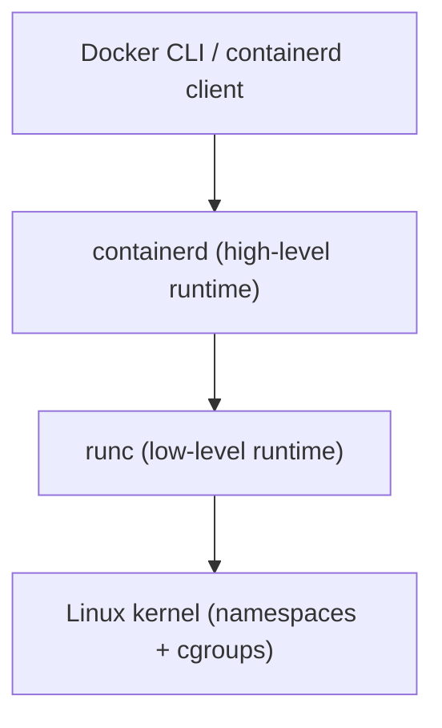
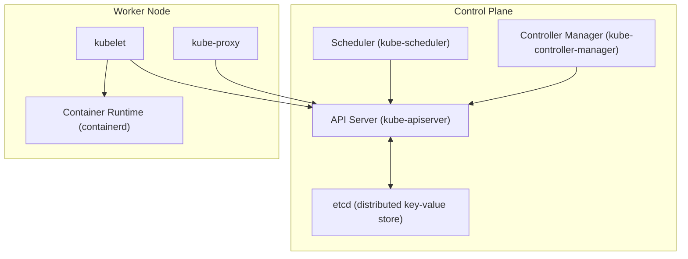
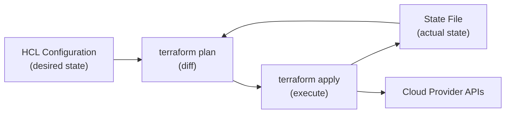
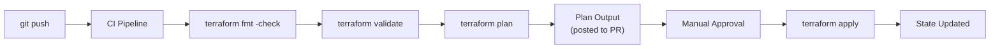

# Infrastructure at Scale

Modern infrastructure runs at scales where manual management is impossible. A single engineer may be responsible for hundreds of services, thousands of containers, and cloud resources spanning multiple regions. This domain teaches the three pillars that make that possible: **containers** (packaging applications with their dependencies using kernel primitives you studied in [Operating Systems and Linux](/learn/first-principles/operating-systems-and-linux/)), **Kubernetes** (orchestrating those containers across clusters of machines), and **Terraform** (defining all infrastructure as declarative code). Every concept connects back to fundamentals you already know. Containers are namespaces and cgroups. Kubernetes is a distributed reconciliation loop. Terraform is a state machine that maps declarations to API calls.

## Prerequisites

This domain builds directly on:

- **[Operating Systems and Linux](/learn/first-principles/operating-systems-and-linux/)** — Processes, namespaces, cgroups, filesystem mounts, permissions
- **[Networking](/learn/first-principles/networking/)** — TCP/IP, DNS, HTTP, TLS, firewalls, load balancing
- **[Software Engineering and Collaboration](/learn/first-principles/software-engineering-and-collaboration/)** — Git, CI/CD pipelines, deployment strategies, GitOps
- **[Security and Cryptography](/learn/first-principles/security-and-cryptography/)** — TLS certificates, RBAC concepts, secrets management
- **[APIs and Integration](/learn/first-principles/apis-and-integration/)** — REST APIs, JSON, API authentication

---

## Container Fundamentals

### Theory

A container is not a virtual machine. A virtual machine emulates hardware and runs a full operating system kernel. A container shares the host kernel and uses kernel primitives to isolate processes. The three kernel features that make containers possible are **namespaces**, **cgroups**, and **union filesystems**. You built namespaces and cgroups by hand in [Operating Systems and Linux](/learn/first-principles/operating-systems-and-linux/). Now you will see how container runtimes automate what you did manually.

#### Linux Namespaces

Namespaces partition kernel resources so that one set of processes sees one set of resources and another set of processes sees a different set. Each namespace type isolates a specific resource:

| Namespace | Flag | What It Isolates |
|-----------|------|-----------------|
| PID | `CLONE_NEWPID` | Process IDs — process 1 inside the container is not PID 1 on the host |
| NET | `CLONE_NEWNET` | Network stack — interfaces, routing tables, iptables rules, ports |
| MNT | `CLONE_NEWNS` | Mount points — the container sees its own filesystem tree |
| UTS | `CLONE_NEWUTS` | Hostname and domain name |
| IPC | `CLONE_NEWIPC` | Inter-process communication — shared memory, semaphores, message queues |
| USER | `CLONE_NEWUSER` | User and group IDs — root inside the container maps to a non-root user on the host |

When a container runtime starts a container, it creates a new instance of each namespace type. The process inside the container sees an isolated view of the system: its own PID tree starting at 1, its own network interfaces, its own mount table, its own hostname. But underneath, the host kernel is managing all of it.

#### Cgroups v2

Namespaces control **what a process can see**. Control groups (cgroups) control **what a process can use**. Cgroups v2 is the current unified hierarchy that limits CPU time, memory, I/O bandwidth, and process count for a group of processes.

Key cgroup controllers:

| Controller | What It Limits |
|-----------|---------------|
| `cpu` | CPU time allocation (shares, quotas, periods) |
| `memory` | RSS, swap, kernel memory; triggers OOM killer when exceeded |
| `io` | Block I/O bandwidth and IOPS |
| `pids` | Maximum number of processes (prevents fork bombs) |

When you set `--memory=512m` on a Docker container, Docker writes `536870912` to the `memory.max` file in the cgroup filesystem. When the container's processes exceed that limit, the kernel's OOM killer terminates the highest-scoring process inside the cgroup. This is the same mechanism you observed in Domain 3.

#### Union Filesystems

Container images use a layered filesystem. Each instruction in a Dockerfile creates a new read-only layer. When a container runs, a thin read-write layer is added on top. The union filesystem — typically **OverlayFS** (overlay2 driver) — merges all layers into a single coherent view.

```
┌──────────────────────────┐
│   Read-Write (container) │  ← Changes are written here
├──────────────────────────┤
│   Layer 3: COPY app.py   │  ← Read-only
├──────────────────────────┤
│   Layer 2: RUN pip install│  ← Read-only
├──────────────────────────┤
│   Layer 1: Base image     │  ← Read-only (e.g., python:3.12-slim)
└──────────────────────────┘
```

This architecture produces two critical benefits. First, layers are shared between images. If ten images use `python:3.12-slim` as their base, that layer is stored once on disk. Second, images are immutable. The read-only layers never change, which makes them safe to cache and distribute.

#### OCI Image Specification

The **Open Container Initiative (OCI)** defines two specifications: the **image spec** (how container images are structured) and the **runtime spec** (how containers are executed). An OCI image consists of:

- A **manifest** — JSON document listing the layers and configuration
- A **configuration** — JSON document with environment variables, entrypoint, working directory
- **Layers** — Compressed tar archives representing filesystem changesets

This standardization means images built by Docker can run on any OCI-compliant runtime. You are not locked into a single tool.

#### Container Runtime Stack

The container runtime has three layers:



- **runc** — The reference OCI runtime. It takes an OCI bundle (a rootfs directory plus a config.json) and creates a container using clone() with namespace flags and cgroup configuration. This is the lowest level above the kernel.
- **containerd** — A daemon that manages the full container lifecycle: image pulling, storage, network setup, calling runc, and monitoring. Kubernetes talks directly to containerd.
- **Docker** — A user-facing tool that provides a CLI, a build system (BuildKit), and APIs on top of containerd. Docker adds developer convenience but is not required in production. Kubernetes removed Docker as a runtime in favor of containerd directly (the "dockershim" removal in Kubernetes 1.24).

### Practice

#### Building Container Images

A **Dockerfile** is a text file with instructions that build an image layer by layer:

```dockerfile
# Each FROM, RUN, COPY creates a new layer
FROM python:3.12-slim

# Set working directory inside the container
WORKDIR /app

# Copy dependency file first (layer caching optimization)
COPY requirements.txt .

# Install dependencies (this layer is cached if requirements.txt hasn't changed)
RUN pip install --no-cache-dir -r requirements.txt

# Copy application code (this layer changes frequently)
COPY . .

# Document which port the application listens on
EXPOSE 8080

# Define the process that runs when the container starts
CMD ["python", "app.py"]
```

**Layer ordering matters for cache efficiency.** Docker rebuilds a layer and all subsequent layers when the input to that layer changes. By copying `requirements.txt` before copying the full application code, dependency installation is cached until the dependencies themselves change.

Build and run:

```bash
# Build an image tagged 'myapp:v1'
docker build -t myapp:v1 .

# Run the container, mapping host port 8080 to container port 8080
docker run -d -p 8080:8080 --name myapp myapp:v1

# View running containers
docker ps

# View logs
docker logs myapp

# Execute a shell inside the running container
docker exec -it myapp /bin/bash

# Stop and remove
docker stop myapp && docker rm myapp
```

#### Multi-Stage Builds

Multi-stage builds use multiple `FROM` statements to separate build-time dependencies from the final runtime image. This dramatically reduces image size and attack surface:

```dockerfile
# Stage 1: Build
FROM golang:1.22 AS builder
WORKDIR /src
COPY go.mod go.sum ./
RUN go mod download
COPY . .
RUN CGO_ENABLED=0 go build -o /app

# Stage 2: Runtime
FROM gcr.io/distroless/static-debian12
COPY --from=builder /app /app
ENTRYPOINT ["/app"]
```

The builder stage includes the entire Go toolchain (~800MB). The final image contains only the static binary and a minimal base (~2MB). The Go compiler, source code, and build tools are not present in the production image.

#### Container Security

Every container you deploy should follow these principles:

```dockerfile
# 1. Use minimal base images (less attack surface)
FROM python:3.12-slim
# Not: FROM python:3.12 (includes compilers, man pages, utilities)

# 2. Run as non-root user
RUN groupadd -r appuser && useradd -r -g appuser appuser
USER appuser

# 3. Use read-only filesystem where possible
# (set at runtime: docker run --read-only)

# 4. No secrets in image layers
# WRONG: COPY .env /app/.env
# RIGHT: Use runtime environment variables or mounted secrets
```

Run containers with minimal privileges:

```bash
# Read-only filesystem, no new privileges, drop all capabilities
docker run \
  --read-only \
  --security-opt no-new-privileges \
  --cap-drop ALL \
  --user 1000:1000 \
  --tmpfs /tmp \
  myapp:v1
```

**Rootless containers** run the container runtime itself as a non-root user. This means even a container escape does not grant root access on the host. Both Docker and Podman support rootless mode.

### Connection

Containers are an abstraction over kernel primitives you already understand. When you run `docker run`, you are automating the `unshare` and `nsenter` commands from Domain 3, combined with cgroup writes and overlay filesystem mounts. Understanding this matters because container misbehavior — OOM kills, network isolation failures, filesystem permission errors — is debuggable only if you know what is happening at the kernel level. When a container is killed by the OOM killer, you do not need to guess. You know the cgroup memory limit was exceeded, and you can read the exact value from `/sys/fs/cgroup/memory.max`.

> **Try It**: Run a container and find its namespaces and cgroup on the host. Start `docker run -d --name test-ns nginx:alpine`, then run `docker inspect --format '{{.State.Pid}}' test-ns` to get the host PID. Examine `/proc/<PID>/ns/` to see the namespace inodes and `/sys/fs/cgroup/` to find its cgroup. Compare the PID inside the container (`docker exec test-ns ps aux`) with the host PID. They are different — that is the PID namespace in action.

---

## Kubernetes Architecture

### Theory

Kubernetes is a container orchestration platform. That description is accurate but insufficient. More precisely, Kubernetes is a **distributed system that implements a declarative API with reconciliation loops**. You tell Kubernetes the desired state of your system (how many replicas, which image, what resources). Kubernetes continuously compares desired state to actual state and takes action to make them match. This reconciliation model is the single most important concept in Kubernetes.

#### Control Plane Components

The control plane runs the brain of the cluster. In production, control plane components are replicated across multiple nodes for high availability.



**kube-apiserver** — The front door to the cluster. Every interaction — `kubectl` commands, controller actions, kubelet reports — goes through the API server. It validates requests, authenticates callers, applies admission policies, and persists state to etcd. The API server is stateless; all state lives in etcd.

**etcd** — A distributed key-value store that uses the Raft consensus algorithm for consistency. Every object in Kubernetes (Pods, Deployments, Services, ConfigMaps) is stored as a key-value pair in etcd. etcd is the single source of truth. If etcd is lost and there is no backup, the cluster state is gone.

**kube-scheduler** — Watches for newly created Pods that have no assigned node. For each unscheduled Pod, the scheduler evaluates all nodes against a set of predicates (does the node have enough CPU? Is the node tainted?) and priorities (spread Pods across failure domains, prefer nodes with cached images). The scheduler writes the selected node to the Pod's `spec.nodeName` field via the API server.

**kube-controller-manager** — Runs a collection of controllers, each implementing a reconciliation loop. The ReplicaSet controller watches ReplicaSets and ensures the correct number of Pods exist. The Node controller monitors node health. The Endpoint controller populates Endpoints objects. Each controller follows the same pattern: watch desired state, observe actual state, take action to converge.

#### Worker Node Components

**kubelet** — An agent running on every worker node. The kubelet watches the API server for Pods assigned to its node, then instructs the container runtime (containerd) to start or stop containers. It reports node status and Pod health back to the API server. The kubelet is the only component that directly manages containers on the node.

**kube-proxy** — Implements Service networking. When you create a Kubernetes Service, kube-proxy programs iptables rules (or IPVS rules) on every node so that traffic to the Service's virtual IP is load-balanced across the backend Pods. kube-proxy does not proxy traffic itself in the default iptables mode — it configures kernel networking rules.

**Container runtime** — containerd (or another CRI-compliant runtime) manages the actual container lifecycle. The kubelet communicates with containerd over the Container Runtime Interface (CRI), a gRPC API. containerd then calls runc to create containers.

#### The Declarative Model

Kubernetes uses a **declarative** model, not an imperative one. You do not say "start three Pods." You say "the desired state is three Pods." The difference is critical:

| Imperative | Declarative |
|-----------|------------|
| "Run 3 replicas" | "Desired replicas: 3" |
| "Scale to 5" | "Desired replicas: 5" |
| "Kill Pod X" | (Delete the Pod; the controller creates a replacement) |
| State = last command issued | State = stored in etcd, continuously reconciled |

Controllers implement a reconciliation loop:

```
loop forever:
    desired = read desired state from API server
    actual  = observe actual state of the cluster
    diff    = compare desired vs actual
    if diff != empty:
        take action to converge actual toward desired
    sleep(interval)
```

This means the system is **self-healing**. If a node dies and three Pods are lost, the ReplicaSet controller detects that actual (2 Pods) does not match desired (5 Pods) and creates three new Pods. No human intervention required.

### Practice

#### Setting Up a Local Cluster

For learning, use **minikube** or **kind** (Kubernetes IN Docker) to run a cluster locally:

```bash
# Install minikube (macOS with Homebrew)
brew install minikube

# Start a single-node cluster
minikube start

# Verify cluster is running
kubectl cluster-info
kubectl get nodes

# Alternatively, use kind
brew install kind
kind create cluster --name learn-k8s
```

#### Exploring the API

```bash
# List all API resources (every object type Kubernetes knows about)
kubectl api-resources

# Get cluster component status
kubectl get componentstatuses

# Watch the kube-system namespace (control plane components run here)
kubectl get pods -n kube-system

# Query the API directly (the same thing kubectl does)
kubectl get --raw /api/v1/namespaces/default/pods | python3 -m json.tool
```

### Connection

Kubernetes architecture maps directly to distributed systems concepts. etcd provides consensus (Raft, which you can study as a practical application of the consensus problem). The API server is a RESTful interface — the same REST principles from [APIs and Integration](/learn/first-principles/apis-and-integration/). Controllers implement the observer pattern from software engineering. kube-proxy programs iptables — the same firewall rules from [Networking](/learn/first-principles/networking/). Every layer of Kubernetes is built on primitives you already know.

> **Try It**: Start a minikube cluster and run `kubectl get pods -n kube-system`. Identify which Pod corresponds to each control plane component. Then run `kubectl describe node minikube` and find the Allocatable resources section. These are the cgroup limits the kubelet enforces — the same cgroups from Domain 3, now managed by Kubernetes.

---

## Kubernetes Workloads

### Theory

Kubernetes defines several workload resources, each designed for a specific pattern. Understanding which resource to use requires understanding what guarantees each one provides.

#### Pods

A **Pod** is the smallest deployable unit in Kubernetes. A Pod is not a container — it is a group of one or more containers that share network namespace (same IP address, same localhost), IPC namespace, and optionally storage volumes. Containers in the same Pod communicate over localhost. Containers in different Pods communicate over the cluster network.

Why not just schedule individual containers? Because some workloads consist of tightly coupled processes. A web server and a log-shipping sidecar need to share the same log volume. A main application and an Envoy proxy sidecar need to share localhost. The Pod abstraction groups these related containers.

In practice, you rarely create Pods directly. You create higher-level resources that manage Pods for you.

#### ReplicaSets

A **ReplicaSet** ensures a specified number of identical Pod replicas are running at any time. If a Pod fails, the ReplicaSet controller creates a replacement. If there are too many Pods (for example, after a node recovers and previously-drained Pods come back), it terminates the excess.

You almost never create ReplicaSets directly. Deployments manage ReplicaSets for you.

#### Deployments

A **Deployment** manages ReplicaSets and provides declarative updates. When you update the Pod template (change the image version, modify environment variables), the Deployment creates a new ReplicaSet and gradually scales it up while scaling the old ReplicaSet down. This is a **rolling update**.

```yaml
apiVersion: apps/v1
kind: Deployment
metadata:
  name: web
  labels:
    app: web
spec:
  replicas: 3
  selector:
    matchLabels:
      app: web
  strategy:
    type: RollingUpdate
    rollingUpdate:
      maxSurge: 1        # At most 1 extra Pod during update
      maxUnavailable: 0   # Never reduce below desired count
  template:
    metadata:
      labels:
        app: web
    spec:
      containers:
      - name: web
        image: nginx:1.27
        ports:
        - containerPort: 80
        resources:
          requests:
            cpu: 100m      # 0.1 CPU core
            memory: 128Mi
          limits:
            cpu: 200m
            memory: 256Mi
```

Key Deployment operations:

```bash
# Apply the deployment
kubectl apply -f deployment.yaml

# Watch the rollout
kubectl rollout status deployment/web

# Update the image (triggers rolling update)
kubectl set image deployment/web web=nginx:1.28

# View rollout history
kubectl rollout history deployment/web

# Rollback to previous version
kubectl rollout undo deployment/web

# Rollback to a specific revision
kubectl rollout undo deployment/web --to-revision=2
```

The Deployment stores the previous ReplicaSets (controlled by `revisionHistoryLimit`), making rollbacks instantaneous — it simply scales the old ReplicaSet back up.

#### StatefulSets

A **StatefulSet** manages stateful applications that require:

- **Stable network identities** — Pods get predictable names (`db-0`, `db-1`, `db-2`) instead of random hashes
- **Ordered deployment and scaling** — Pods are created in order (0, 1, 2) and terminated in reverse order (2, 1, 0)
- **Stable persistent storage** — Each Pod gets its own PersistentVolumeClaim that survives Pod rescheduling

Use StatefulSets for databases, message queues, and distributed systems where identity matters.

```yaml
apiVersion: apps/v1
kind: StatefulSet
metadata:
  name: db
spec:
  serviceName: db
  replicas: 3
  selector:
    matchLabels:
      app: db
  template:
    metadata:
      labels:
        app: db
    spec:
      containers:
      - name: postgres
        image: postgres:16
        volumeMounts:
        - name: data
          mountPath: /var/lib/postgresql/data
  volumeClaimTemplates:
  - metadata:
      name: data
    spec:
      accessModes: ["ReadWriteOnce"]
      resources:
        requests:
          storage: 10Gi
```

#### DaemonSets

A **DaemonSet** ensures a copy of a Pod runs on every node (or a subset of nodes). Use DaemonSets for node-level agents: log collectors (Fluentd), monitoring agents (node-exporter), network plugins (CNI), and storage drivers.

When a new node joins the cluster, the DaemonSet controller automatically schedules the Pod on it. When a node is removed, the Pod is garbage collected.

#### Jobs and CronJobs

A **Job** creates one or more Pods and ensures they run to completion. Unlike Deployments, which maintain long-running processes, Jobs are for batch work: data migrations, report generation, backups.

```yaml
apiVersion: batch/v1
kind: Job
metadata:
  name: data-migration
spec:
  completions: 1
  backoffLimit: 3     # Retry up to 3 times on failure
  template:
    spec:
      containers:
      - name: migrate
        image: myapp:migrate-v1
        command: ["python", "migrate.py"]
      restartPolicy: Never
```

A **CronJob** creates Jobs on a schedule, using the same cron syntax from [Text Processing and Automation](/learn/first-principles/text-processing-and-automation/):

```yaml
apiVersion: batch/v1
kind: CronJob
metadata:
  name: nightly-backup
spec:
  schedule: "0 2 * * *"    # 2:00 AM daily
  jobTemplate:
    spec:
      template:
        spec:
          containers:
          - name: backup
            image: myapp:backup-v1
          restartPolicy: OnFailure
```

#### ConfigMaps and Secrets

**ConfigMaps** store non-sensitive configuration data as key-value pairs. **Secrets** store sensitive data (passwords, tokens, certificates) with base64 encoding (not encryption — Secrets are only encoded, not encrypted, by default).

```yaml
# ConfigMap
apiVersion: v1
kind: ConfigMap
metadata:
  name: app-config
data:
  DATABASE_HOST: "db.default.svc.cluster.local"
  LOG_LEVEL: "info"
  config.yaml: |
    server:
      port: 8080
      workers: 4

---
# Secret
apiVersion: v1
kind: Secret
metadata:
  name: app-secrets
type: Opaque
data:
  DATABASE_PASSWORD: cGFzc3dvcmQxMjM=    # base64 encoded
  API_KEY: c2VjcmV0LWtleS12YWx1ZQ==
```

Mount them into Pods as environment variables or files:

```yaml
spec:
  containers:
  - name: app
    image: myapp:v1
    envFrom:
    - configMapRef:
        name: app-config
    - secretRef:
        name: app-secrets
    volumeMounts:
    - name: config-volume
      mountPath: /etc/app
  volumes:
  - name: config-volume
    configMap:
      name: app-config
```

#### Health Probes

Kubernetes uses three types of probes to determine Pod health:

| Probe | When It Runs | What It Checks | Failure Action |
|-------|-------------|---------------|----------------|
| **Startup** | During initial startup | Is the app started? | Keep waiting (do not run other probes) |
| **Liveness** | After startup succeeds | Is the app alive? | Restart the container |
| **Readiness** | After startup succeeds | Can the app serve traffic? | Remove from Service endpoints |

```yaml
spec:
  containers:
  - name: app
    image: myapp:v1
    startupProbe:
      httpGet:
        path: /healthz
        port: 8080
      failureThreshold: 30    # Allow 30 * 10s = 5 minutes to start
      periodSeconds: 10
    livenessProbe:
      httpGet:
        path: /healthz
        port: 8080
      periodSeconds: 10
      failureThreshold: 3     # Restart after 3 consecutive failures
    readinessProbe:
      httpGet:
        path: /ready
        port: 8080
      periodSeconds: 5
      failureThreshold: 1     # Remove from Service immediately
```

The distinction between liveness and readiness is critical. A liveness probe failure restarts the container — use it for deadlocks or unrecoverable states. A readiness probe failure removes the Pod from Service endpoints without restarting — use it for temporary conditions like database connection loss or cache warming.

### Practice

```bash
# Create a deployment
kubectl apply -f deployment.yaml

# Watch Pods being created
kubectl get pods -w

# Scale the deployment
kubectl scale deployment/web --replicas=5

# Trigger a rolling update
kubectl set image deployment/web web=nginx:1.28

# Watch the rollout (new ReplicaSet scales up, old scales down)
kubectl rollout status deployment/web

# Simulate a failure: delete a Pod and watch it get replaced
kubectl delete pod <pod-name>
kubectl get pods -w   # New pod appears within seconds

# View events for troubleshooting
kubectl get events --sort-by=.metadata.creationTimestamp

# Debug a failing Pod
kubectl describe pod <pod-name>
kubectl logs <pod-name>
kubectl logs <pod-name> --previous   # Logs from the previous container instance
```

### Connection

Workload resources form a hierarchy of abstractions. Deployments manage ReplicaSets. ReplicaSets manage Pods. Pods manage containers. Containers use namespaces and cgroups. At every level, the pattern is the same: a controller watches desired state and reconciles actual state. This is the same control loop from control theory, applied to distributed systems. When you understand the hierarchy, debugging becomes systematic — you trace from the highest abstraction down to the kernel primitive where the actual problem lives.

> **Try It**: Create a Deployment with 3 replicas. Run `kubectl get replicasets` to see the ReplicaSet it created. Update the image version and run `kubectl get replicasets` again — you will see two ReplicaSets (old and new). Run `kubectl rollout undo deployment/web` and observe the old ReplicaSet scaling back up. This is how Kubernetes implements zero-downtime deployments.

---

## Kubernetes Networking

### Theory

Every Pod in a Kubernetes cluster gets its own IP address. Containers within the same Pod share that IP (they share the network namespace). The Kubernetes networking model has three fundamental rules:

1. Every Pod can communicate with every other Pod without NAT
2. Every node can communicate with every Pod without NAT
3. The IP a Pod sees for itself is the same IP others see for it

This flat networking model is implemented by a **Container Network Interface (CNI)** plugin. Popular CNI plugins include Calico, Cilium, Flannel, and Weave. The CNI plugin handles IP address management (IPAM), sets up virtual ethernet pairs (veth), configures bridges or overlay networks, and programs routes.

#### Service Types

Pods are ephemeral. Their IP addresses change when they restart. **Services** provide stable networking abstractions in front of a set of Pods selected by labels.

| Service Type | What It Does | Use Case |
|-------------|-------------|----------|
| **ClusterIP** | Internal-only virtual IP, reachable within the cluster | Default; service-to-service communication |
| **NodePort** | Exposes the Service on a static port on every node's IP | Development, simple external access |
| **LoadBalancer** | Provisions a cloud load balancer that routes to NodePorts | Production external access on cloud providers |
| **ExternalName** | CNAME alias to an external DNS name | Accessing external services through Kubernetes DNS |

```yaml
# ClusterIP Service (default)
apiVersion: v1
kind: Service
metadata:
  name: web
spec:
  selector:
    app: web          # Routes to Pods with label app=web
  ports:
  - port: 80          # Service port
    targetPort: 8080   # Container port
  type: ClusterIP

---
# NodePort Service
apiVersion: v1
kind: Service
metadata:
  name: web-external
spec:
  selector:
    app: web
  ports:
  - port: 80
    targetPort: 8080
    nodePort: 30080    # Accessible at <NodeIP>:30080
  type: NodePort
```

When a request arrives at a ClusterIP Service, kube-proxy's iptables rules select a backend Pod using random or round-robin load balancing. The packet's destination IP is rewritten (DNAT) from the Service virtual IP to the selected Pod's IP. This is the same iptables NAT from [Networking](/learn/first-principles/networking/).

#### Ingress

An **Ingress** resource defines HTTP/HTTPS routing rules that route external traffic to internal Services. An Ingress does nothing by itself — it requires an **Ingress Controller** (NGINX Ingress Controller, Traefik, etc.) to implement the rules.

```yaml
apiVersion: networking.k8s.io/v1
kind: Ingress
metadata:
  name: web-ingress
  annotations:
    nginx.ingress.kubernetes.io/rewrite-target: /
spec:
  ingressClassName: nginx
  tls:
  - hosts:
    - app.example.com
    secretName: tls-secret
  rules:
  - host: app.example.com
    http:
      paths:
      - path: /api
        pathType: Prefix
        backend:
          service:
            name: api
            port:
              number: 80
      - path: /
        pathType: Prefix
        backend:
          service:
            name: frontend
            port:
              number: 80
```

This Ingress routes `app.example.com/api/*` to the `api` Service and all other paths to the `frontend` Service, with TLS termination using the `tls-secret` Secret.

#### DNS (CoreDNS)

Kubernetes runs **CoreDNS** as the cluster DNS server. Every Service gets a DNS entry:

| DNS Name | Resolves To |
|---------|------------|
| `web` | ClusterIP of the `web` Service (same namespace) |
| `web.default` | ClusterIP of `web` in the `default` namespace |
| `web.default.svc.cluster.local` | Fully qualified domain name |
| `db-0.db.default.svc.cluster.local` | IP of specific StatefulSet Pod |

Pods are configured to use CoreDNS as their nameserver (via `/etc/resolv.conf` injected by the kubelet). When a Pod does `curl http://web:80`, the DNS resolution goes to CoreDNS, which returns the ClusterIP.

#### NetworkPolicies

By default, all Pods can talk to all other Pods. **NetworkPolicies** implement firewall rules at the Pod level, using label selectors:

```yaml
apiVersion: networking.k8s.io/v1
kind: NetworkPolicy
metadata:
  name: api-policy
  namespace: default
spec:
  podSelector:
    matchLabels:
      app: api
  policyTypes:
  - Ingress
  - Egress
  ingress:
  - from:
    - podSelector:
        matchLabels:
          app: frontend
    ports:
    - protocol: TCP
      port: 8080
  egress:
  - to:
    - podSelector:
        matchLabels:
          app: db
    ports:
    - protocol: TCP
      port: 5432
  - to:                          # Allow DNS
    - namespaceSelector: {}
    ports:
    - protocol: UDP
      port: 53
```

This policy says: Pods labeled `app: api` can only receive traffic from Pods labeled `app: frontend` on port 8080, and can only send traffic to Pods labeled `app: db` on port 5432 (plus DNS on port 53). All other ingress and egress is denied.

NetworkPolicies require a CNI plugin that supports them (Calico and Cilium do; Flannel does not).

#### Service Mesh Concepts

A **service mesh** moves networking logic (retries, timeouts, circuit breaking, mutual TLS, observability) from application code into infrastructure. A sidecar proxy (Envoy) is injected into every Pod and intercepts all network traffic. A control plane (Istio, Linkerd) configures these proxies.

Service meshes solve a real problem — consistent networking behavior across heterogeneous services — but add significant complexity. Use them when you have many services with complex traffic management requirements, not as a default.

### Practice

```bash
# Create a Service
kubectl expose deployment web --port=80 --target-port=8080

# Verify DNS resolution from inside a Pod
kubectl run dns-test --rm -it --image=busybox -- nslookup web.default.svc.cluster.local

# View iptables rules created by kube-proxy (on the node)
# In minikube: minikube ssh, then:
# sudo iptables -t nat -L KUBE-SERVICES -n

# Test service connectivity
kubectl run curl-test --rm -it --image=curlimages/curl -- curl http://web

# Apply a NetworkPolicy
kubectl apply -f network-policy.yaml

# Verify the policy blocks unauthorized traffic
kubectl run blocked --rm -it --image=curlimages/curl -- curl --connect-timeout 5 http://api:8080
# This should timeout if the 'blocked' Pod doesn't match the allowed labels
```

### Connection

Kubernetes networking is built on Linux networking primitives. Services use iptables DNAT — the same packet mangling from Domain 7. CNI plugins create virtual ethernet pairs and network bridges — the same Linux networking stack. NetworkPolicies are implemented as iptables or eBPF rules. CoreDNS resolves names using the same DNS protocol you studied in Domain 7. Understanding these layers means you can debug networking issues that confuse most operators: a Pod cannot reach a Service because an iptables rule is wrong, not because "networking is broken."

> **Try It**: Deploy two services (a frontend and a backend). Verify the frontend can reach the backend by DNS name. Then apply a NetworkPolicy that blocks the frontend from reaching the backend. Observe the connection timeout. Remove the NetworkPolicy and verify connectivity is restored. This exercise demonstrates that Kubernetes network security is declarative and reversible.

---

## Kubernetes RBAC and Resources

### Theory

#### Role-Based Access Control (RBAC)

RBAC controls who can do what in a Kubernetes cluster. It has four objects:

| Object | Scope | Purpose |
|--------|-------|---------|
| **Role** | Namespace | Defines permissions within a single namespace |
| **ClusterRole** | Cluster-wide | Defines permissions across all namespaces or for cluster-scoped resources |
| **RoleBinding** | Namespace | Grants a Role to a user, group, or ServiceAccount within a namespace |
| **ClusterRoleBinding** | Cluster-wide | Grants a ClusterRole across the entire cluster |

```yaml
# Role: allow reading Pods in the 'dev' namespace
apiVersion: rbac.authorization.k8s.io/v1
kind: Role
metadata:
  name: pod-reader
  namespace: dev
rules:
- apiGroups: [""]          # Core API group
  resources: ["pods"]
  verbs: ["get", "watch", "list"]
- apiGroups: [""]
  resources: ["pods/log"]
  verbs: ["get"]

---
# RoleBinding: grant pod-reader to the 'dev-team' group
apiVersion: rbac.authorization.k8s.io/v1
kind: RoleBinding
metadata:
  name: dev-pod-reader
  namespace: dev
subjects:
- kind: Group
  name: dev-team
  apiGroup: rbac.authorization.k8s.io
roleRef:
  kind: Role
  name: pod-reader
  apiGroup: rbac.authorization.k8s.io
```

RBAC follows the principle of least privilege from [Security and Cryptography](/learn/first-principles/security-and-cryptography/). Grant only the permissions that are needed. Use namespace-scoped Roles instead of ClusterRoles when possible. Audit who has `cluster-admin` — it is equivalent to root on the cluster.

```bash
# Check what a user can do
kubectl auth can-i create deployments --namespace dev --as dev-user

# List all role bindings in a namespace
kubectl get rolebindings -n dev

# Check your own permissions
kubectl auth can-i --list
```

#### Resource Management

Every container should declare **resource requests** and **limits**:

- **Requests** — The minimum resources the container needs. The scheduler uses requests to find a node with enough capacity.
- **Limits** — The maximum resources the container can use. The kubelet enforces limits via cgroups.

```yaml
resources:
  requests:
    cpu: 100m       # 0.1 CPU cores (100 millicores)
    memory: 128Mi   # 128 mebibytes
  limits:
    cpu: 500m       # 0.5 CPU cores
    memory: 512Mi   # 512 mebibytes
```

CPU limits are enforced by CFS (Completely Fair Scheduler) bandwidth throttling. Memory limits are enforced by the cgroup memory controller — exceeding the limit triggers the OOM killer.

**LimitRanges** set default and maximum resource values per container in a namespace:

```yaml
apiVersion: v1
kind: LimitRange
metadata:
  name: default-limits
  namespace: dev
spec:
  limits:
  - default:
      cpu: 200m
      memory: 256Mi
    defaultRequest:
      cpu: 100m
      memory: 128Mi
    max:
      cpu: "2"
      memory: 2Gi
    type: Container
```

**ResourceQuotas** limit the total resources consumed by all objects in a namespace:

```yaml
apiVersion: v1
kind: ResourceQuota
metadata:
  name: dev-quota
  namespace: dev
spec:
  hard:
    requests.cpu: "10"
    requests.memory: 20Gi
    limits.cpu: "20"
    limits.memory: 40Gi
    pods: "50"
    services: "10"
    persistentvolumeclaims: "20"
```

#### Autoscaling

**Horizontal Pod Autoscaler (HPA)** adjusts the number of replicas based on observed metrics:

```yaml
apiVersion: autoscaling/v2
kind: HorizontalPodAutoscaler
metadata:
  name: web-hpa
spec:
  scaleTargetRef:
    apiVersion: apps/v1
    kind: Deployment
    name: web
  minReplicas: 2
  maxReplicas: 10
  metrics:
  - type: Resource
    resource:
      name: cpu
      target:
        type: Utilization
        averageUtilization: 70
  behavior:
    scaleDown:
      stabilizationWindowSeconds: 300   # Wait 5 min before scaling down
```

**Vertical Pod Autoscaler (VPA)** adjusts resource requests and limits based on actual usage. HPA scales horizontally (more Pods). VPA scales vertically (larger Pods). Use HPA for stateless workloads and VPA for workloads that cannot be horizontally scaled.

**PodDisruptionBudgets (PDBs)** protect availability during voluntary disruptions (node drains, cluster upgrades):

```yaml
apiVersion: policy/v1
kind: PodDisruptionBudget
metadata:
  name: web-pdb
spec:
  minAvailable: 2    # At least 2 Pods must remain available
  selector:
    matchLabels:
      app: web
```

#### Namespaces

**Namespaces** provide logical isolation within a cluster. They scope names (two Deployments named `web` can exist in different namespaces), RBAC policies, resource quotas, and network policies.

```bash
# Create a namespace
kubectl create namespace staging

# List resources in a namespace
kubectl get all -n staging

# Set default namespace for kubectl
kubectl config set-context --current --namespace=staging
```

Common namespace patterns:
- Per-environment: `dev`, `staging`, `production`
- Per-team: `team-frontend`, `team-backend`, `team-data`
- Per-application: `app-web`, `app-api`, `app-workers`

### Practice

```bash
# Create namespaces with resource quotas
kubectl create namespace dev
kubectl apply -f resource-quota.yaml -n dev

# Deploy to the namespace
kubectl apply -f deployment.yaml -n dev

# Verify quota usage
kubectl describe resourcequota dev-quota -n dev

# Set up HPA (requires metrics-server)
kubectl apply -f hpa.yaml -n dev

# Generate load to trigger autoscaling
kubectl run load-gen --rm -it --image=busybox -- sh -c \
  "while true; do wget -q -O- http://web.dev.svc.cluster.local; done"

# Watch HPA respond
kubectl get hpa -n dev -w
```

### Connection

RBAC in Kubernetes is the same role-based access control model from [Security and Cryptography](/learn/first-principles/security-and-cryptography/), applied to API objects instead of file permissions. Resource limits are cgroups managed declaratively. Autoscaling is a feedback control loop: measure, compare to target, adjust. These are not new concepts — they are the same fundamentals applied at a higher level of abstraction.

> **Try It**: Create a namespace with a ResourceQuota that limits total memory to 1Gi. Deploy a workload that requests 512Mi per Pod with 3 replicas (total 1.5Gi). Observe the third Pod being rejected with a quota exceeded error. This demonstrates that resource governance is enforced at admission time, not at runtime.

---

## Kubernetes Operations

### Theory

Operating a Kubernetes cluster means deploying applications, managing configuration, debugging failures, and observing system behavior. Effective operators know the tools deeply and choose the right tool for each situation.

#### kubectl Patterns

`kubectl` is the primary CLI tool. Master these patterns:

```bash
# Declarative management (preferred for production)
kubectl apply -f manifest.yaml        # Create or update
kubectl diff -f manifest.yaml         # Preview changes before applying
kubectl delete -f manifest.yaml       # Delete

# Imperative commands (useful for debugging and one-off tasks)
kubectl run debug --rm -it --image=busybox -- sh
kubectl create deployment web --image=nginx --replicas=3
kubectl expose deployment web --port=80

# Output formatting
kubectl get pods -o wide              # Extra columns (node, IP)
kubectl get pods -o yaml              # Full YAML representation
kubectl get pods -o json              # Full JSON
kubectl get pods -o jsonpath='{.items[*].metadata.name}'

# Filtering
kubectl get pods -l app=web           # By label
kubectl get pods --field-selector status.phase=Running
kubectl get pods -A                   # All namespaces

# Sorting
kubectl get pods --sort-by=.metadata.creationTimestamp
kubectl get events --sort-by=.lastTimestamp
```

#### Helm

**Helm** is a package manager for Kubernetes. A **Helm chart** is a collection of templated Kubernetes manifests with configurable values:

```bash
# Add a chart repository
helm repo add bitnami https://charts.bitnami.com/bitnami
helm repo update

# Search for charts
helm search repo postgresql

# Install a chart (creates a "release")
helm install my-db bitnami/postgresql --set auth.postgresPassword=secret

# List releases
helm list

# View generated manifests without installing
helm template my-db bitnami/postgresql --set auth.postgresPassword=secret

# Upgrade a release
helm upgrade my-db bitnami/postgresql --set auth.postgresPassword=newsecret

# Rollback
helm rollback my-db 1

# Uninstall
helm uninstall my-db
```

Helm charts use Go templates:

```yaml
# templates/deployment.yaml
apiVersion: apps/v1
kind: Deployment
metadata:
  name: {{ .Release.Name }}-web
spec:
  replicas: {{ .Values.replicaCount }}
  template:
    spec:
      containers:
      - name: web
        image: "{{ .Values.image.repository }}:{{ .Values.image.tag }}"
```

```yaml
# values.yaml
replicaCount: 3
image:
  repository: nginx
  tag: "1.27"
```

#### Kustomize

**Kustomize** uses overlays to customize base manifests without templates. It is built into `kubectl` (`kubectl apply -k`):

```
base/
  deployment.yaml
  service.yaml
  kustomization.yaml
overlays/
  dev/
    kustomization.yaml     # Patches for dev
  prod/
    kustomization.yaml     # Patches for prod
```

```yaml
# base/kustomization.yaml
apiVersion: kustomize.config.k8s.io/v1beta1
kind: Kustomization
resources:
- deployment.yaml
- service.yaml

# overlays/dev/kustomization.yaml
apiVersion: kustomize.config.k8s.io/v1beta1
kind: Kustomization
resources:
- ../../base
patches:
- patch: |
    - op: replace
      path: /spec/replicas
      value: 1
  target:
    kind: Deployment
    name: web
namePrefix: dev-
namespace: dev
```

```bash
# Preview the output
kubectl kustomize overlays/dev/

# Apply
kubectl apply -k overlays/dev/
```

Helm and Kustomize solve different problems. Helm is best for third-party applications where you need parameterization. Kustomize is best for your own applications where you want environment-specific overlays without templating complexity.

#### Operators and Custom Resource Definitions (CRDs)

A **Custom Resource Definition (CRD)** extends the Kubernetes API with new resource types. An **Operator** is a controller that watches a custom resource and manages a complex application lifecycle.

For example, a PostgreSQL Operator defines a `PostgresCluster` CRD. You create a `PostgresCluster` object, and the Operator handles provisioning, replication, backups, failover, and upgrades — the same reconciliation loop pattern, applied to database management.

```yaml
# Example: Creating a PostgreSQL cluster via an operator
apiVersion: postgres-operator.crunchydata.com/v1beta1
kind: PostgresCluster
metadata:
  name: my-db
spec:
  postgresVersion: 16
  instances:
  - replicas: 3
    dataVolumeClaimSpec:
      accessModes: ["ReadWriteOnce"]
      resources:
        requests:
          storage: 10Gi
  backups:
    pgbackrest:
      repos:
      - name: repo1
        volume:
          volumeClaimSpec:
            accessModes: ["ReadWriteOnce"]
            resources:
              requests:
                storage: 20Gi
```

#### Debugging

Systematic debugging in Kubernetes follows a top-down approach:

```bash
# 1. Check the resource status
kubectl get deployment web
kubectl get pods -l app=web

# 2. Describe for events and conditions
kubectl describe pod <pod-name>
# Look for: Events section, Conditions, container statuses

# 3. Check logs
kubectl logs <pod-name>
kubectl logs <pod-name> -c <container-name>   # Specific container
kubectl logs <pod-name> --previous             # Previous crash

# 4. Check events cluster-wide
kubectl get events --sort-by=.lastTimestamp -A

# 5. Interactive debugging
kubectl exec -it <pod-name> -- /bin/sh
kubectl run debug --rm -it --image=nicolaka/netshoot -- bash

# 6. Port forward for local testing
kubectl port-forward svc/web 8080:80

# 7. Copy files for inspection
kubectl cp <pod-name>:/var/log/app.log ./app.log
```

Common failure patterns and their causes:

| Symptom | Likely Cause | Debug Command |
|---------|-------------|---------------|
| `Pending` | No node has enough resources, or no matching node | `kubectl describe pod` (Events section) |
| `ImagePullBackOff` | Wrong image name, tag, or registry auth | `kubectl describe pod`, check image name |
| `CrashLoopBackOff` | Application crashes on startup | `kubectl logs --previous` |
| `OOMKilled` | Memory limit exceeded | Increase `resources.limits.memory` |
| `CreateContainerConfigError` | Missing ConfigMap or Secret | `kubectl get configmap`, `kubectl get secret` |
| `Evicted` | Node under resource pressure | `kubectl describe node`, check disk/memory |

#### Monitoring

Production clusters require observability. The standard stack:

- **Metrics**: Prometheus collects time-series metrics from nodes, Pods, and applications
- **Visualization**: Grafana dashboards display metrics
- **Logging**: Fluentd/Fluent Bit collect logs and ship them to Elasticsearch or Loki
- **Alerting**: Alertmanager (with Prometheus) fires alerts based on metric thresholds

```bash
# View resource usage (requires metrics-server)
kubectl top nodes
kubectl top pods
kubectl top pods --sort-by=memory
```

### Practice

```bash
# Full operational exercise: deploy, expose, scale, update, debug

# 1. Deploy an application
kubectl create deployment web --image=nginx:1.27 --replicas=3

# 2. Expose it
kubectl expose deployment web --port=80

# 3. Verify connectivity
kubectl run test --rm -it --image=curlimages/curl -- curl http://web

# 4. Simulate a failure: set an invalid image
kubectl set image deployment/web nginx=nginx:nonexistent

# 5. Watch the rollout stall
kubectl rollout status deployment/web --timeout=30s

# 6. Debug
kubectl get pods
kubectl describe pod <failing-pod>
kubectl get events --sort-by=.lastTimestamp

# 7. Rollback
kubectl rollout undo deployment/web

# 8. Verify recovery
kubectl rollout status deployment/web
```

### Connection

Kubernetes operations are where theory meets practice most directly. Every `kubectl describe` output maps to API objects stored in etcd. Every `CrashLoopBackOff` is a container that exited with a non-zero status and was restarted by the kubelet according to the Pod's restart policy. Every `OOMKilled` is the cgroup memory controller terminating a process that exceeded its limit. The operational tools do not hide the underlying systems — they expose them through a consistent API.

> **Try It**: Deploy an application with a deliberate bug — a readiness probe pointing to a nonexistent endpoint. Observe that the Pod runs but the Service has no endpoints (`kubectl get endpoints`). Traffic to the Service fails. Fix the readiness probe path and watch the endpoints populate. This exercise demonstrates that readiness probes control traffic routing, not container lifecycle.

---

## Terraform Fundamentals

### Theory

Terraform is an **infrastructure as code (IaC)** tool that lets you define cloud resources in declarative configuration files and manage their lifecycle through a consistent workflow. Instead of clicking through a cloud console or writing imperative scripts, you declare the desired state of your infrastructure and Terraform figures out what API calls to make.

Terraform's core model:



You write configuration. Terraform compares it to the state file (what it thinks exists). It generates a plan showing what will be created, modified, or destroyed. You approve the plan. Terraform executes the API calls and updates the state file.

#### HCL Syntax

Terraform uses **HashiCorp Configuration Language (HCL)**, a declarative language designed for infrastructure definition:

```hcl
# Block types: resource, data, variable, output, locals, provider, module, terraform

# Provider configuration — which cloud API to talk to
provider "aws" {
  region = "us-east-1"
}

# Resource — declares a piece of infrastructure
resource "aws_instance" "web" {
  ami           = "ami-0c55b159cbfafe1f0"
  instance_type = "t3.micro"

  tags = {
    Name        = "web-server"
    Environment = "dev"
  }
}
```

HCL has a consistent structure: `block_type "label1" "label2" { ... }`. For resources, the first label is the resource type (defined by the provider) and the second label is the local name (your identifier for referencing it elsewhere in the configuration).

#### Providers

**Providers** are plugins that Terraform uses to interact with APIs. Each provider offers a set of resource types and data sources:

```hcl
terraform {
  required_providers {
    aws = {
      source  = "hashicorp/aws"
      version = "~> 5.0"
    }
    kubernetes = {
      source  = "hashicorp/kubernetes"
      version = "~> 2.25"
    }
  }
  required_version = ">= 1.7"
}

provider "aws" {
  region = "us-east-1"
}

provider "kubernetes" {
  config_path = "~/.kube/config"
}
```

The `~>` constraint means "compatible with" — `~> 5.0` allows `5.0`, `5.1`, `5.99` but not `6.0`. Pin provider versions to avoid unexpected breaking changes.

#### Resources and Data Sources

**Resources** are the primary construct. Each resource maps to one or more API calls:

```hcl
# Create a VPC
resource "aws_vpc" "main" {
  cidr_block           = "10.0.0.0/16"
  enable_dns_hostnames = true
  enable_dns_support   = true

  tags = {
    Name = "main-vpc"
  }
}

# Create a subnet within the VPC
resource "aws_subnet" "public" {
  vpc_id                  = aws_vpc.main.id     # Reference another resource
  cidr_block              = "10.0.1.0/24"
  availability_zone       = "us-east-1a"
  map_public_ip_on_launch = true

  tags = {
    Name = "public-subnet"
  }
}
```

**Data sources** read existing infrastructure that Terraform does not manage:

```hcl
# Look up the latest Amazon Linux 2 AMI
data "aws_ami" "amazon_linux" {
  most_recent = true
  owners      = ["amazon"]

  filter {
    name   = "name"
    values = ["amzn2-ami-hvm-*-x86_64-gp2"]
  }
}

resource "aws_instance" "web" {
  ami           = data.aws_ami.amazon_linux.id   # Use the data source
  instance_type = "t3.micro"
}
```

#### Variables, Outputs, and Locals

**Variables** parameterize configurations:

```hcl
# variables.tf
variable "environment" {
  description = "Deployment environment"
  type        = string
  default     = "dev"

  validation {
    condition     = contains(["dev", "staging", "prod"], var.environment)
    error_message = "Environment must be dev, staging, or prod."
  }
}

variable "instance_count" {
  description = "Number of instances to create"
  type        = number
  default     = 1
}

variable "tags" {
  description = "Common resource tags"
  type        = map(string)
  default     = {}
}
```

**Outputs** expose values from the configuration:

```hcl
# outputs.tf
output "instance_public_ip" {
  description = "Public IP of the web server"
  value       = aws_instance.web.public_ip
}

output "vpc_id" {
  description = "ID of the VPC"
  value       = aws_vpc.main.id
}
```

**Locals** compute intermediate values:

```hcl
locals {
  common_tags = {
    Environment = var.environment
    ManagedBy   = "terraform"
    Project     = "learn-infra"
  }

  name_prefix = "${var.project}-${var.environment}"
}

resource "aws_instance" "web" {
  ami           = data.aws_ami.amazon_linux.id
  instance_type = "t3.micro"

  tags = merge(local.common_tags, {
    Name = "${local.name_prefix}-web"
  })
}
```

#### State

Terraform state is a JSON file that maps your configuration to real-world resources. When you declare `resource "aws_instance" "web"`, Terraform needs to know: does this instance already exist? What is its current configuration? The state file answers these questions.

State contains:

- The mapping between resource addresses (`aws_instance.web`) and real resource IDs (`i-0abc123def456`)
- The last-known attribute values for every resource
- Dependencies between resources
- Metadata about the Terraform version and provider versions

**State is critical infrastructure.** If the state file is lost, Terraform no longer knows what it manages. It will attempt to create duplicate resources. Protect state like you protect a database.

#### The Plan/Apply Cycle

Every Terraform change follows the same workflow:

```bash
# 1. Initialize — download providers and modules
terraform init

# 2. Format — enforce consistent style
terraform fmt

# 3. Validate — check syntax and type errors
terraform validate

# 4. Plan — preview changes without executing
terraform plan

# 5. Apply — execute the plan
terraform apply

# 6. (When needed) Destroy — remove all managed resources
terraform destroy
```

The `plan` output shows three types of changes:

- `+` **create** — a new resource will be created
- `~` **update in-place** — an existing resource will be modified
- `-` **destroy** — an existing resource will be deleted
- `-/+` **replace** — the resource must be destroyed and recreated (forced by an immutable attribute change)

### Practice

```bash
# Initialize a new Terraform project
mkdir learn-terraform && cd learn-terraform

# Create main.tf with a simple configuration
terraform init

# Preview what will happen
terraform plan

# Apply (creates real infrastructure)
terraform apply

# View current state
terraform show

# List managed resources
terraform state list

# View details of a specific resource
terraform state show aws_instance.web

# Destroy everything
terraform destroy
```

```hcl
# Complete working example: main.tf
terraform {
  required_providers {
    aws = {
      source  = "hashicorp/aws"
      version = "~> 5.0"
    }
  }
}

provider "aws" {
  region = var.region
}

variable "region" {
  default = "us-east-1"
}

variable "environment" {
  default = "dev"
}

resource "aws_vpc" "main" {
  cidr_block           = "10.0.0.0/16"
  enable_dns_hostnames = true

  tags = {
    Name        = "${var.environment}-vpc"
    Environment = var.environment
  }
}

resource "aws_subnet" "public" {
  vpc_id                  = aws_vpc.main.id
  cidr_block              = "10.0.1.0/24"
  map_public_ip_on_launch = true

  tags = {
    Name = "${var.environment}-public-subnet"
  }
}

resource "aws_security_group" "web" {
  name_prefix = "${var.environment}-web-"
  vpc_id      = aws_vpc.main.id

  ingress {
    from_port   = 80
    to_port     = 80
    protocol    = "tcp"
    cidr_blocks = ["0.0.0.0/0"]
  }

  egress {
    from_port   = 0
    to_port     = 0
    protocol    = "-1"
    cidr_blocks = ["0.0.0.0/0"]
  }
}

output "vpc_id" {
  value = aws_vpc.main.id
}

output "subnet_id" {
  value = aws_subnet.public.id
}
```

### Connection

Terraform's plan/apply cycle is the same reconciliation pattern as Kubernetes: desired state (configuration) vs. actual state (state file + cloud reality), with a diff and convergence step. The declarative model is identical — you say what you want, not how to get there. The provider plugin architecture mirrors Kubernetes' extension model with CRDs. Understanding one system deeply makes the other intuitive.

> **Try It**: Write a Terraform configuration that creates a VPC with two subnets. Run `terraform plan` and read every line of output — understand what will be created and why. Run `terraform apply`. Then change the CIDR block of one subnet and run `terraform plan` again. Notice whether the change is an update-in-place or a destroy-and-recreate. This teaches you which attributes are mutable and which are not.

---

## Terraform State and Modules

### Theory

#### Remote State

Storing state locally (the default `terraform.tfstate` file) works for learning but fails in teams. Two engineers running `terraform apply` simultaneously with local state will corrupt the state. **Remote state** solves this with centralized storage and locking.

The most common remote backend for AWS is S3 with DynamoDB locking:

```hcl
terraform {
  backend "s3" {
    bucket         = "my-terraform-state"
    key            = "prod/networking/terraform.tfstate"
    region         = "us-east-1"
    dynamodb_table = "terraform-locks"
    encrypt        = true
  }
}
```

How it works:

1. Before any operation, Terraform acquires a lock by writing a record to the DynamoDB table
2. If another process holds the lock, Terraform waits or fails
3. Terraform reads the current state from S3
4. After applying changes, Terraform writes the updated state back to S3
5. Terraform releases the lock

This prevents concurrent modifications — the same concept as database locks from [Data Management](/learn/first-principles/data-management/).

#### State Locking

State locking prevents two operations from modifying state simultaneously. Without locking, concurrent `terraform apply` runs can produce a corrupted state file. The lock is a lease — if a process crashes, the lock eventually expires or can be manually released:

```bash
# Force unlock (use only when a lock is orphaned)
terraform force-unlock LOCK_ID
```

#### State Operations

```bash
# Import an existing resource into state
terraform import aws_instance.web i-0abc123def456

# Move a resource to a different address (refactoring)
terraform state mv aws_instance.web aws_instance.web_server

# Remove a resource from state without destroying it
terraform state rm aws_instance.web

# Pull remote state to local for inspection
terraform state pull > state.json

# List all resources in state
terraform state list
```

`terraform import` is critical when adopting Terraform for existing infrastructure. You write the resource configuration, then import the existing resource ID. Terraform adds it to state and manages it going forward.

#### Modules

A **module** is a reusable package of Terraform configuration. Every Terraform configuration is technically a module (the "root module"). Child modules are called from the root module:

```
modules/
  vpc/
    main.tf
    variables.tf
    outputs.tf
  ec2/
    main.tf
    variables.tf
    outputs.tf
environments/
  dev/
    main.tf        # Calls modules
  prod/
    main.tf        # Calls same modules with different values
```

```hcl
# modules/vpc/main.tf
variable "cidr_block" {
  description = "VPC CIDR block"
  type        = string
}

variable "environment" {
  description = "Environment name"
  type        = string
}

resource "aws_vpc" "this" {
  cidr_block           = var.cidr_block
  enable_dns_hostnames = true

  tags = {
    Name        = "${var.environment}-vpc"
    Environment = var.environment
  }
}

output "vpc_id" {
  value = aws_vpc.this.id
}

output "cidr_block" {
  value = aws_vpc.this.cidr_block
}
```

```hcl
# environments/dev/main.tf
module "vpc" {
  source      = "../../modules/vpc"
  cidr_block  = "10.0.0.0/16"
  environment = "dev"
}

module "web_servers" {
  source        = "../../modules/ec2"
  vpc_id        = module.vpc.vpc_id
  subnet_id     = module.vpc.public_subnet_id
  instance_count = 2
  environment   = "dev"
}
```

Modules enforce **DRY (Don't Repeat Yourself)** — the same module serves dev, staging, and prod with different variable values. Modules also enforce **encapsulation** — internal resources are hidden behind a clean interface of variables and outputs.

#### Module Registry

The [Terraform Registry](https://registry.terraform.io/) hosts community and verified modules. Use registry modules for common patterns:

```hcl
module "vpc" {
  source  = "terraform-aws-modules/vpc/aws"
  version = "5.5.0"

  name = "my-vpc"
  cidr = "10.0.0.0/16"

  azs             = ["us-east-1a", "us-east-1b", "us-east-1c"]
  private_subnets = ["10.0.1.0/24", "10.0.2.0/24", "10.0.3.0/24"]
  public_subnets  = ["10.0.101.0/24", "10.0.102.0/24", "10.0.103.0/24"]

  enable_nat_gateway = true
  single_nat_gateway = true
}
```

Always pin module versions. An unpinned module can introduce breaking changes on the next `terraform init`.

#### Workspaces and Multi-Environment

**Workspaces** allow multiple state files for the same configuration. Each workspace has its own state:

```bash
# Create and switch to a new workspace
terraform workspace new staging
terraform workspace new prod

# List workspaces
terraform workspace list

# Switch workspaces
terraform workspace select staging

# Use workspace name in configuration
# terraform.workspace returns the current workspace name
```

```hcl
locals {
  environment = terraform.workspace

  instance_type = {
    dev     = "t3.micro"
    staging = "t3.small"
    prod    = "t3.medium"
  }
}

resource "aws_instance" "web" {
  instance_type = local.instance_type[local.environment]
}
```

Workspaces are useful for simple multi-environment setups. For complex environments with different configurations (not just different sizes), use separate directories with a shared module library — the pattern shown above.

### Practice

```bash
# Set up remote state backend
# 1. Create the S3 bucket and DynamoDB table (bootstrap)
aws s3api create-bucket --bucket my-terraform-state --region us-east-1
aws dynamodb create-table \
  --table-name terraform-locks \
  --attribute-definitions AttributeName=LockID,AttributeType=S \
  --key-schema AttributeName=LockID,KeyType=HASH \
  --billing-mode PAY_PER_REQUEST

# 2. Initialize with remote backend
terraform init

# 3. Verify state is remote
terraform state pull | python3 -m json.tool | head -20

# Working with modules
# 1. Create a module
mkdir -p modules/vpc

# 2. Reference the module from root
terraform init    # Downloads/links modules

# 3. Plan and apply
terraform plan
terraform apply

# Working with workspaces
terraform workspace new dev
terraform apply -var="environment=dev"

terraform workspace new prod
terraform apply -var="environment=prod"

terraform workspace select dev
terraform show    # Shows dev state only
```

### Connection

Terraform state is a database that tracks the mapping between your declarations and real-world resources. Remote state with locking is a distributed lock — the same concurrency primitive from [Operating Systems and Linux](/learn/first-principles/operating-systems-and-linux/). Modules are functions — they take inputs (variables), produce outputs, and encapsulate internal logic. The module system mirrors the abstraction and encapsulation principles from [Programming Fundamentals](/learn/first-principles/programming-fundamentals/). Infrastructure as code is not a metaphor. It is code, with all the same engineering practices: version control, code review, testing, and modular design.

> **Try It**: Create a simple module that provisions a security group with configurable ingress rules. Call the module twice from your root configuration — once for a web security group (port 80/443) and once for a database security group (port 5432 from the web security group only). This demonstrates both module reuse and the principle of least privilege applied to network access.

---

## Terraform CI/CD

### Theory

Running `terraform apply` from a developer's laptop is acceptable for learning. In production, Terraform runs in automated pipelines with approvals, policy checks, and audit trails.

#### Automated Plan/Apply

A typical CI/CD workflow for Terraform:



```yaml
# .github/workflows/terraform.yml
name: Terraform
on:
  pull_request:
    paths: ['terraform/**']
  push:
    branches: [main]
    paths: ['terraform/**']

jobs:
  plan:
    runs-on: ubuntu-latest
    steps:
    - uses: actions/checkout@v4
    - uses: hashicorp/setup-terraform@v3

    - name: Terraform Init
      run: terraform init
      working-directory: terraform/

    - name: Terraform Format Check
      run: terraform fmt -check -recursive
      working-directory: terraform/

    - name: Terraform Validate
      run: terraform validate
      working-directory: terraform/

    - name: Terraform Plan
      run: terraform plan -out=tfplan
      working-directory: terraform/

    # Post plan output as PR comment
    - name: Comment Plan
      if: github.event_name == 'pull_request'
      uses: actions/github-script@v7
      with:
        script: |
          // Post terraform plan output to PR

  apply:
    needs: plan
    if: github.ref == 'refs/heads/main'
    runs-on: ubuntu-latest
    environment: production    # Requires manual approval
    steps:
    - uses: actions/checkout@v4
    - uses: hashicorp/setup-terraform@v3

    - name: Terraform Init
      run: terraform init
      working-directory: terraform/

    - name: Terraform Apply
      run: terraform apply -auto-approve
      working-directory: terraform/
```

Key principles:

- **Plan on PR, apply on merge** — developers see the plan before changes are approved
- **No local applies** — all changes go through the pipeline
- **State is locked** — only one apply runs at a time
- **Audit trail** — every change is traceable through git history and CI logs

#### Policy as Code

**Policy as code** enforces organizational rules before infrastructure is created. Two major tools:

**Open Policy Agent (OPA)** with **Conftest** validates Terraform plans against Rego policies:

```rego
# policy/terraform.rego
package terraform

deny[msg] {
  resource := input.resource_changes[_]
  resource.type == "aws_instance"
  not resource.change.after.tags.Environment
  msg := sprintf("Instance %s must have an Environment tag", [resource.address])
}

deny[msg] {
  resource := input.resource_changes[_]
  resource.type == "aws_s3_bucket"
  resource.change.after.acl == "public-read"
  msg := sprintf("S3 bucket %s must not be publicly readable", [resource.address])
}
```

```bash
# Generate plan in JSON format
terraform plan -out=tfplan
terraform show -json tfplan > tfplan.json

# Evaluate policies
conftest test tfplan.json --policy policy/
```

**HashiCorp Sentinel** (Terraform Cloud/Enterprise) embeds policy evaluation directly into the plan/apply workflow:

```python
# Sentinel policy example
import "tfplan/v2" as tfplan

mandatory_tags = ["Environment", "ManagedBy", "Project"]

all_instances = filter tfplan.resource_changes as _, rc {
  rc.type is "aws_instance" and
  rc.mode is "managed" and
  (rc.change.actions contains "create" or rc.change.actions contains "update")
}

main = rule {
  all all_instances as _, instance {
    all mandatory_tags as tag {
      instance.change.after.tags contains tag
    }
  }
}
```

#### Drift Detection

**Drift** occurs when real infrastructure diverges from Terraform state — someone modifies a resource through the console, another tool changes a setting, or an auto-scaling event adds resources. Detect drift by running `terraform plan` regularly:

```bash
# Detect drift — if the plan shows changes you didn't make, drift has occurred
terraform plan -detailed-exitcode
# Exit code 0: no changes
# Exit code 1: error
# Exit code 2: changes detected (potential drift)
```

Schedule drift detection in CI:

```yaml
# Run nightly to detect drift
on:
  schedule:
    - cron: '0 6 * * *'    # 6 AM daily
```

When drift is detected, you have two choices: run `terraform apply` to bring reality back to your configuration, or run `terraform plan` to understand the drift and update your configuration to match reality.

#### Secrets Management

Terraform configurations often need secrets (API keys, database passwords). Never store secrets in Terraform files or state in plaintext.

```hcl
# Use environment variables (TF_VAR_ prefix)
# export TF_VAR_db_password="secret"
variable "db_password" {
  type      = string
  sensitive = true    # Suppresses display in plan output
}

# Use a secrets manager
data "aws_secretsmanager_secret_version" "db_password" {
  secret_id = "prod/db/password"
}

resource "aws_db_instance" "main" {
  password = data.aws_secretsmanager_secret_version.db_password.secret_string
}
```

Mark sensitive variables with `sensitive = true`. This prevents Terraform from displaying the value in plan output and logs. Note that the value is still stored in state — encrypt your state backend.

#### GitOps with Terraform

GitOps applies the Git workflow to infrastructure management. The Git repository is the single source of truth:

1. All infrastructure changes are made through pull requests
2. PRs trigger automated `terraform plan` with output posted as comments
3. Code review ensures correctness and compliance
4. Merging to main triggers `terraform apply`
5. Git history provides a complete audit trail of every infrastructure change

This is the same GitOps pattern from [Software Engineering and Collaboration](/learn/first-principles/software-engineering-and-collaboration/), applied to infrastructure instead of application code. The principle is identical: the repository defines the desired state, and an automated system reconciles actual state to match.

### Practice

```bash
# Set up a local policy check workflow

# 1. Install conftest
brew install conftest

# 2. Write a policy
mkdir -p policy
cat > policy/terraform.rego << 'EOF'
package terraform

deny[msg] {
  resource := input.resource_changes[_]
  resource.type == "aws_instance"
  resource.change.after.instance_type == "t3.2xlarge"
  msg := sprintf("Instance %s uses prohibited instance type t3.2xlarge", [resource.address])
}
EOF

# 3. Generate and test plan
terraform plan -out=tfplan
terraform show -json tfplan > tfplan.json
conftest test tfplan.json --policy policy/

# 4. Practice drift detection
terraform apply
# Make a manual change in the console
terraform plan    # Observe the drift in the plan output
```

### Connection

Terraform CI/CD brings together every collaboration practice from [Software Engineering and Collaboration](/learn/first-principles/software-engineering-and-collaboration/). Git branching strategies, code review, automated testing, and deployment pipelines — all applied to infrastructure. Policy as code is the same concept as automated testing: codify your rules and enforce them automatically, because manual review does not scale. Drift detection is the infrastructure equivalent of monitoring: continuously checking that reality matches expectations. The tools are different, but the engineering principles are identical.

> **Try It**: Create a GitHub Actions workflow that runs `terraform fmt -check` and `terraform validate` on every pull request. Submit a PR with a formatting violation and observe the CI failure. Fix the formatting and push again. This minimal pipeline demonstrates the principle that automated checks catch errors before they reach production.

---

## Exercises

1. **Container Internals**: Build a Docker image using a multi-stage build for a simple Python web application. Compare the final image size with and without multi-stage builds. Then run the container and use `docker inspect` to find the PID, examine `/proc/<PID>/ns/` to list the namespaces, and find the cgroup memory limit in `/sys/fs/cgroup/`.

2. **Kubernetes Deployment Lifecycle**: Create a Deployment with 3 replicas and a rolling update strategy. Trigger a rolling update by changing the image. While the update is in progress, run `kubectl get replicasets -w` and `kubectl get pods -w` in separate terminals to observe the old ReplicaSet scaling down and the new one scaling up simultaneously.

3. **Kubernetes Networking**: Deploy a frontend and a backend service. Verify connectivity via DNS. Apply a NetworkPolicy that allows only the frontend to reach the backend. Test from a third Pod to verify the policy blocks unauthorized access. Remove the policy and verify open access is restored.

4. **RBAC and Quotas**: Create a namespace with a ResourceQuota limiting CPU to 2 cores and memory to 4Gi. Create a Role that allows only `get`, `list`, and `watch` on Pods. Bind it to a ServiceAccount. Use `kubectl auth can-i` with `--as` to verify the permissions are restricted.

5. **Kubernetes Debugging**: Deploy an application with three deliberate problems: a wrong image tag (ImagePullBackOff), a missing ConfigMap (CreateContainerConfigError), and a memory limit that is too low (OOMKilled). Debug each using `kubectl describe`, `kubectl logs`, and `kubectl get events`. Fix each problem and verify the Pods reach Running state.

6. **Terraform Infrastructure**: Write Terraform configuration that creates a VPC, two subnets (public and private), an internet gateway, a NAT gateway, and route tables. Use variables for the CIDR blocks and environment name. Use outputs to expose the VPC ID and subnet IDs.

7. **Terraform Modules**: Refactor exercise 6 into a reusable module. Call the module twice — once for a dev environment and once for a staging environment with different CIDR blocks. Verify both environments are created independently.

8. **Terraform State**: Set up an S3 backend with DynamoDB locking. Import an existing resource into Terraform state. Move a resource to a different state address using `terraform state mv`. Remove a resource from state without destroying it using `terraform state rm`.

9. **End-to-End**: Write Terraform configuration to provision a Kubernetes cluster (using a managed service like EKS, AKS, or GKE, or using kind/minikube for local testing). Then deploy an application to the cluster using Kubernetes manifests. This exercise integrates all three pillars: Terraform provisions infrastructure, containers package the application, and Kubernetes orchestrates the deployment.

10. **Policy as Code**: Write an OPA policy that enforces three rules: all resources must have an `Environment` tag, no S3 buckets can be public, and no EC2 instances can use instance types larger than `t3.large`. Test the policy against a Terraform plan that violates each rule.

---

## Assessment Dimensions

### Explain

You can explain what a container actually is at the kernel level — namespaces, cgroups, union filesystems — without referencing Docker. You can draw the Kubernetes control plane architecture and explain how the reconciliation loop works. You can describe how Terraform state maps configuration to real resources and why state locking prevents corruption. You can articulate the difference between imperative and declarative infrastructure management and why declarative models are preferred at scale.

### Build

You can build a multi-stage Docker image that follows security best practices (non-root user, minimal base, no secrets in layers). You can deploy a complete application to Kubernetes with Deployments, Services, ConfigMaps, health probes, resource limits, and RBAC. You can write Terraform configuration with modules, remote state, and variable validation that provisions cloud infrastructure. You can set up a CI/CD pipeline that runs `terraform plan` on PRs and `terraform apply` on merge.

### Debug

You can diagnose why a container is being OOM-killed by examining cgroup limits. You can troubleshoot a Kubernetes Pod stuck in `Pending` by checking node resources, taints, and scheduling events. You can investigate why a Service has no endpoints by examining label selectors and readiness probes. You can detect and resolve Terraform state drift. You can debug a failed `terraform apply` by reading provider error messages and understanding API constraints. When infrastructure breaks, you reason from first principles — kernel primitives, API semantics, network rules — rather than guessing.

---

## Key Takeaways

- Containers are not virtual machines — they are processes isolated by Linux namespaces (what you can see) and limited by cgroups (what you can use), with a layered union filesystem
- The OCI specification standardizes image format and runtime behavior, preventing vendor lock-in across container tools
- Kubernetes is a declarative reconciliation system: you declare desired state, controllers continuously converge actual state to match
- The control plane (API server, etcd, scheduler, controller manager) manages cluster state; worker nodes (kubelet, kube-proxy, container runtime) execute workloads
- Deployments, StatefulSets, DaemonSets, Jobs, and CronJobs each solve a specific workload pattern — choosing the right one requires understanding the guarantees each provides
- Kubernetes networking is built on Linux networking primitives: iptables for Services, veth pairs for Pod connectivity, DNS for service discovery, and NetworkPolicies for segmentation
- RBAC in Kubernetes follows the principle of least privilege; resource requests, limits, quotas, and autoscaling manage capacity and cost
- Terraform implements infrastructure as code through a plan/apply cycle that compares desired state (HCL configuration) against actual state (state file + cloud reality)
- Remote state with locking prevents concurrent corruption; modules enable reuse and encapsulation; workspaces support multi-environment deployments
- Terraform CI/CD applies the same engineering practices as application CI/CD: automated testing, code review, policy enforcement, and audit trails
- The declarative reconciliation pattern — desired state, actual state, diff, converge — appears in containers (Dockerfile), Kubernetes (controllers), and Terraform (plan/apply), making it the central design pattern of modern infrastructure

---

## Resources & Further Reading

- [Docker Documentation](https://docs.docker.com/)
- [OCI Image Specification](https://github.com/opencontainers/image-spec)
- [OCI Runtime Specification](https://github.com/opencontainers/runtime-spec)
- [containerd Documentation](https://containerd.io/docs/)
- [Kubernetes Official Documentation](https://kubernetes.io/docs/home/)
- [Kubernetes The Hard Way — Kelsey Hightower](https://github.com/kelseyhightower/kubernetes-the-hard-way)
- [Kubernetes API Reference](https://kubernetes.io/docs/reference/kubernetes-api/)
- [Helm Documentation](https://helm.sh/docs/)
- [Kustomize Documentation](https://kustomize.io/)
- [Terraform Documentation](https://developer.hashicorp.com/terraform/docs)
- [Terraform Registry](https://registry.terraform.io/)
- [Open Policy Agent (OPA)](https://www.openpolicyagent.org/)
- [Conftest](https://www.conftest.dev/)
- [CKA Exam Curriculum](https://github.com/cncf/curriculum)
- [Terraform Associate Certification](https://developer.hashicorp.com/certifications/infrastructure-automation)
