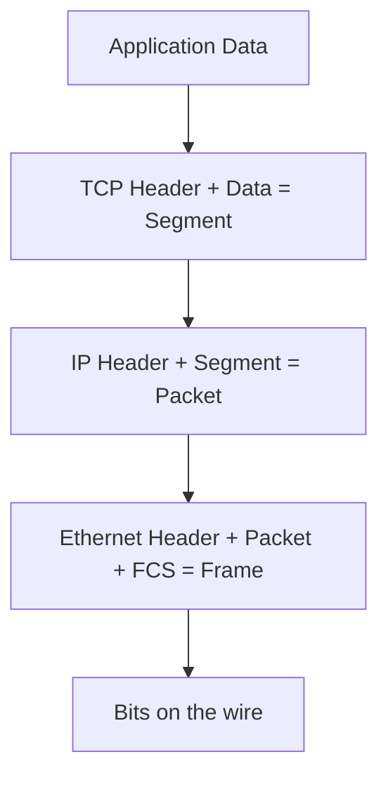
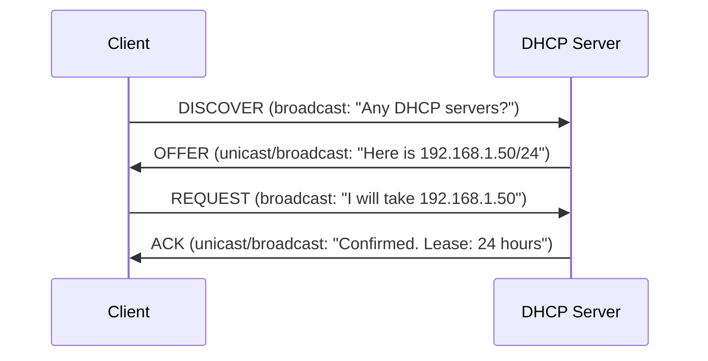
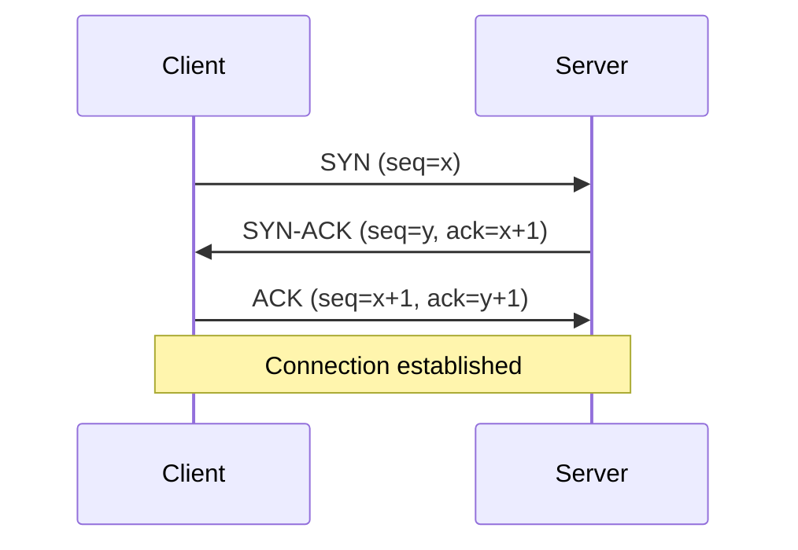
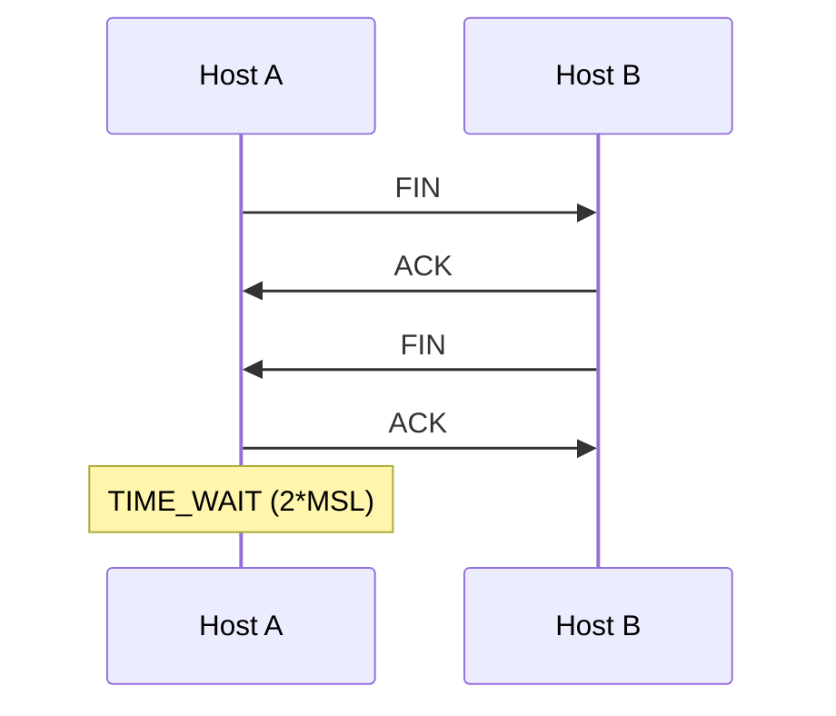
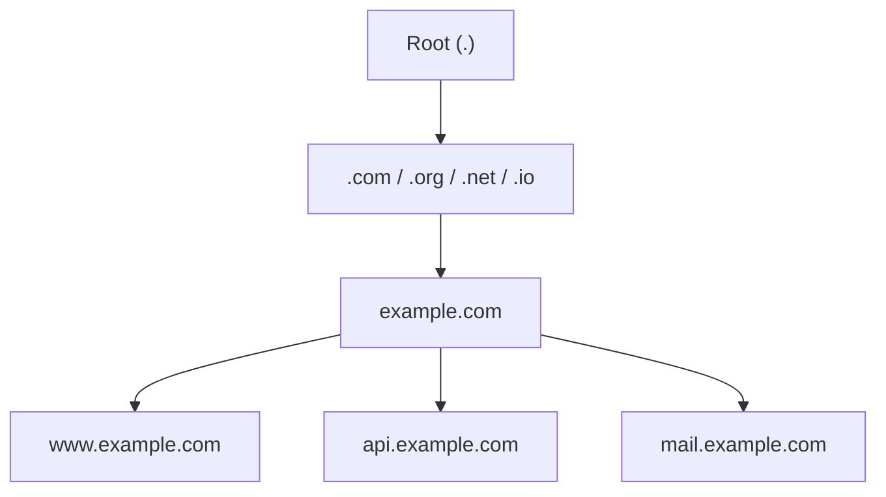
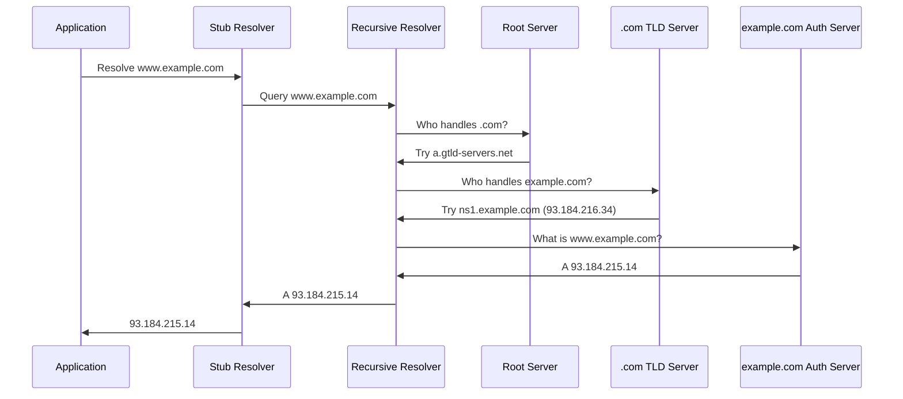
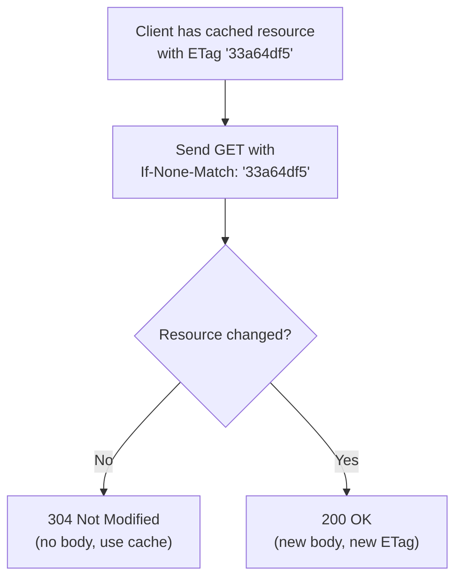
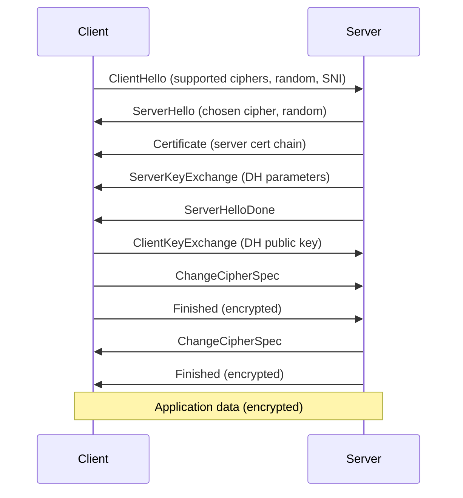
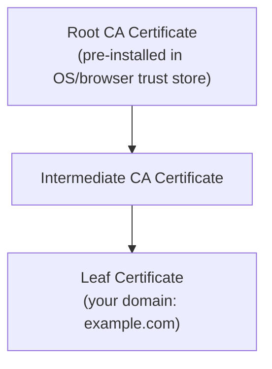

# Networking

This domain teaches you how computers communicate. Every cloud service, every API call, every container talking to another container relies on networking. When something breaks in production, the question is almost always "why can't A talk to B?" Answering that question requires understanding every layer of the network stack, from electrical signals on a wire to HTTP headers in an application. You will learn each layer, build on it, and learn to troubleshoot by reasoning through the stack systematically.

**Prerequisites:** [Operating Systems and Linux](/learn/first-principles/operating-systems-and-linux/) (Domain 3). You need processes, file descriptors, sockets as file descriptors, and the kernel's role in I/O.

---

## A. Network Models and Fundamentals

### Theory

A network is two or more computers exchanging data. Everything else is details about *how* they exchange it, *how far apart* they are, and *what rules* they follow.

**Network Types by Scope**

| Type | Scope | Example |
|------|-------|---------|
| PAN (Personal Area Network) | Within arm's reach | Bluetooth headphones to phone |
| LAN (Local Area Network) | Single building or campus | Office Ethernet, home Wi-Fi |
| MAN (Metropolitan Area Network) | City-wide | ISP backbone across a metro area |
| WAN (Wide Area Network) | Country or global | The internet, corporate MPLS links |

**Topologies**

A topology describes how nodes connect. Physical topology is the actual wiring. Logical topology is how data flows.

| Topology | Structure | Tradeoff |
|----------|-----------|----------|
| Bus | All nodes share a single cable | Simple, cheap. Single point of failure — one break kills all. |
| Star | All nodes connect to a central switch/hub | Easy to manage. Central device is a single point of failure. |
| Ring | Each node connects to exactly two neighbors | Predictable latency. One break disrupts the ring (unless dual-ring). |
| Mesh | Every node connects to every other node | Maximum redundancy. Expensive — O(n^2) links. |
| Hybrid | Combination of the above | Real-world networks. Data centers use fat-tree (Clos) topologies. |

**Circuit Switching vs. Packet Switching**

Circuit switching establishes a dedicated path between two endpoints for the duration of communication. The traditional phone system (PSTN) works this way. The circuit is reserved even during silence — bandwidth is wasted.

Packet switching breaks data into packets, each routed independently. Packets from different conversations share the same links. The internet is packet-switched. This is more efficient but introduces variable delay — packets can arrive out of order.

**Key Metrics**

| Metric | Definition | Unit |
|--------|-----------|------|
| Bandwidth | Maximum data rate of a link | bits per second (bps) |
| Latency | Time for a single packet to travel from source to destination | milliseconds (ms) |
| Throughput | Actual data rate achieved | bps |
| Jitter | Variation in latency over time | ms |

Bandwidth is the pipe's diameter. Latency is the pipe's length. Throughput is the actual water flowing through it — always less than or equal to bandwidth due to congestion, protocol overhead, and packet loss. Jitter matters for real-time applications (VoIP, video) where inconsistent timing causes glitches.

**The OSI Model**

The Open Systems Interconnection model divides networking into seven layers. Each layer provides services to the layer above it and uses services from the layer below it. This abstraction lets you replace any layer's implementation without affecting the others.

| Layer | Name | Function | PDU | Example |
|-------|------|----------|-----|---------|
| 7 | Application | User-facing protocols | Data | HTTP, DNS, SSH, SMTP |
| 6 | Presentation | Encoding, encryption, compression | Data | TLS, JPEG, ASCII/UTF-8 |
| 5 | Session | Session management | Data | NetBIOS, RPC |
| 4 | Transport | End-to-end delivery, reliability | Segment (TCP) / Datagram (UDP) | TCP, UDP |
| 3 | Network | Logical addressing, routing | Packet | IP, ICMP |
| 2 | Data Link | Physical addressing, local delivery | Frame | Ethernet, Wi-Fi (802.11) |
| 1 | Physical | Bits on the wire | Bits | Copper, fiber, radio |

PDU stands for Protocol Data Unit — the name for the chunk of data at each layer. The names matter because they tell you which layer you are discussing. "Frame" is Layer 2. "Packet" is Layer 3. "Segment" is Layer 4. Using the correct term shows you understand where in the stack you are working.

**The TCP/IP Model**

The TCP/IP model is what the internet actually uses. It collapses the OSI model into four layers.

| TCP/IP Layer | OSI Layers | Function |
|-------------|-----------|----------|
| Application | 7, 6, 5 | Application protocols (HTTP, DNS, SSH) |
| Transport | 4 | End-to-end delivery (TCP, UDP) |
| Internet | 3 | Addressing and routing (IP, ICMP) |
| Network Access | 2, 1 | Physical transmission (Ethernet, Wi-Fi) |

The OSI model is a teaching tool. The TCP/IP model is the implementation. Both are useful. The OSI model gives you finer-grained layers for troubleshooting. The TCP/IP model matches real protocol stacks.

**Encapsulation**

When an application sends data, each layer wraps it with its own header (and sometimes trailer). This is encapsulation.



At the receiving end, each layer strips its header and passes the payload up. This is de-encapsulation.

### Practice

Use tools that operate at each layer to verify the stack is working.

```bash
# Layer 2: Show network interfaces and their MAC addresses
ip link show

# Layer 3: Show IP addresses assigned to interfaces
ip addr show

# Layer 4: Show active TCP and UDP sockets
ss -tuln

# Layer 7: Make an HTTP request
curl -s -o /dev/null -w "%{http_code}" https://example.com
```

Each tool targets a specific layer. When troubleshooting, start at the bottom and work up. If `ip link` shows the interface is DOWN, there is no point checking DNS.

### Connection

The layered model is not academic decoration. It is a troubleshooting methodology. When a service is unreachable, you do not guess — you test each layer in order. Is the link up? Is there an IP address? Can you reach the gateway? Is the port open? Is the application responding? The model tells you exactly what to check and in what order.

> **Try It**: Run `ip link show`, `ip addr show`, `ss -tuln`, and `curl -I https://example.com` on your system. Identify which OSI layer each command operates at. Note the interface names, IP addresses, and open ports.

---

## B. Physical and Data Link Layer

### Theory

**Transmission Media**

| Medium | Speed | Distance | Use Case |
|--------|-------|----------|----------|
| Cat5e copper (twisted pair) | 1 Gbps | 100m | Office LANs |
| Cat6a copper | 10 Gbps | 55-100m | Data center access layer |
| Single-mode fiber | 100 Gbps+ | 40+ km | Long-haul, data center backbone |
| Multi-mode fiber | 10-100 Gbps | 300-550m | Short-run data center links |
| Wi-Fi 6 (802.11ax) | 9.6 Gbps theoretical | ~30m indoor | Wireless LAN |

**Ethernet (IEEE 802.3)**

Ethernet is the dominant Layer 2 technology. An Ethernet frame looks like this:

| Field | Size | Purpose |
|-------|------|---------|
| Preamble | 7 bytes | Clock synchronization (alternating 1/0 pattern) |
| SFD (Start Frame Delimiter) | 1 byte | Signals frame start |
| Destination MAC | 6 bytes | Where the frame is going |
| Source MAC | 6 bytes | Where the frame came from |
| 802.1Q Tag (optional) | 4 bytes | VLAN tagging |
| EtherType / Length | 2 bytes | Identifies payload protocol (0x0800 = IPv4, 0x0806 = ARP) |
| Payload | 46-1500 bytes | The actual data (IP packet inside) |
| FCS (Frame Check Sequence) | 4 bytes | CRC-32 error detection |

Early Ethernet used CSMA/CD (Carrier Sense Multiple Access / Collision Detection): listen before transmitting, detect collisions, back off randomly. Modern switched Ethernet is full-duplex — each port has its own collision domain, so CSMA/CD is irrelevant. But you will see it on certification exams.

**MAC Addresses**

A MAC (Media Access Control) address is 48 bits, written as six hex pairs: `aa:bb:cc:dd:ee:ff`. The first 24 bits are the OUI (Organizationally Unique Identifier), assigned to the manufacturer. The last 24 bits are device-specific. MAC addresses are Layer 2 — they are only meaningful within a single broadcast domain (LAN segment).

Special MAC addresses:
- `ff:ff:ff:ff:ff:ff` — Broadcast. Every device on the LAN receives it.
- `01:xx:xx:xx:xx:xx` — Multicast (least significant bit of first octet is 1).

**Switches and MAC Address Tables**

A switch operates at Layer 2. It learns which MAC addresses are reachable on which ports by examining the source MAC of incoming frames. This builds a MAC address table (also called CAM table).

When a frame arrives:
1. **Learn**: Record the source MAC and the port it arrived on.
2. **Lookup**: Search the table for the destination MAC.
3. **Forward**: If found, send the frame out the matching port only.
4. **Flood**: If not found, send the frame out all ports except the source port.

This is why switches are more efficient than hubs — they only forward frames to the port that needs them, rather than broadcasting everything.

**VLANs (IEEE 802.1Q)**

A VLAN (Virtual LAN) creates logically separate broadcast domains on a single physical switch. Without VLANs, all ports on a switch share one broadcast domain. With VLANs, you can isolate groups of ports so broadcast traffic stays within each VLAN.

- **Access port**: Belongs to one VLAN. Frames are untagged — the switch adds/strips the VLAN tag.
- **Trunk port**: Carries traffic for multiple VLANs. Frames are tagged with an 802.1Q header containing the 12-bit VLAN ID (range 1-4094).

**ARP (Address Resolution Protocol)**

ARP maps IP addresses (Layer 3) to MAC addresses (Layer 2). When a host wants to send a packet to another host on the same LAN:

1. Check the local ARP cache.
2. If not found, broadcast an ARP request: "Who has 192.168.1.5? Tell 192.168.1.1."
3. The target host replies with its MAC address (unicast).
4. The sender caches the mapping.

ARP spoofing is a Layer 2 attack where a malicious host sends fake ARP replies to associate its MAC with another host's IP. This enables man-in-the-middle attacks. Mitigation includes Dynamic ARP Inspection (DAI) on managed switches.

**Wi-Fi (IEEE 802.11)**

Wi-Fi uses CSMA/CA (Collision Avoidance) instead of CSMA/CD because wireless stations cannot detect collisions while transmitting. WPA2 (802.11i) uses AES-CCMP encryption. WPA3 uses SAE (Simultaneous Authentication of Equals) for stronger key exchange.

**MTU and Fragmentation**

MTU (Maximum Transmission Unit) is the largest payload an Ethernet frame can carry — 1500 bytes by default. If an IP packet exceeds the MTU, it must be fragmented. IPv4 can fragment at any router. IPv6 only fragments at the source — routers drop oversized packets and send ICMPv6 "Packet Too Big" messages. Path MTU Discovery (PMTUD) sends packets with the DF (Don't Fragment) flag set and reduces size based on ICMP responses.

**Error Detection**

The FCS field contains a CRC-32 checksum computed over the entire frame. The receiver recomputes it and drops the frame if it does not match. This detects bit errors in transit but does not correct them — that is left to higher layers (TCP retransmission).

### Practice

```bash
# Show interface details including MAC address, MTU, and state
ip link show

# Show detailed interface statistics (speed, duplex, errors)
ethtool eth0

# View the ARP cache
ip neigh show

# Create a VLAN interface (requires root)
ip link add link eth0 name eth0.100 type vlan id 100
ip addr add 10.0.100.1/24 dev eth0.100
ip link set eth0.100 up

# Check MTU for an interface
ip link show eth0 | grep mtu

# Test path MTU to a destination
ping -M do -s 1472 192.168.1.1
# 1472 + 8 (ICMP header) + 20 (IP header) = 1500 = standard MTU
# If this works, MTU is at least 1500. If it fails, reduce -s and retry.
```

### Connection

Layer 2 is where theory meets physical reality. A misconfigured VLAN means two servers on the same switch cannot communicate — even though they have IP addresses, routes, and running applications. An MTU mismatch causes mysterious packet loss that TCP retransmits mask as "slow performance." ARP cache poisoning can redirect traffic silently. Understanding Layer 2 prevents you from wasting hours troubleshooting at the wrong layer.

> **Try It**: Run `ip neigh show` to view your ARP cache. Then ping a host on your local network and run `ip neigh show` again. You should see a new entry with the target's MAC address and the state `REACHABLE`.

---

## C. IP Addressing and Subnetting

### Theory

**IPv4 Addressing**

An IPv4 address is 32 bits, written in dotted-decimal notation: `192.168.1.100`. Each of the four octets is a number from 0 to 255. Combined with a subnet mask, it divides into a network portion and a host portion.

**CIDR Notation**

CIDR (Classless Inter-Domain Routing) replaced the old classful system (Class A/B/C). A CIDR prefix length `/n` means the first `n` bits are the network portion. The remaining `32 - n` bits are the host portion.

| CIDR | Subnet Mask | Network Bits | Host Bits | Usable Hosts |
|------|------------|-------------|-----------|-------------|
| /8 | 255.0.0.0 | 8 | 24 | 16,777,214 |
| /16 | 255.255.0.0 | 16 | 16 | 65,534 |
| /24 | 255.255.255.0 | 24 | 8 | 254 |
| /25 | 255.255.255.128 | 25 | 7 | 126 |
| /26 | 255.255.255.192 | 26 | 6 | 62 |
| /27 | 255.255.255.224 | 27 | 5 | 30 |
| /28 | 255.255.255.240 | 28 | 4 | 14 |
| /30 | 255.255.255.252 | 30 | 2 | 2 |
| /32 | 255.255.255.255 | 32 | 0 | 1 (host route) |

Usable hosts = 2^(32-n) - 2 (subtract network address and broadcast address). Exception: /31 and /32 have special uses (point-to-point links and host routes).

### Math (embedded): Binary Subnetting

Subnetting is binary arithmetic. Every IP address and mask is a 32-bit number. To subnet, you manipulate bits.

**Converting decimal to binary:**

```
192 = 11000000
168 = 10101000
  1 = 00000001
  0 = 00000000

192.168.1.0 = 11000000.10101000.00000001.00000000
```

**Subnet a /24 into four /26 networks:**

A /24 has 8 host bits. A /26 has 6 host bits. You borrow 2 bits from the host portion to create 2^2 = 4 subnets, each with 2^6 - 2 = 62 usable hosts.

| Subnet | Network Address | First Host | Last Host | Broadcast |
|--------|----------------|------------|-----------|-----------|
| 1 | 192.168.1.0/26 | 192.168.1.1 | 192.168.1.62 | 192.168.1.63 |
| 2 | 192.168.1.64/26 | 192.168.1.65 | 192.168.1.126 | 192.168.1.127 |
| 3 | 192.168.1.128/26 | 192.168.1.129 | 192.168.1.190 | 192.168.1.191 |
| 4 | 192.168.1.192/26 | 192.168.1.193 | 192.168.1.254 | 192.168.1.255 |

**How to calculate any subnet:**

1. Determine the block size: 2^(32 - prefix length). For /26: 2^(32-26) = 2^6 = 64.
2. Subnets start at multiples of the block size: 0, 64, 128, 192.
3. Broadcast address = next subnet start - 1: 63, 127, 191, 255.
4. First host = network address + 1. Last host = broadcast - 1.

**VLSM (Variable Length Subnet Masking)**

VLSM lets you use different prefix lengths within the same address space. A point-to-point link between two routers needs only 2 addresses (/30). A server subnet might need 100 (/25 gives 126). VLSM eliminates address waste from the old classful system.

**Private Address Ranges (RFC 1918)**

| Range | CIDR | Addresses |
|-------|------|-----------|
| 10.0.0.0 - 10.255.255.255 | 10.0.0.0/8 | 16.7 million |
| 172.16.0.0 - 172.31.255.255 | 172.16.0.0/12 | 1 million |
| 192.168.0.0 - 192.168.255.255 | 192.168.0.0/16 | 65,536 |

These addresses are not routable on the public internet. Every home router, corporate network, and cloud VPC uses them internally and translates to public addresses via NAT.

**Special Addresses**

| Address | Purpose |
|---------|---------|
| 127.0.0.0/8 | Loopback (localhost). Traffic never leaves the host. |
| 169.254.0.0/16 | Link-local. Auto-assigned when DHCP fails (APIPA). |
| 0.0.0.0/0 | Default route — matches everything. |
| 255.255.255.255 | Limited broadcast — all hosts on the local network. |

**DHCP (Dynamic Host Configuration Protocol)**

DHCP assigns IP addresses automatically. The four-step process is called DORA:



The client also receives the default gateway, DNS servers, and lease duration. When the lease expires, the client must renew.

**IPv6**

IPv6 uses 128-bit addresses written in hexadecimal: `2001:0db8:85a3:0000:0000:8a2e:0370:7334`. Leading zeros in each group can be omitted. One consecutive sequence of all-zero groups can be replaced with `::`.

- **SLAAC (Stateless Address Autoconfiguration)**: The host generates its own address from the network prefix (advertised by the router) and its interface identifier.
- **DHCPv6**: Stateful address assignment, similar to DHCPv4.
- **Link-local**: Every IPv6 interface has an `fe80::/10` address, used for neighbor discovery and routing protocol communication.
- **No broadcast**: IPv6 uses multicast instead (`ff02::1` for all nodes, `ff02::2` for all routers).
- **No fragmentation by routers**: Only the source host fragments. Minimum MTU is 1280 bytes.

### Practice

```bash
# Subnet calculation by hand: 10.0.0.0/22
# Block size = 2^(32-22) = 2^10 = 1024 hosts total
# Network: 10.0.0.0, Broadcast: 10.0.3.255
# Usable: 10.0.0.1 - 10.0.3.254 (1022 hosts)

# Use ipcalc (install: apt install ipcalc)
ipcalc 192.168.1.0/26

# Add an IP address to an interface
sudo ip addr add 10.0.0.1/24 dev eth0

# Show IP addresses
ip addr show

# View DHCP lease information (systemd-based)
cat /var/lib/dhcp/dhclient.leases
# or for networkd
networkctl status

# Show IPv6 addresses
ip -6 addr show
```

### Connection

Subnetting is not exam trivia — it is essential for designing networks, reading firewall rules, configuring cloud VPCs, and understanding why two containers cannot reach each other. Every cloud provider (AWS VPC, Azure VNet, GCP VPC) requires you to define CIDR blocks. If you cannot calculate a /26 host range in your head, you will make mistakes that cause outages. The binary arithmetic you learn here is the same math you use every day in infrastructure work.

> **Try It**: Subnet 172.16.0.0/16 into eight equal subnets by hand. Calculate the network address, broadcast address, first usable host, last usable host, and number of usable hosts for each subnet. Then verify your work with `ipcalc 172.16.0.0/19`.

---

## D. Transport Layer

### Theory

The transport layer provides end-to-end communication between processes on different hosts. Two protocols dominate: TCP and UDP.

**TCP (Transmission Control Protocol)**

TCP provides reliable, ordered, connection-oriented byte streams. It guarantees that data arrives complete and in order, or the sender is notified of failure.

**Three-Way Handshake**

Every TCP connection begins with a three-way handshake:



1. **SYN**: Client picks a random initial sequence number (ISN) `x` and sends a SYN.
2. **SYN-ACK**: Server picks its own ISN `y`, acknowledges the client's sequence number (`ack=x+1`), and sends SYN-ACK.
3. **ACK**: Client acknowledges the server's sequence number (`ack=y+1`). Connection is established.

The handshake prevents old duplicate connections from being accepted (each connection has unique sequence numbers) and synchronizes both sides.

**Sequence Numbers and Acknowledgments**

Every byte in a TCP stream has a sequence number. The receiver acknowledges data by sending back the next sequence number it expects. If the sender does not receive an acknowledgment within a timeout (RTO — Retransmission Timeout), it retransmits.

**Flow Control: Sliding Window**

TCP uses a sliding window to prevent the sender from overwhelming the receiver. The receiver advertises its receive window size — how many bytes it can buffer. The sender cannot send more unacknowledged data than this window allows. Window scaling (TCP option) extends the 16-bit window field to support windows up to 1 GB, necessary for high-bandwidth, high-latency links (BDP = bandwidth x delay).

**Congestion Control**

Flow control prevents overwhelming the *receiver*. Congestion control prevents overwhelming the *network*. TCP maintains a congestion window (cwnd) that limits how much data is in flight.

| Phase | Behavior |
|-------|----------|
| Slow Start | Start with cwnd = 1 MSS. Double cwnd every RTT (exponential growth) until hitting ssthresh or loss. |
| Congestion Avoidance (AIMD) | Increase cwnd by 1 MSS per RTT (additive increase). On loss, halve cwnd (multiplicative decrease). |
| Fast Retransmit | On receiving 3 duplicate ACKs, retransmit the missing segment immediately without waiting for timeout. |
| Fast Recovery | After fast retransmit, set ssthresh = cwnd/2 and enter congestion avoidance (skip slow start). |

Modern algorithms:
- **Cubic** (Linux default): Uses a cubic function for window growth. More aggressive than AIMD on high-BDP links. Dominant on the internet.
- **BBR** (Bottleneck Bandwidth and Round-trip propagation time): Models the network path to find optimal sending rate. Does not rely on packet loss as a congestion signal.

**Connection Teardown**

TCP uses a four-way close (FIN/ACK from each side). After sending its final ACK, the initiator enters TIME_WAIT state for 2x MSL (Maximum Segment Lifetime, typically 60 seconds). This ensures any delayed packets from the old connection do not interfere with a new connection using the same port pair.



High-traffic servers can accumulate thousands of TIME_WAIT sockets. This is normal, not a bug.

**TCP Options**

| Option | Purpose |
|--------|---------|
| MSS (Maximum Segment Size) | Declares largest segment the sender will accept. Negotiated during handshake. |
| Window Scale | Multiplies the 16-bit window field by 2^n. |
| SACK (Selective Acknowledgment) | Allows receiver to acknowledge non-contiguous blocks, reducing unnecessary retransmissions. |
| Timestamps | Used for RTT measurement and protection against wrapped sequence numbers (PAWS). |

**UDP (User Datagram Protocol)**

UDP is connectionless, unreliable, and low-overhead. No handshake. No acknowledgments. No ordering. No congestion control. Each UDP datagram is independent.

| Feature | TCP | UDP |
|---------|-----|-----|
| Connection | Connection-oriented (handshake) | Connectionless |
| Reliability | Guaranteed delivery, retransmission | Best-effort, no retransmission |
| Ordering | In-order delivery | No ordering guarantee |
| Overhead | 20-60 byte header | 8 byte header |
| Use cases | HTTP, SSH, email, file transfer | DNS queries, video streaming, VoIP, gaming, QUIC |

UDP is not "worse than TCP." It is appropriate when low latency matters more than reliability, or when the application handles its own reliability (DNS retries, QUIC congestion control).

**Ports**

| Range | Name | Example |
|-------|------|---------|
| 0-1023 | Well-known (privileged) | 22 (SSH), 53 (DNS), 80 (HTTP), 443 (HTTPS) |
| 1024-49151 | Registered | 3306 (MySQL), 5432 (PostgreSQL), 8080 (alt HTTP) |
| 49152-65535 | Ephemeral (dynamic) | Assigned by OS for outbound connections |

A socket is the combination of IP address + port number + protocol. A TCP connection is uniquely identified by the 4-tuple: (source IP, source port, destination IP, destination port). This is how one server on port 443 handles thousands of simultaneous connections — each has a different client IP/port pair.

**Multiplexing and Demultiplexing**

Multiplexing is how multiple applications share a single network connection. The transport layer uses port numbers to demultiplex incoming data to the correct application. When a packet arrives, the kernel reads the destination port from the TCP/UDP header and delivers the payload to the socket bound to that port.

### Practice

```bash
# Capture a TCP three-way handshake
sudo tcpdump -i any -c 10 'tcp[tcpflags] & (tcp-syn|tcp-ack) != 0' -nn

# In another terminal, trigger a connection:
curl -s https://example.com > /dev/null

# Capture a DNS query (UDP port 53)
sudo tcpdump -i any -c 5 port 53 -nn

# In another terminal:
dig example.com

# Use netcat to test TCP connectivity
nc -zv example.com 443

# Use netcat to test UDP
nc -zuv 8.8.8.8 53

# Show all listening TCP sockets with process info
ss -tlnp

# Show all established connections
ss -tn state established

# Show socket statistics summary
ss -s
```

### Connection

TCP and UDP are the two transport protocols you will encounter everywhere. Understanding the handshake explains why "connection refused" and "connection timed out" are fundamentally different errors. "Connection refused" means the SYN reached the host but nothing is listening on that port (RST reply). "Connection timed out" means the SYN never got a response — the host is unreachable, or a firewall dropped the packet. Understanding congestion control explains why throughput degrades under load. Understanding TIME_WAIT explains why restarting a server sometimes fails with "address already in use."

> **Try It**: Run `sudo tcpdump -i any -c 20 port 443 -nn` in one terminal. In another, run `curl https://example.com`. Identify the three-way handshake (SYN, SYN-ACK, ACK), data transfer, and connection teardown (FIN) in the capture output.

---

## E. DNS

### Theory

DNS (Domain Name System) translates human-readable domain names into IP addresses. It is a distributed, hierarchical database — not a single server.

**The DNS Hierarchy**



- **Root zone**: 13 logical root server clusters (a.root-servers.net through m.root-servers.net), anycast to hundreds of physical servers worldwide.
- **TLD (Top-Level Domain)**: `.com`, `.org`, `.net`, country codes (`.uk`, `.de`), new gTLDs (`.cloud`, `.dev`).
- **Second-level domain**: `example.com` — what you register.
- **Subdomain**: `www.example.com`, `api.example.com` — what you control.

**DNS Resolution Process**

When you type `www.example.com` in a browser:



1. **Stub resolver**: The OS's built-in resolver. It just forwards queries to the configured recursive resolver.
2. **Recursive resolver**: Does the heavy lifting. Usually your ISP or a public resolver (8.8.8.8, 1.1.1.1). It walks the hierarchy and caches results.
3. **Root servers**: Direct to the correct TLD servers.
4. **TLD servers**: Direct to the domain's authoritative nameservers.
5. **Authoritative servers**: Hold the actual DNS records for the domain.

**Record Types**

| Type | Purpose | Example |
|------|---------|---------|
| A | Maps name to IPv4 address | `example.com. 300 IN A 93.184.215.14` |
| AAAA | Maps name to IPv6 address | `example.com. 300 IN AAAA 2606:2800:21f:cb07:6820:80da:af6b:8b2c` |
| CNAME | Alias to another name | `www.example.com. 300 IN CNAME example.com.` |
| MX | Mail server for the domain | `example.com. 300 IN MX 10 mail.example.com.` |
| NS | Authoritative nameserver | `example.com. 86400 IN NS ns1.example.com.` |
| TXT | Arbitrary text (SPF, DKIM, verification) | `example.com. 300 IN TXT "v=spf1 include:_spf.google.com ~all"` |
| SRV | Service location (host + port) | `_sip._tcp.example.com. 300 IN SRV 10 5 5060 sip.example.com.` |
| PTR | Reverse lookup (IP to name) | `14.215.184.93.in-addr.arpa. 300 IN PTR example.com.` |
| SOA | Start of Authority (zone metadata) | Serial, refresh, retry, expire, minimum TTL |
| CAA | Certificate Authority Authorization | `example.com. 300 IN CAA 0 issue "letsencrypt.org"` |

**TTL and Caching**

Every DNS record has a TTL (Time To Live) in seconds. Recursive resolvers cache records for this duration. A TTL of 300 means the resolver will serve cached results for 5 minutes before querying the authoritative server again. Lower TTLs mean faster propagation of changes but more load on authoritative servers.

**Zones and Zone Transfers**

A DNS zone is a portion of the namespace managed by a single entity. Zone data is stored in zone files on authoritative servers. Secondary servers replicate zone data via zone transfers:
- **AXFR**: Full zone transfer — copies the entire zone.
- **IXFR**: Incremental zone transfer — copies only changes since a given serial number.

**DNSSEC, DoH, DoT**

- **DNSSEC**: Adds cryptographic signatures to DNS records. The resolver can verify that records have not been tampered with. Uses RRSIG, DNSKEY, DS, and NSEC records.
- **DoH (DNS over HTTPS)**: Encrypts DNS queries inside HTTPS connections (port 443). Prevents eavesdropping and tampering.
- **DoT (DNS over TLS)**: Encrypts DNS queries with TLS (port 853). Same goal as DoH, different transport.

**Split-Horizon DNS**

Split-horizon (split-brain) DNS returns different answers depending on where the query comes from. Internal clients get private IPs. External clients get public IPs. Implemented with DNS views or separate servers.

**Name Resolution Order on Linux**

When an application resolves a hostname, it does not always go directly to DNS. The resolution order is controlled by `/etc/nsswitch.conf`:

```
hosts: files dns
```

This means: check `/etc/hosts` first (`files`), then DNS (`dns`). This is why you can override any domain by adding an entry to `/etc/hosts` — the system checks it before querying DNS. Containers and Kubernetes pods use this mechanism extensively: the container runtime injects entries into `/etc/hosts` and configures `/etc/resolv.conf` to point to the cluster DNS service (typically CoreDNS).

The `/etc/resolv.conf` file tells the stub resolver which recursive DNS server to use:

```
nameserver 8.8.8.8
nameserver 8.8.4.4
search example.com
```

The `search` directive appends the domain to unqualified names. If you type `ping web01`, the resolver actually queries `web01.example.com`. This is how short hostnames work in corporate networks and Kubernetes clusters (where `search` includes the namespace and cluster domain).

### Practice

```bash
# Basic A record lookup
dig example.com

# Query a specific record type
dig example.com MX
dig example.com NS
dig example.com TXT
dig example.com AAAA
dig example.com SOA
dig example.com CAA

# Trace the full resolution path (root -> TLD -> authoritative)
dig +trace example.com

# Query a specific DNS server
dig @8.8.8.8 example.com

# Reverse DNS lookup
dig -x 93.184.215.14

# Short output (just the answer)
dig +short example.com

# Show TTL and all sections
dig +noall +answer +authority example.com

# Alternative tools
nslookup example.com
host example.com

# Check resolver configuration
cat /etc/resolv.conf

# Check name resolution order (DNS vs /etc/hosts)
cat /etc/nsswitch.conf | grep hosts
```

### Connection

DNS is the first thing that breaks in most connectivity issues, and the last thing people check. A misconfigured `/etc/resolv.conf` makes every service unreachable by name — but `ping 8.8.8.8` still works. Understanding the resolution path tells you where to look: Is the stub resolver configured? Is the recursive resolver reachable? Is the authoritative server returning the correct record? Is the TTL causing stale results? DNS debugging is a core infrastructure skill because DNS is involved in literally every connection that uses a hostname.

> **Try It**: Run `dig +trace google.com` and follow the resolution path. Identify the root servers, TLD servers, and authoritative servers. Then run `dig @8.8.8.8 google.com` and compare the TTL with a second query 10 seconds later — the TTL should have decreased by approximately 10.

---

## F. HTTP

### Theory

HTTP (HyperText Transfer Protocol) is the application-layer protocol that powers the web. Understanding HTTP is essential because it is the protocol used by REST APIs, web applications, webhooks, health checks, and most cloud service interactions.

**HTTP/1.1**

HTTP/1.1 is text-based. A request looks like:

```
GET /index.html HTTP/1.1
Host: example.com
User-Agent: curl/7.68.0
Accept: */*
```

A response looks like:

```
HTTP/1.1 200 OK
Content-Type: text/html; charset=UTF-8
Content-Length: 1256
Connection: keep-alive

<!doctype html>...
```

Key characteristics:
- **Persistent connections**: By default, connections are reused for multiple requests (via `Connection: keep-alive`).
- **Pipelining**: Multiple requests can be sent without waiting for responses, but responses must arrive in order. Head-of-line blocking means one slow response delays all following responses. Rarely used in practice.

**HTTP Methods**

| Method | Purpose | Idempotent | Safe |
|--------|---------|------------|------|
| GET | Retrieve a resource | Yes | Yes |
| POST | Create a resource or trigger an action | No | No |
| PUT | Replace a resource entirely | Yes | No |
| PATCH | Partially update a resource | No | No |
| DELETE | Delete a resource | Yes | No |
| HEAD | Same as GET but no response body | Yes | Yes |
| OPTIONS | Describe allowed methods (CORS preflight) | Yes | Yes |

**Idempotent** means repeating the request produces the same result. GET, PUT, DELETE are idempotent. POST is not — sending it twice may create two resources. **Safe** means the request does not modify server state.

**Headers**

| Header | Purpose | Example |
|--------|---------|---------|
| Host | Target domain (required in HTTP/1.1) | `Host: api.example.com` |
| Content-Type | MIME type of the body | `Content-Type: application/json` |
| Authorization | Authentication credentials | `Authorization: Bearer eyJ...` |
| Cache-Control | Caching directives | `Cache-Control: max-age=3600, public` |
| Cookie | Client-stored state sent to server | `Cookie: session_id=abc123` |
| Set-Cookie | Server sets a cookie on the client | `Set-Cookie: session_id=abc123; HttpOnly; Secure` |
| ETag | Resource version identifier | `ETag: "33a64df5"` |
| If-None-Match | Conditional request based on ETag | `If-None-Match: "33a64df5"` |

**Status Codes**

| Range | Meaning | Common Codes |
|-------|---------|-------------|
| 1xx | Informational | 100 Continue, 101 Switching Protocols |
| 2xx | Success | 200 OK, 201 Created, 204 No Content |
| 3xx | Redirection | 301 Moved Permanently, 302 Found, 304 Not Modified |
| 4xx | Client error | 400 Bad Request, 401 Unauthorized, 403 Forbidden, 404 Not Found, 405 Method Not Allowed, 429 Too Many Requests |
| 5xx | Server error | 500 Internal Server Error, 502 Bad Gateway, 503 Service Unavailable, 504 Gateway Timeout |

The distinction between 401 and 403 matters: 401 means "you are not authenticated" (provide credentials). 403 means "you are authenticated but not authorized" (you do not have permission). 502 means the reverse proxy/load balancer could not reach the backend. 504 means the backend did not respond in time.

**HTTP/2**

HTTP/2 solves HTTP/1.1's head-of-line blocking:
- **Binary framing**: Instead of text, messages are encoded in binary frames. More efficient to parse.
- **Multiplexing**: Multiple requests/responses share one TCP connection simultaneously. No head-of-line blocking at the application layer.
- **HPACK header compression**: Compresses headers using a shared dictionary. Saves bandwidth on repetitive headers.
- **Server push**: The server can proactively send resources the client will need (e.g., push CSS when HTML is requested). Rarely used in practice and deprecated in some browsers.

HTTP/2 still runs over TCP, so TCP-level head-of-line blocking remains — one lost packet stalls all multiplexed streams.

**HTTP/3**

HTTP/3 replaces TCP with QUIC:
- **QUIC** runs over UDP and implements its own reliable, ordered, multiplexed streams.
- **Independent streams**: A lost packet in one stream does not block other streams (solves TCP head-of-line blocking).
- **0-RTT connection establishment**: Returning clients can send data with the first packet, eliminating the TLS + TCP handshake delay.
- **Built-in TLS 1.3**: Encryption is not optional — it is part of the protocol.
- **Connection migration**: QUIC connections survive IP address changes (e.g., switching from Wi-Fi to cellular).

**Cookies and Sessions**

HTTP is stateless — each request is independent. Cookies provide state across requests. The server sends `Set-Cookie` in a response, and the browser includes that cookie in all subsequent requests to the same domain.

Cookie attributes control security and scope:

| Attribute | Purpose |
|-----------|---------|
| `HttpOnly` | Cookie is not accessible via JavaScript (mitigates XSS) |
| `Secure` | Cookie is only sent over HTTPS |
| `SameSite=Strict` | Cookie is not sent with cross-site requests (mitigates CSRF) |
| `Domain` | Which domains receive the cookie |
| `Path` | Which URL paths receive the cookie |
| `Max-Age` / `Expires` | When the cookie expires (session cookies are deleted when the browser closes) |

**Caching**

HTTP caching reduces server load and latency. Two mechanisms:

- **Cache-Control**: Directives like `max-age=3600` (cache for 1 hour), `no-cache` (revalidate every time), `no-store` (never cache), `public` (any cache can store), `private` (only the browser can store — not CDNs or proxies).
- **ETags**: The server generates a hash of the resource content. On subsequent requests, the client sends `If-None-Match: "hash"`. If the resource has not changed, the server responds with 304 Not Modified (no body), saving bandwidth.

Cache validation flow:



**Other Application Protocols**

| Protocol | Purpose | Port |
|----------|---------|------|
| SMTP | Send email | 25 (plaintext), 465 (TLS), 587 (STARTTLS) |
| IMAP | Retrieve email (keeps on server) | 143 (plaintext), 993 (TLS) |
| POP3 | Retrieve email (downloads, deletes from server) | 110 (plaintext), 995 (TLS) |
| FTP | File transfer (insecure, two connections) | 20 (data), 21 (control) |
| SFTP | File transfer over SSH | 22 |

### Practice

```bash
# Verbose HTTP request showing headers and connection info
curl -v https://example.com

# Send a POST request with JSON body
curl -X POST https://httpbin.org/post \
  -H "Content-Type: application/json" \
  -d '{"key": "value", "number": 42}'

# GET with specific headers
curl -H "Accept: application/json" https://httpbin.org/get

# Follow redirects
curl -L http://example.com

# Show only response headers
curl -I https://example.com

# Show HTTP/2 negotiation
curl -v --http2 https://example.com 2>&1 | grep -i 'using\|< HTTP'

# Download with progress and save to file
curl -o page.html https://example.com

# Test a specific HTTP method
curl -X DELETE https://httpbin.org/delete
curl -X PUT https://httpbin.org/put -d '{"updated": true}'
```

### Connection

HTTP is not just "web pages." It is the protocol underlying REST APIs, container registry pulls, health checks, webhook deliveries, and cloud provider APIs. When a Kubernetes pod fails its readiness probe, the kubelet is making an HTTP GET to a specific path and port — understanding HTTP headers, methods, and status codes tells you exactly what failed and why. When a CI/CD pipeline cannot pull an image, the error is often an HTTP 401 or 403 from the registry. HTTP knowledge is infrastructure knowledge.

> **Try It**: Run `curl -v https://httpbin.org/get 2>&1` and identify every component: the TCP connection, the TLS handshake, the HTTP request headers, the HTTP response status line, the response headers, and the response body. Then run `curl -X POST https://httpbin.org/post -H "Content-Type: application/json" -d '{"test": true}'` and examine the response to see how the server echoed your request.

---

## G. TLS

### Theory

TLS (Transport Layer Security) provides encryption, authentication, and integrity for network communications. HTTPS is HTTP over TLS. Without TLS, anyone on the network path can read and modify traffic.

**The TLS 1.2 Handshake**



This is a 2-RTT handshake. The client and server agree on a cipher suite, exchange certificates for authentication, and perform a key exchange to derive the symmetric encryption key.

**TLS 1.3 Improvements**

TLS 1.3 reduces the handshake to 1 RTT and supports 0-RTT resumption:
- Removed insecure algorithms (RSA key exchange, CBC ciphers, SHA-1).
- Only supports forward-secret key exchanges (ECDHE, DHE).
- ServerHello and Certificate are sent together, saving a round trip.
- 0-RTT: Returning clients can send application data with the first message, but 0-RTT data is replayable — only safe for idempotent requests.

**Certificate Chain**



- **Root CA**: Self-signed. Pre-installed in operating systems and browsers. Trust anchors.
- **Intermediate CA**: Signed by the root. Issues leaf certificates. Adds a layer of security — if compromised, only the intermediate is revoked, not the root.
- **Leaf certificate**: Your server's certificate. Contains the public key, domain name, validity period, and issuer.

**Certificate Validation**

The client validates the certificate by checking:
1. **Chain of trust**: The leaf is signed by an intermediate, which is signed by a trusted root.
2. **Hostname match**: The certificate's Subject Alternative Name (SAN) matches the requested domain.
3. **Validity period**: The certificate is not expired and not yet valid.
4. **Revocation status**: The certificate has not been revoked (checked via CRL or OCSP).

**Cipher Suites**

A cipher suite specifies four algorithms:

| Component | Purpose | Example |
|-----------|---------|---------|
| Key Exchange | Establish shared secret | ECDHE (Elliptic Curve Diffie-Hellman Ephemeral) |
| Authentication | Verify server identity | RSA or ECDSA |
| Bulk Encryption | Encrypt data | AES-128-GCM or AES-256-GCM or ChaCha20-Poly1305 |
| Hash / MAC | Integrity | SHA-256 or SHA-384 |

Example TLS 1.2 cipher suite: `TLS_ECDHE_RSA_WITH_AES_256_GCM_SHA384`
- Key exchange: ECDHE (forward-secret)
- Authentication: RSA
- Encryption: AES-256-GCM (authenticated encryption)
- Hash: SHA-384

TLS 1.3 cipher suites drop the key exchange and authentication components (always ECDHE, always certificate-based): `TLS_AES_256_GCM_SHA384`.

**Forward Secrecy**

Ephemeral key exchanges (ECDHE, DHE) generate a new key pair for every session. If the server's long-term private key is later compromised, past sessions cannot be decrypted. RSA key exchange lacks this property — whoever has the private key can decrypt all past traffic.

**mTLS (Mutual TLS)**

Standard TLS authenticates only the server. mTLS requires both sides to present certificates. The server verifies the client's certificate too. Used in service-to-service communication (service mesh, microservices) and zero-trust networks.

**Let's Encrypt and ACME**

Let's Encrypt is a free, automated certificate authority. The ACME (Automatic Certificate Management Environment) protocol automates certificate issuance and renewal:
1. Client proves domain control (HTTP-01 challenge or DNS-01 challenge).
2. CA issues a certificate valid for 90 days.
3. Client auto-renews before expiration.

### Practice

```bash
# Connect to a server and inspect the TLS handshake
openssl s_client -connect example.com:443 -servername example.com

# Show the full certificate chain
openssl s_client -connect example.com:443 -showcerts </dev/null

# Inspect a certificate's details
openssl s_client -connect example.com:443 </dev/null 2>/dev/null | \
  openssl x509 -text -noout

# Check certificate expiration
openssl s_client -connect example.com:443 </dev/null 2>/dev/null | \
  openssl x509 -noout -dates

# Check which SANs (Subject Alternative Names) a certificate covers
openssl s_client -connect example.com:443 </dev/null 2>/dev/null | \
  openssl x509 -noout -ext subjectAltName

# Generate a self-signed certificate for testing
openssl req -x509 -newkey rsa:4096 -keyout key.pem -out cert.pem \
  -sha256 -days 365 -nodes \
  -subj "/C=US/ST=State/L=City/O=Org/CN=localhost"

# Verify a certificate against a CA bundle
openssl verify -CAfile ca-bundle.crt server.crt

# Generate a private key and CSR (Certificate Signing Request)
openssl genrsa -out server.key 4096
openssl req -new -key server.key -out server.csr \
  -subj "/C=US/ST=State/L=City/O=Org/CN=example.com"

# Check TLS 1.3 support
openssl s_client -connect example.com:443 -tls1_3 </dev/null
```

### Connection

TLS errors are among the most common production issues: expired certificates cause outages, hostname mismatches break HTTPS, missing intermediate certificates work in some browsers but fail in API clients, and certificate pinning failures block mobile apps. Being able to use `openssl s_client` to inspect a certificate chain in seconds saves hours of guessing. In cloud environments, TLS termination happens at load balancers, service meshes, and CDN edges — understanding the handshake tells you where encryption starts and ends.

> **Try It**: Run `openssl s_client -connect google.com:443 </dev/null 2>/dev/null | openssl x509 -text -noout`. Find the issuer, the subject, the SAN list, the validity dates, the signature algorithm, and the public key type. Then generate a self-signed certificate with `openssl req -x509` and inspect it with the same command.

---

## H. SSH

### Theory

SSH (Secure Shell) provides encrypted remote access and tunneling. It replaced telnet, rlogin, and rsh, which transmitted everything (including passwords) in plaintext.

**How SSH Works**

1. **Key Exchange**: Client and server negotiate a shared secret using Diffie-Hellman or ECDH. This establishes the encrypted channel.
2. **Server Authentication**: The client verifies the server's host key against `~/.ssh/known_hosts`. On first connection, the client displays the fingerprint and asks you to confirm (TOFU — Trust On First Use).
3. **User Authentication**: Password, public key, or certificate-based. Public key authentication is the standard.
4. **Encrypted Channel**: All subsequent communication is encrypted and integrity-protected.

**Key-Based Authentication**

```bash
# Generate an Ed25519 key pair (recommended)
ssh-keygen -t ed25519 -C "user@hostname"

# This creates:
# ~/.ssh/id_ed25519      (private key — NEVER share)
# ~/.ssh/id_ed25519.pub  (public key — copy to servers)

# Copy the public key to a remote server
ssh-copy-id user@remote-server

# Or manually append to the server's authorized_keys:
# cat ~/.ssh/id_ed25519.pub >> ~/.ssh/authorized_keys
```

Ed25519 keys are shorter, faster, and more secure than RSA. If you need RSA for compatibility, use at least 4096 bits.

**SSH Config (~/.ssh/config)**

The SSH config file saves you from typing long commands:

```
# ~/.ssh/config

# Default settings for all hosts
Host *
    ServerAliveInterval 60
    ServerAliveCountMax 3
    AddKeysToAgent yes

# Named host shortcut
Host prod-web
    HostName 203.0.113.50
    User deploy
    Port 2222
    IdentityFile ~/.ssh/prod_ed25519

# Jump through a bastion host
Host internal-db
    HostName 10.0.1.50
    User admin
    ProxyJump bastion

Host bastion
    HostName 203.0.113.10
    User jump
    IdentityFile ~/.ssh/bastion_ed25519
```

Now `ssh prod-web` connects to 203.0.113.50 on port 2222 as user `deploy` with the specified key. `ssh internal-db` automatically tunnels through the bastion host.

**ssh-agent**

ssh-agent holds your decrypted private keys in memory so you do not have to enter your passphrase for every connection:

```bash
# Start the agent (usually automatic in modern shells)
eval "$(ssh-agent -s)"

# Add your key
ssh-add ~/.ssh/id_ed25519

# List loaded keys
ssh-add -l
```

**Port Forwarding (Tunneling)**

SSH can forward network traffic through the encrypted channel:

| Type | Flag | Use Case | Example |
|------|------|----------|---------|
| Local | -L | Access a remote service as if it were local | `ssh -L 8080:localhost:80 user@server` — access server's port 80 via localhost:8080 |
| Remote | -R | Expose a local service to the remote network | `ssh -R 9090:localhost:3000 user@server` — server's port 9090 forwards to your local 3000 |
| Dynamic | -D | SOCKS proxy — route all traffic through the tunnel | `ssh -D 1080 user@server` — configure browser to use SOCKS5 proxy at localhost:1080 |

Local forwarding is the most common. You use it to access databases, web interfaces, and admin panels on remote networks without exposing them to the internet.

```bash
# Access a remote PostgreSQL database locally
ssh -L 5432:db-server:5432 user@bastion
# Now connect to localhost:5432 as if it were db-server:5432

# Access a remote web UI
ssh -L 8080:internal-dashboard:443 user@bastion
# Browse to https://localhost:8080
```

**File Transfer**

```bash
# scp — simple copy
scp file.txt user@server:/remote/path/
scp user@server:/remote/file.txt ./local/

# sftp — interactive FTP-like session over SSH
sftp user@server

# rsync — efficient incremental sync
rsync -avz --progress ./local/ user@server:/remote/path/
# -a: archive mode (preserves permissions, timestamps)
# -v: verbose
# -z: compress during transfer
```

**Hardening SSH**

Edit `/etc/ssh/sshd_config`:

```
# Disable password authentication (key-only)
PasswordAuthentication no

# Disable root login
PermitRootLogin no

# Use only protocol 2
Protocol 2

# Restrict to specific users
AllowUsers deploy admin

# Change default port (security through obscurity, but reduces noise)
Port 2222

# Limit authentication attempts
MaxAuthTries 3
```

Additional hardening:
- **fail2ban**: Monitors SSH logs and bans IPs with too many failed attempts.
- **Bastion/jump hosts**: All SSH access goes through a single hardened server. Internal servers are not directly reachable from the internet.

### Practice

```bash
# Generate a new Ed25519 key
ssh-keygen -t ed25519 -C "yourname@machine" -f ~/.ssh/test_key

# Show the public key fingerprint
ssh-keygen -lf ~/.ssh/test_key.pub

# Test SSH connection verbosely (shows key exchange and auth)
ssh -vvv user@server

# Set up a local port forward
ssh -L 8080:localhost:80 -N user@server
# -N means no remote command — just forward

# Set up a dynamic SOCKS proxy
ssh -D 1080 -N user@server

# Copy a file with rsync over SSH
rsync -avz -e ssh ./data/ user@server:/backup/data/
```

### Connection

SSH is how you access every remote Linux server, every cloud VM, every container host. Key-based authentication is non-negotiable in production — passwords are guessable, replayable, and phishable. Port forwarding through SSH is the standard way to securely access internal services (databases, dashboards, admin panels) without exposing them to the internet. The SSH config file is the difference between typing 50-character commands and typing `ssh prod`. Understanding SSH tunneling is essential for [Infrastructure at Scale](/learn/first-principles/infrastructure-at-scale/) where you will access Kubernetes dashboards and internal services through bastion hosts.

> **Try It**: Generate an Ed25519 key pair with `ssh-keygen -t ed25519`. Create an `~/.ssh/config` file with at least one Host entry (even if it is for localhost or a VM). If you have a remote server, copy your public key with `ssh-copy-id` and verify you can log in without a password.

---

## I. Routing

### Theory

Routing is how packets find their way from source to destination across networks. Every host and router has a routing table that maps destination networks to next-hop gateways.

**Routing Table**

A routing table entry contains:

| Field | Purpose |
|-------|---------|
| Destination | Network address/prefix to match |
| Gateway | Next-hop IP address (or "directly connected") |
| Interface | Which network interface to send through |
| Metric | Cost/priority — lower is preferred |

The kernel matches the destination IP against routing table entries using longest prefix match. A packet destined for `10.0.1.50` matches `10.0.1.0/24` (more specific) before `10.0.0.0/16` (less specific).

**Default Gateway**

The default route (`0.0.0.0/0`) matches all destinations. It is the "if nothing else matches, send it here" rule. In a home network, the default gateway is your router. In a cloud VPC, it is the VPC's virtual router.

**Static vs. Dynamic Routing**

| Type | How | Use Case |
|------|-----|----------|
| Static | Manually configured by administrator | Small networks, default routes, specific overrides |
| Dynamic | Protocols automatically discover and share routes | Large networks, redundancy, automatic failover |

**Dynamic Routing Protocols**

| Protocol | Type | Algorithm | Scope |
|----------|------|-----------|-------|
| RIP (Routing Information Protocol) | Distance vector | Bellman-Ford, max 15 hops | Small networks (legacy) |
| OSPF (Open Shortest Path First) | Link state | Dijkstra's algorithm (from [Data Structures and Algorithms](/learn/first-principles/data-structures-and-algorithms/)) | Enterprise LANs, data centers |
| BGP (Border Gateway Protocol) | Path vector | Path selection based on policies | The internet (inter-AS routing) |

**OSPF** builds a complete map of the network topology. Every router in the area has the same link-state database and independently runs Dijkstra's shortest path algorithm to compute routes. When a link changes, only the change is flooded, not the entire table.

**BGP** is how the internet's autonomous systems (ASes) exchange routing information. Each AS (an ISP, cloud provider, or large organization) advertises which IP prefixes it can reach. BGP routers select paths based on policies (shortest AS path, local preference, business relationships), not just shortest distance. BGP is the protocol that makes the internet work — and BGP misconfigurations or hijacks cause major outages.

**NAT (Network Address Translation)**

NAT translates between private addresses (RFC 1918) and public addresses. It allows many devices to share a single public IP.

| Type | Direction | Use Case |
|------|-----------|----------|
| SNAT (Source NAT) | Outbound: private source IP -> public source IP | Home routers, outbound internet access |
| DNAT (Destination NAT) | Inbound: public destination IP -> private destination IP | Port forwarding, load balancers |
| PAT (Port Address Translation) | Many-to-one SNAT using different source ports | Most home/office networks (also called "NAT overload") |

Your home router does PAT: all devices share one public IP. The router tracks connections using a NAT table that maps (private IP, private port) to (public IP, translated port).

**ICMP and Troubleshooting**

ICMP (Internet Control Message Protocol) carries network-layer diagnostic messages:

| Message | Purpose |
|---------|---------|
| Echo Request/Reply | ping — is the host reachable? |
| Destination Unreachable | Host/port/protocol unreachable, fragmentation needed |
| Time Exceeded | TTL expired — used by traceroute |
| Redirect | Router tells host to use a better gateway |

**traceroute** discovers the path to a destination by sending packets with incrementing TTL values. Each router that decrements TTL to zero sends back an ICMP Time Exceeded message, revealing its IP address.

**mtr** combines ping and traceroute into a continuous display showing packet loss and latency at each hop.

### Practice

```bash
# View the routing table
ip route show

# Add a static route
sudo ip route add 10.0.2.0/24 via 10.0.1.1 dev eth0

# Delete a static route
sudo ip route del 10.0.2.0/24

# Show the default gateway
ip route show default

# Trace the route to a destination
traceroute example.com

# Continuous traceroute with loss/latency stats
mtr example.com

# Trace with ICMP (sometimes gets through firewalls that block UDP)
traceroute -I example.com

# Show which route a specific destination would use
ip route get 8.8.8.8

# Ping with specific count and interval
ping -c 5 -i 0.5 example.com
```

### Connection

Routing errors are invisible from the application layer. A misconfigured route means packets leave through the wrong interface, hit a firewall, or loop until TTL expires. The symptom is "connection timed out" — indistinguishable from a dozen other problems unless you check the routing table. In cloud environments, VPC route tables, subnet associations, and NAT gateways are all routing concepts. If a Lambda function cannot reach the internet, the issue is almost always a missing NAT gateway in the route table. `traceroute` and `mtr` show you exactly where packets stop, which tells you exactly which network segment has the problem.

> **Try It**: Run `ip route show` and identify your default gateway. Then run `traceroute 8.8.8.8` and `mtr -c 10 8.8.8.8` to see the path your packets take to Google's DNS server. Identify your router, your ISP's network, and the destination.

---

## J. Network Overlays

### Theory

Physical networks have limitations. VLANs use a 12-bit ID, giving a maximum of 4,094 VLANs — not enough for a cloud provider hosting millions of tenants. Overlay networks solve this by encapsulating Layer 2 or Layer 3 traffic inside another protocol, creating virtual networks on top of the physical infrastructure.

**VXLAN (Virtual Extensible LAN)**

VXLAN encapsulates Ethernet frames inside UDP packets. Key properties:
- **24-bit VNI (VXLAN Network Identifier)**: Supports 16 million virtual networks (vs. 4,094 VLANs).
- **UDP port 4789**: Encapsulated frames travel across the physical IP network.
- **VTEP (VXLAN Tunnel Endpoint)**: The device that encapsulates and decapsulates VXLAN traffic. Can be a switch, hypervisor, or container runtime.

VXLAN is the standard overlay for cloud data centers, Kubernetes CNI plugins (Flannel, Calico), and OpenStack Neutron.

**GRE (Generic Routing Encapsulation)**

GRE encapsulates packets inside IP packets. It creates point-to-point tunnels between two endpoints. Simpler than VXLAN but lacks built-in multi-tenancy (no equivalent of VNI). Used for site-to-site VPN tunnels and legacy overlay networks.

**IPsec**

IPsec provides encrypted tunnels at the network layer:
- **Transport mode**: Encrypts only the payload. Original IP header is preserved. Used for host-to-host encryption.
- **Tunnel mode**: Encrypts the entire original packet and adds a new IP header. Used for site-to-site VPNs.
- **IKE (Internet Key Exchange)**: Negotiates the security association — encryption algorithm, keys, and lifetime. IKEv2 is the current version.

IPsec is how traditional VPN appliances (Cisco, Palo Alto) create encrypted links between data centers. Cloud providers use it for VPN gateway connections (AWS Site-to-Site VPN, Azure VPN Gateway).

**WireGuard**

WireGuard is a modern VPN protocol that is simpler, faster, and more secure than IPsec:
- ~4,000 lines of code (vs. hundreds of thousands for IPsec).
- Uses modern cryptography only (Curve25519, ChaCha20, Poly1305).
- Integrated into the Linux kernel since 5.6.
- Configuration is a simple text file, not a complex negotiation protocol.

**SDN (Software-Defined Networking)**

SDN separates the control plane (routing decisions) from the data plane (packet forwarding):
- **Data plane**: The switches and routers that forward packets based on forwarding tables.
- **Control plane**: A centralized controller that programs the forwarding tables. Decisions are made in software, not in distributed routing protocols.

SDN enables programmable networks where topology changes, security policies, and traffic engineering are applied via APIs instead of CLI commands on individual devices. OpenFlow is the original SDN protocol. Modern implementations include cloud VPC networking and Kubernetes network policies.

**Overlay Encapsulation Overhead**

Every overlay adds header bytes to each packet. This reduces the effective MTU and can cause fragmentation or dropped packets if not accounted for.

| Overlay | Overhead | Effective MTU (1500 base) |
|---------|----------|--------------------------|
| VXLAN | 50 bytes (outer Ethernet 14 + outer IP 20 + outer UDP 8 + VXLAN 8) | 1450 |
| GRE | 24 bytes (outer IP 20 + GRE 4) | 1476 |
| IPsec (tunnel, AES-GCM) | ~73 bytes (varies by cipher) | ~1427 |
| WireGuard | 60 bytes | 1440 |

If the physical MTU is 1500 and you do not reduce the inner MTU, packets will either be fragmented (slowing things down) or dropped (breaking things). Container runtimes and CNI plugins typically set the pod MTU to account for this, but misconfigurations happen frequently.

### Practice

```bash
# Create two network namespaces to simulate overlay networking
sudo ip netns add ns1
sudo ip netns add ns2

# Create veth pairs to give each namespace a connection
sudo ip link add veth1 type veth peer name veth1-br
sudo ip link add veth2 type veth peer name veth2-br

# Move one end of each veth pair into the namespaces
sudo ip link set veth1 netns ns1
sudo ip link set veth2 netns ns2

# Assign IPs and bring interfaces up
sudo ip netns exec ns1 ip addr add 10.0.1.1/24 dev veth1
sudo ip netns exec ns1 ip link set veth1 up
sudo ip netns exec ns1 ip link set lo up

sudo ip netns exec ns2 ip addr add 10.0.2.1/24 dev veth2
sudo ip netns exec ns2 ip link set veth2 up
sudo ip netns exec ns2 ip link set lo up

# Bring up the bridge-side interfaces on the host
sudo ip link set veth1-br up
sudo ip link set veth2-br up

# Assign IPs to the host-side interfaces
sudo ip addr add 10.0.1.254/24 dev veth1-br
sudo ip addr add 10.0.2.254/24 dev veth2-br

# Set default routes in each namespace
sudo ip netns exec ns1 ip route add default via 10.0.1.254
sudo ip netns exec ns2 ip route add default via 10.0.2.254

# Enable IP forwarding on the host
sudo sysctl -w net.ipv4.ip_forward=1

# Test connectivity between namespaces (through the host)
sudo ip netns exec ns1 ping -c 3 10.0.2.1

# Create a VXLAN interface in ns1
sudo ip netns exec ns1 ip link add vxlan100 type vxlan id 100 \
  remote 10.0.2.1 dstport 4789 dev veth1
sudo ip netns exec ns1 ip addr add 192.168.100.1/24 dev vxlan100
sudo ip netns exec ns1 ip link set vxlan100 up

# Check overlay interface MTU
sudo ip netns exec ns1 ip link show vxlan100

# Clean up when done
sudo ip netns del ns1
sudo ip netns del ns2
```

### Connection

You will not configure VXLAN by hand in most jobs. But you need to understand it because every container network, every cloud VPC, and every service mesh uses overlay networking underneath. When a Kubernetes pod cannot reach another pod, the problem might be in the overlay — VXLAN encapsulation failing, VTEP misconfiguration, or MTU issues (VXLAN adds 50 bytes of overhead, reducing the effective MTU). Understanding overlays turns "networking is broken" into "the VXLAN tunnel between these two nodes is not established."

> **Try It**: If you have a Linux system with two network namespaces (from [Operating Systems and Linux](/learn/first-principles/operating-systems-and-linux/)), create a VXLAN tunnel between them: `ip link add vxlan0 type vxlan id 100 remote <peer_ip> dstport 4789 dev eth0`. This is exactly what container runtimes do to connect pods across nodes.

---

## K. Firewalls

### Theory

A firewall filters network traffic based on rules. It decides whether to ACCEPT, DROP, or REJECT each packet based on source/destination IP, port, protocol, and connection state.

**Stateless vs. Stateful**

| Type | Behavior | Example |
|------|----------|---------|
| Stateless | Evaluates each packet independently. No memory of previous packets. | Cloud NACLs (Network Access Control Lists) |
| Stateful | Tracks connection state. If an outbound connection is allowed, the return traffic is automatically allowed. | iptables, nftables, cloud security groups |

Stateful firewalls are simpler to manage. You write a rule to allow outbound HTTPS (port 443), and the firewall automatically allows the response packets. With a stateless firewall, you need explicit rules for both directions.

**iptables**

iptables is the traditional Linux firewall. It organizes rules into tables and chains:

| Table | Purpose |
|-------|---------|
| filter | Default. Accept/drop/reject packets. |
| nat | Network address translation (SNAT, DNAT, masquerade). |
| mangle | Modify packet headers (TTL, TOS, marking). |
| raw | Bypass connection tracking. |

Each table has chains — ordered lists of rules:

| Chain | When |
|-------|------|
| INPUT | Packets destined for this host |
| OUTPUT | Packets originating from this host |
| FORWARD | Packets being routed through this host |
| PREROUTING | Before routing decision (DNAT happens here) |
| POSTROUTING | After routing decision (SNAT happens here) |

Rules are evaluated top-to-bottom. The first match wins. If no rule matches, the chain's default policy applies.

```bash
# List all rules with line numbers
sudo iptables -L -n --line-numbers

# Allow incoming SSH
sudo iptables -A INPUT -p tcp --dport 22 -j ACCEPT

# Allow incoming HTTP and HTTPS
sudo iptables -A INPUT -p tcp --dport 80 -j ACCEPT
sudo iptables -A INPUT -p tcp --dport 443 -j ACCEPT

# Allow established and related connections (stateful)
sudo iptables -A INPUT -m conntrack --ctstate ESTABLISHED,RELATED -j ACCEPT

# Allow loopback
sudo iptables -A INPUT -i lo -j ACCEPT

# Drop everything else
sudo iptables -P INPUT DROP

# Allow outbound traffic
sudo iptables -P OUTPUT ACCEPT

# NAT: masquerade outbound traffic (PAT)
sudo iptables -t nat -A POSTROUTING -o eth0 -j MASQUERADE

# Port forward: external port 8080 to internal 10.0.1.5:80
sudo iptables -t nat -A PREROUTING -p tcp --dport 8080 -j DNAT --to-destination 10.0.1.5:80
```

**nftables**

nftables is the modern replacement for iptables. It uses a unified syntax for all table types:

```bash
# List all rules
sudo nft list ruleset

# Create a table and chain
sudo nft add table inet filter
sudo nft add chain inet filter input { type filter hook input priority 0 \; policy drop \; }

# Add rules
sudo nft add rule inet filter input ct state established,related accept
sudo nft add rule inet filter input iif lo accept
sudo nft add rule inet filter input tcp dport { 22, 80, 443 } accept
```

**ufw and firewalld**

These are user-friendly frontends:

```bash
# ufw (Ubuntu/Debian)
sudo ufw allow 22/tcp
sudo ufw allow 80/tcp
sudo ufw allow 443/tcp
sudo ufw enable
sudo ufw status verbose

# firewalld (RHEL/CentOS)
sudo firewall-cmd --add-service=ssh --permanent
sudo firewall-cmd --add-service=http --permanent
sudo firewall-cmd --add-service=https --permanent
sudo firewall-cmd --reload
sudo firewall-cmd --list-all
```

**Cloud Security Groups**

Cloud security groups map directly to firewall concepts:

| Cloud Concept | Linux Equivalent |
|--------------|-----------------|
| Security Group | Stateful firewall (iptables with conntrack) |
| Inbound Rule | INPUT chain rule |
| Outbound Rule | OUTPUT chain rule |
| NACL (Network ACL) | Stateless firewall rules on the subnet |

Security groups are stateful — allow inbound on port 443, and responses are automatically allowed. NACLs are stateless — you need explicit rules for both directions. Security groups are applied per-instance. NACLs are applied per-subnet.

### Practice

```bash
# Show current iptables rules
sudo iptables -L -v -n

# Set up a basic firewall (run in order)
sudo iptables -F  # Flush existing rules
sudo iptables -A INPUT -i lo -j ACCEPT
sudo iptables -A INPUT -m conntrack --ctstate ESTABLISHED,RELATED -j ACCEPT
sudo iptables -A INPUT -p tcp --dport 22 -j ACCEPT
sudo iptables -A INPUT -p icmp -j ACCEPT
sudo iptables -P INPUT DROP
sudo iptables -P FORWARD DROP
sudo iptables -P OUTPUT ACCEPT

# Verify
sudo iptables -L -n --line-numbers

# Test: from another machine, try to connect to a blocked port
nc -zv target-ip 8080  # Should fail (connection refused or timeout)
nc -zv target-ip 22    # Should succeed

# Save rules (persist across reboots)
sudo iptables-save > /etc/iptables/rules.v4

# Or use ufw for simplicity
sudo ufw reset
sudo ufw default deny incoming
sudo ufw default allow outgoing
sudo ufw allow ssh
sudo ufw enable
```

### Connection

Every production server needs a firewall. Every cloud instance has a security group. Every Kubernetes cluster has network policies (which are implemented as iptables or nftables rules by the CNI plugin). The concept is always the same: define which traffic is allowed and drop everything else. Understanding iptables chains and tables directly maps to understanding cloud security groups, Kubernetes NetworkPolicy, and service mesh access control. When a pod cannot reach a database, the answer is often a missing security group rule or network policy — and you need to know which chain to check.

> **Try It**: Set up a basic iptables firewall on a test VM that allows only SSH (port 22) and ICMP (ping), and drops everything else. Test by trying to connect to other ports with `nc -zv`. Then convert your iptables rules to equivalent `ufw` commands.

---

## L. Troubleshooting Methodology

### Theory

Network troubleshooting is systematic, not random. You work through the network stack layer by layer, from the bottom up. At each layer, you either confirm it is working or find the problem. This eliminates guesswork.

**Layer-by-Layer Methodology**

| Layer | What to Check | Tool | What to Look For |
|-------|--------------|------|-----------------|
| L1 Physical | Is the interface up? Link speed? Errors? | `ip link show`, `ethtool` | State UP, no errors, correct speed/duplex |
| L2 Data Link | Is ARP working? Correct VLAN? | `ip neigh`, `bridge vlan` | ARP entries, correct VLAN assignment |
| L3 Network | IP address? Route? Reachable? | `ip addr`, `ip route`, `ping`, `traceroute` | Correct IP/mask, route to destination, ping replies |
| L4 Transport | Port open? Connection established? | `ss`, `nc`, `telnet` | Listening socket, successful connection |
| L7 Application | Service responding correctly? | `curl`, `dig`, application logs | Correct response, no errors |

**The Process**

1. **Define the problem**: "Service X cannot reach service Y." Get specific — which service, which port, which direction.
2. **L1 — Check physical/link**: `ip link show`. Is the interface UP? Are there TX/RX errors?
3. **L2 — Check data link**: `ip neigh show`. Is there an ARP entry for the gateway? Is the VLAN correct?
4. **L3 — Check network**: `ip addr show` — correct IP? `ip route show` — route to the destination? `ping <gateway>` — can you reach the gateway? `ping <destination>` — can you reach the target?
5. **L4 — Check transport**: `ss -tlnp` — is the service listening? `nc -zv <dest> <port>` — can you connect to the port?
6. **L7 — Check application**: `curl -v <url>` — what does the application respond? Check application logs.
7. **Narrow down**: If L3 works but L4 fails, the problem is a firewall (blocking the port) or the service is not running. If L3 fails, check routing and firewalls at the network layer.

**tcpdump**

tcpdump is the command-line packet capture tool. It shows you exactly what packets are being sent and received.

```bash
# Capture on all interfaces, show IP addresses (no DNS resolution)
sudo tcpdump -i any -nn

# Capture only traffic on port 443
sudo tcpdump -i any -nn port 443

# Capture only traffic to/from a specific host
sudo tcpdump -i any -nn host 10.0.1.5

# Capture only TCP SYN packets (connection attempts)
sudo tcpdump -i any -nn 'tcp[tcpflags] & tcp-syn != 0'

# Write capture to a file for Wireshark analysis
sudo tcpdump -i any -nn -w capture.pcap

# Read a previously captured file
tcpdump -nn -r capture.pcap

# Capture with a BPF filter: HTTP traffic to a specific server
sudo tcpdump -i any -nn 'dst host 93.184.215.14 and tcp port 80'

# Show packet contents in hex and ASCII
sudo tcpdump -i any -nn -X port 80 -c 10

# Capture DNS queries and responses
sudo tcpdump -i any -nn port 53

# Limit capture size (useful for long-running captures)
sudo tcpdump -i any -nn -c 100 -w capture.pcap
```

**BPF (Berkeley Packet Filter) Syntax**

BPF filters let you capture exactly the traffic you need:

| Filter | Meaning |
|--------|---------|
| `host 10.0.1.5` | Traffic to or from this IP |
| `src host 10.0.1.5` | Traffic from this IP |
| `dst host 10.0.1.5` | Traffic to this IP |
| `port 443` | Traffic on port 443 (src or dst) |
| `src port 443` | Traffic from port 443 |
| `tcp` | TCP traffic only |
| `udp` | UDP traffic only |
| `icmp` | ICMP traffic only |
| `not port 22` | Exclude SSH traffic (reduce noise) |
| `tcp[tcpflags] & tcp-syn != 0` | TCP SYN packets |
| `host A and port 80` | Combine filters with `and`, `or`, `not` |

**Wireshark**

Wireshark is the graphical packet analyzer. It reads the same pcap files that tcpdump writes.

Key Wireshark concepts:
- **Capture filters** (BPF syntax): Applied during capture. Limits what is captured.
- **Display filters** (Wireshark syntax): Applied after capture. Filters what is displayed. More expressive than BPF.

| Display Filter | Meaning |
|---------------|---------|
| `tcp.port == 443` | Traffic on port 443 |
| `ip.addr == 10.0.1.5` | Traffic to/from this IP |
| `http.request.method == "GET"` | HTTP GET requests |
| `dns.qry.name == "example.com"` | DNS queries for this domain |
| `tcp.flags.syn == 1 && tcp.flags.ack == 0` | TCP SYN only (no SYN-ACK) |
| `tcp.analysis.retransmission` | Retransmitted packets |
| `frame.time_delta > 1` | Packets with >1s gap (finding delays) |

**TCP Stream Following**: Right-click a packet, select "Follow > TCP Stream" to see the entire conversation reconstructed — including HTTP request/response headers and body. This is the fastest way to understand what happened in a connection.

**Wireshark Workflow for Debugging**

1. **Capture with tcpdump** on the server (Wireshark usually runs on your laptop, not the server): `sudo tcpdump -i any -nn -w /tmp/capture.pcap -c 1000 port 443`
2. **Transfer the pcap** to your machine: `scp server:/tmp/capture.pcap ./`
3. **Open in Wireshark** and apply display filters to narrow down.
4. **Analyze**: Look at TCP stream graphs (Statistics > TCP Stream Graphs) for throughput, round-trip time, and window size over time.
5. **Expert Info**: Wireshark's "Analyze > Expert Information" highlights retransmissions, out-of-order packets, duplicate ACKs, and zero windows automatically.

**Common Wireshark Analysis Patterns**

| Pattern | What It Shows | Display Filter |
|---------|--------------|---------------|
| TCP retransmissions | Packet loss or timeouts | `tcp.analysis.retransmission` |
| Duplicate ACKs | Receiver requesting missing segment | `tcp.analysis.duplicate_ack` |
| Zero window | Receiver buffer full (flow control) | `tcp.analysis.zero_window` |
| RST packets | Connection forcibly closed | `tcp.flags.reset == 1` |
| TLS handshake | Certificate exchange and cipher negotiation | `tls.handshake` |
| DNS errors | Failed name resolution | `dns.flags.rcode != 0` |

**Practical Troubleshooting Scenarios**

| Symptom | Layer | Likely Cause | Diagnostic |
|---------|-------|-------------|------------|
| "No route to host" | L3 | Missing route or firewall REJECT | `ip route get <dest>`, `traceroute` |
| "Connection timed out" | L3/L4 | Firewall DROP, host unreachable | `ping`, `traceroute`, `tcpdump` (look for SYN with no reply) |
| "Connection refused" | L4 | Nothing listening on the port | `ss -tlnp` on target, `nc -zv` from source |
| "Name resolution failed" | L7 (DNS) | DNS misconfiguration | `dig`, check `/etc/resolv.conf` |
| Slow performance | L4 | Congestion, retransmissions, small window | `tcpdump`, check for retransmits and window scaling |
| "502 Bad Gateway" | L7 | Backend not responding to reverse proxy | Check backend health, logs, `curl` directly to backend |
| Intermittent connectivity | L2/L3 | ARP issues, MTU mismatch, packet loss | `ip neigh`, `ping -M do -s 1472`, `mtr` |

### Practice

Complete troubleshooting walkthrough:

```bash
# Scenario: "I cannot reach https://api.example.com from this server"

# Step 1: L1 — Is the interface up?
ip link show
# Look for: state UP, no errors

# Step 2: L3 — Do we have an IP address?
ip addr show
# Look for: inet address on the correct interface

# Step 3: L3 — Can we reach the gateway?
ip route show default
ping -c 3 $(ip route show default | awk '{print $3}')
# Look for: replies, no packet loss

# Step 4: L3 — Can we reach the destination IP?
# First resolve the name
dig +short api.example.com
# Then ping the IP
ping -c 3 <resolved_ip>
# Look for: replies. If no reply, traceroute to find where it stops.
traceroute <resolved_ip>

# Step 5: L4 — Can we connect to the port?
nc -zv api.example.com 443
# Look for: "Connection succeeded" or "Connection refused"

# Step 6: L7 — Does the application respond correctly?
curl -v https://api.example.com/health
# Look for: HTTP status code, response body, TLS errors

# Step 7: If still stuck, capture packets
sudo tcpdump -i any -nn host <resolved_ip> and port 443 -c 50
# Look for: SYN sent? SYN-ACK received? RST? No response at all?

# Bonus: Check DNS specifically
dig api.example.com
dig @8.8.8.8 api.example.com
cat /etc/resolv.conf
```

### Connection

This methodology is not optional. It is how professionals diagnose network problems. Random guessing — restarting services, changing configurations, asking on Stack Overflow — wastes time and can make problems worse. Layer-by-layer debugging tells you exactly where the problem is, which means you fix the right thing the first time. Every tool in this domain — `ip`, `ping`, `traceroute`, `ss`, `nc`, `dig`, `curl`, `tcpdump` — is a layer-specific diagnostic. Knowing which tool to reach for at which layer is what separates a junior engineer from a senior one.

> **Try It**: Simulate a troubleshooting scenario. Pick a public website, then run the full layer-by-layer diagnostic: `ip link show` -> `ip addr show` -> `ip route show` -> `ping <gateway>` -> `ping <destination>` -> `dig <domain>` -> `nc -zv <domain> 443` -> `curl -v https://<domain>`. Document each step and what you confirmed. Then run `sudo tcpdump -i any -nn -c 30 host <destination_ip> and port 443` while running `curl` in another terminal, and identify the handshake, data transfer, and teardown in the packet capture.

---

## Exercises

### Foundational

1. Draw the OSI model from memory with all seven layers, their names, PDUs, and one example protocol for each layer.
2. Subnet 10.0.0.0/24 into eight /27 networks. For each, calculate the network address, broadcast address, first usable host, last usable host, and number of usable hosts.
3. Capture a TCP three-way handshake with tcpdump. Identify the SYN, SYN-ACK, and ACK packets, including sequence and acknowledgment numbers.
4. Run `dig +trace` for three different domains. Draw the resolution path for each, identifying root, TLD, and authoritative servers.
5. Use `curl -v` to make GET, POST, PUT, and DELETE requests to httpbin.org. Identify the request method, headers, status code, and response body for each.
6. Inspect the TLS certificate of five different websites using `openssl s_client` and `openssl x509 -text`. Record the issuer, SAN list, expiration date, and key type for each.
7. Generate an Ed25519 SSH key pair, create an `~/.ssh/config` with at least three Host entries, and explain each configuration directive.
8. Set up iptables rules that allow only SSH, HTTP, HTTPS, and ICMP, and drop all other incoming traffic. Verify with `nc -zv` from another host.

### Intermediate

9. Set up a local port forward through SSH to access a service on a remote network. Document the command and explain how the tunnel works at the network level.
10. Use `mtr` to diagnose the path to five different destinations. Identify which hops have the highest latency and packet loss, and explain what those hops likely are (your router, ISP, peering point, destination network).
11. Create a pcap file by capturing 5 minutes of traffic on your machine with `tcpdump -w`. Open it in Wireshark, apply display filters to isolate DNS queries, HTTP requests, and TCP retransmissions. Follow one TCP stream end-to-end.
12. Write the iptables rules needed to configure NAT/masquerade for a Linux router with two interfaces: eth0 (public) and eth1 (10.0.0.0/24 private). Explain each rule.
13. Calculate the subnets needed for a small office: 50 hosts for engineering, 20 hosts for sales, 10 hosts for management, and 2 hosts for a point-to-point link. Use VLSM to minimize wasted addresses.

### Advanced

14. Perform a complete layer-by-layer troubleshooting of a connectivity problem (real or simulated). Document each step, the tool used, the output, and your reasoning.
15. Compare TLS 1.2 and TLS 1.3 handshakes by capturing them with tcpdump and analyzing in Wireshark. Count the round trips and identify the differences in cipher negotiation.
16. Set up a WireGuard VPN tunnel between two Linux hosts (or network namespaces). Verify encrypted connectivity with tcpdump — you should see only UDP packets on the WireGuard port, with no readable payload.

---

## Assessment Dimensions

### Explain

You can describe the OSI and TCP/IP models and explain why layering matters for troubleshooting. You can explain TCP's three-way handshake, flow control, and congestion control mechanisms. You can trace DNS resolution from stub resolver to authoritative server and explain what happens at each step. You can describe TLS certificate validation including chain of trust, hostname verification, and revocation checking. You can explain the difference between stateful and stateless firewalls and map cloud security groups to iptables concepts. You can articulate why overlay networks exist and how VXLAN solves VLAN scaling limitations.

### Build

You can subnet any IPv4 network by hand using binary arithmetic and CIDR notation. You can configure SSH with key-based authentication, config aliases, and port forwarding. You can write iptables or ufw rules to implement a complete firewall policy. You can use `openssl` to generate certificates, inspect certificate chains, and verify TLS connections. You can set up DNS records and verify resolution with `dig`. You can capture and analyze network traffic with tcpdump and Wireshark.

### Debug

You can systematically troubleshoot any connectivity problem using layer-by-layer methodology — starting at L1 and working up to L7 — using the appropriate diagnostic tool at each layer. You can distinguish between "connection refused" (L4 — nothing listening) and "connection timed out" (L3/L4 — packets dropped or host unreachable) and know exactly what to check for each. You can use tcpdump to identify TCP retransmissions, failed handshakes, and RST packets, and explain what each indicates. You can diagnose DNS resolution failures by querying each level of the hierarchy independently. You can identify TLS certificate problems from `openssl s_client` output and determine whether the issue is an expired certificate, hostname mismatch, or missing intermediate.

---

## Key Takeaways

- The OSI model is a troubleshooting framework, not just an exam topic — work from Layer 1 up to find where communication breaks
- Subnetting is binary arithmetic: network bits define the network, host bits define the range, and the block size determines subnet boundaries
- TCP provides reliability through handshakes, sequence numbers, acknowledgments, flow control, and congestion control — every mechanism exists to solve a specific problem
- UDP trades reliability for low overhead — appropriate when the application handles its own reliability or when latency matters more than completeness
- DNS is a distributed, hierarchical database — resolution walks from root to TLD to authoritative, with caching at every level
- HTTP has evolved from text-based (1.1) to binary-multiplexed (2) to QUIC-based (3), each version solving the previous version's performance bottleneck
- TLS provides encryption (confidentiality), certificates (authentication), and MACs (integrity) — the handshake negotiates all three
- SSH key-based authentication, config files, and port forwarding are non-negotiable production skills
- Firewalls are stateful (track connections) or stateless (evaluate packets independently) — cloud security groups are stateful, NACLs are stateless
- Overlay networks (VXLAN) solve physical network limitations and are the foundation of container and cloud networking
- Systematic layer-by-layer troubleshooting eliminates guesswork — use the right tool at each layer and reason from the output

---

## Resources & Further Reading

- [RFC 791 — Internet Protocol (IPv4)](https://www.rfc-editor.org/rfc/rfc791)
- [RFC 793 — Transmission Control Protocol](https://www.rfc-editor.org/rfc/rfc793)
- [RFC 1918 — Private Address Space](https://www.rfc-editor.org/rfc/rfc1918)
- [RFC 1035 — Domain Name System](https://www.rfc-editor.org/rfc/rfc1035)
- [RFC 2616 — HTTP/1.1](https://www.rfc-editor.org/rfc/rfc2616)
- [RFC 7540 — HTTP/2](https://www.rfc-editor.org/rfc/rfc7540)
- [RFC 9000 — QUIC (HTTP/3 Transport)](https://www.rfc-editor.org/rfc/rfc9000)
- [RFC 8446 — TLS 1.3](https://www.rfc-editor.org/rfc/rfc8446)
- [RFC 4251 — SSH Protocol Architecture](https://www.rfc-editor.org/rfc/rfc4251)
- [RFC 7348 — VXLAN](https://www.rfc-editor.org/rfc/rfc7348)
- [tcpdump Manual](https://www.tcpdump.org/manpages/tcpdump.1.html)
- [Wireshark User's Guide](https://www.wireshark.org/docs/wsug_html_chunked/)
- [ipcalc — IP Subnet Calculator](http://jodies.de/ipcalc)
- [WireGuard — Fast, Modern VPN](https://www.wireguard.com/)
- [Let's Encrypt — Free TLS Certificates](https://letsencrypt.org/)
- [Julia Evans — Networking Zines](https://jvns.ca/)
