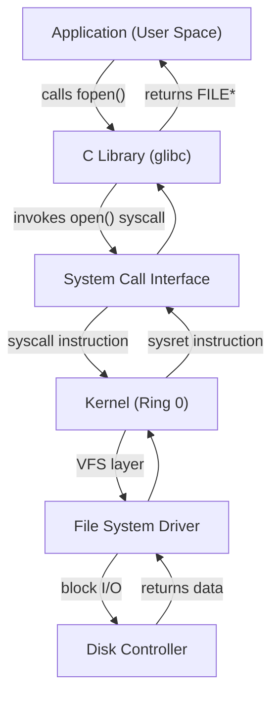
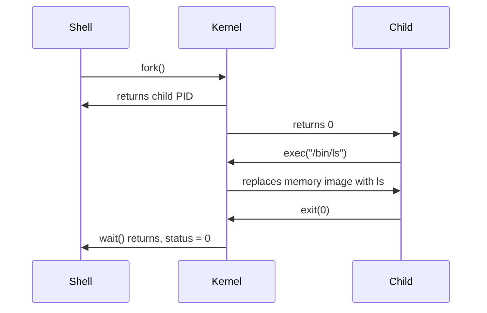
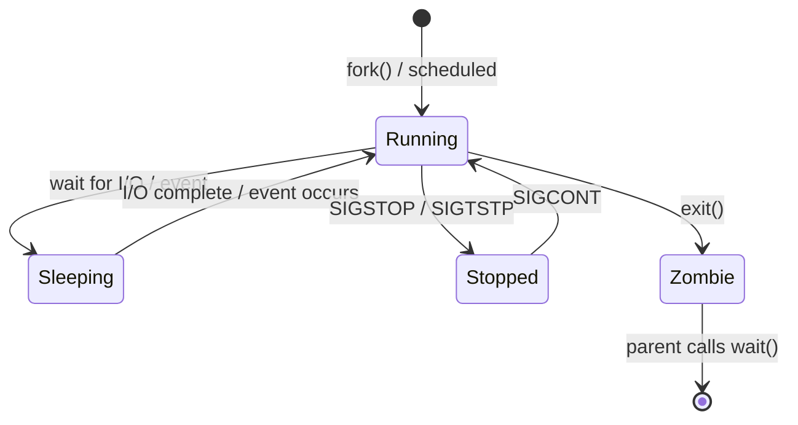
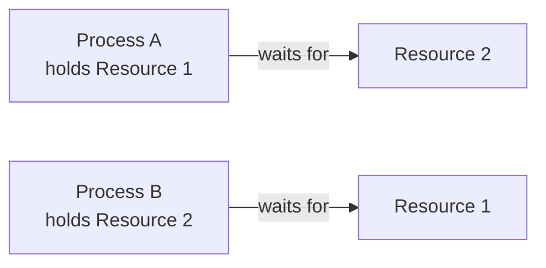
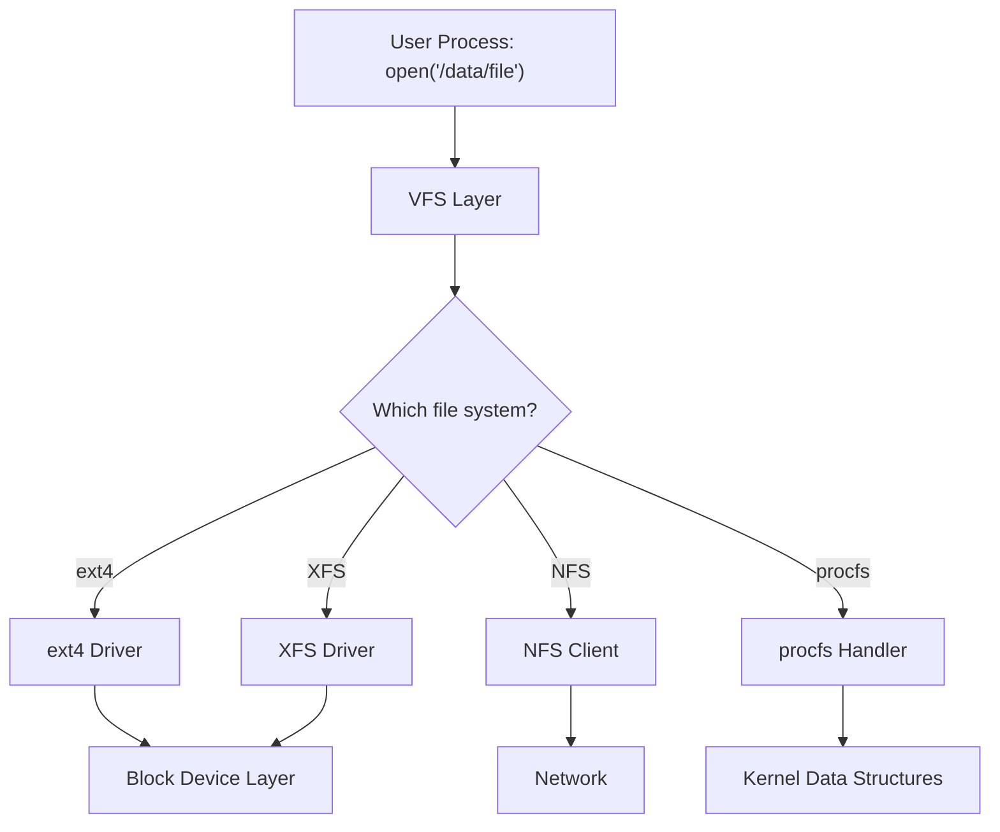
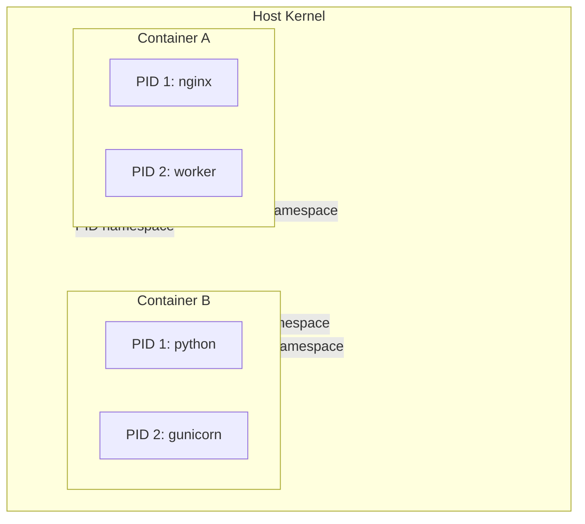

# Operating Systems and Linux

An operating system is the software layer between hardware and everything else. It manages the processor, memory, storage, and I/O devices so that application programs do not have to. Linux is the dominant operating system in servers, cloud infrastructure, containers, and embedded systems. Understanding how it works — not just how to use it — is the foundation for every infrastructure role.

This domain covers the full operating system stack: what the kernel does and how it does it, how processes are created and scheduled, how memory is virtualized, how files are stored on disk, how permissions enforce access control, how packages and services are managed, and how namespaces and cgroups provide the isolation primitives that containers are built on. Theory and practice are never separated. Every concept is immediately observable on a running Linux system.

By the end of this domain, you will be able to trace a system call from user space into the kernel, create and observe every process state, explain why a system is slow by reading `/proc` and `/sys`, manage disks and file systems from raw block devices to mounted partitions, configure users and permissions at the ACL and capability level, write systemd service units, troubleshoot networking from the command line, and build container-like isolation by hand using kernel primitives.

---

## A. What an Operating System Does

### Theory

An operating system provides three fundamental services: **abstraction**, **resource management**, and **isolation**.

**Abstraction** hides hardware complexity. Application programs do not talk to disk controllers, network cards, or memory chips directly. They call standardized interfaces — system calls — and the kernel translates those calls into hardware-specific operations. The `read()` system call works the same whether the underlying storage is an NVMe SSD, a spinning hard drive, or a network file system. This abstraction is what makes software portable.

**Resource management** arbitrates access to shared hardware. A single processor must run hundreds of processes. Physical memory must be divided among them. Disk bandwidth and network bandwidth are finite. The kernel decides who gets what, when, and for how long. These decisions are governed by scheduling algorithms, memory management policies, and I/O schedulers — all covered in this domain.

**Isolation** prevents processes from interfering with each other. One process cannot read another's memory. One user cannot delete another's files (unless permissions allow it). A misbehaving application cannot crash the entire system (in theory — the OOM killer exists for when theory meets reality). Isolation is enforced by the hardware (MMU, privilege rings) and the kernel (virtual address spaces, permissions, namespaces).

#### Kernel Architectures

The kernel is the core of the operating system — the code that runs in privileged mode with direct hardware access. Three architectural approaches exist:

| Architecture | Description | Examples | Tradeoffs |
|-------------|-------------|----------|-----------|
| **Monolithic** | Entire kernel runs in a single address space. All services (file systems, drivers, networking) share the same memory. | Linux, FreeBSD | Fast (no context switches between services), but a bug in any driver can crash the entire kernel |
| **Microkernel** | Minimal kernel handles only IPC, scheduling, and memory management. Everything else runs as user-space services. | MINIX, QNX, seL4 | More stable and secure (driver crashes do not crash the kernel), but slower due to IPC overhead |
| **Hybrid** | Monolithic core with some services in user space. Pragmatic compromise. | Windows NT, macOS (XNU) | Balances performance and modularity |

Linux uses a **monolithic** architecture with **loadable kernel modules** (LKMs). The base kernel is monolithic — all core subsystems share a single address space — but drivers and file systems can be loaded and unloaded at runtime without rebooting. This gives Linux the performance of a monolithic kernel with some of the flexibility of a microkernel.

#### Kernel Space vs. User Space

The processor enforces a privilege boundary. On x86, this is implemented as **protection rings**:

- **Ring 0 (kernel space)**: Full hardware access. The kernel runs here. It can execute any instruction, access any memory address, and interact with any device.
- **Ring 3 (user space)**: Restricted access. Application programs run here. They cannot directly access hardware or other processes' memory.

When a user-space program needs to perform a privileged operation — reading a file, allocating memory, sending a network packet — it makes a **system call**. The system call triggers a controlled transition from Ring 3 to Ring 0 (via the `syscall` instruction on x86-64), the kernel performs the requested operation, and control returns to user space.

Key system calls you will encounter throughout this domain:

| System Call | Purpose |
|------------|---------|
| `open()` | Open a file, return a file descriptor |
| `read()` | Read bytes from a file descriptor |
| `write()` | Write bytes to a file descriptor |
| `close()` | Close a file descriptor |
| `fork()` | Create a new process (copy of the caller) |
| `exec()` | Replace the current process image with a new program |
| `mmap()` | Map files or devices into memory |
| `ioctl()` | Device-specific control operations |
| `brk()`/`sbrk()` | Adjust the program break (heap allocation) |
| `clone()` | Create a new process or thread (Linux-specific, more flexible than fork) |

#### The System Call Interface

The system call interface is the **only** way user-space programs interact with the kernel. Every operation that touches hardware — every file read, every network packet, every memory allocation — goes through a system call. Libraries like glibc provide wrapper functions (`fopen()`, `malloc()`, `printf()`) that ultimately invoke system calls underneath.



### Practice

Use `strace` to observe system calls made by real programs. `strace` intercepts and records every system call a process makes.

```bash
# Trace all system calls made by 'ls'
strace ls /tmp 2>&1 | head -40

# Count system calls by type
strace -c ls /tmp
```

The `-c` flag produces a summary table showing how many times each system call was invoked and how much time was spent in each. You will see calls like `openat()`, `read()`, `write()`, `close()`, `fstat()`, `mmap()`, and `getdents64()` (which reads directory entries).

```bash
# Trace only file-related system calls
strace -e trace=file ls /tmp

# Trace only process-related system calls
strace -e trace=process bash -c 'echo hello'

# Trace a running process by PID
strace -p $(pidof sshd) -c
```

> **Try It**: Run `strace -c ls /` and examine the output. Which system call is invoked most frequently? Now run `strace -c cat /etc/passwd`. How does the system call profile differ? The difference reflects the fundamental operations each program performs: `ls` reads directory entries, `cat` reads file contents.

### Connection

Every command you run, every file you open, every network connection you make passes through the system call interface. Understanding system calls is understanding the contract between user space and the kernel. When you run `strace` on a misbehaving process later in your career, you will be reading this contract to find where it is violated. This connects directly to [How Computers Work](/learn/first-principles/how-computers-work/) — the privilege rings and interrupts described there are the hardware mechanism that makes system calls possible.

---

## B. Processes

### Theory

A **process** is an instance of a running program. It is the fundamental unit of execution in an operating system. Every process has:

- **PID (Process ID)**: A unique integer identifier assigned by the kernel.
- **PPID (Parent Process ID)**: The PID of the process that created it. Every process has a parent except PID 1 (`init` or `systemd`).
- **Address space**: A private virtual memory layout containing code, data, heap, and stack segments.
- **File descriptors**: Numbered references to open files, sockets, pipes, and devices. Every process starts with at least three: 0 (stdin), 1 (stdout), 2 (stderr).
- **PCB (Process Control Block)**: A kernel data structure (`task_struct` in Linux) that stores all metadata about the process — its state, registers, memory mappings, scheduling priority, open files, signal handlers, and more.

#### Process Creation: fork() and exec()

Unix process creation uses two separate operations:

**`fork()`** creates a new process by duplicating the calling process. The new process (child) is an almost exact copy of the parent — same code, same data, same open file descriptors. The only difference is the return value of `fork()`: the parent receives the child's PID, and the child receives 0.

Modern Linux implements **copy-on-write (COW)**: `fork()` does not actually copy memory pages. Both parent and child share the same physical pages, marked read-only. Only when one of them writes to a page does the kernel copy that page. This makes `fork()` extremely fast even for large processes.

**`exec()`** replaces the current process's memory image with a new program. The PID stays the same, but the code, data, heap, and stack are replaced. File descriptors remain open (unless marked close-on-exec).

**How shells work**: When you type `ls` in a shell, the shell calls `fork()` to create a child process, then the child calls `exec()` to replace itself with the `ls` program. The parent (the shell) calls `wait()` to pause until the child finishes. This fork+exec pattern is how every command is executed.



#### Process States

Every process is in exactly one state at any time:

| State | Symbol in `ps` | Description |
|-------|---------------|-------------|
| **Running (R)** | R | Currently executing on a CPU, or in the run queue ready to execute |
| **Sleeping (Interruptible)** | S | Waiting for an event (I/O completion, signal). Can be woken by signals. |
| **Sleeping (Uninterruptible)** | D | Waiting for I/O that cannot be interrupted. Common during disk operations. Cannot be killed with SIGKILL. |
| **Stopped** | T | Paused by a signal (SIGSTOP or SIGTSTP). Can be resumed with SIGCONT. |
| **Zombie** | Z | Process has terminated but its parent has not yet called `wait()` to read its exit status. The PCB remains in the kernel's process table. |



**Zombies** are a common source of confusion. A zombie is not a running process consuming CPU or memory. It is a one-line entry in the process table holding the exit status until the parent reads it. Zombies are normal and transient — unless the parent never calls `wait()`, in which case they accumulate. If the parent dies, `init` (PID 1) adopts the orphaned zombies and reaps them.

#### Context Switching

When the kernel switches the CPU from one process to another, it performs a **context switch**: saving the current process's registers, program counter, and stack pointer into its PCB, then loading another process's saved state. Context switches are expensive — typically 1-10 microseconds — because they flush the CPU pipeline, may invalidate TLB entries, and pollute the CPU cache. Minimizing unnecessary context switches is a key performance consideration.

### Practice

```bash
# List all processes with full details
ps aux

# Process tree showing parent-child relationships
pstree -p

# Interactive process monitor
top
# Or the more feature-rich alternative
htop
```

Explore the `/proc` filesystem — a virtual filesystem that exposes kernel data structures as files:

```bash
# View your shell's process status
cat /proc/$$/status

# View memory mappings of your shell
cat /proc/$$/maps

# List open file descriptors
ls -la /proc/$$/fd

# View the command line that started a process
cat /proc/$$/cmdline | tr '\0' ' '
```

**Create a zombie process** to observe the Z state:

```bash
# This script forks a child that exits immediately,
# but the parent never calls wait()
python3 -c "
import os, time
pid = os.fork()
if pid == 0:
    # Child exits immediately
    os._exit(0)
else:
    # Parent sleeps without calling wait()
    print(f'Child PID: {pid}')
    print('Parent sleeping — child is now a zombie')
    time.sleep(60)
"

# In another terminal, observe the zombie:
ps aux | grep Z
```

> **Try It**: Run `pstree -p $$` to see where your current shell sits in the process tree. Trace it all the way up to PID 1. Then open `/proc/$$/status` and identify the process state, parent PID, number of threads, and voluntary/involuntary context switches. Each field maps to a concept described in the theory section above.

### Connection

Processes are the kernel's unit of resource management. Every topic that follows — scheduling, memory, file systems, permissions — operates on processes. The fork+exec model explains why containers work: a container runtime forks a process, sets up namespaces and cgroups (covered in section N), then execs the container's entrypoint. Understanding the process lifecycle here prepares you for [Infrastructure at Scale](/learn/first-principles/infrastructure-at-scale/) where container orchestration manages millions of processes across thousands of machines.

---

## C. Threads and Synchronization

### Theory

A **thread** is an execution context within a process. Multiple threads within the same process share the same address space (code, data, heap) but each has its own stack, program counter, and register set. Threads are cheaper to create and context-switch than processes because they do not require separate address spaces.

| Property | Processes | Threads |
|----------|-----------|---------|
| Address space | Separate (isolated) | Shared |
| Creation cost | High (copy page tables, even with COW) | Low (new stack and registers only) |
| Communication | IPC mechanisms (pipes, sockets, shared memory) | Direct memory access (shared heap) |
| Crash isolation | One crash does not affect others | One crash can corrupt the entire process |

**Kernel threads vs. user threads**: Linux treats threads and processes almost identically. Both are represented by `task_struct` in the kernel. The `clone()` system call creates both — the difference is which resources are shared. POSIX threads (pthreads) are kernel threads on Linux, meaning the kernel can schedule them independently across multiple CPU cores.

#### Race Conditions

When multiple threads access shared data concurrently and at least one of them writes, the result depends on the order of execution — a **race condition**. Race conditions produce intermittent, hard-to-reproduce bugs.

Example: Two threads incrementing a shared counter.

```
Thread A reads counter: 5
Thread B reads counter: 5
Thread A writes counter: 6
Thread B writes counter: 6  (should be 7!)
```

The increment operation (`counter += 1`) is not **atomic** — it involves three steps (read, modify, write) that can be interleaved.

#### Synchronization Primitives

| Primitive | Description | Use Case |
|-----------|-------------|----------|
| **Mutex** | Mutual exclusion lock. Only one thread can hold it at a time. Others block until it is released. | Protecting a shared data structure |
| **Semaphore** | A counter that allows up to N threads to proceed. `wait()` decrements, `signal()` increments. A binary semaphore (N=1) behaves like a mutex. | Limiting concurrent access to a resource pool |
| **Monitor** | A language-level construct that combines a mutex with condition variables. Methods are automatically synchronized. | Java `synchronized`, Python `with lock` |
| **Condition Variable** | Allows a thread to block until a condition is true. Used with a mutex. `wait()` releases the mutex and blocks; `signal()` wakes one waiting thread. | Producer-consumer coordination |
| **Spinlock** | A lock that busy-waits (loops) instead of blocking. Useful when the expected wait time is very short (less than the cost of a context switch). | Kernel-level synchronization, short critical sections |

#### Classic Synchronization Problems

**Producer-Consumer**: One or more producers add items to a bounded buffer; consumers remove them. Requires mutual exclusion on the buffer and synchronization to block producers when the buffer is full and consumers when it is empty.

**Readers-Writers**: Multiple readers can access shared data simultaneously, but writers need exclusive access. Must prevent writer starvation (readers continuously locking out writers).

**Dining Philosophers**: Five philosophers sit around a table, each needing two forks to eat. Models the challenge of acquiring multiple resources without deadlock.

### Practice

Demonstrate a race condition in Python and fix it with a lock:

```python
# race_condition.py — demonstrates a race condition
import threading

counter = 0

def increment():
    global counter
    for _ in range(1_000_000):
        counter += 1

threads = [threading.Thread(target=increment) for _ in range(4)]
for t in threads:
    t.start()
for t in threads:
    t.join()

print(f"Expected: 4000000, Got: {counter}")
# Output will be less than 4000000 due to race condition
```

```python
# race_condition_fixed.py — fixed with a mutex (Lock)
import threading

counter = 0
lock = threading.Lock()

def increment():
    global counter
    for _ in range(1_000_000):
        with lock:
            counter += 1

threads = [threading.Thread(target=increment) for _ in range(4)]
for t in threads:
    t.start()
for t in threads:
    t.join()

print(f"Expected: 4000000, Got: {counter}")
# Output will be exactly 4000000
```

> **Try It**: Run the race condition script multiple times. The final count will differ on each run — that is the race condition in action. Then run the fixed version and confirm it always produces exactly 4,000,000. Note the performance difference: the lock version is significantly slower because threads must serialize access. This is the fundamental tradeoff of synchronization — correctness costs throughput.

### Connection

Synchronization matters far beyond academic exercises. Databases use locks to ensure transaction isolation (covered in [Data Management](/learn/first-principles/data-management/)). Web servers use thread pools with semaphores to limit concurrent connections. Container runtimes use mutexes to protect shared state. The race condition you just observed in Python is the same class of bug that causes data corruption in production systems.

---

## D. Deadlock

### Theory

A **deadlock** occurs when two or more processes are each waiting for a resource held by another, and none can proceed. No amount of waiting resolves it — the system is permanently stuck.

#### The Four Necessary Conditions (Coffman Conditions)

All four must hold simultaneously for deadlock to occur:

1. **Mutual Exclusion**: At least one resource is held in a non-shareable mode. Only one process can use it at a time.
2. **Hold and Wait**: A process holds at least one resource while waiting to acquire additional resources.
3. **No Preemption**: Resources cannot be forcibly taken from a process. The holder must release voluntarily.
4. **Circular Wait**: A circular chain of processes exists, where each process holds a resource the next process needs.



#### Deadlock Handling Strategies

**Detection**: Build a **wait-for graph** where nodes are processes and edges represent "is waiting for." If the graph contains a cycle, deadlock exists. Detection is used in database systems where transactions can be rolled back.

**Prevention**: Eliminate one of the four conditions.
- Eliminate hold-and-wait: Require processes to request all resources at once (atomically).
- Eliminate circular wait: Impose a total ordering on resources. Processes must acquire resources in increasing order.
- Eliminate no-preemption: If a process cannot get a resource, force it to release what it holds.

**Avoidance**: Use advance knowledge of resource needs to avoid entering unsafe states. The **Banker's Algorithm** (Dijkstra) works by simulating resource allocation before granting requests. If granting a request would leave the system in a state where deadlock is possible, the request is denied.

**Recovery**: Kill one of the deadlocked processes, or roll back a transaction. Databases typically use this approach — one transaction is aborted as the **deadlock victim**.

### Practice

Create a deadlock using file locks:

```bash
# Terminal 1: Lock file A, then try to lock file B
touch /tmp/lockA /tmp/lockB

# In terminal 1:
(
  flock -x 200
  echo "Terminal 1: locked A"
  sleep 2
  echo "Terminal 1: waiting for B..."
  flock -x 201
  echo "Terminal 1: locked B"  # Never reached
) 200>/tmp/lockA 201>/tmp/lockB

# In terminal 2 (run within 2 seconds):
(
  flock -x 201
  echo "Terminal 2: locked B"
  sleep 2
  echo "Terminal 2: waiting for A..."
  flock -x 200
  echo "Terminal 2: locked A"  # Never reached
) 200>/tmp/lockA 201>/tmp/lockB
```

Both terminals will hang indefinitely — each holds one lock and waits for the other. This is deadlock. Press `Ctrl+C` to kill them.

**Fix by ordering**: If both processes always acquire lock A before lock B, circular wait is eliminated and deadlock cannot occur.

> **Try It**: Run the deadlock example above. Observe that both terminals freeze. Then modify the second terminal's script to acquire locks in the same order as the first (A then B). Confirm that deadlock no longer occurs — one process gets both locks, the other waits and then proceeds.

### Connection

Deadlock is not a theoretical curiosity. Database engines detect deadlocks in transaction wait-for graphs and kill victim transactions — you will see this in [Data Management](/learn/first-principles/data-management/). Kubernetes can deadlock when circular resource dependencies exist between pods. Understanding the four conditions and prevention strategies gives you a framework for analyzing any system where concurrent processes compete for resources.

---

## E. CPU Scheduling

### Theory

The **CPU scheduler** decides which process runs on which CPU core and for how long. It is invoked whenever a process blocks (I/O wait), a time quantum expires, a higher-priority process becomes runnable, or a process terminates.

#### Preemptive vs. Cooperative Scheduling

- **Cooperative** (non-preemptive): A process runs until it voluntarily yields. Used in early systems and some embedded contexts. One misbehaving process can starve everything else.
- **Preemptive**: The kernel can forcibly take the CPU from a running process (via timer interrupts). All modern general-purpose OS kernels use preemptive scheduling.

#### Scheduling Algorithms

| Algorithm | Description | Pros | Cons |
|-----------|-------------|------|------|
| **FCFS** (First-Come, First-Served) | Processes run in arrival order | Simple | Convoy effect: short jobs stuck behind long ones |
| **SJF** (Shortest Job First) | Shortest expected burst runs next | Optimal average wait time | Requires knowing burst time in advance; starvation of long jobs |
| **SRTF** (Shortest Remaining Time First) | Preemptive SJF. If a new process has shorter remaining time, it preempts. | Optimal for average turnaround | Same problems as SJF plus preemption overhead |
| **Round-Robin** | Each process gets a fixed time quantum (e.g., 10ms). After the quantum expires, the process goes to the back of the queue. | Fair, good for interactive systems | High overhead if quantum is too small; poor throughput if too large |
| **Priority** | Each process has a priority. Highest-priority runnable process runs. | Supports real-time and differentiated workloads | Priority inversion, starvation of low-priority processes |
| **MLFQ** (Multi-Level Feedback Queue) | Multiple queues with different priorities. Processes move between queues based on behavior. CPU-bound tasks drop to lower priority; I/O-bound tasks rise. | Adapts to workload mix without advance knowledge | Complex to tune |

#### Linux CFS (Completely Fair Scheduler)

Linux's default scheduler since kernel 2.6.23 is the **Completely Fair Scheduler (CFS)**. CFS aims to give each runnable process an equal share of CPU time.

Key concepts:

- **Virtual runtime (`vruntime`)**: Each process tracks how much CPU time it has consumed, weighted by its priority. A process with a higher `nice` value (lower priority) accumulates `vruntime` faster.
- **Red-black tree**: CFS maintains runnable processes in a self-balancing red-black tree, sorted by `vruntime`. The process with the smallest `vruntime` (least CPU time received) is always at the leftmost node and is selected next.
- **Nice values**: Range from -20 (highest priority) to +19 (lowest priority). Default is 0. Each nice level roughly corresponds to a 10% change in CPU weight. Only root can set negative nice values.

The formula for weighted virtual runtime:

`vruntime += delta_exec * (NICE_0_WEIGHT / weight)`

Where `delta_exec` is the actual wall-clock time consumed, `NICE_0_WEIGHT` is 1024 (the weight of nice 0), and `weight` is the process's weight based on its nice value. Lower-weight processes (higher nice) accumulate `vruntime` faster, so they get scheduled less frequently.

#### Real-Time Scheduling

Linux supports three real-time scheduling policies that override CFS:

| Policy | Description |
|--------|-------------|
| **SCHED_FIFO** | First-in, first-out within a priority level. A real-time process runs until it blocks or a higher-priority real-time process becomes runnable. |
| **SCHED_RR** | Round-robin within a priority level. Like SCHED_FIFO but with a time quantum. |
| **SCHED_DEADLINE** | Earliest Deadline First (EDF). Each task specifies a runtime, deadline, and period. The kernel guarantees the task gets its runtime within each period. Most advanced real-time policy. |

Real-time priorities range from 1-99 (higher is more important) and always preempt CFS processes.

#### Load Average

The **load average** (visible via `uptime` or `/proc/loadavg`) is the average number of processes in the runnable + uninterruptible sleep states over 1, 5, and 15-minute intervals. On a 4-core system, a load average of 4.0 means the CPUs are fully utilized. Above 4.0 means processes are waiting for CPU time.

### Practice

```bash
# View current load average
uptime
cat /proc/loadavg

# Start a CPU-bound process with low priority (nice 19)
nice -n 19 dd if=/dev/zero of=/dev/null bs=1M &

# Start another with high priority (requires root, nice -10)
sudo nice -n -10 dd if=/dev/zero of=/dev/null bs=1M &

# Observe the difference in CPU allocation
top
# Press '1' in top to see per-CPU utilization

# Change a running process's priority
renice -n 10 -p <PID>

# View scheduling information for a process
cat /proc/<PID>/sched

# Set real-time scheduling policy
sudo chrt -f 50 sleep 10  # SCHED_FIFO with priority 50
sudo chrt -r 50 sleep 10  # SCHED_RR with priority 50

# Pin a process to a specific CPU core
taskset -c 0 dd if=/dev/zero of=/dev/null bs=1M &
taskset -c 1 dd if=/dev/zero of=/dev/null bs=1M &

# View which CPU a process is running on
taskset -p <PID>
```

> **Try It**: Open two terminals. In the first, run `nice -n 19 stress --cpu 1` (low priority). In the second, run `nice -n 0 stress --cpu 1` (normal priority). Use `top` to compare their CPU percentages. The normal-priority process should get roughly five times more CPU. Kill both, then try `nice -n -10` (requires `sudo`) to see the effect of higher-than-normal priority.

### Connection

CPU scheduling determines application performance. In containerized environments covered in [Infrastructure at Scale](/learn/first-principles/infrastructure-at-scale/), Kubernetes CPU requests and limits map directly to CFS bandwidth control via cgroups (section N of this domain). A container requesting 500m CPU gets 50% of a core's CFS bandwidth. Understanding CFS explains why containers sometimes get throttled even when the node has spare capacity — CFS bandwidth enforcement is per-period, not just average.

---

## F. Memory Management

### Theory

Physical memory (RAM) is a finite resource shared among all processes. The kernel uses **virtual memory** to give each process the illusion of having its own private, contiguous address space, even though the physical memory is fragmented and shared.

#### Virtual Memory and Paging

The virtual address space is divided into fixed-size **pages** (typically 4 KB on x86-64). Physical memory is divided into **frames** of the same size. The **page table** maps virtual pages to physical frames. When a process accesses a virtual address, the **MMU (Memory Management Unit)** hardware translates it to a physical address using the page table.

**Multi-level page tables**: A flat page table for a 48-bit address space would require 512 GB of memory — larger than most physical RAM. Linux uses a 4-level (or 5-level on newer hardware) hierarchical page table: PGD (Page Global Directory) -> P4D -> PUD (Page Upper Directory) -> PMD (Page Middle Directory) -> PTE (Page Table Entry). Only allocated regions have entries, saving enormous amounts of memory.

**TLB (Translation Lookaside Buffer)**: A hardware cache inside the MMU that stores recent virtual-to-physical translations. TLB hits are fast (1-2 cycles); TLB misses require a **page table walk** (tens of cycles). Context switches may flush the TLB, which is one reason they are expensive.

**Huge pages**: Instead of 4 KB pages, Linux supports 2 MB and 1 GB huge pages. Fewer pages means fewer TLB entries needed, fewer page table entries, and faster address translation for large memory workloads (databases, virtual machines). Transparent Huge Pages (THP) manage this automatically; explicit huge pages require manual configuration.

#### Page Faults

A **page fault** occurs when a process accesses a virtual address that is not currently mapped to a physical frame.

| Type | Cause | Cost |
|------|-------|------|
| **Minor (soft)** | Page exists in memory but not in the process's page table (e.g., COW after fork, demand paging) | Microseconds — just update the page table |
| **Major (hard)** | Page must be read from disk (swapped out, or never loaded — demand paging of executable code) | Milliseconds — requires disk I/O |

**Demand paging**: Pages are not loaded into memory until they are accessed. When you `exec()` a program, the kernel sets up page table entries pointing to the executable on disk but does not load them. The first access to each page triggers a major page fault, and the kernel loads that page. This means programs start faster and only load code that is actually executed.

#### Page Replacement Algorithms

When physical memory is full and a new page must be loaded, the kernel must evict an existing page. Which page to evict is determined by the replacement algorithm:

| Algorithm | Description | Characteristics |
|-----------|-------------|----------------|
| **Optimal** | Evict the page that will not be used for the longest time in the future | Provably optimal but impossible to implement (requires knowing the future) |
| **FIFO** | Evict the oldest page | Simple but suffers from Belady's anomaly (more frames can increase faults) |
| **LRU** (Least Recently Used) | Evict the page that has not been accessed for the longest time | Good approximation of optimal; expensive to implement exactly |
| **Clock** (Second Chance) | Circular buffer with a reference bit. Scans pages; if the reference bit is 1, clear it and move on. If 0, evict. | Efficient approximation of LRU; used in practice |

Linux uses a variant of the Clock algorithm with two lists: **active** and **inactive**. Pages start on the inactive list. If accessed while inactive, they are promoted to the active list. When the active list grows too large, pages are demoted to inactive. Eviction happens from the tail of the inactive list.

#### Thrashing and Working Set

**Thrashing** occurs when a system spends more time paging (swapping pages in and out) than doing useful work. It happens when the combined working sets of all processes exceed physical memory. Symptoms: extremely high disk I/O, extremely low CPU utilization, system nearly unresponsive.

The **working set** is the set of pages a process is actively using during a given time interval. If a process's working set fits in physical memory, it runs with mostly minor page faults. If not, major page faults dominate and performance collapses.

#### Swap, zswap, and zram

**Swap** is disk space used as an extension of physical memory. When the kernel evicts a page belonging to a process (as opposed to a page cache page that can be re-read from its file), it writes the page to swap. Swap is slow — SSDs are still orders of magnitude slower than RAM.

- **zswap**: A compressed write-back cache for swap. Before writing pages to disk, they are compressed and stored in a RAM pool. Only when the pool is full are pages written to the actual swap device. Reduces swap I/O at the cost of CPU cycles for compression.
- **zram**: A compressed block device in RAM. Creates a virtual swap device in memory. Pages swapped to zram are compressed and stay in RAM — no disk I/O at all. Useful on memory-constrained systems.

#### OOM Killer

When the system is critically low on memory and cannot free enough pages, the **OOM (Out of Memory) Killer** selects a process to kill. The selection is based on `oom_score` (visible at `/proc/<PID>/oom_score`), which factors in memory usage, age, and other heuristics. Administrators can influence the score via `/proc/<PID>/oom_score_adj` (range -1000 to 1000; -1000 disables OOM killing for that process).

**Overcommit**: Linux allows processes to allocate more virtual memory than physical memory exists (controlled by `vm.overcommit_memory`). This works because not all allocated memory is used simultaneously. But if all processes actually use their allocations, the system runs out of memory and the OOM killer activates.

| `vm.overcommit_memory` | Behavior |
|------------------------|----------|
| 0 (default) | Heuristic overcommit. Kernel denies obviously unreasonable allocations. |
| 1 | Always allow. Never fail `malloc()`. The OOM killer handles the consequences. |
| 2 | Never overcommit beyond swap + (physical RAM * overcommit_ratio%). `malloc()` can fail. |

#### mmap and NUMA

**`mmap()`** maps files or devices directly into a process's virtual address space. Instead of `read()` and `write()`, the process accesses file contents as memory. The kernel handles paging file contents in and out transparently. Memory-mapped files are the foundation of shared libraries (`.so` files), shared memory between processes, and many high-performance I/O patterns.

**NUMA (Non-Uniform Memory Access)**: In multi-socket systems, each CPU socket has its own local memory. Accessing local memory is faster than remote memory. The kernel's NUMA policy controls how memory is allocated relative to CPU topology. NUMA-aware applications can bind threads to specific CPUs and allocate memory on the local node for optimal performance.

### Practice

```bash
# View detailed memory information
cat /proc/meminfo

# Key fields:
# MemTotal — total physical RAM
# MemFree — unused RAM
# MemAvailable — RAM available without swapping (includes reclaimable caches)
# Buffers — block device cache
# Cached — page cache (file-backed pages)
# SwapTotal / SwapFree — swap space

# Monitor page faults for a command
perf stat -e page-faults,minor-faults,major-faults ls /

# View a process's memory map
cat /proc/$$/maps

# Check the OOM score of a process
cat /proc/$$/oom_score
cat /proc/$$/oom_score_adj

# View and set swappiness (0-200, default 60)
cat /proc/sys/vm/swappiness
sudo sysctl vm.swappiness=10

# Trigger OOM in a cgroup (safe, contained)
# Create a cgroup with 50MB memory limit
sudo mkdir /sys/fs/cgroup/memory_test
echo "50M" | sudo tee /sys/fs/cgroup/memory_test/memory.max
echo $$ | sudo tee /sys/fs/cgroup/memory_test/cgroup.procs
# Now try to allocate more than 50MB
python3 -c "x = bytearray(100 * 1024 * 1024)"  # OOM killed

# Configure huge pages
cat /proc/meminfo | grep -i huge
# Allocate 100 huge pages (2MB each = 200MB)
sudo sysctl vm.nr_hugepages=100
```

> **Try It**: Run `cat /proc/meminfo` and calculate: What percentage of total RAM is currently used by the page cache (`Cached` field)? Run `perf stat -e page-faults ls /` and note the page fault count. Then run `perf stat -e page-faults cat /dev/urandom | head -c 100M > /dev/null` and compare. The second command causes far more page faults because it processes much more data.

### Connection

Virtual memory is the mechanism that makes process isolation possible. Each process has its own page table, so it literally cannot address another process's physical memory without the kernel's cooperation. This same mechanism enables the memory limits in cgroups (section N) and the memory isolation in containers ([Infrastructure at Scale](/learn/first-principles/infrastructure-at-scale/)). When you set a Kubernetes memory limit, you are configuring `memory.max` in a cgroup, which triggers the OOM killer when a container exceeds its allocation — the exact mechanism described above.

---

## G. File Systems

### Theory

A **file system** organizes data on a storage device into a hierarchy of files and directories. The kernel's file system layer translates operations like "open file `/etc/passwd`" into specific block reads from a storage device.

#### Inodes, Dentries, and the Superblock

Every file on a Linux file system is represented by an **inode** (index node), a data structure containing:

- File type (regular, directory, symlink, device, etc.)
- Permissions (owner, group, mode)
- Ownership (UID, GID)
- Timestamps (atime, mtime, ctime)
- Size
- Pointers to data blocks on disk
- Link count (number of hard links)

An inode does **not** contain the filename. Filenames are stored in **directory entries (dentries)**, which map names to inode numbers. A directory is just a file containing a list of (name, inode number) pairs.

The **dcache** (directory entry cache) is a kernel cache of recently looked up dentries, making path resolution fast.

The **superblock** stores metadata about the entire file system: its type, size, status, block size, inode count, and pointers to the root inode.

#### Allocation Methods and Free Space

File systems must track which disk blocks are allocated to files and which are free. Common allocation methods:

- **Contiguous**: Each file occupies a contiguous set of blocks. Simple and fast for sequential reads, but suffers from external fragmentation.
- **Linked**: Each block contains a pointer to the next block. No fragmentation, but random access is O(n).
- **Indexed (inode-based)**: Each file has an index block (the inode) containing pointers to data blocks. ext4 uses direct pointers, indirect, double-indirect, and triple-indirect pointers. Modern file systems like ext4 also use **extents** — contiguous runs of blocks described by (start, length) pairs — which are more efficient for large files.

Free space is tracked with bitmaps (one bit per block — 0 for free, 1 for allocated) or free lists.

#### Journaling

A **journal** (or log) records file system operations before they are committed to the main data structures. If the system crashes mid-operation, the journal can be replayed to restore consistency without a full file system check (`fsck`).

| Journaling Mode | What Is Journaled | Performance | Safety |
|----------------|-------------------|-------------|--------|
| **Journal** (full) | Metadata + data | Slowest | Safest — data is never partially written |
| **Ordered** (ext4 default) | Metadata only, but data is written before metadata | Balanced | Data is consistent but may contain stale blocks |
| **Writeback** | Metadata only, data can be written in any order | Fastest | Risk of stale data after crash |

#### File System Types

| File System | Description | Use Case |
|------------|-------------|----------|
| **ext4** | Default Linux file system. Journaling, extents, up to 1 EB volumes. | General-purpose Linux |
| **XFS** | High-performance 64-bit journaling file system. Excellent for large files and parallel I/O. | Large storage, databases |
| **Btrfs** | Copy-on-write. Snapshots, checksums, built-in RAID, compression. | Advanced storage management |
| **ZFS** | Copy-on-write with integrated volume management. Checksums, deduplication, snapshots, self-healing. | Enterprise storage, data integrity |
| **tmpfs** | In-memory file system. Contents are lost on reboot. | `/tmp`, `/run`, shared memory (`/dev/shm`) |
| **procfs** | Virtual file system exposing kernel data structures. | `/proc` — process and system information |
| **sysfs** | Virtual file system exposing kernel object hierarchy (devices, drivers, bus topology). | `/sys` — hardware and kernel configuration |

#### VFS (Virtual File System)

The **VFS** is an abstraction layer in the kernel that provides a uniform interface for all file systems. User-space programs call the same system calls (`open()`, `read()`, `write()`) regardless of the underlying file system. VFS dispatches calls to the appropriate file system driver.



#### Hard Links vs. Symbolic Links

- **Hard link**: A directory entry pointing to an existing inode. The file has multiple names. All hard links are equal — there is no "original." Deleting one link decrements the link count; the file is deleted when the count reaches 0. Cannot cross file system boundaries. Cannot link to directories (to prevent cycles).
- **Symbolic (soft) link**: A separate file whose content is a path to the target. Can cross file systems. Can link to directories. If the target is deleted, the symlink becomes a **dangling link** (broken).

#### File Descriptors

A **file descriptor** is an integer that a process uses to reference an open file (or socket, pipe, device). The kernel maintains a per-process file descriptor table, a system-wide open file table (tracking current offset and mode), and an inode table. File descriptors 0, 1, and 2 are stdin, stdout, and stderr by convention.

### Practice

```bash
# View inode information for a file
stat /etc/passwd

# View inode usage on a file system
df -i

# Create a hard link and observe the link count
echo "hello" > /tmp/original
ln /tmp/original /tmp/hardlink
stat /tmp/original    # link count = 2
stat /tmp/hardlink    # same inode number

# Create a symbolic link
ln -s /tmp/original /tmp/symlink
stat /tmp/symlink     # different inode, type = symbolic link
ls -la /tmp/symlink   # shows -> /tmp/original

# Delete the original — hard link still works, symlink breaks
rm /tmp/original
cat /tmp/hardlink     # works (file still exists, link count = 1)
cat /tmp/symlink      # error: No such file or directory

# View open file descriptors for your shell
ls -la /proc/$$/fd

# View system-wide open file descriptor count
cat /proc/sys/fs/file-nr
```

**Disk management: partition, format, mount**:

```bash
# List block devices
lsblk

# View disk partition table (replace /dev/sdb with your device)
sudo fdisk -l /dev/sdb

# Create a partition interactively
sudo fdisk /dev/sdb
# n -> new partition, p -> primary, accept defaults, w -> write

# Create an ext4 file system
sudo mkfs.ext4 /dev/sdb1

# Create a mount point and mount
sudo mkdir /mnt/data
sudo mount /dev/sdb1 /mnt/data

# Verify
df -h /mnt/data
mount | grep sdb1

# Get the UUID (for fstab)
sudo blkid /dev/sdb1

# Add to /etc/fstab for persistent mounting
# UUID=<uuid-from-blkid> /mnt/data ext4 defaults 0 2

# Unmount
sudo umount /mnt/data
```

**LVM (Logical Volume Manager)**:

```bash
# Create physical volume
sudo pvcreate /dev/sdb1

# Create volume group
sudo vgcreate my_vg /dev/sdb1

# Create logical volume (10GB)
sudo lvcreate -L 10G -n my_lv my_vg

# Format and mount
sudo mkfs.ext4 /dev/my_vg/my_lv
sudo mount /dev/my_vg/my_lv /mnt/data

# Extend the logical volume online
sudo lvextend -L +5G /dev/my_vg/my_lv
sudo resize2fs /dev/my_vg/my_lv
```

**RAID with mdadm**:

```bash
# Create RAID 1 (mirror) with two disks
sudo mdadm --create /dev/md0 --level=1 --raid-devices=2 /dev/sdb1 /dev/sdc1

# View RAID status
cat /proc/mdstat
sudo mdadm --detail /dev/md0

# Format and mount the RAID array
sudo mkfs.ext4 /dev/md0
sudo mount /dev/md0 /mnt/raid
```

> **Try It**: Run `stat /etc/hostname` and identify the inode number, link count, and all three timestamps (access, modify, change). Then run `df -i /` to see how many inodes are used versus available on your root file system. Can you run out of inodes before running out of disk space? Yes — and it happens in practice on file systems with millions of tiny files.

### Connection

File systems are where the abstraction layers of the operating system converge. The VFS lets you mount a network file system, a virtual procfs, and a physical ext4 partition at the same time, all accessed through the same system calls. In [Infrastructure at Scale](/learn/first-principles/infrastructure-at-scale/), Kubernetes Persistent Volumes are backed by block devices formatted with these file systems. Understanding LVM explains how cloud providers dynamically resize EBS volumes. Understanding inodes explains why a container's overlay file system can run out of inodes even when disk space remains.

---

## H. I/O Systems

### Theory

The I/O subsystem manages communication between the CPU and peripheral devices: disks, network cards, keyboards, displays, and everything else connected via ports, buses, and controllers.

#### I/O Techniques

| Technique | Description | CPU Utilization |
|-----------|-------------|-----------------|
| **Programmed I/O** | CPU repeatedly checks (polls) a device register to see if data is ready. The CPU does nothing useful while polling. | Very high — CPU is busy-waiting |
| **Interrupt-driven I/O** | Device sends an interrupt when data is ready. CPU does other work between interrupts. | Better — CPU is free between interrupts |
| **DMA (Direct Memory Access)** | A DMA controller transfers data between the device and memory without CPU involvement. The CPU only handles setup and completion interrupts. | Minimal — CPU is free during the entire transfer |

Modern systems use DMA for all high-throughput I/O (disk, network). The CPU sets up the DMA transfer (source address, destination address, byte count), and the DMA controller handles the rest, interrupting the CPU only when the transfer completes.

#### Device Drivers

A **device driver** is kernel code that translates generic I/O requests into device-specific commands. Linux's driver model uses a layered architecture: user-space applications call VFS, VFS calls the appropriate driver, the driver talks to the hardware. Drivers run in kernel space (Ring 0) and have full hardware access — which is why a buggy driver can crash the entire system.

#### Disk Scheduling Algorithms

When multiple I/O requests are queued for a disk (particularly a spinning hard drive with seek latency), the disk scheduler determines the order of service:

| Algorithm | Description | Characteristics |
|-----------|-------------|----------------|
| **FCFS** | Serve requests in arrival order | Fair but inefficient — excessive seeking |
| **SSTF** (Shortest Seek Time First) | Serve the closest request next | Good throughput but can starve distant requests |
| **SCAN** (Elevator) | Move the head in one direction, serving requests along the way, then reverse | Prevents starvation, good throughput |
| **C-SCAN** (Circular SCAN) | Like SCAN but only serves in one direction; returns to the start without serving | More uniform wait times |
| **LOOK** / **C-LOOK** | Like SCAN/C-SCAN but reverses when there are no more requests in the current direction, rather than going to the disk edge | More efficient than SCAN/C-SCAN |

For SSDs, disk scheduling is less important because there is no seek time. Linux defaults to `mq-deadline` or `none` for NVMe devices.

#### Buffering and Caching

- **Buffer cache**: Caches raw block device data in memory.
- **Page cache**: Caches file data in memory (file-backed pages). In Linux, the buffer cache and page cache are unified.
- **Write-back vs. write-through**: Write-back caching writes to the cache and returns immediately; the actual disk write happens later. Write-through writes to both cache and disk before returning. Write-back is faster but risks data loss on crash.

### Practice

```bash
# Monitor I/O statistics per device
iostat -x 1 5

# Key fields:
# await — average time (ms) for I/O requests (queue + service)
# %util — percentage of time the device was busy
# r/s, w/s — reads and writes per second

# Monitor I/O by process
sudo iotop -o    # -o shows only active I/O

# Check disk health (S.M.A.R.T.)
sudo smartctl -a /dev/sda

# Benchmark disk performance
# Sequential read
sudo hdparm -t /dev/sda

# Flexible I/O tester
sudo fio --name=seqread --rw=read --bs=1M --size=1G \
    --numjobs=1 --runtime=10 --filename=/tmp/fio_test

sudo fio --name=randwrite --rw=randwrite --bs=4K --size=256M \
    --numjobs=4 --runtime=10 --filename=/tmp/fio_test

# View and change the I/O scheduler
cat /sys/block/sda/queue/scheduler
# Example: switch to mq-deadline
echo mq-deadline | sudo tee /sys/block/sda/queue/scheduler
```

> **Try It**: Run `iostat -x 1` in one terminal, then in another terminal run `dd if=/dev/zero of=/tmp/test_io bs=1M count=1024 oflag=direct`. Watch the `iostat` output — you will see `w/s` spike, `%util` approach 100%, and `await` increase. This is a write-heavy workload saturating the disk. Remove the test file with `rm /tmp/test_io` when done.

### Connection

I/O is typically the bottleneck in real systems. Database performance depends on disk I/O patterns — sequential writes to a write-ahead log versus random reads for index lookups (see [Data Management](/learn/first-principles/data-management/)). Network I/O scheduling affects application latency (see [Networking](/learn/first-principles/networking/)). Understanding DMA explains why high-throughput network cards can handle 100 Gbps without overwhelming the CPU — the data path bypasses the CPU entirely.

---

## I. Permissions and Access Control

### Theory

Linux uses a layered access control model to determine which users can access which files and perform which operations.

#### Unix DAC (Discretionary Access Control)

Every file has three permission sets:

| Level | Description |
|-------|-------------|
| **Owner (u)** | The user who owns the file |
| **Group (g)** | The group that owns the file |
| **Others (o)** | Everyone else |

Each set contains three permission bits:

| Bit | File | Directory |
|-----|------|-----------|
| **Read (r = 4)** | Read file contents | List directory contents |
| **Write (w = 2)** | Modify file contents | Create/delete files in directory |
| **Execute (x = 1)** | Execute as a program | Enter (cd into) the directory |

**Numeric notation**: Permissions are expressed as three octal digits. `755` = rwxr-xr-x (owner: rwx=7, group: r-x=5, others: r-x=5). `644` = rw-r--r--.

**Symbolic notation**: `chmod u+x file` (add execute for owner), `chmod go-w file` (remove write for group and others).

**umask**: A bitmask that removes permissions from newly created files. Default umask `022` means new files get `644` (666 - 022) and new directories get `755` (777 - 022).

#### Special Permission Bits

| Bit | Numeric | Effect on File | Effect on Directory |
|-----|---------|---------------|-------------------|
| **setuid** | 4000 | File executes as the file owner, not the calling user. `/usr/bin/passwd` uses this to write `/etc/shadow` as root. | No effect |
| **setgid** | 2000 | File executes with the file's group. | New files inherit the directory's group (useful for shared directories). |
| **Sticky** | 1000 | No effect | Only file owner (or root) can delete files. `/tmp` uses this (mode 1777). |

#### ACLs (Access Control Lists)

Standard Unix permissions are limited to one owner and one group. **ACLs** extend this with arbitrary per-user and per-group entries.

```
# Standard permissions: only user, group, others
-rw-r--r-- 1 alice devs file.txt

# With ACLs: alice owns it, devs can read, bob can read+write, carol can read
user::rw-
user:bob:rw-
group::r--
group:testers:r--
mask::rw-
other::r--
```

The **mask** entry defines the maximum permissions that ACL entries (except owner and other) can have. It acts as a ceiling.

#### Linux Capabilities

Traditionally, processes run either as root (all privileges) or as a normal user (no special privileges). **Capabilities** split root's powers into fine-grained units:

| Capability | Grants |
|-----------|--------|
| `CAP_NET_BIND_SERVICE` | Bind to ports below 1024 |
| `CAP_SYS_ADMIN` | A broad capability: mount, chroot, and many other operations |
| `CAP_NET_RAW` | Use raw sockets (e.g., `ping`) |
| `CAP_CHOWN` | Change file ownership |
| `CAP_DAC_OVERRIDE` | Bypass file permission checks |
| `CAP_SYS_PTRACE` | Trace and inspect other processes |

Capabilities allow running services with only the specific privileges they need, instead of running as root.

#### MAC (Mandatory Access Control)

Unlike DAC (where the file owner decides permissions), **MAC** systems enforce policies set by the system administrator that even root cannot override.

- **SELinux** (Security-Enhanced Linux): Labels every process and file with a security context. Policies define which contexts can interact. Used by Red Hat, CentOS, Fedora.
- **AppArmor**: Path-based profiles that restrict what each program can access. Simpler than SELinux. Used by Ubuntu, SUSE.

### Practice

```bash
# Create users and groups for testing
sudo useradd -m alice
sudo useradd -m bob
sudo groupadd devs
sudo usermod -aG devs alice
sudo usermod -aG devs bob

# Set permissions
sudo -u alice touch /tmp/testfile
sudo -u alice chmod 750 /tmp/testfile
ls -la /tmp/testfile  # rwxr-x---

# View and set umask
umask          # Shows current umask
umask 027      # New files: 640, new directories: 750

# Configure sudo access
sudo visudo
# Add: bob ALL=(ALL) NOPASSWD: /usr/bin/systemctl restart nginx

# Set ACLs
sudo setfacl -m u:bob:rw /tmp/testfile
sudo setfacl -m g:devs:r /tmp/testfile

# View ACLs
getfacl /tmp/testfile

# Remove a specific ACL entry
sudo setfacl -x u:bob /tmp/testfile

# Set and view capabilities
# Allow a program to bind to privileged ports without root
sudo setcap cap_net_bind_service=+ep /usr/bin/myapp
getcap /usr/bin/myapp

# View capabilities of a running process
cat /proc/$$/status | grep -i cap

# setuid example (observe, do not modify system binaries)
ls -la /usr/bin/passwd   # -rwsr-xr-x — the 's' indicates setuid
```

> **Try It**: Create two users and a shared directory. Set the directory's group to `devs`, enable setgid on the directory (`chmod g+s`), and set permissions to `2770`. Have both users create files in the directory. Verify that new files automatically inherit the `devs` group (because of setgid) and that users cannot delete each other's files unless you add the sticky bit.

### Connection

Permissions are the foundation of multi-tenant security. In [Security and Cryptography](/learn/first-principles/security-and-cryptography/), you will layer encryption and authentication on top of these access controls. In containerized environments, Linux capabilities determine what a container can and cannot do — dropping all capabilities except the minimum needed is a standard container hardening practice. Kubernetes SecurityContext maps directly to these Linux primitives: `runAsUser`, `runAsGroup`, `capabilities.drop`, and `readOnlyRootFilesystem`.

---

## J. User and Package Management

### Practice

#### User Management

Linux stores user and group information in three files:

| File | Purpose | Example Entry |
|------|---------|---------------|
| `/etc/passwd` | User accounts (name, UID, GID, home, shell) | `alice:x:1001:1001::/home/alice:/bin/bash` |
| `/etc/shadow` | Hashed passwords and aging policies | `alice:$6$salt$hash:19500:0:99999:7:::` |
| `/etc/group` | Group definitions and membership | `devs:x:1002:alice,bob` |

The `x` in `/etc/passwd`'s password field means the hash is stored in `/etc/shadow` (only readable by root).

```bash
# Create a user with specific UID and home directory
sudo useradd -m -u 1500 -s /bin/bash -c "Alice Smith" alice

# Modify a user (add to supplementary group)
sudo usermod -aG docker alice

# Change password
sudo passwd alice

# Lock / unlock an account
sudo usermod -L alice    # Lock
sudo usermod -U alice    # Unlock

# Delete a user and their home directory
sudo userdel -r alice

# View user's groups
id alice
groups alice
```

**PAM (Pluggable Authentication Modules)**: PAM provides a modular framework for authentication. Configuration files in `/etc/pam.d/` define authentication stacks — sequences of modules that must succeed for authentication to proceed. PAM modules handle password complexity, account lockout, two-factor authentication, and more.

#### Package Management

Linux distributions use package managers to install, update, and remove software.

| Distribution Family | Package Format | Package Manager | Low-Level Tool |
|---------------------|---------------|-----------------|---------------|
| Debian/Ubuntu | `.deb` | `apt` | `dpkg` |
| RHEL/Fedora/CentOS | `.rpm` | `dnf` (formerly `yum`) | `rpm` |
| Arch | `.pkg.tar.zst` | `pacman` | N/A |

**apt (Debian/Ubuntu)**:

```bash
# Update package lists
sudo apt update

# Upgrade all installed packages
sudo apt upgrade

# Install a package
sudo apt install nginx

# Remove a package (keep config files)
sudo apt remove nginx

# Remove a package and its config files
sudo apt purge nginx

# Search for packages
apt search nginx

# Show package details
apt show nginx

# List installed packages
dpkg -l | grep nginx
```

**dnf (RHEL/Fedora)**:

```bash
sudo dnf update
sudo dnf install nginx
sudo dnf remove nginx
dnf search nginx
dnf info nginx
rpm -qa | grep nginx
```

**pacman (Arch)**:

```bash
sudo pacman -Syu          # Update system
sudo pacman -S nginx      # Install
sudo pacman -R nginx      # Remove
pacman -Ss nginx          # Search
pacman -Qi nginx          # Info
```

**Universal package formats** provide distribution-independent packaging:

- **Snap** (Canonical): Sandboxed packages with automatic updates. `snap install firefox`
- **Flatpak** (Red Hat/GNOME): Sandboxed desktop applications. `flatpak install flathub org.mozilla.firefox`
- **AppImage**: Single-file executables. Download, make executable, run. No installation.

**Building from source** (when no package exists):

```bash
# Typical pattern
wget https://example.com/software-1.0.tar.gz
tar xzf software-1.0.tar.gz
cd software-1.0
./configure --prefix=/usr/local
make
sudo make install
```

> **Try It**: Install a package using your distribution's package manager, then use the low-level tool (`dpkg -L` on Debian/Ubuntu or `rpm -ql` on RHEL) to list all files installed by that package. This shows you exactly where software puts its binaries, configuration files, libraries, and documentation.

### Connection

Package management is the mechanism by which dependencies are resolved in infrastructure automation. When you write Ansible playbooks or Dockerfiles ([Infrastructure at Scale](/learn/first-principles/infrastructure-at-scale/)), you are invoking these same package managers. Understanding the difference between `apt remove` and `apt purge` matters when building minimal container images. Understanding PAM matters when configuring SSH authentication in [Networking](/learn/first-principles/networking/) and LDAP integration in enterprise environments.

---

## K. systemd

### Practice

**systemd** is the init system and service manager for most modern Linux distributions. It is PID 1 — the first process started by the kernel, and the parent of all other processes.

#### Unit Files

systemd manages **units** — resources it knows how to handle. Key unit types:

| Unit Type | Extension | Purpose |
|-----------|-----------|---------|
| **Service** | `.service` | Daemons and processes |
| **Timer** | `.timer` | Scheduled tasks (replaces cron) |
| **Socket** | `.socket` | Socket-activated services |
| **Mount** | `.mount` | File system mount points |
| **Target** | `.target` | Groups of units (like runlevels) |

#### Managing Services

```bash
# Start / stop / restart a service
sudo systemctl start nginx
sudo systemctl stop nginx
sudo systemctl restart nginx

# Reload configuration without restarting
sudo systemctl reload nginx

# Enable / disable at boot
sudo systemctl enable nginx
sudo systemctl disable nginx

# Check status
systemctl status nginx

# List all running services
systemctl list-units --type=service --state=running

# List all unit files
systemctl list-unit-files
```

#### Writing a Custom Service Unit

Create a service unit file at `/etc/systemd/system/myapp.service`:

```ini
[Unit]
Description=My Application
After=network.target
Wants=network.target

[Service]
Type=simple
User=myapp
Group=myapp
WorkingDirectory=/opt/myapp
ExecStart=/opt/myapp/bin/server --port 8080
ExecReload=/bin/kill -HUP $MAINPID
Restart=on-failure
RestartSec=5
StandardOutput=journal
StandardError=journal
Environment=NODE_ENV=production

[Install]
WantedBy=multi-user.target
```

| Section | Key Directives |
|---------|---------------|
| `[Unit]` | `Description`, `After` (ordering), `Wants`/`Requires` (dependencies) |
| `[Service]` | `Type`, `ExecStart`, `ExecReload`, `Restart`, `User`, `Environment` |
| `[Install]` | `WantedBy` (which target enables this unit) |

**Service types**:

| Type | Behavior |
|------|----------|
| `simple` | The process started by `ExecStart` is the main process. systemd considers it started immediately. |
| `forking` | The process forks and the parent exits. systemd waits for the parent to exit. Use `PIDFile=` to track the daemon. |
| `oneshot` | Process runs to completion and exits. systemd waits for it to finish before starting dependent units. |
| `notify` | Like `simple`, but the process sends a notification to systemd when it is ready (via `sd_notify()`). |

```bash
# Reload systemd after creating or modifying a unit file
sudo systemctl daemon-reload

# Enable and start
sudo systemctl enable --now myapp.service
```

#### Targets

Targets group units and define system states (similar to SysV runlevels):

| Target | Equivalent Runlevel | Description |
|--------|-------------------|-------------|
| `poweroff.target` | 0 | System off |
| `rescue.target` | 1 | Single user |
| `multi-user.target` | 3 | Multi-user, no GUI |
| `graphical.target` | 5 | Multi-user with GUI |
| `reboot.target` | 6 | Reboot |

```bash
# View current target
systemctl get-default

# Set default target
sudo systemctl set-default multi-user.target

# Switch to a target immediately
sudo systemctl isolate rescue.target
```

#### Timers

systemd timers replace cron for scheduled tasks:

```ini
# /etc/systemd/system/backup.timer
[Unit]
Description=Run backup daily

[Timer]
OnCalendar=daily
Persistent=true

[Install]
WantedBy=timers.target
```

```ini
# /etc/systemd/system/backup.service
[Unit]
Description=Backup job

[Service]
Type=oneshot
ExecStart=/usr/local/bin/backup.sh
```

```bash
# Enable and start the timer
sudo systemctl enable --now backup.timer

# List active timers
systemctl list-timers
```

`OnCalendar` supports flexible expressions: `daily`, `weekly`, `*-*-01 00:00:00` (first of each month), `Mon *-*-* 09:00:00` (every Monday at 9am).

#### Logging with journalctl

```bash
# View logs for a specific service
journalctl -u nginx

# Follow logs in real time
journalctl -u nginx -f

# Logs since a specific time
journalctl --since "2024-01-01 00:00:00"
journalctl --since "1 hour ago"

# Filter by priority (0=emerg through 7=debug)
journalctl -p err       # Errors and above
journalctl -p warning   # Warnings and above

# Analyze boot time
systemd-analyze blame
systemd-analyze critical-chain
```

> **Try It**: Write a custom service unit that runs a simple script (e.g., a bash script that writes the date to a log file every 10 seconds). Create the unit file, reload systemd, start the service, and use `journalctl -u yourservice -f` to watch its output. Then stop and disable it. This is the exact workflow you will use to deploy services in production.

### Connection

systemd is the interface between applications and the operating system's process management. In [Infrastructure at Scale](/learn/first-principles/infrastructure-at-scale/), container runtimes like containerd and CRI-O run as systemd services. Kubernetes kubelet is a systemd service. Understanding systemd unit files, service types, and journalctl is essential for debugging why services fail to start, how they recover from crashes, and what happened before an outage.

---

## L. Networking on Linux

### Practice

Network configuration and troubleshooting on Linux uses command-line tools that operate at every layer of the network stack.

#### Interface and Address Configuration

```bash
# View all network interfaces and addresses
ip addr show
# Or short form
ip a

# View routing table
ip route show
# Or short form
ip r

# View link-layer information (MAC addresses, state)
ip link show

# Add an IP address to an interface
sudo ip addr add 192.168.1.100/24 dev eth0

# Bring an interface up/down
sudo ip link set eth0 up
sudo ip link set eth0 down

# Add a static route
sudo ip route add 10.0.0.0/8 via 192.168.1.1

# Delete a route
sudo ip route del 10.0.0.0/8
```

#### Socket and Connection Information

```bash
# View all listening sockets
ss -tlnp
# -t: TCP, -l: listening, -n: numeric (don't resolve), -p: show process

# View all established connections
ss -tnp

# View all UDP sockets
ss -ulnp

# Filter by port
ss -tlnp sport = :80

# Filter by state
ss -t state established
```

#### NetworkManager

```bash
# View connection status
nmcli general status

# List all connections
nmcli connection show

# Show details of a connection
nmcli connection show "Wired connection 1"

# Modify a connection (set static IP)
nmcli connection modify "Wired connection 1" \
    ipv4.addresses 192.168.1.100/24 \
    ipv4.gateway 192.168.1.1 \
    ipv4.dns "8.8.8.8 8.8.4.4" \
    ipv4.method manual

# Activate changes
nmcli connection up "Wired connection 1"

# Interactive TUI
nmtui
```

#### DNS and Name Resolution

```bash
# DNS configuration files
cat /etc/hosts           # Static name resolution (checked first)
cat /etc/resolv.conf     # DNS server configuration

# Set hostname
sudo hostnamectl set-hostname myserver

# DNS lookup
dig example.com
dig example.com MX       # Mail records
dig @8.8.8.8 example.com # Query a specific DNS server
dig +trace example.com   # Trace the full DNS resolution path
```

#### Connectivity Testing and Diagnostics

```bash
# Basic connectivity test
ping -c 4 8.8.8.8

# Trace the path packets take
traceroute 8.8.8.8

# Better alternative — combines ping and traceroute
mtr 8.8.8.8

# Test HTTP connectivity
curl -v https://example.com
curl -I https://example.com   # Headers only
curl -o /dev/null -s -w "%{http_code} %{time_total}s\n" https://example.com

# Download files
wget https://example.com/file.tar.gz
curl -O https://example.com/file.tar.gz
```

#### Firewall Configuration

```bash
# iptables — traditional packet filtering
# List all rules
sudo iptables -L -n -v

# Allow incoming SSH
sudo iptables -A INPUT -p tcp --dport 22 -j ACCEPT

# Drop all other incoming traffic
sudo iptables -A INPUT -j DROP

# nftables — modern replacement for iptables
sudo nft list ruleset

# ufw — simplified firewall (Ubuntu)
sudo ufw enable
sudo ufw allow ssh
sudo ufw allow 80/tcp
sudo ufw deny 23/tcp
sudo ufw status verbose

# firewalld — zone-based firewall (RHEL/Fedora)
sudo firewall-cmd --zone=public --add-service=http --permanent
sudo firewall-cmd --zone=public --add-port=8080/tcp --permanent
sudo firewall-cmd --reload
sudo firewall-cmd --list-all
```

> **Try It**: Run `ss -tlnp` to see all services listening on your system. For each listening port, identify the process that owns it. Then use `ip route` to find your default gateway and `dig` to resolve a domain name. These three commands — `ss`, `ip route`, and `dig` — are the first three commands you should run when troubleshooting any network connectivity issue.

### Connection

Networking on Linux is the practical foundation for everything in [Networking](/learn/first-principles/networking/) (protocol theory) and [Security and Cryptography](/learn/first-principles/security-and-cryptography/) (TLS, firewalls, hardening). Every cloud environment exposes networking through these same primitives — VPC routing tables are `ip route` at scale, security groups are `iptables`/`nftables` rules applied automatically, and load balancers terminate connections that `ss` can inspect. The troubleshooting skills you build here transfer directly to [Infrastructure at Scale](/learn/first-principles/infrastructure-at-scale/).

---

## M. Performance Analysis

### Practice

Performance analysis on Linux means reading kernel metrics from `/proc`, `/sys`, and specialized tools, then correlating them to identify bottlenecks.

#### System-Level Monitoring

```bash
# vmstat — virtual memory statistics (CPU, memory, I/O, scheduling)
vmstat 1 5
# Columns: r (runnable), b (blocked), swpd (swap used),
# free, buff, cache, si/so (swap in/out), bi/bo (block I/O),
# in (interrupts), cs (context switches), us/sy/id/wa (CPU%)

# iostat — I/O statistics
iostat -x 1 5

# sar — system activity reporter (historical data)
sar -u 1 5        # CPU utilization
sar -r 1 5        # Memory utilization
sar -d 1 5        # Disk I/O
sar -n DEV 1 5    # Network interfaces

# mpstat — per-CPU statistics
mpstat -P ALL 1 5

# pidstat — per-process statistics
pidstat -u 1 5    # CPU usage by process
pidstat -r 1 5    # Memory usage by process
pidstat -d 1 5    # I/O by process
```

#### perf — Linux Profiling

```bash
# Count hardware events for a command
perf stat ls /

# Count specific events
perf stat -e cycles,instructions,cache-misses,page-faults ls /

# Profile the most CPU-intensive functions system-wide
sudo perf top

# Record a profile for analysis
sudo perf record -g -a sleep 10
sudo perf report
```

#### /proc and /sys Exploration

```bash
# CPU information
cat /proc/cpuinfo

# Memory details
cat /proc/meminfo

# Current load average
cat /proc/loadavg

# Per-process information
cat /proc/$$/status     # Process status
cat /proc/$$/maps       # Memory mappings
cat /proc/$$/io         # I/O counters
cat /proc/$$/sched      # Scheduling statistics
ls /proc/$$/fd          # Open file descriptors

# /sys hierarchy
ls /sys/class/net/      # Network interfaces
ls /sys/block/          # Block devices
ls /sys/fs/cgroup/      # Cgroup controllers
cat /sys/block/sda/queue/scheduler  # I/O scheduler
```

#### Kernel Tuning with sysctl

```bash
# View all tunable parameters
sysctl -a

# View a specific parameter
sysctl net.core.somaxconn

# Set a parameter temporarily
sudo sysctl net.core.somaxconn=4096

# Set a parameter permanently (survives reboot)
echo "net.core.somaxconn = 4096" | sudo tee -a /etc/sysctl.d/99-custom.conf
sudo sysctl --system   # Reload all sysctl config files
```

Key tunable parameters:

| Parameter | Default | Description |
|-----------|---------|-------------|
| `net.core.somaxconn` | 4096 | Maximum listen backlog for sockets |
| `vm.swappiness` | 60 | How aggressively the kernel swaps (0 = minimal, 200 = aggressive) |
| `fs.file-max` | ~100000 | Maximum system-wide open file descriptors |
| `net.ipv4.ip_forward` | 0 | Enable IP packet forwarding (required for routing/NAT) |
| `net.ipv4.tcp_max_syn_backlog` | 128 | Maximum pending TCP SYN connections |
| `vm.overcommit_memory` | 0 | Memory overcommit policy (see section F) |
| `kernel.pid_max` | 32768 | Maximum PID value (limits total concurrent processes) |

> **Try It**: Run `vmstat 1` in one terminal, then in another terminal create a CPU-intensive workload (`stress --cpu 4 --timeout 30`) and observe the `us` (user CPU) column spike and `id` (idle) drop. Then create an I/O workload (`stress --io 4 --timeout 30`) and watch the `wa` (I/O wait) column. Being able to distinguish CPU-bound from I/O-bound workloads by reading `vmstat` output is a fundamental troubleshooting skill.

### Connection

Performance analysis is how you translate operating system theory into real-world troubleshooting. Every metric you read from `/proc` or `vmstat` corresponds to a kernel data structure and algorithm described earlier in this domain. High `cs` (context switches) in `vmstat`? That is the scheduling overhead from section E. High `si`/`so` (swap in/out)? That is the paging behavior from section F. High `wa` (I/O wait)? That is the disk scheduling from section H. This skill transfers directly to monitoring containerized workloads in [Infrastructure at Scale](/learn/first-principles/infrastructure-at-scale/) where Prometheus scrapes the same `/proc` and `/sys` metrics exposed here.

---

## N. Namespaces and Cgroups

### Theory

**Namespaces** and **cgroups** are the two Linux kernel primitives that make containers possible. Namespaces provide **isolation** (what a process can see). Cgroups provide **resource limits** (how much a process can use).

#### Namespaces

A namespace wraps a global system resource in an abstraction that makes it appear to processes within the namespace that they have their own isolated instance of that resource.

| Namespace | Isolates | Flag | Effect |
|-----------|----------|------|--------|
| **PID** | Process IDs | `CLONE_NEWPID` | Processes inside see their own PID tree. PID 1 inside is not the host's PID 1. |
| **Network** | Network stack | `CLONE_NEWNET` | Separate interfaces, IP addresses, routes, iptables rules, ports. |
| **Mount** | File system mount points | `CLONE_NEWNS` | Processes see a different set of mounts. Root filesystem can differ. |
| **UTS** | Hostname and domain name | `CLONE_NEWUTS` | Each namespace can have its own hostname. |
| **IPC** | Inter-process communication | `CLONE_NEWIPC` | Separate System V IPC objects and POSIX message queues. |
| **User** | User and group IDs | `CLONE_NEWUSER` | A process can be root (UID 0) inside the namespace but unprivileged outside. Enables rootless containers. |
| **Cgroup** | Cgroup root directory | `CLONE_NEWCGROUP` | Processes see a different cgroup hierarchy. |

A container is a process (or group of processes) running in a combination of all these namespaces, giving the illusion of a separate machine.



#### Cgroups v2

**Cgroups (control groups)** limit, account for, and isolate resource usage. Cgroups v2 uses a **unified hierarchy** — all controllers are managed through a single tree rooted at `/sys/fs/cgroup/`.

Key controllers:

| Controller | Resource | Key Files |
|-----------|----------|-----------|
| **cpu** | CPU time | `cpu.max` (quota/period), `cpu.weight` |
| **memory** | Memory usage | `memory.max`, `memory.current`, `memory.swap.max` |
| **io** | Block I/O | `io.max`, `io.weight` |
| **pids** | Process count | `pids.max` |

**CPU control**: `cpu.max` takes two values: quota and period (in microseconds). `cpu.max = "50000 100000"` means 50ms of CPU time per 100ms period = 50% of one core. `cpu.weight` (range 1-10000, default 100) controls relative CPU shares when there is contention.

**Memory control**: `memory.max` sets a hard limit. If a process exceeds it, the OOM killer activates within that cgroup (not system-wide). `memory.high` sets a soft limit that triggers memory reclaim and throttling.

**seccomp** (Secure Computing Mode): While not a cgroup, seccomp complements namespaces and cgroups by filtering which system calls a process can make. A seccomp profile is a whitelist of allowed system calls. Docker applies a default seccomp profile that blocks dangerous system calls like `reboot()`, `mount()`, and `kexec_load()`.

### Practice

**Create a PID namespace**:

```bash
# Run a shell in a new PID namespace
sudo unshare --pid --fork --mount-proc bash

# Inside the new namespace:
ps aux
# You will see only the bash process and ps — PID 1 is bash

# The host's processes are invisible
exit
```

**Create a network namespace**:

```bash
# Create a named network namespace
sudo ip netns add testns

# Run a command in the namespace
sudo ip netns exec testns ip addr
# Only loopback interface exists — no eth0, no connectivity

# Create a veth pair to connect the namespace to the host
sudo ip link add veth-host type veth peer name veth-ns
sudo ip link set veth-ns netns testns

# Configure IP addresses
sudo ip addr add 10.0.0.1/24 dev veth-host
sudo ip link set veth-host up
sudo ip netns exec testns ip addr add 10.0.0.2/24 dev veth-ns
sudo ip netns exec testns ip link set veth-ns up
sudo ip netns exec testns ip link set lo up

# Test connectivity
sudo ip netns exec testns ping 10.0.0.1

# Clean up
sudo ip netns delete testns
```

**Enter an existing namespace**:

```bash
# Find a container's PID on the host
# (replace <container_id> with an actual container ID if Docker is installed)
# docker inspect --format '{{.State.Pid}}' <container_id>

# Enter its namespaces
sudo nsenter --target <PID> --mount --uts --ipc --net --pid
```

**Create a cgroup with memory and CPU limits**:

```bash
# Create a new cgroup
sudo mkdir /sys/fs/cgroup/demo

# Set a 256MB memory limit
echo "268435456" | sudo tee /sys/fs/cgroup/demo/memory.max

# Set a 50% CPU limit (50ms per 100ms period)
echo "50000 100000" | sudo tee /sys/fs/cgroup/demo/cpu.max

# Set a maximum of 20 processes
echo "20" | sudo tee /sys/fs/cgroup/demo/pids.max

# Move the current shell into the cgroup
echo $$ | sudo tee /sys/fs/cgroup/demo/cgroup.procs

# Verify the limits
cat /sys/fs/cgroup/demo/memory.max
cat /sys/fs/cgroup/demo/cpu.max
cat /sys/fs/cgroup/demo/pids.max

# Monitor memory usage
cat /sys/fs/cgroup/demo/memory.current

# Test the memory limit
python3 -c "x = bytearray(300 * 1024 * 1024)"  # Exceeds 256MB — OOM killed

# Test the CPU limit
stress --cpu 4 --timeout 10 &
top  # Observe that total CPU for the cgroup processes is limited to ~50%

# Clean up: exit the shell to leave the cgroup
exit

# Remove the cgroup (must be empty first)
sudo rmdir /sys/fs/cgroup/demo
```

> **Try It**: Create a new PID namespace with `sudo unshare --pid --fork --mount-proc bash` and run `ps aux` inside it. You will see only two processes. Now, without exiting, try to kill a process on the host using its host PID — it will fail because that PID does not exist in your namespace. This is exactly the isolation that containers provide. Exit the namespace and verify the host's processes are unchanged.

### Connection

Namespaces and cgroups are the kernel primitives underlying every container runtime. When you run `docker run --memory 256m --cpus 0.5 nginx`, Docker creates namespaces for isolation and writes `memory.max` and `cpu.max` to cgroup files — exactly what you just did by hand. In [Infrastructure at Scale](/learn/first-principles/infrastructure-at-scale/), Kubernetes resource requests and limits map directly to these cgroup parameters. Understanding these primitives means you can troubleshoot container isolation failures, resource contention, and OOM kills by reading the kernel interfaces directly, without depending on container tooling.

---

## O. Environment and Shell Configuration

### Practice

The shell environment controls how commands are found, how the shell behaves, and how programs receive configuration.

#### Environment Variables

```bash
# View all environment variables
env

# View a specific variable
echo $PATH
echo $HOME
echo $USER

# Set a variable for the current shell
MY_VAR="hello"

# Export a variable to child processes
export MY_VAR="hello"

# Append to PATH
export PATH="$PATH:/opt/myapp/bin"

# Remove a variable
unset MY_VAR
```

Key environment variables:

| Variable | Purpose |
|----------|---------|
| `PATH` | Colon-separated list of directories searched for commands |
| `HOME` | Current user's home directory |
| `USER` | Current username |
| `SHELL` | Current user's default shell |
| `EDITOR` | Default text editor |
| `LANG` / `LC_*` | Locale settings |
| `TERM` | Terminal type |
| `XDG_CONFIG_HOME` | User-specific config directory (default: `~/.config`) |
| `XDG_DATA_HOME` | User-specific data directory (default: `~/.local/share`) |
| `XDG_CACHE_HOME` | User-specific cache directory (default: `~/.cache`) |

#### Shell Startup Files

The files sourced at shell startup depend on the shell type:

| Shell Type | Interactive? | Login? | Files Sourced (bash) |
|-----------|-------------|--------|---------------------|
| Login + Interactive | Yes | Yes | `/etc/profile`, then `~/.bash_profile` or `~/.bash_login` or `~/.profile` |
| Non-login + Interactive | Yes | No | `~/.bashrc` |
| Non-login + Non-interactive | No | No | `$BASH_ENV` (if set) |

**Login shell**: Started when you log in (SSH, console login, `su -`). Reads profile files that set up the environment.

**Non-login interactive shell**: Started when you open a terminal emulator. Reads `~/.bashrc`.

**Non-interactive shell**: Runs a script. Does not read profile or bashrc by default.

Best practice: Put environment variables in `~/.bash_profile` (sourced once at login) and aliases, functions, and prompt configuration in `~/.bashrc` (sourced for every interactive shell). Have `~/.bash_profile` source `~/.bashrc`:

```bash
# ~/.bash_profile
export PATH="$HOME/.local/bin:$PATH"
export EDITOR="vim"

# Source .bashrc for interactive features
if [ -f ~/.bashrc ]; then
    source ~/.bashrc
fi
```

#### Shell Options and Safety

```bash
# Strict mode for scripts
set -e    # Exit on any command failure
set -u    # Treat unset variables as errors
set -o pipefail   # Pipeline fails if any command fails

# Combined
set -euo pipefail

# Bash-specific options
shopt -s globstar    # Enable ** recursive globbing
shopt -s nullglob    # Globs with no matches expand to nothing (not the pattern itself)
shopt -s histappend  # Append to history file instead of overwriting
```

#### Aliases and Functions

```bash
# Aliases — simple command substitutions
alias ll='ls -alF'
alias gs='git status'
alias ..='cd ..'

# Functions — more complex operations
mkcd() {
    mkdir -p "$1" && cd "$1"
}

extract() {
    case "$1" in
        *.tar.gz)  tar xzf "$1" ;;
        *.tar.bz2) tar xjf "$1" ;;
        *.tar.xz)  tar xJf "$1" ;;
        *.zip)     unzip "$1" ;;
        *)         echo "Unknown format: $1" ;;
    esac
}
```

#### XDG Base Directory Specification

The XDG specification standardizes where applications store configuration, data, cache, and runtime files:

| Variable | Default | Purpose |
|----------|---------|---------|
| `XDG_CONFIG_HOME` | `~/.config` | User-specific configuration |
| `XDG_DATA_HOME` | `~/.local/share` | User-specific data |
| `XDG_CACHE_HOME` | `~/.cache` | User-specific cache |
| `XDG_RUNTIME_DIR` | `/run/user/$UID` | Runtime files (sockets, locks) |

Applications that follow XDG keep the home directory clean by storing files in these standard locations instead of dotfiles in `~`.

> **Try It**: Open `~/.bashrc` and add an alias: `alias myip='curl -s ifconfig.me'`. Source it (`source ~/.bashrc`), then run `myip`. Next, create a function that takes a port number and shows which process is listening on it: `whoislistening() { ss -tlnp sport = ":$1"; }`. Add it to `~/.bashrc`, source again, and test with `whoislistening 22`.

### Connection

Shell configuration is the interface between the user and the operating system. In [Text Processing and Automation](/learn/first-principles/text-processing-and-automation/), you will write shell scripts that depend on proper environment configuration — `set -euo pipefail` prevents silent failures. In [Software Engineering and Collaboration](/learn/first-principles/software-engineering-and-collaboration/), CI/CD pipelines run as non-interactive, non-login shells — understanding which startup files are sourced explains why environment variables are "missing" in CI. The XDG specification matters when building Dockerfiles: containerized applications should respect XDG paths for predictable configuration management.

---

## Exercises

These exercises span the entire domain. Complete them in order — later exercises build on earlier ones.

1. **System Calls**: Use `strace -c` to profile three different commands (`ls`, `cat /etc/passwd`, `curl localhost`). Compare their system call profiles. Which system calls dominate each? Explain why based on what each program does.

2. **Process Lifecycle**: Write a script that demonstrates every process state: Running, Sleeping, Stopped, and Zombie. Use `ps` to observe each state. Explain why zombie processes exist and what happens when their parent terminates.

3. **Race Condition**: Extend the Python race condition example from section C to use a shared list instead of a counter. Demonstrate data corruption without a lock and correctness with a lock. Measure the performance difference.

4. **Deadlock**: Create a three-process deadlock using file locks (extend the two-process example from section D). Draw the wait-for graph. Then fix it by imposing a resource ordering.

5. **Scheduling**: Run three CPU-bound processes with nice values -10, 0, and 19. Use `top` to measure their relative CPU consumption. Calculate the expected ratio based on CFS weights and compare to observed values.

6. **Memory**: Write a program that allocates memory in a loop, 1 MB at a time, printing the total allocated and the contents of `/proc/self/status` (specifically VmRSS and VmSize) at each step. Observe when virtual size grows versus when RSS grows (demand paging).

7. **File Systems**: Create a loopback file, format it as ext4, mount it, create files and hard/soft links, unmount it, and remount it. Use `stat` and `df -i` to track inode usage throughout.

8. **Permissions**: Set up a shared project directory with three users. Configure group ownership, setgid, sticky bit, and ACLs so that all users can create files, files inherit the group, and users cannot delete each other's files.

9. **systemd**: Write a systemd service unit for a script that logs system load every 30 seconds. Write a companion timer unit that restarts the service daily. Use `journalctl` to verify it works.

10. **Networking**: Configure a static IP address, add a custom DNS entry in `/etc/hosts`, test connectivity with `ping`, `traceroute`, and `curl`, and create a firewall rule that blocks incoming traffic on port 8080.

11. **Performance**: Create a workload that is CPU-bound, then one that is I/O-bound, then one that is memory-bound. Use `vmstat`, `iostat`, and `perf stat` to identify each bottleneck type. Document the key metrics that distinguish each.

12. **Container Isolation**: Using only `unshare`, `nsenter`, and cgroup files (no Docker), create an isolated environment with its own PID namespace, a 128 MB memory limit, and 25% CPU limit. Run a process inside it and verify the limits are enforced.

---

## Assessment Dimensions

### Explain

You can describe the kernel's role as an abstraction layer, resource manager, and isolation boundary. You can explain the process lifecycle from fork through exec to termination, including copy-on-write and every process state. You can describe CFS scheduling using virtual runtime and red-black trees. You can explain virtual memory, paging, page faults, and page replacement algorithms. You can describe inode-based file systems, journaling modes, and the VFS abstraction. You can explain how namespaces isolate and cgroups limit, and why both are needed for containers. You can articulate the four conditions for deadlock and strategies to prevent it.

### Build

You can create and manage users, groups, and permissions including ACLs and capabilities. You can partition disks, create file systems, configure LVM, and set up persistent mounts. You can write systemd service and timer units from scratch. You can configure network interfaces, DNS, routing, and firewall rules from the command line. You can tune kernel parameters via sysctl for specific workloads. You can manually create container-like isolation using unshare and cgroups.

### Debug

Given a system that is slow, you can use `vmstat`, `iostat`, `top`, `perf`, and `/proc` to identify whether the bottleneck is CPU, memory, I/O, or network. Given a process stuck in D state, you can explain what uninterruptible sleep means and investigate the I/O it is waiting for. Given an OOM kill, you can read `dmesg`, check `oom_score`, and explain the kernel's selection criteria. Given a permission denied error, you can trace the access control chain from DAC through ACLs to capabilities to MAC. Given a container that is being throttled, you can read cgroup files to determine whether the limit is CPU, memory, or PIDs.

---

## Key Takeaways

- The kernel provides abstraction, resource management, and isolation — everything user-space programs depend on but never see directly
- Processes are created by fork (copy-on-write) and transformed by exec — this two-step pattern is how every command executes
- CFS gives each process a fair share of CPU time using weighted virtual runtimes tracked in a red-black tree
- Virtual memory gives each process the illusion of private contiguous memory through page tables, the TLB, and demand paging
- File systems organize storage through inodes, dentries, and the VFS abstraction layer; journaling prevents corruption on crash
- Permissions layer from DAC (owner/group/others) through ACLs to capabilities to MAC (SELinux/AppArmor)
- systemd manages the entire service lifecycle — units, dependencies, logging, scheduling
- All four Coffman conditions must hold for deadlock; eliminating any one prevents it
- Namespaces provide isolation (what a process sees) and cgroups provide limits (how much it can use) — together they are containers
- Every kernel metric is observable through /proc, /sys, and standard tools — theory becomes practice at the command line

---

## Resources & Further Reading

- [Linux Kernel Documentation](https://www.kernel.org/doc/html/latest/)
- [The Linux Programming Interface — Michael Kerrisk](https://man7.org/tlpi/)
- [Operating System Concepts — Silberschatz, Galvin, Gagne](https://www.os-book.com/OS10/)
- [Understanding the Linux Kernel — Bovet & Cesati](https://www.oreilly.com/library/view/understanding-the-linux/0596005652/)
- [Linux man pages online](https://man7.org/linux/man-pages/)
- [systemd Documentation](https://www.freedesktop.org/software/systemd/man/)
- [Brendan Gregg — Linux Performance](https://www.brendangregg.com/linuxperf.html)
- [proc(5) man page](https://man7.org/linux/man-pages/man5/proc.5.html)
- [cgroups(7) man page](https://man7.org/linux/man-pages/man7/cgroups.7.html)
- [namespaces(7) man page](https://man7.org/linux/man-pages/man7/namespaces.7.html)
- [Linux From Scratch](https://www.linuxfromscratch.org/)
- [ArchWiki](https://wiki.archlinux.org/)
