# Software Engineering and Collaboration

Writing code is the beginning. Shipping reliable software to production — repeatedly, safely, collaboratively — is the discipline. This domain covers the entire arc: how Git tracks every change as content-addressed objects, how design patterns solve recurring structural problems, how CI/CD pipelines automate the path from commit to deployment, and how GitOps turns Git into the single source of truth for running infrastructure. You will move from understanding Git's object model at the byte level to designing deployment strategies that route traffic to canary instances.

**Prerequisites:** [Programming Fundamentals](/learn/first-principles/programming-fundamentals/) (Domain 5), [Security and Cryptography](/learn/first-principles/security-and-cryptography/) (Domain 9)

**Learning Objectives:**

1. Explain Git's object model and use branching, merging, rebasing, and recovery fluently.
2. Collaborate via pull requests, code review, and branching strategies.
3. Explain design patterns and architectural patterns and apply them to real code.
4. Design and implement CI/CD pipelines with build, test, scan, and deploy stages.
5. Implement deployment strategies (rolling, blue-green, canary) and explain their tradeoffs.
6. Describe GitOps principles and explain how they differ from push-based deployment.

---

## A. Version Control with Git

### Theory: Git's Object Model

Git is not a diff-based version control system. It stores **snapshots**. Every commit captures the complete state of every tracked file at that moment. Git achieves this efficiently through content-addressed storage: every object is identified by the SHA-1 hash of its contents. If two files have identical content, they share a single object.

Git has exactly four object types:

| Object | Purpose | Content |
|--------|---------|---------|
| **blob** | File content | Raw bytes of a single file (no filename, no path) |
| **tree** | Directory listing | List of (mode, name, SHA-1) entries pointing to blobs or other trees |
| **commit** | Snapshot + metadata | Pointer to a tree, parent commit(s), author, committer, message |
| **tag** | Named reference | Pointer to a commit with a name, tagger, and optional GPG signature |

These objects form a **Directed Acyclic Graph (DAG)**. Commits point to parent commits and to trees. Trees point to blobs and subtrees. No object ever points forward in time. The DAG is append-only — you never modify existing objects, you only add new ones.

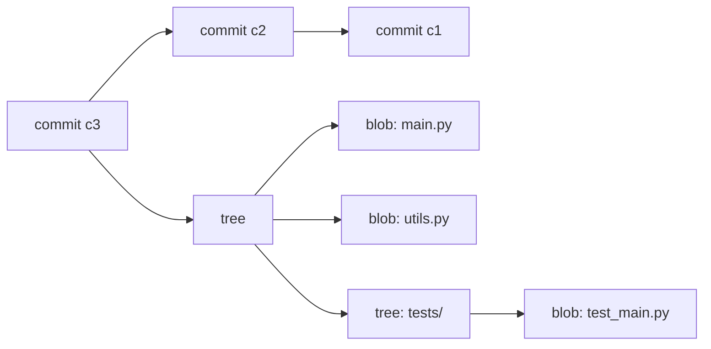

A **branch** is a pointer — a file containing a 40-character SHA-1 hash pointing to a commit. That is all. Creating a branch costs writing 41 bytes to disk. `HEAD` is a symbolic reference that points to the current branch (or directly to a commit in detached HEAD state).

A **ref** is any named pointer to an object: branches (`refs/heads/`), tags (`refs/tags/`), remote-tracking branches (`refs/remotes/`).

### Practice: Inspecting the Object Model

```bash
# Initialize a repo and create a file
mkdir git-internals && cd git-internals
git init
echo "hello world" > greeting.txt
git add greeting.txt

# Inspect the blob that was just created
git cat-file -t $(git hash-object greeting.txt)
# Output: blob

git cat-file -p $(git hash-object greeting.txt)
# Output: hello world

# Create a commit
git commit -m "Initial commit"

# Inspect the commit object
git cat-file -p HEAD
# Output shows: tree <sha>, author, committer, message

# Inspect the tree
git cat-file -p HEAD^{tree}
# Output: 100644 blob <sha>    greeting.txt

# List all objects in the database
find .git/objects -type f | head -20
```

Every object lives in `.git/objects/` as a zlib-compressed file named by its SHA-1 hash. The first two characters become the directory name, the remaining 38 become the filename. Packfiles (`.git/objects/pack/`) compress objects further using delta encoding for storage efficiency, but the logical model remains the same.

### Connection

Understanding the object model is not academic — it is the key to understanding every Git operation. A merge creates a commit with two parents. A rebase replays commits onto a new base, creating new commit objects with new SHA-1 hashes. A branch delete removes a pointer, not the commits (which remain until garbage-collected). When something goes wrong, `git reflog` and `git fsck` make sense only if you understand what objects exist and how they relate.

> **Try It**: Create a repository, make three commits, then use `git cat-file -p` to walk from HEAD through commit to tree to blob. Draw the DAG on paper. Verify that each parent pointer matches the previous commit's SHA-1.

---

### Core Operations

#### Theory

Git operations fall into three categories based on what they affect:

| Scope | Commands | What changes |
|-------|----------|-------------|
| Working tree only | `checkout`, `restore` | Files on disk |
| Index (staging area) | `add`, `reset`, `restore --staged` | What the next commit will contain |
| Repository | `commit`, `merge`, `rebase`, `cherry-pick` | The object database and refs |

The **index** (also called the staging area or cache) is a binary file at `.git/index` that records the tree you are building for the next commit. `git add` copies a blob into the object database and records it in the index. `git commit` writes the index as a tree object, creates a commit pointing to that tree, and advances the current branch pointer.

#### Practice

```bash
# Clone a repository
git clone https://github.com/example/repo.git
cd repo

# Check status — shows working tree vs index vs HEAD
git status

# Stage specific files
git add file1.py file2.py

# Stage parts of a file (patch mode)
git add -p file3.py

# See what is staged (index vs HEAD)
git diff --cached

# See what is modified but not staged (working tree vs index)
git diff

# Commit with a message
git commit -m "Add feature X"

# View commit history
git log --oneline --graph --all

# View a specific commit
git show abc1234

# View who last modified each line
git blame file1.py
```

#### Connection

Every command maps to operations on the three areas: working tree, index, repository. `git status` compares all three. `git diff` compares working tree to index. `git diff --cached` compares index to HEAD. `git diff HEAD` compares working tree to HEAD. Once you understand these three areas, you can predict what any command will do.

---

### Branching and Merging

#### Theory

Branching in Git is cheap because a branch is just a 41-byte file. The real complexity is in **merging** — combining divergent histories.

**Fast-forward merge**: When the target branch has no new commits since the source branched off, Git simply moves the pointer forward. No merge commit is created.

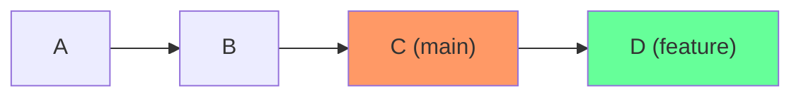

After `git merge feature` from `main`, `main` moves to D. No new commit.

**Three-way merge**: When both branches have diverged, Git finds the **merge base** (common ancestor), computes the diff from the merge base to each branch tip, and combines them. If both sides changed the same region, you get a **conflict**.

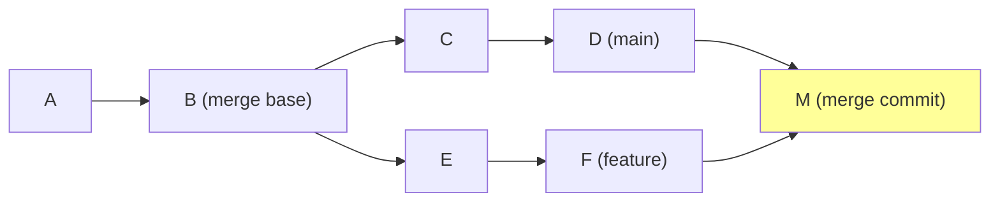

The merge commit M has two parents: D and F.

**Conflict resolution** happens when Git cannot automatically merge changes:

```bash
# Start a merge
git merge feature

# If conflicts arise, Git marks them in the files:
# <<<<<<< HEAD
# your changes
# =======
# their changes
# >>>>>>> feature

# Edit the file to resolve, then:
git add resolved-file.py
git commit
```

#### Practice

```bash
# Create and switch to a new branch
git switch -c feature/login

# Make changes and commit
echo "login code" > login.py
git add login.py
git commit -m "Add login module"

# Switch back to main
git switch main

# Merge with fast-forward (if possible)
git merge feature/login

# Force a merge commit even if fast-forward is possible
git merge --no-ff feature/login

# Delete the merged branch
git branch -d feature/login

# Three-way merge scenario
git switch -c feature/auth
# ... make commits ...
git switch main
# ... make different commits ...
git merge feature/auth
# Resolve any conflicts, then commit
```

#### Connection

The choice between fast-forward and three-way merge affects your history's readability. Fast-forward merges produce a linear history. Three-way merges preserve the fact that work happened in parallel. `--no-ff` forces a merge commit, which is useful for tracking when a feature was integrated even if the history could have been linear.

---

### Rewriting History

#### Theory

Git allows you to rewrite commit history — creating new commit objects that replace old ones. This is powerful and dangerous. The **golden rule**: never rebase commits that have been pushed to a shared branch that others are working on. Rewriting shared history forces everyone else to reconcile their work with the rewritten history.

| Operation | What it does | When to use |
|-----------|-------------|-------------|
| `rebase` | Replays commits onto a new base | Linearize feature branch before merge |
| `interactive rebase` | Edit, reorder, squash, fixup, drop commits | Clean up messy commit history |
| `cherry-pick` | Copy a single commit to current branch | Port a fix from one branch to another |
| `revert` | Create a new commit that undoes a previous one | Undo a commit on a shared branch safely |
| `reset --soft` | Move HEAD, keep index and working tree | Undo commit, keep changes staged |
| `reset --mixed` | Move HEAD, reset index, keep working tree | Undo commit, unstage changes |
| `reset --hard` | Move HEAD, reset index, reset working tree | Discard everything since target commit |

#### Practice

```bash
# Rebase feature onto latest main
git switch feature/auth
git rebase main

# Interactive rebase — edit last 4 commits
git rebase -i HEAD~4
# In the editor:
# pick   abc1234 Add user model
# squash def5678 Fix typo in user model
# fixup  ghi9012 Another small fix
# reword jkl3456 Add auth middleware

# Cherry-pick a specific commit
git switch main
git cherry-pick abc1234

# Revert a commit (safe for shared branches)
git revert abc1234

# Reset variants
git reset --soft HEAD~1   # Undo last commit, keep staged
git reset --mixed HEAD~1  # Undo last commit, unstage changes
git reset --hard HEAD~1   # Undo last commit, discard everything
```

Interactive rebase operations:

| Action | Effect |
|--------|--------|
| `pick` | Keep the commit as-is |
| `reword` | Keep the commit but edit the message |
| `squash` | Meld into previous commit, combine messages |
| `fixup` | Meld into previous commit, discard this message |
| `drop` | Remove the commit entirely |
| `edit` | Pause to amend the commit |

#### Connection

Rewriting history is about communication. A clean commit history tells a story: each commit is a logical, self-contained change. Interactive rebase turns a messy development process into a clean narrative. But once you share commits with others, the narrative is published — rewriting it causes confusion. Use `revert` on shared branches, `rebase` on local branches.

> **Try It**: Create a branch with five messy commits (typo fixes, "WIP" messages). Use interactive rebase to squash them into two clean, well-described commits. Verify with `git log --oneline` that the history reads like a coherent story.

---

### Recovery

#### Theory

Git almost never destroys data. Even when you `reset --hard` or delete a branch, the commit objects still exist in the object database until garbage collection runs (typically after 30 days for unreachable objects, 90 days for reflog entries).

**reflog** records every time HEAD moves — every commit, checkout, rebase, merge, reset. It is your safety net.

**ORIG_HEAD** is set before operations that move HEAD significantly (merge, rebase, reset). It provides one level of undo.

**fsck** checks the integrity of the object database and finds unreachable (dangling) objects.

#### Practice

```bash
# View the reflog
git reflog
# Output: HEAD@{0}: commit: Latest change
#         HEAD@{1}: rebase: checkout main
#         HEAD@{2}: commit: Previous change

# Recover from a bad reset
git reset --hard HEAD~3    # Oops, lost 3 commits
git reflog                 # Find the commit before the reset
git reset --hard HEAD@{1}  # Restore to before the reset

# Recover using ORIG_HEAD after a merge or rebase
git merge feature          # Something went wrong
git reset --hard ORIG_HEAD # Undo the merge

# Find dangling commits
git fsck --unreachable
git fsck --lost-found
# Dangling commits are written to .git/lost-found/

# Recover a deleted branch
git branch -D feature/important  # Accidentally deleted
git reflog                        # Find the tip commit
git branch feature/important abc1234  # Recreate
```

#### Connection

The reflog is why Git is forgiving despite being powerful. Understanding that objects persist beyond branch deletion and that reflog records every HEAD movement gives you confidence to use rebase and reset without fear. The 90-day reflog window is your safety net — but do not rely on it for archival. Push important work to a remote.

---

### Remotes and Collaboration

#### Theory

A **remote** is a named URL pointing to another copy of the repository. `origin` is the conventional name for the primary remote. Remote-tracking branches (`origin/main`, `origin/feature`) are local read-only copies of the remote's branch pointers, updated by `fetch`.

| Operation | What it does |
|-----------|-------------|
| `fetch` | Download new objects and update remote-tracking branches. Does not touch working tree or local branches. |
| `pull` | `fetch` + `merge` (or `fetch` + `rebase` with `--rebase`). |
| `push` | Upload local commits to the remote. |
| `push --force-with-lease` | Force push, but only if remote has not advanced since your last fetch. Safer than `--force`. |

**Forks** are server-side clones, typically used in open-source collaboration. You fork a repository, clone your fork, push to your fork, and open a pull request to the upstream repository.

#### Practice

```bash
# Add a remote
git remote add origin https://github.com/user/repo.git
git remote add upstream https://github.com/org/repo.git

# Fetch from a remote
git fetch origin

# Pull with rebase (preferred to avoid unnecessary merge commits)
git pull --rebase origin main

# Push a branch and set up tracking
git push -u origin feature/login

# Force push safely after a rebase
git push --force-with-lease origin feature/login

# Sync a fork with upstream
git fetch upstream
git rebase upstream/main
git push --force-with-lease origin main

# View tracking relationships
git branch -vv
```

#### Connection

The distinction between `fetch` and `pull` matters. `fetch` is always safe — it only downloads. `pull` modifies your local branch, which can create merge commits or conflicts. Preferring `pull --rebase` keeps history linear. `--force-with-lease` prevents accidentally overwriting someone else's work during force pushes.

---

### Collaboration Workflows

#### Theory

**Pull Requests (PRs)** are not a Git feature — they are a platform feature (GitHub, GitLab, Bitbucket). A PR is a request to merge one branch into another, accompanied by a code review interface.

**Code review** serves multiple purposes: catching bugs, sharing knowledge, maintaining code quality standards, and building team consensus on design decisions.

**Branch protection rules** enforce policies:
- Require pull request reviews before merging
- Require status checks (CI) to pass
- Require linear history (no merge commits)
- Restrict who can push to protected branches

**CODEOWNERS** is a file (`.github/CODEOWNERS` or root) that automatically assigns reviewers based on file paths:

```
# .github/CODEOWNERS
*.py           @backend-team
*.js           @frontend-team
/infrastructure/ @platform-team
/docs/         @tech-writers
```

#### Branching Strategies

| Strategy | Branch Model | Merge Style | Best For |
|----------|-------------|-------------|----------|
| **GitHub Flow** | `main` + short-lived feature branches | Merge PR to `main`, deploy from `main` | Continuous deployment, small teams |
| **Git Flow** | `main` + `develop` + feature + release + hotfix branches | Merge through stages | Versioned releases, larger teams |
| **Trunk-based** | `main` only, very short-lived branches (hours) | Merge to `main` frequently, feature flags for incomplete work | High-velocity teams, CI/CD maturity |

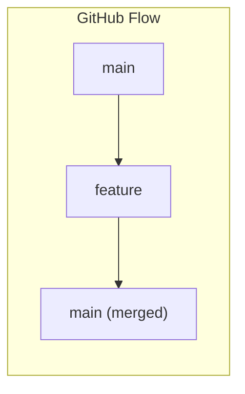

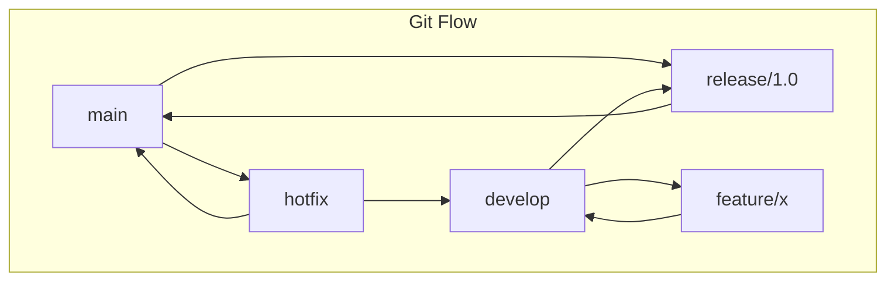

#### Practice

```bash
# GitHub Flow workflow
git switch -c feature/user-profile
# ... make changes, commit ...
git push -u origin feature/user-profile
# Open PR on GitHub, request review
# After approval and CI passes, merge via GitHub UI
# Delete the remote branch after merge

# Create a CODEOWNERS file
mkdir -p .github
cat > .github/CODEOWNERS << 'EOF'
*.py           @backend-team
*.ts           @frontend-team
/terraform/    @platform-team
EOF
git add .github/CODEOWNERS
git commit -m "Add CODEOWNERS for automatic review assignment"
```

#### Connection

Branching strategies are not about Git — they are about team coordination. GitHub Flow works when you can deploy any commit on `main`. Git Flow works when you need discrete releases. Trunk-based development works when you have mature CI/CD and feature flags. The choice depends on your deployment capability and team size, not on Git itself.

> **Try It**: Create a repository on GitHub. Create a branch, make a change, push it, and open a pull request. Add branch protection rules requiring at least one review. Experience the full collaboration workflow.

---

### Advanced Git

#### Theory and Practice

**.gitignore** tells Git which files to not track. Patterns use glob syntax:

```gitignore
# .gitignore
*.pyc
__pycache__/
.env
node_modules/
*.log
dist/
.DS_Store
```

**Stash** saves uncommitted changes for later:

```bash
git stash                    # Stash working tree and index changes
git stash -u                 # Include untracked files
git stash list               # List stashes
git stash pop                # Apply and remove most recent stash
git stash apply stash@{2}    # Apply a specific stash without removing it
git stash drop stash@{0}     # Remove a specific stash
```

**Bisect** performs binary search to find which commit introduced a bug:

```bash
git bisect start
git bisect bad                 # Current commit is broken
git bisect good abc1234        # This older commit was working
# Git checks out a midpoint commit — test it
git bisect good                # or git bisect bad
# Repeat until Git identifies the first bad commit
git bisect reset               # Return to original HEAD
```

Bisect can be automated:

```bash
git bisect start HEAD abc1234
git bisect run python -m pytest tests/test_login.py
```

**Blame** shows who last modified each line:

```bash
git blame main.py
git blame -L 10,20 main.py    # Lines 10-20 only
git blame -w main.py           # Ignore whitespace changes
```

**Hooks** are scripts that run at specific points in the Git workflow:

```bash
# .git/hooks/pre-commit (local, not shared)
#!/bin/sh
python -m ruff check .
if [ $? -ne 0 ]; then
    echo "Linting failed. Fix errors before committing."
    exit 1
fi
```

The **pre-commit framework** manages hooks as a shared, versioned configuration:

```yaml
# .pre-commit-config.yaml
repos:
  - repo: https://github.com/astral-sh/ruff-pre-commit
    rev: v0.4.4
    hooks:
      - id: ruff
        args: [--fix]
      - id: ruff-format
  - repo: https://github.com/pre-commit/pre-commit-hooks
    rev: v4.6.0
    hooks:
      - id: trailing-whitespace
      - id: end-of-file-fixer
      - id: check-yaml
```

```bash
pip install pre-commit
pre-commit install
pre-commit run --all-files
```

**Worktree** lets you check out multiple branches simultaneously in separate directories:

```bash
git worktree add ../hotfix hotfix/critical-bug
# Work in ../hotfix without switching branches in your main checkout
git worktree remove ../hotfix
```

**Submodule** embeds one repository inside another:

```bash
git submodule add https://github.com/org/shared-lib.git lib/shared
git submodule update --init --recursive
```

**Signing commits** with GPG proves authorship:

```bash
git config --global user.signingkey YOUR_KEY_ID
git config --global commit.gpgsign true
git commit -S -m "Signed commit"
git log --show-signature
```

**Git LFS** (Large File Storage) tracks large files by storing pointers in Git and the actual content on a separate server:

```bash
git lfs install
git lfs track "*.psd"
git lfs track "*.zip"
git add .gitattributes
git add large-file.psd
git commit -m "Add design assets via LFS"
```

#### Connection

These advanced features solve real problems. Bisect automates debugging when you know a regression exists but not which commit caused it. Hooks enforce standards without relying on developer discipline. LFS keeps repositories fast when binary assets are unavoidable. Worktrees eliminate the constant context-switching of stash-checkout-stash workflows.

> **Try It**: Install the pre-commit framework in a project. Configure it with at least three hooks (linting, trailing whitespace, YAML validation). Make a commit that violates one rule and observe the hook blocking the commit.

---

## B. Software Design

### Theory: Modularity, Coupling, and Cohesion

Software design is about managing complexity. Two forces are in tension:

**Coupling** measures how much one module depends on another. High coupling means changes propagate — modifying module A forces changes in module B. Low coupling means modules can change independently.

**Cohesion** measures how related the responsibilities within a module are. High cohesion means a module does one thing well. Low cohesion means a module is a grab bag of unrelated functions.

The goal: **high cohesion, low coupling**. Each module has a clear, focused purpose and interacts with other modules through narrow, well-defined interfaces.

### SOLID Principles Revisited

You encountered SOLID in [Programming Fundamentals](/learn/first-principles/programming-fundamentals/). Here they are in the context of design:

| Principle | Statement | Design Implication |
|-----------|-----------|--------------------|
| **S** - Single Responsibility | A class should have one reason to change | High cohesion: each class owns one concern |
| **O** - Open/Closed | Open for extension, closed for modification | Add behavior via new code, not changing existing code |
| **L** - Liskov Substitution | Subtypes must be substitutable for their base types | Inheritance contracts must hold |
| **I** - Interface Segregation | No client should depend on methods it does not use | Narrow interfaces reduce coupling |
| **D** - Dependency Inversion | Depend on abstractions, not concretions | High-level modules do not import low-level modules directly |

### Design Patterns (GoF)

Design patterns are named solutions to recurring problems. They are not code templates — they are communication tools. When you say "we used a Strategy pattern here," every experienced developer knows what you mean.

**Important context**: Do not apply patterns preemptively. Patterns solve problems you have already felt. If you have not felt the pain a pattern addresses, you do not need the pattern yet.

#### Creational Patterns

Creational patterns abstract the instantiation process.

**Factory Method** — Define an interface for creating objects, but let subclasses decide which class to instantiate.

```python
from abc import ABC, abstractmethod

class Notification(ABC):
    @abstractmethod
    def send(self, message: str) -> None: ...

class EmailNotification(Notification):
    def send(self, message: str) -> None:
        print(f"Email: {message}")

class SMSNotification(Notification):
    def send(self, message: str) -> None:
        print(f"SMS: {message}")

class NotificationFactory:
    @staticmethod
    def create(channel: str) -> Notification:
        if channel == "email":
            return EmailNotification()
        elif channel == "sms":
            return SMSNotification()
        raise ValueError(f"Unknown channel: {channel}")

# Usage
notifier = NotificationFactory.create("email")
notifier.send("Hello")
```

**Abstract Factory** — Provide an interface for creating families of related objects.

```python
class UIFactory(ABC):
    @abstractmethod
    def create_button(self) -> "Button": ...
    @abstractmethod
    def create_checkbox(self) -> "Checkbox": ...

class DarkThemeFactory(UIFactory):
    def create_button(self) -> "Button":
        return DarkButton()
    def create_checkbox(self) -> "Checkbox":
        return DarkCheckbox()

class LightThemeFactory(UIFactory):
    def create_button(self) -> "Button":
        return LightButton()
    def create_checkbox(self) -> "Checkbox":
        return LightCheckbox()
```

**Builder** — Separate the construction of a complex object from its representation.

```python
class QueryBuilder:
    def __init__(self):
        self._table = ""
        self._conditions = []
        self._order = ""
        self._limit = None

    def table(self, name: str) -> "QueryBuilder":
        self._table = name
        return self

    def where(self, condition: str) -> "QueryBuilder":
        self._conditions.append(condition)
        return self

    def order_by(self, field: str) -> "QueryBuilder":
        self._order = field
        return self

    def limit(self, n: int) -> "QueryBuilder":
        self._limit = n
        return self

    def build(self) -> str:
        query = f"SELECT * FROM {self._table}"
        if self._conditions:
            query += " WHERE " + " AND ".join(self._conditions)
        if self._order:
            query += f" ORDER BY {self._order}"
        if self._limit:
            query += f" LIMIT {self._limit}"
        return query

# Usage — reads like a specification
query = (QueryBuilder()
    .table("users")
    .where("age > 18")
    .where("active = true")
    .order_by("name")
    .limit(10)
    .build())
```

**Singleton** — Ensure a class has only one instance. Use sparingly — singletons introduce global state, which makes testing harder.

```python
class DatabaseConnection:
    _instance = None

    def __new__(cls):
        if cls._instance is None:
            cls._instance = super().__new__(cls)
            cls._instance._connection = cls._connect()
        return cls._instance

    @staticmethod
    def _connect():
        return "connection_object"
```

**Prototype** — Create new objects by cloning an existing instance.

```python
import copy

class ServerConfig:
    def __init__(self, cpu: int, memory: int, disk: int, region: str):
        self.cpu = cpu
        self.memory = memory
        self.disk = disk
        self.region = region

    def clone(self) -> "ServerConfig":
        return copy.deepcopy(self)

# Base template
standard = ServerConfig(cpu=2, memory=4, disk=50, region="us-east-1")

# Clone and customize
high_memory = standard.clone()
high_memory.memory = 32
```

#### Structural Patterns

Structural patterns deal with composition of classes and objects.

**Adapter** — Convert the interface of a class into another interface clients expect.

```python
class LegacyPaymentSystem:
    def process_payment_legacy(self, amount_cents: int) -> bool:
        print(f"Legacy: processing {amount_cents} cents")
        return True

class PaymentProcessor(ABC):
    @abstractmethod
    def pay(self, amount_dollars: float) -> bool: ...

class LegacyPaymentAdapter(PaymentProcessor):
    def __init__(self, legacy: LegacyPaymentSystem):
        self._legacy = legacy

    def pay(self, amount_dollars: float) -> bool:
        cents = int(amount_dollars * 100)
        return self._legacy.process_payment_legacy(cents)
```

**Decorator** — Attach additional responsibilities to an object dynamically.

```python
class DataSource(ABC):
    @abstractmethod
    def write(self, data: str) -> None: ...
    @abstractmethod
    def read(self) -> str: ...

class FileDataSource(DataSource):
    def __init__(self, filename: str):
        self._filename = filename

    def write(self, data: str) -> None:
        with open(self._filename, "w") as f:
            f.write(data)

    def read(self) -> str:
        with open(self._filename) as f:
            return f.read()

class EncryptionDecorator(DataSource):
    def __init__(self, source: DataSource):
        self._source = source

    def write(self, data: str) -> None:
        encrypted = self._encrypt(data)
        self._source.write(encrypted)

    def read(self) -> str:
        return self._decrypt(self._source.read())

    def _encrypt(self, data: str) -> str:
        return data[::-1]  # Simplified

    def _decrypt(self, data: str) -> str:
        return data[::-1]

# Usage — compose behaviors
source = EncryptionDecorator(FileDataSource("data.txt"))
source.write("sensitive data")
```

**Facade** — Provide a simplified interface to a complex subsystem.

```python
class Facade:
    """Simplified interface to video conversion subsystem."""
    def convert(self, filename: str, format: str) -> str:
        file = VideoFile(filename)
        codec = CodecFactory.extract(file)
        if format == "mp4":
            result = MPEG4Compressor().compress(codec)
        elif format == "avi":
            result = AVICompressor().compress(codec)
        return result.save()
```

**Proxy** — Provide a surrogate or placeholder for another object to control access to it.

```python
class DatabaseProxy:
    """Lazy-loading proxy — only connects when first query is made."""
    def __init__(self, connection_string: str):
        self._connection_string = connection_string
        self._real_db = None

    def _ensure_connected(self):
        if self._real_db is None:
            self._real_db = Database(self._connection_string)

    def query(self, sql: str):
        self._ensure_connected()
        return self._real_db.query(sql)
```

**Bridge** — Separate an abstraction from its implementation so the two can vary independently.

**Composite** — Compose objects into tree structures to represent part-whole hierarchies.

```python
class FileSystemItem(ABC):
    @abstractmethod
    def size(self) -> int: ...

class File(FileSystemItem):
    def __init__(self, name: str, size: int):
        self._name = name
        self._size = size

    def size(self) -> int:
        return self._size

class Directory(FileSystemItem):
    def __init__(self, name: str):
        self._name = name
        self._children: list[FileSystemItem] = []

    def add(self, item: FileSystemItem) -> None:
        self._children.append(item)

    def size(self) -> int:
        return sum(child.size() for child in self._children)
```

#### Behavioral Patterns

Behavioral patterns deal with communication between objects.

**Observer** — Define a one-to-many dependency so that when one object changes state, all its dependents are notified.

```python
class EventBus:
    def __init__(self):
        self._subscribers: dict[str, list[callable]] = {}

    def subscribe(self, event: str, callback: callable) -> None:
        self._subscribers.setdefault(event, []).append(callback)

    def publish(self, event: str, data: any = None) -> None:
        for callback in self._subscribers.get(event, []):
            callback(data)

# Usage
bus = EventBus()
bus.subscribe("user_created", lambda user: print(f"Welcome {user}"))
bus.subscribe("user_created", lambda user: send_email(user))
bus.publish("user_created", "alice")
```

**Strategy** — Define a family of algorithms, encapsulate each one, and make them interchangeable.

```python
class CompressionStrategy(ABC):
    @abstractmethod
    def compress(self, data: bytes) -> bytes: ...

class GzipStrategy(CompressionStrategy):
    def compress(self, data: bytes) -> bytes:
        import gzip
        return gzip.compress(data)

class LZ4Strategy(CompressionStrategy):
    def compress(self, data: bytes) -> bytes:
        import lz4.frame
        return lz4.frame.compress(data)

class FileProcessor:
    def __init__(self, strategy: CompressionStrategy):
        self._strategy = strategy

    def process(self, data: bytes) -> bytes:
        return self._strategy.compress(data)

# Swap algorithm at runtime
processor = FileProcessor(GzipStrategy())
processor = FileProcessor(LZ4Strategy())
```

**Command** — Encapsulate a request as an object, allowing parameterization, queuing, and undo.

```python
class Command(ABC):
    @abstractmethod
    def execute(self) -> None: ...
    @abstractmethod
    def undo(self) -> None: ...

class InsertTextCommand(Command):
    def __init__(self, document: list, position: int, text: str):
        self._doc = document
        self._pos = position
        self._text = text

    def execute(self) -> None:
        self._doc.insert(self._pos, self._text)

    def undo(self) -> None:
        self._doc.pop(self._pos)

class CommandHistory:
    def __init__(self):
        self._history: list[Command] = []

    def execute(self, cmd: Command) -> None:
        cmd.execute()
        self._history.append(cmd)

    def undo(self) -> None:
        if self._history:
            self._history.pop().undo()
```

**Template Method** — Define the skeleton of an algorithm in a base class, letting subclasses override specific steps.

```python
class DataPipeline(ABC):
    def run(self):
        data = self.extract()
        transformed = self.transform(data)
        self.load(transformed)

    @abstractmethod
    def extract(self): ...
    @abstractmethod
    def transform(self, data): ...
    @abstractmethod
    def load(self, data): ...

class CSVToDatabase(DataPipeline):
    def extract(self):
        return read_csv("data.csv")
    def transform(self, data):
        return clean_and_validate(data)
    def load(self, data):
        insert_into_db(data)
```

**Iterator** — Provide a way to access elements of a collection sequentially without exposing its underlying representation. Python's `__iter__` and `__next__` protocol implements this natively.

**State** — Allow an object to alter its behavior when its internal state changes.

```python
class OrderState(ABC):
    @abstractmethod
    def next(self, order: "Order") -> None: ...
    @abstractmethod
    def cancel(self, order: "Order") -> None: ...

class PendingState(OrderState):
    def next(self, order):
        order.state = ProcessingState()
    def cancel(self, order):
        order.state = CancelledState()

class ProcessingState(OrderState):
    def next(self, order):
        order.state = ShippedState()
    def cancel(self, order):
        raise Exception("Cannot cancel order in processing")

class Order:
    def __init__(self):
        self.state: OrderState = PendingState()

    def next(self):
        self.state.next(self)

    def cancel(self):
        self.state.cancel(self)
```

### Connection

Design patterns exist because certain problems recur across all software. The Observer pattern appears in every event system, from DOM events to message queues to Kubernetes controllers watching for resource changes. The Strategy pattern appears whenever you need to swap algorithms — compression methods, routing strategies, authentication providers. Recognizing these patterns in existing code is more valuable than memorizing their UML diagrams.

> **Try It**: Identify three design patterns in a codebase you use daily (a web framework, a CLI tool, a library). For each, name the pattern and explain what problem it solves in that context.

---

## C. Architecture

### Theory: Architectural Patterns

Architecture is design at the system level. Where design patterns organize code within a module, architectural patterns organize modules within a system.

#### MVC / MVP / MVVM

| Pattern | Components | Data Flow | Common In |
|---------|-----------|-----------|-----------|
| **MVC** | Model, View, Controller | User -> Controller -> Model -> View | Server-side web (Django, Rails) |
| **MVP** | Model, View, Presenter | User -> View -> Presenter -> Model -> View | Desktop apps, Android |
| **MVVM** | Model, View, ViewModel | View <-> ViewModel -> Model | Frontend frameworks (Vue, Angular, WPF) |

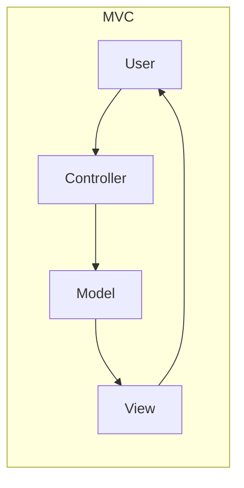

#### Layered Architecture

The most common server-side pattern. Each layer only depends on the layer directly below it:

```
┌─────────────────────┐
│  Presentation Layer  │  API controllers, UI
├─────────────────────┤
│   Business Layer     │  Domain logic, validation
├─────────────────────┤
│   Persistence Layer  │  Database access, ORM
├─────────────────────┤
│   Database Layer     │  SQL, storage
└─────────────────────┘
```

Advantage: Separation of concerns. Disadvantage: Rigid structure, all requests must traverse all layers.

#### Clean / Hexagonal Architecture

Also called "Ports and Adapters." The core idea: **business logic has zero dependencies on infrastructure**. The domain does not know about the database, the HTTP framework, or the message queue. Instead, the domain defines interfaces (ports), and infrastructure provides implementations (adapters).

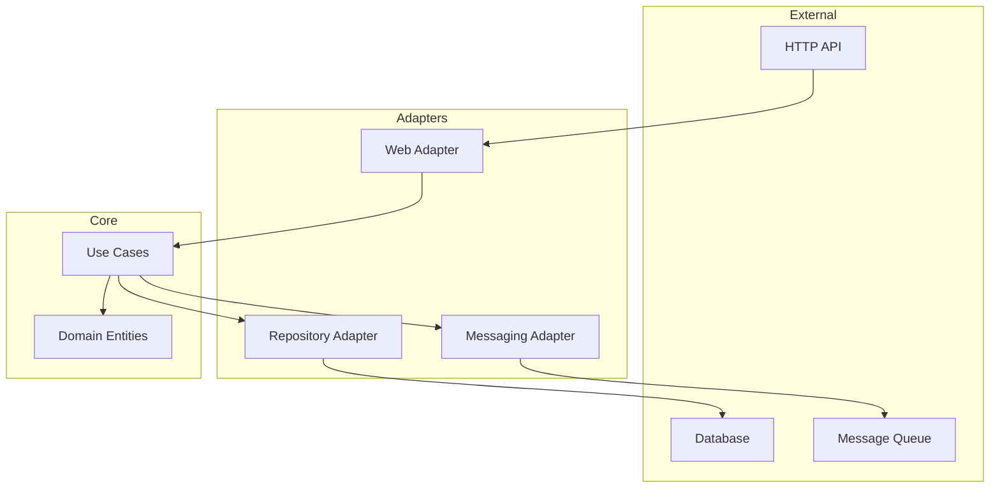

The dependency rule: **source code dependencies always point inward.** Outer layers depend on inner layers. Inner layers know nothing about outer layers.

#### Microservices vs Monolith

| Dimension | Monolith | Microservices |
|-----------|----------|---------------|
| Deployment | Single unit | Independent services |
| Scaling | Scale everything together | Scale services independently |
| Data | Shared database | Database per service |
| Complexity | In the codebase | In the infrastructure |
| Team | Single team or shared codebase | Service-owning teams |
| Latency | In-process calls | Network calls |
| Transactions | ACID | Eventual consistency, sagas |
| Debugging | Single process | Distributed tracing |

Microservices are not inherently better. They trade code complexity for operational complexity. A monolith that is well-structured (clean architecture internally) is vastly preferable to a distributed monolith — microservices that are tightly coupled and must be deployed together.

**Service boundaries** should align with business capabilities, not technical layers. A "user service" and an "order service" make sense. A "database service" and a "validation service" do not.

**Communication patterns:**

| Pattern | Protocol | When to Use |
|---------|----------|-------------|
| Synchronous request-response | HTTP/gRPC | Real-time queries, simple workflows |
| Asynchronous messaging | Message queues (RabbitMQ, SQS) | Decoupled workflows, eventual consistency |
| Event streaming | Kafka, Kinesis | High-throughput event processing, event sourcing |

#### Event-Driven Architecture

Systems communicate through events rather than direct calls. A service publishes an event ("OrderPlaced"), and other services react independently ("InventoryService reserves stock," "NotificationService sends confirmation"). The publisher does not know who consumes its events.

Benefits: loose coupling, independent scaling, temporal decoupling (consumer can process events later). Costs: eventual consistency, harder debugging, event ordering challenges.

### Practice: Build Systems

Build systems automate the transformation of source code into deployable artifacts.

| Tool | Language/Ecosystem | Key Concept |
|------|-------------------|-------------|
| **Make** | C/C++, general | Rules with targets, prerequisites, and recipes |
| **Gradle** | Java/Kotlin | Task-based, dependency resolution, plugins |
| **Webpack** | JavaScript | Module bundling, loaders, plugins |
| **Vite** | JavaScript/TypeScript | ES modules, dev server with HMR, Rollup for production |

```makefile
# Makefile
.PHONY: build test lint clean

build:
	docker build -t myapp:latest .

test:
	python -m pytest tests/ -v

lint:
	ruff check src/
	ruff format --check src/

clean:
	rm -rf dist/ __pycache__/ .pytest_cache/

all: lint test build
```

### Connection

Architecture decisions are the hardest to reverse. Choosing between a monolith and microservices, between synchronous and asynchronous communication, between a layered and hexagonal architecture — these decisions constrain everything built on top of them. Make these decisions based on your actual constraints (team size, deployment frequency, scaling requirements), not on what is popular.

> **Try It**: Draw the architecture of a system you use (a web application, a mobile app backend). Identify which architectural pattern it follows. Draw the data flow for a single user action from input to response.

---

## D. Code Quality

### Theory

Code quality is not subjective. It is measurable through specific signals.

**Code smells** are surface indicators of deeper design problems:

| Smell | Symptom | Refactoring |
|-------|---------|-------------|
| Long Method | Function exceeds ~20 lines | Extract Method |
| Large Class | Class has too many responsibilities | Extract Class |
| Primitive Obsession | Using strings/ints where domain types belong | Replace with Value Object |
| Feature Envy | Method uses another class's data more than its own | Move Method |
| Shotgun Surgery | One change requires edits in many classes | Move Method, Inline Class |
| Divergent Change | One class is changed for many different reasons | Extract Class |
| Duplicate Code | Same logic in multiple places | Extract Method, Pull Up Method |
| Long Parameter List | Method takes many parameters | Introduce Parameter Object |

**Static analysis** catches issues without running the code:

| Tool | Language | What It Checks |
|------|----------|---------------|
| `ruff` | Python | Linting + formatting (replaces flake8, isort, black) |
| `mypy` | Python | Type checking |
| `eslint` | JavaScript/TypeScript | Linting, code style |
| `shellcheck` | Bash | Shell script bugs and portability |
| `hadolint` | Dockerfile | Dockerfile best practices |

**Technical debt** is the accumulated cost of past shortcuts. It is not inherently bad — sometimes shipping fast is the right decision. But unmanaged technical debt compounds: each shortcut makes the next change harder. Track it explicitly (issues, comments, ADRs) rather than letting it accumulate silently.

### Practice

**Documentation:**

**API documentation** should be generated from code annotations:

```python
def create_user(name: str, email: str, role: str = "viewer") -> dict:
    """Create a new user account.

    Args:
        name: Full name of the user.
        email: Email address. Must be unique.
        role: User role. One of "viewer", "editor", "admin".
            Defaults to "viewer".

    Returns:
        Dict containing the created user's id, name, email, and role.

    Raises:
        ValueError: If email is already registered.
        PermissionError: If caller lacks admin privileges.
    """
```

**Architecture Decision Records (ADRs)** document why decisions were made:

```markdown
# ADR-003: Use PostgreSQL for primary data store

## Status
Accepted

## Context
We need a primary database for user data, orders, and inventory.
Options considered: PostgreSQL, MySQL, MongoDB.

## Decision
PostgreSQL. Reasons: ACID transactions required for financial data,
JSONB columns for flexible metadata, mature ecosystem.

## Consequences
- Team needs PostgreSQL operational expertise
- Backup strategy must handle WAL archiving
- Connection pooling required at scale (PgBouncer)
```

### Connection

Code quality tools are not optional overhead. Linters catch bugs before they reach production. Type checkers prevent entire categories of runtime errors. ADRs prevent teams from revisiting the same decisions repeatedly. The cost of these practices is paid once; the cost of not having them compounds indefinitely.

> **Try It**: Run `ruff check` on a Python project. Run `shellcheck` on a shell script. Fix every issue. Notice how many potential bugs the tools caught that you would have missed in a manual review.

---

## E. Testing Strategy

### Theory: The Testing Pyramid

The testing pyramid describes the optimal distribution of test types:

```
        /\
       /  \        E2E Tests (few, slow, expensive)
      /----\
     /      \      Integration Tests (moderate)
    /--------\
   /          \    Unit Tests (many, fast, cheap)
  /____________\
```

| Level | Scope | Speed | What It Tests |
|-------|-------|-------|---------------|
| **Unit** | Single function or class | Milliseconds | Logic correctness in isolation |
| **Integration** | Multiple components together | Seconds | Component interactions, API contracts |
| **E2E** | Full system from user perspective | Minutes | Complete user workflows |

More unit tests, fewer E2E tests. Unit tests are fast, reliable, and pinpoint failures. E2E tests are slow, flaky, and tell you something is broken without telling you where.

### Practice: TDD — Red / Green / Refactor

Test-Driven Development follows a strict cycle:

1. **Red**: Write a failing test for the next piece of behavior.
2. **Green**: Write the minimum code to make the test pass.
3. **Refactor**: Improve the code while keeping tests green.

```python
# Step 1: RED — write a failing test
def test_calculate_discount():
    assert calculate_discount(100, 0.1) == 90.0

# Step 2: GREEN — minimum code to pass
def calculate_discount(price: float, rate: float) -> float:
    return price * (1 - rate)

# Step 3: REFACTOR — improve (maybe add validation)
def calculate_discount(price: float, rate: float) -> float:
    if not 0 <= rate <= 1:
        raise ValueError(f"Rate must be between 0 and 1, got {rate}")
    if price < 0:
        raise ValueError(f"Price must be non-negative, got {price}")
    return round(price * (1 - rate), 2)
```

### BDD — Given / When / Then

Behavior-Driven Development describes tests in business language:

```python
def test_user_login():
    # Given a registered user
    user = create_user("alice", "password123")

    # When they log in with correct credentials
    result = login("alice", "password123")

    # Then they receive a valid session token
    assert result.token is not None
    assert result.token_expiry > datetime.now()
```

### Test Doubles

| Double | Purpose | Example |
|--------|---------|---------|
| **Mock** | Verify interactions (was this method called?) | `mock.assert_called_once_with("arg")` |
| **Stub** | Provide canned answers | Return a fixed response for any input |
| **Fake** | Working implementation with shortcuts | In-memory database instead of PostgreSQL |
| **Spy** | Record calls for later assertion | Like a stub that also tracks call history |

```python
from unittest.mock import Mock, patch

# Mock — verify interaction
def test_notification_sent():
    notifier = Mock()
    create_order(notifier=notifier)
    notifier.send.assert_called_once_with("Order confirmed")

# Stub with patch
@patch("myapp.services.get_exchange_rate", return_value=1.1)
def test_currency_conversion(mock_rate):
    result = convert(100, "USD", "EUR")
    assert result == 110.0
```

### Coverage

| Type | Measures | Completeness |
|------|----------|-------------|
| **Statement** | Which lines executed | Lowest bar |
| **Branch** | Which conditional paths taken | Catches untested `else` blocks |
| **Path** | Which combinations of branches | Highest bar, often impractical at 100% |

```bash
# Python coverage
python -m pytest --cov=src --cov-report=term-missing tests/
# The --cov-report=term-missing flag shows which lines are uncovered
```

80% coverage is a reasonable target for most projects. 100% statement coverage does not mean your code is correct — it means every line ran at least once. Branch coverage is more meaningful.

### Advanced Testing

**Property-based testing** generates random inputs to find edge cases:

```python
from hypothesis import given, strategies as st

@given(st.lists(st.integers()))
def test_sort_is_idempotent(xs):
    assert sorted(sorted(xs)) == sorted(xs)

@given(st.lists(st.integers(), min_size=1))
def test_sort_preserves_length(xs):
    assert len(sorted(xs)) == len(xs)
```

**Load testing** verifies performance under expected (and peak) traffic:

```bash
# Using k6
k6 run --vus 100 --duration 30s load-test.js
```

**Chaos engineering** intentionally injects failures to test system resilience. Netflix's Chaos Monkey randomly terminates production instances to ensure the system recovers automatically. You do not start with chaos engineering — you start with unit tests and work up.

### Connection

Testing strategy is about risk management. Unit tests catch logic errors cheaply. Integration tests catch interface mismatches. E2E tests catch workflow breakdowns. Property-based tests find edge cases you did not think of. The pyramid shape reflects the economic tradeoff: invest most heavily in the cheapest, fastest tests.

> **Try It**: Write a function using TDD. Write the test first, watch it fail, write the implementation, watch it pass, then refactor. Repeat for three features. Notice how the tests drive the design toward simpler, more testable code.

---

## F. CI/CD

### Theory: Continuous Integration, Delivery, and Deployment

Three related but distinct practices:

| Practice | Meaning | Trigger |
|----------|---------|---------|
| **Continuous Integration (CI)** | Merge code to main frequently; every merge triggers automated build + test | Every push/PR |
| **Continuous Delivery (CD)** | Code is always in a deployable state; deployment is a manual decision | After CI passes |
| **Continuous Deployment (CD)** | Every change that passes CI is deployed to production automatically | After CI passes |

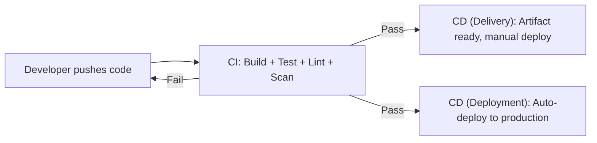

The **feedback loop** is the core metric. The time from push to knowing whether your change is good determines developer velocity. A 5-minute pipeline is a competitive advantage. A 45-minute pipeline is a tax on every change.

### Practice: GitHub Actions

GitHub Actions is the primary CI/CD platform for this path. Workflows are defined in YAML files under `.github/workflows/`.

#### Workflow Structure

```yaml
# .github/workflows/ci.yml
name: CI

on:
  push:
    branches: [main]
  pull_request:
    branches: [main]
  schedule:
    - cron: '0 6 * * 1'          # Every Monday at 6 AM
  workflow_dispatch:               # Manual trigger

permissions:
  contents: read

jobs:
  lint:
    runs-on: ubuntu-latest
    steps:
      - uses: actions/checkout@v4

      - name: Set up Python
        uses: actions/setup-python@v5
        with:
          python-version: '3.12'

      - name: Install dependencies
        run: pip install ruff

      - name: Run linter
        run: ruff check src/

  test:
    runs-on: ubuntu-latest
    needs: lint
    strategy:
      matrix:
        python-version: ['3.11', '3.12', '3.13']
    steps:
      - uses: actions/checkout@v4

      - name: Set up Python ${{ matrix.python-version }}
        uses: actions/setup-python@v5
        with:
          python-version: ${{ matrix.python-version }}

      - name: Cache pip packages
        uses: actions/cache@v4
        with:
          path: ~/.cache/pip
          key: ${{ runner.os }}-pip-${{ hashFiles('**/requirements*.txt') }}
          restore-keys: |
            ${{ runner.os }}-pip-

      - name: Install dependencies
        run: pip install -r requirements.txt -r requirements-dev.txt

      - name: Run tests
        run: python -m pytest tests/ -v --cov=src --cov-report=xml

      - name: Upload coverage
        uses: actions/upload-artifact@v4
        with:
          name: coverage-${{ matrix.python-version }}
          path: coverage.xml

  build:
    runs-on: ubuntu-latest
    needs: test
    steps:
      - uses: actions/checkout@v4

      - name: Build container image
        run: docker build -t myapp:${{ github.sha }} .

      - name: Tag with semver (on release)
        if: startsWith(github.ref, 'refs/tags/v')
        run: |
          VERSION=${GITHUB_REF#refs/tags/}
          docker tag myapp:${{ github.sha }} myapp:${VERSION}
```

#### Key Concepts

**Triggers** control when workflows run:

| Trigger | When it fires |
|---------|--------------|
| `push` | Code pushed to matching branches |
| `pull_request` | PR opened, synchronized, or reopened |
| `schedule` | Cron schedule |
| `workflow_dispatch` | Manual trigger from GitHub UI |
| `workflow_call` | Called by another workflow (reusable) |

**Jobs** run in parallel by default. Use `needs` to create dependencies. Each job runs on a fresh runner (VM).

**Matrix strategy** runs the same job with different configurations:

```yaml
strategy:
  matrix:
    os: [ubuntu-latest, macos-latest]
    node-version: [18, 20, 22]
  fail-fast: false  # Continue other matrix jobs if one fails
```

**Caching** speeds up repeated installations:

```yaml
- uses: actions/cache@v4
  with:
    path: node_modules
    key: ${{ runner.os }}-node-${{ hashFiles('package-lock.json') }}
```

**Artifacts** persist files between jobs and after workflow completion:

```yaml
- uses: actions/upload-artifact@v4
  with:
    name: build-output
    path: dist/
    retention-days: 7
```

**Secrets and environments** protect sensitive values:

```yaml
jobs:
  deploy:
    runs-on: ubuntu-latest
    environment:
      name: production
      url: https://myapp.example.com
    steps:
      - name: Deploy
        run: ./deploy.sh
        env:
          API_KEY: ${{ secrets.PRODUCTION_API_KEY }}
```

Environments support **protection rules**: required reviewers, wait timers, branch restrictions.

**Reusable workflows** eliminate duplication:

```yaml
# .github/workflows/reusable-test.yml
on:
  workflow_call:
    inputs:
      python-version:
        required: true
        type: string

jobs:
  test:
    runs-on: ubuntu-latest
    steps:
      - uses: actions/checkout@v4
      - uses: actions/setup-python@v5
        with:
          python-version: ${{ inputs.python-version }}
      - run: python -m pytest tests/
```

```yaml
# .github/workflows/ci.yml
jobs:
  test-3-12:
    uses: ./.github/workflows/reusable-test.yml
    with:
      python-version: '3.12'
```

**Composite actions** package multiple steps into a single reusable action:

```yaml
# .github/actions/setup-python-env/action.yml
name: Setup Python Environment
description: Install Python and project dependencies
inputs:
  python-version:
    required: true
    default: '3.12'
runs:
  using: composite
  steps:
    - uses: actions/setup-python@v5
      with:
        python-version: ${{ inputs.python-version }}
    - run: pip install -r requirements.txt
      shell: bash
```

**Concurrency groups** prevent duplicate runs:

```yaml
concurrency:
  group: ${{ github.workflow }}-${{ github.ref }}
  cancel-in-progress: true  # Cancel older runs when new push arrives
```

### Pipeline Design

A production-grade pipeline progresses through stages:

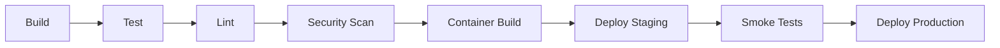

#### Quality Gates

Each stage acts as a gate. If it fails, the pipeline stops.

| Gate | Tool | What It Catches |
|------|------|----------------|
| Python lint | `ruff` | Style violations, import ordering, dead code |
| JS/TS lint | `eslint` | Code quality, framework-specific issues |
| Shell lint | `shellcheck` | Shell script bugs, quoting issues |
| Dockerfile lint | `hadolint` | Insecure or inefficient Dockerfile practices |
| SAST (Static Application Security Testing) | `semgrep` | Vulnerable code patterns (SQL injection, XSS) |
| SCA (Software Composition Analysis) | `trivy` | Vulnerable dependencies |
| Secret scanning | `gitleaks` | Accidentally committed secrets |
| IaC scanning | `checkov` | Misconfigured infrastructure code |
| Coverage | `pytest-cov` | Insufficient test coverage |

```yaml
# Security scanning job
security:
  runs-on: ubuntu-latest
  steps:
    - uses: actions/checkout@v4

    - name: Run Semgrep SAST
      uses: semgrep/semgrep-action@v1
      with:
        config: p/default

    - name: Run Trivy vulnerability scanner
      uses: aquasecurity/trivy-action@master
      with:
        scan-type: fs
        severity: CRITICAL,HIGH

    - name: Run Gitleaks
      uses: gitleaks/gitleaks-action@v2
      env:
        GITHUB_TOKEN: ${{ secrets.GITHUB_TOKEN }}
```

**Container image tagging strategy:**

```bash
# Tag with git SHA for traceability
docker build -t myapp:${GITHUB_SHA:0:7} .

# Tag with semver for releases
docker tag myapp:${GITHUB_SHA:0:7} myapp:v1.2.3

# Tag latest for convenience (never use latest in production deployments)
docker tag myapp:${GITHUB_SHA:0:7} myapp:latest
```

**Required status checks** enforce that specific CI jobs must pass before a PR can be merged. Configure these in repository settings under branch protection rules.

### Other CI/CD Platforms

| Platform | Configuration | Key Feature |
|----------|--------------|-------------|
| **GitLab CI** | `.gitlab-ci.yml` | Built-in container registry, Auto DevOps |
| **Jenkins** | `Jenkinsfile` (Groovy) | Self-hosted, massive plugin ecosystem |
| **CircleCI** | `.circleci/config.yml` | Orbs (reusable config), fast execution |
| **AWS CodePipeline** | CloudFormation/CDK | Native AWS integration |
| **Azure DevOps** | `azure-pipelines.yml` | Native Azure integration, boards + repos |
| **GCP Cloud Build** | `cloudbuild.yaml` | Native GCP integration, serverless builds |

### Connection

CI/CD is where software engineering practices become enforceable. Code review is social — someone can approve a bad PR. CI is mechanical — if the tests fail, the merge is blocked. The pipeline is the team's automated quality standard. Every quality practice (linting, testing, scanning, coverage) has value only if it runs automatically on every change.

> **Try It**: Create a GitHub repository with a Python project. Write a GitHub Actions workflow that runs linting with `ruff`, tests with `pytest`, and reports coverage. Push a PR with a linting violation and observe the check failing. Fix it and observe the check passing.

---

## G. Deployment Strategies

### Theory

Deployment strategy determines how new code reaches users. The core tension: speed of deployment versus risk of failure.

| Strategy | Mechanism | Risk | Rollback Speed | Complexity |
|----------|-----------|------|----------------|------------|
| **Rolling** | Replace instances gradually | Moderate — both versions run simultaneously | Slow — must roll back gradually | Low |
| **Blue-Green** | Run two identical environments, switch traffic atomically | Low — instant switch, old environment still running | Instant — switch back | Medium (double infrastructure) |
| **Canary** | Route a small percentage of traffic to new version | Low — only canary users affected | Fast — stop routing to canary | High (traffic routing, metrics) |
| **Feature Flags** | Deploy code but do not activate it | Very low — feature is dormant | Instant — toggle flag off | Medium (flag management) |

#### Rolling Deployment

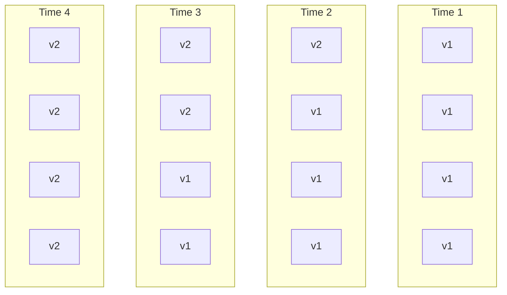

Instances are updated one at a time (or in batches). During the rollout, both versions serve traffic. The application must handle this — API compatibility between v1 and v2 is required.

#### Blue-Green Deployment

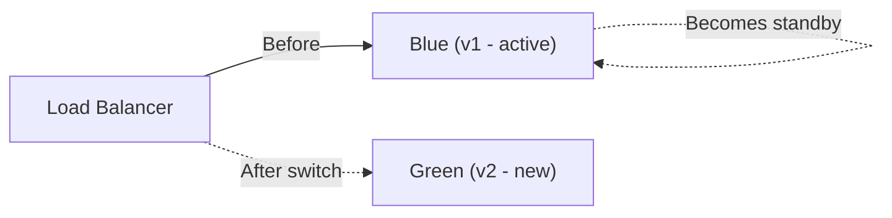

Two identical environments exist. "Blue" serves production traffic. "Green" receives the new deployment. After testing green, the load balancer switches traffic from blue to green atomically. If something goes wrong, switch back to blue instantly.

Cost: double the infrastructure during deployment. Benefit: instant, zero-downtime rollback.

#### Canary Deployment

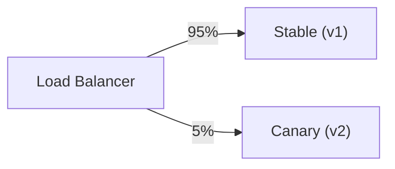

Route a small percentage (1-5%) of traffic to the new version. Monitor error rates, latency, and business metrics. If the canary performs well, gradually increase the percentage. If not, route all traffic back to the stable version.

Canary deployments require:
- Traffic splitting capability (load balancer, service mesh)
- Observability (metrics comparing canary vs stable)
- Automated rollback triggers (error rate threshold)

#### Feature Flags

Deploy code to production with the new feature disabled. Enable it for internal users, then beta users, then a percentage of production users, then everyone. The deployment is decoupled from the activation.

```python
def get_recommendations(user):
    if feature_flags.is_enabled("new_recommendation_engine", user):
        return new_engine.recommend(user)
    return legacy_engine.recommend(user)
```

Feature flags are deployment without activation. They allow:
- Testing in production with real traffic
- Gradual rollout by user segment
- Instant kill switch if problems arise
- A/B testing

### Practice: Database Migrations

Database schema changes are the hardest part of deployment. You cannot roll back a dropped column. The **expand-contract** pattern handles this:

1. **Expand**: Add the new column/table alongside the old one. Application writes to both.
2. **Migrate**: Backfill existing data to the new structure.
3. **Contract**: Remove the old column/table once all code uses the new one.

```sql
-- Step 1: Expand — add new column
ALTER TABLE users ADD COLUMN email_verified BOOLEAN DEFAULT FALSE;

-- Step 2: Migrate — backfill
UPDATE users SET email_verified = TRUE
WHERE id IN (SELECT user_id FROM email_verifications);

-- Step 3: Contract — (in a later release) remove old verification table
-- Only after all code reads from the new column
DROP TABLE email_verifications;
```

Never run expand and contract in the same deployment. If the deployment fails after contract, you have lost data. Expand first, deploy code that uses the new schema, verify, then contract in a separate deployment.

### Rollback and Smoke Tests

**Rollback** means returning to the previous version. Automated rollback triggers on:
- Error rate exceeding threshold
- Latency exceeding threshold
- Health check failures

**Smoke tests** run immediately after deployment to verify critical paths:

```bash
#!/bin/bash
# smoke-test.sh

# Health check
curl -sf https://myapp.example.com/health || exit 1

# Login flow
TOKEN=$(curl -sf -X POST https://myapp.example.com/api/login \
  -d '{"user":"smoke","pass":"test"}' | jq -r '.token')
[ -z "$TOKEN" ] && exit 1

# Core API endpoint
curl -sf -H "Authorization: Bearer $TOKEN" \
  https://myapp.example.com/api/data || exit 1

echo "Smoke tests passed"
```

### Connection

Deployment strategy is a risk management decision. A startup with 100 users can deploy directly to production. A bank serving millions needs canary deployments with automated rollback. The expand-contract pattern for databases is not optional at scale — it is the only way to make schema changes without downtime. Choose the strategy that matches your risk tolerance and operational capability.

> **Try It**: Design a deployment pipeline for a web application with a database. Specify which deployment strategy you would use, how you would handle database migrations, what your rollback plan is, and what smoke tests you would run. Write the pipeline as a GitHub Actions workflow.

---

## H. GitOps

### Theory

GitOps applies the principles of version control to infrastructure and deployment:

1. **Declarative**: The desired state of the system is described declaratively (Kubernetes manifests, Terraform configs).
2. **Versioned and immutable**: The desired state is stored in Git. Every change is a commit. Every state is recoverable.
3. **Pulled automatically**: An agent in the cluster pulls the desired state from Git and applies it. No external system pushes changes in.
4. **Continuously reconciled**: The agent continuously compares actual state with desired state and corrects any drift.

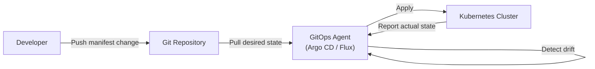

### Push vs Pull

| Aspect | Push-based (traditional CI/CD) | Pull-based (GitOps) |
|--------|-------------------------------|---------------------|
| Who applies changes | CI pipeline pushes to cluster | Agent in cluster pulls from Git |
| Credentials | CI needs cluster credentials | Agent already has cluster access |
| Drift detection | None — state can diverge silently | Continuous — agent corrects drift |
| Security | CI pipeline is a privileged external actor | No external access to cluster needed |
| Audit trail | CI logs | Git history |

### Practice: Argo CD and Flux

**Argo CD** is a declarative GitOps controller for Kubernetes:

```yaml
# Argo CD Application manifest
apiVersion: argoproj.io/v1alpha1
kind: Application
metadata:
  name: myapp
  namespace: argocd
spec:
  project: default
  source:
    repoURL: https://github.com/org/k8s-manifests.git
    targetRevision: main
    path: apps/myapp/overlays/production
  destination:
    server: https://kubernetes.default.svc
    namespace: myapp
  syncPolicy:
    automated:
      prune: true        # Delete resources removed from Git
      selfHeal: true      # Revert manual changes to match Git
    syncOptions:
      - CreateNamespace=true
```

**Flux** is an alternative GitOps toolkit:

```yaml
# Flux GitRepository source
apiVersion: source.toolkit.fluxcd.io/v1
kind: GitRepository
metadata:
  name: myapp
  namespace: flux-system
spec:
  interval: 1m
  url: https://github.com/org/k8s-manifests.git
  ref:
    branch: main
---
# Flux Kustomization
apiVersion: kustomize.toolkit.fluxcd.io/v1
kind: Kustomization
metadata:
  name: myapp
  namespace: flux-system
spec:
  interval: 5m
  path: ./apps/myapp
  prune: true
  sourceRef:
    kind: GitRepository
    name: myapp
```

### Environment Promotion

In GitOps, promoting a release from staging to production is a Git operation:

```
k8s-manifests/
├── apps/
│   └── myapp/
│       ├── base/
│       │   ├── deployment.yaml
│       │   ├── service.yaml
│       │   └── kustomization.yaml
│       └── overlays/
│           ├── staging/
│           │   └── kustomization.yaml    # image: myapp:abc1234
│           └── production/
│               └── kustomization.yaml    # image: myapp:def5678
```

Promoting to production means updating the image tag in the production overlay and committing. The GitOps agent detects the change and applies it. The promotion is a PR — reviewable, auditable, revertible.

### Drift Detection

Drift occurs when the actual cluster state differs from the desired state in Git. Causes include:
- Manual `kubectl` edits
- Another controller modifying resources
- Operator bug

GitOps agents detect drift and either alert or automatically correct it (self-healing). This eliminates configuration drift — a major source of production incidents in push-based systems.

### Connection

GitOps is the natural endpoint of treating infrastructure as code. If your infrastructure is defined in code, that code should be versioned in Git. If it is in Git, changes should go through PRs with reviews. If changes are in Git, an agent can pull and apply them automatically. Each step follows logically from the previous one. GitOps does not add complexity — it formalizes what well-run teams already do informally.

> **Try It**: Set up a Kubernetes cluster (minikube or kind), install Argo CD, and create an Application that syncs from a Git repository. Change a manifest in Git and observe Argo CD automatically applying the change to the cluster.

---

## I. Pipeline Security

### Theory

CI/CD pipelines are high-value attack targets. They have credentials to your cloud accounts, container registries, and production infrastructure. A compromised pipeline can deploy malicious code, exfiltrate secrets, or destroy infrastructure.

### Practice: Securing Pipelines

**Least-privilege runners**: Runners should have only the permissions they need. Do not give CI pipelines admin access to your cloud account.

```yaml
permissions:
  contents: read       # Only read repo contents
  packages: write      # Write to container registry
  id-token: write      # OIDC token for cloud auth
```

**OIDC for CI-to-cloud authentication**: Instead of storing long-lived cloud credentials as secrets, use OpenID Connect. The CI platform issues a short-lived token that the cloud provider trusts.

```yaml
# GitHub Actions OIDC with AWS
- name: Configure AWS credentials
  uses: aws-actions/configure-aws-credentials@v4
  with:
    role-to-assume: arn:aws:iam::123456789012:role/GitHubActionsRole
    aws-region: us-east-1
    # No access keys stored — OIDC token is used
```

**Pin actions by SHA**: Tags can be moved. SHA hashes cannot. Pinning by SHA prevents supply-chain attacks where a malicious actor takes over an action's tag.

```yaml
# Bad — tag can be moved to malicious code
- uses: actions/checkout@v4

# Good — SHA is immutable
- uses: actions/checkout@b4ffde65f46336ab88eb53be808477a3936bae11 # v4.1.1
```

**Signed artifacts**: Sign container images and other build artifacts so consumers can verify they came from your pipeline.

```bash
# Sign with cosign
cosign sign --key cosign.key myregistry.io/myapp:v1.2.3

# Verify
cosign verify --key cosign.pub myregistry.io/myapp:v1.2.3
```

**PR security**: Forks can submit pull requests to your repository. The `pull_request` event runs in the fork's context with read-only access — safe. The `pull_request_target` event runs in the base repository's context with write access — dangerous. A malicious fork can modify workflow files to exfiltrate secrets if you use `pull_request_target` carelessly.

```yaml
# Safe — runs in fork context, no secrets access
on:
  pull_request:
    branches: [main]

# Dangerous — runs in base repo context with secrets
# Only use with explicit checkout restrictions
on:
  pull_request_target:
    branches: [main]
```

**Secret hygiene**:
- Never print secrets in logs
- Rotate secrets regularly
- Use environment-scoped secrets (staging secrets cannot access production)
- Use OIDC instead of long-lived credentials where possible
- Scan for accidentally committed secrets with `gitleaks`

| Security Practice | Threat Mitigated |
|-------------------|-----------------|
| Least-privilege permissions | Blast radius of compromised runner |
| OIDC authentication | Stolen long-lived credentials |
| Pin actions by SHA | Supply-chain attack via compromised action |
| Signed artifacts | Tampered build artifacts |
| Fork restrictions | Malicious PRs exfiltrating secrets |
| Secret scanning | Accidentally committed credentials |

### Connection

Pipeline security is a direct application of the security principles from [Security and Cryptography](/learn/first-principles/security-and-cryptography/). Least privilege, defense in depth, and the principle of minimum necessary access apply to CI/CD just as they apply to any system. The difference is that a CI/CD pipeline often has more access than any individual developer — which makes it a more attractive target.

> **Try It**: Audit the GitHub Actions workflows in a repository you maintain. Check whether actions are pinned by SHA, whether permissions are scoped, and whether secrets are environment-specific. Create a checklist of improvements.

---

## Exercises

### Version Control

1. Create a Git repository and make five commits. Use `git cat-file` to inspect every object type: blob, tree, commit. Draw the DAG.
2. Create two branches that modify the same file in the same region. Merge them and resolve the conflict. Then reset and try rebasing instead. Compare the resulting history.
3. Use interactive rebase to squash, reorder, and reword commits. Verify the result with `git log --oneline`.
4. Simulate a disaster: delete a branch, then recover it using `git reflog`.
5. Set up a repository with a pre-commit hook that runs `ruff check` and rejects commits with linting errors.
6. Use `git bisect` with an automated test to find a regression in a series of 20 commits.

### Software Design

7. Implement the Strategy pattern for a file compression tool that supports gzip, bzip2, and lz4 algorithms. The client code should not change when adding a new algorithm.
8. Implement the Observer pattern for a monitoring system where multiple alert handlers subscribe to metric threshold events.
9. Refactor a 200-line function into smaller functions. Identify which code smells were present and which refactoring techniques you used.

### Architecture

10. Design the architecture for an e-commerce system. Choose between monolith and microservices and justify your decision. Draw the component diagram and data flow.
11. Implement a simple application using hexagonal architecture. The domain layer should have zero imports from infrastructure packages.

### CI/CD

12. Write a complete GitHub Actions workflow for a Python project with: linting (ruff), testing (pytest with coverage), security scanning (semgrep, trivy), container build, and deployment to a staging environment.
13. Create a reusable workflow and a composite action. Use them in two different repositories.
14. Set up branch protection rules requiring CI to pass and at least one reviewer before merge.

### Deployment and GitOps

15. Design a canary deployment pipeline. Specify the traffic split percentages, the metrics to monitor, and the automated rollback conditions.
16. Write an expand-contract database migration for renaming a column. Test that the application works at each stage.
17. Install Argo CD on a local Kubernetes cluster. Create a GitOps pipeline that deploys a simple application from a Git repository. Change the image tag in Git and observe the automatic deployment.

---

## Assessment Dimensions

### Explain

- Describe Git's object model (blobs, trees, commits, tags) and how they form a DAG.
- Explain the difference between merge and rebase, and when to use each.
- Explain three design patterns from different categories and the problems they solve.
- Describe the difference between CI, continuous delivery, and continuous deployment.
- Explain blue-green vs canary deployment and their tradeoffs.
- Explain GitOps principles and how pull-based deployment differs from push-based.

### Build

- Create a Git repository with branches, merges, rebases, and conflict resolution.
- Write a GitHub Actions CI/CD pipeline with build, test, lint, scan, and deploy stages.
- Implement a design pattern in working code that solves a real problem.
- Set up a GitOps deployment with Argo CD or Flux.
- Configure branch protection, CODEOWNERS, and pre-commit hooks for a team repository.

### Debug

- Given a Git repository with a broken merge, use reflog and reset to recover.
- Given a failing CI pipeline, identify whether the failure is in build, test, lint, or security stages and fix it.
- Given a deployment that is causing errors, determine the correct rollback strategy and execute it.
- Given a canary deployment with elevated error rates, decide whether to proceed, pause, or roll back.
- Given a GitOps configuration where the cluster has drifted from Git, identify the cause and restore the desired state.

---

## Key Takeaways

- Git stores snapshots, not diffs. Every object is content-addressed by SHA-1. Branches are pointers. The DAG is append-only.
- Never rebase commits that have been shared. Use `revert` on shared branches, `rebase` on local branches. `reflog` is your safety net.
- Design patterns are communication tools, not code templates. Apply them when you feel the problem they solve, not preemptively.
- Architecture decisions (monolith vs microservices, sync vs async) are the hardest to reverse. Make them based on actual constraints, not trends.
- CI/CD automates quality enforcement. Linting, testing, scanning, and coverage checks run on every change without human intervention.
- The testing pyramid optimizes for cost: many fast unit tests, fewer slow E2E tests. TDD drives design toward testable code.
- Deployment strategies trade speed for safety. Rolling is simple. Blue-green is safe. Canary is precise. Feature flags decouple deployment from activation.
- Database migrations use expand-contract: never destructive changes in a single deployment.
- GitOps makes Git the single source of truth for infrastructure. Pull-based reconciliation detects and corrects drift automatically.
- Pipeline security is critical. Pin actions by SHA, use OIDC instead of long-lived credentials, scope permissions narrowly, and never trust fork PRs with secrets.

---

## Resources & Further Reading

- [Pro Git Book (free)](https://git-scm.com/book/en/v2) — The definitive Git reference
- [Git Internals — Git Objects](https://git-scm.com/book/en/v2/Git-Internals-Git-Objects) — Deep dive into the object model
- [GitHub Actions Documentation](https://docs.github.com/en/actions) — Official reference
- [GitHub Flow Guide](https://docs.github.com/en/get-started/quickstart/github-flow) — Branching strategy
- [Design Patterns: Elements of Reusable Object-Oriented Software](https://en.wikipedia.org/wiki/Design_Patterns) — GoF book
- [Refactoring: Improving the Design of Existing Code](https://refactoring.com/) — Martin Fowler
- [Clean Architecture](https://blog.cleancoder.com/uncle-bob/2012/08/13/the-clean-architecture.html) — Robert C. Martin
- [The Twelve-Factor App](https://12factor.net/) — Methodology for building SaaS applications
- [Argo CD Documentation](https://argo-cd.readthedocs.io/) — GitOps controller
- [Flux Documentation](https://fluxcd.io/docs/) — GitOps toolkit
- [Semgrep](https://semgrep.dev/) — Static analysis for security
- [Trivy](https://trivy.dev/) — Vulnerability scanner
- [pre-commit Framework](https://pre-commit.com/) — Git hook management
- [Hypothesis (Property-Based Testing)](https://hypothesis.readthedocs.io/) — Python property-based testing library
- [Martin Fowler — Deployment Strategies](https://martinfowler.com/bliki/BlueGreenDeployment.html) — Deployment patterns
