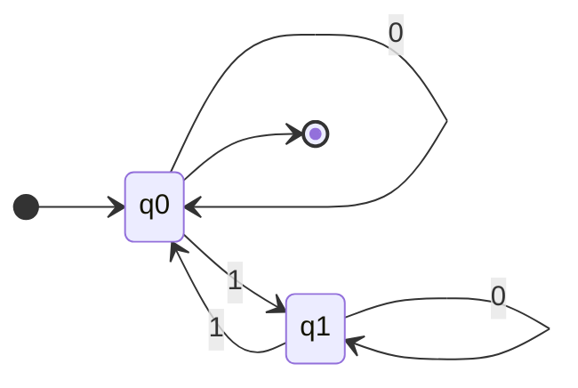
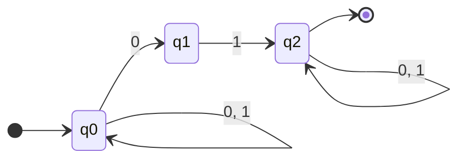
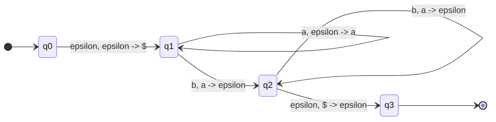
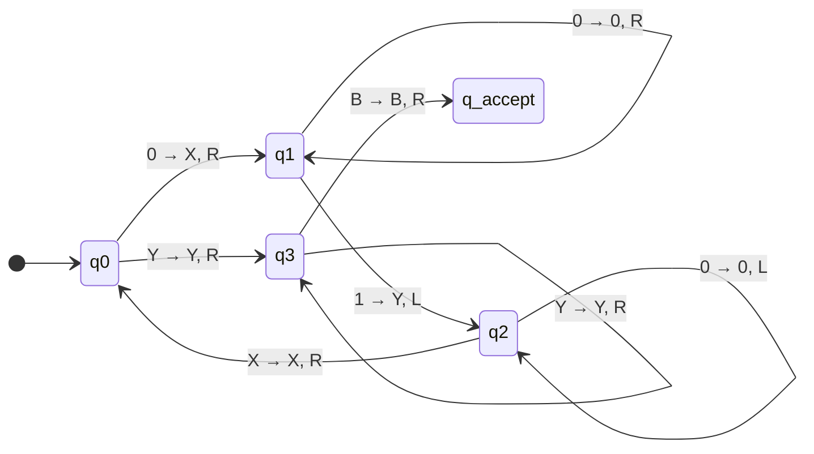
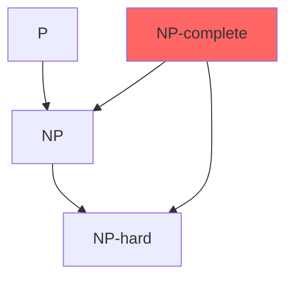
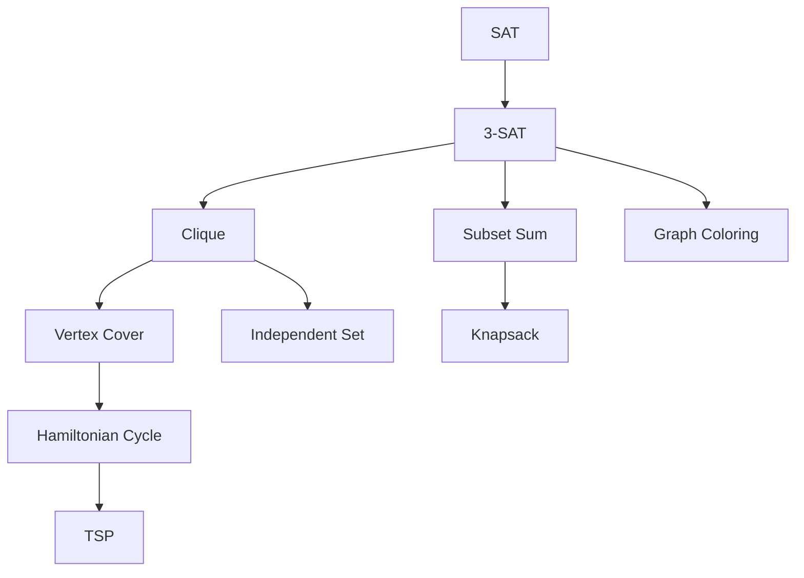

# Theory of Computation

This is the final domain. Everything you have built — shell scripting, Python, data structures, algorithms, regex, parsers, schedulers — rests on a formal foundation you have been using without naming. Domain 13 names it. You will learn what computation *is*, what machines *can* compute, and what no machine *ever will* compute regardless of speed or memory. These are not philosophical questions. They have precise mathematical answers, and those answers explain why your tools work the way they do.

**Prerequisites:** [Data Structures and Algorithms](/learn/first-principles/data-structures-and-algorithms/) (Domain 6). You need comfort with formal proof techniques, graph representations, and asymptotic analysis.

**Learning Objectives:**

1. Define DFAs and NFAs and prove their equivalence
2. Explain the correspondence between regular expressions and finite automata
3. Use the pumping lemma to prove a language is not regular
4. Describe pushdown automata and context-free grammars
5. Define Turing machines and explain the Church-Turing thesis
6. Prove the halting problem is undecidable
7. Explain P, NP, NP-completeness, and why it matters for real systems

---

## Part A: Automata Theory

### Deterministic Finite Automata (DFA)

#### Theory

A **deterministic finite automaton** is a 5-tuple (Q, Sigma, delta, q0, F) where:

- **Q** is a finite set of states
- **Sigma** is a finite input alphabet
- **delta: Q x Sigma -> Q** is the transition function
- **q0 in Q** is the start state
- **F subset of Q** is the set of accept states

The machine reads an input string one symbol at a time, left to right. At each step, it transitions from its current state to a new state determined by the current symbol and the transition function. If it ends in an accept state after reading the entire string, it **accepts**. Otherwise, it **rejects**. There is no ambiguity: for every state and every input symbol, exactly one transition exists.

A DFA **recognizes** a language L if it accepts exactly the strings in L and rejects everything else. A language is **regular** if some DFA recognizes it.

Here is a DFA that accepts all binary strings containing an even number of 1s:



| State | Input 0 | Input 1 |
|-------|---------|---------|
| q0 (start, accept) | q0 | q1 |
| q1 | q1 | q0 |

The formal definition:
- Q = {q0, q1}
- Sigma = {0, 1}
- delta is the table above
- Start state = q0
- F = {q0}

Trace the string `1011`:
- Start: q0
- Read `1`: q0 -> q1
- Read `0`: q1 -> q1
- Read `1`: q1 -> q0
- Read `0`: q0 -> q0
- End state q0 is in F. **Accept.**

Trace the string `101`:
- Start: q0
- Read `1`: q0 -> q1
- Read `0`: q1 -> q1
- Read `1`: q1 -> q0
- End state q0 is in F. **Accept.** (Two 1s is even.)

Trace the string `1`:
- Start: q0
- Read `1`: q0 -> q1
- End state q1 is not in F. **Reject.**

#### Practice

Implement a DFA simulator in Python:

```python
def simulate_dfa(states, alphabet, transitions, start, accept_states, input_string):
    """
    Simulate a DFA on an input string.
    transitions: dict mapping (state, symbol) -> state
    Returns True if the DFA accepts the string.
    """
    current = start
    for symbol in input_string:
        if symbol not in alphabet:
            raise ValueError(f"Symbol '{symbol}' not in alphabet {alphabet}")
        key = (current, symbol)
        if key not in transitions:
            raise ValueError(f"No transition defined for {key}")
        current = transitions[key]
    return current in accept_states

# DFA: accepts binary strings with even number of 1s
transitions = {
    ('q0', '0'): 'q0',
    ('q0', '1'): 'q1',
    ('q1', '0'): 'q1',
    ('q1', '1'): 'q0',
}

tests = [
    ("", True),       # zero 1s (even)
    ("0", True),      # zero 1s
    ("1", False),     # one 1
    ("11", True),     # two 1s
    ("1011", True),   # two 1s
    ("111", False),   # three 1s
    ("1111", True),   # four 1s
]

for string, expected in tests:
    result = simulate_dfa(
        states={'q0', 'q1'},
        alphabet={'0', '1'},
        transitions=transitions,
        start='q0',
        accept_states={'q0'},
        input_string=string
    )
    status = "PASS" if result == expected else "FAIL"
    print(f"{status}: '{string}' -> {result} (expected {expected})")
```

#### Connection

You have been using DFAs since [Domain 4](/learn/first-principles/text-processing-and-automation/). Vim's modal editor is a finite state machine: Normal mode, Insert mode, Visual mode, and Command-line mode are states. Keystrokes are input symbols. Every keystroke in Vim triggers a deterministic transition from one mode to another. When you press `i` in Normal mode, Vim transitions to Insert mode. When you press `Esc` in Insert mode, it transitions back. The behavior is completely defined by (current_mode, keystroke) -> next_mode. That is a DFA.

> **Try It**: Draw the state diagram for a DFA over alphabet {a, b} that accepts all strings ending in `ab`. Define Q, Sigma, delta, q0, and F formally, then implement it using the simulator above.

---

### Nondeterministic Finite Automata (NFA)

#### Theory

A **nondeterministic finite automaton** is a 5-tuple (Q, Sigma, delta, q0, F) where everything is the same as a DFA except the transition function:

- **delta: Q x (Sigma union {epsilon}) -> P(Q)** maps to a *set* of states (the power set of Q)

Two differences from DFAs:

1. **Multiple transitions**: From a single state on a single symbol, the machine can transition to multiple states simultaneously. Think of it as "branching" into parallel universes — if *any* branch reaches an accept state, the NFA accepts.

2. **Epsilon transitions**: The machine can transition without reading any input symbol. These are "free moves" labeled with epsilon.

An NFA accepts a string if **there exists** at least one sequence of choices that leads to an accept state. It rejects only if **every** possible path leads to rejection.

Example NFA that accepts strings over {0, 1} containing the substring `01`:



State q0 has two transitions on input `0`: it can go to q0 or q1. This is the nondeterminism. The NFA "guesses" when the `01` substring begins.

#### Practice

Implement an NFA simulator using the subset tracking approach:

```python
def epsilon_closure(nfa_transitions, states):
    """Compute the epsilon closure of a set of states."""
    closure = set(states)
    stack = list(states)
    while stack:
        state = stack.pop()
        for next_state in nfa_transitions.get((state, ''), set()):
            if next_state not in closure:
                closure.add(next_state)
                stack.append(next_state)
    return frozenset(closure)

def simulate_nfa(transitions, start, accept_states, input_string):
    """
    Simulate an NFA on an input string.
    transitions: dict mapping (state, symbol) -> set of states
    Empty string key '' represents epsilon transitions.
    Returns True if the NFA accepts.
    """
    current_states = epsilon_closure(transitions, {start})

    for symbol in input_string:
        next_states = set()
        for state in current_states:
            next_states |= transitions.get((state, symbol), set())
        current_states = epsilon_closure(transitions, next_states)

    return bool(current_states & accept_states)

# NFA: accepts strings containing substring "01"
nfa_transitions = {
    ('q0', '0'): {'q0', 'q1'},
    ('q0', '1'): {'q0'},
    ('q1', '1'): {'q2'},
    ('q2', '0'): {'q2'},
    ('q2', '1'): {'q2'},
}

tests = [
    ("01", True),
    ("001", True),
    ("010", True),
    ("1010", True),
    ("111", False),
    ("000", False),
    ("", False),
]

for string, expected in tests:
    result = simulate_nfa(nfa_transitions, 'q0', {'q2'}, string)
    status = "PASS" if result == expected else "FAIL"
    print(f"{status}: '{string}' -> {result} (expected {expected})")
```

#### Connection

The NFA simulator above tracks all possible current states simultaneously. This is exactly the **subset construction** in action — the algorithm that proves NFAs and DFAs are equivalent. The `current_states` variable is a set of NFA states, which corresponds to a single state in the equivalent DFA. Every NFA can be converted to a DFA this way, though the DFA may have up to 2^n states for an NFA with n states.

---

### DFA-NFA Equivalence: Subset Construction

#### Theory

**Theorem**: For every NFA N, there exists a DFA D such that L(D) = L(N). That is, NFAs and DFAs recognize exactly the same class of languages: the regular languages.

**Proof (Subset Construction)**: Given NFA N = (Q, Sigma, delta_N, q0, F), construct DFA D = (Q', Sigma, delta_D, q0', F') where:

- Q' = P(Q), the power set of Q (each DFA state is a *set* of NFA states)
- q0' = epsilon_closure({q0})
- F' = {S in Q' : S intersect F is nonempty} (any DFA state containing an NFA accept state is a DFA accept state)
- delta_D(S, a) = epsilon_closure(union of delta_N(q, a) for all q in S)

The DFA simulates all possible NFA paths simultaneously. A set of NFA states in the DFA represents "the NFA could be in any of these states right now." The DFA accepts if any of those possibilities includes an accept state.

**Worst case**: An NFA with n states can produce a DFA with up to 2^n states. This exponential blowup is real and occasionally unavoidable. There exist families of languages where the minimal DFA is exponentially larger than the minimal NFA.

#### Practice

Implement the subset construction:

```python
def subset_construction(nfa_transitions, nfa_start, nfa_accept, alphabet):
    """
    Convert an NFA to a DFA via subset construction.
    Returns (dfa_transitions, dfa_start, dfa_accept_states).
    """
    dfa_start = epsilon_closure(nfa_transitions, {nfa_start})
    dfa_states = {dfa_start}
    dfa_transitions = {}
    dfa_accept = set()
    worklist = [dfa_start]

    while worklist:
        current = worklist.pop()
        if current & nfa_accept:
            dfa_accept.add(current)
        for symbol in alphabet:
            next_nfa_states = set()
            for state in current:
                next_nfa_states |= nfa_transitions.get((state, symbol), set())
            next_dfa_state = epsilon_closure(nfa_transitions, next_nfa_states)
            dfa_transitions[(current, symbol)] = next_dfa_state
            if next_dfa_state not in dfa_states:
                dfa_states.add(next_dfa_state)
                worklist.append(next_dfa_state)

    return dfa_transitions, dfa_start, dfa_accept

# Convert the "contains 01" NFA to a DFA
dfa_trans, dfa_start, dfa_accept = subset_construction(
    nfa_transitions, 'q0', {'q2'}, ['0', '1']
)

print(f"DFA start state: {set(dfa_start)}")
print(f"DFA accept states: {[set(s) for s in dfa_accept]}")
print(f"DFA transitions:")
for (state, symbol), target in sorted(dfa_trans.items(), key=str):
    print(f"  {set(state)} --{symbol}--> {set(target)}")
```

> **Try It**: Construct by hand the DFA equivalent for an NFA with three states that accepts strings over {a, b} ending in `ab`, using epsilon transitions. Verify your construction with the code above.

---

### Regular Expressions and Finite Automata

#### Theory

**Theorem (Kleene's Theorem)**: A language is regular if and only if it can be described by a regular expression.

This means three formalisms describe exactly the same class of languages:
1. DFAs
2. NFAs
3. Regular expressions

The formal definition of regular expressions over alphabet Sigma:

| Expression | Language |
|-----------|----------|
| a (for a in Sigma) | {a} — the single string "a" |
| epsilon | {""} — the empty string |
| empty set | {} — the empty language |
| R1 union R2 | L(R1) union L(R2) — union |
| R1 R2 | L(R1) concatenated with L(R2) — concatenation |
| R* | zero or more repetitions of L(R) — Kleene star |

That is it. Union, concatenation, and Kleene star. Every other regex feature (character classes, `+`, `?`, backreferences) is either syntactic sugar on these three or goes beyond regular languages entirely.

**Regex to NFA (Thompson's Construction)**: Every regex can be converted to an NFA:

- Single character `a`: two states, one transition on `a`
- `R1 | R2`: new start state with epsilon transitions to both sub-NFAs
- `R1 R2`: connect the accept state of R1's NFA to the start state of R2's NFA with an epsilon transition
- `R*`: new start state with epsilon to the sub-NFA's start and directly to a new accept state; sub-NFA's accept has epsilon back to sub-NFA's start

**NFA to Regex**: Use state elimination. Remove states one at a time, relabeling transitions with regex expressions until only start and accept states remain. The label on the final transition is the regex.

#### Practice

Build a simple regex-to-NFA converter for the three core operations:

```python
class NFAFragment:
    """A fragment of an NFA with a single start and accept state."""
    _counter = 0

    @classmethod
    def new_state(cls):
        cls._counter += 1
        return f"s{cls._counter}"

    def __init__(self, start, accept, transitions):
        self.start = start
        self.accept = accept
        self.transitions = transitions  # dict: (state, symbol) -> set of states

def char_nfa(c):
    """NFA for a single character."""
    s = NFAFragment.new_state()
    a = NFAFragment.new_state()
    return NFAFragment(s, a, {(s, c): {a}})

def union_nfa(n1, n2):
    """NFA for n1 | n2."""
    s = NFAFragment.new_state()
    a = NFAFragment.new_state()
    trans = {}
    trans.update(n1.transitions)
    trans.update(n2.transitions)
    # epsilon transitions from new start to both sub-NFA starts
    trans[(s, '')] = {n1.start, n2.start}
    # epsilon transitions from both accepts to new accept
    trans.setdefault((n1.accept, ''), set()).add(a)
    trans.setdefault((n2.accept, ''), set()).add(a)
    return NFAFragment(s, a, trans)

def concat_nfa(n1, n2):
    """NFA for n1 followed by n2."""
    trans = {}
    trans.update(n1.transitions)
    trans.update(n2.transitions)
    # epsilon from n1's accept to n2's start
    trans.setdefault((n1.accept, ''), set()).add(n2.start)
    return NFAFragment(n1.start, n2.accept, trans)

def star_nfa(n):
    """NFA for n*."""
    s = NFAFragment.new_state()
    a = NFAFragment.new_state()
    trans = dict(n.transitions)
    trans[(s, '')] = {n.start, a}            # skip or enter
    trans.setdefault((n.accept, ''), set()).update({n.start, a})  # loop or exit
    return NFAFragment(s, a, trans)

# Build NFA for (a|b)*c
ab = union_nfa(char_nfa('a'), char_nfa('b'))
ab_star = star_nfa(ab)
full = concat_nfa(ab_star, char_nfa('c'))

# Test using our NFA simulator
test_strings = ["c", "ac", "bc", "abc", "aabc", "bac", "a", "ab", ""]
for s in test_strings:
    result = simulate_nfa(full.transitions, full.start, {full.accept}, s)
    print(f"'{s}' -> {'accept' if result else 'reject'}")
```

#### Connection

When you write `grep 'pattern' file` in [Domain 4](/learn/first-principles/text-processing-and-automation/), `grep` compiles your pattern into a finite automaton and runs it against each line. The `grep` command is literally a finite automaton evaluator. The name stands for "Global Regular Expression Print." The regex `[a-z]+@[a-z]+\.[a-z]+` that matches simple email addresses defines a regular language. `grep` builds an NFA from it (using Thompson's construction), optionally converts it to a DFA, and runs it on each line of input. You have been using this theory since Domain 4 — now you know what it is.

The distinction matters: **backreferences** in regex (like `\1`) go beyond regular languages. A regex with backreferences cannot be evaluated by a finite automaton. This is why some regex engines (like Perl's) can exhibit exponential runtime — they are no longer doing finite automaton simulation.

> **Try It**: Use `grep -E` to match strings accepted by the regex `(ab)*c` on the command line. Then modify the Python NFA builder to handle the same pattern and verify both produce identical results.

---

### The Pumping Lemma for Regular Languages

#### Theory

Not every language is regular. Some languages require memory that a finite automaton cannot provide. The **pumping lemma** gives a tool to prove this.

**Pumping Lemma**: If L is a regular language, then there exists a pumping length p >= 1 such that every string s in L with |s| >= p can be split into three parts s = xyz where:

1. |y| > 0 (the pumped portion is nonempty)
2. |xy| <= p (the pump occurs within the first p characters)
3. For all i >= 0, xy^i z is in L (repeating y any number of times keeps the string in L)

The contrapositive is the useful direction: if you can show that **no** valid split exists for some string, then L is not regular.

**Classic proof**: L = {a^n b^n : n >= 0} is not regular.

Proof by contradiction:
1. Assume L is regular. Then the pumping lemma holds for some p.
2. Choose s = a^p b^p. Clearly s is in L and |s| = 2p >= p.
3. Consider any split s = xyz where |y| > 0 and |xy| <= p.
4. Since |xy| <= p and s starts with p a's, both x and y consist entirely of a's. Write y = a^k for some k >= 1.
5. Pump up: xy^2 z = a^(p+k) b^p. Since k >= 1, this has more a's than b's, so it is not in L.
6. Contradiction. L is not regular.

This proof structure is always the same: assume regularity, pick a clever string, show no split works.

**More examples of non-regular languages:**

| Language | Why Not Regular |
|----------|----------------|
| {a^n b^n : n >= 0} | Requires counting — no finite memory for unbounded n |
| {ww : w in {0,1}*} | Requires remembering the first half |
| {strings with equal number of 0s and 1s} | Requires a counter |
| {a^(n^2) : n >= 0} | The gaps between valid lengths grow |

#### Practice

```python
def check_pumping(language_check, s, p):
    """
    Attempt to find a pumping lemma violation for string s.
    Tests all valid splits xyz where |y| > 0 and |xy| <= p.
    Returns True if ALL splits can be pumped (consistent with regularity).
    Returns False if ANY split fails pumping (proves non-regularity).
    """
    n = len(s)
    for split_x in range(min(p, n) + 1):
        for split_y in range(split_x + 1, min(p, n) + 1):
            x = s[:split_x]
            y = s[split_x:split_y]
            z = s[split_y:]
            # y must be nonempty (guaranteed by range)
            # |xy| <= p (guaranteed by range bounds)

            # Check pumping for i = 0, 1, 2, 3
            all_pump = True
            for i in range(4):
                pumped = x + y * i + z
                if not language_check(pumped):
                    all_pump = False
                    print(f"  Violation: x='{x}', y='{y}', z='{z}', "
                          f"i={i}, pumped='{pumped}' NOT in L")
                    break
            if not all_pump:
                continue  # This split fails, try others
            # This split survived pumping — does not prove non-regularity
            print(f"  Split x='{x}', y='{y}', z='{z}' survived pumping")
    print()

def is_anbn(s):
    """Check if s is in {a^n b^n}."""
    n = len(s)
    if n % 2 != 0:
        return False
    half = n // 2
    return s[:half] == 'a' * half and s[half:] == 'b' * half

# Test with a^p b^p for p = 3
print("Testing a^3 b^3 = 'aaabbb' against pumping lemma (p=3):")
check_pumping(is_anbn, "aaabbb", 3)
```

#### Connection

The pumping lemma is not just a proof technique for homework problems. It tells you something fundamental about `grep` and regex: **there are patterns you cannot match with regular expressions**. The language {a^n b^n} — matching an equal number of opening and closing tags — is the simplest example. This is why regex cannot parse HTML. HTML has nested, matched tags, which is a context-free language, not a regular one. Every engineer who has tried to parse HTML with regex has hit this wall. The pumping lemma explains why that wall exists.

> **Try It**: Use the pumping lemma to prove that {0^n 1^n 0^n : n >= 0} is not regular. Write out the full proof, choosing a specific string and showing that no split works.

---

### Pushdown Automata (PDA)

#### Theory

A **pushdown automaton** is a finite automaton equipped with a stack — an unbounded LIFO data structure. Formally, a PDA is a 6-tuple (Q, Sigma, Gamma, delta, q0, F) where:

- **Q** is a finite set of states
- **Sigma** is the input alphabet
- **Gamma** is the stack alphabet
- **delta: Q x (Sigma union {epsilon}) x (Gamma union {epsilon}) -> P(Q x (Gamma union {epsilon}))** is the transition function
- **q0** is the start state
- **F** is the set of accept states

Each transition depends on three things: the current state, the current input symbol (or epsilon), and the top of the stack (or epsilon). Each transition can push a symbol onto the stack or pop one off.

The stack gives the PDA memory that a DFA lacks. It can count: push a symbol for each `a`, pop for each `b`, and accept if the stack is empty at the end. This is exactly what is needed for {a^n b^n}.



PDA for {a^n b^n : n >= 0}:

1. Push a bottom-of-stack marker `$`
2. For each `a`, push `a` onto the stack
3. For each `b`, pop an `a` off the stack
4. Accept if the stack is empty (only `$` marker remains, which we pop)

PDAs are **nondeterministic** by default. Unlike finite automata, nondeterministic PDAs are strictly more powerful than deterministic PDAs. There exist context-free languages that no deterministic PDA can recognize (for example, {ww^R : w in {a,b}*}, the set of palindromes).

#### Practice

```python
def simulate_pda_anbn(input_string):
    """
    Simulate a PDA for {a^n b^n : n >= 0}.
    Uses a Python list as the stack.
    """
    stack = ['$']  # bottom marker
    state = 'reading_a'

    for char in input_string:
        if state == 'reading_a':
            if char == 'a':
                stack.append('a')
            elif char == 'b':
                state = 'reading_b'
                if stack[-1] == 'a':
                    stack.pop()
                else:
                    return False  # b before any a, or too many b's
            else:
                return False
        elif state == 'reading_b':
            if char == 'b':
                if stack[-1] == 'a':
                    stack.pop()
                else:
                    return False  # more b's than a's
            else:
                return False  # a after b

    return state != 'reading_a' or len(stack) == 1  # accept empty string too
    # Stack should have only '$' remaining

tests = [
    ("", True),
    ("ab", True),
    ("aabb", True),
    ("aaabbb", True),
    ("aab", False),
    ("abb", False),
    ("ba", False),
    ("abab", False),
]

for s, expected in tests:
    result = simulate_pda_anbn(s)
    # Fix: empty string special case
    if s == "":
        result = True
    status = "PASS" if result == expected else "FAIL"
    print(f"{status}: '{s}' -> {result} (expected {expected})")
```

#### Connection

Every time Python parses your code, it uses a pushdown automaton. Python's parser must match parentheses, brackets, and braces — all nested structures that require a stack. The call stack in [Domain 5](/learn/first-principles/programming-fundamentals/) is a stack. Recursive descent parsers, which you will see in compilers and interpreters, are PDAs implemented in code. The stack is what makes nesting possible.

---

### Context-Free Grammars (CFG)

#### Theory

A **context-free grammar** is a 4-tuple (V, Sigma, R, S) where:

- **V** is a finite set of variables (non-terminals)
- **Sigma** is a finite set of terminals (the alphabet)
- **R** is a finite set of production rules of the form A -> w, where A is a variable and w is a string of variables and terminals
- **S in V** is the start variable

A grammar **generates** a string by starting from S and repeatedly replacing variables with the right-hand side of a production rule until only terminals remain. A **derivation** is the sequence of replacements. A **parse tree** represents the hierarchical structure of a derivation.

Example: Grammar for {a^n b^n : n >= 0}

```
S -> aSb | epsilon
```

Derivation of `aaabbb`:
```
S -> aSb -> aaSbb -> aaaSbbb -> aaabbb
```

Parse tree:
```
        S
       /|\
      a  S  b
        /|\
       a  S  b
         /|\
        a  S  b
          |
        epsilon
```

A more complex grammar for arithmetic expressions:

```
E -> E + T | T
T -> T * F | F
F -> ( E ) | id
```

This grammar encodes operator precedence: `*` binds tighter than `+` because `T` (which handles `*`) is deeper in the derivation tree than `E` (which handles `+`).

Derivation of `id + id * id`:
```
E -> E + T -> T + T -> F + T -> id + T -> id + T * F
  -> id + F * F -> id + id * F -> id + id * id
```

**Ambiguity**: A grammar is ambiguous if some string has two different parse trees (leftmost derivations). The grammar `E -> E + E | E * E | id` is ambiguous because `id + id * id` can be parsed as `(id + id) * id` or `id + (id * id)`. Ambiguity in programming language grammars leads to bugs. The unambiguous version above resolves this by encoding precedence structurally.

#### Practice

```python
import random

def generate_from_cfg(rules, start, max_depth=10):
    """
    Generate a random string from a CFG.
    rules: dict mapping variable -> list of productions (each production is a list of symbols)
    Non-terminals are keys of rules dict. Everything else is a terminal.
    """
    def expand(symbol, depth):
        if depth > max_depth:
            # Force termination: pick shortest production
            if symbol in rules:
                shortest = min(rules[symbol], key=len)
                return ''.join(expand(s, depth + 1) for s in shortest)
            return symbol
        if symbol not in rules:
            return symbol  # terminal
        production = random.choice(rules[symbol])
        return ''.join(expand(s, depth + 1) for s in production)

    return expand(start, 0)

# Grammar for a^n b^n
rules_anbn = {
    'S': [['a', 'S', 'b'], []]  # S -> aSb | epsilon
}

print("Strings from {a^n b^n} grammar:")
for _ in range(8):
    s = generate_from_cfg(rules_anbn, 'S')
    print(f"  '{s}'")

# Grammar for arithmetic expressions
rules_arith = {
    'E': [['E', '+', 'T'], ['T']],
    'T': [['T', '*', 'F'], ['F']],
    'F': [['(', 'E', ')'], ['id']],
}

print("\nArithmetic expressions:")
for _ in range(5):
    expr = generate_from_cfg(rules_arith, 'E', max_depth=5)
    print(f"  {expr}")
```

#### Connection

Every programming language has a context-free grammar. Python's grammar is defined in a file called `Grammar/Grammar` in the CPython source. When you write `if x > 0: print(x)`, Python's parser uses the grammar to build an abstract syntax tree (AST). The `ast` module in [Domain 5](/learn/first-principles/programming-fundamentals/) lets you inspect this tree directly:

```python
import ast
tree = ast.parse("x = 2 + 3 * 4")
print(ast.dump(tree, indent=2))
```

The parse tree encodes that `3 * 4` is evaluated before `2 + ...` because of how the CFG production rules are structured. Operator precedence is not a special case — it falls directly out of the grammar.

---

### CFG-PDA Equivalence

#### Theory

**Theorem**: A language is context-free if and only if some PDA recognizes it.

The two formalisms — CFGs and PDAs — describe exactly the same class of languages: the context-free languages. The proof has two directions:

**CFG to PDA**: Given a CFG G, construct a PDA P that simulates a leftmost derivation of G. The PDA pushes the start variable onto the stack, then repeatedly:
- If the top of the stack is a variable A, nondeterministically choose a production A -> w and replace A with w on the stack
- If the top of the stack is a terminal a matching the current input, pop it and advance the input

**PDA to CFG**: Given a PDA P, construct a CFG where each variable A_pq generates exactly the strings that take the PDA from state p with empty stack to state q with empty stack.

This equivalence is analogous to the DFA-NFA equivalence one level up: different formalisms, same expressive power.

### Pumping Lemma for Context-Free Languages

#### Theory

Just as not every language is regular, not every language is context-free. The **pumping lemma for CFLs** is the tool:

**Pumping Lemma for CFLs**: If L is a context-free language, then there exists a pumping length p such that every string s in L with |s| >= p can be split into five parts s = uvxyz where:

1. |vy| > 0 (at least one of v, y is nonempty)
2. |vxy| <= p
3. For all i >= 0, uv^i xy^i z is in L

Note the key difference from the regular pumping lemma: there are **two** parts that get pumped (v and y), and they must be pumped together by the same amount.

**Classic proof**: L = {a^n b^n c^n : n >= 0} is not context-free.

Proof: Assume L is context-free with pumping length p. Choose s = a^p b^p c^p. In any split s = uvxyz with |vxy| <= p, the substring vxy can span at most two of the three symbol groups (a's, b's, c's). Pumping uv^2 xy^2 z increases the count of at most two symbols, not all three. The result has unequal counts and is not in L. Contradiction.

This is why programming languages that require matching three things simultaneously (like ensuring every variable declaration has both a definition and a use) cannot be checked by a context-free grammar alone.

---

### Normal Forms

#### Theory

A CFG can be transformed into standard forms without changing the language it generates.

**Chomsky Normal Form (CNF)**: Every production has one of two forms:
- A -> BC (two variables)
- A -> a (one terminal)
- S -> epsilon (only if the start variable can generate the empty string)

Any CFG can be converted to CNF. The CYK parsing algorithm requires CNF and runs in O(n^3) time, where n is the length of the input string. This is the best known general-purpose CFG parser.

**Greibach Normal Form (GNF)**: Every production has the form:
- A -> a B1 B2 ... Bk (starts with exactly one terminal, followed by zero or more variables)

GNF is useful because it guarantees that each derivation step consumes exactly one input symbol, making it directly suitable for recursive descent parsing.

| Property | CNF | GNF |
|----------|-----|-----|
| Production form | A -> BC or A -> a | A -> a B1...Bk |
| Parsing algorithm | CYK (O(n^3)) | Top-down parsing |
| Key use | Theoretical proofs, CYK | Recursive descent parsers |
| Existence | Every CFL has a CNF grammar | Every CFL has a GNF grammar |

---

### Turing Machines

#### Theory

A **Turing machine** is the most powerful standard model of computation. It is a 7-tuple (Q, Sigma, Gamma, delta, q0, q_accept, q_reject) where:

- **Q** is a finite set of states
- **Sigma** is the input alphabet (does not include the blank symbol)
- **Gamma** is the tape alphabet (Sigma subset of Gamma, includes blank symbol B)
- **delta: Q x Gamma -> Q x Gamma x {L, R}** is the transition function
- **q0** is the start state
- **q_accept** is the accept state
- **q_reject** is the reject state (q_accept != q_reject)

The machine has:
1. An **infinite tape** divided into cells, each holding a symbol from Gamma
2. A **head** that reads and writes one cell at a time and moves left or right
3. A **state register** holding the current state

The input string is written on the tape. The head starts at the leftmost symbol. At each step, based on the current state and the symbol under the head, the machine:
1. Writes a new symbol (or the same one)
2. Moves the head left or right
3. Transitions to a new state

The machine **halts** when it enters q_accept or q_reject. It may also **loop forever** — never halting — which is a possibility that did not exist for DFAs or PDAs.



This Turing machine recognizes {0^n 1^n : n >= 1}. It works by repeatedly:
1. Marking the leftmost unmarked `0` with `X`
2. Scanning right to find the leftmost unmarked `1` and marking it with `Y`
3. Scanning back left to the next unmarked `0`
4. Accepting when all `0`s and `1`s have been marked

#### Practice

```python
def simulate_turing_machine(transitions, start, accept, reject, tape_input, max_steps=1000):
    """
    Simulate a Turing machine.
    transitions: dict mapping (state, symbol) -> (new_state, write_symbol, direction)
    direction: 'L' or 'R'
    tape_input: the initial tape contents as a string
    Returns (accepted: bool, tape: list, steps: int)
    """
    tape = list(tape_input) if tape_input else ['B']
    head = 0
    state = start
    steps = 0

    while steps < max_steps:
        # Read current symbol
        if head < 0:
            tape.insert(0, 'B')
            head = 0
        if head >= len(tape):
            tape.append('B')

        symbol = tape[head]

        # Check for halt
        if state == accept:
            return True, tape, steps
        if state == reject:
            return False, tape, steps

        # Look up transition
        key = (state, symbol)
        if key not in transitions:
            return False, tape, steps  # no transition = reject

        new_state, write, direction = transitions[key]
        tape[head] = write
        head += 1 if direction == 'R' else -1
        state = new_state
        steps += 1

    return None, tape, steps  # did not halt within max_steps

# Turing machine for {0^n 1^n : n >= 1}
tm_transitions = {
    ('q0', '0'): ('q1', 'X', 'R'),   # mark leftmost 0
    ('q1', '0'): ('q1', '0', 'R'),   # skip past 0s
    ('q1', 'Y'): ('q1', 'Y', 'R'),   # skip past marked 1s
    ('q1', '1'): ('q2', 'Y', 'L'),   # mark leftmost unmarked 1
    ('q2', '0'): ('q2', '0', 'L'),   # scan left past 0s
    ('q2', 'Y'): ('q2', 'Y', 'L'),   # scan left past Ys
    ('q2', 'X'): ('q0', 'X', 'R'),   # found marked 0, restart
    ('q0', 'Y'): ('q3', 'Y', 'R'),   # all 0s marked, verify 1s
    ('q3', 'Y'): ('q3', 'Y', 'R'),   # skip marked 1s
    ('q3', 'B'): ('qa', 'B', 'R'),   # all matched, accept
}

tests = [
    ("01", True),
    ("0011", True),
    ("000111", True),
    ("0", False),
    ("011", False),
    ("001", False),
    ("10", False),
]

for s, expected in tests:
    result, tape, steps = simulate_turing_machine(
        tm_transitions, 'q0', 'qa', 'qr', s
    )
    status = "PASS" if result == expected else "FAIL"
    print(f"{status}: '{s}' -> {result} in {steps} steps (expected {expected})")
```

#### Connection

Your computer is a Turing machine with finite tape. Every program you have written in [Domain 5](/learn/first-principles/programming-fundamentals/) is a Turing machine computation. The CPU fetches an instruction (reads the tape), modifies registers and memory (writes to the tape), and moves to the next instruction (moves the head). The Von Neumann architecture from [Domain 2](/learn/first-principles/how-computers-work/) is a physical implementation of a Turing machine.

---

### Turing Machine Variants

#### Theory

Several variants of the Turing machine exist. A fundamental result is that all of them are equivalent in computational power.

| Variant | Description | Equivalent to Standard TM? |
|---------|-------------|--------------------------|
| Multi-tape TM | Multiple tapes, each with its own head | Yes — simulate by interleaving tapes on one tape |
| Nondeterministic TM | Multiple possible transitions per state/symbol | Yes — simulate by breadth-first search of computation tree |
| Two-way infinite tape | Tape extends infinitely in both directions | Yes — fold into one tape with interleaved tracks |
| Multi-head TM | Multiple heads on a single tape | Yes — track head positions on tape |
| Universal TM | Takes a TM description as input and simulates it | Yes — by definition |

The **universal Turing machine** is particularly important. It takes as input a description of any other Turing machine M and an input string w, and it simulates M on w. This is the theoretical foundation of the stored-program computer: the same hardware can run any software because a universal TM can simulate any TM. Your CPU is a physical universal Turing machine.

### The Church-Turing Thesis

#### Theory

The **Church-Turing thesis** states:

> Any function that is effectively computable by an algorithm can be computed by a Turing machine.

This is not a theorem — it cannot be proved because "effectively computable" does not have a formal definition independent of the thesis itself. It is a thesis: a claim about the relationship between the informal notion of computation and the formal model.

Evidence for the thesis:
1. Every proposed alternative model of computation (lambda calculus, recursive functions, Post systems, cellular automata, quantum computers for decision problems) computes exactly the same class of functions as Turing machines
2. No one has ever found a computable function that a Turing machine cannot compute
3. The thesis has held for over 90 years since Turing's 1936 paper

The practical implication is profound: **if a problem cannot be solved by a Turing machine, it cannot be solved by any computer, regardless of programming language, hardware architecture, or future technological advances**. Python, C, JavaScript, assembly — they all compute the same class of functions. No programming language is more powerful than any other in terms of what it can compute (though they differ enormously in efficiency and expressiveness).

### The Chomsky Hierarchy

#### Theory

The four classes of languages form a strict hierarchy:

| Type | Language Class | Machine | Grammar |
|------|---------------|---------|---------|
| 3 | Regular | DFA / NFA | Regular grammar (A -> aB or A -> a) |
| 2 | Context-free | PDA | Context-free grammar (A -> any string) |
| 1 | Context-sensitive | Linear-bounded automaton | Context-sensitive grammar (aAb -> aXb) |
| 0 | Recursively enumerable | Turing machine | Unrestricted grammar |

Each level strictly contains all levels below it:

```
Regular ⊂ Context-Free ⊂ Context-Sensitive ⊂ Recursively Enumerable
```

**Examples at each level:**

| Level | Example Language | Why This Level |
|-------|-----------------|----------------|
| Regular | Binary strings with even number of 1s | Finite memory suffices |
| Context-free (not regular) | {a^n b^n} | Needs a stack but not more |
| Context-sensitive (not CF) | {a^n b^n c^n} | Needs to match three quantities |
| Recursively enumerable (not CS) | The halting problem's language | Recognizable but not decidable |

> **Try It**: For each level of the Chomsky hierarchy, give one more example language beyond those listed above. Explain intuitively why it belongs at that level and not a lower one.

---

## Part B: Computability

### Decidable and Undecidable Languages

#### Theory

A language L is **decidable** (recursive) if there exists a Turing machine that:
- Accepts every string in L
- Rejects every string not in L
- **Always halts** (never loops forever)

A language L is **recognizable** (recursively enumerable) if there exists a Turing machine that:
- Accepts every string in L
- For strings not in L, either rejects or **loops forever**

A language is **undecidable** if no Turing machine decides it. A language is **unrecognizable** if no Turing machine even recognizes it.

The hierarchy:

```
Decidable ⊂ Recognizable ⊂ All Languages
```

**Decidable languages** include all regular and context-free languages, plus many others (primality testing, graph connectivity, satisfying a system of linear equations). If you can write a Python program that always terminates and correctly answers yes/no, the problem is decidable.

**Recognizable but undecidable** languages are trickier. A TM can say "yes" when the answer is yes, but it might run forever when the answer is no. The language of the halting problem is the canonical example.

#### Practice

```python
def is_decidable_example(program_description):
    """
    This function always terminates — it decides a language.
    Language: 'Does this string represent a valid Python expression?'
    """
    try:
        compile(program_description, '<string>', 'eval')
        return True
    except SyntaxError:
        return False

# Decidable: always halts with True/False
tests = ["2 + 3", "x > 0", "def f():", ")(", "lambda x: x"]
for t in tests:
    print(f"'{t}' is valid expression: {is_decidable_example(t)}")

# Contrast: a recognizer that might not halt
def recognizes_but_might_not_halt(n):
    """
    'Does n appear in the Collatz sequence starting from some number?'
    This might loop forever for certain inputs if the Collatz conjecture is false.
    """
    # This is a simplified example — the real issue is deeper
    current = n
    while current != 1:
        if current % 2 == 0:
            current = current // 2
        else:
            current = 3 * current + 1
    return True  # If we get here, halted
```

#### Connection

This distinction matters in practice. Static analysis tools like linters and type checkers must be decidable — they must always terminate. But perfect bug detection is undecidable (a consequence of Rice's theorem, coming next). Every static analysis tool makes a compromise: it either reports false positives (flags correct code as buggy) or false negatives (misses actual bugs). This is not a limitation of the tool's engineering. It is a mathematical impossibility.

---

### The Halting Problem

#### Theory

The **halting problem**: Given a Turing machine M and an input w, does M halt (accept or reject) on w, or does it loop forever?

**Theorem (Turing, 1936)**: The halting problem is undecidable. No Turing machine can decide it.

**Proof by diagonalization**:

Assume for contradiction that a Turing machine H exists that decides the halting problem:
- H(M, w) = accept if M halts on w
- H(M, w) = reject if M loops on w

Construct a new machine D that takes a machine description M as input:
1. D runs H(M, M) — does M halt on its own description?
2. If H says "M halts on M," then D **loops forever**
3. If H says "M loops on M," then D **halts and accepts**

Now ask: what does D do on input D?

- If D halts on D, then H(D, D) = accept, so D loops on D. **Contradiction.**
- If D loops on D, then H(D, D) = reject, so D halts on D. **Contradiction.**

Both cases lead to contradiction. Therefore H cannot exist. The halting problem is undecidable.

The proof structure is the same as Cantor's diagonalization proof that the real numbers are uncountable. This is not a coincidence — both are instances of the general diagonalization technique.

```python
# The halting problem in Python pseudocode:

def halts(program, input_data):
    """
    IMPOSSIBLE: This function cannot exist.
    If it did, we could construct:
    """
    pass  # Cannot be implemented

def paradox(program):
    """
    If halts(program, program) is True, loop forever.
    If halts(program, program) is False, return.

    What does paradox(paradox) do?
    - If it halts: halts(paradox, paradox) returned True,
      so paradox loops. Contradiction.
    - If it loops: halts(paradox, paradox) returned False,
      so paradox halts. Contradiction.
    """
    if halts(program, program):
        while True:
            pass  # loop forever
    else:
        return  # halt
```

#### Practice

The halting problem shows up whenever you try to write a program that analyzes other programs:

```python
def detect_infinite_loop(code_string):
    """
    Can we detect if Python code loops forever?
    We can detect SOME infinite loops, but not ALL.
    """
    # Easy cases we CAN detect:
    obvious_loops = [
        "while True: pass",
        "while 1: pass",
    ]

    for pattern in obvious_loops:
        if pattern in code_string:
            return "Definitely loops"

    # But we CANNOT handle the general case:
    # - Does this code halt? while collatz(n) != 1: n = next_collatz(n)
    # - Depends on whether the Collatz conjecture is true
    # - No algorithm can decide this for ALL possible inputs

    return "Unknown (halting problem)"

print(detect_infinite_loop("while True: pass"))
print(detect_infinite_loop("for i in range(10): print(i)"))
print(detect_infinite_loop("while collatz(n) != 1: n = f(n)"))
```

#### Connection

The halting problem is not abstract philosophy. It has direct consequences for systems you work with:

1. **No perfect malware detector exists.** A malware detector must decide whether a program will do something malicious. But "will this program eventually execute X" is reducible to the halting problem. Every antivirus tool uses heuristics and signatures, not perfect detection, because perfect detection is mathematically impossible.

2. **No perfect deadlock detector exists.** Whether a concurrent program will eventually deadlock is undecidable in the general case. Tools like ThreadSanitizer catch many deadlocks but cannot catch all of them.

3. **Compilers cannot perfectly optimize.** Whether two programs compute the same function is undecidable. Compilers use conservative approximations: they only optimize when they can prove the optimization is safe, which means they miss optimizations that a human might see.

4. **CI/CD pipelines cannot guarantee termination.** If a test suite calls arbitrary code, no timeout value guarantees catching every infinite loop. This is why build systems use timeouts as a practical workaround for an unsolvable problem.

> **Try It**: Write a Python function that attempts to detect some (not all) infinite loops by running code with a timeout using `signal.alarm`. Test it on both terminating and non-terminating examples. Observe that it handles simple cases but cannot decide the general case.

---

### Rice's Theorem

#### Theory

The halting problem shows that one specific question about programs is undecidable. **Rice's theorem** generalizes this dramatically:

**Rice's Theorem**: Every non-trivial semantic property of programs is undecidable.

A "semantic property" is a property of the **function** a program computes, not of the program text itself. A property is "non-trivial" if some programs have it and some do not.

Examples of non-trivial semantic properties (all undecidable):
- Does this program ever output "hello"?
- Does this program compute the factorial function?
- Does this program halt on all inputs?
- Does this program compute the same function as this other program?
- Does this program have any security vulnerabilities?

Examples of **trivial** properties (decidable by definition):
- Does this program have more than 100 lines? (Syntactic, not semantic)
- Is this program written in Python? (Syntactic)
- Does every program have this property? (Trivially true or false)

The proof reduces from the halting problem. If you could decide any non-trivial semantic property, you could decide the halting problem. Since you cannot decide the halting problem, you cannot decide the property either.

#### Connection

Rice's theorem explains fundamental limitations across all of computing:

| Consequence | Why |
|------------|-----|
| Perfect virus detection is impossible | "Does this program do something malicious?" is a semantic property |
| Perfect compiler optimization is impossible | "Does this program compute the same thing as this simpler program?" is a semantic property |
| Perfect static type inference is impossible (in general) | "Does this program produce a type error at runtime?" is a semantic property |
| Perfect test coverage analysis is impossible | "Does this program reach this line on some input?" is a semantic property |

Every tool that analyzes program behavior — linters, type checkers, security scanners, optimizers — must make approximations. Rice's theorem proves they have no choice.

---

### Reducibility

#### Theory

**Reducibility** is the formal technique for proving undecidability. If problem A reduces to problem B, then B is at least as hard as A.

**Mapping reduction**: A is mapping-reducible to B (written A <=m B) if there exists a computable function f such that for all w: w is in A if and only if f(w) is in B. The function f transforms instances of problem A into instances of problem B.

If A <=m B and B is decidable, then A is decidable.
Contrapositive: if A <=m B and A is undecidable, then B is undecidable.

**Common reduction pattern**: To show a language L is undecidable:
1. Pick a known undecidable language (usually the halting problem HALT)
2. Show HALT <=m L by constructing a computable function that maps HALT instances to L instances
3. Since HALT is undecidable and reduces to L, L must be undecidable

**Example**: Prove that TOTAL = {M : M halts on every input} is undecidable.

Reduce HALT to TOTAL. Given (M, w), construct a new machine M' that:
- On input x: ignore x, simulate M on w, and accept if M halts

Now: M halts on w if and only if M' halts on every input (because M' ignores its input and just runs M on w). So (M, w) is in HALT if and only if M' is in TOTAL. Since HALT is undecidable, TOTAL is undecidable.

### Recursively Enumerable and Co-Recursively Enumerable

#### Theory

A language L is **recursively enumerable** (r.e.) if some TM recognizes it — the TM accepts strings in L but may loop on strings not in L.

The **complement** of L, written L-bar, contains every string *not* in L.

A language L is **co-recursively enumerable** (co-r.e.) if L-bar is recursively enumerable.

**Key theorem**: L is decidable if and only if both L and L-bar are recursively enumerable.

This gives a classification:

| L is... | L-bar is... | L is decidable? |
|---------|-------------|----------------|
| r.e. | r.e. | Yes |
| r.e. | not r.e. | No |
| not r.e. | r.e. | No |
| not r.e. | not r.e. | No |

The halting problem HALT is r.e. but not co-r.e. You can recognize "M halts on w" by simulating M — if it halts, you accept. But you cannot recognize "M does NOT halt on w" because you would have to run forever to be sure.

HALT-bar (the non-halting problem) is co-r.e. but not r.e. You cannot even recognize non-halting — there is no TM that accepts all non-halting pairs and never accepts a halting pair.

> **Try It**: Explain intuitively why a virus scanner is a recognizer (r.e.) rather than a decider. What does it do when it encounters a program it cannot classify? Why is this related to the distinction between decidable and recognizable?

---

## Part C: Complexity Theory

### P and NP

#### Theory

Computability asks: *Can* this problem be solved? Complexity theory asks: *How efficiently* can it be solved?

**P** (Polynomial time): The class of decision problems solvable by a deterministic Turing machine in O(n^k) time for some constant k, where n is the input size.

Examples in P:
- Sorting (O(n log n))
- Shortest path in a graph (O(V^2) or O(E log V))
- Primality testing (AKS algorithm, O(n^6) where n = number of digits)
- Linear programming
- Matching in bipartite graphs
- 2-SAT

**NP** (Nondeterministic Polynomial time): The class of decision problems where a "yes" answer can be **verified** in polynomial time given a certificate (witness).

Equivalently, NP is the class of problems solvable by a *nondeterministic* Turing machine in polynomial time. The machine guesses a solution and verifies it.

Examples in NP:
- Everything in P (a solution is its own certificate)
- Boolean satisfiability (SAT): given a formula, is there an assignment that makes it true? (Certificate: the satisfying assignment)
- Graph coloring: can this graph be colored with k colors? (Certificate: the coloring)
- Subset sum: does a subset sum to a target? (Certificate: the subset)
- Traveling salesman (decision version): is there a tour of length <= k? (Certificate: the tour)

The key distinction: for problems in NP, **finding** a solution may be hard, but **checking** a solution is easy.

**co-NP**: The class of problems where a "no" answer can be verified in polynomial time. P is contained in both NP and co-NP. Whether NP = co-NP is an open question.

```
P ⊆ NP ∩ co-NP ⊆ NP ∪ co-NP ⊆ PSPACE ⊆ EXPTIME
```

The million-dollar question: **Does P = NP?** This is the most important open problem in computer science and one of the seven Clay Millennium Prize Problems. Most researchers believe P != NP, but no one has proven it.

If P = NP, then every problem whose solution can be quickly verified can also be quickly solved. This would break most public-key cryptography (RSA, Diffie-Hellman from [Domain 9](/learn/first-principles/security-and-cryptography/) depend on the assumption that factoring and discrete logarithm are not in P).

#### Practice

```python
import itertools
import time

def brute_force_sat(clauses, num_vars):
    """
    Brute force SAT solver: try all 2^n assignments.
    clauses: list of clauses, each clause is a list of literals
    Positive int = variable, negative int = negated variable.
    Returns satisfying assignment or None.
    Time: O(2^n * m) where m is the number of clauses.
    This is NOT polynomial — it demonstrates why SAT is hard.
    """
    for assignment in itertools.product([False, True], repeat=num_vars):
        satisfied = True
        for clause in clauses:
            clause_sat = False
            for literal in clause:
                var_index = abs(literal) - 1
                value = assignment[var_index]
                if literal > 0 and value:
                    clause_sat = True
                    break
                if literal < 0 and not value:
                    clause_sat = True
                    break
            if not clause_sat:
                satisfied = False
                break
        if satisfied:
            return assignment
    return None

def verify_sat(clauses, assignment):
    """
    Verify a SAT solution in polynomial time.
    This is the VERIFIER — runs in O(n * m).
    """
    for clause in clauses:
        clause_sat = False
        for literal in clause:
            var_index = abs(literal) - 1
            value = assignment[var_index]
            if (literal > 0 and value) or (literal < 0 and not value):
                clause_sat = True
                break
        if not clause_sat:
            return False
    return True

# Example: (x1 OR x2) AND (NOT x1 OR x3) AND (NOT x2 OR NOT x3)
clauses = [[1, 2], [-1, 3], [-2, -3]]

# Finding: potentially exponential
start = time.time()
solution = brute_force_sat(clauses, 3)
find_time = time.time() - start

# Verifying: always polynomial
start = time.time()
is_valid = verify_sat(clauses, solution)
verify_time = time.time() - start

print(f"Solution: {solution}")
print(f"Valid: {is_valid}")
print(f"Find time: {find_time:.6f}s")
print(f"Verify time: {verify_time:.6f}s")
print(f"Finding vs verifying — that gap is the P vs NP question")
```

#### Connection

The P vs NP distinction is not academic. Every time you use a system that must make an optimal choice from an exponential space of possibilities, P vs NP is at work:

- **Kubernetes scheduling**: Placing pods on nodes to satisfy resource constraints is a variant of bin packing, which is NP-hard. The scheduler uses heuristics, not optimal solutions.
- **Route optimization**: Finding the shortest path visiting multiple nodes (TSP) is NP-hard. Network routing protocols use approximations.
- **Database query optimization**: Finding the optimal join order for a multi-table query is NP-hard for large queries. Query optimizers use dynamic programming heuristics.
- **Configuration management**: Resolving dependency constraints (e.g., package versions that satisfy all requirements) is a constraint satisfaction problem closely related to SAT.

---

### Polynomial-Time Reductions and NP-Completeness

#### Theory

A problem A is **polynomial-time reducible** to B (written A <=p B) if there exists a polynomial-time computable function f such that: w is in A if and only if f(w) is in B.

If A <=p B and B is in P, then A is in P.
Contrapositive: if A <=p B and A is not in P, then B is not in P.

A problem B is **NP-hard** if every problem in NP is polynomial-time reducible to B. Informally, B is "at least as hard as the hardest problems in NP."

A problem B is **NP-complete** if:
1. B is in NP (solutions can be verified in polynomial time)
2. B is NP-hard (every NP problem reduces to B)

NP-complete problems are the hardest problems in NP. If *any* NP-complete problem is in P, then P = NP and *all* NP-complete problems are in P.

The relationship:



If P != NP (the consensus belief), then NP-complete problems are strictly harder than anything in P. They sit at the boundary between NP and NP-hard.

### The Cook-Levin Theorem

#### Theory

**Cook-Levin Theorem (1971)**: Boolean satisfiability (SAT) is NP-complete.

This was the first problem proven NP-complete. The proof shows that any NP computation can be encoded as a SAT formula: given a nondeterministic TM M and input w, construct a Boolean formula phi that is satisfiable if and only if M accepts w. The formula encodes the TM's tape contents, head position, and state at each time step using Boolean variables, and the transition function becomes clauses.

Once SAT was shown NP-complete, proving other problems NP-complete became simpler: reduce from SAT (or from any known NP-complete problem) rather than from all of NP.

### Classic NP-Complete Problems

#### Theory

The web of NP-complete problems and their reductions:

| Problem | Description | Reduces From |
|---------|-------------|-------------|
| **SAT** | Is this Boolean formula satisfiable? | All NP problems (Cook-Levin) |
| **3-SAT** | SAT with at most 3 literals per clause | SAT |
| **Clique** | Does this graph have a clique of size k? | 3-SAT |
| **Vertex Cover** | Can k vertices cover all edges? | Clique |
| **Independent Set** | Does this graph have k independent vertices? | Clique |
| **Hamiltonian Cycle** | Is there a cycle visiting every vertex exactly once? | Vertex Cover |
| **TSP (decision)** | Is there a tour of length <= k? | Hamiltonian Cycle |
| **Subset Sum** | Does a subset sum to target t? | 3-SAT |
| **Graph Coloring** | Can this graph be colored with k colors? | 3-SAT |
| **Knapsack (decision)** | Can we fit items with value >= v and weight <= w? | Subset Sum |



**3-SAT** is particularly important because its structure (fixed clause size) makes it easy to reduce to other problems. Most NP-completeness proofs reduce from 3-SAT.

#### Practice

```python
def three_sat_to_clique(clauses, num_vars):
    """
    Reduce 3-SAT to Clique.
    Given a 3-SAT formula with m clauses, construct a graph where:
    - Each literal occurrence in each clause becomes a node
    - Connect two nodes if they are in DIFFERENT clauses
      and are NOT contradictory (x and NOT x)
    The formula is satisfiable IFF the graph has a clique of size m.
    """
    nodes = []
    for i, clause in enumerate(clauses):
        for literal in clause:
            nodes.append((i, literal))  # (clause_index, literal)

    edges = []
    for i, (c1, l1) in enumerate(nodes):
        for j, (c2, l2) in enumerate(nodes):
            if i < j:
                # Different clauses and not contradictory
                if c1 != c2 and l1 != -l2:
                    edges.append((i, j))

    return nodes, edges

# 3-SAT instance: (x1 OR x2 OR x3) AND (NOT x1 OR x2 OR NOT x3)
clauses = [[1, 2, 3], [-1, 2, -3]]
nodes, edges = three_sat_to_clique(clauses, 3)

print("Nodes (clause_index, literal):")
for i, node in enumerate(nodes):
    print(f"  {i}: clause {node[0]}, literal {'x' if node[1] > 0 else '~x'}{abs(node[1])}")

print(f"\nEdges (connecting compatible literals in different clauses):")
for i, j in edges:
    print(f"  {nodes[i]} -- {nodes[j]}")

print(f"\nLooking for clique of size {len(clauses)} "
      f"(= number of clauses)")
print("If found, 3-SAT formula is satisfiable")
```

#### Connection

Recognizing NP-completeness in practice tells you to **stop looking for a perfect algorithm and start looking for a good-enough one**:

| Real Problem | NP-Hard Core | Practical Approach |
|-------------|-------------|-------------------|
| Kubernetes pod scheduling | Bin packing | Greedy heuristics with scoring |
| Network route optimization | TSP | Christofides algorithm (3/2 approximation) |
| Package dependency resolution | SAT | SAT solvers (DPLL, CDCL) with heuristics |
| Container image layer optimization | Set cover | Greedy approximation |
| Database join ordering | Optimal search | Dynamic programming for small joins, heuristics for large |
| VLSI circuit layout | Graph partitioning | Simulated annealing, genetic algorithms |

---

### Approximation Algorithms and Heuristics

#### Theory

When a problem is NP-hard, three practical strategies exist:

**1. Approximation algorithms** provide provable guarantees. An alpha-approximation algorithm produces a solution within factor alpha of optimal in polynomial time.

| Problem | Best Known Approximation | Ratio |
|---------|------------------------|-------|
| Vertex Cover | Take both endpoints of a maximal matching | 2 |
| TSP (metric) | Christofides' algorithm | 3/2 |
| Set Cover | Greedy (pick set covering most uncovered elements) | ln(n) |
| Knapsack | FPTAS (fully polynomial-time approximation scheme) | 1 + epsilon |
| MAX-SAT | Randomized: set each variable True with probability 1/2 | 1/2 |

**2. Heuristics** provide no provable guarantees but work well in practice:

- **Greedy algorithms**: Make the locally optimal choice at each step
- **Simulated annealing**: Random search with decreasing "temperature" allowing occasional worse moves
- **Genetic algorithms**: Evolve a population of solutions through mutation and crossover
- **Local search**: Start with a solution, repeatedly improve it by making small changes

**3. SAT solvers**: Modern SAT solvers (MiniSat, Z3) use the DPLL algorithm with Conflict-Driven Clause Learning (CDCL) and can solve instances with millions of variables. They exploit structure in real-world instances — worst-case is still exponential, but typical cases are fast.

#### Practice

```python
import random

def greedy_vertex_cover(graph):
    """
    2-approximation for vertex cover.
    Pick an arbitrary uncovered edge, add both endpoints, repeat.
    Runs in O(V + E) time.
    Guaranteed to produce a cover at most 2x the optimal size.
    """
    edges = set(graph)
    cover = set()

    while edges:
        u, v = next(iter(edges))
        cover.add(u)
        cover.add(v)
        edges = {(a, b) for (a, b) in edges if a != u and a != v and b != u and b != v}

    return cover

def greedy_tsp(distances, n):
    """
    Nearest-neighbor heuristic for TSP.
    No approximation guarantee for general TSP, but fast.
    """
    visited = [0]
    unvisited = set(range(1, n))
    total_distance = 0

    while unvisited:
        current = visited[-1]
        nearest = min(unvisited, key=lambda x: distances[current][x])
        total_distance += distances[current][nearest]
        visited.append(nearest)
        unvisited.remove(nearest)

    total_distance += distances[visited[-1]][0]  # return to start
    visited.append(0)
    return visited, total_distance

# Vertex cover example
graph = [(0, 1), (0, 2), (1, 2), (1, 3), (2, 3), (3, 4)]
cover = greedy_vertex_cover(graph)
print(f"Vertex cover: {cover}")
print(f"Size: {len(cover)} (optimal is 2: {{1, 3}} or {{2, 3}})")

# TSP example
distances = [
    [0, 10, 15, 20],
    [10, 0, 35, 25],
    [15, 35, 0, 30],
    [20, 25, 30, 0],
]

tour, dist = greedy_tsp(distances, 4)
print(f"\nTSP tour: {tour}")
print(f"Tour distance: {dist}")

# For comparison, brute force optimal
from itertools import permutations
best_dist = float('inf')
best_tour = None
for perm in permutations(range(1, 4)):
    tour_candidate = [0] + list(perm) + [0]
    d = sum(distances[tour_candidate[i]][tour_candidate[i+1]] for i in range(4))
    if d < best_dist:
        best_dist = d
        best_tour = tour_candidate

print(f"Optimal tour: {best_tour}")
print(f"Optimal distance: {best_dist}")
print(f"Approximation ratio: {dist / best_dist:.2f}")
```

#### Connection

When you encounter a problem in infrastructure that feels "impossibly hard to optimize," check whether it is NP-hard. If it is, you know that no polynomial-time algorithm exists (assuming P != NP), and you should reach for approximation algorithms or heuristics instead of searching for a perfect solution.

Kubernetes uses this reasoning directly. The scheduler scores nodes using a weighted combination of heuristics (resource availability, affinity rules, topology constraints) rather than finding the mathematically optimal placement. The Terraform planner builds a dependency graph and uses topological sort (polynomial time) for ordering, but if you add optimization constraints (minimize cost, maximize availability), the problem becomes NP-hard and the planner uses heuristics.

> **Try It**: Implement a simple SAT solver using the DPLL algorithm (unit propagation + pure literal elimination + backtracking). Test it on 3-SAT instances with 10, 20, and 50 variables. Observe how runtime grows with problem size.

---

## Connecting It All Back

This domain closes the loop on the entire path. Here is what you formalized:

| What You Used | Where You Used It | Formal Name |
|--------------|-------------------|-------------|
| `grep` patterns | [Domain 4](/learn/first-principles/text-processing-and-automation/) | Regular expressions = Type 3 in Chomsky hierarchy |
| Vim modes | [Domain 4](/learn/first-principles/text-processing-and-automation/) | Finite state machine (DFA) |
| Python parser | [Domain 5](/learn/first-principles/programming-fundamentals/) | Pushdown automaton using a context-free grammar |
| Recursive functions | [Domain 5](/learn/first-principles/programming-fundamentals/) | Turing-computable functions |
| Algorithm analysis | [Domain 6](/learn/first-principles/data-structures-and-algorithms/) | Complexity classes P and NP |
| Graph algorithms | [Domain 6](/learn/first-principles/data-structures-and-algorithms/) | Polynomial-time decidable problems |
| TLS handshake security | [Domain 9](/learn/first-principles/security-and-cryptography/) | Relies on P != NP assumption |
| Package dependency resolution | [Domain 11](/learn/first-principles/software-engineering-and-collaboration/) | Boolean satisfiability (NP-complete) |
| Kubernetes scheduling | [Domain 12](/learn/first-principles/infrastructure-at-scale/) | Bin packing (NP-hard) |
| Static analysis limitations | Every domain | Rice's theorem |

You now understand not just *how* your tools work, but *why* they have the limitations they do. `grep` cannot parse HTML because HTML is context-free, not regular. Linters produce false positives because Rice's theorem says perfect analysis is impossible. Kubernetes uses heuristic scheduling because optimal scheduling is NP-hard. These are not engineering failures. They are mathematical necessities.

---

## Exercises

### Automata Theory

1. Design a DFA over {0, 1} that accepts strings where the number of 0s is divisible by 3. Provide the formal 5-tuple and draw the state diagram.

2. Convert the following NFA to a DFA using subset construction. The NFA has states {q0, q1, q2}, alphabet {a, b}, start state q0, accept state q2, and transitions: delta(q0, a) = {q0, q1}, delta(q0, b) = {q0}, delta(q1, b) = {q2}.

3. Write a regular expression for the language "all binary strings that do NOT contain the substring 110." Convert it to an NFA using Thompson's construction.

4. Use the pumping lemma to prove that L = {a^i b^j : i > j} is not regular.

5. Design a PDA that accepts the language of balanced parentheses: {w in {(, )}* : w is balanced}. Test your design with the PDA simulator.

6. Write a context-free grammar for the language {a^i b^j c^k : i = j or j = k}. Hint: use the union of two simpler grammars.

7. Use the pumping lemma for context-free languages to prove that {a^n b^n c^n : n >= 0} is not context-free.

### Computability

8. Explain in your own words why the halting problem proof works. What happens if you try to "fix" the diagonalization by adding special cases?

9. Give three examples of real-world problems that are undecidable and explain how they reduce to (or from) the halting problem.

10. Using Rice's theorem, prove that the following problem is undecidable: "Given a Python program P, does P ever print the string 'hello'?"

### Complexity Theory

11. Prove that Independent Set is NP-complete by reducing from Clique. (Hint: complement the graph.)

12. Explain why 2-SAT is in P but 3-SAT is NP-complete. What changes between 2 and 3 literals per clause?

13. For the following problems, classify as P, NP-complete, or undecidable. Justify each answer:
    - Finding the shortest path in a weighted graph
    - Determining if a graph has a Hamiltonian path
    - Determining if an arbitrary program halts

14. Implement the greedy approximation algorithm for Set Cover. Test it on an instance with 20 elements and 10 sets. Verify that the solution size is within the ln(n) + 1 bound.

15. A scheduling system needs to assign 50 containers to 10 machines minimizing total completion time. Formulate this as an NP-hard problem, then implement a greedy heuristic and a random restart local search. Compare their solutions.

---

## Assessment Dimensions

### Explain

You can define DFAs, NFAs, PDAs, and Turing machines formally. You can state and explain the Church-Turing thesis. You can prove the halting problem is undecidable using diagonalization. You can explain P, NP, and NP-completeness to a colleague who has not studied theory, including why it matters for real systems. You can articulate why `grep` cannot parse HTML, why perfect malware detection is impossible, and why Kubernetes uses heuristic scheduling.

### Build

You have implemented a DFA simulator, NFA simulator with epsilon closure, subset construction algorithm, PDA simulator, Turing machine simulator, brute-force SAT solver, and approximation algorithms for Vertex Cover and TSP. You can construct formal proofs using the pumping lemma and reductions.

### Debug

Given a system that performs poorly on certain inputs, you can identify whether the underlying problem is NP-hard and explain why no polynomial-time solution exists. Given a static analysis tool that produces false positives, you can explain that this is a consequence of Rice's theorem, not a bug. Given a regex that fails to match nested structures, you can explain the Chomsky hierarchy and why a different parsing approach is needed. You can distinguish between "this problem is hard because we haven't found a good algorithm yet" and "this problem is provably hard."

---

## Key Takeaways

- A DFA is a finite state machine that recognizes regular languages; NFAs are equivalent via subset construction
- Regular expressions, DFAs, and NFAs all describe exactly the same class of languages
- The pumping lemma proves languages are not regular by showing they require unbounded memory
- Pushdown automata add a stack to finite automata, recognizing context-free languages — the class that includes programming language syntax
- Turing machines are the most powerful standard model of computation; the Church-Turing thesis says nothing computes more
- The halting problem is undecidable: no program can determine whether an arbitrary program halts
- Rice's theorem generalizes this: every non-trivial semantic property of programs is undecidable
- P contains problems solvable in polynomial time; NP contains problems verifiable in polynomial time
- NP-complete problems are the hardest problems in NP; solving any one in polynomial time would prove P = NP
- Real systems (Kubernetes scheduling, package management, route optimization) encounter NP-hard problems and use heuristics and approximation algorithms
- The limitations of tools you use daily — regex, linters, compilers, schedulers — are not engineering oversights but mathematical necessities

---

## Resources & Further Reading

- *Introduction to the Theory of Computation* by Michael Sipser — the standard textbook; rigorous, well-written, and the source for most definitions in this domain
- *Computational Complexity: A Modern Approach* by Sanjeev Arora and Boaz Barak — graduate-level complexity theory
- *Computers and Intractability: A Guide to the Theory of NP-Completeness* by Garey and Johnson — the definitive catalog of NP-complete problems
- [Turing's 1936 Paper: "On Computable Numbers"](https://www.cs.virginia.edu/~robins/Turing_Paper_1936.pdf) — the original paper that started it all
- [Complexity Zoo](https://complexityzoo.net/) — encyclopedia of complexity classes
- [SAT Competition](https://satcompetition.github.io/) — annual competition for SAT solvers; see what modern solvers can handle
- [Automata Tutor](https://automatatutor.com/) — interactive exercises for DFA/NFA/PDA/TM construction
- [JFLAP](https://www.jflap.org/) — software for experimenting with automata and grammars
- *The P=NP Page* by Gerhard Woeginger — catalog of claimed proofs and disproofs
- [Cook's Original Paper: "The Complexity of Theorem-Proving Procedures"](https://dl.acm.org/doi/10.1145/800157.805047) — the Cook-Levin theorem
