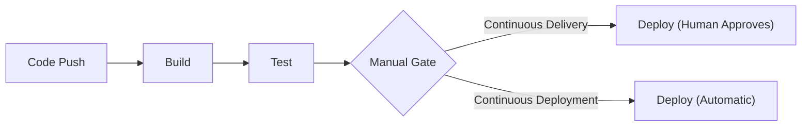
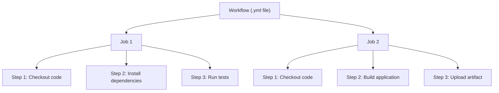

# CI/CD

CI/CD (Continuous Integration and Continuous Deployment) automates the process of testing, building, and deploying code. Instead of manually running tests and uploading files, a pipeline handles it every time you push a commit.

## What Is CI/CD?

Continuous Integration means automatically testing every code change. Continuous Deployment means automatically pushing tested code to production. Together, they form a pipeline that catches bugs early and ships changes reliably. In [Version Control](/learn/foundations/version-control/) you learned how teams use branches and pull requests to collaborate. CI/CD is what happens after you push a commit or open a PR — automated systems take over to verify, build, and deliver your changes.

## Why It Matters

Every modern engineering team uses CI/CD. It is how companies deploy dozens of times per day without breaking things. Understanding CI/CD pipelines is essential for DevOps, SRE, and any infrastructure role. When you move into [Containers](/learn/foundations/containers/) and [Infrastructure as Code](/learn/foundations/iac/), you will see that every container image build and every Terraform apply is driven by a CI/CD pipeline.

## What You'll Learn

- What CI/CD is and why it exists
- GitHub Actions: workflows, triggers, and jobs
- Writing workflow YAML files
- Using actions from the GitHub Marketplace
- Managing secrets and environment variables
- Build, test, and deploy pipelines
- Workflow best practices and debugging

---

## CI vs CD vs CD

The acronym "CI/CD" actually covers three distinct practices. Understanding the difference between them is important because they represent different levels of automation maturity.

**Continuous Integration (CI)** is the practice of automatically building and testing code every time a developer pushes a change or opens a pull request. The goal is to catch bugs as early as possible. If a test fails, the developer is notified immediately — before the code is merged.

**Continuous Delivery (CD)** extends CI by automatically preparing tested code for release to production. The entire build, test, and packaging process is automated, but a human must approve the final deployment. Think of it as "the code is always ready to ship, but someone presses the button."

**Continuous Deployment (CD)** goes one step further. After code passes all automated tests, it is deployed to production automatically with no human intervention. Every commit that passes the pipeline reaches users.

The difference between Continuous Delivery and Continuous Deployment comes down to one thing: a manual approval gate.



Most teams start with CI and Continuous Delivery. As confidence in the test suite grows, they move toward full Continuous Deployment. For the rest of this section, we will focus on GitHub Actions as the CI/CD platform and build up from simple workflows to complete deployment pipelines.

---

## Core Concepts

[GitHub Actions](https://docs.github.com/en/actions) is a CI/CD platform built directly into GitHub. When you push code to a repository that contains workflow files, GitHub reads those files and executes the instructions on cloud-hosted machines. Everything revolves around four core concepts.

### Workflows, Jobs, Steps, and Runners



A **workflow** is an automated process defined in a YAML file stored in your repository under `.github/workflows/`. A repository can have multiple workflows — one for testing, one for deployment, one for scheduled maintenance tasks.

A **job** is a group of steps that execute on the same runner. A workflow can contain multiple jobs. By default, jobs run in parallel. You can make jobs run sequentially by declaring dependencies between them.

A **step** is an individual task within a job. A step can either run a shell command or use a pre-built **action** (a reusable unit of code published to the GitHub Marketplace). Steps within a job always run sequentially — step 2 waits for step 1 to complete.

A **runner** is the machine that executes your job. GitHub provides hosted runners with common operating systems and tools pre-installed. You can also set up your own self-hosted runners for specialized hardware or security requirements.

| Concept | What It Is | Scope |
|---|---|---|
| **Workflow** | A YAML file defining the entire automation process | One `.yml` file = one workflow |
| **Job** | A group of steps that share a runner | Jobs run in parallel by default |
| **Step** | A single command or action | Steps run sequentially within a job |
| **Runner** | The machine executing the job | GitHub-hosted or self-hosted |

### GitHub-Hosted vs Self-Hosted Runners

GitHub-hosted runners are virtual machines managed by GitHub. Each job gets a fresh VM that is destroyed after the job completes. This means every job starts from a clean state — no leftover files, no stale caches, no conflicting dependencies.

| Runner | Operating System | Use Case |
|---|---|---|
| `ubuntu-latest` | Ubuntu Linux | Most common choice for CI/CD |
| `ubuntu-24.04` | Ubuntu 24.04 LTS | Pin to a specific version |
| `windows-latest` | Windows Server | .NET, PowerShell, Windows-specific builds |
| `macos-latest` | macOS | iOS/macOS builds, Swift, Xcode |

Self-hosted runners are machines you manage yourself. You might use them when you need GPU access, specific hardware, access to internal networks, or want to avoid per-minute billing on large workloads. Self-hosted runners keep their state between jobs, which means faster builds (caches persist) but also more maintenance responsibility.

For learning and most open-source projects, GitHub-hosted runners are the right choice.

---

## Your First Workflow

Workflow files live in the `.github/workflows/` directory at the root of your repository. The file must be valid YAML and use a `.yml` or `.yaml` extension — see the [workflow syntax reference](https://docs.github.com/en/actions/using-workflows/workflow-syntax-for-github-actions) for every available key. Let us build a simple CI workflow that checks out code, installs Python dependencies, and runs tests.

Create the file at `.github/workflows/ci.yml`:

```yaml
name: CI

on:
  push:
    branches: [main]
  pull_request:
    branches: [main]

jobs:
  test:
    runs-on: ubuntu-latest

    steps:
      - name: Checkout code
        uses: actions/checkout@v4

      - name: Set up Python
        uses: actions/setup-python@v5
        with:
          python-version: "3.12"

      - name: Install dependencies
        run: |
          python -m pip install --upgrade pip
          pip install -r requirements.txt

      - name: Run tests
        run: pytest
```

### Line-by-Line Walkthrough

**`name: CI`** — A human-readable name for the workflow. This appears in the GitHub Actions tab of your repository.

**`on:`** — Defines the events that trigger this workflow. Here, it runs on every push to `main` and every pull request targeting `main`.

**`jobs:`** — The top-level key under which all jobs are defined.

**`test:`** — The identifier for this job. You choose the name. It is used to reference the job elsewhere in the workflow.

**`runs-on: ubuntu-latest`** — This job runs on a GitHub-hosted Ubuntu runner. Each run gets a fresh virtual machine.

**`steps:`** — The ordered list of tasks this job performs.

**`- name: Checkout code`** — Each step can have a descriptive name that appears in the workflow logs.

**`uses: actions/checkout@v4`** — This step uses a pre-built action from the GitHub Marketplace. `actions/checkout` clones your repository onto the runner so subsequent steps can access your code. The `@v4` pins the action to major version 4.

**`uses: actions/setup-python@v5`** — Installs and configures a specific Python version on the runner.

**`with:`** — Passes input parameters to the action. Here, `python-version: "3.12"` tells the setup action which Python version to install.

**`run:`** — Executes a shell command directly. The `|` character after `run:` allows multi-line commands. Each line runs as a separate command in the same shell session.

**`run: pytest`** — Runs the pytest test framework. If any test fails, this step exits with a non-zero code, the job fails, and the workflow reports failure on the pull request.

> **Try It**: Create a new GitHub repository with a simple Python project. Add a `requirements.txt` with `pytest` as a dependency. Create a `test_example.py` file with a basic test (`def test_addition(): assert 1 + 1 == 2`). Add the workflow file above at `.github/workflows/ci.yml`. Push everything to `main` and watch the Actions tab in GitHub to see your workflow run.

---

## Triggers

Triggers define **when** a workflow runs. The `on` key supports a wide range of events, but four are used most often.

### Push and Pull Request

The most common triggers. `push` fires when commits are pushed to a branch. `pull_request` fires when a PR is opened, updated, or synchronized against a target branch.

```yaml
on:
  push:
    branches: [main, develop]
  pull_request:
    branches: [main]
```

### Schedule (Cron)

Run workflows on a schedule using cron syntax. This is useful for nightly builds, periodic security scans, or dependency update checks.

```yaml
on:
  schedule:
    - cron: "0 6 * * 1"  # Every Monday at 6:00 AM UTC
```

Cron syntax uses five fields: minute, hour, day-of-month, month, day-of-week. A few common patterns:

| Cron Expression | Schedule |
|---|---|
| `"0 0 * * *"` | Every day at midnight UTC |
| `"0 6 * * 1"` | Every Monday at 6:00 AM UTC |
| `"30 2 * * 1-5"` | Weekdays at 2:30 AM UTC |
| `"0 */4 * * *"` | Every 4 hours |

### Manual Dispatch

`workflow_dispatch` lets you trigger a workflow manually from the GitHub UI or the `gh` CLI. You can define input parameters that the user provides at trigger time.

```yaml
on:
  workflow_dispatch:
    inputs:
      environment:
        description: "Target environment"
        required: true
        default: "staging"
        type: choice
        options:
          - staging
          - production
```

Trigger it from the command line:

```bash
gh workflow run deploy.yml -f environment=staging
```

### Branch and Path Filtering

You can narrow triggers so workflows only run when specific branches or file paths are affected. This prevents unnecessary builds — a change to documentation should not trigger a full test suite.

```yaml
on:
  push:
    branches:
      - main
      - "release/**"
    paths:
      - "src/**"
      - "tests/**"
      - "requirements.txt"
    paths-ignore:
      - "docs/**"
      - "*.md"
```

The `branches` filter restricts the trigger to the listed branches. The `paths` filter restricts it to pushes that modify files matching the patterns. The `paths-ignore` filter excludes matching paths. You can use `paths` or `paths-ignore` but not both on the same trigger.

> **Try It**: Modify your `ci.yml` workflow to add path filtering so it only runs when files in `src/` or `tests/` change. Push a change to a `README.md` file and confirm the workflow does **not** trigger. Then push a change to a Python file under `src/` and confirm it does trigger.

---

## Jobs and Runners

Jobs are the building blocks of a workflow. Each job runs on its own runner, gets its own filesystem, and can be configured independently.

### Parallel vs Sequential Jobs

By default, jobs in a workflow run in parallel. To make a job wait for another job to complete, use the `needs` keyword.

```yaml
jobs:
  lint:
    runs-on: ubuntu-latest
    steps:
      - uses: actions/checkout@v4
      - run: pip install flake8 && flake8 src/

  test:
    runs-on: ubuntu-latest
    needs: lint
    steps:
      - uses: actions/checkout@v4
      - run: pip install -r requirements.txt && pytest

  build:
    runs-on: ubuntu-latest
    needs: test
    steps:
      - uses: actions/checkout@v4
      - run: python setup.py sdist bdist_wheel
```

In this example, `lint` runs first. `test` waits for `lint` to succeed. `build` waits for `test` to succeed. If `lint` fails, neither `test` nor `build` will run. This saves compute time and gives fast feedback.

You can also fan out and fan in:

```yaml
jobs:
  lint:
    runs-on: ubuntu-latest
    steps:
      - uses: actions/checkout@v4
      - run: flake8 src/

  test-unit:
    runs-on: ubuntu-latest
    steps:
      - uses: actions/checkout@v4
      - run: pytest tests/unit/

  test-integration:
    runs-on: ubuntu-latest
    steps:
      - uses: actions/checkout@v4
      - run: pytest tests/integration/

  deploy:
    runs-on: ubuntu-latest
    needs: [lint, test-unit, test-integration]
    steps:
      - run: echo "All checks passed. Deploying..."
```

Here, `lint`, `test-unit`, and `test-integration` all run in parallel. `deploy` only runs after all three succeed.

### Matrix Strategy

A matrix lets you run the same job with different configurations — multiple Python versions, multiple operating systems, or both. GitHub Actions creates a separate job run for each combination.

```yaml
jobs:
  test:
    runs-on: ${{ matrix.os }}
    strategy:
      matrix:
        os: [ubuntu-latest, macos-latest, windows-latest]
        python-version: ["3.10", "3.11", "3.12"]

    steps:
      - uses: actions/checkout@v4

      - name: Set up Python ${{ matrix.python-version }}
        uses: actions/setup-python@v5
        with:
          python-version: ${{ matrix.python-version }}

      - name: Install dependencies
        run: pip install -r requirements.txt

      - name: Run tests
        run: pytest
```

This generates 9 job runs (3 operating systems multiplied by 3 Python versions). Matrix builds are essential for libraries that need to work across multiple environments. You can exclude specific combinations or include additional ones:

```yaml
strategy:
  matrix:
    os: [ubuntu-latest, macos-latest]
    python-version: ["3.11", "3.12"]
    exclude:
      - os: macos-latest
        python-version: "3.11"
    include:
      - os: ubuntu-latest
        python-version: "3.13"
        experimental: true
```

The `fail-fast` option (default: `true`) cancels all in-progress matrix jobs as soon as one fails. Set it to `false` if you want to see the full results for every combination:

```yaml
strategy:
  fail-fast: false
  matrix:
    python-version: ["3.10", "3.11", "3.12"]
```

> **Try It**: Take your CI workflow and add a matrix strategy that tests with Python 3.11 and 3.12 on `ubuntu-latest`. Push the change and check the Actions tab — you should see two parallel job runs, one for each Python version.

### Running Jobs in Containers

You can run an entire job inside a Docker container, giving you full control over the execution environment:

```yaml
jobs:
  test:
    runs-on: ubuntu-latest
    container:
      image: python:3.12-slim
      env:
        DATABASE_URL: postgres://postgres:password@db:5432/test

    services:
      db:
        image: postgres:16
        env:
          POSTGRES_PASSWORD: password
        ports:
          - 5432:5432

    steps:
      - uses: actions/checkout@v4
      - run: pip install -r requirements.txt
      - run: pytest
```

The `container` key runs your job steps inside the specified Docker image. The `services` key starts companion containers (databases, caches) that your job can connect to by hostname. This is powerful for integration testing.

---

## Actions from the Marketplace

Actions are reusable units of code that perform common tasks. Instead of writing shell commands for every operation, you use pre-built actions from the [Actions Marketplace](https://github.com/marketplace?type=actions) maintained by GitHub, verified publishers, or the community.

### How to Use an Action

Reference an action with the `uses` keyword. The format is `owner/repo@version`:

```yaml
- uses: actions/checkout@v4
```

The `@v4` is a version tag. Always pin to at least a major version to avoid breaking changes. For maximum reproducibility, you can pin to a specific commit SHA:

```yaml
- uses: actions/checkout@b4ffde65f46336ab88eb53be808477a3936bae11
```

### Common Actions

These actions appear in almost every workflow:

| Action | Purpose | Example |
|---|---|---|
| `actions/checkout@v4` | Clone the repository onto the runner | Required in virtually every job |
| `actions/setup-python@v5` | Install a specific Python version | `with: python-version: "3.12"` |
| `actions/setup-node@v4` | Install a specific Node.js version | `with: node-version: "20"` |
| `actions/cache@v4` | Cache dependencies between runs | Speeds up `pip install`, `npm install` |
| `actions/upload-artifact@v4` | Save files from a job (build output, logs) | Pass artifacts between jobs |
| `actions/download-artifact@v4` | Retrieve artifacts saved by another job | Use in deploy jobs |
| `github/codeql-action/analyze@v3` | Run CodeQL security analysis | Automated vulnerability scanning |
| `docker/build-push-action@v6` | Build and push Docker images | Used in [Containers](/learn/foundations/containers/) pipelines |

### Caching Dependencies

Installing dependencies is often the slowest step in a workflow. The `actions/cache` action stores files between workflow runs so you do not download them from scratch every time.

```yaml
- name: Cache pip packages
  uses: actions/cache@v4
  with:
    path: ~/.cache/pip
    key: ${{ runner.os }}-pip-${{ hashFiles('requirements.txt') }}
    restore-keys: |
      ${{ runner.os }}-pip-

- name: Install dependencies
  run: pip install -r requirements.txt
```

The `key` is built from the operating system and a hash of `requirements.txt`. When `requirements.txt` changes, the hash changes, and a fresh cache is created. The `restore-keys` provide fallback patterns — if an exact match is not found, GitHub looks for partial matches.

For Node.js projects, the `actions/setup-node` action has built-in caching:

```yaml
- uses: actions/setup-node@v4
  with:
    node-version: "20"
    cache: "npm"
```

> **Try It**: Add dependency caching to your CI workflow using `actions/cache`. Run the workflow twice and compare the duration of the "Install dependencies" step. The second run should be noticeably faster.

---

## Secrets and Environment Variables

Workflows often need access to credentials (API keys, deployment tokens) and configuration values. GitHub Actions provides mechanisms for both.

### Environment Variables

Set environment variables at three levels — workflow, job, or step. More specific levels override broader ones.

```yaml
env:
  APP_NAME: my-application          # workflow level

jobs:
  build:
    runs-on: ubuntu-latest
    env:
      NODE_ENV: production           # job level
    steps:
      - name: Print environment
        env:
          LOG_LEVEL: debug           # step level
        run: |
          echo "App: $APP_NAME"
          echo "Node env: $NODE_ENV"
          echo "Log level: $LOG_LEVEL"
```

### Secrets

[Secrets](https://docs.github.com/en/actions/security-guides/using-secrets-in-github-actions) store sensitive values like API keys, tokens, and passwords. They are encrypted and never exposed in logs. GitHub automatically masks secret values in workflow output.

To add a secret:

1. Navigate to your repository on GitHub.
2. Go to **Settings** > **Secrets and variables** > **Actions**.
3. Click **New repository secret**.
4. Enter a name (e.g., `DEPLOY_TOKEN`) and the secret value.
5. Click **Add secret**.

Reference secrets in your workflow using the `secrets` context:

```yaml
steps:
  - name: Deploy to production
    run: ./deploy.sh
    env:
      DEPLOY_TOKEN: ${{ secrets.DEPLOY_TOKEN }}
      AWS_ACCESS_KEY_ID: ${{ secrets.AWS_ACCESS_KEY_ID }}
      AWS_SECRET_ACCESS_KEY: ${{ secrets.AWS_SECRET_ACCESS_KEY }}
```

Important rules for secrets:

- Secrets are not available to workflows triggered by pull requests from forks (to prevent malicious PRs from stealing your credentials).
- You cannot read the value of a secret after saving it. You can only update or delete it.
- If a secret is accidentally printed in a log, GitHub will attempt to mask it, but you should treat any exposed secret as compromised and rotate it immediately.

### Context Variables

GitHub Actions provides built-in context objects with information about the workflow run, repository, and event. These are accessed using the `${{ }}` expression syntax.

| Context | Variable | Description |
|---|---|---|
| `github` | `${{ github.repository }}` | Owner and repository name (e.g., `user/repo`) |
| `github` | `${{ github.ref }}` | The branch or tag ref that triggered the workflow |
| `github` | `${{ github.sha }}` | The full commit SHA that triggered the workflow |
| `github` | `${{ github.actor }}` | The username that triggered the workflow |
| `github` | `${{ github.event_name }}` | The event that triggered the workflow (e.g., `push`) |
| `github` | `${{ github.run_number }}` | A unique number for each run of the workflow |
| `runner` | `${{ runner.os }}` | The operating system of the runner (`Linux`, `Windows`, `macOS`) |
| `env` | `${{ env.VARIABLE_NAME }}` | Access an environment variable in expression context |
| `secrets` | `${{ secrets.SECRET_NAME }}` | Access a repository or organization secret |
| `matrix` | `${{ matrix.python-version }}` | Current value from the matrix strategy |

You can use these contexts in conditionals, step names, and anywhere expressions are accepted:

```yaml
- name: Print commit info
  run: |
    echo "Repository: ${{ github.repository }}"
    echo "Branch: ${{ github.ref }}"
    echo "Commit: ${{ github.sha }}"
    echo "Triggered by: ${{ github.actor }}"
```

---

## Complete Pipeline Example

Now let us put everything together into a realistic multi-job workflow. This pipeline lints the code, runs tests, builds an artifact, and deploys to production — but only when changes are merged to `main`.

```yaml
name: CI/CD Pipeline

on:
  push:
    branches: [main]
  pull_request:
    branches: [main]

env:
  PYTHON_VERSION: "3.12"

jobs:
  lint:
    name: Lint
    runs-on: ubuntu-latest
    steps:
      - name: Checkout code
        uses: actions/checkout@v4

      - name: Set up Python
        uses: actions/setup-python@v5
        with:
          python-version: ${{ env.PYTHON_VERSION }}

      - name: Install linters
        run: pip install flake8 black isort

      - name: Check formatting with Black
        run: black --check src/

      - name: Check import order with isort
        run: isort --check-only src/

      - name: Lint with flake8
        run: flake8 src/

  test:
    name: Test
    runs-on: ubuntu-latest
    needs: lint
    strategy:
      matrix:
        python-version: ["3.11", "3.12"]
    steps:
      - name: Checkout code
        uses: actions/checkout@v4

      - name: Set up Python ${{ matrix.python-version }}
        uses: actions/setup-python@v5
        with:
          python-version: ${{ matrix.python-version }}

      - name: Cache pip packages
        uses: actions/cache@v4
        with:
          path: ~/.cache/pip
          key: ${{ runner.os }}-pip-${{ hashFiles('requirements.txt') }}
          restore-keys: |
            ${{ runner.os }}-pip-

      - name: Install dependencies
        run: |
          python -m pip install --upgrade pip
          pip install -r requirements.txt

      - name: Run tests with coverage
        run: pytest --cov=src/ --cov-report=xml

      - name: Upload coverage report
        uses: actions/upload-artifact@v4
        with:
          name: coverage-${{ matrix.python-version }}
          path: coverage.xml

  build:
    name: Build
    runs-on: ubuntu-latest
    needs: test
    steps:
      - name: Checkout code
        uses: actions/checkout@v4

      - name: Set up Python
        uses: actions/setup-python@v5
        with:
          python-version: ${{ env.PYTHON_VERSION }}

      - name: Build package
        run: |
          pip install build
          python -m build

      - name: Upload build artifact
        uses: actions/upload-artifact@v4
        with:
          name: dist
          path: dist/

  deploy:
    name: Deploy
    runs-on: ubuntu-latest
    needs: build
    if: github.ref == 'refs/heads/main' && github.event_name == 'push'
    environment: production
    steps:
      - name: Download build artifact
        uses: actions/download-artifact@v4
        with:
          name: dist
          path: dist/

      - name: Deploy to production
        run: |
          echo "Deploying version ${{ github.sha }} to production..."
          echo "Artifact contents:"
          ls -la dist/
        env:
          DEPLOY_TOKEN: ${{ secrets.DEPLOY_TOKEN }}
```

### Walkthrough

**Lint job**: Runs first. Checks code formatting (Black), import ordering (isort), and linting rules (flake8). If any check fails, the pipeline stops immediately. Fast feedback — formatting errors are caught in seconds.

**Test job**: Waits for lint to pass (`needs: lint`). Runs tests on Python 3.11 and 3.12 using a matrix strategy. Caches pip packages for speed. Generates a coverage report and uploads it as an artifact so it can be viewed later.

**Build job**: Waits for tests to pass (`needs: test`). Builds a distributable package and uploads it as an artifact.

**Deploy job**: Waits for the build to pass (`needs: build`). The `if` conditional is critical — this job only runs on pushes to `main`, not on pull requests. Pull requests run the lint, test, and build jobs to verify correctness, but they never deploy. The `environment: production` key enables GitHub's environment protection rules (required reviewers, wait timers) if you configure them.

This pattern — lint, test, build, conditionally deploy — is the standard CI/CD pipeline structure you will encounter at most companies.

> **Try It**: Create a multi-job workflow with at least three jobs: `lint`, `test`, and `build`. Use `needs` to chain them sequentially. Open a pull request and observe that all three jobs run. Merge the PR and check whether you can add a conditional deploy job that only runs on `main`.

### Deployment Environments and Approvals

For production deployments, you can require manual approval using [GitHub Environments](https://docs.github.com/en/actions/deployment/targeting-different-environments/using-environments-for-deployment):

```yaml
jobs:
  deploy-staging:
    runs-on: ubuntu-latest
    environment: staging
    steps:
      - run: ./deploy.sh staging

  deploy-production:
    needs: deploy-staging
    runs-on: ubuntu-latest
    environment:
      name: production
      url: https://myapp.example.com
    steps:
      - run: ./deploy.sh production
```

When the `production` environment has required reviewers configured in your repository settings, the workflow pauses and waits for a team member to click "Approve" before proceeding. This adds a human gate to your deployment pipeline.

---

## Debugging Workflows

Workflows fail. Dependencies break, permissions are wrong, secrets are missing, and tests are flaky. Knowing how to debug quickly is a critical skill.

### Reading Workflow Logs

When a workflow runs, GitHub records detailed logs for every step. To view them:

1. Go to the **Actions** tab in your repository.
2. Click on the specific workflow run.
3. Click on the failed job.
4. Expand the failed step to see its output.

Each step shows its standard output and standard error. Look for error messages, stack traces, and exit codes. The step that failed will be marked with a red icon.

### Enabling Debug Logging

For more detailed output, enable step-level debug logging by adding a repository secret:

| Secret Name | Value | Effect |
|---|---|---|
| `ACTIONS_STEP_DEBUG` | `true` | Shows detailed debug output for every step |
| `ACTIONS_RUNNER_DEBUG` | `true` | Shows runner-level diagnostic logs |

These settings produce verbose output, so enable them only when troubleshooting and disable them when you are done.

### Re-Running Failed Jobs

You do not need to push a new commit to re-run a failed workflow. From the Actions tab, click **Re-run jobs** on a failed workflow run. You can re-run all jobs or only the failed ones. This is useful when a failure was caused by a transient issue (network timeout, flaky test, temporary service outage).

### Common Failures

This table covers the most frequent issues you will encounter:

| Problem | Symptom | Fix |
|---|---|---|
| **Missing checkout** | `file not found` errors in build/test steps | Add `actions/checkout@v4` as the first step in the job |
| **Missing secret** | Empty string where a token is expected; authentication failures | Verify the secret name matches exactly (case-sensitive). Check that the secret exists in the repository settings |
| **Permission denied** | `403` errors when pushing, deploying, or accessing APIs | Check repository permissions under **Settings > Actions > General**. Ensure `GITHUB_TOKEN` has sufficient permissions |
| **Wrong runner** | Linux commands fail on Windows runners, or vice versa | Verify `runs-on` matches the OS your commands expect |
| **Environment mismatch** | Tests pass locally but fail in CI | Check Python/Node version, OS differences, missing system packages. Use the same version in CI as in local development |
| **Path issues** | Files not found despite being in the repo | Remember that each job starts from the repository root after checkout. Verify relative paths |
| **Timeout** | Job runs for 6 hours and is killed | Add a `timeout-minutes` key to the job. Investigate infinite loops or hanging processes |
| **Cache miss** | Dependencies install from scratch every time | Verify the `key` pattern in `actions/cache`. Check that `hashFiles()` points to the correct file |

### Adding Debugging Steps

When you cannot figure out what is going wrong, add temporary steps to inspect the environment:

```yaml
- name: Debug environment
  run: |
    echo "Current directory: $(pwd)"
    echo "Files in workspace:"
    ls -la
    echo "Python version: $(python --version)"
    echo "Environment variables:"
    env | sort

- name: Debug GitHub context
  run: |
    echo "Event: ${{ github.event_name }}"
    echo "Ref: ${{ github.ref }}"
    echo "SHA: ${{ github.sha }}"
    echo "Actor: ${{ github.actor }}"
```

Remove these steps once the issue is resolved. They clutter the logs and can inadvertently leak information.

### The GITHUB_TOKEN

Every workflow run automatically receives a `GITHUB_TOKEN` with permissions scoped to the repository. This token is used for operations like pushing to the repository, creating releases, or commenting on pull requests. You can adjust its permissions in the workflow:

```yaml
permissions:
  contents: read
  pull-requests: write
```

Follow the principle of least privilege — only grant the permissions your workflow actually needs. The default permissions can be configured at the repository or organization level under **Settings > Actions > General > Workflow permissions**.

> **Try It**: Intentionally break your workflow by misspelling a dependency name in `requirements.txt`. Push the change, let the workflow fail, and practice reading the logs. Identify the exact step and error message. Fix the typo and push again to see the workflow succeed. Then add the `ACTIONS_STEP_DEBUG` secret, re-run the failed workflow, and compare the log verbosity.

---

## Workflow Best Practices

As you build more workflows, these practices will keep your pipelines fast, reliable, and maintainable.

**Pin action versions.** Always use a version tag (`@v4`) or commit SHA. Never use `@main` or `@latest` — a breaking change upstream would silently break your pipeline.

**Keep workflows focused.** One workflow per concern: `ci.yml` for testing, `deploy.yml` for deployment, `codeql.yml` for security scanning. Avoid monolithic workflows that do everything.

**Use `needs` to fail fast.** Put cheap, fast checks (linting, formatting) before expensive checks (integration tests, builds). If formatting is wrong, there is no point running a 20-minute test suite.

**Cache aggressively.** Cache dependencies, build artifacts, and anything that is expensive to recreate. The `actions/cache` action and built-in caching in `actions/setup-node` and `actions/setup-python` can cut workflow duration in half.

**Use matrix builds wisely.** Test across multiple versions and operating systems for libraries, but a single configuration is usually sufficient for application code.

**Protect secrets.** Never echo secrets, never pass them as command-line arguments (they appear in process listings), and always use the `secrets` context. Rotate secrets regularly.

**Set timeout limits.** Add `timeout-minutes` to jobs to prevent runaway processes from consuming your Actions minutes:

```yaml
jobs:
  test:
    runs-on: ubuntu-latest
    timeout-minutes: 15
```

**Use environments for deployment.** GitHub environments let you add required reviewers, wait timers, and deployment branch restrictions. This gives you Continuous Delivery with a manual approval gate when you need it.

> **Try It**: Review a CI/CD workflow in a popular open-source project on GitHub. Look at how they structure jobs, what actions they use, how they handle caching, and whether they use matrix builds. Compare their approach to what you have learned in this section.

---

## Reusable Workflows

As your organization grows, you will find yourself duplicating workflow logic across repositories. [Reusable workflows](https://docs.github.com/en/actions/using-workflows/reusing-workflows) solve this by letting you call one workflow from another.

### Creating a Reusable Workflow

A reusable workflow uses the `workflow_call` trigger:

```yaml
# .github/workflows/test-and-lint.yml (in a shared repo)
name: Test and Lint
on:
  workflow_call:
    inputs:
      node-version:
        required: false
        type: string
        default: '20'

jobs:
  test:
    runs-on: ubuntu-latest
    steps:
      - uses: actions/checkout@v4
      - uses: actions/setup-node@v4
        with:
          node-version: ${{ inputs.node-version }}
      - run: npm ci
      - run: npm test
      - run: npm run lint
```

### Calling a Reusable Workflow

```yaml
# .github/workflows/ci.yml (in any repo)
name: CI
on: [push, pull_request]

jobs:
  test:
    uses: my-org/shared-workflows/.github/workflows/test-and-lint.yml@main
    with:
      node-version: '20'
```

This keeps your CI logic DRY (Don't Repeat Yourself) and ensures all repositories follow the same testing standards. When you update the shared workflow, every repository that calls it gets the update.

---

## OIDC for Cloud Authentication

Storing cloud credentials (AWS keys, Azure service principal secrets) as GitHub secrets works but has drawbacks — secrets can leak, they need rotation, and they provide long-lived access.

**OIDC (OpenID Connect)** provides a better approach: GitHub Actions authenticates directly with your cloud provider using short-lived tokens, with no stored secrets.

```yaml
# Example: Deploy to AWS without storing AWS keys
name: Deploy
on:
  push:
    branches: [main]

permissions:
  id-token: write    # Required for OIDC
  contents: read

jobs:
  deploy:
    runs-on: ubuntu-latest
    steps:
      - uses: actions/checkout@v4
      - uses: aws-actions/configure-aws-credentials@v4
        with:
          role-to-assume: arn:aws:iam::123456789012:role/GitHubActionsRole
          aws-region: us-east-1
      - run: aws s3 sync ./build s3://my-bucket
```

How it works:
1. GitHub generates a short-lived OIDC token for the workflow run
2. The workflow exchanges this token with the cloud provider (AWS, Azure, GCP)
3. The cloud provider verifies the token and issues temporary credentials
4. Credentials expire after the workflow completes

This is the recommended approach for production deployments. No long-lived secrets to manage, rotate, or worry about leaking. See [GitHub OIDC documentation](https://docs.github.com/en/actions/deployment/security-hardening-your-deployments/about-security-hardening-with-openid-connect) for setup details.

---

## Concurrency Control

By default, multiple workflow runs can execute simultaneously. The `concurrency` key prevents overlapping runs:

```yaml
name: Deploy
on:
  push:
    branches: [main]

concurrency:
  group: deploy-production
  cancel-in-progress: false    # Don't cancel running deploys

jobs:
  deploy:
    runs-on: ubuntu-latest
    steps:
      - uses: actions/checkout@v4
      - run: ./deploy.sh
```

With `cancel-in-progress: true`, a new push cancels the previous run — useful for CI (you only care about the latest code). With `false`, the new run waits — safer for deployments where you don't want partial deploys.

---

## Key Takeaways

- CI/CD automates the loop from code change to production. Continuous Integration tests every change, Continuous Delivery keeps code release-ready, and Continuous Deployment ships automatically.
- GitHub Actions is built into GitHub. Workflows are YAML files in `.github/workflows/` that define triggers, jobs, and steps.
- Workflows are triggered by events — pushes, pull requests, schedules, and manual dispatch. Branch and path filtering prevents unnecessary runs.
- Jobs run on runners. GitHub-hosted runners provide clean VMs for every run. Use `needs` to chain jobs sequentially and `strategy.matrix` to test across multiple configurations.
- Actions from the GitHub Marketplace handle common tasks. `actions/checkout`, `actions/setup-python`, and `actions/cache` appear in nearly every workflow.
- Secrets are encrypted and never exposed in logs. Store credentials in GitHub repository settings and access them with `${{ secrets.SECRET_NAME }}`. Context variables like `${{ github.sha }}` provide workflow metadata.
- A standard pipeline flows from lint to test to build to deploy. The deploy job should be conditional on the `main` branch to prevent accidental deployments from pull requests.
- Debug workflows by reading logs, enabling `ACTIONS_STEP_DEBUG`, and adding temporary inspection steps. Most failures come from missing checkouts, wrong permissions, environment mismatches, or missing secrets.
- Follow best practices: pin action versions, cache dependencies, fail fast with `needs`, set timeouts, protect secrets, and use GitHub environments for deployment gates.

## Resources & Further Reading

- [GitHub Actions Documentation](https://docs.github.com/en/actions)
- [GitHub Actions Marketplace](https://github.com/marketplace?type=actions)
- [Workflow Syntax Reference](https://docs.github.com/en/actions/using-workflows/workflow-syntax-for-github-actions)
- [Actions Security Hardening](https://docs.github.com/en/actions/security-guides/security-hardening-for-github-actions)
- [Martin Fowler: Continuous Integration](https://martinfowler.com/articles/continuousIntegration.html)
