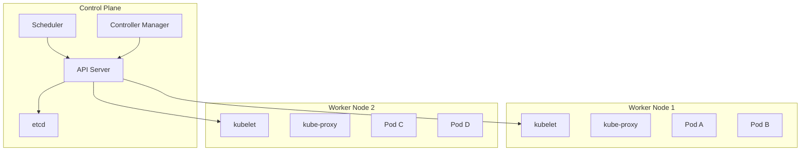
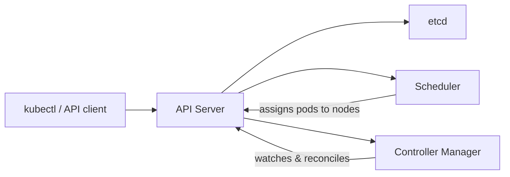
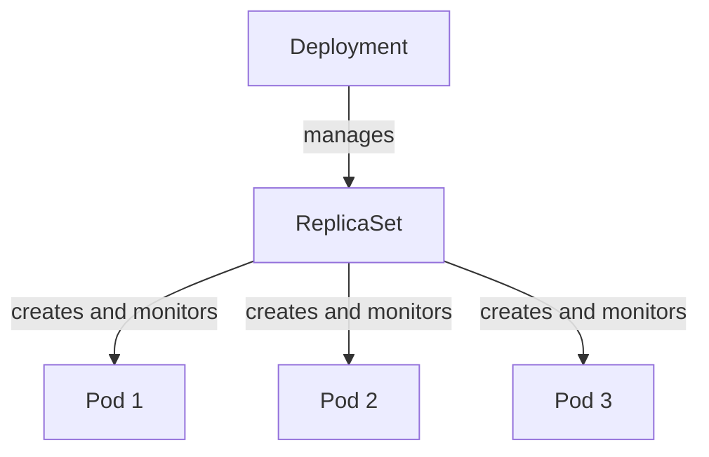

# Container Orchestration

Running a single container is straightforward. Running hundreds of containers across multiple servers, handling failures, scaling up and down, and managing networking between them — that requires an orchestration platform. Kubernetes is the industry standard.

## What Is Container Orchestration?

Container orchestration automates the deployment, scaling, and management of containerized applications across a cluster of machines. Instead of manually starting containers on individual servers and wiring them together, an orchestration platform handles scheduling containers across nodes, restarting failed containers, load balancing traffic, rolling out updates with zero downtime, and managing the networking that lets containers find and talk to each other. Kubernetes (often abbreviated K8s) is the dominant orchestration platform, originally developed by Google and now maintained by the Cloud Native Computing Foundation (CNCF).

## Why It Matters

Kubernetes is the backbone of modern cloud-native infrastructure. Every major cloud provider offers a managed Kubernetes service — Amazon EKS, Google GKE, and Azure AKS — and most large-scale production deployments run on it. Understanding Kubernetes is essential for any infrastructure, DevOps, or SRE career path. Even if you end up using a managed platform that abstracts some of the complexity, knowing what is happening underneath makes you dramatically more effective at debugging, optimizing, and designing systems.

## What You'll Learn

- Kubernetes architecture: control plane and worker nodes
- Pods, Deployments, and ReplicaSets
- Services and networking within a cluster
- Namespaces for resource isolation
- Writing and applying YAML manifests
- Using `kubectl` to manage workloads
- ConfigMaps and Secrets
- Declarative vs imperative workflow patterns

---

## Why Orchestration?

In the [Containers](/learn/foundations/containers/) section, you learned how to build and run containers with Docker. You used Docker Compose to run multi-container applications on a single host. That works for development and small deployments, but production environments introduce problems that Docker alone cannot solve.

Consider what happens when your application grows:

- **Scheduling**: You have 50 containers to run across 10 servers. Which container goes where? How do you balance the load across machines? How do you avoid placing two memory-heavy containers on the same node?
- **Scaling**: Traffic spikes at 9 a.m. every morning. You need more copies of your web frontend. At midnight, traffic drops and those extra copies waste money.
- **Self-healing**: A container crashes. Someone needs to notice, restart it, and route traffic away from the broken instance. At 3 a.m., that someone should not be you.
- **Service discovery**: Your API container needs to find the database container. Containers get new IP addresses every time they restart. Hardcoding addresses is impossible.
- **Rolling updates**: You have a new version of your application. You need to deploy it without dropping a single request from users.

Kubernetes solves all of these problems. It is not the only orchestrator (Docker Swarm and Nomad are alternatives), but it has become the industry default by a wide margin.

### Docker Compose vs Kubernetes

If you completed the Containers section, you used Docker Compose. The following table clarifies when each tool fits.

| Feature | Docker Compose | Kubernetes |
|---|---|---|
| Scope | Single host | Cluster of many hosts |
| Scaling | Manual (`replicas` in compose file) | Automatic (Horizontal Pod Autoscaler) |
| Self-healing | Limited restart policies | Full self-healing with health checks |
| Service discovery | Docker DNS on a single host | Cluster-wide DNS and Services |
| Rolling updates | Recreate containers | Zero-downtime rolling deployments |
| Load balancing | None built-in | Built-in Service load balancing |
| Best for | Local development, small apps | Production workloads at scale |

Docker Compose is excellent for local development. Kubernetes is what runs those same containers in production.

---

## Kubernetes Architecture

A Kubernetes **cluster** is a set of machines (physical or virtual) that work together to run containerized workloads. The cluster has two types of components: the **control plane**, which makes decisions about the cluster, and the **worker nodes**, which run your actual application containers.

### Cluster Overview



### Control Plane Components

The control plane is the brain of the cluster. In managed Kubernetes services (EKS, GKE, AKS), the cloud provider runs the control plane for you. Understanding what each component does is still essential for debugging and understanding cluster behavior.

| Component | Role |
|---|---|
| **API Server** (`kube-apiserver`) | The front door to the cluster. Every interaction — from `kubectl` commands to internal components communicating — goes through the API Server. It validates and processes REST requests, then stores the results in etcd. |
| **etcd** | A distributed key-value store that holds all cluster state. Every pod, service, config, and secret is stored here. If etcd is lost and not backed up, the cluster state is gone. |
| **Scheduler** (`kube-scheduler`) | Watches for newly created pods that have no node assigned and selects a node for them to run on. It considers resource requirements, hardware constraints, affinity rules, and current node load. |
| **Controller Manager** (`kube-controller-manager`) | Runs a set of controllers that watch the cluster state and make changes to move the current state toward the desired state. For example, if a Deployment specifies 3 replicas and only 2 are running, the ReplicaSet controller creates a third. |



### Worker Node Components

Worker nodes are the machines where your containers actually run. Each worker node runs a few essential components.

| Component | Role |
|---|---|
| **kubelet** | An agent running on every node. It receives pod specifications from the API Server, ensures the containers described in those specs are running and healthy, and reports status back. |
| **kube-proxy** | Manages network rules on each node. It implements Kubernetes Services by routing traffic to the correct pods, handling load balancing across pod replicas. |
| **Container runtime** | The software that actually runs containers. Kubernetes supports containerd (the most common), CRI-O, and other runtimes that implement the Container Runtime Interface (CRI). Docker itself is no longer used directly as a runtime in modern Kubernetes, though images built with Docker work fine. |

The kubelet on each node communicates with the API Server, pulling down the desired state ("run these pods on this node") and continuously ensuring the actual state matches.

---

## Local Setup

You do not need a cloud account or a multi-node cluster to learn Kubernetes. Several tools let you run a cluster on your local machine.

| Tool | Description | Best For |
|---|---|---|
| **minikube** | Runs a single-node Kubernetes cluster in a VM or container | Learning and testing; most popular for beginners |
| **kind** (Kubernetes in Docker) | Runs Kubernetes nodes as Docker containers | CI/CD pipelines and multi-node testing |
| **Docker Desktop** | Includes a built-in single-node Kubernetes cluster | Users already running Docker Desktop |

### Installing minikube

Install minikube and kubectl (the Kubernetes command-line tool):

```bash
# macOS (using Homebrew)
brew install minikube kubectl

# Linux (using curl)
curl -LO https://storage.googleapis.com/minikube/releases/latest/minikube-linux-amd64
sudo install minikube-linux-amd64 /usr/local/bin/minikube
sudo apt install -y kubectl    # or install via snap/curl

# Windows (using Chocolatey)
choco install minikube kubernetes-cli
```

### Starting a Cluster

```bash
minikube start
```

This creates a single-node cluster. It may take a minute or two the first time as it downloads the Kubernetes components.

### Verifying the Cluster

```bash
kubectl cluster-info
```

```
Kubernetes control plane is running at https://192.168.49.2:8443
CoreDNS is running at https://192.168.49.2:8443/api/v1/namespaces/kube-system/services/kube-dns:dns/proxy
```

```bash
kubectl get nodes
```

```
NAME       STATUS   ROLES           AGE   VERSION
minikube   Ready    control-plane   45s   v1.31.0
```

If you see a single node with `STATUS: Ready`, your cluster is working.

> **Try It**: Install minikube and start a cluster on your machine. Run `kubectl cluster-info` and `kubectl get nodes` to confirm everything is running. Then run `kubectl get pods -A` to see the system pods that Kubernetes runs internally (you will see components like CoreDNS and kube-proxy).

---

## Pods

A **pod** is the smallest deployable unit in Kubernetes. A pod is not a container — it is a wrapper around one or more containers that share the same network namespace and storage volumes. In practice, most pods contain a single container, but multi-container pods are used for patterns like sidecars (a logging agent running alongside your app).

Every container in a pod shares the same IP address and can communicate with other containers in the same pod via `localhost`. Pods are ephemeral — they are created, run, and eventually terminated. Kubernetes does not restart a pod; it creates a new one to replace it.

### Running a Pod Imperatively

The fastest way to create a pod is with `kubectl run`:

```bash
kubectl run nginx --image=nginx
```

```
pod/nginx created
```

### Inspecting Pods

```bash
kubectl get pods
```

```
NAME    READY   STATUS    RESTARTS   AGE
nginx   1/1     Running   0          12s
```

For more detail:

```bash
kubectl describe pod nginx
```

This prints a wall of information: the pod's node, IP address, container image, status, events (like image pull progress and container start), resource requests, and more. When a pod is not starting, `kubectl describe` is your first debugging tool. The **Events** section at the bottom tells you exactly what went wrong.

### Pod Logs

```bash
kubectl logs nginx
```

This prints the stdout/stderr output from the container. For multi-container pods, specify the container name:

```bash
kubectl logs nginx -c nginx
```

To follow logs in real time (like `tail -f`):

```bash
kubectl logs -f nginx
```

### Deleting a Pod

```bash
kubectl delete pod nginx
```

When you delete a standalone pod, it is gone. There is no controller watching it to create a replacement. This is why you almost never run standalone pods in production — you use Deployments instead.

### Pod YAML Manifest

While `kubectl run` is quick, the standard practice is to define pods in YAML manifests. Here is a minimal pod manifest:

```yaml
apiVersion: v1                    # API version for Pod resources
kind: Pod                         # the type of Kubernetes object
metadata:
  name: nginx                     # the name of this pod
  labels:
    app: nginx                    # labels are key-value pairs used for selection
spec:
  containers:
    - name: nginx                 # name of the container within the pod
      image: nginx:1.27           # container image and tag
      ports:
        - containerPort: 80       # the port the container listens on
```

Line by line:

- **`apiVersion`**: Tells Kubernetes which API version to use. Pods use `v1`.
- **`kind`**: The type of resource. Here it is `Pod`.
- **`metadata.name`**: The unique name of the pod within a namespace.
- **`metadata.labels`**: Key-value pairs attached to the pod. Labels do not affect behavior directly, but Services and Deployments use them to select which pods to manage.
- **`spec.containers`**: A list of containers to run in the pod. Each container has a name, an image, and optionally ports, environment variables, volume mounts, and resource limits.
- **`containerPort`**: Informational — it documents which port the container listens on. It does not actually expose the port outside the pod.

Apply the manifest:

```bash
kubectl apply -f pod.yaml
```

```
pod/nginx created
```

Verify:

```bash
kubectl get pods
```

> **Try It**: Save the pod YAML above to a file called `pod.yaml`. Apply it with `kubectl apply -f pod.yaml`. Run `kubectl describe pod nginx` and read through the output, especially the Events section. Check the logs with `kubectl logs nginx`. Then delete it with `kubectl delete -f pod.yaml` (deleting by file is cleaner than deleting by name because it matches exactly what you applied).

---

## Deployments

In production, you never create pods directly. You create a **Deployment**, which manages pods for you through a **ReplicaSet**. A Deployment adds three critical capabilities on top of bare pods:

- **Desired state management**: You declare "I want 3 replicas of this pod." Kubernetes ensures exactly 3 are always running.
- **Self-healing**: If a pod crashes or the node it runs on goes down, the Deployment controller automatically creates a replacement pod.
- **Rolling updates**: When you update the container image, the Deployment gradually replaces old pods with new ones, ensuring the application stays available throughout the process.

### Deployment Relationship



A Deployment creates a ReplicaSet, and the ReplicaSet creates and monitors the pods. When you update a Deployment (for example, by changing the image tag), the Deployment creates a new ReplicaSet, scales it up, and scales the old one down. This is how rolling updates work.

### Deployment YAML Manifest

```yaml
apiVersion: apps/v1                     # Deployments are in the apps/v1 API group
kind: Deployment
metadata:
  name: nginx-deployment
  labels:
    app: nginx
spec:
  replicas: 3                           # run 3 copies of the pod
  selector:
    matchLabels:
      app: nginx                        # the Deployment manages pods with this label
  template:                             # the pod template — what each replica looks like
    metadata:
      labels:
        app: nginx                      # pods must have this label to match the selector
    spec:
      containers:
        - name: nginx
          image: nginx:1.27
          ports:
            - containerPort: 80
```

Key differences from a bare pod manifest:

- **`spec.replicas`**: How many pod copies to maintain.
- **`spec.selector.matchLabels`**: Tells the Deployment which pods belong to it. This must match the labels in the pod template.
- **`spec.template`**: A pod template (essentially a pod spec without `apiVersion` and `kind`). The Deployment creates pods from this template.

The selector and template labels must match. If they do not, Kubernetes rejects the manifest.

### Applying and Inspecting

```bash
kubectl apply -f deployment.yaml
```

```
deployment.apps/nginx-deployment created
```

```bash
kubectl get deployments
```

```
NAME               READY   UP-TO-DATE   AVAILABLE   AGE
nginx-deployment   3/3     3            3           15s
```

```bash
kubectl get pods
```

```
NAME                                READY   STATUS    RESTARTS   AGE
nginx-deployment-7c5ddbdf54-2x8kp   1/1     Running   0          15s
nginx-deployment-7c5ddbdf54-9fjqw   1/1     Running   0          15s
nginx-deployment-7c5ddbdf54-v4lts   1/1     Running   0          15s
```

Notice the pod names. Each one has the Deployment name, the ReplicaSet hash, and a unique suffix. This naming pattern tells you at a glance which Deployment owns the pod.

### Scaling

Scale the number of replicas up or down:

```bash
kubectl scale deployment nginx-deployment --replicas=5
```

```bash
kubectl get pods
```

```
NAME                                READY   STATUS    RESTARTS   AGE
nginx-deployment-7c5ddbdf54-2x8kp   1/1     Running   0          2m
nginx-deployment-7c5ddbdf54-9fjqw   1/1     Running   0          2m
nginx-deployment-7c5ddbdf54-v4lts   1/1     Running   0          2m
nginx-deployment-7c5ddbdf54-abc12   1/1     Running   0          5s
nginx-deployment-7c5ddbdf54-def34   1/1     Running   0          5s
```

Two new pods appeared. Scale back down:

```bash
kubectl scale deployment nginx-deployment --replicas=3
```

Kubernetes terminates the excess pods.

### Rolling Updates

Update the container image to a new version:

```bash
kubectl set image deployment/nginx-deployment nginx=nginx:1.27.3
```

Watch the rollout progress:

```bash
kubectl rollout status deployment/nginx-deployment
```

```
Waiting for deployment "nginx-deployment" rollout to finish: 1 out of 3 new replicas have been updated...
Waiting for deployment "nginx-deployment" rollout to finish: 2 out of 3 new replicas have been updated...
deployment "nginx-deployment" successfully rolled out
```

During a rolling update, Kubernetes creates new pods with the updated image, waits for them to become healthy, and then terminates old pods. At no point are all pods down simultaneously. This is how you achieve zero-downtime deployments.

### Rollback

If the new version has a bug, roll back to the previous version:

```bash
kubectl rollout undo deployment/nginx-deployment
```

Check the rollout history to see previous revisions:

```bash
kubectl rollout history deployment/nginx-deployment
```

```
REVISION  CHANGE-CAUSE
1         <none>
2         <none>
3         <none>
```

To roll back to a specific revision:

```bash
kubectl rollout undo deployment/nginx-deployment --to-revision=1
```

> **Try It**: Save the Deployment YAML above to `deployment.yaml` and apply it. Verify 3 pods are running. Scale to 5 replicas, then back to 3. Perform a rolling update by changing the image to `nginx:1.27.3`. Watch the rollout with `kubectl rollout status`. Then roll back with `kubectl rollout undo`. Finally, delete the Deployment with `kubectl delete -f deployment.yaml` and notice that all the pods are deleted with it.

---

## Services

Pods are ephemeral. They get created, destroyed, and replaced constantly. Every new pod gets a new IP address. If your frontend needs to talk to your backend, you cannot hardcode an IP address because it will change the next time the pod restarts.

A **Service** provides a stable network endpoint for a set of pods. It gives you a fixed IP address and DNS name that persists even as the underlying pods come and go. The Service routes traffic to healthy pods using label selectors.

### Service Types

| Type | Description | Access |
|---|---|---|
| **ClusterIP** | Exposes the Service on an internal cluster IP. Only reachable from within the cluster. | Internal only |
| **NodePort** | Exposes the Service on a static port on every node's IP. Accessible externally via `<NodeIP>:<NodePort>`. | External (basic) |
| **LoadBalancer** | Provisions an external load balancer (on cloud providers). Gives you a public IP or DNS name. | External (production) |
| **ExternalName** | Maps the Service to an external DNS name. No proxying — just a CNAME alias. | DNS alias |

In production on a cloud provider, you typically use **LoadBalancer** for externally-facing services and **ClusterIP** for internal communication between microservices.

### Service YAML Manifest

```yaml
apiVersion: v1
kind: Service
metadata:
  name: nginx-service
spec:
  type: ClusterIP                       # internal-only by default
  selector:
    app: nginx                          # route traffic to pods with this label
  ports:
    - protocol: TCP
      port: 80                          # the port the Service listens on
      targetPort: 80                    # the port on the pod to forward to
```

The **selector** is the critical piece. The Service finds all pods with the label `app: nginx` and load balances traffic across them. This is why labels in your Deployment template matter — they are how Services discover pods.

The **port** is what clients connect to. The **targetPort** is the port on the pod containers. They can be different. For example, your Service might listen on port 80 but forward to port 8080 on the pods.

### Applying and Inspecting

Apply the Deployment and Service together (you can put both in the same file separated by `---`, or use separate files):

```bash
kubectl apply -f deployment.yaml
kubectl apply -f service.yaml
```

```bash
kubectl get svc
```

```
NAME            TYPE        CLUSTER-IP      EXTERNAL-IP   PORT(S)   AGE
kubernetes      ClusterIP   10.96.0.1       <none>        443/TCP   1h
nginx-service   ClusterIP   10.96.124.85    <none>        80/TCP    5s
```

The Service has been assigned a cluster IP (`10.96.124.85`). Any pod in the cluster can reach the nginx pods by connecting to `nginx-service:80` or `10.96.124.85:80`.

### Port Forwarding for Local Access

To access a ClusterIP Service from your local machine (for testing), use port forwarding:

```bash
kubectl port-forward svc/nginx-service 8080:80
```

This maps your local port 8080 to the Service's port 80. Open `http://localhost:8080` in a browser and you will see the nginx welcome page. Press `Ctrl+C` to stop the port forward.

### NodePort Example

To expose the Service externally on minikube:

```yaml
apiVersion: v1
kind: Service
metadata:
  name: nginx-nodeport
spec:
  type: NodePort
  selector:
    app: nginx
  ports:
    - protocol: TCP
      port: 80
      targetPort: 80
      nodePort: 30080                   # accessible at <NodeIP>:30080
```

On minikube, you can get the URL with:

```bash
minikube service nginx-nodeport --url
```

> **Try It**: With your nginx Deployment still running, save the ClusterIP Service YAML to `service.yaml` and apply it. Run `kubectl get svc` to see the assigned cluster IP. Use `kubectl port-forward svc/nginx-service 8080:80` and visit `http://localhost:8080` in your browser. Verify you see the nginx welcome page.

---

## Namespaces

A **namespace** is a way to divide a single Kubernetes cluster into virtual sub-clusters. Namespaces provide isolation for resources — pods, services, and deployments in one namespace do not interfere with those in another. They are commonly used to separate environments (dev, staging, production) or to organize resources by team.

### Default Namespaces

Every Kubernetes cluster comes with several namespaces out of the box:

| Namespace | Purpose |
|---|---|
| `default` | Where resources go when you do not specify a namespace |
| `kube-system` | Components that Kubernetes itself needs (CoreDNS, kube-proxy, metrics-server) |
| `kube-public` | Readable by all users, including unauthenticated ones. Contains cluster discovery info. |
| `kube-node-lease` | Holds node heartbeat data that the control plane uses to detect node failures |

### Creating and Using Namespaces

Create a namespace:

```bash
kubectl create namespace staging
```

List all namespaces:

```bash
kubectl get namespaces
```

```
NAME              STATUS   AGE
default           Active   1h
kube-node-lease   Active   1h
kube-public       Active   1h
kube-system       Active   1h
staging           Active   5s
```

Run a pod in a specific namespace:

```bash
kubectl run nginx --image=nginx -n staging
```

List pods in the staging namespace:

```bash
kubectl get pods -n staging
```

List pods across all namespaces:

```bash
kubectl get pods -A
```

### Setting a Default Namespace

If you are working primarily in the `staging` namespace, you can set it as the default so you do not have to type `-n staging` every time:

```bash
kubectl config set-context --current --namespace=staging
```

Now commands like `kubectl get pods` will default to the `staging` namespace. Switch back to `default` with:

```bash
kubectl config set-context --current --namespace=default
```

### Namespaces in YAML

You can specify the namespace in a manifest's metadata:

```yaml
apiVersion: v1
kind: Pod
metadata:
  name: nginx
  namespace: staging
  labels:
    app: nginx
spec:
  containers:
    - name: nginx
      image: nginx:1.27
```

When you `kubectl apply -f` this manifest, the pod is created in the `staging` namespace regardless of your current context.

---

## ConfigMaps and Secrets

Applications need configuration: database URLs, feature flags, API keys, TLS certificates. Hardcoding these values into container images is inflexible and insecure. Kubernetes provides two resources for externalizing configuration: **ConfigMaps** for non-sensitive data and **Secrets** for sensitive data.

### ConfigMaps

A ConfigMap holds key-value pairs of configuration data.

#### Creating from the Command Line

```bash
# from literal key-value pairs
kubectl create configmap app-config \
  --from-literal=APP_ENV=production \
  --from-literal=LOG_LEVEL=info

# from a file
kubectl create configmap nginx-config --from-file=nginx.conf
```

#### ConfigMap YAML

```yaml
apiVersion: v1
kind: ConfigMap
metadata:
  name: app-config
data:
  APP_ENV: production
  LOG_LEVEL: info
  DATABASE_HOST: postgres.default.svc.cluster.local
```

#### Using ConfigMaps in a Pod

Inject all keys as environment variables:

```yaml
apiVersion: v1
kind: Pod
metadata:
  name: app
spec:
  containers:
    - name: app
      image: myapp:1.0
      envFrom:
        - configMapRef:
            name: app-config             # all keys become env vars
```

Or mount the ConfigMap as a file volume:

```yaml
apiVersion: v1
kind: Pod
metadata:
  name: app
spec:
  containers:
    - name: app
      image: myapp:1.0
      volumeMounts:
        - name: config-volume
          mountPath: /etc/config          # files appear here
  volumes:
    - name: config-volume
      configMap:
        name: app-config                  # each key becomes a file
```

With the volume mount approach, each key in the ConfigMap becomes a file in `/etc/config/`. The file name is the key and the file content is the value. This is useful for configuration files like `nginx.conf` or application property files.

### Secrets

Secrets work almost identically to ConfigMaps but are intended for sensitive data like passwords, API keys, and TLS certificates.

#### Creating a Secret

```bash
kubectl create secret generic db-credentials \
  --from-literal=DB_USER=admin \
  --from-literal=DB_PASSWORD=s3cureP@ss
```

#### Secret YAML

```yaml
apiVersion: v1
kind: Secret
metadata:
  name: db-credentials
type: Opaque
data:
  DB_USER: YWRtaW4=                      # base64-encoded "admin"
  DB_PASSWORD: czNjdXJlUEBzcw==          # base64-encoded "s3cureP@ss"
```

Values in a Secret YAML must be base64-encoded. Encode a value with:

```bash
echo -n "admin" | base64
```

```
YWRtaW4=
```

#### Using Secrets in a Pod

```yaml
apiVersion: v1
kind: Pod
metadata:
  name: app
spec:
  containers:
    - name: app
      image: myapp:1.0
      envFrom:
        - secretRef:
            name: db-credentials          # all keys become env vars
```

You can also mount Secrets as volumes, just like ConfigMaps. This is common for TLS certificates.

#### Security Warning

Base64 is not encryption. Anyone with access to the cluster can decode a Secret's values. Kubernetes Secrets are encoded, not encrypted. For production environments, use additional tools:

- **Encryption at rest**: Configure Kubernetes to encrypt Secrets in etcd.
- **External secret managers**: Use tools like HashiCorp Vault, AWS Secrets Manager, or Azure Key Vault with Kubernetes operators that sync secrets into the cluster.
- **RBAC**: Restrict which users and service accounts can read Secrets.

Never commit Secret YAML files with real credentials to version control.

> **Try It**: Create a ConfigMap with `kubectl create configmap test-config --from-literal=COLOR=blue --from-literal=SIZE=large`. Inspect it with `kubectl describe configmap test-config`. Then create a Secret with `kubectl create secret generic test-secret --from-literal=API_KEY=abc123`. Inspect it with `kubectl get secret test-secret -o yaml` and notice that the values are base64-encoded. Decode one with `echo "YWJjMTIz" | base64 -d`.

---

## Declarative vs Imperative

Throughout this section, you have seen two ways to interact with Kubernetes: **imperative** commands like `kubectl run` and `kubectl create`, and **declarative** manifests applied with `kubectl apply -f`.

### Imperative

```bash
kubectl run nginx --image=nginx
kubectl create deployment nginx --image=nginx --replicas=3
kubectl scale deployment nginx --replicas=5
kubectl delete pod nginx
```

Imperative commands tell Kubernetes what to do right now. They are fast for experimentation and debugging but have significant drawbacks:

- No record of what was done. If someone asks "what is running in production?", you cannot answer by looking at a file.
- Cannot be reviewed in a pull request.
- Cannot be reproduced. If the cluster dies, you have to remember every command you ran.
- Easy to make mistakes that are hard to undo.

### Declarative

```yaml
# deployment.yaml
apiVersion: apps/v1
kind: Deployment
metadata:
  name: nginx
spec:
  replicas: 3
  selector:
    matchLabels:
      app: nginx
  template:
    metadata:
      labels:
        app: nginx
    spec:
      containers:
        - name: nginx
          image: nginx:1.27
```

```bash
kubectl apply -f deployment.yaml
```

Declarative manifests describe the desired state. Kubernetes figures out what needs to change to make the current state match. The advantages are significant:

- **Version control**: Store manifests in Git. Every change is tracked, reviewed, and reversible.
- **Reproducibility**: If the cluster is destroyed, apply the same manifests to rebuild it exactly.
- **Code review**: Team members can review infrastructure changes in pull requests before they are applied.
- **Automation**: CI/CD pipelines can apply manifests automatically. This is the foundation of GitOps, which you will explore in the [Infrastructure as Code](/learn/foundations/iac/) section.

The rule of thumb: use imperative commands for quick experiments and learning. Use declarative manifests for anything that matters.

> **Try It**: Delete everything in your cluster with `kubectl delete all --all`. Then create a directory called `k8s/` and put your `deployment.yaml` and `service.yaml` files in it. Apply everything at once with `kubectl apply -f k8s/`. This is how real projects organize their Kubernetes manifests — as a directory of YAML files that can be applied together and tracked in version control.

---

## kubectl Quick Reference

The following table covers the `kubectl` commands you will use most frequently. Bookmark this section.

| Category | Command | Description |
|---|---|---|
| **Cluster** | `kubectl cluster-info` | Show cluster endpoint and services |
| **Cluster** | `kubectl get nodes` | List all nodes and their status |
| **View** | `kubectl get pods` | List pods in the current namespace |
| **View** | `kubectl get pods -A` | List pods in all namespaces |
| **View** | `kubectl get pods -o wide` | List pods with extra info (node, IP) |
| **View** | `kubectl get deployments` | List Deployments |
| **View** | `kubectl get svc` | List Services |
| **View** | `kubectl get all` | List pods, services, deployments, and more |
| **Detail** | `kubectl describe pod <name>` | Detailed info and events for a pod |
| **Detail** | `kubectl describe deployment <name>` | Detailed info for a Deployment |
| **Logs** | `kubectl logs <pod>` | Print container logs |
| **Logs** | `kubectl logs -f <pod>` | Follow logs in real time |
| **Logs** | `kubectl logs <pod> -c <container>` | Logs from a specific container in a multi-container pod |
| **Debug** | `kubectl exec -it <pod> -- /bin/bash` | Open a shell inside a running pod |
| **Debug** | `kubectl port-forward svc/<name> 8080:80` | Forward local port to a Service |
| **Create** | `kubectl apply -f <file.yaml>` | Apply a manifest (create or update) |
| **Create** | `kubectl apply -f <directory>/` | Apply all manifests in a directory |
| **Create** | `kubectl run <name> --image=<image>` | Create a pod imperatively |
| **Scale** | `kubectl scale deployment <name> --replicas=N` | Scale a Deployment |
| **Update** | `kubectl set image deployment/<name> <container>=<image>` | Update a container image |
| **Rollout** | `kubectl rollout status deployment/<name>` | Watch a rolling update |
| **Rollout** | `kubectl rollout history deployment/<name>` | View rollout history |
| **Rollout** | `kubectl rollout undo deployment/<name>` | Roll back to previous version |
| **Delete** | `kubectl delete -f <file.yaml>` | Delete resources defined in a manifest |
| **Delete** | `kubectl delete pod <name>` | Delete a specific pod |
| **Delete** | `kubectl delete all --all` | Delete all resources in the current namespace |
| **Namespace** | `kubectl create namespace <name>` | Create a namespace |
| **Namespace** | `kubectl get pods -n <namespace>` | List pods in a specific namespace |
| **Config** | `kubectl config set-context --current --namespace=<ns>` | Set default namespace |
| **Config** | `kubectl config get-contexts` | List all contexts |

> **Try It**: Run through at least 10 of the commands in this table against your minikube cluster. The goal is not to memorize them but to build muscle memory. Create a Deployment, inspect it with `describe`, check logs, scale it, update the image, watch the rollout, roll it back, and then clean up. Do this cycle several times until it feels natural.

---

## Key Takeaways

- Container orchestration solves the problems of scheduling, scaling, self-healing, service discovery, and rolling updates that appear when running containers at scale.
- A Kubernetes cluster has a **control plane** (API Server, etcd, Scheduler, Controller Manager) that manages desired state, and **worker nodes** (kubelet, kube-proxy, container runtime) that run workloads.
- **Pods** are the smallest deployable unit. They wrap one or more containers that share a network and storage context.
- **Deployments** manage pods through ReplicaSets, providing declarative updates, scaling, self-healing, and rollback capabilities. You should almost never create standalone pods in production.
- **Services** provide stable network endpoints for groups of pods. ClusterIP for internal traffic, NodePort and LoadBalancer for external access.
- **Namespaces** divide a cluster into virtual sub-clusters for isolation and organization.
- **ConfigMaps** hold non-sensitive configuration. **Secrets** hold sensitive data but are only base64-encoded, not encrypted — use external secret managers for real security.
- **Declarative manifests** (YAML files applied with `kubectl apply -f`) are strongly preferred over imperative commands. Store them in version control, review them in pull requests, and apply them through CI/CD pipelines.
- `kubectl` is the primary CLI tool. Master `get`, `describe`, `logs`, `apply`, `scale`, `rollout`, and `delete` to manage any Kubernetes workload.
- Local tools like minikube let you practice everything in this section without a cloud account. Every concept here transfers directly to managed services like EKS, GKE, and AKS.
