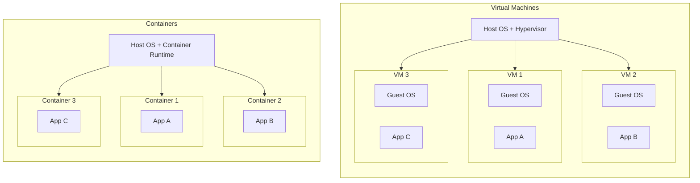
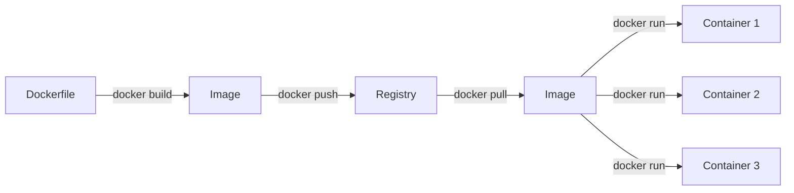
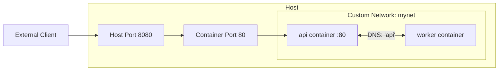

# Containers

Containers changed how software is built, shipped, and run. Instead of installing dependencies on a server and hoping everything works, you package your application and its entire environment into a container that runs the same way everywhere.

## What Are Containers?

A container is a lightweight, isolated environment that packages an application with all its dependencies — runtime, libraries, system tools, and configuration. Unlike virtual machines, containers share the host operating system kernel, making them fast to start and efficient with resources. Docker is the most widely used container platform and the one you will learn throughout this section.

## Why It Matters

Containers are the foundation of modern deployment. Kubernetes runs containers. CI/CD pipelines build containers. Cloud services run containers. Every major cloud provider (AWS, Azure, GCP) offers container-based services as first-class products. Understanding Docker is a prerequisite for nearly every infrastructure and DevOps topic that follows.

## What You'll Learn

- What containers are and how they differ from VMs
- Docker architecture: images, containers, and registries
- Writing Dockerfiles to build custom images
- Managing containers: run, stop, logs, exec
- Volumes and persistent storage
- Container networking
- Docker Compose for multi-container applications

---

## Containers vs Virtual Machines

Containers and virtual machines both provide isolation, but they achieve it differently and have very different performance characteristics.

A **virtual machine** runs a complete guest operating system on top of a hypervisor. Each VM includes its own kernel, system libraries, and application code. This provides strong isolation but comes with significant overhead — each VM might consume gigabytes of disk and RAM and take minutes to boot.

A **container** shares the host OS kernel and uses kernel features like namespaces and cgroups to isolate processes. There is no guest OS. The container only includes the application and its dependencies, making it lightweight, fast, and portable.



| Feature | Virtual Machines | Containers |
|---|---|---|
| Startup time | Minutes | Seconds |
| Size | Gigabytes (includes full OS) | Megabytes (app + dependencies only) |
| Isolation | Strong (separate kernel) | Process-level (shared kernel) |
| Performance | Overhead from hypervisor and guest OS | Near-native performance |
| Density | Tens of VMs per host | Hundreds of containers per host |
| Use case | Running different OS types, strong security boundaries | Microservices, CI/CD, application packaging |

Containers are not a replacement for VMs in every scenario. When you need to run a Windows application on a Linux host, or when you need kernel-level isolation for multi-tenant security, VMs are the right choice. But for packaging and deploying applications, containers are faster, lighter, and more portable.

---

## Installing Docker

Docker runs on Linux, macOS, and Windows. The instructions below cover Ubuntu, which is the most common environment for production Docker workloads.

### Install on Ubuntu

Update your package index and install Docker:

```bash
sudo apt update
sudo apt install docker.io
```

The `docker.io` package is maintained by Ubuntu and is the simplest way to get started. For the latest features, you can install Docker from Docker's official repository instead, but the Ubuntu package is perfectly fine for learning.

Start and enable the Docker service so it runs on boot:

```bash
sudo systemctl start docker
sudo systemctl enable docker
```

### Run Docker Without sudo

By default, Docker commands require `sudo`. To run them as your regular user, add yourself to the `docker` group:

```bash
sudo usermod -aG docker $USER
```

You need to log out and log back in (or run `newgrp docker`) for the group change to take effect. This is the same `-aG` pattern you learned in [Linux](/learn/foundations/linux/) for user group management.

### Verify the Installation

```bash
docker run hello-world
```

If everything is working, you will see a message that starts with "Hello from Docker!" followed by an explanation of what just happened. Behind the scenes, Docker pulled the `hello-world` image from Docker Hub, created a container from it, ran the container, and printed the output.

> **Try It**: Install Docker on your Linux environment (or use Docker Desktop if you are on macOS/Windows). Run `docker run hello-world` to confirm it works. Then run `docker version` to see the client and server version information.

---

## Docker Architecture

Docker uses a client-server architecture. Understanding the three core concepts — images, containers, and registries — is essential before you start running commands.

### Images

An **image** is a read-only template that contains everything needed to run an application: the operating system base layer, libraries, application code, and configuration. Images are built in layers, and each layer represents a change (installing a package, copying a file, setting a variable). Layers are cached and shared between images, which saves disk space and speeds up builds.

### Containers

A **container** is a running instance of an image. When you start a container, Docker adds a thin writable layer on top of the image layers. Any changes the running process makes (creating files, writing logs) go into this writable layer. When the container is removed, that writable layer is discarded. This is why containers are described as **ephemeral** — they are disposable by design.

You can run multiple containers from the same image, each with its own writable layer and isolated processes.

### Registries

A **registry** is a repository where images are stored and shared. **Docker Hub** is the default public registry and contains thousands of official and community images (Ubuntu, Nginx, Python, PostgreSQL, Redis, and many more). Organizations often run private registries (AWS ECR, Azure ACR, GitHub Container Registry) to store proprietary images.



The workflow follows a clear path: you write a **Dockerfile** that defines how to build an image. You run `docker build` to create the image. You push the image to a registry with `docker push`. Other machines or pipelines pull the image with `docker pull` and run containers from it with `docker run`. This is how your [CI/CD](/learn/foundations/cicd/) pipelines will build and deploy applications.

---

## Running Containers

The `docker run` command creates and starts a container from an image. It is the command you will use most often.

### Basic Usage

```bash
docker run nginx
```

This pulls the `nginx` image from Docker Hub (if not already downloaded), creates a container, and starts it. The container runs in the foreground — it takes over your terminal and you will see the Nginx access logs. Press `Ctrl+C` to stop it.

### Common Flags

| Flag | Purpose | Example |
|---|---|---|
| `-d` | Run in detached mode (background) | `docker run -d nginx` |
| `-it` | Interactive mode with terminal (for shells) | `docker run -it ubuntu bash` |
| `--name` | Assign a name to the container | `docker run --name web -d nginx` |
| `--rm` | Automatically remove the container when it exits | `docker run --rm ubuntu echo "hello"` |
| `-p` | Map a host port to a container port | `docker run -d -p 8080:80 nginx` |
| `-e` | Set an environment variable | `docker run -e DB_HOST=db -d myapp` |
| `-v` | Mount a volume or bind mount | `docker run -v mydata:/data -d myapp` |

### Port Mapping

Containers run in isolated network namespaces. By default, you cannot reach a containerized service from the host. The `-p` flag maps a port on the host to a port inside the container:

```bash
docker run -d --name web -p 8080:80 nginx
```

The format is `-p HOST_PORT:CONTAINER_PORT`. This maps port 8080 on your machine to port 80 inside the container. Open `http://localhost:8080` in a browser and you will see the Nginx welcome page.

You can map multiple ports:

```bash
docker run -d -p 8080:80 -p 8443:443 nginx
```

### Environment Variables

Many containerized applications are configured through environment variables instead of config files. The `-e` flag sets them:

```bash
docker run -d --name db \
  -e POSTGRES_USER=admin \
  -e POSTGRES_PASSWORD=secretpass \
  -e POSTGRES_DB=myapp \
  -p 5432:5432 \
  postgres:16
```

This starts a PostgreSQL 16 container with a custom user, password, and database name. The official PostgreSQL image reads these environment variables on startup and configures the database accordingly.

### Interactive Containers

The `-it` flags give you an interactive terminal inside a container. This is how you get a shell:

```bash
docker run -it ubuntu:24.04 bash
```

You are now inside an Ubuntu container with a root shell. You can install packages, explore the filesystem, and experiment. When you type `exit`, the container stops. If you used the `--rm` flag, it is also automatically deleted.

> **Try It**: Run an Nginx container in detached mode with port mapping: `docker run -d --name myweb -p 8080:80 nginx`. Open `http://localhost:8080` in a browser (or use `curl localhost:8080`) to see the Nginx welcome page. Then stop and remove the container with `docker stop myweb && docker rm myweb`.

---

## Managing Containers

Once containers are running, you need to inspect, stop, start, and remove them. Here is the complete reference.

| Command | Purpose |
|---|---|
| `docker ps` | List running containers |
| `docker ps -a` | List all containers (including stopped) |
| `docker stop <name or id>` | Gracefully stop a running container |
| `docker start <name or id>` | Start a stopped container |
| `docker restart <name or id>` | Restart a container |
| `docker rm <name or id>` | Remove a stopped container |
| `docker rm -f <name or id>` | Force-remove a running container |
| `docker logs <name or id>` | View container output (stdout/stderr) |
| `docker logs -f <name or id>` | Follow logs in real time (like `tail -f`) |
| `docker exec -it <name or id> bash` | Open a shell inside a running container |
| `docker exec <name or id> <cmd>` | Run a command inside a running container |
| `docker inspect <name or id>` | Show detailed container metadata as JSON |
| `docker stats` | Show live resource usage (CPU, memory, network) |

### Viewing Logs

Container logs are one of the first places you look when something goes wrong:

```bash
docker logs web                      # print all logs
docker logs -f web                   # follow new log output in real time
docker logs --tail 50 web            # show only the last 50 lines
docker logs --since 5m web           # show logs from the last 5 minutes
```

This is the container equivalent of `tail -f /var/log/syslog` that you learned in [Linux](/learn/foundations/linux/).

### Executing Commands in Running Containers

`docker exec` lets you run commands inside a container that is already running. The most common use is opening a shell for debugging:

```bash
docker exec -it web bash
```

You are now inside the running Nginx container. You can check config files, test connectivity, or inspect the filesystem. When you `exit`, the container keeps running — `exec` does not stop the container.

You can also run one-off commands without opening a shell:

```bash
docker exec web cat /etc/nginx/nginx.conf
docker exec db psql -U admin -d myapp -c "SELECT 1;"
```

> **Try It**: Start a detached Nginx container: `docker run -d --name testbox -p 9090:80 nginx`. View its logs with `docker logs testbox`. Open a shell inside it with `docker exec -it testbox bash`. Run `ls /usr/share/nginx/html/` to see the default web content. Type `exit` to leave the shell, then run `docker stats` to see live resource usage (press `Ctrl+C` to quit stats). Finally, clean up with `docker stop testbox && docker rm testbox`.

---

## Docker Images

Images are the building blocks. Before writing your own Dockerfiles, you need to know how to pull, list, and manage images from registries.

### Pulling Images

```bash
docker pull nginx                    # pulls nginx:latest
docker pull nginx:1.27               # pulls a specific version
docker pull python:3.12-slim         # pulls a slim variant of Python 3.12
docker pull ubuntu:24.04             # pulls Ubuntu 24.04
```

When you run `docker run` with an image that is not on your machine, Docker automatically pulls it. Using `docker pull` explicitly is useful when you want to pre-download images or update to the latest version.

### Image Naming Convention

Docker images follow the naming pattern:

```
[registry/]repository[:tag]
```

| Example | Registry | Repository | Tag |
|---|---|---|---|
| `nginx` | Docker Hub (default) | `nginx` | `latest` (default) |
| `nginx:1.27` | Docker Hub | `nginx` | `1.27` |
| `python:3.12-slim` | Docker Hub | `python` | `3.12-slim` |
| `ghcr.io/myorg/myapp:v2.1` | GitHub Container Registry | `myorg/myapp` | `v2.1` |
| `123456789.dkr.ecr.us-east-1.amazonaws.com/api:latest` | AWS ECR | `api` | `latest` |

Always use specific tags in production. The `latest` tag is mutable — it points to whatever was most recently pushed — so builds using `latest` are not reproducible.

### Listing and Removing Images

```bash
docker images                        # list all local images
docker rmi nginx:1.27                # remove a specific image
docker image prune                   # remove dangling (untagged) images
docker image prune -a                # remove all unused images
```

Images accumulate quickly. Run `docker image prune` periodically to reclaim disk space.

---

## Dockerfiles

A **Dockerfile** is a text file that contains instructions for building a Docker image. Each instruction creates a layer in the final image. Writing good Dockerfiles is a core skill for any infrastructure role.

### Instructions Reference

| Instruction | Purpose | Example |
|---|---|---|
| `FROM` | Set the base image (required, must be first) | `FROM python:3.12-slim` |
| `RUN` | Execute a command during build (install packages, etc.) | `RUN apt-get update && apt-get install -y curl` |
| `COPY` | Copy files from build context into the image | `COPY . /app` |
| `ADD` | Like COPY but can also extract archives and fetch URLs | `ADD config.tar.gz /etc/app/` |
| `WORKDIR` | Set the working directory for subsequent instructions | `WORKDIR /app` |
| `EXPOSE` | Document which port the container listens on | `EXPOSE 8000` |
| `ENV` | Set an environment variable | `ENV NODE_ENV=production` |
| `CMD` | Default command to run when the container starts | `CMD ["python", "app.py"]` |
| `ENTRYPOINT` | Set the main executable (CMD becomes arguments to it) | `ENTRYPOINT ["python"]` |
| `ARG` | Define a build-time variable | `ARG APP_VERSION=1.0` |
| `USER` | Set the user to run subsequent commands as | `USER appuser` |

The difference between `CMD` and `ENTRYPOINT` matters. `CMD` provides the default command that can be overridden when running the container. `ENTRYPOINT` sets a fixed executable — any arguments passed to `docker run` become arguments to the entrypoint. In most cases, `CMD` is what you want.

### Building a Python Application Image

Here is a complete, production-style Dockerfile for a Python web application:

```dockerfile
# Use a specific slim base image for smaller size
FROM python:3.12-slim

# Set environment variables
ENV PYTHONDONTWRITEBYTECODE=1
ENV PYTHONUNBUFFERED=1

# Create a non-root user for security
RUN groupadd -r appuser && useradd -r -g appuser appuser

# Set the working directory
WORKDIR /app

# Copy dependency file first (for better layer caching)
COPY requirements.txt .

# Install dependencies
RUN pip install --no-cache-dir -r requirements.txt

# Copy application code
COPY . .

# Change ownership to the non-root user
RUN chown -R appuser:appuser /app

# Switch to non-root user
USER appuser

# Document the port the app listens on
EXPOSE 8000

# Default command to run the application
CMD ["python", "app.py"]
```

Let's walk through the decisions in this file:

1. **`FROM python:3.12-slim`** — We use a specific version tag (`3.12`) and the `slim` variant, which excludes build tools and documentation to keep the image small. The full `python:3.12` image is about 1 GB; the slim variant is around 150 MB.

2. **`ENV` for Python settings** — `PYTHONDONTWRITEBYTECODE=1` prevents Python from writing `.pyc` files (unnecessary in a container). `PYTHONUNBUFFERED=1` ensures print output appears immediately in `docker logs`.

3. **Non-root user** — Running as root inside a container is a security risk. If an attacker escapes the container, they have root on the host. Creating and switching to a non-root user limits the blast radius.

4. **Copy `requirements.txt` before application code** — Docker caches each layer. If you copy the entire application first and then install dependencies, any code change invalidates the dependency layer and forces a full reinstall. By copying the requirements file first and installing dependencies in a separate step, Docker reuses the cached dependency layer when only your code changes. This dramatically speeds up builds.

5. **`EXPOSE 8000`** — This is documentation, not configuration. It tells anyone reading the Dockerfile which port the application listens on. You still need `-p` when running the container to actually publish the port.

6. **`CMD` as a JSON array** — Using the exec form `["python", "app.py"]` rather than the shell form `python app.py` ensures the process receives signals correctly. This matters for graceful shutdowns.

### Building the Image

```bash
docker build -t myapp:1.0 .
```

The `-t` flag tags the image with a name and version. The `.` at the end is the **build context** — the directory Docker sends to the build daemon. Docker looks for a file named `Dockerfile` in that directory.

To use a differently named Dockerfile:

```bash
docker build -t myapp:1.0 -f Dockerfile.prod .
```

### .dockerignore

Just like `.gitignore` excludes files from version control, a `.dockerignore` file excludes files from the Docker build context. This keeps builds fast and prevents sensitive files from being copied into images.

Create a `.dockerignore` file in the same directory as your Dockerfile:

```
.git
.gitignore
node_modules
__pycache__
*.pyc
.env
.venv
docker-compose*.yml
README.md
.DS_Store
```

### Dockerfile Best Practices

1. **Use specific base image tags.** Never use `latest` in production Dockerfiles. Pin to a version like `python:3.12-slim` or `node:20-alpine`.

2. **Minimize layers.** Combine related `RUN` commands with `&&` to reduce the number of layers:

   ```dockerfile
   # Bad — creates three layers
   RUN apt-get update
   RUN apt-get install -y curl
   RUN apt-get clean

   # Good — creates one layer
   RUN apt-get update && \
       apt-get install -y curl && \
       apt-get clean && \
       rm -rf /var/lib/apt/lists/*
   ```

3. **Order instructions for cache efficiency.** Put instructions that change rarely (installing OS packages) before instructions that change often (copying application code). Docker rebuilds from the first changed layer forward, so smart ordering minimizes rebuild time.

4. **Run as a non-root user.** Always create and switch to a non-root user before `CMD` or `ENTRYPOINT`.

5. **Use `.dockerignore`.** Keep the build context small by excluding unnecessary files.

6. **Use multi-stage builds for compiled applications.** For languages like Go or Java, use one stage to compile and another stage to run. This keeps the final image small because build tools are not included:

   ```dockerfile
   # Build stage
   FROM golang:1.22 AS builder
   WORKDIR /app
   COPY . .
   RUN go build -o myapp .

   # Runtime stage
   FROM alpine:3.20
   COPY --from=builder /app/myapp /usr/local/bin/myapp
   CMD ["myapp"]
   ```

   The final image contains only the compiled binary and a minimal Alpine Linux base, not the entire Go toolchain.

> **Try It**: Create a directory called `~/docker-demo`. Inside it, create a file called `app.py` with the content `print("Hello from Docker!")`. Create a `Dockerfile` with `FROM python:3.12-slim`, `WORKDIR /app`, `COPY app.py .`, and `CMD ["python", "app.py"]`. Build it with `docker build -t demo:1.0 .` and run it with `docker run --rm demo:1.0`. You should see "Hello from Docker!" in the output.

---

## Volumes

Containers are ephemeral. When a container is removed, any data written inside it is lost. **Volumes** solve this by providing persistent storage that exists independently of the container lifecycle.

### Why Volumes Matter

Consider a database running in a container. Without a volume, stopping and removing the container destroys all your data. With a volume, the data lives on the host filesystem and survives container removal, upgrades, and replacements.

There are two main approaches to persistent storage in Docker: **named volumes** and **bind mounts**.

### Named Volumes

Named volumes are managed by Docker. You do not need to know or care about where Docker stores them on the host filesystem.

```bash
# Create a named volume
docker volume create pgdata

# Run PostgreSQL with the volume mounted
docker run -d --name db \
  -e POSTGRES_PASSWORD=secret \
  -v pgdata:/var/lib/postgresql/data \
  -p 5432:5432 \
  postgres:16
```

The `-v pgdata:/var/lib/postgresql/data` flag mounts the named volume `pgdata` at `/var/lib/postgresql/data` inside the container. PostgreSQL writes its data files to that directory, and they persist in the volume even after the container is removed.

If you stop the container, remove it, and start a new one with the same volume, all your data is still there:

```bash
docker stop db && docker rm db

docker run -d --name db2 \
  -e POSTGRES_PASSWORD=secret \
  -v pgdata:/var/lib/postgresql/data \
  -p 5432:5432 \
  postgres:16
```

The new container picks up exactly where the old one left off.

### Bind Mounts

Bind mounts map a specific directory on your host to a directory inside the container. They are useful for development because changes you make on the host are immediately reflected inside the container.

```bash
docker run -d --name devweb \
  -v $(pwd)/html:/usr/share/nginx/html \
  -p 8080:80 \
  nginx
```

This mounts the `html` directory from your current working directory into Nginx's content directory. Edit a file in `./html/` on your host, refresh the browser, and you see the change instantly. No rebuild needed.

The key difference: named volumes are managed by Docker and are best for production data. Bind mounts give you direct filesystem access and are best for development workflows.

### Volume Management Commands

| Command | Purpose |
|---|---|
| `docker volume create <name>` | Create a named volume |
| `docker volume ls` | List all volumes |
| `docker volume inspect <name>` | Show volume details (mount point, driver) |
| `docker volume rm <name>` | Remove a volume |
| `docker volume prune` | Remove all unused volumes |

> **Try It**: Create a named volume with `docker volume create testdata`. Start an Ubuntu container that mounts it: `docker run -it --rm -v testdata:/data ubuntu bash`. Inside the container, create a file: `echo "persisted" > /data/hello.txt`. Exit the container. Start a new container with the same volume: `docker run -it --rm -v testdata:/data ubuntu bash`. Run `cat /data/hello.txt` — the file is still there. Exit and clean up with `docker volume rm testdata`.

---

## Docker Networking

Containers need to communicate with each other and with the outside world. Docker provides built-in networking that handles isolation, DNS resolution, and port mapping.

### Network Types

| Network Type | Description | Use Case |
|---|---|---|
| `bridge` | Default network. Containers get private IPs and can reach each other by IP. | Single-host container communication |
| `host` | Container shares the host's network stack directly. No port mapping needed. | Performance-sensitive applications |
| `none` | No networking. Container is completely isolated. | Security-sensitive batch jobs |

### The Default Bridge Network

When you run a container without specifying a network, Docker attaches it to the default `bridge` network. Containers on the default bridge can reach each other by IP address, but not by container name.

### Custom Bridge Networks

Custom bridge networks are almost always what you want. They provide automatic DNS resolution between containers — containers can reach each other by name.

```bash
# Create a custom network
docker network create mynet

# Run containers on that network
docker run -d --name api --network mynet nginx
docker run -d --name worker --network mynet ubuntu sleep 3600
```

Now the `worker` container can reach the `api` container by name:

```bash
docker exec worker curl http://api:80
```

Docker's built-in DNS resolves `api` to the container's IP address on the `mynet` network. This is how multi-container applications communicate: each service refers to the others by container name.

### Network Management Commands

```bash
docker network ls                    # list all networks
docker network create mynet          # create a custom bridge network
docker network inspect mynet         # show network details and connected containers
docker network connect mynet <container>   # connect a running container to a network
docker network disconnect mynet <container> # disconnect a container from a network
docker network rm mynet              # remove a network
docker network prune                 # remove all unused networks
```

### Port Mapping Revisited

Port mapping (`-p HOST:CONTAINER`) is the mechanism that makes container services accessible from outside Docker's network. Without it, a container's ports are only reachable from other containers on the same Docker network.

```bash
# Only accessible from other containers on the same network
docker run -d --name internal-api --network mynet nginx

# Accessible from the host machine and external clients
docker run -d --name public-api --network mynet -p 8080:80 nginx
```

In production and in [Container Orchestration](/learn/foundations/container-orchestration/) with Kubernetes, port mapping is handled by Services and Ingress controllers rather than Docker's `-p` flag. But the underlying concept is the same: mapping external traffic to container ports.



> **Try It**: Create a custom network: `docker network create testnet`. Run two containers on it: `docker run -d --name server --network testnet nginx` and `docker run -d --name client --network testnet ubuntu sleep 3600`. Install curl in the client: `docker exec client apt-get update && docker exec client apt-get install -y curl`. Test DNS resolution: `docker exec client curl http://server:80`. You should see the Nginx welcome page HTML. Clean up: `docker stop server client && docker rm server client && docker network rm testnet`.

---

## Docker Compose

Running individual `docker run` commands works for one or two containers. Real applications have multiple services — a web app, a database, a cache, a background worker. Typing out the `docker run` command for each service with all the flags, networks, and volumes becomes unmanageable. **Docker Compose** solves this by defining your entire application stack in a single YAML file.

### What Docker Compose Solves

Without Compose, starting a web application with a database and cache requires three separate commands with careful flag management:

```bash
docker network create app-net
docker volume create pgdata
docker volume create redisdata

docker run -d --name db --network app-net \
  -e POSTGRES_PASSWORD=secret -e POSTGRES_DB=myapp \
  -v pgdata:/var/lib/postgresql/data postgres:16

docker run -d --name cache --network app-net \
  -v redisdata:/data redis:7

docker run -d --name web --network app-net \
  -e DATABASE_URL=postgresql://postgres:secret@db:5432/myapp \
  -e REDIS_URL=redis://cache:6379 \
  -p 8000:8000 myapp:latest
```

With Compose, this becomes a declarative YAML file that you start with a single command.

### docker-compose.yml

Create a file named `docker-compose.yml` (or `compose.yml` — both work):

```yaml
services:
  web:
    build: .
    ports:
      - "8000:8000"
    environment:
      DATABASE_URL: postgresql://postgres:secret@db:5432/myapp
      REDIS_URL: redis://cache:6379
    depends_on:
      - db
      - cache
    restart: unless-stopped

  db:
    image: postgres:16
    environment:
      POSTGRES_PASSWORD: secret
      POSTGRES_DB: myapp
    volumes:
      - pgdata:/var/lib/postgresql/data
    restart: unless-stopped

  cache:
    image: redis:7
    volumes:
      - redisdata:/data
    restart: unless-stopped

volumes:
  pgdata:
  redisdata:
```

Let's walk through this file:

1. **`services`** — Each key under `services` defines a container. Here we have three: `web`, `db`, and `cache`.

2. **`build: .`** — The `web` service is built from a Dockerfile in the current directory rather than pulled from a registry. Compose runs `docker build` for you.

3. **`image: postgres:16`** — The `db` and `cache` services use pre-built images from Docker Hub.

4. **`ports`** — Maps host ports to container ports, just like `-p` in `docker run`.

5. **`environment`** — Sets environment variables, just like `-e` in `docker run`. Notice how the `web` service references `db` and `cache` by their service names. Compose automatically creates a network and provides DNS resolution between services.

6. **`depends_on`** — Tells Compose to start `db` and `cache` before `web`. This controls startup order but does not wait for the services to be "ready" (the database might still be initializing when the web app starts). For production, you handle readiness with health checks or retry logic in your application.

7. **`volumes`** — Named volumes are declared at the top level and referenced by services. Compose creates them if they do not exist.

8. **`restart: unless-stopped`** — Automatically restart the container if it crashes, unless you explicitly stop it.

### Environment Files

Instead of putting sensitive values directly in `docker-compose.yml`, use an `.env` file:

```
POSTGRES_PASSWORD=secret
POSTGRES_DB=myapp
```

Reference them in the Compose file:

```yaml
services:
  db:
    image: postgres:16
    environment:
      POSTGRES_PASSWORD: ${POSTGRES_PASSWORD}
      POSTGRES_DB: ${POSTGRES_DB}
```

Compose automatically reads a `.env` file in the same directory. Never commit `.env` files to version control — add them to your `.gitignore`.

### Compose Commands

| Command | Purpose |
|---|---|
| `docker compose up` | Create and start all services (foreground) |
| `docker compose up -d` | Create and start all services (detached) |
| `docker compose down` | Stop and remove all containers, networks |
| `docker compose down -v` | Same as above, plus remove volumes |
| `docker compose ps` | List running services |
| `docker compose logs` | View logs from all services |
| `docker compose logs -f web` | Follow logs for a specific service |
| `docker compose build` | Build or rebuild images |
| `docker compose exec web bash` | Open a shell in a running service |
| `docker compose stop` | Stop services without removing them |
| `docker compose restart` | Restart services |
| `docker compose pull` | Pull latest images for all services |

The typical development workflow looks like this:

```bash
docker compose up -d              # start everything in the background
docker compose logs -f web        # watch the web service logs
docker compose exec web bash      # debug inside the web container
docker compose down               # tear it all down when you're done
```

When you make code changes during development, rebuild and restart the changed service:

```bash
docker compose up -d --build web
```

This rebuilds the `web` image and replaces the running container without affecting `db` or `cache`.

> **Try It**: Create a directory `~/compose-demo`. Inside it, create a `docker-compose.yml` with a single service that runs Nginx: `services:` / `web:` / `image: nginx` / `ports:` / `- "9090:80"`. Run `docker compose up -d` to start it. Visit `http://localhost:9090` to see the Nginx page. Run `docker compose ps` to see the running service, `docker compose logs web` to see the logs, then `docker compose down` to tear it down.

---

## Key Takeaways

- Containers package an application with its dependencies and share the host kernel. They are lighter, faster, and more portable than virtual machines.
- Docker is the standard container platform. Install it, add your user to the `docker` group, and verify with `docker run hello-world`.
- Images are read-only templates built in layers. Containers are running instances of images. Registries store and distribute images.
- `docker run` creates containers. Use `-d` for background, `-p` for port mapping, `-e` for environment variables, `-v` for volumes, and `--name` to identify containers.
- `docker logs`, `docker exec`, and `docker inspect` are your primary debugging tools for running containers.
- Always use specific image tags in production. Avoid `latest` because it is not reproducible.
- Dockerfiles define how images are built. Order instructions for cache efficiency, use slim base images, and run as a non-root user.
- Volumes provide persistent storage. Named volumes are best for production data. Bind mounts are best for development.
- Custom Docker networks provide DNS-based service discovery. Containers on the same network can reach each other by name.
- Docker Compose defines multi-container applications in a single YAML file. One command (`docker compose up`) starts everything. This is the foundation for local development and testing before deploying to [Container Orchestration](/learn/foundations/container-orchestration/) platforms like Kubernetes.

## Prerequisites

Complete [Linux](/learn/foundations/linux/), [Networking Fundamentals](/learn/foundations/networking-fundamentals/), and [CI/CD](/learn/foundations/cicd/) first.

## Next Step

Continue to [Container Orchestration](/learn/foundations/container-orchestration/) to learn Kubernetes and how to manage containers at scale.
