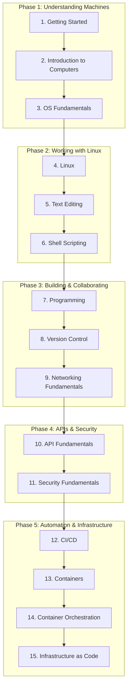

# Getting Started

Welcome to **Chasing Cloud Careers**! You're about to begin the Foundations path — a single, sequential learning journey that takes you from the absolute basics of how computers work all the way through infrastructure as code. Whether you're completely new to technology or transitioning from another field, this path gives you the skills and mental models you need before specializing in any tech career. There are no prerequisites. You start here, and by the time you finish, you'll have a working understanding of the tools, systems, and patterns that every infrastructure role depends on.

The Foundations path is designed as one continuous thread. Each lesson builds directly on the one before it. You won't jump between unrelated topics — instead, you'll watch concepts layer on top of each other until the full picture of modern infrastructure comes into focus. By the end, you'll understand not just individual tools, but how they fit together in real-world systems.

## What Is the Tech Industry?

The tech industry builds and maintains the digital infrastructure that powers modern life. Every website you visit, every app on your phone, every transaction you make, every video you stream — all of it runs on systems that someone designed, deployed, and maintains. The tech industry is the collection of companies, teams, and individuals who make that happen.

When most people think of tech, they think of software developers writing application code. But applications don't run in a vacuum. They need servers to execute on, networks to communicate over, databases to store data in, and security measures to protect them. Someone has to provision those servers, configure those networks, manage those databases, and enforce those security policies. These are **infrastructure roles** — the backbone of every technology organization.

Over the past two decades, the industry has undergone a fundamental shift. Organizations used to buy physical servers, rack them in data centers, and manage every piece of hardware themselves. Today, most infrastructure runs in the cloud — on platforms like Amazon Web Services (AWS), Microsoft Azure, and Google Cloud Platform (GCP). Instead of buying servers, you rent compute capacity on demand. Instead of running cables, you configure virtual networks through APIs. Instead of manually installing software on machines, you define your entire infrastructure in code and let automation handle the rest.

This shift hasn't eliminated the need for infrastructure expertise — it has amplified it. Cloud platforms offer hundreds of services, each with its own configuration options, pricing models, and failure modes. The tools have changed, but the underlying concepts remain the same: networking, operating systems, security, automation. That's exactly what the Foundations path teaches. You'll learn the concepts that don't change, using tools that are industry-standard today.

The demand for infrastructure professionals continues to grow. Every company that builds software needs people who can deploy it, scale it, secure it, and keep it running. As AI systems, microservices architectures, and global-scale applications become the norm, the need for skilled infrastructure engineers only increases.

## Career Paths

The Foundations path prepares you for several distinct but overlapping career tracks. Each of these roles requires the same core knowledge — Linux, networking, version control, containers, automation — but applies it in different ways. Here's an overview of where this path can take you:

| Path | Focus | Example Tasks |
|------|-------|--------------|
| DevOps Engineer | Automating development and operations workflows | CI/CD pipelines, monitoring, incident response |
| Cloud Engineer | Designing and managing cloud infrastructure | AWS/Azure/GCP services, networking, cost optimization |
| Site Reliability Engineer (SRE) | Ensuring system reliability and performance | SLOs/SLAs, chaos engineering, capacity planning |
| Platform Engineer | Building internal developer platforms | Developer toolchains, self-service infrastructure |
| AI/ML Infrastructure Engineer | Managing infrastructure for machine learning | GPU clusters, model serving, data pipelines |

**DevOps Engineers** focus on bridging the gap between development and operations. They build and maintain the pipelines that take code from a developer's laptop to production, automate repetitive tasks, and respond to incidents when systems fail. If you like building systems that make other engineers more productive, DevOps is a natural fit.

**Cloud Engineers** specialize in designing and managing infrastructure on cloud platforms. They architect solutions using cloud-native services, manage networking and security configurations, and optimize costs across large-scale deployments. Cloud engineering is where you go if you want to understand the full breadth of what platforms like AWS, Azure, and GCP offer.

**Site Reliability Engineers (SREs)** are responsible for keeping systems running reliably at scale. They define service level objectives (SLOs), build observability into systems, conduct chaos engineering experiments, and plan for capacity growth. SRE is a good fit if you're drawn to the challenge of building systems that handle failure gracefully.

**Platform Engineers** build the internal tools and platforms that other engineering teams use. They create self-service infrastructure, standardize developer workflows, and abstract away complexity so that application developers can focus on their code. Platform engineering is where you go if you want to build tools for other engineers.

**AI/ML Infrastructure Engineers** manage the specialized infrastructure that machine learning systems require. They provision GPU clusters, build data pipelines, deploy model serving infrastructure, and ensure that training and inference workloads run efficiently. This is one of the fastest-growing areas in tech as organizations scale their AI capabilities.

All of these paths share the same foundations — which is exactly what this path teaches. You won't pick a specialization here. Instead, you'll build the base that makes any specialization possible.

## The Foundations Roadmap

The Foundations path consists of 15 lessons organized into five phases. Each phase groups related concepts together, and each lesson builds on everything that came before it.



**Phase 1: Understanding Machines** lays the groundwork. You'll learn how computers actually work at a hardware and software level, then move into how operating systems manage resources.

**Phase 2: Working with Linux** gets you comfortable in the terminal. You'll learn Linux commands, text editing with Vim, and shell scripting — the daily tools of every infrastructure engineer.

**Phase 3: Building & Collaborating** introduces programming with Python, version control with Git, and networking fundamentals. These are the skills that let you build things and work with other engineers.

**Phase 4: APIs & Security** covers how systems communicate and how to protect them. You'll learn REST APIs, authentication patterns, and core security principles.

**Phase 5: Automation & Infrastructure** brings everything together. CI/CD pipelines, Docker containers, Kubernetes orchestration, and Terraform infrastructure as code — the tools that define modern infrastructure.

Here is the full lesson sequence:

1. **[Introduction to Computers](/learn/foundations/introduction-to-computers/)** — Hardware, software, binary, and how computers boot
2. **[OS Fundamentals](/learn/foundations/os-fundamentals/)** — Processes, memory, file systems, users, and permissions
3. **[Linux](/learn/foundations/linux/)** — Ubuntu terminal, package management, file operations, and ownership
4. **[Text Editing](/learn/foundations/text-editing/)** — Vim modes, navigation, editing, and configuration
5. **[Shell Scripting](/learn/foundations/shell-scripting/)** — Variables, conditionals, loops, pipes, and cron
6. **[Programming](/learn/foundations/programming/)** — Python syntax, data structures, functions, and virtual environments
7. **[Version Control](/learn/foundations/version-control/)** — Git and GitHub: repos, branches, merges, and pull requests
8. **[Networking Fundamentals](/learn/foundations/networking-fundamentals/)** — IP, TCP/UDP, DNS, HTTP, ports, firewalls, and SSH
9. **[API Fundamentals](/learn/foundations/api-fundamentals/)** — REST, HTTP methods, JSON/YAML, authentication, and curl
10. **[Security Fundamentals](/learn/foundations/security-fundamentals/)** — CIA triad, encryption, certificates, secrets, and least privilege
11. **[CI/CD](/learn/foundations/ci-cd/)** — GitHub Actions: workflows, triggers, jobs, secrets, and deployments
12. **[Containers](/learn/foundations/containers/)** — Docker: images, Dockerfiles, volumes, networking, and Compose
13. **[Container Orchestration](/learn/foundations/container-orchestration/)** — Kubernetes: pods, deployments, services, and kubectl
14. **[Infrastructure as Code](/learn/foundations/infrastructure-as-code/)** — Terraform: providers, resources, state, and modules

## What to Expect

The Foundations path represents roughly **100+ hours of learning**. That number will vary depending on your background and how deeply you explore each topic, but it's a realistic estimate for working through all 15 lessons including the hands-on exercises.

Consistency matters more than intensity. You'll retain more by studying one hour a day for three months than by cramming for a weekend. Set a sustainable pace and stick with it. Some lessons will click immediately; others will take multiple passes. Both experiences are normal.

You don't need prior experience to start this path. You don't need to know how to code. You don't need a computer science degree. You need curiosity and the willingness to work through material that might feel unfamiliar at first. Every concept is introduced from the ground up, with explanations that assume nothing beyond basic computer literacy.

Each lesson builds on the ones before it, so skipping ahead is strongly discouraged. The path is designed so that each new concept has a foundation to land on. Every lesson includes hands-on exercises marked with **Try It** prompts. These aren't optional — they're where real learning happens. You'll spend significant time in the terminal, running commands, writing scripts, and building things. Reading alone will not get you where you need to go.

## Setting Up Your Environment

Before you dive into the lessons, you'll need a working terminal environment. The specific setup depends on your operating system.

### Windows

Install **WSL (Windows Subsystem for Linux)** to get a full Ubuntu environment running inside Windows. Open PowerShell as Administrator and run:

```powershell
wsl --install
```

This installs WSL 2 with Ubuntu by default. After installation, restart your computer, and Ubuntu will finish setting up. You'll create a username and password for your Linux environment.

Also install [Windows Terminal](https://aka.ms/terminal) for a modern terminal experience with tabs, split panes, and better rendering. It's available from the Microsoft Store or the link above.

Once WSL is installed, all terminal commands in this path should be run inside your Ubuntu environment, not in PowerShell or Command Prompt. For the full installation guide, see the [WSL Installation Guide](https://learn.microsoft.com/en-us/windows/wsl/install).

### macOS

The built-in Terminal app (found in Applications > Utilities) works out of the box. macOS is Unix-based, so most Linux commands work directly. For a more feature-rich terminal experience, consider installing [iTerm2](https://iterm2.com/), which offers split panes, search, autocomplete, and better customization.

You should also install [Homebrew](https://brew.sh/), the standard package manager for macOS. It lets you install tools and utilities from the command line:

```bash
/bin/bash -c "$(curl -fsSL https://raw.githubusercontent.com/Homebrew/install/HEAD/install.sh)"
```

After installation, you can install packages with `brew install <package-name>`. You'll use Homebrew frequently throughout this path.

### Linux

If you're already running Linux, you're set. Make sure you're running a recent Ubuntu version (22.04 LTS or later) to ensure compatibility with all the tools and commands in this path. If you're on a different distribution, most commands will still work, but package management commands may differ.

### All Platforms

Regardless of your operating system, you should also:

- **Create a [GitHub account](https://github.com/)** — You'll need it starting from the [Version Control](/learn/foundations/version-control/) lesson and throughout the rest of the path. GitHub is free for individual use.
- **Install a code editor** — [VS Code](https://code.visualstudio.com/) is the recommended choice. It's free, works on all platforms, and integrates well with the terminal, Git, and Docker. You'll use it alongside the terminal for reading and editing code.

## How to Use This Path

Here's how to get the most out of the Foundations path:

- **Go in order** — Each lesson assumes you've completed the ones before it. The [Shell Scripting](/learn/foundations/shell-scripting/) lesson assumes you're comfortable with [Linux](/learn/foundations/linux/) commands. The [CI/CD](/learn/foundations/ci-cd/) lesson assumes you understand [Version Control](/learn/foundations/version-control/). Skipping lessons creates gaps that will slow you down later.

- **Do every Try It** — Reading about commands is not the same as running them. The hands-on exercises are where concepts move from abstract to concrete. Every Try It prompt is there for a reason. Do them all, even the ones that seem simple.

- **Build as you go** — Each lesson leaves you with real skills you can use immediately. After [Linux](/learn/foundations/linux/), you can navigate any server. After [Shell Scripting](/learn/foundations/shell-scripting/), you can automate tasks. After [Containers](/learn/foundations/containers/), you can package and deploy applications. These aren't theoretical exercises — they're practical capabilities.

- **Revisit when needed** — Earlier lessons become richer after you've seen how concepts connect later. The networking concepts from [Networking Fundamentals](/learn/foundations/networking-fundamentals/) take on new meaning when you're configuring Docker networks in [Containers](/learn/foundations/containers/). Going back is not a sign of failure — it's part of the process.

- **Take notes** — Writing things down in your own words reinforces learning. Keep a notebook or a markdown file where you summarize key concepts after each lesson. When you can explain something in your own words, you understand it.

## What Comes After Foundations?

Once you complete all 15 lessons, you'll have the shared base that every tech role requires. You'll understand how computers work, how to operate in a Linux environment, how to write code and scripts, how networks and APIs function, how to secure systems, and how to automate infrastructure with containers and code. That's a significant body of knowledge, and it's the same foundation that every infrastructure professional builds on.

From there, specialization paths (coming soon) will dive deep into specific career tracks:

- **DevOps** — Monitoring, observability, incident management, SLOs
- **Cloud Engineering** — AWS, Azure, and GCP services and architecture
- **SRE** — Reliability engineering, chaos engineering, capacity planning
- **Platform Engineering** — Internal developer platforms and toolchains
- **AI/ML Infrastructure** — MLOps, model serving, and data pipelines

The foundations you build here transfer directly into every one of these specializations. Containers show up in every path. Networking is everywhere. Git is universal. Security principles apply to every system you'll ever touch. You're not just learning tools — you're building the mental model that makes every new tool easier to pick up. When you encounter a new cloud service, you'll understand the networking concepts behind it. When you learn a new orchestration platform, you'll recognize the container patterns underneath. The Foundations path doesn't just prepare you for the next step — it prepares you for every step after that.

## Resources & Further Reading

- [WSL Installation Guide](https://learn.microsoft.com/en-us/windows/wsl/install)
- [Homebrew](https://brew.sh/)
- [GitHub](https://github.com/)
- [VS Code](https://code.visualstudio.com/)
- [iTerm2](https://iterm2.com/)
- [Windows Terminal](https://aka.ms/terminal)
- [Roadmap.sh — DevOps Roadmap](https://roadmap.sh/devops)
