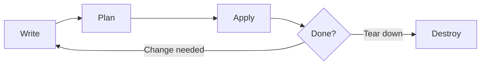

# Infrastructure as Code

Clicking through cloud consoles to create resources doesn't scale. Infrastructure as Code (IaC) lets you define your entire infrastructure in configuration files, track changes in version control, and provision environments reproducibly.

## What Is Infrastructure as Code?

IaC is the practice of managing infrastructure through machine-readable definition files rather than manual processes. Instead of clicking buttons in a web console to create a server, you write a configuration file that describes that server, commit it to Git, and let a tool provision it for you. Terraform by HashiCorp is the most widely adopted IaC tool, supporting AWS, Azure, GCP, Kubernetes, and hundreds of other providers through a single workflow.

## Why It Matters

IaC is how teams manage cloud infrastructure at scale. It enables reproducible environments, peer review of infrastructure changes, automated provisioning, and disaster recovery. If you work with cloud platforms, you'll use IaC daily.

## What You'll Learn

- What IaC is and why it replaces manual provisioning
- Terraform fundamentals: providers, resources, and data sources
- The plan/apply workflow
- State management and backends
- Variables, outputs, and locals
- Modules for reusable infrastructure components
- Working with multiple environments

---

## The Problem with Manual Infrastructure

Before IaC, infrastructure was provisioned by hand. An engineer would log into a cloud console, click through menus to create a virtual machine, configure its networking, attach storage, and repeat the process for every resource. This approach has serious problems that compound as systems grow.

**Configuration drift** is the most insidious. When you manage infrastructure by hand, the actual state of your systems slowly diverges from what anyone thinks it is. Someone resizes a database instance through the console. Another engineer opens a firewall port "temporarily" and forgets to close it. A third updates a load balancer rule. None of these changes are documented. After a few months, no one can confidently describe the current state of the infrastructure.

**No history** means you cannot answer basic questions. What changed? When did it change? Who changed it? Why? With manual provisioning, changes vanish into the ether the moment someone clicks "Apply" in a console.

**No review process** means no one checks infrastructure changes before they go live. In [Version Control](/learn/foundations/version-control/), you learned that pull requests provide code review, discussion, and approval before changes reach `main`. Manual infrastructure changes skip all of that.

**No reproducibility** means you cannot reliably recreate an environment. Need a staging environment that matches production? Good luck clicking through 200 console screens and getting every setting right. Need to recover from a disaster? You are rebuilding from memory.

**Human error at scale** is inevitable. Humans make mistakes. The more resources you manage manually, the more mistakes accumulate. A typo in a security group rule, a wrong AMI ID, a misconfigured subnet — these errors are costly in production and nearly undetectable without automation.

IaC solves all of these problems. Your infrastructure is defined in files that live in a Git repository. Every change is a commit with a message, a diff, and a pull request. Environments are reproducible because the same configuration always produces the same result. And Terraform shows you exactly what will change before it changes anything.

---

## What Is Terraform?

Terraform is an open-source infrastructure as code tool created by HashiCorp. You write configuration files in **HCL** (HashiCorp Configuration Language), and Terraform translates those files into API calls to provision and manage resources across cloud providers, SaaS platforms, and other services.

Terraform is **declarative**: you describe the desired state of your infrastructure, and Terraform figures out how to get there. You do not write step-by-step instructions ("create this, then create that, then attach them"). Instead, you say "I want a network with these properties and a server connected to it" and Terraform determines the correct order of operations, handles dependencies, and makes the API calls.

Terraform is **provider-agnostic**: the same workflow and language work across AWS, Azure, GCP, Docker, Kubernetes, GitHub, Cloudflare, Datadog, and hundreds of other platforms. Each platform has a **provider** plugin that translates HCL configuration into the specific API calls that platform requires.

Terraform is **stateful**: it maintains a record of what it has created, so it knows what already exists and what needs to change. This is what makes `terraform plan` possible — it can compare your desired configuration against the real world and tell you exactly what will happen before you apply anything.

---

## Installing Terraform

### On Ubuntu

HashiCorp provides an official APT repository:

```bash
sudo apt update && sudo apt install -y gnupg software-properties-common
wget -O- https://apt.releases.hashicorp.com/gpg | gpg --dearmor | sudo tee /usr/share/keyrings/hashicorp-archive-keyring.gpg > /dev/null
echo "deb [signed-by=/usr/share/keyrings/hashicorp-archive-keyring.gpg] https://apt.releases.hashicorp.com $(lsb_release -cs) main" | sudo tee /etc/apt/sources.list.d/hashicorp.list
sudo apt update && sudo apt install terraform
```

### On macOS

Using Homebrew:

```bash
brew tap hashicorp/tap
brew install hashicorp/tap/terraform
```

### Verify the Installation

```bash
terraform version
```

```
Terraform v1.9.5
on linux_amd64
```

If you see a version number, Terraform is ready.

> **Try It**: Install Terraform on your system using the commands above. Run `terraform version` to confirm it works. Then run `terraform -help` to see the list of available subcommands.

---

## The Terraform Workflow

Terraform follows a four-step workflow: Write, Plan, Apply, Destroy. Every Terraform project cycles through these steps.



| Step | Command | What It Does |
|---|---|---|
| **Write** | (your editor) | Define infrastructure in `.tf` files using HCL |
| **Plan** | `terraform plan` | Preview what Terraform will create, modify, or destroy |
| **Apply** | `terraform apply` | Execute the plan and provision real resources |
| **Destroy** | `terraform destroy` | Tear down all resources managed by this configuration |

**Write** is where you define what you want. You create `.tf` files that describe providers, resources, variables, and outputs.

**Plan** is where you verify. Terraform compares your configuration against its state file and the real world, then shows you a detailed preview. Nothing changes yet. This is your chance to review before committing to anything.

**Apply** is where Terraform makes it real. It creates, modifies, or deletes resources to match your configuration. You must confirm with `yes` before Terraform proceeds.

**Destroy** is for tearing everything down. When you no longer need the infrastructure, `terraform destroy` removes every resource that Terraform manages.

This workflow mirrors the Git workflow you learned in [Version Control](/learn/foundations/version-control/): write changes, review them (plan/diff), commit them (apply/commit). The habit of reviewing before acting is the same.

---

## HCL Syntax

HCL (HashiCorp Configuration Language) is the language you write Terraform configurations in. It is purpose-built for defining infrastructure and is designed to be readable by both humans and machines.

### Blocks

HCL is organized into **blocks**. A block has a type, zero or more labels, and a body enclosed in curly braces:

```hcl
block_type "label_1" "label_2" {
  argument_name = "argument_value"
}
```

For example, a `resource` block has two labels — the resource type and the resource name:

```hcl
resource "docker_container" "web" {
  name  = "web-server"
  image = docker_image.nginx.image_id
}
```

### Arguments

Arguments assign values inside blocks. They use the `name = value` syntax:

```hcl
name  = "web-server"
ports = [80, 443]
env   = ["NODE_ENV=production"]
```

### Expressions and References

You can reference other resources, variables, and built-in functions:

```hcl
# Reference another resource's attribute
image = docker_image.nginx.image_id

# Reference a variable
name = var.container_name

# Use a built-in function
tags = merge(var.default_tags, { Name = "web-server" })

# String interpolation
name = "${var.project}-${var.environment}-web"
```

### Comments

HCL supports three comment styles:

```hcl
# Single-line comment (most common)
// Also a single-line comment
/* Multi-line
   comment */
```

### File Organization

Terraform loads all `.tf` files in a directory as a single configuration. By convention, files are organized as:

| File | Contents |
|---|---|
| `main.tf` | Primary resource definitions |
| `variables.tf` | Input variable declarations |
| `outputs.tf` | Output value declarations |
| `providers.tf` | Provider configuration and version constraints |
| `terraform.tfvars` | Variable values (not committed if it contains secrets) |

You are free to name files however you want — Terraform does not care about filenames, only file extensions. But following this convention makes projects immediately navigable.

---

## Providers

Providers are plugins that let Terraform interact with external APIs. Every resource you create in Terraform belongs to a provider. The AWS provider knows how to create EC2 instances and S3 buckets. The Docker provider knows how to create containers and images. The Kubernetes provider knows how to create pods and deployments.

### Configuring a Provider

You declare which providers you need in a `required_providers` block, then configure each one:

```hcl
terraform {
  required_providers {
    docker = {
      source  = "kreuzwerker/docker"
      version = "~> 3.0"
    }
  }
}

provider "docker" {}
```

The `source` tells Terraform where to download the provider from (the Terraform Registry). The `version` constraint pins the provider to a compatible range — `~> 3.0` means "any 3.x version but not 4.0."

### terraform init

Before you can use any provider, you must run `terraform init`. This command downloads the specified providers and sets up the working directory:

```bash
terraform init
```

```
Initializing the backend...

Initializing provider plugins...
- Finding kreuzwerker/docker versions matching "~> 3.0"...
- Installing kreuzwerker/docker v3.0.2...
- Installed kreuzwerker/docker v3.0.2 (self-signed, key ID BD080C4571C6104C)

Terraform has been successfully initialized!
```

Terraform downloads providers into a `.terraform` directory. This directory should be in your `.gitignore` — it is like `node_modules` or `venv`. You learned about `.gitignore` in [Version Control](/learn/foundations/version-control/); Terraform state files and the `.terraform` directory are among the most important entries.

### Popular Providers

| Provider | Source | What It Manages |
|---|---|---|
| **AWS** | `hashicorp/aws` | EC2, S3, RDS, Lambda, VPC, IAM, and hundreds more |
| **Azure** | `hashicorp/azurerm` | Virtual machines, storage, AKS, networking, and more |
| **GCP** | `hashicorp/google` | Compute Engine, GKE, Cloud Storage, BigQuery, and more |
| **Docker** | `kreuzwerker/docker` | Containers, images, networks, and volumes |
| **Kubernetes** | `hashicorp/kubernetes` | Pods, deployments, services, config maps, and more |
| **GitHub** | `integrations/github` | Repositories, teams, branch protections, and actions |

The Docker provider is ideal for learning because it requires nothing more than Docker installed on your machine — no cloud account, no billing, no risk of unexpected charges. The examples in this section use Docker so you can follow along immediately if you completed the [Containers](/learn/foundations/containers/) section.

> **Try It**: Create a new directory called `terraform-lab`. Inside it, create a file called `main.tf` with the Docker provider configuration shown above. Run `terraform init` and observe the output. List the `.terraform` directory with `ls -la .terraform` to see what was downloaded.

---

## Resources

Resources are the most important element in Terraform. A `resource` block declares a piece of infrastructure you want to exist — a container, a virtual machine, a DNS record, a database.

### Resource Syntax

Every resource has a **type** and a **name**:

```hcl
resource "resource_type" "local_name" {
  argument = "value"
}
```

The type (e.g., `docker_container`) determines what kind of infrastructure is created. The local name (e.g., `web`) is how you refer to this resource elsewhere in your configuration. Together, they form a unique identifier: `docker_container.web`.

### A Complete Docker Example

This configuration creates a Docker image, a Docker network, and a Docker container. It demonstrates resource dependencies — Terraform automatically determines that the container depends on the image and the network:

```hcl
terraform {
  required_providers {
    docker = {
      source  = "kreuzwerker/docker"
      version = "~> 3.0"
    }
  }
}

provider "docker" {}

resource "docker_image" "nginx" {
  name         = "nginx:alpine"
  keep_locally = false
}

resource "docker_network" "web_network" {
  name = "web-network"
}

resource "docker_container" "web" {
  name  = "web-server"
  image = docker_image.nginx.image_id

  ports {
    internal = 80
    external = 8080
  }

  networks_advanced {
    name = docker_network.web_network.name
  }
}
```

Notice the references: `docker_image.nginx.image_id` tells Terraform to use the image ID from the `docker_image.nginx` resource. `docker_network.web_network.name` references the network name. Terraform uses these references to build a dependency graph — it knows it must create the image and network before the container.

### Resource References

The general pattern for referencing a resource attribute is:

```
resource_type.local_name.attribute
```

For example:

| Reference | Returns |
|---|---|
| `docker_image.nginx.image_id` | The ID of the pulled Docker image |
| `docker_network.web_network.name` | The name of the Docker network |
| `docker_container.web.id` | The container's unique ID |

Every resource type exports different attributes. The provider documentation lists what is available for each resource.

> **Try It**: Copy the complete Docker example above into your `main.tf` file (replacing the previous content). Run `terraform init` (if you have not already), then proceed to the next section to plan and apply it.

---

## Plan and Apply in Detail

The plan/apply workflow is the heart of Terraform. It gives you a preview of every change before anything happens, then executes only what you approve.

### terraform plan

Run `terraform plan` to see what Terraform will do:

```bash
terraform plan
```

Terraform compares your configuration against its state file (which starts empty) and produces output like this:

```
Terraform used the selected providers to generate the following execution plan.
Resource actions are indicated with the following symbols:
  + create

Terraform will perform the following actions:

  # docker_image.nginx will be created
  + resource "docker_image" "nginx" {
      + id           = (known after apply)
      + image_id     = (known after apply)
      + keep_locally = false
      + name         = "nginx:alpine"
    }

  # docker_network.web_network will be created
  + resource "docker_network" "web_network" {
      + driver      = (known after apply)
      + id          = (known after apply)
      + name        = "web-network"
    }

  # docker_container.web will be created
  + resource "docker_container" "web" {
      + id           = (known after apply)
      + image        = (known after apply)
      + name         = "web-server"
      + ports {
          + external = 8080
          + internal = 80
        }
      + networks_advanced {
          + name = "web-network"
        }
    }

Plan: 3 to add, 0 to change, 0 to destroy.
```

### Understanding Plan Symbols

| Symbol | Meaning | Color |
|---|---|---|
| `+` | Resource will be **created** | Green |
| `~` | Resource will be **modified in-place** | Yellow |
| `-` | Resource will be **destroyed** | Red |
| `-/+` | Resource will be **destroyed and recreated** | Red/Green |

Values shown as `(known after apply)` are attributes that do not exist until the resource is actually created — like IDs assigned by the Docker daemon or cloud provider.

The summary line at the bottom is critical: `Plan: 3 to add, 0 to change, 0 to destroy.` Always read this line. If you expect to add 3 resources and the plan says "1 to destroy," stop and investigate.

### terraform apply

When the plan looks correct, apply it:

```bash
terraform apply
```

Terraform shows the plan again and asks for confirmation:

```
Do you want to perform these actions?
  Terraform will perform the actions described above.
  Only 'yes' will be accepted to approve.

  Enter a value: yes
```

Type `yes` and press Enter. Terraform provisions the resources:

```
docker_image.nginx: Creating...
docker_image.nginx: Creation complete after 8s [id=sha256:abc123...]
docker_network.web_network: Creating...
docker_network.web_network: Creation complete after 1s [id=def456...]
docker_container.web: Creating...
docker_container.web: Creation complete after 2s [id=ghi789...]

Apply complete! Resources: 3 added, 0 changed, 0 destroyed.
```

You can skip the confirmation prompt with `terraform apply -auto-approve`, but only do this in automated pipelines — never in interactive use. The confirmation prompt is a safety net.

### Verifying Resources

After applying, you can verify the resources exist. If you used the Docker example:

```bash
docker ps
```

```
CONTAINER ID   IMAGE          COMMAND                  PORTS                  NAMES
abc123def456   nginx:alpine   "/docker-entrypoint..."  0.0.0.0:8080->80/tcp   web-server
```

You can also open `http://localhost:8080` in a browser and see the nginx welcome page.

### terraform destroy

When you are done, tear everything down:

```bash
terraform destroy
```

Terraform shows a plan of what it will remove and asks for confirmation. Type `yes` to proceed. All resources managed by this configuration are deleted.

```
Destroy complete! Resources: 3 destroyed.
```

> **Try It**: Run `terraform plan` on the Docker configuration from the previous section. Read the output carefully — identify each resource that will be created and note the `(known after apply)` values. Then run `terraform apply`, type `yes`, and verify the container is running with `docker ps`. Visit `http://localhost:8080` in your browser. Finally, run `terraform destroy` to clean up.

---

## State

Terraform state is how Terraform knows what it has created. After every apply, Terraform writes a **state file** — `terraform.tfstate` — that maps your configuration to real-world resources.

### What State Tracks

The state file is a JSON document that records:

- Every resource Terraform manages
- The attributes of each resource (IDs, IP addresses, names)
- Dependencies between resources
- Metadata about the configuration

When you run `terraform plan`, Terraform reads the state file, queries the real-world infrastructure, compares both against your configuration, and determines what needs to change. Without state, Terraform would have no way to know what it previously created.

### Why State Matters

State enables several critical capabilities:

- **Mapping** configuration to real resources (your `docker_container.web` is container ID `abc123`)
- **Dependency tracking** so Terraform destroys resources in the correct order
- **Performance** — Terraform can read state instead of querying every resource from the API on every run
- **Detecting drift** — if someone changes a resource outside of Terraform, the next plan reveals the difference

### Rules for State

**Never edit `terraform.tfstate` by hand.** The file format is complex and a single mistake can corrupt it, leaving Terraform unable to manage your resources. If you need to modify state, use `terraform state` commands.

**Never commit state to Git.** State files often contain sensitive information — database passwords, API keys, IP addresses. Add these entries to your `.gitignore`:

```bash
# Terraform
*.tfstate
*.tfstate.backup
.terraform/
.terraform.lock.hcl
```

You learned in [Version Control](/learn/foundations/version-control/) that `.gitignore` prevents files from being tracked. Terraform state files are one of the most important things to exclude.

### Remote Backends

For team use, state must be stored remotely so that everyone works from the same source of truth. The most common pattern is an S3 bucket with DynamoDB locking (for AWS):

```hcl
terraform {
  backend "s3" {
    bucket         = "my-terraform-state"
    key            = "prod/infrastructure.tfstate"
    region         = "us-east-1"
    dynamodb_table = "terraform-locks"
    encrypt        = true
  }
}
```

This configuration tells Terraform to:

1. Store the state file in the `my-terraform-state` S3 bucket
2. Use `prod/infrastructure.tfstate` as the path within the bucket
3. Lock the state using a DynamoDB table so two people cannot apply simultaneously
4. Encrypt the state file at rest

Other backend options include Azure Blob Storage, Google Cloud Storage, and Terraform Cloud. The principle is the same: state lives in a shared, locked, encrypted location — never on someone's laptop.

### State Commands

| Command | What It Does |
|---|---|
| `terraform state list` | List all resources in state |
| `terraform state show <resource>` | Show details of a specific resource |
| `terraform state rm <resource>` | Remove a resource from state (does not destroy it) |
| `terraform state mv <src> <dst>` | Rename or move a resource in state |

> **Try It**: After applying the Docker configuration, examine the state file: run `terraform state list` to see all managed resources. Then run `terraform state show docker_container.web` to see the container's full details. Compare what you see with the output of `docker inspect web-server`.

---

## Variables

Hardcoding values in resource blocks creates rigid, unreusable configurations. Variables let you parameterize your Terraform code so the same configuration can deploy to different environments, regions, or accounts simply by changing input values.

### Declaring Variables

Declare variables in a `variable` block:

```hcl
variable "container_name" {
  description = "Name for the Docker container"
  type        = string
  default     = "web-server"
}

variable "external_port" {
  description = "Host port to map to the container"
  type        = number
  default     = 8080
}

variable "enable_logging" {
  description = "Whether to enable verbose logging"
  type        = bool
  default     = false
}
```

### Variable Types

| Type | Example Value | Description |
|---|---|---|
| `string` | `"web-server"` | A sequence of characters |
| `number` | `8080` | A numeric value |
| `bool` | `true` | True or false |
| `list(string)` | `["80", "443"]` | An ordered sequence of values |
| `map(string)` | `{ env = "prod", team = "infra" }` | A collection of key-value pairs |
| `object({...})` | `{ name = string, port = number }` | A structured type with named attributes |

### Using Variables

Reference a variable with the `var.` prefix:

```hcl
resource "docker_container" "web" {
  name  = var.container_name
  image = docker_image.nginx.image_id

  ports {
    internal = 80
    external = var.external_port
  }
}
```

### Setting Variable Values

Terraform provides multiple ways to set variable values, evaluated in this order of precedence (highest to lowest):

1. **Command line**: `terraform apply -var="container_name=api-server"`
2. **Variable file**: `terraform apply -var-file="prod.tfvars"`
3. **`terraform.tfvars`** file (automatically loaded):

```hcl
container_name = "production-web"
external_port  = 80
enable_logging = true
```

4. **Environment variables**: `export TF_VAR_container_name="staging-web"`
5. **Default value** in the variable declaration
6. **Interactive prompt** if no value is found anywhere

### Outputs

Output blocks expose values from your configuration. They are useful for displaying information after apply and for passing values between modules:

```hcl
output "container_id" {
  description = "ID of the Docker container"
  value       = docker_container.web.id
}

output "container_url" {
  description = "URL to access the web server"
  value       = "http://localhost:${var.external_port}"
}
```

After `terraform apply`, outputs are displayed:

```
Outputs:

container_id = "abc123def456"
container_url = "http://localhost:8080"
```

You can also retrieve outputs later with `terraform output`.

### Locals

Local values are computed values within your configuration — like variables, but they are internal and not set by the user. Use them to reduce repetition:

```hcl
locals {
  common_tags = {
    project     = var.project_name
    environment = var.environment
    managed_by  = "terraform"
  }

  container_name = "${var.project_name}-${var.environment}-web"
}

resource "docker_container" "web" {
  name = local.container_name
  # ...
}
```

Locals are referenced with the `local.` prefix (note: singular `local`, not `locals`).

> **Try It**: Refactor the Docker configuration to use variables. Create a `variables.tf` file with variables for `container_name`, `external_port`, and `image_name`. Create a `terraform.tfvars` file that sets values. Add an `outputs.tf` with outputs for the container ID and URL. Run `terraform apply` and observe the outputs. Then change a variable value and run `terraform plan` to see how Terraform handles the update.

---

## Modules

As your infrastructure grows, you will find yourself repeating the same patterns. Modules let you package a set of resources into a reusable component — like a function in programming.

### What Modules Are

A module is a directory containing `.tf` files. Every Terraform configuration is technically a module (the **root module**). When you call another module from your configuration, it becomes a **child module**. In [Programming](/learn/foundations/programming/), you learned to write functions that encapsulate logic and accept parameters. Modules serve the same purpose for infrastructure.

### Module Structure

A typical module directory looks like this:

```
modules/
  web-app/
    main.tf          # Resource definitions
    variables.tf     # Input variables (parameters)
    outputs.tf       # Output values (return values)
```

The module's `main.tf` defines resources using variables as inputs:

```hcl
# modules/web-app/main.tf

resource "docker_image" "app" {
  name         = var.image_name
  keep_locally = false
}

resource "docker_container" "app" {
  name  = var.container_name
  image = docker_image.app.image_id

  ports {
    internal = var.internal_port
    external = var.external_port
  }
}
```

The module's `variables.tf` declares what inputs it accepts:

```hcl
# modules/web-app/variables.tf

variable "image_name" {
  description = "Docker image to run"
  type        = string
}

variable "container_name" {
  description = "Name for the container"
  type        = string
}

variable "internal_port" {
  description = "Container port"
  type        = number
}

variable "external_port" {
  description = "Host port"
  type        = number
}
```

The module's `outputs.tf` exposes values to the caller:

```hcl
# modules/web-app/outputs.tf

output "container_id" {
  value = docker_container.app.id
}
```

### Calling a Module

From your root configuration, you call the module with a `module` block:

```hcl
module "frontend" {
  source = "./modules/web-app"

  image_name     = "nginx:alpine"
  container_name = "frontend"
  internal_port  = 80
  external_port  = 8080
}

module "backend" {
  source = "./modules/web-app"

  image_name     = "node:alpine"
  container_name = "backend"
  internal_port  = 3000
  external_port  = 3000
}
```

With one module, you created two fully configured applications. This is the power of modules — define the pattern once, use it many times.

### The Terraform Registry

The [Terraform Registry](https://registry.terraform.io/) hosts thousands of community and official modules for common infrastructure patterns — VPCs, Kubernetes clusters, database setups, and more. Using a registry module:

```hcl
module "vpc" {
  source  = "terraform-aws-modules/vpc/aws"
  version = "5.1.0"

  name = "production-vpc"
  cidr = "10.0.0.0/16"
}
```

Always pin module versions. An unpinned module can change underneath you and break your infrastructure on the next apply.

### When to Use Modules

Use modules when:

- You repeat the same resource pattern more than once
- You want to enforce standards (e.g., every service gets a load balancer and health check)
- You want to abstract complexity (e.g., a "database" module hides 15 underlying resources)
- You want different teams to share infrastructure patterns

Do not use modules prematurely. If a pattern appears only once, keep it inline. Extract a module when repetition or complexity justifies it.

> **Try It**: Create a `modules/web-app` directory with `main.tf`, `variables.tf`, and `outputs.tf` using the examples above. Modify your root `main.tf` to call the module twice — once for a frontend and once for a backend. Run `terraform init` (required when adding modules), then `terraform plan` and `terraform apply`. Verify both containers are running with `docker ps`.

---

## Multiple Environments

Real projects run in multiple environments — development, staging, and production at minimum. Terraform provides several approaches for managing environment-specific configurations.

### Approach 1: Variable Files Per Environment

The simplest approach uses a separate `.tfvars` file for each environment:

```
project/
  main.tf
  variables.tf
  outputs.tf
  environments/
    dev.tfvars
    staging.tfvars
    prod.tfvars
```

Each file sets environment-specific values:

```hcl
# environments/dev.tfvars
environment    = "dev"
container_name = "dev-web"
external_port  = 8080
```

```hcl
# environments/prod.tfvars
environment    = "prod"
container_name = "prod-web"
external_port  = 80
```

Apply with a specific file:

```bash
terraform apply -var-file="environments/dev.tfvars"
terraform apply -var-file="environments/prod.tfvars"
```

### Approach 2: Directory Per Environment

Each environment gets its own directory with its own state file:

```
environments/
  dev/
    main.tf
    terraform.tfvars
  staging/
    main.tf
    terraform.tfvars
  prod/
    main.tf
    terraform.tfvars
modules/
  web-app/
    main.tf
    variables.tf
    outputs.tf
```

Each environment's `main.tf` calls the shared modules with environment-specific values. This gives complete isolation — each environment has its own state and can be applied independently.

### Approach 3: Workspaces

Terraform workspaces let you maintain separate state files within the same configuration directory:

```bash
terraform workspace new dev
terraform workspace new staging
terraform workspace new prod
```

```bash
terraform workspace select dev
terraform apply

terraform workspace select prod
terraform apply
```

List workspaces:

```bash
terraform workspace list
```

```
  default
  dev
* prod
  staging
```

The current workspace is available as `terraform.workspace` in your configuration:

```hcl
resource "docker_container" "web" {
  name = "${terraform.workspace}-web-server"
  # ...
}
```

### Comparing Approaches

| Approach | Isolation | Complexity | Best For |
|---|---|---|---|
| **Var files** | Shared state (risky) | Low | Small projects, single developer |
| **Directories** | Full isolation | Medium | Production systems, teams |
| **Workspaces** | Separate state, shared config | Low | Similar environments with minor differences |

Most production teams use the **directory per environment** approach because it provides the strongest isolation. A mistake in the dev configuration cannot accidentally affect production state.

---

## Best Practices

These practices come from hard-won experience managing Terraform at scale. Following them from the start saves pain later.

**Pin provider and module versions.** Without version constraints, `terraform init` may download a new provider version that introduces breaking changes. Use `~>` constraints:

```hcl
version = "~> 5.0"    # allows 5.x but not 6.0
```

**Use remote state with locking.** Local state works for learning. In any team environment, use a remote backend with locking to prevent concurrent modifications.

**Never hardcode values.** Use variables for anything that might change between environments, regions, or deployments. This is the same principle you learned in [Shell Scripting](/learn/foundations/shell-scripting/) and [Programming](/learn/foundations/programming/) — avoid magic numbers and strings.

**Always review the plan.** `terraform plan` exists to protect you. Read it carefully before every apply, especially in production. The plan is your last line of defense against unintended changes.

**Use modules for repeated patterns.** If you create the same three resources together more than once, extract them into a module. But do not over-modularize — modules add indirection.

**Tag every resource.** Tags make resources identifiable, searchable, and assignable to cost centers. At minimum, tag with project, environment, and managed-by:

```hcl
tags = {
  project     = "web-platform"
  environment = "production"
  managed_by  = "terraform"
}
```

**Format your code.** Run `terraform fmt` before committing. It enforces consistent style across your team, just like linters enforce style in your [Python](/learn/foundations/programming/) code.

**Use `.gitignore` from day one.** Exclude `.terraform/`, `*.tfstate`, `*.tfstate.backup`, and any `*.tfvars` files that contain secrets.

---

## Terraform Command Reference

| Command | Description |
|---|---|
| `terraform init` | Initialize working directory, download providers and modules |
| `terraform plan` | Preview changes without applying them |
| `terraform apply` | Apply changes to create, update, or delete resources |
| `terraform destroy` | Destroy all managed resources |
| `terraform fmt` | Format configuration files to canonical style |
| `terraform validate` | Check configuration for syntax errors |
| `terraform output` | Display output values from state |
| `terraform state list` | List all resources in state |
| `terraform state show <resource>` | Show details of a specific resource |
| `terraform workspace list` | List all workspaces |
| `terraform workspace new <name>` | Create a new workspace |
| `terraform workspace select <name>` | Switch to a workspace |
| `terraform import <resource> <id>` | Import an existing resource into state |
| `terraform taint <resource>` | Mark a resource for recreation on next apply |
| `terraform graph` | Generate a visual dependency graph (DOT format) |

> **Try It**: Run `terraform fmt` on your configuration files to auto-format them. Then run `terraform validate` to check for errors. Try `terraform graph` and pipe the output to a file — if you have Graphviz installed, you can render it as an image to visualize resource dependencies.

---

## Key Takeaways

- Infrastructure as Code replaces manual, error-prone provisioning with version-controlled, reviewable, reproducible configuration files. The same principles that make Git essential for code make IaC essential for infrastructure.
- Terraform is declarative — you describe what you want, not how to build it. Terraform handles dependency ordering, API calls, and state tracking automatically.
- The plan/apply workflow is your safety net. Always run `terraform plan` and read the output before applying. The plan shows you exactly what will be created, modified, or destroyed.
- State is how Terraform maps configuration to reality. Never edit state by hand, never commit it to Git, and always use remote backends with locking for team work.
- Variables, outputs, and locals make configurations flexible and reusable. Hardcoded values are the enemy of maintainable infrastructure code.
- Modules package resources into reusable components. Define a pattern once, use it across projects and environments.
- Pin your provider and module versions. An unpinned dependency can break your infrastructure without warning.
- Multiple environments (dev, staging, prod) should be isolated. Directory-per-environment is the safest approach for production teams.
- Terraform follows the same review-before-commit discipline as Git. Writing a plan is like writing a diff. Reviewing a plan is like reviewing a pull request. Applying is like merging.

---

## Foundations Path Complete

You have completed all twelve sections of the Foundations path. Take a moment to see how far you have come and how everything connects.

You started with [Introduction to Computers](/learn/foundations/introduction-to-computers/), learning how hardware works — CPUs, memory, storage, and how binary underpins everything a computer does. That gave you the foundation to understand [OS Fundamentals](/learn/foundations/os-fundamentals/), where you learned how operating systems manage processes, memory, file systems, and users. You then put that knowledge into practice with [Linux](/learn/foundations/linux/), working directly in the Ubuntu terminal to manage packages, navigate file systems, and configure permissions.

With a working Linux environment, you learned [Text Editing](/learn/foundations/text-editing/) with Vim — the editor available on every server you will ever SSH into. That prepared you for [Shell Scripting](/learn/foundations/shell-scripting/), where you automated tasks with Bash — variables, conditionals, loops, and pipes. You then expanded into general-purpose programming with [Python](/learn/foundations/programming/), learning data structures, functions, and virtual environments.

[Version Control](/learn/foundations/version-control/) with Git and GitHub introduced the discipline of tracking every change, reviewing code through pull requests, and collaborating with branches. [Networking Fundamentals](/learn/foundations/networking-fundamentals/) taught you how computers communicate — IP addresses, TCP/UDP, DNS, HTTP, ports, firewalls, and SSH — the invisible plumbing beneath every cloud service and deployment.

With those skills in place, you tackled [CI/CD](/learn/foundations/cicd/), automating the testing and deployment of code with GitHub Actions. You learned [Containers](/learn/foundations/containers/) with Docker, packaging applications into portable, reproducible units. [Container Orchestration](/learn/foundations/container-orchestration/) with Kubernetes showed you how to run those containers at scale — scheduling, healing, scaling, and networking across clusters of machines.

And now, with Infrastructure as Code and Terraform, you have learned how to define, version, review, and provision all of that infrastructure programmatically. Every section built on the ones before it. The shell scripts you write automate server setup. The Python scripts process data and interact with APIs. Git tracks your Terraform configurations. CI/CD pipelines run `terraform plan` on pull requests and `terraform apply` on merge. Docker containers run the applications that Terraform provisions infrastructure for. Kubernetes orchestrates those containers on the infrastructure Terraform creates.

This is not a collection of isolated skills. It is a connected system. The Foundations path has given you the shared base that every specialization builds on — whether you pursue DevOps, Cloud Engineering, SRE, Platform Engineering, or AI/ML Infrastructure.

---

## Prerequisites

Complete [Containers](/learn/foundations/containers/), [Container Orchestration](/learn/foundations/container-orchestration/), and [Version Control](/learn/foundations/version-control/) first.

## Next Step

Congratulations! You've completed the Foundations path. You now have the skills to move into any specialization — DevOps, Cloud Engineering, SRE, Platform Engineering, or AI/ML Infrastructure. Check back for specialization paths coming soon.
