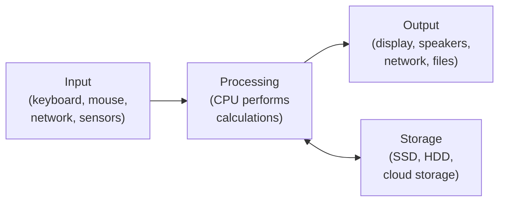
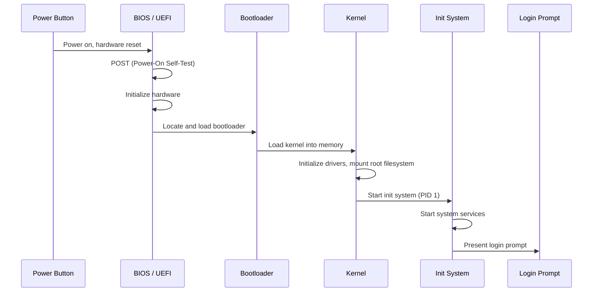
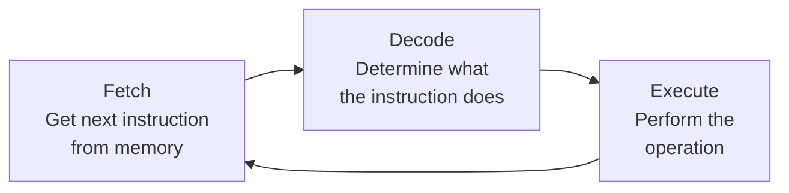

# Introduction to Computers

Before you can manage servers, deploy containers, or build cloud infrastructure, you need to understand what a computer actually is and how it works at a fundamental level.

## What Is a Computer?

A computer is a machine that takes input, processes it, and produces output. Every server in a data center, every laptop on a desk, and every virtual machine in the cloud follows this same basic model. Understanding the building blocks -- CPU, memory, storage, and I/O -- gives you a foundation for everything that comes next.

That definition sounds simple, but it describes an enormous range of devices. A Raspberry Pi running a home lab, a rack-mounted server processing millions of API requests, and a virtual machine spun up on AWS all share the same fundamental architecture. Once you understand how that architecture works, every layer you encounter later -- operating systems, networking, containers, orchestration -- will make more sense.

## Why It Matters

Cloud platforms, containers, and orchestration systems are all abstractions built on top of physical hardware. When you understand what is happening underneath, you can make better decisions about resource allocation, troubleshoot performance issues, and understand why certain architectural patterns exist.

Consider a concrete example: when you choose an EC2 instance type on AWS, you are selecting a specific combination of CPU cores, RAM, storage type, and network bandwidth. If you do not understand what those components do, you are guessing. If you do understand them, you are making an informed engineering decision.

## What You'll Learn

- How hardware components (CPU, RAM, storage, I/O) work together
- The difference between hardware and software
- How binary and data representation work
- The boot process: from power button to operating system
- How modern computers execute instructions

---

## The Input-Process-Output Model

Every computer, no matter how complex, follows a core cycle: receive input, process it, and produce output. Storage acts as a fourth element, allowing the system to persist data between cycles.



**Input** is any data that enters the system. This could be keystrokes, mouse clicks, network packets arriving at a server, or sensor readings from an IoT device. **Processing** is what the CPU does with that data -- arithmetic, logic, comparisons, transformations. **Output** is the result: text on a screen, a file written to disk, a response sent over the network. **Storage** sits alongside processing, holding data that needs to persist after the current operation completes.

This model applies at every scale. When you type a URL into a browser (input), the computer sends a network request, receives HTML, and renders a page (processing), which then appears on your screen (output). When a Kubernetes node receives a pod scheduling request (input), it allocates resources and starts containers (processing), then reports status back to the control plane (output).

> **Try It**: Think about a task you performed on your computer today. Identify the input, the processing step, and the output. For example: you opened a terminal and typed `ls` (input), the shell and OS retrieved the directory listing (processing), and the file names appeared on your screen (output).

---

## Hardware Components

Hardware is the physical machinery of a computer. Every component has a specific role, and understanding those roles is essential for working in cloud and infrastructure.

### CPU (Central Processing Unit)

The CPU is the brain of the computer. It executes instructions -- arithmetic operations, logical comparisons, data movement -- billions of times per second. Two key characteristics define a CPU's capability:

- **Clock speed** measures how many cycles the CPU performs per second, expressed in gigahertz (GHz). A 3.5 GHz processor executes 3.5 billion cycles per second. Each instruction typically takes one or more cycles to complete.
- **Cores** are independent processing units within a single CPU. A quad-core processor can execute four streams of instructions simultaneously. Modern server CPUs often have 32, 64, or even 128 cores, which is why cloud providers can carve a single physical server into dozens of virtual machines.

When you select a cloud instance with "4 vCPUs," you are requesting four virtual cores. Understanding what a core does helps you reason about whether your workload is CPU-bound (needs more cores or faster clock speed) or bound by something else entirely.

### RAM (Random Access Memory)

RAM is the computer's short-term working memory. It is **volatile**, meaning it loses all its contents when power is removed. The CPU reads data from RAM, processes it, and writes results back. RAM is fast -- hundreds of times faster than an SSD -- but limited in capacity and expensive per gigabyte compared to storage.

When a program runs, the operating system loads its instructions and data into RAM. If your system runs out of RAM, the OS starts using a portion of the storage drive as overflow (called **swap** on Linux), which dramatically slows performance. This is why "out of memory" errors and high swap usage are common things to investigate when troubleshooting server performance.

### Storage (HDD vs SSD)

Storage is where data lives permanently -- it is **non-volatile**, meaning it retains data even when power is off.

- **HDD (Hard Disk Drive)**: Uses spinning magnetic platters and a moving read/write head. HDDs are inexpensive per gigabyte and work well for bulk storage, backups, and archival. However, they are slow compared to SSDs, especially for random access patterns, because the mechanical head must physically move to the right location on the platter.
- **SSD (Solid State Drive)**: Uses flash memory with no moving parts. SSDs are dramatically faster than HDDs, especially for random read/write operations. They are more expensive per gigabyte but have become the standard for operating system drives, databases, and any workload where latency matters.

In cloud environments, you encounter this distinction directly. AWS EBS volumes come in HDD-backed (`st1`, `sc1`) and SSD-backed (`gp3`, `io2`) types, with significant differences in performance and cost.

### I/O Devices

I/O (Input/Output) devices are everything that connects a computer to the outside world. This includes keyboards, mice, monitors, network interfaces, USB devices, and more. On a server, the most critical I/O device is often the **network interface card (NIC)**, which handles all network communication. In cloud infrastructure, virtual NICs and network bandwidth are key resources you manage.

### The Motherboard

The motherboard is the circuit board that connects all components together. It provides the physical pathways (called **buses**) through which the CPU, RAM, storage, and I/O devices communicate. The motherboard also houses the chipset, which controls data flow between components, and the BIOS/UEFI firmware chip.

In server hardware, the motherboard determines how many CPUs, how much RAM, and how many expansion cards (like additional NICs or GPU accelerators) the system can support.

### Component Comparison

| Component | Role | Speed | Volatility | Typical Capacity |
|-----------|------|-------|------------|-----------------|
| CPU | Executes instructions | Billions of operations/sec | N/A | 4-128 cores |
| RAM | Short-term working memory | ~100 GB/s bandwidth | Volatile (lost on power off) | 8 GB - 2 TB |
| SSD | Long-term fast storage | ~500 MB/s - 7 GB/s | Non-volatile (persists) | 256 GB - 8 TB |
| HDD | Long-term bulk storage | ~100-200 MB/s | Non-volatile (persists) | 1 TB - 20 TB |
| NIC | Network communication | 1-100 Gbps | N/A | N/A |

> **Try It**: If you are on a Linux or macOS system, open a terminal and run the following commands to inspect your own hardware:
>
> ```bash
> # See CPU information
> lscpu        # Linux
> sysctl -a | grep machdep.cpu   # macOS
>
> # See memory information
> free -h      # Linux
> sysctl hw.memsize   # macOS
>
> # See storage devices
> lsblk        # Linux
> diskutil list   # macOS
> ```
>
> Compare the output to the table above. How many CPU cores does your machine have? How much RAM?

---

## Software: System vs Application

Hardware alone does nothing useful. Software is the set of instructions that tells hardware what to do. Software falls into two broad categories.

### System Software

System software manages the hardware and provides a platform for other programs to run on. It includes:

- **Operating System (OS)**: The core layer that manages CPU scheduling, memory allocation, file systems, device drivers, and user permissions. Linux, Windows, and macOS are the operating systems you will encounter most often. You will explore this in depth in [OS Fundamentals](/learn/foundations/os-fundamentals/os-fundamentals/).
- **Firmware**: Low-level software stored directly on hardware chips. The BIOS or UEFI firmware on the motherboard is the first code that runs when you press the power button. Network cards, SSDs, and GPUs all have their own firmware as well.
- **Device Drivers**: Programs that translate between the OS and specific hardware. When the OS wants to send a network packet, it communicates with the NIC driver, which knows how to talk to that particular network card.

### Application Software

Application software is everything that runs on top of the operating system to perform user-facing or business tasks: web browsers, databases, web servers, container runtimes, CI/CD pipelines, and the applications you will eventually deploy and manage.

### How Programs Run

Computers execute **machine code** -- raw binary instructions specific to the CPU architecture. Humans do not write machine code directly. Instead, software is written in higher-level programming languages and then translated:

- **Compiled languages** (C, Go, Rust) are translated into machine code by a **compiler** before execution. The result is a standalone binary file that the CPU can run directly. This typically produces fast, efficient programs.
- **Interpreted languages** (Python, JavaScript, Ruby) are translated into machine code line by line at runtime by an **interpreter**. This makes development faster and more flexible but generally produces slower execution.
- **Hybrid approaches** (Java, C#) compile to an intermediate **bytecode** that runs on a virtual machine (JVM, CLR), which then translates to machine code at runtime.

Understanding this distinction matters when you are building and deploying software. A Go binary can run directly on a minimal container image, while a Python application needs the Python interpreter installed. You will explore these concepts further in [Programming](/learn/foundations/programming/programming/).

> **Try It**: If you have Python installed, you can see interpretation in action. Open a terminal and run:
>
> ```bash
> python3 -c "print(2 + 2)"
> ```
>
> Python interpreted that single line of source code, translated it to machine instructions, executed the addition, and printed the result -- all at runtime.

---

## Binary and Data Representation

### Why Binary?

Computers are built from billions of tiny electronic switches called **transistors**. Each transistor has two states: **on** (electrical current flows) or **off** (no current). Because there are exactly two states, computers use the **binary** number system (base 2), which has exactly two digits: `0` and `1`.

Everything a computer does -- every number it calculates, every character it displays, every pixel it renders, every packet it sends -- is ultimately represented as a sequence of zeros and ones.

### Bits and Bytes

- A **bit** is a single binary digit: `0` or `1`. It is the smallest unit of data.
- A **byte** is a group of 8 bits. A single byte can represent 256 different values (2^8 = 256), which is enough to encode a single character in basic English text.

### Data Size Units

As data scales up, we use larger units. Note that there are two conventions: decimal (powers of 1000, used by storage manufacturers and network speeds) and binary (powers of 1024, used by operating systems and memory). The binary versions use "bi" in the name (kibibyte, mebibyte, etc.).

| Unit | Decimal (SI) | Binary (IEC) | Common Usage |
|------|-------------|-------------|-------------|
| Kilobyte / Kibibyte | 1 KB = 1,000 bytes | 1 KiB = 1,024 bytes | Small config files |
| Megabyte / Mebibyte | 1 MB = 1,000,000 bytes | 1 MiB = 1,048,576 bytes | Photos, short documents |
| Gigabyte / Gibibyte | 1 GB = 10^9 bytes | 1 GiB = 2^30 bytes | RAM size, application installs |
| Terabyte / Tebibyte | 1 TB = 10^12 bytes | 1 TiB = 2^40 bytes | Hard drives, databases |

This is why a "500 GB" hard drive shows up as roughly 465 GiB in your operating system -- the drive manufacturer used decimal gigabytes, but the OS reports binary gibibytes.

### Decimal to Binary Conversion

To convert a decimal number to binary, repeatedly divide by 2 and record the remainders. Let us convert the decimal number **13** to binary:

| Step | Division | Quotient | Remainder |
|------|----------|----------|-----------|
| 1 | 13 / 2 | 6 | **1** |
| 2 | 6 / 2 | 3 | **0** |
| 3 | 3 / 2 | 1 | **1** |
| 4 | 1 / 2 | 0 | **1** |

Read the remainders from bottom to top: **1101**. So decimal 13 = binary 1101.

To verify: (1 x 8) + (1 x 4) + (0 x 2) + (1 x 1) = 8 + 4 + 0 + 1 = 13. Correct.

> **Try It**: Convert the decimal number **42** to binary using the division method above. Then verify your answer by running this in a terminal:
>
> ```bash
> python3 -c "print(bin(42))"
> ```
>
> The output will start with `0b`, which is Python's prefix for binary numbers. The answer should be `0b101010`.

### ASCII and Character Encoding

Computers store text by assigning a number to each character. **ASCII** (American Standard Code for Information Interchange) is the original encoding, mapping 128 characters to the numbers 0-127. For example:

- `A` = 65 (binary: `01000001`)
- `a` = 97 (binary: `01100001`)
- `0` = 48 (binary: `00110000`)
- Space = 32 (binary: `00100000`)

ASCII only covers basic English characters. Modern systems use **Unicode** (often encoded as **UTF-8**), which supports over 140,000 characters across all writing systems. UTF-8 is backwards-compatible with ASCII -- the first 128 characters are identical -- and is the standard encoding on the web and in Linux systems.

> **Try It**: You can see the ASCII value of any character using Python:
>
> ```bash
> python3 -c "print(ord('A'), bin(ord('A')))"
> ```
>
> This prints the decimal value (65) and binary representation (0b1000001) of the character `A`.

---

## The Boot Process

When you press the power button on a computer, a carefully orchestrated sequence of events brings the system from a powered-off state to a running operating system. Understanding this process helps you troubleshoot startup failures and understand system initialization -- skills that are directly applicable when managing servers and virtual machines.



### Step 1: BIOS / UEFI Firmware

The moment power reaches the motherboard, the CPU begins executing instructions stored in the **firmware** chip. This firmware is either **BIOS** (Basic Input/Output System, the legacy standard) or **UEFI** (Unified Extensible Firmware Interface, the modern replacement).

The firmware performs the **POST** (Power-On Self-Test), which checks that essential hardware is present and functional: CPU, RAM, storage controllers, video output. If POST fails, many systems emit a series of beeps or flash error codes -- you may have heard these if a stick of RAM was not seated properly.

After POST succeeds, the firmware looks for a **bootable device** -- an SSD, HDD, USB drive, or network interface -- based on the configured boot order.

### Step 2: Bootloader

The firmware loads the **bootloader** from the boot device. On Linux systems, this is typically **GRUB** (GRand Unified Bootloader). The bootloader's job is to locate the operating system kernel, load it into RAM, and hand off control.

GRUB can present a menu if multiple operating systems or kernel versions are installed, allowing the user to choose which one to boot. In cloud environments, the bootloader is usually configured to automatically load a single kernel with no user interaction.

### Step 3: Kernel Initialization

The **kernel** is the core of the operating system. Once loaded into memory, it takes over from the bootloader and begins initializing the system:

1. Detects and initializes hardware (CPU features, memory layout, attached devices)
2. Loads necessary device drivers
3. Mounts the **root filesystem** (the main storage partition) so that files become accessible
4. Starts the **init system** as the first user-space process (Process ID 1)

### Step 4: Init System

The init system is responsible for starting all the services that make the system usable: networking, logging, SSH daemon, web servers, container runtimes, and so on. On modern Linux systems, the most common init system is **systemd**. Older systems used **SysVinit** or **Upstart**.

The init system reads configuration files that define which services to start, in what order, and with what dependencies. For example, a web server should not start until the network is up.

### Step 5: Login Prompt

Once all essential services are running, the system presents a login prompt -- either a text-based console login or a graphical login screen. On servers, this is typically an SSH daemon waiting for remote connections.

At this point, the system is fully operational and ready to accept user input.

> **Try It**: If you are running a Linux system, you can examine the boot log to see this sequence in action:
>
> ```bash
> # View kernel boot messages
> dmesg | head -50
>
> # View systemd boot timeline
> systemd-analyze
>
> # View the order services started
> systemd-analyze blame | head -20
> ```
>
> The `dmesg` output shows hardware initialization messages from the kernel. The `systemd-analyze` commands show how long the boot process took and which services were the slowest.

---

## The Fetch-Decode-Execute Cycle

Understanding how the CPU actually processes instructions ties everything together. The CPU operates in a continuous loop called the **fetch-decode-execute cycle** (also known as the instruction cycle).



### Fetch

The CPU maintains a special register called the **program counter** (PC) that holds the memory address of the next instruction. During the fetch phase, the CPU reads the instruction at that address from RAM and copies it into an internal register called the **instruction register**. The program counter then increments to point to the following instruction.

### Decode

The CPU's **control unit** examines the fetched instruction and determines what operation to perform. Is it an addition? A comparison? A data move? The control unit also identifies which registers or memory locations the instruction involves.

### Execute

The appropriate part of the CPU carries out the instruction. Arithmetic and logic operations are handled by the **ALU** (Arithmetic Logic Unit). Data movement instructions transfer values between registers and memory. Branch instructions change the program counter to jump to a different part of the program.

After execution, the cycle repeats. Modern CPUs execute this cycle billions of times per second, and they use techniques like **pipelining** (overlapping the stages of multiple instructions) and **branch prediction** (guessing which instruction comes next) to maximize throughput.

### CPU Architectures: x86 vs ARM

Not all CPUs speak the same language. The **instruction set architecture** (ISA) defines the set of instructions a CPU understands. Two dominant ISAs exist today:

| Feature | x86 / x86-64 | ARM |
|---------|-------------|-----|
| Design philosophy | CISC (Complex Instruction Set) | RISC (Reduced Instruction Set) |
| Typical use | Desktops, servers, cloud VMs | Mobile devices, tablets, embedded systems |
| Power consumption | Higher | Lower |
| Key manufacturers | Intel, AMD | Apple (M-series), Qualcomm, AWS (Graviton) |
| Cloud relevance | Most EC2 instances, Azure VMs | AWS Graviton instances, cost-efficient workloads |

The distinction matters in cloud computing. AWS Graviton instances (ARM-based) are often 20-40% less expensive than their x86 equivalents for compatible workloads. However, your software must be compiled for the target architecture -- a binary built for x86 will not run on ARM, and vice versa. This is why container images are often published for multiple architectures, and why you will see `amd64` and `arm64` tags in container registries.

> **Try It**: Check which CPU architecture your system uses:
>
> ```bash
> uname -m
> ```
>
> On most Intel/AMD systems you will see `x86_64`. On Apple Silicon Macs you will see `arm64`. On a Raspberry Pi you will see `aarch64` (which is the 64-bit ARM architecture).

---

## Key Takeaways

- A computer follows the **input-process-output** model, with storage providing persistence between cycles.
- **Hardware components** each have distinct roles: the CPU executes instructions, RAM provides fast volatile working memory, storage (HDD/SSD) provides persistent non-volatile data, and I/O devices connect the system to the outside world.
- **Software** is divided into system software (OS, firmware, drivers) and application software. Programs written in high-level languages are compiled or interpreted into machine code that the CPU can execute.
- Computers use **binary** because transistors have two states (on/off). All data -- numbers, text, images, network packets -- is represented as sequences of bits.
- The **boot process** follows a precise chain: firmware (BIOS/UEFI) performs POST, loads the bootloader, which loads the kernel, which starts the init system, which launches services and presents a login prompt.
- The CPU continuously runs the **fetch-decode-execute cycle**, processing billions of instructions per second. Different CPU architectures (x86 vs ARM) use different instruction sets, which affects software compatibility and cloud instance selection.
- These fundamentals are not abstract theory -- they are the foundation for every decision you will make about virtual machines, containers, resource allocation, and performance troubleshooting in cloud infrastructure.

---

## Prerequisites

None -- this is where it all begins.

## Next Step

Continue to [OS Fundamentals](/learn/foundations/os-fundamentals/os-fundamentals/) to learn how operating systems manage hardware and provide the environment where all software runs.
