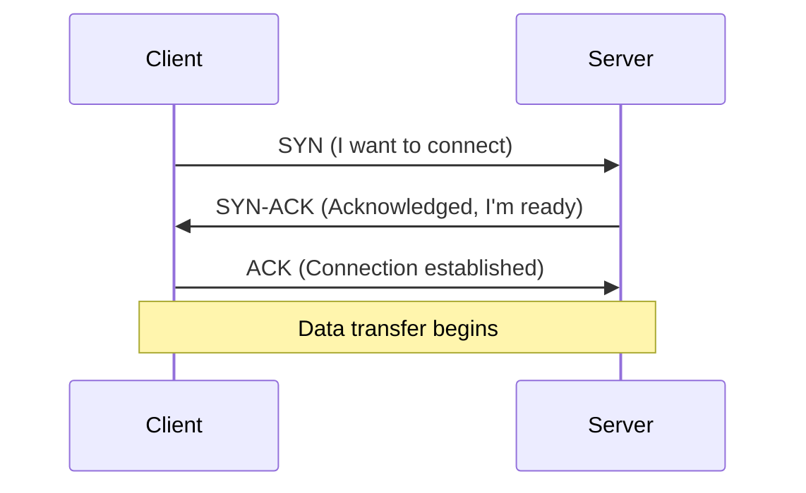
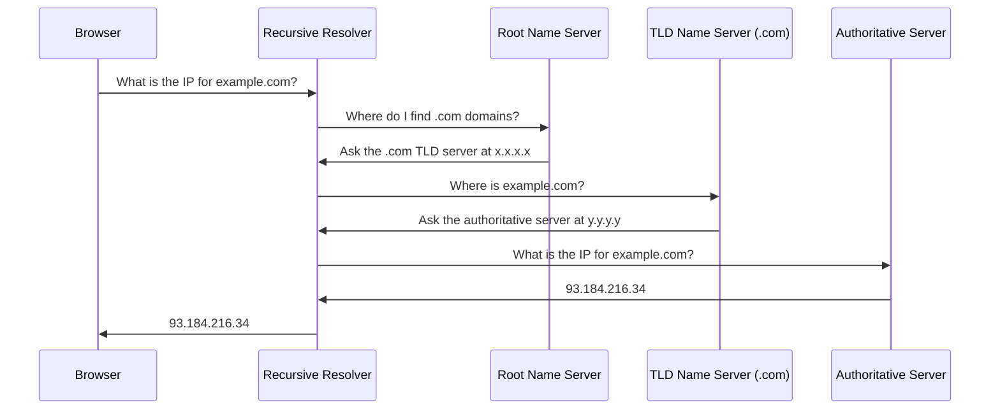

# Networking Fundamentals

Computers don't exist in isolation. Networking is how they communicate, whether that's two containers on the same host or services spread across multiple cloud regions.

## What Is Networking?

Networking is the practice of connecting computers so they can exchange data. This involves protocols (agreed-upon rules for communication), addressing (how to find a specific machine), and routing (how data travels from point A to point B). Every time you open a browser, deploy a container, or SSH into a server, networking makes it happen.

## Why It Matters

Cloud infrastructure, container networking, load balancers, DNS configuration, VPNs, and firewalls all rely on networking fundamentals. When something breaks in production, the issue is often networking. Understanding these concepts is critical for troubleshooting and architecture decisions.

## What You'll Learn

- IP addressing (IPv4 and IPv6) and subnetting
- TCP vs UDP and when each is used
- DNS: how domain names resolve to IP addresses
- HTTP/HTTPS: the protocol of the web
- Ports and sockets
- Firewalls and network security basics
- SSH: secure remote access

---

## How Networks Work

When you send data across a network, it does not travel as a single unbroken stream. The data is broken into small chunks called **packets**. Each packet contains a header (with addressing information like source and destination) and a payload (the actual data). Packets may take different routes to reach the same destination and are reassembled on arrival.

Three types of hardware make this possible:

- **Switches** connect devices within the same local network. A switch learns which devices are connected to which ports and forwards packets only to the correct destination, rather than broadcasting to every device.
- **Routers** connect different networks together. Your home router connects your local network to your ISP's network, which connects to the broader internet. Routers examine packet headers and decide the best path to forward each packet toward its destination.
- **Access points** provide wireless connectivity, bridging Wi-Fi devices into the wired network.

### LAN vs WAN

A **LAN** (Local Area Network) is a network within a single location, like an office or a data center floor. Devices on a LAN can communicate directly through switches without going through a router.

A **WAN** (Wide Area Network) spans multiple locations. The internet itself is the largest WAN. When a packet needs to travel from your laptop to a server in another region, it crosses multiple networks connected by routers, which is WAN communication.

In cloud environments, you will work with **Virtual Private Clouds (VPCs)**, which are software-defined networks that behave like LANs. Subnets within a VPC are like separate LAN segments. Understanding the LAN/WAN distinction helps you design and troubleshoot cloud network architectures.

---

## Network Models

Networking is complex. Models break it into manageable layers so each layer can focus on one job.

### The OSI Model

The **OSI model** (Open Systems Interconnection) is a conceptual framework with seven layers. You do not need to memorize every detail, but understanding the layers helps you pinpoint where a problem is occurring. When someone says "this is a Layer 4 issue," they mean it relates to transport (TCP/UDP).

| Layer | Name | What It Does | Examples |
|---|---|---|---|
| 7 | Application | User-facing protocols and data | HTTP, HTTPS, DNS, SSH, FTP, SMTP |
| 6 | Presentation | Data encoding, encryption, compression | TLS/SSL, JPEG, JSON |
| 5 | Session | Manages connections between applications | Session establishment, authentication tokens |
| 4 | Transport | Reliable (or fast) delivery between hosts | TCP, UDP |
| 3 | Network | Logical addressing and routing across networks | IP (IPv4, IPv6), ICMP, routers |
| 2 | Data Link | Physical addressing within a local network | Ethernet, MAC addresses, switches |
| 1 | Physical | Raw bit transmission over a medium | Cables, Wi-Fi signals, fiber optics |

### The TCP/IP Model

The **TCP/IP model** is what the internet actually uses. It collapses the OSI layers into four practical layers:

| TCP/IP Layer | OSI Layers | What It Does | Examples |
|---|---|---|---|
| Application | 7, 6, 5 | Application protocols and data formatting | HTTP, DNS, SSH, TLS |
| Transport | 4 | End-to-end delivery and flow control | TCP, UDP |
| Internet | 3 | Addressing and routing across networks | IP, ICMP |
| Network Access | 2, 1 | Physical transmission on local network | Ethernet, Wi-Fi, ARP |

When you are troubleshooting, think in layers. If you can ping an IP address but cannot load a website, the issue is above Layer 3. If you cannot ping at all, the problem is at Layer 3 or below. This systematic approach saves hours of guessing.

---

## IP Addressing

Every device on a network needs an address so other devices can find it. IP (Internet Protocol) addresses serve this purpose.

### IPv4

IPv4 addresses are **32-bit numbers** written in **dotted decimal** notation: four numbers separated by dots, each ranging from 0 to 255.

```
192.168.1.100
```

Each of the four numbers represents 8 bits (one octet), and 4 octets x 8 bits = 32 bits total. This gives IPv4 a maximum of roughly 4.3 billion unique addresses.

### Public vs Private IP Ranges

Not all IP addresses are routable on the public internet. Three ranges are reserved for **private networks**. Devices on your home network, corporate LAN, or cloud VPC use private IPs. A router or NAT gateway translates private addresses to a public address when traffic needs to reach the internet.

| Range | CIDR Notation | Number of Addresses | Typical Use |
|---|---|---|---|
| 10.0.0.0 - 10.255.255.255 | 10.0.0.0/8 | 16,777,216 | Large enterprise networks, cloud VPCs |
| 172.16.0.0 - 172.31.255.255 | 172.16.0.0/12 | 1,048,576 | Medium networks, Docker default bridge |
| 192.168.0.0 - 192.168.255.255 | 192.168.0.0/16 | 65,536 | Home networks, small offices |

There are also special addresses you will encounter:

- **127.0.0.1** (localhost) -- refers to the local machine itself. Used for testing services locally.
- **0.0.0.0** -- means "all interfaces" when binding a service, or "any address" in routing tables.

### CIDR Notation and Subnetting

**CIDR** (Classless Inter-Domain Routing) notation uses a slash followed by a number to indicate how many bits of the address identify the network. The remaining bits identify individual hosts within that network.

```
192.168.1.0/24
```

The `/24` means the first 24 bits (the first three octets, `192.168.1`) identify the network. The remaining 8 bits identify hosts. With 8 host bits, you get 2^8 = 256 addresses (254 usable, since the first is the network address and the last is the broadcast address).

Common CIDR blocks:

| CIDR | Subnet Mask | Usable Hosts | Use Case |
|---|---|---|---|
| /32 | 255.255.255.255 | 1 | Single host (often in firewall rules) |
| /24 | 255.255.255.0 | 254 | Standard subnet for small networks |
| /16 | 255.255.0.0 | 65,534 | Large networks, VPCs |
| /8 | 255.0.0.0 | 16,777,214 | Very large networks |

**Subnetting example**: Suppose your cloud VPC uses `10.0.0.0/16`. You want to divide it into smaller subnets for different purposes:

- `10.0.1.0/24` -- public subnet (web servers), 254 hosts
- `10.0.2.0/24` -- private subnet (application servers), 254 hosts
- `10.0.3.0/24` -- database subnet (databases), 254 hosts

Each `/24` subnet can hold 254 hosts, and they are isolated from each other by default. This is exactly how you structure subnets in AWS VPCs, Azure VNets, and other cloud environments.

### Viewing Your IP Address

Use the `ip addr` command (or `ip a` for short) to see your machine's network interfaces and their IP addresses:

```bash
ip addr show
```

```
1: lo: <LOOPBACK,UP,LOWER_UP> mtu 65536
    inet 127.0.0.1/8 scope host lo
2: eth0: <BROADCAST,MULTICAST,UP,LOWER_UP> mtu 1500
    inet 192.168.1.100/24 brd 192.168.1.255 scope global eth0
```

Here you can see two interfaces: `lo` (loopback, always 127.0.0.1) and `eth0` (the primary network interface with IP 192.168.1.100 on a /24 subnet).

### IPv6

IPv4's 4.3 billion addresses are not enough for the modern internet. **IPv6** uses **128-bit addresses**, providing approximately 340 undecillion (3.4 x 10^38) unique addresses.

IPv6 addresses are written as eight groups of four hexadecimal digits separated by colons:

```
2001:0db8:85a3:0000:0000:8a2e:0370:7334
```

Leading zeros within a group can be dropped, and consecutive groups of all zeros can be replaced with `::` (once per address):

```
2001:db8:85a3::8a2e:370:7334
```

IPv6 adoption is growing, and cloud providers support it. For most day-to-day infrastructure work, you will still primarily encounter IPv4, but being aware of IPv6 format and purpose is important.

> **Try It**: Run `ip addr show` (or `ifconfig` on macOS) and identify your machine's private IP address and the CIDR block it belongs to. Find your public IP address by running `curl -s https://ifconfig.me`. Notice that your private and public IPs are different -- your router is performing NAT.

---

## TCP vs UDP

The **transport layer** (Layer 4) is responsible for delivering data between two hosts. The two main protocols are TCP and UDP, and they make fundamentally different tradeoffs.

### TCP: Transmission Control Protocol

TCP is **connection-oriented**. Before any data is exchanged, the two hosts establish a connection through a **three-way handshake**:



1. The client sends a **SYN** (synchronize) packet.
2. The server responds with a **SYN-ACK** (synchronize-acknowledge).
3. The client sends an **ACK** (acknowledge), and the connection is open.

TCP characteristics:

- **Reliable**: Every packet is acknowledged. Lost packets are retransmitted.
- **Ordered**: Packets are reassembled in the correct sequence, even if they arrive out of order.
- **Flow control**: TCP adjusts transmission speed to avoid overwhelming the receiver.
- **Error checking**: Corrupted packets are detected and retransmitted.

When the connection is done, a similar handshake (FIN/ACK) tears it down gracefully.

### UDP: User Datagram Protocol

UDP is **connectionless**. There is no handshake. The sender fires packets at the destination with no guarantee they will arrive, arrive in order, or arrive intact.

UDP characteristics:

- **Fast**: No connection setup overhead, no waiting for acknowledgments.
- **Lightweight**: Smaller header than TCP (8 bytes vs 20+ bytes).
- **No guarantee**: Packets can be lost, duplicated, or arrive out of order.
- **No flow control**: The sender transmits at whatever rate it chooses.

### Comparison

| Feature | TCP | UDP |
|---|---|---|
| Connection | Connection-oriented (handshake) | Connectionless |
| Reliability | Guaranteed delivery | Best effort |
| Ordering | Packets arrive in order | No ordering guarantee |
| Speed | Slower (overhead for reliability) | Faster (minimal overhead) |
| Use cases | Web (HTTP/HTTPS), SSH, email, file transfer, databases | DNS queries, video streaming, gaming, VoIP, monitoring |
| Header size | 20-60 bytes | 8 bytes |

### When to Use Each

Use **TCP** when data integrity matters: loading a web page, transferring a file, connecting to a database, or running an SSH session. If a packet is lost, you want it retransmitted.

Use **UDP** when speed matters more than perfection: streaming video (a dropped frame is better than a frozen screen), DNS lookups (fast, small queries), online gaming (stale position data is useless -- send the latest), and monitoring/metrics collection.

> **Try It**: Run `ss -tuln` on a Linux machine. Lines showing `tcp` are services using TCP. Lines showing `udp` are services using UDP. Notice that most services (SSH on port 22, HTTP on port 80) use TCP, while DNS (port 53) may show both.

---

## DNS

The **Domain Name System** is the phone book of the internet. Humans remember domain names like `example.com`. Computers need IP addresses like `93.184.216.34`. DNS translates between the two.

### How DNS Resolution Works

When you type `example.com` into a browser, the following chain of queries happens:



1. Your browser asks the **recursive resolver** (usually provided by your ISP or a service like Cloudflare's 1.1.1.1 or Google's 8.8.8.8).
2. The resolver asks a **root name server** which server handles the `.com` top-level domain.
3. The resolver asks the **.com TLD server** which server is authoritative for `example.com`.
4. The resolver asks the **authoritative name server** for the actual IP address.
5. The resolver returns the answer to your browser and caches it.

In practice, caching at every level means this full chain rarely happens. The resolver usually has the answer cached from a previous query.

### DNS Record Types

DNS does not just map names to IP addresses. Different record types serve different purposes:

| Record Type | Purpose | Example |
|---|---|---|
| A | Maps a domain to an IPv4 address | `example.com -> 93.184.216.34` |
| AAAA | Maps a domain to an IPv6 address | `example.com -> 2606:2800:220:1:...` |
| CNAME | Alias one domain to another | `www.example.com -> example.com` |
| MX | Mail exchange server for the domain | `example.com -> mail.example.com (priority 10)` |
| NS | Name servers authoritative for the domain | `example.com -> ns1.example.com` |
| TXT | Arbitrary text (SPF, DKIM, domain verification) | `example.com -> "v=spf1 include:..."` |
| SOA | Start of Authority -- primary server, admin contact, serial number | Zone metadata |

### TTL (Time to Live)

Every DNS record has a **TTL** value in seconds. This tells resolvers how long to cache the record before querying again. A TTL of 3600 means the record is cached for one hour.

- **Low TTL** (60-300 seconds): Changes propagate quickly. Useful when you are migrating servers or need fast failover.
- **High TTL** (3600-86400 seconds): Reduces DNS query load but means changes take longer to propagate.

When planning a migration, lower the TTL well in advance (at least 24-48 hours before) so that by the time you switch the IP address, most caches have already expired.

### DNS Commands

**`dig`** is the most powerful DNS lookup tool:

```bash
dig example.com
```

```
; <<>> DiG 9.18.28 <<>> example.com
;; ANSWER SECTION:
example.com.        3600    IN    A    93.184.216.34

;; Query time: 24 msec
;; SERVER: 1.1.1.1#53(1.1.1.1)
```

Query specific record types:

```bash
dig example.com MX          # mail exchange records
dig example.com NS          # name servers
dig example.com TXT         # text records
dig +short example.com      # just the IP, no extra info
dig @8.8.8.8 example.com   # query Google's DNS resolver specifically
```

**`nslookup`** is a simpler alternative:

```bash
nslookup example.com
```

```
Server:         1.1.1.1
Address:        1.1.1.1#53

Non-authoritative answer:
Name:   example.com
Address: 93.184.216.34
```

> **Try It**: Run `dig +short google.com` to see Google's IP addresses. Then run `dig google.com MX` to see their mail servers. Try `dig google.com NS` to see the authoritative name servers. Finally, run `dig +trace google.com` to watch the full resolution chain from root servers down to the final answer.

---

## HTTP and HTTPS

**HTTP** (HyperText Transfer Protocol) is the protocol that powers the web. Every time you load a page, submit a form, or call an API, HTTP is the protocol carrying that communication.

### Request-Response Model

HTTP follows a simple pattern: the client sends a **request**, the server returns a **response**. Each request includes a **method** (what you want to do), a **path** (which resource), **headers** (metadata), and optionally a **body** (data to send).

### HTTP Methods

| Method | Purpose | Has Body | Idempotent |
|---|---|---|---|
| GET | Retrieve a resource | No | Yes |
| POST | Create a new resource | Yes | No |
| PUT | Replace a resource entirely | Yes | Yes |
| PATCH | Partially update a resource | Yes | No |
| DELETE | Remove a resource | Rarely | Yes |
| HEAD | Same as GET but returns only headers (no body) | No | Yes |

**Idempotent** means making the same request multiple times produces the same result. GET, PUT, and DELETE are idempotent. POST is not -- sending the same POST twice may create two resources.

### Status Codes

The server's response includes a three-digit status code indicating the result:

| Range | Category | Common Codes |
|---|---|---|
| 1xx | Informational | 100 Continue, 101 Switching Protocols |
| 2xx | Success | 200 OK, 201 Created, 204 No Content |
| 3xx | Redirection | 301 Moved Permanently, 302 Found, 304 Not Modified |
| 4xx | Client Error | 400 Bad Request, 401 Unauthorized, 403 Forbidden, 404 Not Found, 429 Too Many Requests |
| 5xx | Server Error | 500 Internal Server Error, 502 Bad Gateway, 503 Service Unavailable, 504 Gateway Timeout |

Memorize the bold ones. You will see them constantly in logs, API responses, and monitoring dashboards. A 502 from a load balancer means the backend server is unreachable. A 429 means you are being rate limited. A 503 means the server is overloaded or under maintenance.

### Headers

HTTP headers carry metadata about the request or response. Common headers:

- **Content-Type**: The format of the body (`application/json`, `text/html`).
- **Authorization**: Credentials for authenticated endpoints (`Bearer <token>`).
- **User-Agent**: Identifies the client making the request.
- **Cache-Control**: Instructs caches on how to handle the response.
- **Host**: The domain name of the server (required in HTTP/1.1).

### HTTPS and TLS

**HTTPS** is HTTP with **TLS** (Transport Layer Security) encryption. TLS establishes an encrypted channel between client and server before any HTTP data is exchanged. This provides:

- **Encryption**: Data cannot be read by anyone intercepting the traffic.
- **Authentication**: The server proves its identity with a certificate issued by a trusted Certificate Authority (CA).
- **Integrity**: Data cannot be tampered with in transit.

HTTPS uses port **443** by default (HTTP uses port **80**). In production, you should always use HTTPS. Services like Let's Encrypt provide free TLS certificates.

### Using curl

`curl` is the command-line tool for making HTTP requests. You will use it constantly for testing APIs and debugging.

Fetch a page:

```bash
curl https://example.com
```

View only the response headers:

```bash
curl -I https://example.com
```

```
HTTP/2 200
content-type: text/html; charset=UTF-8
content-length: 1256
server: ECAcc (dcd/7D5A)
```

Send a POST request with JSON data:

```bash
curl -X POST https://api.example.com/users \
  -H "Content-Type: application/json" \
  -d '{"name": "cloudchase", "role": "engineer"}'
```

Verbose output to see the full request/response including TLS handshake:

```bash
curl -v https://example.com
```

Follow redirects (3xx responses):

```bash
curl -L https://example.com
```

> **Try It**: Run `curl -I https://google.com` to see the response headers. Notice the status code (likely a 301 redirect). Then run `curl -I -L https://google.com` to follow the redirect and see the final 200 response. Try `curl -s https://ifconfig.me` to see your public IP address.

---

## Ports

An IP address identifies a machine, but a machine runs many services simultaneously. **Ports** identify which service on that machine should receive the traffic. A port is a number from **0 to 65535**.

The combination of an IP address and a port is called a **socket** (e.g., `192.168.1.100:443`). When your browser connects to a web server, it connects to the server's IP address on port 443 (HTTPS).

### Well-Known Ports

Ports 0-1023 are **well-known ports** reserved for standard services. Ports 1024-49151 are **registered ports** used by applications. Ports 49152-65535 are **dynamic/ephemeral ports** used by the OS for outbound connections.

| Port | Service | Protocol |
|---|---|---|
| 22 | SSH | TCP |
| 53 | DNS | TCP/UDP |
| 80 | HTTP | TCP |
| 443 | HTTPS | TCP |
| 3306 | MySQL | TCP |
| 5432 | PostgreSQL | TCP |
| 6379 | Redis | TCP |
| 8080 | HTTP alternate (dev servers, proxies) | TCP |
| 8443 | HTTPS alternate | TCP |
| 27017 | MongoDB | TCP |

When you deploy services in [Containers](/learn/foundations/containers/) or [Kubernetes](/learn/foundations/container-orchestration/), you will map container ports to host ports. Understanding which ports your services use is essential for configuring networking and firewall rules.

### Viewing Open Ports

The `ss` command (socket statistics) shows which ports are listening on your machine:

```bash
ss -tuln
```

```
Netid  State   Recv-Q  Send-Q  Local Address:Port  Peer Address:Port
tcp    LISTEN  0       128     0.0.0.0:22           0.0.0.0:*
tcp    LISTEN  0       511     0.0.0.0:80           0.0.0.0:*
tcp    LISTEN  0       128     0.0.0.0:443          0.0.0.0:*
udp    UNCONN  0       0       127.0.0.53%lo:53     0.0.0.0:*
```

The flags: `-t` (TCP), `-u` (UDP), `-l` (listening), `-n` (show numbers instead of resolving names).

In this output, SSH (22), HTTP (80), and HTTPS (443) are listening on all interfaces (`0.0.0.0`). DNS (53) is listening only on localhost (`127.0.0.53`).

> **Try It**: Run `ss -tuln` on your machine and identify which services are listening. If you have a web server or database running, you should see their ports in the output. Try `ss -tulnp` (with `-p` for process names, may need `sudo`) to see which program owns each port.

---

## Firewalls

A **firewall** controls which network traffic is allowed into and out of a system. Without a firewall, every listening port on your server is accessible to the entire internet. Firewalls let you define rules: allow SSH from your IP, allow HTTP from anyone, deny everything else.

### UFW (Uncomplicated Firewall)

On Ubuntu, **UFW** is a user-friendly interface for the underlying `iptables` firewall. It simplifies common operations.

Enable the firewall:

```bash
sudo ufw enable
```

Check the current status and rules:

```bash
sudo ufw status verbose
```

```
Status: active
Logging: on (low)
Default: deny (incoming), allow (outgoing), disabled (routed)

To                         Action      From
--                         ------      ----
22/tcp                     ALLOW       Anywhere
80/tcp                     ALLOW       Anywhere
443/tcp                    ALLOW       Anywhere
```

Common commands:

```bash
sudo ufw allow 22                     # allow SSH from anywhere
sudo ufw allow 80/tcp                 # allow HTTP (TCP only)
sudo ufw allow 443/tcp                # allow HTTPS
sudo ufw allow from 203.0.113.0/24   # allow all traffic from a specific subnet
sudo ufw deny 3306                    # deny MySQL from anywhere
sudo ufw delete allow 80/tcp          # remove a rule
sudo ufw status numbered              # show rules with numbers (for deletion)
sudo ufw reset                        # remove all rules and disable
```

A common pattern for a web server:

```bash
sudo ufw default deny incoming
sudo ufw default allow outgoing
sudo ufw allow 22/tcp
sudo ufw allow 80/tcp
sudo ufw allow 443/tcp
sudo ufw enable
```

This denies all incoming traffic except SSH, HTTP, and HTTPS. Outgoing traffic (the server reaching out to the internet for updates, API calls, etc.) is allowed.

### Cloud Security Groups

In cloud environments (AWS, Azure, GCP), firewalls are implemented as **Security Groups** or **Network Security Groups (NSGs)**. These are virtual firewalls attached to instances or subnets. The concept is identical to UFW rules: you define inbound and outbound rules specifying port, protocol, and source/destination.

A key difference: cloud security groups are **stateful**. If you allow inbound traffic on port 80, the response traffic is automatically allowed out without a separate outbound rule. You will configure security groups extensively when working with cloud platforms.

> **Try It**: Check if UFW is installed with `which ufw`. If available, run `sudo ufw status` to see if it is active. On a practice VM (not a production server), try enabling UFW with `sudo ufw allow 22/tcp` first (so you do not lock yourself out of SSH), then `sudo ufw enable`, then `sudo ufw status verbose` to see the rules.

---

## SSH

**SSH** (Secure Shell) is the standard protocol for secure remote access to Linux servers. It encrypts all traffic between your local machine and the remote server, including passwords, commands, and output. SSH uses **port 22** by default.

### Password vs Key Authentication

SSH supports two authentication methods:

- **Password authentication**: You type a password each time you connect. Simple but less secure (vulnerable to brute-force attacks).
- **Key-based authentication**: You generate a key pair. The private key stays on your machine (never share it). The public key is placed on the server. Only someone with the matching private key can authenticate. This is the standard for production servers.

### Generating SSH Keys

```bash
ssh-keygen -t ed25519 -C "cloudchase@example.com"
```

```
Generating public/private ed25519 key pair.
Enter file in which to save the key (/home/cloudchase/.ssh/id_ed25519):
Enter passphrase (empty for no passphrase):
Your identification has been saved in /home/cloudchase/.ssh/id_ed25519
Your public key has been saved in /home/cloudchase/.ssh/id_ed25519.pub
```

- `-t ed25519` specifies the Ed25519 algorithm (modern, fast, secure). You may also see `rsa` keys, which are older but still widely used.
- `-C` adds a comment (typically your email) for identification.
- The **private key** (`id_ed25519`) stays on your machine. Protect it with `chmod 600 ~/.ssh/id_ed25519`.
- The **public key** (`id_ed25519.pub`) is what you copy to servers and add to services like GitHub.

To copy your public key to a remote server:

```bash
ssh-copy-id user@remote-server
```

This adds your public key to `~/.ssh/authorized_keys` on the remote server.

### Connecting to a Remote Server

```bash
ssh user@192.168.1.50                 # connect using IP address
ssh user@server.example.com           # connect using hostname
ssh -i ~/.ssh/custom_key user@host    # specify a particular private key
ssh -p 2222 user@host                 # connect to a non-standard port
```

### SSH Config File

If you connect to multiple servers regularly, typing full commands gets tedious. The `~/.ssh/config` file lets you create shortcuts:

```
Host webserver
    HostName 192.168.1.50
    User cloudchase
    Port 22
    IdentityFile ~/.ssh/id_ed25519

Host devbox
    HostName dev.example.com
    User admin
    Port 2222
    IdentityFile ~/.ssh/dev_key

Host bastion
    HostName 203.0.113.10
    User ec2-user
    IdentityFile ~/.ssh/aws_key.pem
```

Now you can connect with just:

```bash
ssh webserver
ssh devbox
ssh bastion
```

### SCP: Secure File Transfer

**SCP** (Secure Copy Protocol) uses SSH to transfer files between machines:

```bash
# Copy a local file to a remote server
scp ./deploy.sh user@server:/opt/scripts/

# Copy a file from a remote server to your local machine
scp user@server:/var/log/app.log ./

# Copy an entire directory recursively
scp -r ./project/ user@server:/home/user/project/

# Use your SSH config alias
scp ./config.yaml webserver:/etc/app/
```

SCP is being gradually replaced by `rsync` (which is more efficient for large or incremental transfers) and `sftp` (which provides an interactive file browser), but SCP remains common and useful for quick transfers.

> **Try It**: Generate an SSH key pair with `ssh-keygen -t ed25519`. Check the files created in `~/.ssh/`. View your public key with `cat ~/.ssh/id_ed25519.pub`. If you have a remote server or VM, copy the key with `ssh-copy-id` and test passwordless login. Create a basic `~/.ssh/config` entry for a server you access frequently.

---

## Troubleshooting Tools

When something is not working, these tools help you diagnose where the problem is. Work from the bottom of the network stack upward: Can you reach the host? Is the port open? Is the service responding correctly?

| Tool | Purpose | Example |
|---|---|---|
| `ping` | Test if a host is reachable (ICMP) | `ping -c 4 google.com` |
| `traceroute` / `tracepath` | Show the path packets take to a destination | `tracepath google.com` |
| `curl` | Make HTTP requests and test web services | `curl -I https://example.com` |
| `dig` | Query DNS records | `dig +short example.com` |
| `nslookup` | Simple DNS lookup | `nslookup example.com` |
| `ss` | Show listening ports and connections | `ss -tuln` |
| `ip addr` | Show network interfaces and IP addresses | `ip addr show` |
| `nmap` | Scan ports on a remote host | `nmap -p 22,80,443 host` |
| `netcat` (`nc`) | Test TCP/UDP connectivity to a port | `nc -zv host 443` |
| `tcpdump` | Capture and analyze network packets | `sudo tcpdump -i eth0 port 80` |
| `mtr` | Combined ping and traceroute (continuous) | `mtr google.com` |

### A Troubleshooting Workflow

When a service is unreachable, follow this sequence:

1. **Check DNS**: `dig +short the-domain.com` -- does it resolve to an IP?
2. **Check connectivity**: `ping -c 4 <ip>` -- can you reach the host at all?
3. **Check the route**: `tracepath <ip>` -- where is the traffic being dropped?
4. **Check the port**: `nc -zv <ip> <port>` -- is the specific port open and accepting connections?
5. **Check the service**: `curl -v http://<ip>:<port>` -- is the service responding correctly?
6. **Check local firewall**: `sudo ufw status` -- are your rules blocking traffic?
7. **Check logs**: `sudo journalctl -u <service>` -- what does the service itself say?

This systematic approach, working from network reachability up to application behavior, will solve the vast majority of networking issues you encounter in cloud infrastructure, [CI/CD pipelines](/learn/foundations/cicd/), and [container orchestration](/learn/foundations/container-orchestration/).

> **Try It**: Run `ping -c 4 google.com` to test basic connectivity. Then run `tracepath google.com` (or `traceroute` on macOS) to see the hops between your machine and Google's servers. Try `nc -zv google.com 443` to verify that port 443 is open. Finally, run `curl -I https://google.com` to confirm the web service is responding.

---

## Key Takeaways

- Networks move data as **packets**. Switches handle local traffic, routers connect different networks, and the TCP/IP model defines how it all works in four layers.
- **IPv4 addresses** are 32-bit numbers in dotted decimal format. Know the private ranges (10.x, 172.16-31.x, 192.168.x) and how CIDR notation (`/24`) defines subnets.
- **TCP** provides reliable, ordered delivery through a three-way handshake. Use it for web traffic, SSH, databases, and file transfers. **UDP** is fast and connectionless. Use it for DNS, streaming, and real-time applications.
- **DNS** translates domain names to IP addresses. Understand the resolution chain (resolver, root, TLD, authoritative) and common record types (A, CNAME, MX, TXT). Use `dig` to query DNS.
- **HTTP** is a request-response protocol. Know the methods (GET, POST, PUT, DELETE), status code ranges (2xx success, 4xx client error, 5xx server error), and use `curl` for testing.
- **HTTPS** adds TLS encryption. Always use it in production.
- **Ports** identify services on a machine (22 for SSH, 80 for HTTP, 443 for HTTPS). Use `ss -tuln` to see what is listening.
- **Firewalls** (UFW on Linux, Security Groups in the cloud) control which traffic is allowed. Default deny incoming, explicitly allow what you need.
- **SSH** is the standard for secure remote access. Use key-based authentication (`ed25519`), protect private keys with `chmod 600`, and simplify connections with `~/.ssh/config`.
- When troubleshooting, work from the bottom up: DNS, then ping, then port, then service, then logs.
