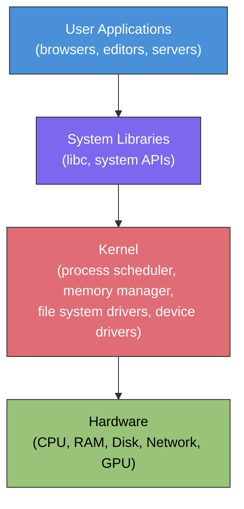
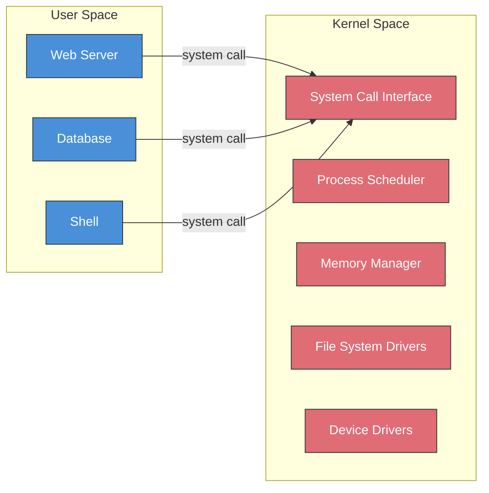
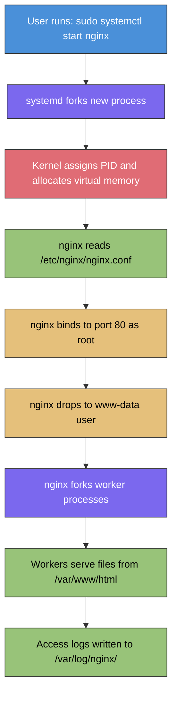

# OS Fundamentals

An operating system is the layer between hardware and the applications you use. It manages resources, enforces security, and provides the environment where everything else runs.

## What Is an Operating System?

The OS handles process scheduling, memory allocation, file system management, and hardware communication so that applications don't have to. Whether you're working with Linux servers in the cloud or managing containers on Kubernetes, the OS is always there underneath. Think of the OS as a manager that sits between the raw hardware -- CPU, RAM, disk, network cards -- and every application you run. Without it, each program would need to know how to talk directly to every piece of hardware, which would be impractical and dangerous.

## Why It Matters

Understanding OS fundamentals helps you diagnose why a process is consuming too much memory, why a file can't be accessed, or why a container behaves differently from a VM. These are daily realities in cloud and infrastructure roles.

When you deploy a web server, troubleshoot a failing container, or configure permissions on a shared file system, you are interacting with the operating system whether you realize it or not. The concepts in this section will come up again and again as you move through [Linux](/learn/foundations/linux/), [Networking](/learn/foundations/networking-fundamentals/), and eventually [Containers](/learn/foundations/containers/).

## What You'll Learn

- What an operating system does and why it exists
- Processes and process management
- Memory management and virtual memory
- File systems and directory structures
- Users, groups, and permission models
- How the kernel interacts with hardware
- Init systems and service management

---

## The Role of an Operating System

At the highest level, an operating system provides **abstraction**. It hides the complexity of hardware and presents a consistent interface that applications can use. A program does not need to know whether it is writing to an SSD or a spinning hard drive -- it simply asks the OS to write data, and the OS handles the rest.

The OS also provides **isolation**. One program cannot accidentally (or intentionally) read another program's memory. One user cannot delete another user's files without permission. This isolation is the foundation of system security.

Finally, the OS provides **resource management**. When dozens of processes all want CPU time, the OS decides who runs and for how long. When memory is running low, the OS decides what stays in RAM and what gets moved to disk. These decisions happen thousands of times per second, invisibly.

The following diagram shows the layered architecture of a typical operating system:



Each layer only communicates with the layer directly above or below it. Applications talk to system libraries. System libraries make system calls into the kernel. The kernel talks to hardware through device drivers. This layered design keeps things organized and secure.

---

## The Kernel

The **kernel** is the core of the operating system. It is the first program loaded when the computer starts, and it runs for the entire time the machine is powered on. Everything else -- every application, every service, every shell command -- depends on the kernel.

### Kernel Space vs User Space

Modern operating systems divide memory into two regions:

- **Kernel space**: Where the kernel and its modules run. Code here has unrestricted access to hardware and all of memory. A bug in kernel space can crash the entire system.
- **User space**: Where all applications run. Code here cannot access hardware directly or read another process's memory. It must ask the kernel for help through system calls.

This separation is enforced by the CPU itself. The processor has different privilege levels (often called "rings"), and it will refuse to execute privileged instructions when running in user mode.



### System Calls

A **system call** (or "syscall") is the mechanism by which a user-space program requests a service from the kernel. When a program needs to read a file, allocate memory, or send data over the network, it makes a system call.

Common system calls include:

| System Call | Purpose |
|---|---|
| `open()` | Open a file |
| `read()` | Read data from a file or device |
| `write()` | Write data to a file or device |
| `fork()` | Create a new process |
| `exec()` | Replace a process with a new program |
| `exit()` | Terminate a process |
| `mmap()` | Map memory |

You rarely call these directly. Instead, you use higher-level commands and libraries that wrap them. When you run `cat /etc/hostname`, the `cat` program internally calls `open()`, `read()`, and `write()` to open the file, read its contents, and print them to your terminal.

### Monolithic vs Microkernel

There are two main kernel design philosophies:

- **Monolithic kernels** (like Linux) include most OS services -- file systems, device drivers, networking -- directly in the kernel. This is fast because there are fewer context switches, but a bug in any driver can crash the entire kernel.
- **Microkernels** (like Minix or QNX) keep the kernel minimal and run most services in user space. This is more stable and secure but can be slower due to the extra communication overhead.

Linux, the kernel you will work with most in cloud computing, is monolithic. However, it supports **loadable kernel modules** that can be inserted and removed at runtime, giving it some of the flexibility of a microkernel design.

---

## Processes

A **process** is a running instance of a program. When you type a command in the terminal, the OS creates a process to execute it. When you start a web server, that is a process. Your shell itself is a process. A single program can spawn many processes.

### Process Identifiers

Every process is assigned a unique **Process ID (PID)**. The very first process started by the kernel is assigned PID 1 -- this is the **init process** (on modern Linux systems, this is `systemd`). Every other process descends from PID 1.

Each process also has a **Parent Process ID (PPID)** that identifies which process created it. This creates a tree structure:

```
systemd (PID 1)
├── sshd (PID 512)
│   └── bash (PID 1340)
│       └── vim (PID 1587)
├── nginx (PID 780)
│   ├── nginx worker (PID 781)
│   └── nginx worker (PID 782)
└── cron (PID 445)
```

### Process States

A process is always in one of several states:

| State | Symbol | Description |
|---|---|---|
| Running | `R` | Actively executing on a CPU or waiting in the run queue |
| Sleeping | `S` | Waiting for an event (user input, network data, disk I/O) |
| Uninterruptible Sleep | `D` | Waiting for I/O that cannot be interrupted (often disk) |
| Stopped | `T` | Paused by a signal (e.g., Ctrl+Z) |
| Zombie | `Z` | Finished executing but still has an entry in the process table because its parent has not yet read its exit status |

**Zombie processes** are a common interview topic. They are not consuming CPU or memory, but they occupy a slot in the process table. A few zombies are harmless. Thousands of them indicate a parent process that is not properly cleaning up after its children.

### Viewing Processes

The `ps` command shows a snapshot of current processes. The `ps aux` form is the most commonly used:

```bash
$ ps aux
USER       PID %CPU %MEM    VSZ   RSS TTY      STAT START   TIME COMMAND
root         1  0.0  0.1 169316 13092 ?        Ss   Jan15   2:34 /usr/lib/systemd/systemd
root       512  0.0  0.0  15432  5648 ?        Ss   Jan15   0:02 /usr/sbin/sshd -D
www-data   780  0.0  0.2  55876 18204 ?        S    Jan15   1:12 nginx: worker process
clouduser 1340  0.0  0.0  22812  5364 pts/0    Ss   10:05   0:00 -bash
clouduser 1587  0.2  0.1  52432 10280 pts/0    S+   10:32   0:01 vim config.yaml
```

Here is what each column means:

| Column | Meaning |
|---|---|
| `USER` | The user who owns the process |
| `PID` | Process ID |
| `%CPU` | Percentage of CPU time the process is using |
| `%MEM` | Percentage of physical memory the process is using |
| `VSZ` | Virtual memory size in kilobytes |
| `RSS` | Resident Set Size -- actual physical memory used, in kilobytes |
| `TTY` | Terminal associated with the process (`?` means no terminal) |
| `STAT` | Process state (see the state table above) |
| `START` | When the process started |
| `TIME` | Cumulative CPU time consumed |
| `COMMAND` | The command that launched the process |

The `top` command provides a real-time, continuously updating view of processes sorted by resource usage:

```bash
$ top
top - 10:45:03 up 23 days,  4:12,  2 users,  load average: 0.15, 0.10, 0.08
Tasks: 142 total,   1 running, 140 sleeping,   0 stopped,   1 zombie
%Cpu(s):  2.3 us,  0.8 sy,  0.0 ni, 96.5 id,  0.3 wa,  0.0 hi,  0.1 si
MiB Mem :   7963.2 total,   3241.5 free,   2104.8 used,   2616.9 buff/cache
MiB Swap:   2048.0 total,   2048.0 free,      0.0 used.   5412.3 avail Mem

  PID USER      PR  NI    VIRT    RES    SHR S  %CPU  %MEM     TIME+ COMMAND
  780 www-data  20   0   55876  18204  12840 S   1.3   0.2   1:12.45 nginx
 1587 clouduser 20   0   52432  10280   7648 S   0.7   0.1   0:01.23 vim
    1 root      20   0  169316  13092   8456 S   0.0   0.2   2:34.56 systemd
```

The top header shows system-wide statistics: uptime, total tasks, CPU usage breakdown, and memory usage. Use `q` to exit `top`.

> **Try It**: Open a terminal and run `ps aux`. Find your shell process in the list. Note its PID, then run `ps aux | grep <PID>` replacing `<PID>` with the number you found. You should see your shell and the `grep` command itself.

### Parent and Child Processes

When a process needs to launch another process, it uses **fork()** and **exec()**:

1. **fork()** creates an exact copy of the current process. The copy is called the **child process** and the original is the **parent process**. The child gets a new PID but inherits everything else -- open files, environment variables, current directory.
2. **exec()** replaces the child's program with a new program. The PID stays the same, but the code running under that PID changes entirely.

This fork-and-exec model is how every command you type in a shell gets executed. Your shell forks itself, and the child exec's the command you typed.

> **Try It**: Run `echo $$` to see your shell's PID. Then run `bash` to start a child shell, and run `echo $$` again. Notice the PID changed. Run `echo $PPID` to see the parent PID -- it should match the first PID. Type `exit` to return to your original shell.

---

## Memory Management

Every running process needs memory. The OS is responsible for allocating memory to processes, keeping them isolated from each other, and reclaiming memory when processes finish. Without memory management, a single misbehaving program could overwrite another program's data or crash the entire system.

### Physical Memory vs Virtual Memory

**Physical memory** (RAM) is the actual hardware installed in the machine. It is fast but limited -- a typical cloud server might have 4 GB, 16 GB, or 64 GB of RAM.

**Virtual memory** is an abstraction. Each process thinks it has access to a large, contiguous block of memory starting at address zero. In reality, the OS maps these virtual addresses to scattered physical locations in RAM. This provides three key benefits:

1. **Isolation**: Process A's virtual address 1000 maps to a completely different physical address than Process B's virtual address 1000. They cannot interfere with each other.
2. **Simplicity**: Programs do not need to worry about where in physical RAM they are loaded. They always see the same virtual layout.
3. **Overcommitment**: The OS can promise more virtual memory than physical RAM exists, using disk space (swap) as overflow.

### The Page Table

The OS divides memory into fixed-size chunks called **pages** (typically 4 KB each). A data structure called the **page table** maps each virtual page to a physical page frame. When a process accesses a virtual address, the CPU's **Memory Management Unit (MMU)** translates it to a physical address using the page table.

If a process accesses a page that is not currently in physical RAM (perhaps it was moved to swap), the CPU triggers a **page fault**. The OS then loads the page from disk back into RAM. Frequent page faults slow the system dramatically -- this is called **thrashing**.

### Stack vs Heap

Within a process's virtual memory, there are two primary regions for storing data:

| Feature | Stack | Heap |
|---|---|---|
| **Purpose** | Local variables, function call data | Dynamically allocated data |
| **Allocation** | Automatic (managed by the compiler) | Manual (managed by the programmer) |
| **Speed** | Very fast | Slower |
| **Size** | Small and fixed (typically 1-8 MB) | Large and flexible |
| **Growth direction** | Grows downward (toward lower addresses) | Grows upward (toward higher addresses) |
| **Lifecycle** | Freed automatically when function returns | Must be explicitly freed or garbage collected |
| **Common errors** | Stack overflow (too deep recursion) | Memory leaks (forgetting to free) |

When you call a function, its local variables go on the stack. When you allocate memory for a data structure whose size is not known until runtime, it goes on the heap. Understanding this distinction helps when debugging memory issues like stack overflows or memory leaks.

### Swap Space

**Swap space** is a dedicated area on disk that acts as overflow for RAM. When physical memory fills up, the OS moves inactive pages from RAM to swap (this is called **swapping out** or **paging out**). If those pages are needed again, they are swapped back in.

Swap is much slower than RAM -- hundreds or thousands of times slower. It exists as a safety net, not a replacement for adequate RAM. If a server is heavily using swap, it is a strong indicator that it needs more physical memory.

### Viewing Memory Usage

The `free` command shows memory usage at a glance:

```bash
$ free -h
              total        used        free      shared  buff/cache   available
Mem:          7.8Gi       2.1Gi       3.2Gi       256Mi       2.5Gi       5.3Gi
Swap:         2.0Gi          0B       2.0Gi
```

Here is what each column means:

| Column | Meaning |
|---|---|
| `total` | Total installed memory |
| `used` | Memory actively used by processes |
| `free` | Memory not being used at all |
| `shared` | Memory used by tmpfs and shared between processes |
| `buff/cache` | Memory used by the kernel for disk caching (can be reclaimed if needed) |
| `available` | Estimated memory available for starting new applications (includes reclaimable cache) |

The `available` column is the most useful one. It tells you how much memory the system can actually use for new work. The `free` column is misleading because Linux intentionally uses "free" memory for disk caching -- this is a good thing, not a problem.

> **Try It**: Run `free -h` on a Linux system. Compare the `free` and `available` columns. Available will almost always be larger than free because it includes reclaimable buffer and cache memory.

---

## File Systems

A **file system** is the method an OS uses to organize and store data on disk. It defines how files are named, where they are stored physically, how permissions are tracked, and how free space is managed. Without a file system, a disk would just be a sea of raw bytes with no structure.

### What a File System Does

A file system provides:

- **Naming**: Files have human-readable names organized in directories.
- **Metadata**: Each file has associated metadata -- owner, permissions, timestamps, size.
- **Space management**: The file system tracks which disk blocks are in use and which are free.
- **Integrity**: Modern file systems include journaling or copy-on-write mechanisms to prevent data corruption during crashes.

### Common File System Types

| File System | Used By | Key Features |
|---|---|---|
| **ext4** | Linux | Default for most Linux distributions. Journaling, up to 1 EB volume size. The file system you will encounter most in cloud computing. |
| **XFS** | Linux (RHEL/CentOS default) | High performance with large files. Common in enterprise environments and used by default in Red Hat-based systems. |
| **Btrfs** | Linux | Copy-on-write, snapshots, built-in RAID. Growing adoption for advanced use cases. |
| **NTFS** | Windows | Journaling, access control lists, encryption. The standard Windows file system. |
| **APFS** | macOS | Copy-on-write, encryption, snapshots. Default on modern Apple devices. |
| **tmpfs** | Linux (RAM-based) | Exists entirely in memory. Fast but volatile -- data is lost on reboot. Used for `/tmp` on many systems. |

For cloud and infrastructure work, you will primarily encounter **ext4** and **XFS** on Linux servers.

### The Linux Directory Hierarchy

Linux organizes all files into a single tree starting at the **root directory** (`/`). Even separate disks and network shares are mounted as branches of this tree. Here are the most important directories:

| Directory | Purpose |
|---|---|
| `/` | The root of the entire file system tree |
| `/home` | Home directories for regular users (e.g., `/home/clouduser`) |
| `/root` | Home directory for the root (admin) user |
| `/etc` | System-wide configuration files (e.g., `/etc/ssh/sshd_config`) |
| `/var` | Variable data -- logs (`/var/log`), mail, spool files |
| `/tmp` | Temporary files, often cleared on reboot |
| `/usr` | User programs and supporting files (`/usr/bin`, `/usr/lib`) |
| `/bin` | Essential command binaries (`ls`, `cp`, `cat`) |
| `/sbin` | Essential system binaries (`mount`, `shutdown`, `iptables`) |
| `/opt` | Optional third-party software |
| `/dev` | Device files representing hardware (`/dev/sda`, `/dev/null`) |
| `/proc` | Virtual file system exposing kernel and process information |
| `/sys` | Virtual file system exposing hardware and driver information |
| `/mnt` | Temporary mount point for manually mounted file systems |
| `/boot` | Kernel and bootloader files |

You do not need to memorize all of these now. As you work through the [Linux](/learn/foundations/linux/) section, you will interact with these directories regularly and they will become familiar.

### Inodes

Every file on a Linux file system has an **inode** (index node). The inode stores all of the file's metadata -- owner, permissions, timestamps, size, and the list of disk blocks where the file's data lives. Notably, the inode does **not** store the file's name.

The file name is stored in the **directory entry**, which is simply a mapping from a name to an inode number. This is why:

- A file can have multiple names (hard links) pointing to the same inode.
- Renaming a file is nearly instant -- it only changes the directory entry, not the file's data.
- Deleting a file removes the directory entry. The data is only freed when no more names (links) point to the inode.

### Disk Usage Commands

The `df` command shows how much space is available on each mounted file system:

```bash
$ df -h
Filesystem      Size  Used Avail Use% Mounted on
/dev/sda1        50G   18G   30G  38% /
/dev/sda2       200G   95G   95G  50% /home
tmpfs           3.9G  256M  3.7G   7% /tmp
```

The `du` command shows how much space a directory and its contents consume:

```bash
$ du -sh /var/log/*
1.2G    /var/log/journal
 45M    /var/log/nginx
 12M    /var/log/syslog
4.0K    /var/log/lastlog
```

> **Try It**: Run `df -h` to see your mounted file systems and their usage. Then pick a directory and run `du -sh /path/to/directory` to see how much space it uses. Try `/var/log` if you are on a Linux system.

---

## Users, Groups, and Permissions

Operating systems are **multi-user** by design. Even a server that only one person ever logs into still has multiple user accounts -- the human administrator, the web server, the database, the logging daemon. Each runs under its own user account with its own permissions. This limits the damage any single compromised or buggy process can cause.

### Users and the Root Account

Every user has:

- A **username** (e.g., `clouduser`)
- A **User ID (UID)** -- a number that the kernel actually uses internally
- A **home directory** (usually `/home/username`)
- A **default shell** (e.g., `/bin/bash`)

The **root** user (UID 0) is the superuser. Root can read any file, kill any process, and modify any setting. Because of this power, you should rarely log in as root directly. Instead, use `sudo` to execute individual commands with root privileges. This creates an audit trail and reduces the risk of accidental damage.

### Groups

A **group** is a collection of users. Groups simplify permission management. Instead of granting file access to each user individually, you add users to a group and grant access to the group.

Every user has a **primary group** (often the same name as the username) and can belong to additional **supplementary groups**. For example, a user might be in the `docker` group to run Docker commands, or the `sudo` group to use `sudo`.

### File Permissions

Linux uses a permission model with three categories and three permission types:

**Categories:**

| Category | Applies To |
|---|---|
| **Owner (u)** | The user who owns the file |
| **Group (g)** | Members of the file's group |
| **Other (o)** | Everyone else on the system |

**Permission types:**

| Permission | Symbol | On a File | On a Directory |
|---|---|---|---|
| Read | `r` | View file contents | List directory contents |
| Write | `w` | Modify file contents | Create, delete, or rename files in the directory |
| Execute | `x` | Run the file as a program | Enter the directory (`cd` into it) |

### Reading `ls -l` Output

The `ls -l` command shows detailed file information including permissions:

```bash
$ ls -l /etc/nginx/
total 24
drwxr-xr-x 2 root root 4096 Jan 15 09:30 conf.d
-rw-r--r-- 1 root root 1482 Jan 15 09:30 nginx.conf
-rw-r----- 1 root www-data  512 Jan 15 09:30 ssl-passwords.txt
-rwxr-xr-x 1 root root 8832 Jan 10 14:22 custom-script.sh
```

Let us decode the first entry, `drwxr-xr-x`:

```
d   rwx   r-x   r-x
│    │      │     │
│    │      │     └── Other: read + execute (can list and enter)
│    │      └──────── Group: read + execute (can list and enter)
│    └─────────────── Owner: read + write + execute (full control)
└──────────────────── File type: d = directory
```

For the third entry, `-rw-r-----`:

```
-   rw-   r--   ---
│    │     │     │
│    │     │     └── Other: no permissions (cannot access at all)
│    │     └──────── Group (www-data): read only
│    └─────────────── Owner (root): read + write
└──────────────────── File type: - = regular file
```

This means only root can modify `ssl-passwords.txt`, members of the `www-data` group (the web server) can read it, and no one else can access it at all. This is a good security practice for sensitive files.

### Numeric (Octal) Permissions

Permissions can also be expressed as numbers. Each permission has a value:

| Permission | Value |
|---|---|
| Read (r) | 4 |
| Write (w) | 2 |
| Execute (x) | 1 |
| None (-) | 0 |

You add the values together for each category. For example:

| Symbolic | Calculation | Numeric |
|---|---|---|
| `rwx` | 4 + 2 + 1 | 7 |
| `rw-` | 4 + 2 + 0 | 6 |
| `r-x` | 4 + 0 + 1 | 5 |
| `r--` | 4 + 0 + 0 | 4 |
| `---` | 0 + 0 + 0 | 0 |

So `rwxr-xr-x` becomes `755`, and `rw-r-----` becomes `640`. You will use these numeric values constantly when setting permissions with `chmod`:

```bash
$ chmod 755 custom-script.sh    # rwxr-xr-x
$ chmod 640 ssl-passwords.txt   # rw-r-----
$ chmod 600 private-key.pem     # rw-------
```

> **Try It**: Create a file with `touch testfile.txt`, then run `ls -l testfile.txt` to see its default permissions. Use `chmod 700 testfile.txt` to give only yourself full access, and run `ls -l` again to see the change.

### File Ownership

Every file has an owner (a user) and a group. You can change ownership with `chown`:

```bash
$ chown clouduser:developers project-plan.txt   # Set owner and group
$ chown clouduser project-plan.txt               # Set owner only
$ chown :developers project-plan.txt             # Set group only
```

In cloud environments, getting ownership and permissions right is critical. A misconfigured permission can prevent a web server from reading its configuration, or worse, allow unauthorized users to read sensitive data like API keys or database credentials.

---

## Init Systems and Services

When a Linux system boots, the kernel starts a single process -- the **init process** (PID 1). This process is responsible for starting everything else: network services, logging daemons, login prompts, and all the other programs that make the system functional.

### What Init Does

The init system:

1. Starts essential system services in the correct order (e.g., networking before web servers)
2. Manages service dependencies (e.g., a database must be running before the application that uses it)
3. Restarts services that crash
4. Handles system shutdown, cleanly stopping services in reverse order

### systemd

On nearly all modern Linux distributions, the init system is **systemd**. It replaced older init systems (SysVinit, Upstart) and has become the standard. Whether you are running Ubuntu, Fedora, Debian, CentOS, or Amazon Linux 2, you will interact with systemd.

The primary command for managing services with systemd is `systemctl`:

```bash
# Check the status of a service
$ systemctl status nginx
● nginx.service - A high performance web server
     Loaded: loaded (/lib/systemd/system/nginx.service; enabled)
     Active: active (running) since Wed 2025-01-15 09:30:00 UTC; 3 weeks ago
   Main PID: 780 (nginx)
      Tasks: 3 (limit: 4915)
     Memory: 12.4M
     CGroup: /system.slice/nginx.service
             ├─780 nginx: master process /usr/sbin/nginx
             ├─781 nginx: worker process
             └─782 nginx: worker process

# Start a service
$ sudo systemctl start nginx

# Stop a service
$ sudo systemctl stop nginx

# Restart a service (stop then start)
$ sudo systemctl restart nginx

# Reload configuration without full restart (if supported)
$ sudo systemctl reload nginx

# Enable a service to start automatically at boot
$ sudo systemctl enable nginx

# Disable automatic start at boot
$ sudo systemctl disable nginx
```

The distinction between `start` and `enable` is important:

- **start** runs the service right now but does not affect future boots
- **enable** configures the service to start automatically when the system boots but does not start it right now
- To do both, you can combine them: `sudo systemctl enable --now nginx`

> **Try It**: Run `systemctl list-units --type=service --state=running` to see all services currently running on your system. Pick one and run `systemctl status <service-name>` to see its details.

### Viewing Service Logs

systemd includes a logging system called **journald**. You can view logs for any service using `journalctl`:

```bash
# View logs for a specific service
$ journalctl -u nginx

# View only the most recent logs
$ journalctl -u nginx --since "1 hour ago"

# Follow logs in real time (like tail -f)
$ journalctl -u nginx -f
```

Understanding services and logs is essential for troubleshooting. When a cloud application is not responding, the first steps are almost always: check if the service is running (`systemctl status`), and check the logs (`journalctl -u`).

> **Try It**: Run `journalctl -u sshd --since "today"` to see today's SSH login attempts on a Linux system. Each line represents an event -- you may see successful logins, failed attempts, or session disconnects.

---

## Putting It All Together

Every concept in this section connects to the others. Here is how they fit together in a real scenario:

When you SSH into a cloud server and start a web server, the following happens at the OS level:

1. **Process**: Your SSH session creates a shell process. When you run `sudo systemctl start nginx`, the init system (systemd) forks a new process for nginx.
2. **Memory**: The kernel allocates virtual memory for the nginx process. The nginx binary is loaded into memory, and the process requests additional heap memory for its data structures.
3. **File System**: nginx reads its configuration from `/etc/nginx/nginx.conf`. It reads static web files from `/var/www/html`. It writes logs to `/var/log/nginx/`.
4. **Permissions**: nginx starts as root (to bind to port 80), then drops privileges to the `www-data` user. The configuration file is owned by root so that only administrators can change it. The log directory is writable by `www-data` so nginx can write logs.
5. **Kernel**: Every file read, network connection, and memory allocation happens through system calls. The kernel mediates all of it.

This layered, interconnected design is what makes operating systems both powerful and complex. The more you understand these fundamentals, the faster you can diagnose and fix problems in any computing environment.



---

## Key Takeaways

- The **operating system** is an abstraction layer between hardware and applications. It manages resources, enforces isolation, and provides a consistent interface through system calls.
- The **kernel** runs in privileged kernel space. Applications run in restricted user space and must use system calls to request OS services.
- A **process** is a running program identified by a PID. Processes have states (Running, Sleeping, Stopped, Zombie) and are organized in a parent-child tree.
- **Virtual memory** gives each process the illusion of its own private address space. The page table maps virtual addresses to physical RAM. Swap provides overflow when RAM is full, but at a severe performance cost.
- **File systems** organize data on disk. Linux uses a single directory tree rooted at `/`. Every file has an inode storing its metadata and permissions.
- **Permissions** control who can read, write, and execute files. The model has three categories (owner, group, other) and three permission types (read, write, execute). Numeric notation (e.g., 755, 640) is used with `chmod`.
- **systemd** is the init system on modern Linux. Use `systemctl` to start, stop, enable, and check the status of services. Use `journalctl` to read logs.
- These concepts are interconnected -- a web server involves processes, memory, file systems, permissions, and services all working together.
