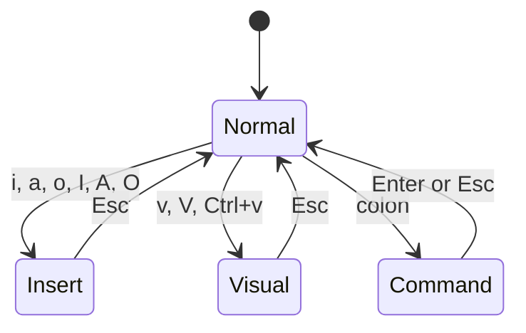

# Text Editing

When you're SSH'd into a remote server with no graphical interface, you need a terminal-based text editor. Vim is installed on virtually every Linux system and is the standard tool for editing configuration files, scripts, and code directly on the command line.

## What Is Vim?

Vim (Vi IMproved) is a modal text editor that runs entirely in your terminal. Unlike editors where every keystroke produces a character on screen, Vim separates the act of navigating and manipulating text from the act of typing it. You switch between distinct modes -- one for moving around, one for inserting text, one for selecting, and one for running commands. This separation is what makes Vim feel alien at first and indispensable once it clicks. Every key in Normal mode becomes a command rather than a letter, giving you a dense vocabulary for editing without ever reaching for a mouse or a menu.

## Why It Matters

You'll edit configuration files on remote servers, make quick fixes to scripts, and modify system settings -- all through the terminal. Knowing Vim means you're never stuck without an editor, regardless of what system you're working on. When you move into [Shell Scripting](/learn/foundations/shell-scripting/), you will write and debug Bash scripts, and Vim will be the editor you reach for to get it done.

## What You'll Learn

- Vim's modal editing: Normal, Insert, Visual, and Command modes
- Navigation: moving by character, word, line, and screen
- Editing: inserting, deleting, copying, pasting, and undoing
- Search and replace
- Working with multiple files and split windows
- Configuring Vim with `.vimrc`

---

## Opening, Saving, and Quitting

The very first thing you need to know is how to get in and out of Vim. This is not a joke -- "how do I exit Vim?" is one of the most viewed questions in the history of Stack Overflow, with millions of visits. Let's make sure you never have to search for it.

To open a file, pass its name as an argument:

```bash
vim myfile.txt
```

If the file does not exist, Vim creates it when you save. Once you are inside Vim, you issue commands by pressing `:` to enter Command mode, typing the command, and pressing `Enter`.

| Action | Command | Notes |
|---|---|---|
| Save | `:w` | Writes the current buffer to disk |
| Quit | `:q` | Exits Vim (fails if unsaved changes exist) |
| Save and quit | `:wq` | Writes then exits |
| Quit without saving | `:q!` | The `!` forces the quit, discarding changes |
| Save and quit (shorthand) | `ZZ` | Same as `:wq`, but from Normal mode |

> **Try It**: Open a new file with `vim practice.txt`, press `i` to enter Insert mode, type a few lines, press `Esc`, then type `:wq` and press `Enter` to save and quit. Open it again with `vim practice.txt` to confirm your text was saved.

One more tip before we go further: Vim ships with a built-in tutorial called `vimtutor`. Run it from your terminal:

```bash
vimtutor
```

It takes about 30 minutes and walks you through the basics interactively. Consider completing it alongside this guide.

---

## Vim's Modes

Vim's power comes from its modes. Each mode remaps your entire keyboard to a different purpose.

### Normal Mode

This is the default mode and the one you return to most often. In Normal mode, keys are commands. Pressing `j` moves the cursor down, `d` deletes, `y` copies. You do not type text in Normal mode. Press `Esc` at any time from any mode to return to Normal mode.

### Insert Mode

Insert mode is where Vim behaves like a traditional editor -- keystrokes produce characters on screen. You enter Insert mode from Normal mode with keys like `i`, `a`, or `o` (covered in detail in the Editing section). When you are done typing, press `Esc` to return to Normal mode.

### Visual Mode

Visual mode lets you select regions of text so you can operate on them (delete, copy, indent, etc.). Press `v` for character-wise selection, `V` for line-wise selection, or `Ctrl+v` for block (column) selection. Once your selection is highlighted, run a command like `d` (delete) or `y` (yank/copy) to act on it.

### Command Mode

Press `:` in Normal mode to enter Command mode. The cursor jumps to the bottom of the screen where you type Ex commands like `:w`, `:q`, `:%s/old/new/g`, and so on. Press `Enter` to execute the command or `Esc` to cancel and return to Normal mode.

### Mode Transitions

The diagram below shows how you move between modes. Normal mode is the hub -- you always pass through it.



A good habit is to stay in Normal mode by default. Enter Insert mode only when you need to type, then press `Esc` immediately when you are done. This keeps the full power of Normal-mode commands always one keystroke away.

> **Try It**: Open any file with `vim`. Press `i` to enter Insert mode (notice `-- INSERT --` at the bottom of the screen). Press `Esc` to return to Normal mode. Press `v` to enter Visual mode (notice `-- VISUAL --`). Press `Esc` again. Press `:` and notice the cursor jump to the command line at the bottom. Press `Esc` one more time. Practice until switching modes feels natural.

---

## Navigation

Efficient movement is where Vim starts to outperform other editors. In Normal mode, you navigate without arrow keys, without a mouse, and without lifting your fingers from the home row.

### Character Movement

| Key | Motion |
|---|---|
| `h` | Left one character |
| `j` | Down one line |
| `k` | Up one line |
| `l` | Right one character |

These map to the right hand on the home row. Your index finger rests on `j` (down), which is the direction you move through a file most often.

### Word Movement

| Key | Motion |
|---|---|
| `w` | Forward to the start of the next word |
| `b` | Backward to the start of the previous word |
| `e` | Forward to the end of the current word |

Words are sequences of letters, digits, and underscores by default. Use `W`, `B`, and `E` (uppercase) to move by whitespace-delimited WORDS, which skip over punctuation.

### Line Movement

| Key | Motion |
|---|---|
| `0` | Beginning of the line |
| `^` | First non-blank character of the line |
| `$` | End of the line |

### File Movement

| Key | Motion |
|---|---|
| `gg` | First line of the file |
| `G` | Last line of the file |
| `:{number}` | Go to a specific line number (e.g., `:42` jumps to line 42) |

### Screen Scrolling

| Key | Motion |
|---|---|
| `Ctrl+d` | Scroll down half a page |
| `Ctrl+u` | Scroll up half a page |
| `Ctrl+f` | Scroll down a full page |
| `Ctrl+b` | Scroll up a full page |

> **Try It**: Open a long file (try `/etc/services` if you need one) with `vim /etc/services`. Use `gg` to jump to the top, `G` to jump to the bottom, `:100` to go to line 100, `Ctrl+d` and `Ctrl+u` to scroll through the file. Practice `w` and `b` to hop between words on a line.

---

## Editing

Now for the core of what makes Vim productive: changing text.

### Entering Insert Mode

You already know `i` inserts text before the cursor. Vim gives you several entry points into Insert mode, each placing the cursor in a different position:

| Key | Action |
|---|---|
| `i` | Insert before the cursor |
| `a` | Append after the cursor |
| `o` | Open a new line below and enter Insert mode |
| `I` | Insert at the beginning of the line |
| `A` | Append at the end of the line |
| `O` | Open a new line above and enter Insert mode |

The distinction between `i` and `a`, or `o` and `O`, may seem minor, but each one saves you a motion command. Instead of pressing `i` and then arrowing to the end of the line, you press `A` once.

### Deleting Text

In Normal mode, delete commands remove text and stay in Normal mode:

| Command | Action |
|---|---|
| `x` | Delete the character under the cursor |
| `dd` | Delete the entire current line |
| `dw` | Delete from the cursor to the start of the next word |
| `D` | Delete from the cursor to the end of the line |
| `d$` | Same as `D` |
| `d0` | Delete from the cursor to the beginning of the line |

### Changing Text

The `c` (change) command deletes text and drops you into Insert mode so you can type a replacement:

| Command | Action |
|---|---|
| `cw` | Change from cursor to end of word |
| `cc` | Change the entire line |
| `C` | Change from cursor to end of line |
| `c$` | Same as `C` |

### Copying and Pasting

Vim calls copying "yanking." The yank commands work like delete commands but leave the text in place:

| Command | Action |
|---|---|
| `yy` | Yank (copy) the entire current line |
| `yw` | Yank from cursor to start of next word |
| `y$` | Yank from cursor to end of line |
| `p` | Paste after the cursor |
| `P` | Paste before the cursor |

Deleted text is also saved, so `dd` followed by `p` effectively moves a line. This is Vim's cut-and-paste.

> **Try It**: Open `vim practice.txt`, type a few lines in Insert mode, then press `Esc`. Position your cursor on a line and press `yy` to copy it, then `p` to paste it below. Try `dd` to cut a line, move the cursor somewhere else, and press `p` to paste it there.

### The Verb-Number-Noun Grammar

This is the single most important concept for understanding Vim's editing model. Vim commands follow a composable grammar:

```
[verb] [number] [noun]
```

- **Verb**: the action -- `d` (delete), `c` (change), `y` (yank)
- **Number**: how many times to repeat (optional, defaults to 1)
- **Noun**: the motion or text object -- `w` (word), `j` (line down), `$` (end of line)

Examples:

| Command | Read As | Effect |
|---|---|---|
| `d3w` | delete 3 words | Deletes the next three words |
| `y2j` | yank 2 lines down | Copies the current line and the two lines below it |
| `c2w` | change 2 words | Deletes the next two words and enters Insert mode |
| `d$` | delete to end of line | Deletes from cursor to end of line |
| `4dd` | 4 delete-line | Deletes four lines (number can come first) |
| `3j` | 3 down | Moves the cursor down three lines |
| `5x` | 5 delete-char | Deletes five characters |

This grammar is what makes Vim scale. You do not memorize hundreds of commands. You learn a handful of verbs, a handful of nouns, and combine them. The number of possible actions grows multiplicatively as you learn new verbs and motions.

> **Try It**: Open a file with several paragraphs. In Normal mode, try `d3w` to delete three words, then press `u` to undo. Try `c2w`, type replacement text, and press `Esc`. Try `y3j` followed by `p` to duplicate three lines. Experiment with combining different verbs, counts, and motions until the grammar feels intuitive.

---

## Undo and Redo

Vim has a powerful undo system that tracks every change you make.

| Command | Action |
|---|---|
| `u` | Undo the last change |
| `Ctrl+r` | Redo (undo the undo) |
| `.` | Repeat the last edit command |

You can press `u` repeatedly to walk backward through your edit history. Vim maintains an undo tree, not just a linear history, meaning even if you undo several changes and then make a new edit, the old branch of changes is not lost.

The `.` command is deceptively powerful. Say you delete a word with `dw`. Now you move to another word and press `.` -- it deletes that word too. Any edit command -- `dw`, `cw` followed by new text, `dd`, `x` -- can be replayed with `.`. This turns a two-step pattern (navigate, then repeat edit) into a fast, rhythmic workflow.

---

## Search and Replace

### Searching

From Normal mode, press `/` to start a forward search. Type your pattern and press `Enter`. Vim jumps to the first match.

| Command | Action |
|---|---|
| `/pattern` | Search forward for `pattern` |
| `?pattern` | Search backward for `pattern` |
| `n` | Jump to the next match (same direction) |
| `N` | Jump to the previous match (opposite direction) |
| `*` | Search forward for the word under the cursor |
| `#` | Search backward for the word under the cursor |

Search patterns support regular expressions. For example, `/^server` finds lines that start with "server."

### Replacing

Vim's substitute command uses the syntax:

```vim
:%s/old/new/flags
```

Breaking it down:

- `%` means "the entire file" (without it, the command operates on the current line only)
- `s` is the substitute command
- `old` is the pattern to find
- `new` is the replacement text
- `flags` modify behavior

Common flags:

| Flag | Meaning |
|---|---|
| `g` | Replace all occurrences on each line (without this, only the first match per line is replaced) |
| `c` | Ask for confirmation before each replacement |
| `i` | Case-insensitive matching |

Examples:

```vim
:%s/foo/bar/g        " Replace every 'foo' with 'bar' in the file
:%s/foo/bar/gc       " Replace with confirmation for each match
:s/old/new/g         " Replace only on the current line
:5,10s/old/new/g     " Replace only on lines 5 through 10
```

> **Try It**: Open a file and search for a common word with `/the`. Press `n` a few times to jump between matches. Now try a replacement: type `:%s/the/THE/gc` and press `Enter`. Vim will highlight each match and ask you to confirm -- press `y` to replace, `n` to skip. When you are done, press `u` repeatedly to undo all changes.

---

## Working with Multiple Files

As your projects grow, you will often need to view or edit more than one file at a time. Vim handles this through splits and buffers.

### Splits

Splits divide your Vim window into panes, each showing a file (or different parts of the same file).

| Command | Action |
|---|---|
| `:sp` or `:sp filename` | Horizontal split (top/bottom) |
| `:vs` or `:vs filename` | Vertical split (left/right) |
| `Ctrl+w h` | Move to the split on the left |
| `Ctrl+w j` | Move to the split below |
| `Ctrl+w k` | Move to the split above |
| `Ctrl+w l` | Move to the split on the right |
| `Ctrl+w w` | Cycle to the next split |
| `:close` or `Ctrl+w c` | Close the current split |
| `Ctrl+w =` | Equalize split sizes |

The pattern for moving between splits is `Ctrl+w` followed by a direction key (`h/j/k/l`), which mirrors the navigation keys you already know.

### Buffers

Every file you open in Vim becomes a buffer. Splits are views into buffers. You can have many buffers open without splitting the screen.

| Command | Action |
|---|---|
| `:e filename` | Open a file in the current window |
| `:ls` | List all open buffers |
| `:bn` | Switch to the next buffer |
| `:bp` | Switch to the previous buffer |
| `:b2` | Switch to buffer number 2 |
| `:bd` | Close the current buffer |

> **Try It**: Open a file with `vim`. Then type `:vs practice.txt` to open a vertical split. Edit text in one pane, then press `Ctrl+w l` to switch to the other. Type `:e /etc/hostname` to open a third file as a buffer. Run `:ls` to see all open buffers.

---

## Configuring Vim with .vimrc

Vim reads its configuration from `~/.vimrc` when it starts. This file lets you set default behaviors, key mappings, and preferences that apply every time you open Vim.

Create or edit your `.vimrc`:

```bash
vim ~/.vimrc
```

Here is a practical starter configuration with annotations:

```vim
" Enable syntax highlighting
syntax on

" Show line numbers
set number

" Set tab width to 4 spaces
set tabstop=4

" Use spaces instead of tab characters
set expandtab

" Number of spaces for auto-indent
set shiftwidth=4

" Copy indent from the current line when starting a new line
set autoindent

" Highlight all search matches
set hlsearch

" Show matches as you type the search pattern
set incsearch

" Case-insensitive search
set ignorecase

" Override ignorecase when the pattern contains uppercase letters
set smartcase

" Show the cursor position in the bottom-right corner
set ruler

" Highlight the current line
set cursorline

" Enable mouse support (useful when learning)
set mouse=a

" Show matching brackets when cursor is on one
set showmatch
```

Each line configures one behavior. Lines beginning with `"` are comments. You do not need to restart Vim to test changes -- you can reload your configuration at any time with:

```vim
:source ~/.vimrc
```

As you grow more comfortable with Vim, your `.vimrc` will grow with you. Many experienced users have configurations spanning hundreds of lines with custom key mappings, plugin settings, and functions. Start small and add settings as you discover what you need.

> **Try It**: Create a `~/.vimrc` file with the starter configuration above. Open a script or config file and notice the difference -- line numbers, syntax highlighting, and incremental search should now be active. Try searching with `/` to see `hlsearch` and `incsearch` in action.

---

## Vim Cheat Sheet

This table covers the most important commands from this guide in a single reference.

| Category | Command | Action |
|---|---|---|
| **File** | `vim filename` | Open file in Vim |
| | `:w` | Save |
| | `:q` | Quit |
| | `:wq` | Save and quit |
| | `:q!` | Quit without saving |
| **Modes** | `i` | Enter Insert mode (before cursor) |
| | `a` | Enter Insert mode (after cursor) |
| | `o` | Open line below, enter Insert mode |
| | `v` | Enter Visual mode |
| | `V` | Enter Visual line mode |
| | `:` | Enter Command mode |
| | `Esc` | Return to Normal mode |
| **Navigation** | `h/j/k/l` | Left / Down / Up / Right |
| | `w/b/e` | Next word / Previous word / End of word |
| | `0` / `$` | Start / End of line |
| | `gg` / `G` | Start / End of file |
| | `Ctrl+d` / `Ctrl+u` | Half-page down / up |
| | `:{n}` | Go to line n |
| **Editing** | `x` | Delete character |
| | `dd` | Delete line |
| | `dw` | Delete word |
| | `D` | Delete to end of line |
| | `cw` | Change word |
| | `cc` | Change line |
| | `yy` | Yank (copy) line |
| | `yw` | Yank word |
| | `p` / `P` | Paste after / before cursor |
| **Undo** | `u` | Undo |
| | `Ctrl+r` | Redo |
| | `.` | Repeat last edit |
| **Search** | `/pattern` | Search forward |
| | `?pattern` | Search backward |
| | `n` / `N` | Next / Previous match |
| | `:%s/old/new/g` | Replace all in file |
| | `:%s/old/new/gc` | Replace all with confirmation |
| **Splits** | `:sp` | Horizontal split |
| | `:vs` | Vertical split |
| | `Ctrl+w h/j/k/l` | Move between splits |
| **Buffers** | `:e filename` | Open file |
| | `:ls` | List buffers |
| | `:bn` / `:bp` | Next / Previous buffer |

---

## Key Takeaways

- Vim is a modal editor with four primary modes: Normal (navigation and commands), Insert (typing text), Visual (selecting text), and Command (Ex commands). Normal mode is home base -- always return to it when you finish typing.
- Navigation uses `h/j/k/l` for characters, `w/b/e` for words, `0/$` for line ends, and `gg/G` for file ends. Staying on the home row is faster than arrow keys or a mouse.
- Vim's editing grammar follows a **verb-number-noun** pattern (`d3w` = delete 3 words). Learning a few verbs (`d`, `c`, `y`) and a few nouns (`w`, `$`, `j`, `G`) gives you a combinatorial set of commands.
- Undo (`u`), redo (`Ctrl+r`), and repeat (`.`) let you work fearlessly. Experiment freely knowing you can always undo.
- Search with `/pattern` and replace with `:%s/old/new/g`. Add the `c` flag for confirmation on each match.
- Splits (`:sp`, `:vs`) and buffers (`:e`, `:ls`, `:bn`) let you work with multiple files without leaving Vim.
- Your `~/.vimrc` file is your personal Vim configuration. Start with the basics -- line numbers, syntax highlighting, sensible search settings -- and grow it over time.
- Run `vimtutor` from your terminal for an interactive 30-minute tutorial that reinforces everything covered here.
