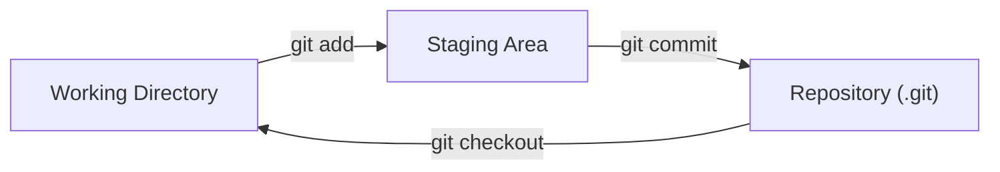
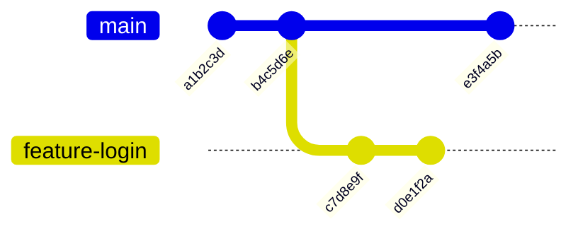
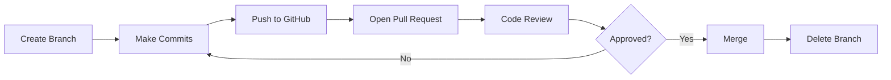

# Version Control

Every piece of code, configuration, and infrastructure definition should be tracked in version control. Git is the standard tool, and GitHub is the most widely used platform for hosting and collaborating on Git repositories.

## What Is Version Control?

Version control tracks changes to files over time, letting you revert to previous versions, compare changes, and collaborate with others without overwriting each other's work. Git is a **distributed** version control system — every contributor has a full copy of the repository history on their local machine. This means you can commit, branch, and view history even without a network connection. The remote server (GitHub, GitLab, Bitbucket) is just another copy that the team agrees to treat as the source of truth.

## Why It Matters

Infrastructure as code, CI/CD pipelines, Kubernetes manifests, Dockerfiles — all of these live in Git repositories. Understanding Git is essential for collaboration, code review, and maintaining a reliable history of every change to your systems. When a deployment breaks at 2 a.m. and you need to find out exactly what changed, Git gives you the answer. When two engineers work on the same file at the same time, Git provides the tools to merge their changes cleanly. In later sections on [CI/CD](/learn/foundations/cicd/) and [Infrastructure as Code](/learn/foundations/iac/), you will see that every automated workflow starts with a Git commit.

## What You'll Learn

- Creating and cloning repositories
- Staging, committing, and viewing history
- Branching and merging strategies
- Resolving merge conflicts
- Pull requests and code review on GitHub
- GitHub workflows and collaboration patterns
- `.gitignore` and repository hygiene

---

## Installing and Configuring Git

Before you can use Git, you need to install it and tell it who you are. Every commit you make is stamped with your name and email address, so Git requires this configuration up front.

### Installing Git

On Ubuntu or other Debian-based distributions:

```bash
sudo apt update
sudo apt install git
```

On macOS, Git comes pre-installed with the Xcode Command Line Tools. If it is not present, install it with:

```bash
xcode-select --install
```

Verify the installation:

```bash
git --version
```

```
git version 2.43.0
```

### Configuring Your Identity

Set your name and email globally. These values are embedded in every commit you create:

```bash
git config --global user.name "Your Name"
git config --global user.email "your.email@example.com"
```

Set the default branch name to `main` (Git historically used `master`, but `main` is the modern convention):

```bash
git config --global init.defaultBranch main
```

Verify your configuration:

```bash
git config --list
```

```
user.name=Your Name
user.email=your.email@example.com
init.defaultbranch=main
```

These settings are stored in `~/.gitconfig`. You can also set per-repository configuration by omitting the `--global` flag while inside a repository directory.

> **Try It**: Install Git if you have not already. Configure your name, email, and default branch. Run `git config --list` to verify everything is set correctly. Then open `~/.gitconfig` with `cat ~/.gitconfig` to see where the values are stored.

---

## Your First Repository

A **repository** (or "repo") is a directory whose history Git tracks. It contains your files plus a hidden `.git` directory that stores every commit, branch, and configuration.

### Initializing a Repository

Create a new project directory and initialize it:

```bash
mkdir my-project
cd my-project
git init
```

```
Initialized empty Git repository in /home/cloudchase/my-project/.git/
```

The `git init` command creates the `.git` directory. Everything Git needs to track history lives inside that folder. If you delete `.git`, you lose all version history (the files themselves remain). Never manually edit anything inside `.git` unless you know exactly what you are doing.

### The Three Areas

Git organizes your work into three areas. Understanding this model is critical — nearly every Git operation moves changes between these areas.



| Area | What It Holds |
|---|---|
| **Working Directory** | The files you see and edit on disk. This is your normal project folder. |
| **Staging Area** (also called the "index") | A holding area for changes you intend to include in the next commit. `git add` moves changes here. |
| **Repository** (`.git` directory) | The permanent history. `git commit` takes everything in the staging area and saves it as a snapshot. |

This three-area model gives you precise control. You can edit ten files but commit only three of them by staging just those three. This lets you create focused, meaningful commits instead of dumping every change into one.

> **Try It**: Create a new directory and initialize a repository with `git init`. Run `ls -la` to see the hidden `.git` directory. Then run `git status` to see what Git reports for an empty repository.

---

## The Basic Workflow

The daily Git workflow is a loop: edit files, stage changes, commit, repeat. Every other Git operation builds on this foundation.

### Checking Status

`git status` is the command you will run most often. It tells you which files have been modified, which are staged, and which are untracked:

```bash
git status
```

```
On branch main

No commits yet

nothing to commit (create/copy files and use "git add" to track)
```

### Creating and Staging Files

Create a file and check the status:

```bash
echo "# My Project" > README.md
git status
```

```
On branch main

No commits yet

Untracked files:
  (use "git add <file>..." to include in what will be committed)
	README.md

nothing added to commit but untracked files present (use "git add" to track)
```

Git sees the file but is not tracking it. Use `git add` to move it to the staging area:

```bash
git add README.md
```

To stage multiple specific files:

```bash
git add file1.txt file2.txt file3.txt
```

To stage all changes in the current directory (use carefully):

```bash
git add .
```

### Committing

Once changes are staged, `git commit` saves them as a permanent snapshot:

```bash
git commit -m "Add project README"
```

```
[main (root-commit) a1b2c3d] Add project README
 1 file changed, 1 insertion(+)
 create mode 100644 README.md
```

The `-m` flag lets you write the message inline. Every commit gets a unique hash (like `a1b2c3d`) that identifies it forever.

### Writing Good Commit Messages

Commit messages are documentation for your future self and your team. A good message explains **why** a change was made, not just what changed. Follow these conventions:

- **Use imperative mood**: "Add feature" not "Added feature" or "Adds feature"
- **Keep the first line under 72 characters**: This is the summary that appears in logs and pull requests
- **Explain why, not what**: The diff shows what changed. The message should explain the reasoning.

Good examples:

```
Add health check endpoint for load balancer
Fix timeout on database connection retry
Remove deprecated API v1 routes
```

Bad examples:

```
updated stuff
fix
changes to the code
WIP
```

For longer explanations, omit `-m` and Git will open your default text editor. Write a short summary on the first line, leave a blank line, then add a detailed explanation:

```
Add rate limiting to API gateway

The API was receiving excessive traffic from automated scrapers,
causing degraded performance for legitimate users. This adds a
token bucket rate limiter at 100 requests per minute per IP.
```

### Viewing History

`git log` shows the commit history:

```bash
git log
```

```
commit a1b2c3d4e5f6a7b8c9d0e1f2a3b4c5d6e7f8a9b0 (HEAD -> main)
Author: Your Name <your.email@example.com>
Date:   Wed Jan 15 10:30:00 2025 -0500

    Add project README
```

The `--oneline` flag gives a compact view:

```bash
git log --oneline
```

```
a1b2c3d Add project README
```

The `--graph` flag visualizes branches:

```bash
git log --oneline --graph --all
```

This becomes invaluable when working with multiple branches. You will use it constantly.

### Viewing Differences

`git diff` shows exactly what changed:

```bash
git diff                    # changes in working directory (not yet staged)
git diff --staged           # changes in staging area (ready to commit)
git diff HEAD               # all changes since last commit (staged + unstaged)
git diff a1b2c3d b4c5d6e   # differences between two specific commits
```

Learning to read diffs is a core skill. Lines prefixed with `+` were added. Lines prefixed with `-` were removed. Context lines (unchanged) have no prefix.

> **Try It**: In your repository, create a file called `app.py` with a few lines of Python. Stage it with `git add app.py` and commit with `git commit -m "Add application entry point"`. Then edit the file, run `git diff` to see your changes, stage them with `git add app.py`, run `git diff --staged` to verify, and commit again. Run `git log --oneline` to see both commits.

---

## Branching

Branches are one of Git's most powerful features. A branch lets you work on a new feature, bug fix, or experiment without affecting the main codebase. When the work is ready, you merge it back.

### What Branches Are

A branch in Git is simply a lightweight pointer to a specific commit. The default branch is `main`. When you create a new branch, Git creates a new pointer — it does not copy any files. This makes branches extremely fast and cheap to create.



In this diagram, `main` and `feature-login` diverged after commit `b4c5d6e`. Each branch has its own commits that do not affect the other.

### Creating and Switching Branches

List all branches (the `*` marks the current branch):

```bash
git branch
```

```
* main
```

Create a new branch:

```bash
git branch feature-login
```

Switch to it:

```bash
git switch feature-login
```

Or create and switch in one command:

```bash
git switch -c feature-login
```

The older syntax `git checkout` also works:

```bash
git checkout -b feature-login     # create and switch (older syntax)
git checkout main                 # switch to an existing branch
```

`git switch` was introduced specifically for branch switching and is the recommended approach because `git checkout` is overloaded with other behaviors.

### Deleting Branches

After merging a feature branch, delete it to keep the repository tidy:

```bash
git branch -d feature-login       # safe delete (refuses if unmerged)
git branch -D feature-login       # force delete (even if unmerged)
```

Use `-d` by default. Only use `-D` when you are certain you want to discard unmerged work.

### Branch Naming Conventions

Good branch names communicate intent. Common patterns:

| Prefix | Purpose | Example |
|---|---|---|
| `feature/` | New functionality | `feature/user-auth` |
| `fix/` | Bug fix | `fix/login-timeout` |
| `hotfix/` | Urgent production fix | `hotfix/security-patch` |
| `chore/` | Maintenance work | `chore/update-dependencies` |
| `docs/` | Documentation | `docs/api-reference` |

Use lowercase letters, hyphens to separate words, and keep names short but descriptive. Avoid spaces and special characters.

> **Try It**: From `main`, create a branch called `feature/hello-world`. Switch to it. Create a file called `hello.py` with a print statement, stage it, and commit. Run `git log --oneline --graph --all` to see the branch structure. Switch back to `main` and confirm that `hello.py` does not exist there.

---

## Merging

Merging integrates changes from one branch into another. It is how feature work returns to `main`.

### Fast-Forward Merge

When `main` has not received any new commits since the branch was created, Git can simply move the `main` pointer forward. This is called a **fast-forward merge**:

```bash
git switch main
git merge feature-login
```

```
Updating b4c5d6e..d0e1f2a
Fast-forward
 login.py | 15 +++++++++++++++
 1 file changed, 15 insertions(+)
 create mode 100644 login.py
```

No new commit is created. The `main` pointer simply advances to where `feature-login` was.

### Three-Way Merge

When both branches have new commits since they diverged, Git performs a **three-way merge**. It finds the common ancestor, compares both branches against it, and creates a new **merge commit** that combines the changes:

```bash
git switch main
git merge feature-login
```

```
Merge made by the 'ort' strategy.
 login.py | 15 +++++++++++++++
 1 file changed, 15 insertions(+)
 create mode 100644 login.py
```

The resulting merge commit has two parents — the tips of both branches.

### Resolving Merge Conflicts

A conflict occurs when both branches changed the same lines in the same file. Git cannot decide which version to keep, so it asks you to resolve it manually.

When a conflict happens, Git marks the file with conflict markers:

```python
def get_timeout():
<<<<<<< HEAD
    return 30
=======
    return 60
>>>>>>> feature-login
```

The markers divide the file into sections:

| Marker | Meaning |
|---|---|
| `<<<<<<< HEAD` | Start of the current branch's version |
| `=======` | Divider between the two versions |
| `>>>>>>> feature-login` | Start of the incoming branch's version |

To resolve the conflict:

1. Open the file in your editor.
2. Decide which version to keep (or combine both).
3. Remove the conflict markers entirely.
4. Stage the resolved file and commit.

```python
def get_timeout():
    return 45
```

```bash
git add app.py
git commit -m "Resolve timeout conflict, use 45 seconds"
```

Conflicts sound intimidating but they are a normal part of collaboration. The key is to understand both changes, decide on the correct result, and make sure the conflict markers are completely removed. Leaving a `<<<<<<<` marker in a committed file is a common beginner mistake that breaks the code.

> **Try It**: Create a branch called `feature/conflict-practice`. On that branch, create a file called `config.txt` with the line `timeout=30` and commit it. Switch to `main`, create the same file with `timeout=60`, and commit. Merge `feature/conflict-practice` into `main`. Git will report a conflict. Open `config.txt`, resolve it by picking a value, remove the markers, stage, and commit.

---

## Working with GitHub

So far, everything has been local. GitHub (and similar platforms like GitLab and Bitbucket) hosts remote repositories so teams can collaborate.

### What Are Remotes?

A **remote** is a copy of the repository hosted on a server. By convention, the primary remote is named `origin`. You push local commits to the remote and pull other people's commits from it.

### Creating a Repository on GitHub

1. Go to [github.com](https://github.com) and click **New repository**.
2. Give it a name (e.g., `my-project`).
3. Leave it empty (do not initialize with a README if you already have a local repo).
4. Copy the repository URL.

### Connecting Local to Remote

Add the remote to your existing local repository:

```bash
git remote add origin https://github.com/yourusername/my-project.git
```

Verify:

```bash
git remote -v
```

```
origin  https://github.com/yourusername/my-project.git (fetch)
origin  https://github.com/yourusername/my-project.git (push)
```

### Pushing Changes

Push your local `main` branch to GitHub:

```bash
git push -u origin main
```

The `-u` flag sets the upstream tracking relationship. After this, you can simply run `git push` without specifying the remote and branch.

Push subsequent commits:

```bash
git push
```

### Pulling Changes

Pull fetches changes from the remote and merges them into your current branch:

```bash
git pull
```

This is equivalent to `git fetch` followed by `git merge`. If a teammate has pushed commits that you do not have locally, `git pull` brings them in.

### Cloning a Repository

To get a copy of an existing remote repository:

```bash
git clone https://github.com/someuser/some-project.git
```

This creates a directory called `some-project`, downloads the full history, and sets up `origin` automatically.

```bash
cd some-project
git log --oneline
```

### HTTPS vs SSH

Git supports two protocols for communicating with remotes:

| Protocol | URL Format | Authentication |
|---|---|---|
| **HTTPS** | `https://github.com/user/repo.git` | Username + personal access token (or credential manager) |
| **SSH** | `git@github.com:user/repo.git` | SSH key pair (public key registered on GitHub) |

HTTPS works out of the box and is easier to set up. SSH avoids entering credentials repeatedly and is the standard for daily development. To use SSH, generate a key pair with `ssh-keygen`, add the public key to your GitHub account settings, and use the SSH URL format for remotes. You will explore SSH in detail in [Networking Fundamentals](/learn/foundations/networking-fundamentals/).

> **Try It**: Create a new repository on GitHub. In your local `my-project` directory, add the remote with `git remote add origin <URL>`. Push your commits with `git push -u origin main`. Visit the repository on GitHub and verify that your files and commit history appear. Then clone the repository to a different directory with `git clone` and confirm the contents match.

---

## Pull Requests

A **pull request** (PR) is a proposal to merge one branch into another on GitHub. Pull requests are the centerpiece of team collaboration — they provide a structured place for code review, discussion, and automated checks before changes reach `main`.

### The Pull Request Workflow



1. **Create a branch** for your work (`feature/user-auth`).
2. **Make commits** on that branch as you develop.
3. **Push the branch** to GitHub (`git push -u origin feature/user-auth`).
4. **Open a pull request** on GitHub comparing your branch to `main`.
5. **Code review**: teammates read your changes, leave comments, and request modifications.
6. **Iterate** if needed: push more commits to the same branch, and the PR updates automatically.
7. **Merge** the PR once it is approved.
8. **Delete the branch** after merging (GitHub offers a button for this).

### Opening a Pull Request

After pushing your branch, GitHub usually displays a banner offering to create a PR. You can also do it from the command line using the GitHub CLI:

```bash
gh pr create --title "Add user authentication" --body "Implements login and session management"
```

Or navigate to the repository on GitHub, click **Pull requests**, then **New pull request**, select your branch, and fill in the details.

A good PR description explains:

- **What** the change does
- **Why** it is needed
- **How** to test it
- Any **risks** or areas that need careful review

### Code Review

Code review is not just about finding bugs. It serves multiple purposes:

- **Knowledge sharing**: Reviewers learn about parts of the codebase they might not work on directly.
- **Quality**: A second pair of eyes catches logic errors, security issues, and readability problems.
- **Consistency**: Reviews enforce team standards for naming, structure, and documentation.

As a reviewer, focus on:

- Does the code do what the PR description claims?
- Are there edge cases that are not handled?
- Is the code readable and maintainable?
- Are there tests?

Leave constructive, specific comments. "This is wrong" is not helpful. "This will fail when the input is empty because line 42 does not check for None" is helpful.

### Merge Strategies

When merging a PR, GitHub offers three strategies:

| Strategy | What It Does | When to Use |
|---|---|---|
| **Merge commit** | Creates a merge commit that combines both branches. All individual commits are preserved. | Default. Good for preserving full history. |
| **Squash and merge** | Combines all commits in the PR into a single commit on `main`. | When the PR has many small "WIP" commits and you want a clean history. |
| **Rebase and merge** | Replays each commit on top of `main` without a merge commit. | When you want a linear history with no merge commits. |

For most teams, **squash and merge** strikes the best balance: each PR becomes a single, meaningful commit on `main`, making history easy to read and revert.

### After Merging

After the PR is merged:

1. Delete the remote branch (GitHub provides a button or run `git push origin --delete feature/user-auth`).
2. Switch to `main` locally and pull the merged changes:

```bash
git switch main
git pull
```

3. Delete the local branch:

```bash
git branch -d feature/user-auth
```

This keeps both the remote and local repository clean. Stale branches accumulate quickly on active projects and make it harder to find active work.

---

## .gitignore

Not every file belongs in version control. Build artifacts, dependency directories, environment files with secrets, and OS-generated files should be excluded. The `.gitignore` file tells Git which files and patterns to ignore.

### How It Works

Create a `.gitignore` file at the root of your repository. Each line specifies a pattern:

```bash
# Dependencies
node_modules/
venv/
.venv/
__pycache__/

# Environment and secrets
.env
.env.local
*.pem
credentials.json

# Build artifacts
dist/
build/
*.pyc
*.o

# IDE and OS files
.vscode/
.idea/
*.swp
.DS_Store
Thumbs.db

# Terraform state (contains sensitive data)
*.tfstate
*.tfstate.backup
.terraform/

# Log files
*.log
```

### Pattern Rules

| Pattern | Matches |
|---|---|
| `*.log` | Any file ending in `.log` in any directory |
| `build/` | The `build` directory and everything inside it |
| `/config.local` | `config.local` only in the repository root (not in subdirectories) |
| `!important.log` | Exception — track this file even though `*.log` is ignored |
| `**/temp` | A directory called `temp` anywhere in the repository |

### Important Rules

- `.gitignore` only affects **untracked** files. If a file is already committed, adding it to `.gitignore` will not remove it. You must explicitly untrack it first:

```bash
git rm --cached .env
git commit -m "Remove .env from tracking"
```

- Never commit secrets, API keys, private keys, or credentials. Use `.gitignore` to exclude them and use environment variables or secret management tools instead.
- Commit your `.gitignore` file. It is part of the project and should be shared with the team.

GitHub maintains a collection of `.gitignore` templates for various languages and frameworks at [github.com/github/gitignore](https://github.com/github/gitignore). Use these as starting points.

> **Try It**: In your repository, create a `.gitignore` file with a few patterns (e.g., `*.log`, `__pycache__/`, `.env`). Create files that match those patterns: `touch debug.log .env`. Run `git status` and confirm Git does not list the ignored files. Then create a file that does not match any pattern and verify Git does show it as untracked.

---

## Common Workflows

Now that you understand the individual commands, here is how they come together in real-world workflows.

### Solo Developer Workflow

When working alone on a project, the workflow is straightforward:

1. Work on `main` or create short-lived branches for features.
2. Commit frequently with clear messages.
3. Push to GitHub for backup and visibility.

```bash
git add .
git commit -m "Add input validation for email field"
git push
```

### Team Feature Branch Workflow

On a team, no one commits directly to `main`. Instead:

1. Pull the latest `main`:

```bash
git switch main
git pull
```

2. Create a feature branch:

```bash
git switch -c feature/email-validation
```

3. Work, commit, and push:

```bash
git add .
git commit -m "Add email format validation"
git push -u origin feature/email-validation
```

4. Open a pull request on GitHub.
5. Address review feedback with additional commits.
6. Merge the PR and clean up branches.

This is the workflow used by the majority of professional software teams. You will see it again in [CI/CD](/learn/foundations/cicd/), where automated tests and deployment pipelines are triggered by pull requests and merges to `main`.

### Keeping Your Branch Up to Date

While you work on a feature branch, other teammates merge their PRs into `main`. To incorporate their changes into your branch:

```bash
git switch main
git pull
git switch feature/email-validation
git merge main
```

This brings the latest `main` changes into your feature branch. Resolve any conflicts that arise. Keeping your branch current reduces the chance of large, painful merge conflicts when you finally open your PR.

---

## Git Quick Reference

This table covers the commands you will use most often. Bookmark it and refer back as you practice.

| Category | Command | Description |
|---|---|---|
| **Setup** | `git config --global user.name "Name"` | Set your commit author name |
| | `git config --global user.email "email"` | Set your commit author email |
| | `git config --list` | Show all configuration values |
| **Create** | `git init` | Initialize a new repository in the current directory |
| | `git clone <url>` | Clone a remote repository to your machine |
| **Stage** | `git add <file>` | Stage a specific file |
| | `git add .` | Stage all changes in the current directory |
| | `git rm --cached <file>` | Unstage a file (remove from tracking without deleting) |
| **Commit** | `git commit -m "message"` | Commit staged changes with a message |
| | `git commit --amend` | Modify the most recent commit |
| **Status** | `git status` | Show the state of working directory and staging area |
| | `git diff` | Show unstaged changes |
| | `git diff --staged` | Show staged changes |
| **History** | `git log` | Show commit history |
| | `git log --oneline` | Compact commit history |
| | `git log --oneline --graph --all` | Visual branch history |
| **Branch** | `git branch` | List local branches |
| | `git branch <name>` | Create a new branch |
| | `git switch <name>` | Switch to a branch |
| | `git switch -c <name>` | Create and switch to a new branch |
| | `git branch -d <name>` | Delete a merged branch |
| **Merge** | `git merge <branch>` | Merge a branch into the current branch |
| **Remote** | `git remote add origin <url>` | Add a remote repository |
| | `git remote -v` | List remotes and their URLs |
| | `git push -u origin <branch>` | Push a branch and set upstream tracking |
| | `git push` | Push commits to the tracked remote branch |
| | `git pull` | Fetch and merge changes from the remote |
| | `git fetch` | Download remote changes without merging |
| **Undo** | `git restore <file>` | Discard changes in working directory |
| | `git restore --staged <file>` | Unstage a file (keep changes in working directory) |
| | `git revert <commit>` | Create a new commit that undoes a previous commit |

---

## Key Takeaways

- Git is a distributed version control system. Every clone contains the full project history, giving you the ability to work offline and independently.
- The three areas — working directory, staging area, and repository — give you precise control over what goes into each commit. Use `git add` to stage and `git commit` to save.
- Write commit messages in imperative mood that explain **why** a change was made. Good commit messages are documentation that pays dividends when debugging.
- Branches are lightweight pointers to commits. Use them for every feature, fix, and experiment. Never work directly on `main` in a team setting.
- Merging integrates branch work. Fast-forward merges advance a pointer; three-way merges create a merge commit. Conflicts are normal — resolve them by editing the file, removing markers, and committing.
- GitHub hosts remote repositories and provides pull requests for code review. The workflow is: branch, commit, push, open PR, review, merge, delete branch.
- Pull requests are not just about code — they are about knowledge sharing, quality, and consistency. Write clear descriptions and give constructive reviews.
- `.gitignore` prevents secrets, build artifacts, and OS files from entering version control. Always commit your `.gitignore` and never commit credentials.
- The feature branch workflow (branch from `main`, work, PR, merge back) is the industry standard. You will use it daily in every professional engineering role.
